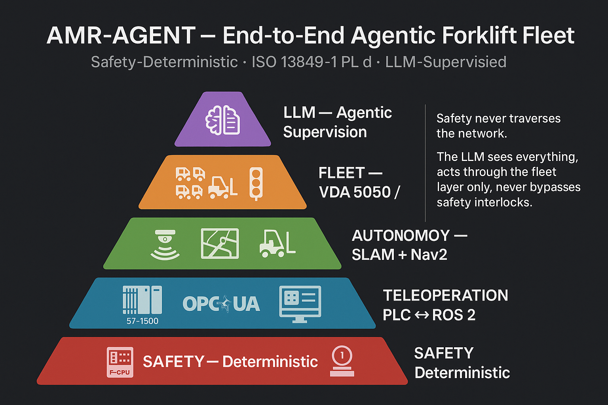

# amr-agent

**A simulated forklift, a real fail-safe PLC program deciding what it is
allowed to do — and now an autopilot driving under that decision.**

The vehicle lives in Gazebo. The decisions live in a Siemens S7-1516F
safety program, built in TIA Portal and run on S7-PLCSIM Advanced —
e-stop chain, three safety laser scanners, a two-channel speed
cross-check, a monitored reset. On top of that chain sits a lean
autonomy layer: ten stations painted into the warehouse, a waypoint
router, a roof lidar guarding the path, and an operator screen where you
pick a station and press GO. The safety program can refuse all of it at
any moment, and the point of this repo is watching it do exactly that.

The project's purpose is a simulation environment for **demonstrating
safety functions** and exercising **PL d-style requirements** against a
live F-program — e-stop, protective and warning fields, speed
monitoring, monitored reset — with autonomous and teleoperated motion
running underneath them.

*The stack, bottom-up: the three lower layers are running today (M5);
the fleet and LLM layers are the road ahead (M6, M7). Safety never
traverses the network — the LLM sees everything, acts through the fleet
layer only, and can bypass no interlock.*

## Watch it run

**1 · Safety + Autonomous Drive:**

*▶ [**Watch**](https://youtu.be/0svQWMT256A) — pick a station on the
sketch, press GO: reverse-out departures from the rack faces,
pure-pursuit runs down the aisles, the roof lidar guarding the path —
and the F-program holding the drive enable, the fields and the speed
ceiling over every metre of it.*

**2 · Safety + Teleoperation:**

*▶ [**Watch**](https://www.youtube.com/watch?v=InZRcy_WUXY) — one
continuous teleoperated session with the safety layer live: the drive
enable refused until the first acknowledge, an e-stop that latches
through its own release, a protective field that stops the truck and
refuses to un-stop while the cause stands, the warning field dropping
the speed ceiling, and an injected encoder fault caught by the
cross-check.*

*(The first build's own demonstration is linked from
[its runbook](docs/claude-supervised-m5/RUNBOOK.md).)*

## The system

Three layers on two machines, each with exactly one writer:

| Layer | Runs on | What |
|---|---|---|
| **Safety PLC** | Windows — TIA Portal, S7-PLCSIM Advanced (`PLC_2`) | The F-program: three ESTOP1 chains AND-ed into one `Motor` enable, a speed ceiling (`V_Limit`), monitoring cases. [`safety_summary.pdf`](safety_summary.pdf) is its Safety Administration printout. A control-panel window ([`m5_ver2/step5/windows/step5.py`](m5_ver2/step5/windows/)) plays the field wiring: e-stop buttons, reset, encoder fault injection. |
| **Plant + operator** | WSL2 — Gazebo, ROS 2 Jazzy | The warehouse, the forklift model with its three safety scanners and roof nav lidar, and the operator HMI: joystick, warehouse sketch, station selector, GO/STOP. |
| **Vehicle software** | WSL2, run **from a frozen deploy copy** | The industrial-PC layer: PLC link, sensor/field/encoder chains, the command gate, the teleop/auto mux and the autopilot — deployed by manifest exactly as a real vehicle would receive an image ([`m5_ver2/step5/deploy`](m5_ver2/step5/)). |

Every command — joystick or autopilot — passes the same seam:
`mux → gate → contactor → plant`, and the gate obeys the PLC's `Motor`
bit and speed ceiling on every message. Silence anywhere fails closed.

**Quickstart: [RUNBOOK.md](RUNBOOK.md).** Depth per component:
[`m5_ver2/step5/README_step5.md`](m5_ver2/step5/README_step5.md), with
its measured evidence in [`m5_ver2/step5/PROOF.md`](m5_ver2/step5/PROOF.md).

## Milestones

| Gate | Scope | Status |
|---|---|---|
| M0 | Repo skeleton, invariants (ADR 0001) | ✅ |
| M1 | Interface contracts — VDA 5050 subset, OPC UA node model | ✅ |
| M2 | Safety requirements spec | ✅ |
| M3 | Fixed equipment I/O loop — Gazebo ↔ PLC both directions, measured | ✅ |
| M4 | Forklift commissioning cell — teleop through the PLC standard program | ✅ |
| M5 | Sensored autonomous forklift — the safety chain live under teleop **and** autonomy | ✅ |
| M6 | VDA 5050 fleet at scale — 4 forklifts, 10 stations, traffic avoidance | ⏳ |
| M7 | LLM operations layer + recorded end-to-end demonstration | ⏳ |
| M8 | Beckhoff/TwinCAT vendor portability — same bridge, different PLC | ⏳ |

## How the repo is laid out

| Tree | What it is |
|---|---|
| [`m5_ver2/`](m5_ver2/) | **The current system.** Built as five frozen steps, each a verified copy of the last; [`step5/`](m5_ver2/step5/) is the one that runs. [`m5_ver2/CLAUDE.md`](m5_ver2/CLAUDE.md) holds the PLC ground truth and working agreements. |
| [`agv/`](agv/) | Shared vehicle assets used in place by both eras: the forklift config, I/O translator and STO contactor. |
| [`m5-plc-debug/`](m5-plc-debug/) | The hand-debug chapter: the safety-PLC ↔ Gazebo loop isolated and made to work, script by script. |
| [`bridge/`](bridge/) · [`fleet/`](fleet/) · [`hmi/`](hmi/) · [`sim/`](sim/) · [`viz/`](viz/) · [`plc/`](plc/) | The claude-supervised layered stack — the first M5, still runnable: [its runbook](docs/claude-supervised-m5/RUNBOOK.md). |
| [`docs/`](docs/) | ADRs 0001–0015, interface contracts, safety spec, validation evidence, and the archived planning history — [index](docs/README.md). |
| [`.archive/`](.archive/) | The legacy entry scripts (`demo.sh`, `stack.sh`) the claude-supervised runbook uses. |

## How it got here

M5 was built twice, deliberately. The first build — the layered stack
above — proved the architecture under Claude supervision. The owner then
took the safety loop apart by hand in `m5-plc-debug/` until every PLC
signal was understood, and rebuilt the vehicle in `m5_ver2/` as five
verified steps: e-stop chain, safety scanners, encoder channels, the
three-scanner teleop loop, and finally the autonomy layer. Each step is
a frozen copy with its own proof; the last one is the system this README
describes. The full account, and how to run the first build, is in
[`docs/claude-supervised-m5/RUNBOOK.md`](docs/claude-supervised-m5/RUNBOOK.md).
