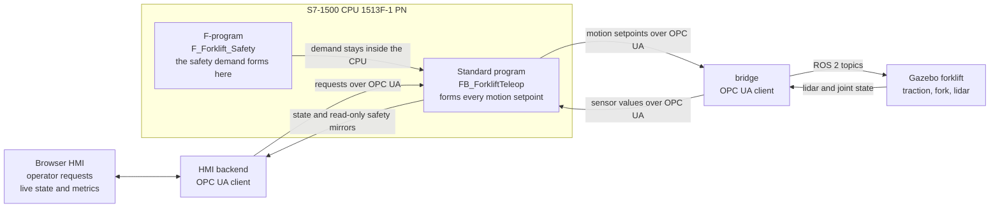

# amr-agent

**A PLC-supervised AMR fleet, built simulation-first with production-grade layer discipline.**

An operator drives a simulated forklift from a commissioning HMI while a Siemens
S7-1500 forms every motion setpoint in between — HMI → PLC → bridge → Gazebo, and
the state report back the same way over live OPC UA. The recording below is one
continuous run, not a scripted animation and not a replay.

*15 s of one live commissioning run. The operator holds FORK UP; past 0.50 m the
standard program asserts `ForkliftSpeedLimitActive` and forms the traction
setpoint as demand × 0.30, so a full-deflection -1.0 request leaves
`ForkliftTractionSpeedRef` at -0.300 m/s. The HMI writes requests and reads
state — it commands no actuator — and the speed reduction is standard-program
process logic, not a safety function. Full 48 s run, watch table readable:
[`assets/teleop-showcase.mp4`](assets/teleop-showcase.mp4).*

---

## Architecture

Layers talk only to their neighbours. The S7-1500 standard program owns fixed
equipment, interlocks and every motion setpoint. The safety functions belong to an
F-CPU safety program that must stay correct if the standard program halts; they are
specified in [`docs/safety/`](docs/safety/), and their cell-scope core is being built
early on the forklift twin
([ADR 0009](docs/adr/0009-early-cell-scope-safety-on-the-forklift-twin.md)). The
commissioning HMI and, later, the fleet manager are OPC UA *clients* of the PLC,
never the reverse, and a bridge translates ROS 2 topics to OPC UA so the simulation
never addresses the PLC directly. Thirteen invariants are locked by
[ADR 0001](docs/adr/0001-architecture-invariants.md) — safety never traverses the
network, loss of network is a degraded mode rather than a safety event, the PLC is
the OPC UA server. The topology they are drawn in is
[CLAUDE.md §3](CLAUDE.md#3-topology), and every top-level directory's README opens
with *This layer must not access*.

*The network carries process data and read-only safety mirrors only. The safety
demand forms inside the CPU and never leaves it, so invariant 1 holds by
construction rather than by assertion.*

---

## Milestones

M3 closed 2026-07-28, verified in
[docs/reports/m3-37-gate-verification.md](docs/reports/m3-37-gate-verification.md)
(pass-with-findings). Next gate: **M4 — Forklift commissioning cell**. Tracked in
[docs/roadmap.md](docs/roadmap.md); a gate closes only on observable
behaviour, never on written code.

| Gate | Deliverable | Status |
|---|---|---|
| M0 | Repo skeleton, ADR 0001 recording the invariants | **done** |
| M1 | Interface contracts | **done** |
| M2 | Safety requirements spec | **done** |
| M3 | Fixed equipment I/O loop | **done** |
| M4 | Forklift commissioning cell |  **done** |
| M5 | VDA 5050 client | planned |
| M6 | Fleet manager | planned |
| M7 | PLC integration | planned |
| M8 | Demonstration | planned |
| M9 | Arm integration | planned |
| M10 | Command path from Hermes | parked |

Archived rows moved onto the forklift twin rather than being dropped: the safety
layer is built on the twin instead of the fixed cell, the VDA 5050 client builds on
the same twin instead of a separate vehicle, and fleet management follows with
multiple forklifts.

Gate order follows
[ADR 0008](docs/adr/0008-forklift-commissioning-gate-and-hmi-layer.md), which extends
[ADR 0007](docs/adr/0007-safety-first-gate-order.md) rather than superseding it: the
fixed-equipment Gazebo-to-PLC signal loop is proven first, then the same cell gains a
teleoperated forklift, then the safety layer on that cell, before any mobile robot,
broker or fleet work.

---

## How it started — the M3 fixed-cell loop

*A Siemens S7-1500 standard program, in RUN on PLCSIM Advanced, driving the
Gazebo belt. 28 s of the first live PLCSIM loop run, ordered simplest-first —
no scripted animation, no replay. The belt moves because the program wrote
`ConveyorSpeedCommand`; nothing else can write it.*

*Both halves of exit item (a) in one frame: the Gazebo cell on the left, and on
the right the TIA watch table monitoring `"DemoCellInput".ProductSensorRange`
at **1.440088** — the photo-eye's clear-path distance, arrived from the
simulation into the PLC's process image. CPU 1513-1 PN in RUN.*

Measured on that loop, each figure reproducible from a committed artifact: a
**20.00 Hz** bridge cycle over 14 244 cycles, one 3.93 ms overrun and 0 read or
write errors; a
closed-loop input-write-to-PLC-output median of **46.8 ms**, an upper bound
quantised by the bridge's own 50 ms poll; and a drive fault latched **2.301 s**
after Gazebo was killed mid-motion, inside the specified 2.1 to 3.2 s window —
[`bridge/EVIDENCE_LATENCY.md`](bridge/EVIDENCE_LATENCY.md),
[`bridge/EVIDENCE_SIGNAL_LOSS.md`](bridge/EVIDENCE_SIGNAL_LOSS.md).

---

## Where things are

- [`docs/adr/`](docs/adr/) — decision records. An accepted ADR is never edited,
  only superseded; an invariant changes by ADR or not at all.
- [`docs/interfaces/`](docs/interfaces/) — the
  [VDA 5050 subset](docs/interfaces/vda5050-subset.md), the
  [OPC UA node model](docs/interfaces/opcua-nodes.md), the
  [handshake tables](docs/interfaces/handshake-tables.md). OPC UA node names mirror
  the PLC tag names exactly, so the two documents diff.
- [`docs/safety/`](docs/safety/) — the [SRS](docs/safety/SRS.md), the
  [PL scenarios](docs/safety/PL-SCENARIOS.md) and the
  [twin demonstration map](docs/safety/TWIN-DEMO-MAP.md), which fixes the wording.
  No achieved performance level is claimed anywhere in this repository.
- [`docs/LESSONS.md`](docs/LESSONS.md) — append-only: what was attempted, what went
  wrong, the rule now.
- Layers — [`plc/`](plc/) ([demo-cell](plc/demo-cell/SPEC.md),
  [forklift](plc/forklift/SPEC.md)) · [`hmi/`](hmi/) · [`bridge/`](bridge/) ·
  [`sim/`](sim/) · [`fleet/`](fleet/) · [`agv/`](agv/)
