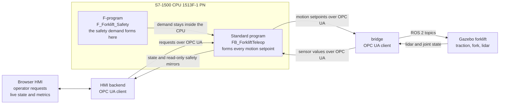

# amr-agent

**A PLC-supervised AMR fleet, built simulation-first with production-grade layer discipline.**

An operator drives a simulated forklift from a commissioning HMI while a Siemens
S7-1500 forms every motion setpoint in between — HMI → PLC → bridge → Gazebo, and
the state report back the same way over live OPC UA. 


*15 s of one live commissioning run. The operator holds FORK UP; past 0.50 m the
standard program asserts `ForkliftSpeedLimitActive` and forms the traction
setpoint as demand × 0.30, so a full-deflection -1.0 request leaves
`ForkliftTractionSpeedRef` at -0.300 m/s. The HMI writes requests and reads
state — it commands no actuator — and the speed reduction is standard-program
process logic, not a safety function. Full 48 s run, watch table readable:
[`assets/teleop-showcase.mp4`](assets/teleop-showcase.mp4).*

---

## Architecture

Layers talk only to their neighbours. The S7-1500 standard program owns fixed
equipment, interlocks and every motion setpoint. The safety functions belong to an
F-CPU safety program that must stay correct if the standard program halts; they are
specified in [`docs/safety/`](docs/safety/), and their cell-scope core is being built
early on the forklift twin
([ADR 0009](docs/adr/0009-early-cell-scope-safety-on-the-forklift-twin.md)). The
commissioning HMI and, later, the fleet manager are OPC UA *clients* of the PLC,
never the reverse, and a bridge translates ROS 2 topics to OPC UA so the simulation
never addresses the PLC directly. Thirteen invariants are locked by
[ADR 0001](docs/adr/0001-architecture-invariants.md) — safety never traverses the
network, loss of network is a degraded mode rather than a safety event, the PLC is
the OPC UA server. The topology they are drawn in is
[CLAUDE.md §3](CLAUDE.md#3-topology), and every top-level directory's README opens
with *This layer must not access*.



*The network carries process data and read-only safety mirrors only. The safety
demand forms inside the CPU and never leaves it, so invariant 1 holds by
construction rather than by assertion.*

---

## Run it

The Linux side of the M4 commissioning stack comes up with one command:

```bash
./stack.sh start          # add --headless to run the arena without the Gazebo GUI
./stack.sh status
./stack.sh stop
```

`start` brings up the five Linux-side processes in the order
[`sim/scenarios/forklift_commissioning.md`](sim/scenarios/forklift_commissioning.md)
§1 specifies — bridge, arena bringup, the two vehicle nodes, then the
commissioning HMI — waiting on each one's own readiness signal before the next,
and writes one PID file per process under `/tmp/amr-agent-stack` (override with
`AMR_STACK_RUN_DIR`). Starting a second time while the stack is up is refused
rather than double-spawned. `stop` signals exactly those process groups —
SIGTERM, a bounded wait, then SIGKILL — and then sweeps for the survivors
`ros2 launch` leaves behind, matched by this run's `GZ_PARTITION`; there is no
blanket `pkill`. `status` lists each component up or down.

**The PLC side is not started here.** Put the CPU in RUN on PLCSIM Advanced from
TIA Portal on the Windows machine first; it is row 1 of the same start order, and
both OPC UA clients below it are clients of that server (invariant 4).

**Which bridge configuration.** The script passes
`bridge/config/bridge.yaml` — the live, committed configuration, used exactly as
it stands — and points `hmi/hmi_server.py` at `hmi/config.yaml`. It never edits a
config, and adds no threshold, no path and no data route of its own. Both are
overridable for one run with `AMR_BRIDGE_CONFIG` and `AMR_HMI_CONFIG`. Note that
`bridge/config/bridge.yaml` is committed carrying the cell signal group alone, so
a gate run needs the forklift-group configuration named in
`forklift_commissioning.md` §1; `start` says so and carries on rather than
choosing a file for you.

Prerequisites are ROS 2 Jazzy, Gazebo and the two virtual environments described
in [`bridge/README.md`](bridge/README.md) and [`hmi/README.md`](hmi/README.md);
`start` names any that are missing and stops before spawning anything.

---

## Milestones

M3 closed 2026-07-28, verified in
[docs/reports/m3-37-gate-verification.md](docs/reports/m3-37-gate-verification.md)
(pass-with-findings). Current gate: **M5 — Sensored autonomous forklift**;
**M4 — Forklift commissioning cell** is closing, on the owner's recorded
commissioning showcase and the m4f-09 gate verification. Tracked in
[docs/roadmap.md](docs/roadmap.md); a gate closes only on observable
behaviour, never on written code.

| Gate | Deliverable | Status |
|---|---|---|
| M0 | Repo skeleton, ADR 0001 recording the invariants | **done** |
| M1 | Interface contracts | **done** |
| M2 | Safety requirements spec | **done** |
| M3 | Fixed equipment I/O loop | **done** |
| M4 | Forklift commissioning cell | **closing** — showcase recording and gate verification pending |
| M5 | Sensored autonomous forklift | **in progress** |
| M6 | VDA 5050 fleet at scale | planned |
| M7 | LLM operations layer + final demonstration | planned |
| M8 | Vendor portability: a second Beckhoff/TwinCAT PLC layer | planned |

Archived rows moved onto the forklift twin rather than being dropped: the safety
layer and the navigation stack both land on the forklift built at M4, which is the
vehicle platform from M5 onward; the VDA 5050 client, the fleet manager and PLC
integration merge into one fleet gate at scale, four forklifts against ten PLC-owned
stations; and the LLM operations layer closes the main line, taking the end-to-end
demonstration with it as its exit criterion. Arm integration is out of scope, its
safety functions kept in the SRS marked as such rather than deleted.

Gate order follows
[ADR 0010](docs/adr/0010-milestone-restructure-forklift-first.md), which supersedes
the order above M3 set by
[ADR 0008](docs/adr/0008-forklift-commissioning-gate-and-hmi-layer.md) and
[ADR 0007](docs/adr/0007-safety-first-gate-order.md) and leaves M0–M4 with their
numbers and criteria: the fixed-equipment Gazebo-to-PLC signal loop is proven first,
then the same cell gains a teleoperated forklift, then that forklift gains safety
scanners, a navigation lidar and autonomous driving, then a fleet of them runs a
warehouse against the PLC's stations, and only then does a supervisory layer sit
above the whole thing. M4, M5, M6 and M7 each close on their own recording.

After that main line, [ADR 0013](docs/adr/0013-vendor-portability-gate.md) adds
**M8**: a second, Beckhoff/TwinCAT implementation of the PLC layer, proven by the
same unmodified clients and the same scenarios running against both controllers in
separate sessions. It is placed after M6 and M7 so that no gate on the main line
waits on a vendor's release date, and it closes on committed evidence.

---

## How it started — the M3 fixed-cell loop


*A Siemens S7-1500 standard program, in RUN on PLCSIM Advanced, driving the
Gazebo belt. 28 s of the first live PLCSIM loop run, ordered simplest-first —
no scripted animation, no replay. The belt moves because the program wrote
`ConveyorSpeedCommand`; nothing else can write it.*


*Both halves of exit item (a) in one frame: the Gazebo cell on the left, and on
the right the TIA watch table monitoring `"DemoCellInput".ProductSensorRange`
at **1.440088** — the photo-eye's clear-path distance, arrived from the
simulation into the PLC's process image. CPU 1513-1 PN in RUN.*

Measured on that loop, each figure reproducible from a committed artifact: a
**20.00 Hz** bridge cycle over 14 244 cycles, one 3.93 ms overrun and 0 read or
write errors; a
closed-loop input-write-to-PLC-output median of **46.8 ms**, an upper bound
quantised by the bridge's own 50 ms poll; and a drive fault latched **2.301 s**
after Gazebo was killed mid-motion, inside the specified 2.1 to 3.2 s window —
[`bridge/EVIDENCE_LATENCY.md`](bridge/EVIDENCE_LATENCY.md),
[`bridge/EVIDENCE_SIGNAL_LOSS.md`](bridge/EVIDENCE_SIGNAL_LOSS.md).

---

## Where things are

- [`docs/adr/`](docs/adr/) — decision records. An accepted ADR is never edited,
  only superseded; an invariant changes by ADR or not at all.
- [`docs/interfaces/`](docs/interfaces/) — the
  [VDA 5050 subset](docs/interfaces/vda5050-subset.md), the
  [OPC UA node model](docs/interfaces/opcua-nodes.md), the
  [handshake tables](docs/interfaces/handshake-tables.md). OPC UA node names mirror
  the PLC tag names exactly, so the two documents diff.
- [`docs/safety/`](docs/safety/) — the [SRS](docs/safety/SRS.md), the
  [PL scenarios](docs/safety/PL-SCENARIOS.md) and the
  [twin demonstration map](docs/safety/TWIN-DEMO-MAP.md), which fixes the wording.
  No achieved performance level is claimed anywhere in this repository.
- [`docs/LESSONS.md`](docs/LESSONS.md) — append-only: what was attempted, what went
  wrong, the rule now.
- Layers — [`plc/`](plc/) ([demo-cell](plc/demo-cell/SPEC.md),
  [forklift](plc/forklift/SPEC.md)) · [`hmi/`](hmi/) · [`bridge/`](bridge/) ·
  [`sim/`](sim/) · [`fleet/`](fleet/) · [`agv/`](agv/)
