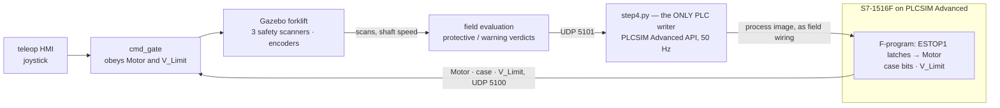

# amr-agent

**A simulated forklift, and a real fail-safe PLC program deciding what it is
allowed to do.**

The vehicle lives in Gazebo. The decisions live in a Siemens S7-1516F safety
program, built in TIA Portal and run on S7-PLCSIM Advanced — e-stop chain,
three safety laser scanners, a two-channel speed cross-check, a monitored
reset. The operator drives the whole time and can override none of it.

[](https://www.youtube.com/watch?v=InZRcy_WUXY)

*▶ [**Watch the safety layer run**](https://www.youtube.com/watch?v=InZRcy_WUXY) —
one continuous session: the drive enable refused until the first acknowledge,
an e-stop that latches through its own release, a protective field that stops
the truck and refuses to un-stop while the cause stands, the warning field
dropping the speed ceiling, and an injected encoder fault caught by the
cross-check.*

**No certified safety function is claimed.** The F-logic is real STEP 7
Safety, and everything wired into it is simulation: the scanners are rendered
lidars, the encoder words come from a simulated drive shaft, and the PLCSIM
Advanced API plays the field wiring. No Performance Level, Category, SIL or
PFH is claimed, reached or implied anywhere in this repository.

---

## What is actually running

On the Windows side, TIA Portal V20 with STEP 7 Safety V20: a 1516F CPU in
RUN on S7-PLCSIM Advanced, its fail-safe program summarised — signatures,
F-runtime group, F-blocks — in [`safety_summary.pdf`](safety_summary.pdf).
The safety I/O is a configured **F-DI 16x24V DC** card carrying the e-stop
channel, each scanner's OSSD and warning-field bits, and the acknowledge
input; the encoder channels arrive as input words. The program itself is
deliberately small — **ten networks**: one ESTOP1 instance per demand source
(e-stop button, each scanner's protective field, the speed monitor), the
AND of their enables forming the one output that matters (`Motor`), and the
monitoring-case and speed-ceiling logic beside it.

On the WSL side, Gazebo and ROS 2 Jazzy: a warehouse, a tricycle forklift
carrying three 275° safety scanners (modelled on a real device class, down
to the blind sector and the machine-contour masking), a navigation lidar,
and two independent reading heads on the drive shaft.

Between them, one deliberately narrow seam: a JSON-over-UDP wire in each
direction, and **exactly one process allowed to touch the PLC** — a 50 Hz
writer on the PLCSIM Advanced API that plays the role of the field devices.
Inputs persist across PLC cycles exactly as wired sensors would; the API is
the copper, not a back door. Everything fails toward a stop: silence on any
link writes the trip values, never holds the last good ones.

## Built one input at a time

Each step wired **one** field device into the safety program, and closed
with a recorded proof against the live CPU before the next began:

| Step | What was wired | What had to be shown | Proof |
|---|---|---|---|
| 1 | The **e-stop chain**, alone — every other input pinned healthy | the demand latches; releasing the button does *not* re-enable; only the acknowledge edge does | [`step1/PROOF.md`](m5_ver2/step1/PROOF.md) |
| 2 | The **back safety scanner** — protective and warning fields evaluated from the rendered lidar, driving `PF_OSSD` and `WF_Clear` | an intruder in the protective field drops `Motor`; the warning field alone does not — it gates the speed ceiling | [`step2/PROOF.md`](m5_ver2/step2/PROOF.md) |
| 3 | The **safety encoders** — two readings off one shaft into `ENC_A`/`ENC_B` | a channel disagreement above 50 mm/s and the 2800 mm/s ceiling each demand a stop; an injected channel fault is caught | [`step3/PROOF.md`](m5_ver2/step3/PROOF.md) |
| 4 | **Everything at once** — all three scanners on their own F-DI channels, and the vehicle made to *obey* `V_Limit` | the warning field drops the ceiling 1500 → 300 mm/s and the speed monitor enforces it; each scanner latches independently | [`step4/PROOF.md`](m5_ver2/step4/PROOF.md) |

The discipline the steps enforce is the point: at every stage the safety
program is ground truth — the vehicle side never re-implements a decision,
it only supplies honest inputs and obeys `Motor` and `V_Limit`. When a false
trip appeared (the back scanner catching the vehicle's own steering gear at
some wheel angles), the fix was measured across the full steer sweep and
recorded, not patched by loosening a threshold —
[`docs/LESSONS.md`](docs/LESSONS.md) keeps every such correction.

## The loop



The demand forms inside the CPU. The vehicle's gate zeroes its command the
moment `Motor` reads False **or** the status link goes silent — and the
writer, symmetrically, writes every input False the moment the vehicle side
goes quiet. Neither side ever holds a stale permission.

## Run it

The full order — prerequisites, the PLC half, the vehicle half, the
acknowledge ritual, a table of things to demonstrate, and what every symptom
means — is **[`RUNBOOK.md`](RUNBOOK.md)**. The short version:

```bash
# Windows: PLCSIM Advanced instance PLC_2 in RUN, program downloaded, then
python m5_ver2\step4\windows\step4.py

# WSL:
./m5_ver2/step4/step4.sh start      # stop | home (put the truck back, mid-run)
```

## Previous trials, with Claude supervision

This is the second build of the safety layer. The first — recorded below —
reached the same behaviours by a different route: an OPC UA bridge
architecture, the safety input arriving through a disclosed standard-DB
stand-in, and a safety program of **49 networks**. It worked, and it taught
most of the lessons this rebuild is made of; the rebuild reaches the same
behaviour with ten networks, real F-I/O channels, and one recorded proof per
input. Its entry points are retired from the tree but live in git history,
and its evidence and decision records stand unchanged.

[](https://youtu.be/wl1rgWyX66s)

*▶ [**The first build's demonstration**](https://youtu.be/wl1rgWyX66s) — 4 min
9 s: the scanner drops the speed ceiling at the warning boundary, latches a
stop at the protective one, and the monitored reset is refused while the
cause still stands.*

Earlier ground the project stands on, each with its own recording or
evidence trail:

- **Teleoperation under the PLC** — the commissioning HMI driving the
  forklift with the S7-1500 forming every setpoint
  ([`assets/teleop-showcase.gif`](assets/teleop-showcase.gif), full run in
  [`assets/teleop-showcase.mp4`](assets/teleop-showcase.mp4)).
- **The first closed loop** — the standard program driving a Gazebo conveyor
  through the OPC UA bridge, with measured cycle and latency figures
  ([`assets/plc-drives-cell.gif`](assets/plc-drives-cell.gif),
  [`bridge/EVIDENCE_LATENCY.md`](bridge/EVIDENCE_LATENCY.md)).

## Where things are

- [`m5_ver2/`](m5_ver2/) — **the safety loop**, one directory per step, each
  with its own nodes, tests, world and `PROOF.md`. Step 4 is the current,
  complete state; [`m5_ver2/CLAUDE.md`](m5_ver2/CLAUDE.md) holds the tag
  table and the rules every step obeys.
- [`safety_summary.pdf`](safety_summary.pdf) — the TIA Portal Safety
  Administration printout of the running safety program.
- [`RUNBOOK.md`](RUNBOOK.md) — how to run and demonstrate it.
- [`m5-plc-debug/`](m5-plc-debug/) — the four-file bench the PLC program was
  brought up against, one stand-in per field device.
- [`docs/adr/`](docs/adr/) — decision records; an accepted ADR is never
  edited, only superseded. [`docs/safety/`](docs/safety/) — the safety
  requirements spec and validation notes.
  [`docs/LESSONS.md`](docs/LESSONS.md) — append-only: what was attempted,
  what went wrong, the rule now.
- Layers from the first build, in place and unchanged —
  [`plc/`](plc/) · [`hmi/`](hmi/) · [`bridge/`](bridge/) · [`sim/`](sim/) ·
  [`agv/`](agv/) · [`fleet/`](fleet/) · [`docs/roadmap.md`](docs/roadmap.md).
