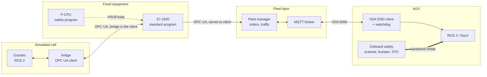
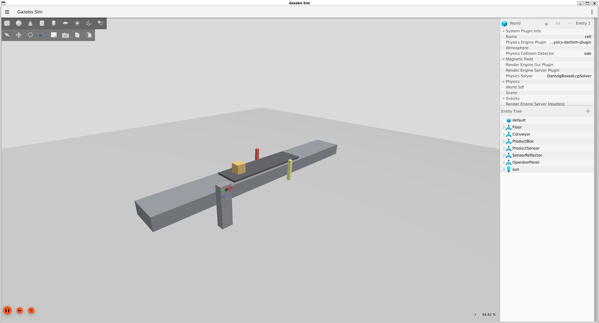
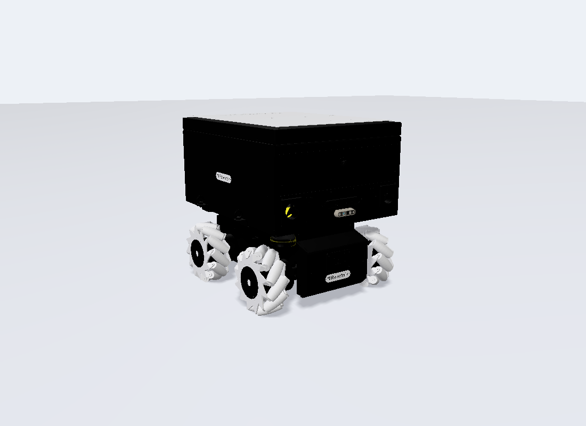

# amr-agent

**A PLC-supervised AMR fleet, built simulation-first with production-grade layer discipline.**

*A Siemens S7-1500 standard program, in RUN on PLCSIM Advanced, driving the
Gazebo belt. 28 s of the first live PLCSIM loop run, ordered simplest-first —
no scripted animation, no replay. The belt moves because the program wrote
`ConveyorSpeedCommand`; nothing else can write it.*

---

## Architecture

Thick arrow: safety path. Dashed: safety fieldbus. Thin: process data.

Four rules the code is not allowed to break — the full list is
[ADR 0001](docs/adr/0001-architecture-invariants.md):

| | |
|---|---|
| **Safety never traverses the network** | E-stop, protective stop and STO live onboard the vehicle and in the F-CPU. OPC UA and MQTT carry process commands only. |
| **Loss of network is not a safety event** | It is a degraded mode. Each vehicle stops in a controlled way when supervision is lost. |
| **The PLC is the OPC UA server** | The fleet manager is the client. Never inverted. |
| **The PLC does not manage the fleet** | It owns fixed equipment, interlocks and handshakes. Orders and traffic belong to the fleet manager. |

---

## The demonstration cell

The visuals are deliberately minimal. The subject of this project is the
control architecture, not the art — a belt, a box, a beam and a button post
are enough to make every signal in the loop observable.

| Visual object | Control equipment it stands for | Signals ([OPC UA nodes](docs/interfaces/opcua-nodes.md)) |
|---|---|---|
| Belt slab on a prismatic joint | Conveyor drive + encoder | `ConveyorSpeedCommand` (PLC → cell, `Real`, m/s signed) · `ConveyorBeltPosition`, `ConveyorBeltSpeed` (cell → PLC) |
| Grey cube | The transported product | None. Its ground-truth pose is a diagnostic topic and deliberately **not** a PLC node — a real conveyor has no product-position transducer. |
| Post + reflector across the belt | Retro-reflective through-beam photo-eye | `ProductSensorRange` — a raw analogue **distance**, 1.440 m clear / 0.540 m blocked. The threshold is program logic, published back as `ProductPresentAtSensor`. |
| Pedestal, four buttons | Operator panel field contacts | `PanelStartPressed`, `PanelResetPressed` (wired **NO**) · `PanelStopCircuitClosed`, `PanelProcessStopCircuitClosed` (wired **NC**) |
| Red mushroom | A **process** stop in the standard program | Deliberately not an emergency stop and carrying no safety integrity. The e-stop chain is hardwired to the F-CPU and arrives at M5; it never crosses the network. |

Wire NC, program NO: stop devices are wired closed so a broken wire drops the
signal and stops the machine. The cell publishes the raw contact — no
inversion, no latch, no debounce, no threshold. All of that is PLC work.

### The PLC side of the same loop

*Both halves of exit item (a) in one frame: the Gazebo cell on the left, and on
the right the TIA watch table monitoring `"DemoCellInput".ProductSensorRange`
at **1.440088** — the photo-eye's clear-path distance, arrived from the
simulation into the PLC's process image. CPU 1513-1 PN in RUN.*

---

## Measured

Every figure reproduces from a committed artifact.

| | | |
|---|---|---|
| Bridge cycle | **20.00 Hz** over 14 244 cycles, 1 overrun of 3.93 ms, 0 read or write errors | [`bridge/EVIDENCE_LATENCY.md`](bridge/EVIDENCE_LATENCY.md) §B2.3 |
| Closed loop, input write → PLC output change | median **46.8 ms** — an *upper bound*, quantised by the bridge's own 50 ms poll | [`bridge/EVIDENCE_LATENCY.md`](bridge/EVIDENCE_LATENCY.md) §B.5; §B2.5 finds the same cluster on a later build |
| Gazebo killed mid-motion → drive fault latched, setpoint zeroed | **2.301 s**, inside the specified [2.1, 3.2] s window | [`bridge/EVIDENCE_SIGNAL_LOSS.md`](bridge/EVIDENCE_SIGNAL_LOSS.md) |
| CPU cycle time, shortest / last / longest | **1.004 / 1.023 / 2.556 ms**, against the program's configured 20 ms OB30 period | [watch-table capture](plc/demo-cell/evidence/watch-table/Screenshot%202026-07-28%20174127.png) |

---

## The vehicle

**Robotnik RB-KAIROS** ([ADR 0002](docs/adr/0002-vehicle-platform.md)) —
rendered here from the manufacturer's own BSD-3-Clause ROS 2 description
(see [assets/CREDITS.md](assets/CREDITS.md)), not a marketing image. A mobile
manipulator, so the arm exists in the model from the start and stays out of
scope until M11. It joins the demonstration at **M6**.

---

## Milestones

M3 closed 2026-07-28, verified in
[docs/reports/m3-37-gate-verification.md](docs/reports/m3-37-gate-verification.md)
(pass-with-findings). Next gate: **M4 — Forklift commissioning cell**. Tracked in
[docs/roadmap.md](docs/roadmap.md); a gate closes only on observable
behaviour, never on written code.

| Gate | Deliverable | Status |
|---|---|---|
| M0 | Repo skeleton, ADR 0001 recording the invariants | **done** |
| M1 | Interface contracts | **done** |
| M2 | Safety requirements spec | **done** |
| M3 | Fixed equipment I/O loop | **done** |
| M4 | Forklift commissioning cell | next |
| M5 | Safety layer on the fixed cell (F-CPU) | planned |
| M6 | Simulated vehicle | planned |
| M7 | VDA 5050 client | planned |
| M8 | Fleet manager | planned |
| M9 | PLC integration | planned |
| M10 | Demonstration | planned |
| M11 | Arm integration | planned |
| M12 | Command path from Hermes | parked |

Gate order follows
[ADR 0008](docs/adr/0008-forklift-commissioning-gate-and-hmi-layer.md), which
extends [ADR 0007](docs/adr/0007-safety-first-gate-order.md) rather than
superseding it: the fixed-equipment Gazebo-to-PLC signal loop is proven first,
then the same cell gains a teleoperated forklift, then the safety layer on that
cell, before any mobile robot, broker or fleet work.

---

## How it is built

- **Decisions are records.** [`docs/adr/`](docs/adr/) — accepted ADRs are never
  edited, only superseded. An invariant changes by ADR or not at all.
- **Contracts before code.** [`docs/interfaces/`](docs/interfaces/) — the
  [VDA 5050 subset](docs/interfaces/vda5050-subset.md), the
  [OPC UA node model](docs/interfaces/opcua-nodes.md), the
  [handshake tables](docs/interfaces/handshake-tables.md). OPC UA node names
  mirror the PLC tag names exactly, so the two documents diff.
- **Safety is specified, then implemented.** [`docs/safety/SRS.md`](docs/safety/SRS.md)
  gives every safety function a trigger, a reaction and an acceptance test;
  [`PL-SCENARIOS.md`](docs/safety/PL-SCENARIOS.md) derives the required
  performance levels.
- **Evidence discipline.** No figure appears in a document unless it
  reproduces from a committed artifact, and every measurement stays qualified
  by the environment and program build that produced it.
- **Mistakes are written down once.** [`docs/LESSONS.md`](docs/LESSONS.md) is
  append-only: what was attempted, what went wrong, the rule now.

Layer boundaries are explicit: every top-level directory's README opens with
*This layer must not access*.

| | |
|---|---|
| [`plc/`](plc/) | S7-1500 standard program, TIA exports · [demo-cell spec](plc/demo-cell/SPEC.md) |
| [`bridge/`](bridge/) | ROS 2 ⇄ OPC UA signal translator and its test double ([ADR 0005](docs/adr/0005-bridge-layer-and-opcua-client.md)) |
| [`sim/`](sim/) | Gazebo worlds, launch files, scenarios |
| [`fleet/`](fleet/) | Fleet manager service, MQTT and OPC UA clients |
| [`agv/`](agv/) | ROS 2 workspace, VDA 5050 client node |
