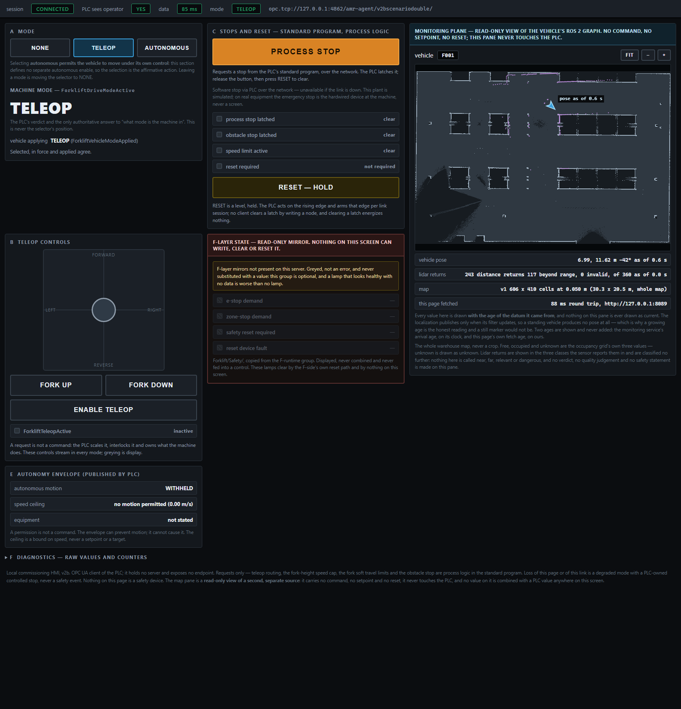
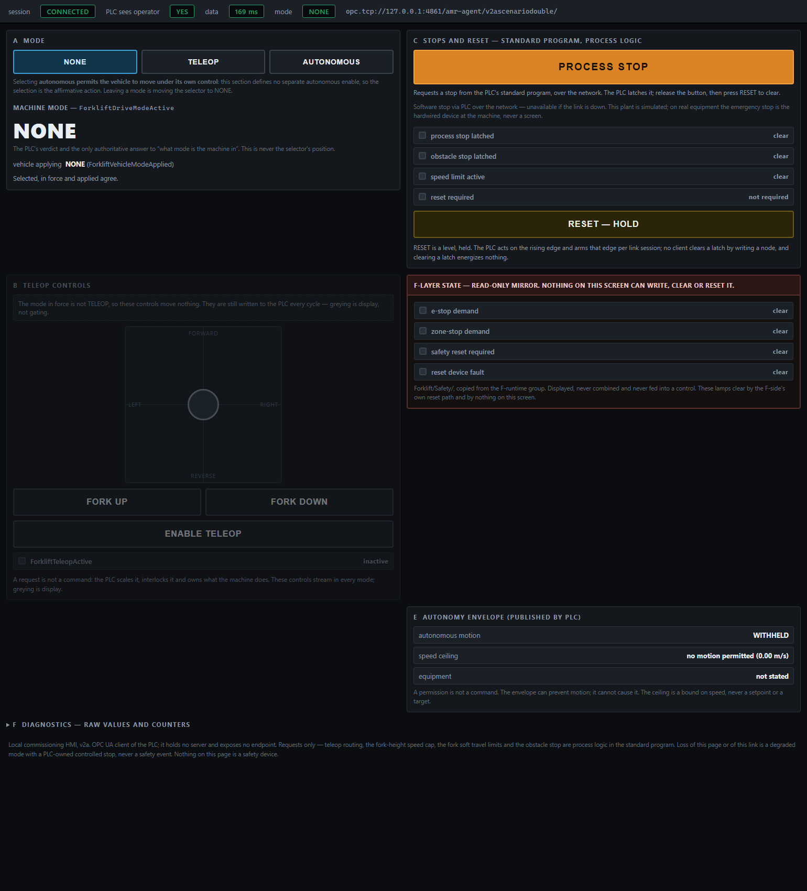
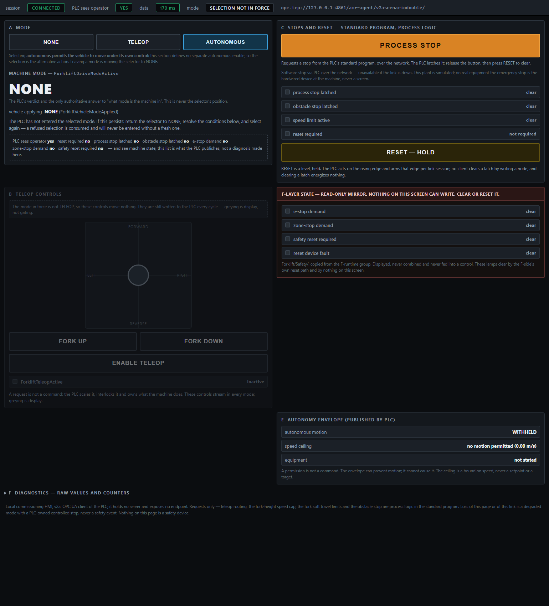
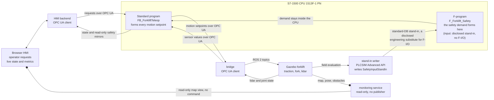

# amr-agent

**A PLC-supervised AMR fleet, built simulation-first with production-grade layer discipline.**

An operator drives a simulated forklift from a commissioning HMI while a Siemens
S7-1500 forms every motion setpoint in between — HMI → PLC → bridge → Gazebo, and
the state report back the same way over live OPC UA. 

[](https://youtu.be/wl1rgWyX66s)

*▶ [**Watch the M5 safety demonstration**](https://youtu.be/wl1rgWyX66s) — 4 min 9 s,
one continuous run. A forklift teleoperated from the commissioning HMI while the
S7-1500 forms every setpoint, with the safety layer live the whole time: the
scanner drops the speed ceiling at the warning boundary, latches a stop at the
protective one, and the monitored reset is **refused** while the cause still
stands.*

**Nothing in that recording is a certified safety function.** The safety input
path is an engineering stand-in on a standard data block, disclosed as one
wherever it appears. No Performance Level, Category, SIL or PFH is claimed,
reached or implied anywhere in this repository — only PLr *targets*.

---

## What M5 is, in plain terms

**One vehicle, finished properly.** Not a fleet, not a feature list — a single
forklift whose control is complete enough to argue about.

A forklift that *sees*, and a PLC that decides what it is allowed to do. The
operator drives the whole time and cannot override any of it.

Three things have to be true at once, and the recording shows all three:

| What happens | What the machine does | Measured |
|---|---|---|
| Something enters the **warning** field | The standard program lowers the speed ceiling; the vehicle slows *while the operator still holds full command* | 1.000 → 0.20 m/s **in the same 50 ms sample** as the trip |
| It gets closer, into the **protective** field | The safety program latches a stop. The vehicle stops and **stays** stopped | stopped **1.47 m** short, command still held |
| The operator tries to recover | The monitored reset is **refused** while the cause still stands | refused; accepted only once the field reads clear |

That last row is the point of the whole gate. A machine that stops is easy. A
machine that **refuses to un-stop while the danger is still there** is the one
worth building — and it is what an operator drives into a wall to prove.

The safety decision is formed **inside the CPU** and never crosses the network:
the F-program emits a *demand*, never a speed, so losing the network is a
degraded mode rather than a safety event. Its input arrives through the
disclosed `SafetyInputStandIn` stand-in — F-logic execution is demonstrated,
safety integrity is not claimed.

**What is not finished, said plainly.** Autonomous driving is a working
prototype and no more — a mission plans and drives on two of three test routes,
and the third fails for a reason recorded in the open. The safety chain is the
deliverable; autonomy is the supporting act, and the work continues.

## The operator page

One page, served on `127.0.0.1:8088`. It writes **requests** and reads state; it
commands no actuator, and the PLC owns what the machine does with a request.



*The whole page against a live CPU and a live monitoring service. Left, the mode
selector and teleop controls. Middle, the standard program's stops and reset.
Right, the map — a **read-only** view of the vehicle's ROS 2 graph that never
touches the PLC.*

The page is built to be honest about four things that most operator screens hide.

| | |
|---|---|
|  | **The reset is monitored, and it is a hold.** The PLC acts on the rising edge and arms that edge once per link session. No client clears a latch by writing a node, and clearing a latch energizes nothing. |
|  | **A refused selection is consumed, not held.** `MACHINE MODE` is the PLC's verdict and never the selector's position — so when the two disagree, the page shows the machine's answer in the larger type. |
|  | **The F-layer lamps are a mirror and nothing else.** They are copied from the F-runtime group, displayed, never combined and never fed into a control. Nothing on this screen can write, clear or reset them. |
|  | **Every value is drawn with the age of the datum it came from.** The localization publishes only on a filter update, so a *standing* vehicle produces no pose at all — a growing age is the honest reading, and a still marker would not be. |

Captures of the page under fault, staleness and refusal are produced by the
capture harness in [`hmi/tools/`](hmi/tools/), each listed in a dated manifest.
They are **not committed** — the five shown on this page are copied into
`assets/hmi/`, and the rest are regenerated by running the harness rather than
carried in the history.

---

## Before the safety layer — M4, the same page driving the machine


*15 s of an earlier commissioning run. The operator holds FORK UP; past 0.50 m the
standard program asserts `ForkliftSpeedLimitActive` and forms the traction
setpoint as demand × 0.30, so a full-deflection -1.0 request leaves
`ForkliftTractionSpeedRef` at -0.300 m/s. The HMI writes requests and reads
state — it commands no actuator — and the speed reduction is standard-program
process logic, not a safety function. Full 48 s run, watch table readable:
[`assets/teleop-showcase.mp4`](assets/teleop-showcase.mp4).*

---

## Architecture

Layers talk only to their neighbours. The S7-1500 standard program owns fixed
equipment, interlocks and every motion setpoint. The safety functions belong to an
F-CPU safety program that must stay correct if the standard program halts; they are
specified in [`docs/safety/`](docs/safety/). The forklift's F-runtime group is the
vehicle's own **onboard safety controller**
([ADR 0011](docs/adr/0011-sensored-autonomy-architecture.md) D1), continuing what
[ADR 0009](docs/adr/0009-early-cell-scope-safety-on-the-forklift-twin.md) opened
early on the forklift twin — and the scanner's simulated signal reaches those
F-blocks through the disclosed `SafetyInputStandIn` standard-DB stand-in, never a
real F-input. The map pane rides ADR 0011 D4's **read-only monitoring plane**,
which has no write endpoint and never touches the PLC. The
commissioning HMI and, later, the fleet manager are OPC UA *clients* of the PLC,
never the reverse, and a bridge translates ROS 2 topics to OPC UA so the simulation
never addresses the PLC directly. Thirteen invariants are locked by
[ADR 0001](docs/adr/0001-architecture-invariants.md) — safety never traverses the
network, loss of network is a degraded mode rather than a safety event, the PLC is
the OPC UA server. The topology they are drawn in is
[CLAUDE.md §3](CLAUDE.md#3-topology), and every top-level directory's README opens
with *This layer must not access*.



*The network carries process data, read-only safety mirrors and the read-only
monitoring plane only. The safety demand forms inside the CPU and never leaves
it, so invariant 1 holds by construction rather than by assertion — and the
F-program's input is the disclosed stand-in, because the simulated F-I/O path
answered no on this installation
([ADR 0015](docs/adr/0015-criterion-a-standin-stimulus.md)).*

---

## Run it

The M5 demonstration — the one in the recording above — comes up with one
command, and goes down with one:

```bash
./demo.sh up              # --headless for no Gazebo GUI, --monitor for the map pane
./demo.sh home            # put the vehicle back at its spawn, mid-run
./demo.sh status
./demo.sh down
```

`up` composes the whole cell out of committed files only: the warehouse world
and the forklift, the field evaluation and the two encoder reading heads, the
envelope gate, the bridge, the commissioning HMI — and, with `--monitor`, the
monitoring service behind the map pane.
Every readiness check waits on an **observable** — a topic that has carried a
message, a session established, a port answering — never on a duration, because
bring-up stretches about 6× under load and a fixed wait reports "the process is
gone" when it has simply not arrived yet.

**It refuses to start half a cell.** Before touching the Linux side it looks
across the WSL/Windows seam for PLCSIM Advanced and for the stand-in writer, by
the writer's own named mutex and both its listeners. A stack whose Windows half
is missing looks like it worked and produces a vehicle that will not move, so
`up` waits for the writer and names the command that starts it.

**Three things it tells you that cost a live session to learn.** The e-stop
circuit boots **open** — fail-safe and correct, and nothing closes it until a
human does, not the HMI, not a link, not a restart. The HMI's RESET is the
*process* reset and cannot reach an F-latch; the F-side reset lives on the bench
panel. And a mode selection refused while a demand stands is **consumed, not
held**, so after clearing you make a fresh NONE → TELEOP edge.

`home` exists because a protective stop is not self-clearing and must not be:
while the field is occupied the reset is refused, and a vehicle stopped
nose-to-rack cannot reverse out of its own field either. It moves the model in
the simulator, reads the pose back before reporting it, and **clears no latch** —
it says so in its own output, because a command that appeared to clear a safety
latch would teach the opposite of what this cell demonstrates.

`down` verifies rather than assumes: no component, no survivor in the run's
`GZ_PARTITION`, no listener on the HMI, monitor or writer ports, the writer's
mutex free, `/dev/shm` swept. PLCSIM and TIA are never touched — they are the
owner's, and the CPU keeps running between takes.

The **DDS domain is read from
[`agv/forklift/vehicles/allocation.yaml`](agv/forklift/vehicles/allocation.yaml)**,
the single owner of the serial-to-domain mapping, and a disagreeing environment
is refused rather than overridden. Two graphs on different domains do not error —
they fall silent, which is the hardest failure to see.

<details>
<summary>The M4 commissioning stack (<code>./stack.sh</code>)</summary>

```bash
./stack.sh start          # add --headless to run the arena without the Gazebo GUI
./stack.sh status
./stack.sh stop
```

`start` brings up the five Linux-side processes in the order
[`sim/scenarios/forklift_commissioning.md`](sim/scenarios/forklift_commissioning.md)
§1 specifies — bridge, arena bringup, the two vehicle nodes, then the
commissioning HMI — waiting on each one's own readiness signal before the next,
and writes one PID file per process under `/tmp/amr-agent-stack` (override with
`AMR_STACK_RUN_DIR`). Starting a second time while the stack is up is refused
rather than double-spawned. `stop` signals exactly those process groups —
SIGTERM, a bounded wait, then SIGKILL — and then sweeps for the survivors
`ros2 launch` leaves behind, matched by this run's `GZ_PARTITION`; there is no
blanket `pkill`. `status` lists each component up or down.

**The PLC side is not started here.** Put the CPU in RUN on PLCSIM Advanced from
TIA Portal on the Windows machine first; it is row 1 of the same start order, and
both OPC UA clients below it are clients of that server (invariant 4).

**Which bridge configuration.** The script passes
`bridge/config/bridge.yaml` — the live, committed configuration, used exactly as
it stands — and points `hmi/hmi_server.py` at `hmi/config.yaml`. It never edits a
config, and adds no threshold, no path and no data route of its own. Both are
overridable for one run with `AMR_BRIDGE_CONFIG` and `AMR_HMI_CONFIG`. Note that
`bridge/config/bridge.yaml` is committed carrying the forklift signal groups
(forklift, envelope, warning, safety) and the cell group is absent — the CPU in
force does not publish the cell nodes, and browsing them would error. A run
against the M3 demo cell therefore needs its own configuration; `start` checks
which groups the config names and says so rather than choosing a file for you.

Prerequisites are ROS 2 Jazzy, Gazebo and the two virtual environments described
in [`bridge/README.md`](bridge/README.md) and [`hmi/README.md`](hmi/README.md);
`start` names any that are missing and stops before spawning anything.
</details>

Both scripts share the same prerequisites and both leave the PLC alone: put the
CPU in RUN on PLCSIM Advanced from TIA Portal on the Windows machine first, and
every OPC UA client here is a client of that server (invariant 4). The full
presentation-morning order — what to start by hand, what "ready" looks like, and
what to do to make each safety function act — is [`RUNBOOK.md`](RUNBOOK.md).

---


## Milestones

M3 closed 2026-07-28, verified in
[docs/reports/m3-37-gate-verification.md](docs/reports/m3-37-gate-verification.md)
(pass-with-findings). Current gate: **M5 — Sensored autonomous forklift**;
**M4 — Forklift commissioning cell** is closing, on the owner's recorded
commissioning showcase and the m4f-09 gate verification. Tracked in
[docs/roadmap.md](docs/roadmap.md); a gate closes only on observable
behaviour, never on written code.

| Gate | Deliverable | Status |
|---|---|---|
| M0 | Repo skeleton, ADR 0001 recording the invariants | **done** |
| M1 | Interface contracts | **done** |
| M2 | Safety requirements spec | **done** |
| M3 | Fixed equipment I/O loop | **done** |
| M4 | Forklift commissioning cell | **closing** — showcase recording and gate verification pending |
| M5 | Sensored autonomous forklift | **in progress** |
| M6 | VDA 5050 fleet at scale | planned |
| M7 | LLM operations layer + final demonstration | planned |
| M8 | Vendor portability: a second Beckhoff/TwinCAT PLC layer | planned |

Archived rows moved onto the forklift twin rather than being dropped: the safety
layer and the navigation stack both land on the forklift built at M4, which is the
vehicle platform from M5 onward; the VDA 5050 client, the fleet manager and PLC
integration merge into one fleet gate at scale, four forklifts against ten PLC-owned
stations; and the LLM operations layer closes the main line, taking the end-to-end
demonstration with it as its exit criterion. Arm integration is out of scope, its
safety functions kept in the SRS marked as such rather than deleted.

Gate order follows
[ADR 0010](docs/adr/0010-milestone-restructure-forklift-first.md), which supersedes
the order above M3 set by
[ADR 0008](docs/adr/0008-forklift-commissioning-gate-and-hmi-layer.md) and
[ADR 0007](docs/adr/0007-safety-first-gate-order.md) and leaves M0–M4 with their
numbers and criteria: the fixed-equipment Gazebo-to-PLC signal loop is proven first,
then the same cell gains a teleoperated forklift, then that forklift gains safety
scanners, a navigation lidar and autonomous driving, then a fleet of them runs a
warehouse against the PLC's stations, and only then does a supervisory layer sit
above the whole thing. M4, M5, M6 and M7 each close on their own recording.

After that main line, [ADR 0013](docs/adr/0013-vendor-portability-gate.md) adds
**M8**: a second, Beckhoff/TwinCAT implementation of the PLC layer, proven by the
same unmodified clients and the same scenarios running against both controllers in
separate sessions. It is placed after M6 and M7 so that no gate on the main line
waits on a vendor's release date, and it closes on committed evidence.

---

## How it started — the M3 fixed-cell loop


*A Siemens S7-1500 standard program, in RUN on PLCSIM Advanced, driving the
Gazebo belt. 28 s of the first live PLCSIM loop run, ordered simplest-first —
no scripted animation, no replay. The belt moves because the program wrote
`ConveyorSpeedCommand`; nothing else can write it.*


*Both halves of exit item (a) in one frame: the Gazebo cell on the left, and on
the right the TIA watch table monitoring `"DemoCellInput".ProductSensorRange`
at **1.440088** — the photo-eye's clear-path distance, arrived from the
simulation into the PLC's process image. CPU 1513-1 PN in RUN.*

Measured on that loop, each figure reproducible from a committed artifact: a
**20.00 Hz** bridge cycle over 14 244 cycles, one 3.93 ms overrun and 0 read or
write errors; a
closed-loop input-write-to-PLC-output median of **46.8 ms**, an upper bound
quantised by the bridge's own 50 ms poll; and a drive fault latched **2.301 s**
after Gazebo was killed mid-motion, inside the specified 2.1 to 3.2 s window —
[`bridge/EVIDENCE_LATENCY.md`](bridge/EVIDENCE_LATENCY.md),
[`bridge/EVIDENCE_SIGNAL_LOSS.md`](bridge/EVIDENCE_SIGNAL_LOSS.md).

---

## Where things are

- [`docs/adr/`](docs/adr/) — decision records. An accepted ADR is never edited,
  only superseded; an invariant changes by ADR or not at all.
- [`docs/interfaces/`](docs/interfaces/) — the
  [VDA 5050 subset](docs/interfaces/vda5050-subset.md), the
  [OPC UA node model](docs/interfaces/opcua-nodes.md), the
  [handshake tables](docs/interfaces/handshake-tables.md). OPC UA node names mirror
  the PLC tag names exactly, so the two documents diff.
- [`docs/safety/`](docs/safety/) — the [SRS](docs/safety/SRS.md), the
  [PL scenarios](docs/safety/PL-SCENARIOS.md) and the
  [twin demonstration map](docs/safety/TWIN-DEMO-MAP.md), which fixes the wording.
  No achieved performance level is claimed anywhere in this repository.
- [`docs/LESSONS.md`](docs/LESSONS.md) — append-only: what was attempted, what went
  wrong, the rule now.
- Layers — [`plc/`](plc/) ([demo-cell](plc/demo-cell/SPEC.md),
  [forklift](plc/forklift/SPEC.md)) · [`hmi/`](hmi/) · [`bridge/`](bridge/) ·
  [`sim/`](sim/) · [`fleet/`](fleet/) · [`agv/`](agv/)
