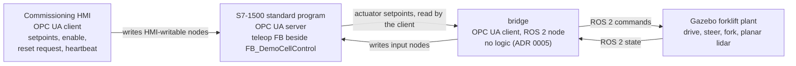

# ADR 0008: A forklift commissioning gate, and a local operator HMI layer

Status:        accepted (2026-07-28). Owner-approved on that date; the five
decisions below are the owner's rulings, recorded here.

This ADR **inserts a gate ahead of** the M4 of ADR 0007
(`docs/adr/0007-safety-first-gate-order.md`) and shifts that ADR's M4–M11 to
M5–M12. It does not supersede ADR 0007: the per-function cell/vehicle split of
its §2, the showcase rule of its §3 and its statement of what ADR 0004 still
governs (§4) all stand, each one gate number higher where it carries one. ADR
0007 is **not edited** — CLAUDE.md §8 forbids editing an accepted ADR — so the
forward pointer lives here and in `docs/roadmap.md`, which remains the live
order. ADR 0002 is **not** superseded (D5).

It also supplies the decision ADR 0007 reserved in its closing consequence:
*"no operator/HMI layer is added to the §3 topology by this ADR, and none may be
added until the ADR that decision 3 asks for exists."* This is that ADR, **for
the local case only** (D2).

Context:

**The owner ruled a commissioning gate on 2026-07-28.** M3 proved the project's
core claim on fixed equipment: a Gazebo plant, a real S7-1500 program on PLCSIM
Advanced, and a bridge translating between them with no logic of its own. Two
things that claim does not yet carry are a plant that is *vehicle-shaped* — a
chassis with steered drive and a controlled fork rather than a belt — and an
*operator* who drives it. Both are extensions of the same loop, on the same CPU,
over the same OPC UA contract, and neither needs a broker, a fleet manager or a
navigation stack.

**Why the gate goes before the safety layer.** The LESSONS rule of 2026-07-27 is
to sequence gates so the core architectural claim is proven first. This gate
extends that claim by one axis at a time: the plant gains joints and a vehicle
shape, the loop gains a command source, while the PLC, the bridge and the node
contract stay the ones M3 proved. ADR 0007's argument was that the safety layer
belongs *before the fleet chain*, demonstrated on the smallest system that can
carry it — inserting one plant gate ahead of it leaves that argument intact:
the F-CPU still precedes the vehicle, the broker and the fleet manager, and it
now lands on a cell with a moving machine worth guarding rather than a conveyor
alone.

**The operator path is the decision ADR 0007 reserved.** `docs/reports/
m4-00-hermes-survey.md` §4 found that CLAUDE.md §3's topology has no operator,
HMI or assistant box at all, and ADR 0007 forbade adding one until an ADR ruled
it. A teleoperated cell needs an operator source of setpoints, so this ADR rules
the layer — and rules only the local, cell-side case. The remote case (transport
shape, the invariant-8 reading, authorisation) is a different question and stays
parked with the Hermes gate.

**Model sourcing was surveyed before the plant was designed**, because a
ready-made open-source forklift simulation exists and the cheapest path would
have been to take it. The findings in D4 are why that path is closed.

Decision:

### D1 — New gate M4: forklift commissioning cell

A tricycle forklift plant model in Gazebo, teleoperated from a local
commissioning HMI, with **every command passing HMI → PLC standard program →
bridge → simulation** and **every state report returning simulation → bridge →
PLC**. No command reaches the simulation without passing through PLC logic.

The gate's substance: both directions observable on the running cell — an
operator input moving the simulated machine only by way of PLC logic, and the
machine's state visible as PLC inputs — with every reaction named per D3. The
roadmap row's final wording, and the renumbering mechanics generally, belong to
brief m4r2-02 and not to this ADR beyond stating the shift.

**The shift.** M0–M3 are unchanged. Every gate above M3 moves by one:

| ADR 0007 gate | Deliverable | Becomes |
|---|---|---|
| — | **Forklift commissioning cell** | **M4** |
| M4 | Safety layer on the fixed cell (F-CPU) | M5 |
| M5 | Simulated vehicle | M6 |
| M6 | VDA 5050 client | M7 |
| M7 | Fleet manager | M8 |
| M8 | PLC integration | M9 |
| M9 | Demonstration | M10 |
| M10 | Arm integration | M11 |
| M11 | Command path from Hermes — parked, no priority | M12, still parked, still last |

Consequently ADR 0007 §2's landing points move with their gates: SF-01, SF-07
and the cell instance of SF-08 to M5; SF-02, SF-03, SF-04 and the vehicle
instance of SF-08 to M6; SF-09 to M7; SF-05 and SF-06 to M9; the reserved arm
functions to M11. The three showcases of ADR 0007 §3 are now at M5, M9 and M10.
Brief and report filenames keep the numbers they were written under, per the ADR
0004 and 0007 precedent.

### D2 — An operator/HMI layer, for the local commissioning case

**D2.1 — The commissioning HMI is an OPC UA client of the PLC.** Invariant 4 is
preserved exactly: the PLC is the server, the HMI is a client, and the direction
is not inverted. The HMI writes into HMI-writable nodes and reads status nodes;
it holds no server and exposes no endpoint.

**D2.2 — What it streams.** Process setpoints (drive, steer, fork jog), an
enable, an edge-triggered reset request, and a `UInt16` heartbeat. These are
*requests*. The PLC standard program forms every actuator setpoint from them,
applies the interlocks of D3, and owns the outcome; the HMI commands no actuator
and computes no verdict the PLC also computes (invariant 10).

**D2.3 — The heartbeat is watchdogged, and supervision loss zeroes motion.**
Loss of the HMI heartbeat drives every motion setpoint to zero in a mandatory
`ELSE` branch — the gating discipline of `plc/demo-cell/SPEC.md` §6.4, not a
conditional write. This is the invariant-2 pattern applied at the HMI boundary:
losing the operator link is a degraded mode with a controlled stop, never a
safety event. The counter follows the existing `BridgeHeartbeat` rules (SPEC
§6.1): compared for **inequality only**, never subtracted, never assumed
monotonic, wrap-safe. Per the LESSONS entry of 2026-07-28, the link verdict is
**FALSE until the heartbeat has been seen to change at least once** — "not yet
proven stale" is not "alive", and every guard riding on link-up inherits that
boot polarity.

**D2.4 — This is a setpoint stream, not a command handshake.** The pattern ruled
here is a continuous stream of process setpoints under a watchdog. It is *not*
the discrete command handshake the Hermes survey specifies for a remote
originator — a request carrying an opaque token with PLC-owned
`Ready`/`Busy`/`Done`/`Fault` verdicts (`m4-00-hermes-survey.md` §5). The two
are different contracts and neither substitutes for the other. The remote
command path stays parked at M12 and needs its own ADR.

**D2.5 — Known limitation, recorded rather than discovered later.** Per-tag
writability is enforced by the CPU (`plc/demo-cell/SPEC.md` §4.2), so a tag the
HMI must not write is refused by the server. Per-*client* scoping is not: the
commissioned CPU runs with access control disabled and security `None` as a
deliberate demonstration setting (`docs/interfaces/opcua-nodes.md` §9.10), so
"only the HMI writes the HMI group" is **policy, not enforcement**, exactly as
it is for the bridge's allowlist. Two writing clients instead of one makes that
gap materially larger, and it is not closed by this ADR.

**D2.6 — The HMI is its own top-level layer, `hmi/`.** On the ADR 0005
precedent: a component that cannot live inside a layer without weakening that
layer's boundary is its own layer. It carries a `README.md` whose first section
is "This layer must not access", per the repository layout convention.

**D2.7 — What this amends in ADR 0007, and what it does not.** ADR 0007's
prohibition on adding an operator/HMI layer is amended **only** for the local
commissioning HMI defined in D2.1–D2.6: same machine, same cell network, no
remote transport. It continues to hold, unchanged, for every remote or
assistant-originated operator path. Of the ten decisions in
`m4-00-hermes-survey.md` §6, decision 3 is ruled here for the local case and for
no other; decision 2 was closed by ADR 0007; decisions 1, 4, 5, 6, 7, 8, 9 and
10 stay unruled, the invariant-8 reading stays open, and M12 stays parked behind
them. Nothing here is precedent for putting process data on the tailnet.

### D3 — Teleop logic is process logic in the standard program

Teleop routing, the fork-height speed cap, the fork soft travel limits and the
lidar obstacle stop are **process interlocks in the S7-1500 standard program**,
implemented in a second function block beside `FB_DemoCellControl` (its name is
the PLC layer's to choose, under the CLAUDE.md §9 naming rule; OPC UA node names
mirror the PLC tags exactly).

**They implement no SRS function.** Named explicitly, because the failure mode
here is a reader assuming otherwise: not **SF-02** (vehicle e-stop / STO), not
**SF-03** (protective stop, scanner and bumper), not **SF-04** (warning-field
speed reduction), not **SF-07** (zone monitoring), and not **SF-09** (the
supervision watchdog boundary pin, which carries no PL claim in the SRS either).
Those functions land at their own gates unchanged, under the numbers of D1.

Every reaction is named as standard-program process logic in every document, tag
name and recording — the same naming discipline ADR 0004 set for the
demonstration process stop and ADR 0007 carries into its showcase criterion.

Invariants 1, 2 and 7 are untouched **by construction**. No safety function is
created, so nothing traverses the network that invariant 1 forbids; the
watchdog of D2.3 is invariant 2's controlled-stop pattern rather than an
exception to it; and no F-CPU is involved, because none exists yet. Whether
PLCSIM Advanced can run one at all remains the open owner item ADR 0007 attached
to the safety gate, now M5.

### D4 — Model sourcing: an original in-house plant model

The forklift is an **original, in-house model**, authored as plain SDF and
driven by `gz-sim` built-in systems — the same plugin family the conveyor belt
already uses. There is no `ros2_control` dependency and no new runtime
dependency in any layer.

The considered source `cangozpi/ROS2-Forklift-Simulation`, and the owner's fork
`ozkannceylan/ROS2-Forklift-Simulation` which carries identical terms, are
**reference-only. No file from either may enter this repository.** Findings,
verified 2026-07-28 against pinned commit
`ba74f767111c6c8a7a907c10d0d962c899a8b1c1`:

| Aspect | Finding (pinned commit, verified 2026-07-28) |
|---|---|
| License | **NONE.** The GitHub API `license` field is null, no `LICENSE` file exists anywhere in the recursive tree, and all three `package.xml` files carry `TODO: License declaration` |
| Drive kinematics | Differential with a fixed caster — **not** tricycle, which is what this gate's plant is |
| Meshes | The robot has none: primitive geometry only. The single pallet mesh is of unknown origin |
| Stack | Gazebo Classic 11 / ROS 2 Humble, against this repository's `gz-sim` Harmonic and the distribution of ADR 0003 |

Reference values that may be cited as prior art for dimensioning, being
measurements of a published model rather than copied content: fork prismatic
travel ≈ **−0.046 m to 3.244 m at 0.5 m/s**. The in-house model chooses its own
values; these bound the plausible range.

Forking does not create a license: the owner's fork inherits the terms of the
original, which are none.

### D5 — Relationship to ADR 0002

**Not superseded.** ADR 0002 rejected a custom reach truck *as the navigation
platform*, on the ground that modelling cost would dominate the project without
adding architectural value. That reasoning is untouched here, because this
gate's plant carries **no navigation claim**: no Nav2, no localisation, no map,
no VDA 5050. It needs primitive geometry, three controlled joints and one planar
lidar, which is a fraction of a navigation-grade platform.

The vehicle gate — M6 after the shift of D1 — keeps RB-KAIROS unless a later ADR
rules otherwise. The forklift is *plant*; the RB-KAIROS is the *vehicle*. The two
models are never merged, and the forklift never acquires a navigation stack
without an ADR saying so.

Consequences:

What becomes harder:

- **A new top-level layer must be kept honest.** `hmi/` needs its "This layer
  must not access" statement, and the verifier gains a layer boundary to check.
  At minimum the list must forbid: forming or writing any actuator output; any
  interlock, latch, timer or sequencing logic; ROS 2 in any form; VDA 5050,
  MQTT, order, traffic and zone-reservation concepts; and any safety function or
  safety path.
- **CLAUDE.md no longer describes the repository.** §3's topology gains an
  operator/HMI box, §4's layout gains `hmi/`, and §5's roster gains an agent
  owning it. CLAUDE.md is the owner's file and is not editable by the agent
  authoring this ADR — **requested here as a follow-up**, on the ADR 0005
  precedent. Until it lands, the diagram and this ADR disagree, and this ADR is
  the newer statement.
- **Two clients now write to the CPU**, and per-client scoping is policy rather
  than enforcement (D2.5). The gap existed with one client; it is wider with
  two, and closing it means configuring OPC UA access control.
- **The standard program grows a second FB in the same CPU.** The OB30 budget
  and the one-writer-per-tag rule now span two blocks; every output tag must
  still have exactly one writer in exactly one statement (invariant 10, SPEC
  §4.1).
- **The node model grows an HMI-writable group.** Its names, its folder and its
  access rights are an interface question, requested here and not decided.
- **The renumbering touches every gate reference above M3.** ADR 0007's
  consequences already list stale references in the SRS, `PL-SCENARIOS.md`,
  `plc/demo-cell/SPEC.md`, `docs/TODO.md` and `sim/README.md`; that list is a
  **starting point, not an inventory**, and m4r2-02 verifies it by independent
  search before changing anything.
- **A tricycle plant has to be authored from scratch**, which is the modelling
  cost ADR 0002 declined — accepted here at a much smaller scope precisely
  because the plant carries no navigation claim.

What becomes easier:

- **The operator path is proven at the smallest scope that can carry it**: one
  machine, one network, no transport question, no authorisation question. When
  the remote case is unparked it argues against a working local precedent rather
  than from nothing.
- **The safety layer lands on a richer cell.** Its showcase can then distinguish
  safety functions from process interlocks on equipment where the distinction is
  visible to a viewer, instead of on a belt alone.
- **No new dependency.** Built-in `gz-sim` systems and plain SDF keep the
  simulation stack exactly as M3 left it.
- **The bridge is unchanged in kind** — more slots, same no-logic contract (ADR
  0005 D1, `docs/interfaces/bridge-design.md` §1.1). If the forklift gate ever
  appears to need logic in the bridge, it belongs in the PLC.

What this ADR does **not** decide: the HMI-writable node names and their group;
the HMI's implementation technology beyond D2's constraints and the rejection
below; the remote command path and the eight m4-00 decisions still open; whether
PLCSIM Advanced can execute an F-CPU program; and the exact roadmap wording of
the new M4.

Alternatives:

- **Route teleop through an F-CPU** ("F-PLC" in the source plan) — rejected on
  three counts: no F-program exists in this project, its feasibility on PLCSIM
  Advanced is unproven and is an open owner item, and process logic inside a
  safety program breaks invariant 7. A safety program that carries teleop
  routing is no longer independent of the standard program's correctness.
- **Declare the networked obstacle stop a safety function** — rejected: it
  breaks invariant 1, since that stop would traverse ROS 2, the bridge and OPC
  UA. The observed behaviour is identical when the reaction is named a process
  interlock, and naming it correctly is the claim this project is judged on.
  Same ruling ADR 0004 made for the demonstration stop button.
- **Vendor or submodule the reference forklift repository** — rejected: its
  license is NONE, so no permission to copy, modify or redistribute exists. It
  also contradicts the repository's own ARIAC precedent, where the asset harvest
  is blocked on exactly the same `TODO: License declaration` finding in the
  upstream project; a standard applied outward is applied inward. Even with
  permissive terms it would import differential kinematics this gate does not
  want and Gazebo Classic plumbing this project does not run.
- **Home the HMI under `fleet/`** — rejected on the ADR 0005 precedent, which
  exists to prevent exactly this. `fleet/` owns orders, traffic and zone
  reservation, and invariant 6 forbids it commanding actuators, so hosting an
  operator setpoint stream there would require an exception carved into that
  layer's boundary statement. `bridge/` cannot host it either: its README
  forbids any control decision whatsoever (`m4-00-hermes-survey.md` §4).
- **Build the HMI as a WinCC screen in TIA Portal** — rejected: it produces no
  repository artifact a reader can inspect, diff or run, and it spends owner
  tool time, which is the scarcest implementation resource in this project.
