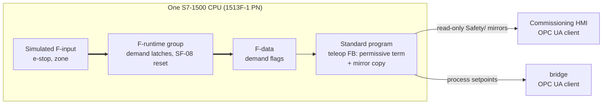

# ADR 0009: Early cell-scope opening of the safety layer on the forklift twin

Status:        accepted (2026-07-29). Owner-approved on that date; the five
decisions below are the owner's rulings, recorded here.

This ADR **supersedes nothing and renumbers nothing**. The gate order stays as
`docs/adr/0008-forklift-commissioning-gate-and-hmi-layer.md` D1 set it, M4 stays
the current gate with its criteria unchanged (D4), and M5 stays shut. What it
rules is that part of M5's *content* — the cell-scope core — is built early, on
the M4 cell, under a fallback rule (D2, D4).

It also reports, in part, on the feasibility question ADR 0007
(`docs/adr/0007-safety-first-gate-order.md`) attached to the safety gate:
*"whether PLCSIM Advanced can execute an F-CPU safety program … is not
established anywhere in this project."* The context section records what was
observed in the tool on 2026-07-29. Neither ADR 0007 nor ADR 0008 is edited —
CLAUDE.md §8 forbids editing an accepted ADR — so the forward pointer lives here
and in `docs/roadmap.md`, which remains the live order.

Context:

**The owner ruled the early opening on 2026-07-29.** The reason it is possible
at all is that the F-CPU already exists in the cell: the commissioned CPU was
replaced with a 1513F-1 PN, and the same TIA project, the same PLCSIM Advanced
instance, the same OPC UA server interface and the same bridge now sit in front
of a CPU that can run a safety program. The cell-scope core of M5 — SF-01,
SF-08 and the SF-07 pattern — needs no vehicle, no broker and no fleet manager
(ADR 0007 §2), and the M4 twin gives it a moving machine to guard, which is the
"richer cell" ADR 0008 listed as a consequence of putting the plant gate first.

**What was observed in the tool, 2026-07-29.** Owner-executed in TIA Portal and
PLCSIM Advanced, read back rather than assumed, per the ADR 0006 discipline that
a tool-derived value is a design value until the tool states it:

| Item | Observed 2026-07-29 |
|---|---|
| CPU | 1513F-1 PN, order number **6ES7 513-1FM03-0AB0**, replacing the commissioned non-F CPU; PLCSIM Advanced instance, endpoint unchanged at `opc.tcp://192.168.53.1:4840` |
| Server interface | `DemoCell` compiled and served; the OPC UA runtime licence present. The LESSONS entry of 2026-07-27 — a *Change device* silently deletes the server interface and resets security — is therefore answered for this build in the direction that matters, a client having browsed and exchanged values through it; a tag-by-tag check of the interface stays the owner's item |
| Safety compile | The project compiled **with its F-runtime group present**: the group's main safety block `Main_Safety_RTG1` calling `F_Forklift_Safety` (F-FBD) with its instance DB |
| Download and run | Downloaded; CPU in **RUN** with the F-runtime group executing |
| Bridge link | The bridge connected to that CPU over OPC UA and a **live two-way round trip** was verified: a ROS-published input read back in the TIA watch table, and a watch-table output modify observed on the ROS topic |
| F-logic execution | The F-program executed **end to end**: a zone signal set the F-latch, the latch **held after the signal cleared**, and the reset-required flag rose |

**What that closes, and what it does not.** The feasibility checkpoint this
opening was to start with — Safety licence compile, F-runtime group reaching
RUN — is **substantially closed**: it compiled, it runs, and its logic latches
and demands a reset. What remains open is the **formal acceptance procedure**,
which is a different question: the AT sub-cases of `docs/safety/SRS.md`, the
standard-program-in-STOP sub-case (B3), and the M5 criterion's requirement that
the reactions execute with the bridge stopped and the OPC UA session down. The
2026-07-29 run is evidence that **the F logic executes**; it is not evidence of
any acceptance test, for three reasons stated here rather than discovered later:
the zone condition was fed from a standard, network-written tag; the reset
acknowledgement was a level rather than the monitored edge SF-08 specifies; and
the standard program was running throughout. D5's wording discipline and the
consequences below turn each of those into work rather than into a claim.

Decision:

### D1 — Scope: cell-scope only, on the forklift twin

The early opening covers exactly three items, each an **instantiation of an
existing SRS function on the twin**, never a new function:

| Item | Source | On the twin |
|---|---|---|
| **SF-01** cell e-stop chain | `SRS.md` §3 SF-01, AT-01 | A simulated e-stop demand latching in the F-program, removing the twin's motion enable |
| **SF-08** monitored reset, **cell instance** | `SRS.md` §3 SF-08, AT-08 | The edge-triggered monitored reset that clears the F-latches, refused while a demand stands |
| **SF-07** zone monitoring, **as a pattern** | `SRS.md` §3 SF-07, AT-07 | A **marked arena zone** the forklift can be driven into, whose F-input latches a demand |

The **onboard vehicle chain stays at its own gates**, stated explicitly because
a reader watching a vehicle-shaped machine stop will otherwise assume otherwise:
**SF-02** (vehicle e-stop / STO), **SF-03** (protective field), **SF-04**
(warning-field speed reduction) and the **vehicle instance of SF-08** land at
M6; **SF-09** at M7; **SF-05** and **SF-06** at M9; the arm functions at M11 —
all unchanged, under ADR 0008 D1's numbering.

Two boundaries inside the twin itself:

- The **lidar obstacle stop remains standard-program process logic** and is not
  SF-07. ADR 0008 D3 named that non-claim; it stands. The SF-07 pattern here is
  a *separate* marked zone driven at the F input, and the two are never merged,
  never share a tag name, and are named apart in every document and recording.
- The **process reset of the M4 row's item (d)** — the standard program's
  edge-triggered reset clearing its own process latch — is not SF-08. The same
  distinction ADR 0007 §2 drew for the demonstration cell's panel contact
  applies to the twin: a process reset clears standard-program latches only, and
  the SF-08 instance is a separate reset acting on the F-latches.

**The safety layer is not complete, and M5 is not open.** No document may
describe this opening as M5 closed, as the safety layer complete, or as an
acceptance test passed. ADR 0007's rule to that effect carries here word for
word.

### D2 — Gate discipline: an owner-ruled exception, bounded

CLAUDE.md §6 says *"do not start a gate before the previous one is verified."*
This opening departs from that, for the named cell-scope core only, by owner
ruling of 2026-07-29. The departure is recorded here because an undocumented
gate departure is precisely the drift the gate discipline exists to prevent.

The bounds, all four binding:

1. **M4's criteria are unchanged** (D4) and M4 closes on its own evidence,
   verified by its own gate brief.
2. **Nothing early-opened may be cited as M4 evidence.** The M4 showcase names
   every reaction as standard-program process logic; an F-layer reaction in that
   recording would contradict it.
3. **Nothing early-opened closes M5.** The gate keeps its criterion as
   `docs/roadmap.md` writes it, including the acceptance tests, the
   bridge-stopped and session-down execution, the read-only mirrors and the
   recorded cell + safety showcase.
4. **The accurate statement is "M5's cell-scope core is being built early"**,
   not "M5 is open". Tracking files use that wording.

### D3 — Architecture of the coupling

Three rules, and they are what makes invariant 1 true by construction rather
than by assertion:

**D3.1 — The safety demand forms entirely inside the CPU.** F-inputs enter the
F-runtime group, the F-program forms and latches the demand, and the latch lives
in F-data. No demand is formed by, routed through, timed by, or dependent on
anything on the network. Invariant 1 — *safety never traverses the network* —
is honoured because there is no network element between the demand's cause and
its reaction.

**D3.2 — The standard program consumes the F-demand; the F-program never reads
teleop state.** This is F-to-standard coupling inside one CPU, in one direction.
The standard program's motion permissive gains exactly one term derived from the
F-data, in affirmative form, and the F-program reads nothing the standard
program writes. Invariant 7 holds in the direction that matters: the safety
program must remain correct if the standard program halts or misbehaves, and a
program that reads no standard data cannot be broken by standard data. The
converse dependency is a *permissive*, so the standard program's failure mode
when F-data is absent or false-safe is **motion refused**.

**D3.3 — OPC UA carries process consequences and a read-only `Safety/` mirror
group.** The mirrors are written by the **standard program**, copying F-data for
display, and are **read-only to every client**. No client write can create,
prevent or clear a safety reaction. The mirrors are diagnostics; the mirror of a
demand is not the demand.

Thick arrows are the safety path. It begins and ends inside the CPU box, which
is the whole claim: what leaves the CPU is a consequence and a mirror.

### D4 — Fallback rule: the M4 demonstration stands alone

**M4's criteria are unchanged by this ADR**, word for word: the five behaviours
(a) teleoperated drive with the PLC forming all motion setpoints, (b) the fork
stopped by the PLC's soft travel limits, (c) the traction speed cap, (d) the
lidar-zone process stop with its edge-triggered process reset, (e) HMI heartbeat
loss zeroing the motion setpoints — plus the recorded commissioning showcase
naming every reaction as standard-program process logic.

**Nothing of M4 depends on this opening.** If the F-layer is not ready, every
early-opened item is dropped and the teleop demonstration stands on its own.

**The fallback is inert by construction, not by intention.** Each early-opened
deliverable carries its own no-F-layer behaviour: with no F-program present the
F-data flags read clear and the permissive term is inert; absent mirrors render
as "not present" rather than as an error; the F-layer scenario section opens by
saying it runs only when the F-program exists. A fallback that needs a document
edit to take effect is not a fallback.

**If the fallback is taken, nothing is lost.** The early-opened work continues
as ordinary M5 content when the gate opens properly.

**The trigger.** Originally: any feasibility item failing. As of 2026-07-29 the
compile, RUN and F-logic-execution items are observed (context), so the live
trigger narrows to the formal acceptance procedure — the AT sub-cases, the
standard-program-in-STOP sub-case and the bridge-down execution — and to the
three build gaps named in the consequences.

### D5 — ISO 13849 basis and wording discipline

**The existing derivations are the reference.** `docs/safety/SRS.md` and
`docs/safety/PL-SCENARIOS.md` hold the risk-graph derivations, the PLr floors
and the SRS §5 targets. This ADR creates no SF number, no PLr and no PL value,
and nothing here re-argues a parameter:

| Function | Scenarios | PLr (floor) | SRS §5 target |
|---|---|---|---|
| SF-01 | SC-01, SC-02, SC-03 | d | Category 3, PL d |
| SF-07 | SC-10 | d | Category 3, PL d |
| SF-08 | SC-11 | d — *held by SF-07, not by the reset* | PL c, adequate because a reset starts nothing |

**Simulation demonstrates the acceptance-test logic; it does not claim achieved
PL.** An achieved PL needs rated devices, a two-channel architecture with its
diagnostic coverage, and component reliability data. A simulation supplies none
of those, and no document, tag name or recording produced under this opening may
imply otherwise.

**The simulated F-input is an engineering stand-in**, labelled as such
everywhere it appears: it stands in for a hardwired, safety-rated device on
F-I/O — a two-channel e-stop, a safety-rated zone device, an F-panel reset —
none of which exist in this project. This is the same naming discipline ADR 0004
set for the demonstration process stop and ADR 0007 and ADR 0008 carried
forward.

**The recording names which reactions are which**: F-CPU safety functions versus
standard-program process logic, spoken as well as written, on a cell where a
viewer can see both.

Consequences:

What becomes harder:

- **A gate departure now exists and has to stay visible.** `docs/roadmap.md`
  gains a note (separate brief), and `docs/PLAN.md` and `docs/TODO.md` must say
  the same thing. The standing rule that those three files never disagree is
  what makes a departure safe to record and unsafe to leave implicit.
- **One tag, one writer, across two programs.** In the 2026-07-29 build the
  F-program writes the twin's status tags directly, which the standard teleop FB
  also owns — a dual-writer conflict against invariant 10. The resolution is
  fixed here as architecture and specified elsewhere: **F outputs live in F-data;
  the standard program copies them to the `Safety/` mirrors; the F-program never
  writes the standard status group again.**
- **The network-fed zone input must move to the F-input channel.** The observed
  run drove the F-block from a standard tag written over the network. That is an
  engineering stand-in and is never called the safety path — and it cannot
  satisfy the M5 criterion at all, since a reaction whose input arrives over OPC
  UA cannot execute with the session down. The F-inputs are driven at the
  simulated F-I/O / engineering interface instead.
- **The reset must become an edge.** The observed acknowledgement is a level,
  while SF-08 requires a rise, a hold between 0.2 s and 3 s, release-edge action,
  and rejection of a signal high at power-up. A level reset makes every safety
  stop momentary, which is the defect the monitored reset exists to prevent.
- **The F-program is touched at two gates** — here and at M5 proper — rather
  than built once, which ADR 0007 already listed as the cost of splitting the
  safety layer across gates.
- **Two ways to say "stop" now exist on one machine.** The lidar process stop and
  the zone safety demand look similar from outside and are architecturally
  opposite. Every document, tag name and spoken line has to keep them apart, and
  this is the single most likely place for the project's central claim to be
  misread.
- **Safety wording is now load-bearing in a public artifact.** The non-claims —
  no achieved PL, stand-in inputs, cell scope only — have to survive into the
  recording, not only into the documents.

What becomes easier:

- **The feasibility question is answered in the tool rather than argued.** ADR
  0007 left it open, TODO carried it as an entry condition, and 2026-07-29
  settles the compile, the RUN and the executing F-logic. The remaining question
  is procedural, not architectural.
- **Invariant 1 becomes observable on the twin.** With the demand formed inside
  the CPU and only consequences and mirrors on the wire, the strongest evidence
  for the project's separation-of-concerns claim can be demonstrated on a moving
  machine at the earliest point the equipment exists.
- **Read-only is enforcement here, not policy.** Per-tag writability is enforced
  by the CPU, so the `Safety/` mirrors being unwritable is a property of the
  server rather than an agreement. The per-*client* scoping gap of ADR 0008 D2.5
  is unchanged and still open, but it does not reach the mirrors.
- **M5 starts from a running F-runtime** instead of from a feasibility question,
  and its acceptance runs test logic that has already been seen to execute.

What this ADR does **not** decide: the F-program's internal structure, its tag
names, its F-runtime settings and its implementation language; how the simulated
F-inputs are driven; the `Safety/` mirror node names and their group; how the
HMI displays them; the marked zone's geometry; the full M5 acceptance runs,
the recorded cell + safety showcase and the demonstration cell's own F-I/O;
SF-05 and SF-06; OPC UA access control, which stays the open item ADR 0008 D2.5
recorded; and anything at all about the vehicle chain, the fleet layer or the
parked M12 command path.

Alternatives:

- **Implement teleop process logic inside the F-program** — rejected: invariant
  7, and ADR 0008 D3 stands. A safety program that carries teleop routing is no
  longer independent of the standard program's correctness, and the process
  *consequence* of a demand belongs on the standard side, where it can be read,
  mirrored and named as process logic.
- **A network-carried safety input for the zone** — rejected: invariant 1. For
  the demonstration the F-inputs are driven at the simulated F-I/O / engineering
  interface and labelled as stand-ins. The 2026-07-29 run used the network-fed
  form and is therefore recorded as evidence that the F-logic executes, never as
  evidence of a safety function.
- **Call the 2026-07-29 latch observation an AT-07 pass** — rejected, and worth
  writing down because it is the tempting over-claim: it ran with a network-fed
  input, a level reset and the standard program running, so it satisfies none of
  AT-07's four sub-cases. A latch that held is a latch that held.
- **Relabel the existing lidar obstacle stop as SF-07 on the twin** — rejected:
  it traverses ROS 2, the bridge and OPC UA, so it breaks invariant 1, and ADR
  0008 D3 already named that non-claim. The observable behaviour is identical
  when the reaction is named a process interlock, and naming it correctly is the
  claim this project is judged on.
- **Wait for M4 to close before opening any M5 content** — the default, and
  rejected by owner ruling: the F-CPU is already in the cell, and the fallback
  rule of D4 makes the opening free of risk to M4. What makes the departure
  acceptable is that M4's criteria are untouched and every early-opened item is
  inert without the F-layer.
- **Open M5 in full rather than its cell-scope core** — rejected: SF-05 and
  SF-06 need cell equipment that does not exist, the vehicle chain needs a
  vehicle, and the acceptance runs and showcase belong to the gate proper. The
  cell-scope core is the largest piece that the twin can carry honestly.
- **Re-derive PL values for the twin** — rejected: a PLr belongs to the hazard,
  not to the instance demonstrating it, and the derivations exist. A second set
  of numbers would be a second set to keep consistent, for no gain.
