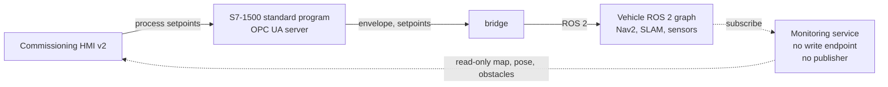

# ADR 0011: Sensored autonomy architecture — the vehicle's safety controller, its F-I/O path, the motion envelope, the monitoring plane and the claim boundary

Status:        accepted (2026-07-30). Owner-approved on that date; the five
decisions below are the owner's rulings, recorded here.

What this ADR does, stated before anything else:

- It **extends ADR 0009**
  (`docs/adr/0009-early-cell-scope-safety-on-the-forklift-twin.md`), which is
  not superseded. That ADR opened the cell-scope safety core on the forklift
  twin and specified the coupling (D3) and the wording discipline (D5). D1 below
  names **what the twin's F-layer represents**, which ADR 0009 left unnamed.
- It **closes the open decision ADR 0010 D6(a)**
  (`docs/adr/0010-milestone-restructure-forklift-first.md`) — the HMI map view's
  missing data path — in D4. ADR 0010 D2 remains the statement of M5's content
  and D6(b)'s reading of the HMI emergency button is unchanged.
- It **supersedes nothing and renumbers nothing.** The gate order stays as
  ADR 0010 set it and `docs/roadmap.md` remains the live order.
- **Invariants 1–13 are untouched.** Two consequences are explicit rather than
  implied:
  1. The CLAUDE.md §3 topology gains **one monitoring-plane edge** (D4).
     Invariant 11 reads against that topology, so the diagram must gain the edge
     for the invariant to keep saying what it means. CLAUDE.md is the owner's
     file and is not editable by the agent authoring this ADR: the amendment is
     a **separate owner-approved infra brief**, and this ADR is its authority.
     Until it lands, the diagram and this ADR disagree, and this ADR is the
     newer statement — the ADR 0005 and ADR 0008 precedent.
  2. D3 amends a **gate-criterion phrasing** carried from M4 — "the PLC forms
     all motion setpoints" — for autonomous mode only. A gate criterion is not
     an invariant, and no invariant is amended by it.

No accepted ADR is edited; CLAUDE.md §8 forbids it. Forward pointers live here
and in `docs/roadmap.md`.

---

Context:

**The owner ruled the M5 architecture on 2026-07-30**, at the gate's briefing.
ADR 0010 D2 defines M5's content — safety scanner into the F-blocks, navigation
lidar, SLAM and Nav2 on the forklift, HMI v2 with mode selection and a live map
— and left five architectural questions unanswered inside it: what the twin's
F-layer *is*, how a scanner signal reaches the F-program honestly, what the PLC
owns once a navigation controller exists, where map and pose data travel, and
what may be claimed about any of it. Those five are the decisions below.

**External evidence.** Every external fact this ADR rests on is listed here with
its source and its verification date. Nothing outside this table is asserted as
external fact, and the LESSONS rule of 2026-07-26 applies: a vendor claim without
a pinned reference ages silently, so each row names the document edition and
order number where one exists and is marked as unpinned practice where one does
not.

| # | Fact | Source | Verified |
|---|---|---|---|
| F1 | Simulating a project with fail-safe input and output modules requires **safety system version V1.6, V2.0, V2.1, V2.2, V2.3, V2.4 or V2.5**, and does not work correctly with an older version | S7-PLCSIM Advanced **V5.0** Function Manual, 11/2022, **A5E37039512-AE**, §3.7 | 2026-07-30 |
| F2 | The **V4.0** manual names only V1.6 and V2.0 | S7-PLCSIM Advanced V4.0 Function Manual, 05/2021, **A5E37039512-AD** | 2026-07-30 |
| F3 | TIA V18/V19 projects default to a **higher safety system version** than F2's list. This is the **probable** cause of this project's earlier finding that no usable F-I/O channel existed (`plc/forklift-safety/SPEC.md` §2.1, open item 1) — probable, not established | Derived from F1/F2 against this project's own record | 2026-07-30 |
| F4 | The supported safety system versions for **PLCSIM Advanced V6.0 and later were NOT confirmed** | — | recorded **unverified**, 2026-07-30 |
| F5 | S7-PLCSIM does **not** fully behave like a real F-CPU and **F-I/O startup behaviour cannot be simulated exactly**; automatic reintegration occurs from the **second cycle** of the F-runtime group; channel values initialise to **0** and value status to **1** on STOP→RUN; simulated value status does **not** drive QBAD/PASS_OUT as real F-I/O does | SIMATIC Safety programming manual, 11/2022, **A5E02714440-AM**, §10.7.4 and §12.1 | 2026-07-30 |
| F6 | Only fail-safe data or fail-safe signals from F-I/O and other safety programs may be processed in the safety program, **because standard tags are unsafe**; warning **S015** requires process-specific validity checks, separately per F-runtime group. The reverse direction is unrestricted — the standard program may read all data of the safety program. TIA's mechanism is **disclosure** (standard tags read by the safety program are listed in the safety summary), **not protection** | SIMATIC Safety programming manual A5E02714440-AM, §8.2 and §8.1 | 2026-07-30 |
| F7 | The API is to be accessed **by tag name** rather than by address areas, with an explicit warning against writing bytes belonging to other applications or containing internal data such as **qualifier bits for fail-safe modules**. Deterministic coupling to the F-runtime group is supported via **PIP 1** with **SYNC_PI / SYNC_PO** registered as pre/post processing of that group | S7-PLCSIM Advanced Function Manual (F1) | 2026-07-30 |
| F8 | **SICK microScan3 Pro PROFINET**: 275° aperture, ≤8 simultaneously monitored fields, 128 monitoring cases, **Type 3** (IEC 61496), **Cat 3 / PL d** (ISO 13849), **PFH 8×10⁻⁸ h⁻¹**. nanoScan3 offers **no PROFIsafe variant**; S300/S3000 are **discontinued** | SICK product data for the named model | 2026-07-30 |
| F9 | Monitoring-case (field-set) selection is made safe by a safe transmission channel, cross-validation against safely measured **speed and direction**, the scanner's **permitted-successor** switching-sequence check, and a switching-time margin. **Warning field → speed reduction is normally a process function; protective field → stop is the safety function** | Safety-scanner application practice reviewed on the date shown; **no single pinned document** — recorded as practice, not as a quotable clause | 2026-07-30 |
| F10 | **STO** supplies no torque-generating energy; **SS1** decelerates then applies STO; **SLS** prevents the motor exceeding a defined speed limit. SLS is normally realised **in the drive** and selected by the F-CPU; its stop response is parameterised as immediate STO or braking ramp then STO | IEC 61800-5-2 as quoted in Siemens drive-safety literature | 2026-07-30 |
| F11 | **ISO 3691-4** is a **Type C** standard for driverless industrial trucks; with personnel-detection means **muted**, maximum speed is **0.3 m/s** | ISO 3691-4 | 2026-07-30 |
| F12 | **ISO 13849-1:2023** is the fourth edition; **EN ISO 13849-1:2015 is withdrawn** | ISO / CEN catalogue | 2026-07-30 |

**F8 is component data for the device class being modelled. It is not, and is
never presented as, a figure achieved by anything in this repository** — see D5,
which forbids exactly that reproduction.

---

Decision:

### D1 — The forklift's F-runtime group is the **vehicle's onboard safety controller**

`F_Forklift_Safety` is declared, architecturally, the safety controller carried
**by** the forklift. It is **not** the fixed cell's F-CPU reaching out to act on
a remote vehicle. The chain **scanner → F-program → STO is therefore internal to
the vehicle**, and in a real build it is hardwired.

Why this reading and not the other. On real AGVs the safety laser scanner's
OSSDs go to the vehicle's **own** safety controller — a Flexi Soft or an onboard
safety PLC — and PROFIsafe from a moving vehicle to a stationary F-CPU across a
wireless link is not accepted practice (research of 2026-07-30). It is also
forbidden here on the project's own terms: a protective stop whose demand
crosses a radio link is a safety function traversing the network, which
invariant 1 prohibits outright.

**It scales.** At M6 four forklifts each carry their own safety instance, which
is what the physical world does. The simulation's **single 1513F-1 hosting that
instance is a simulation artifact and is disclosed as one** wherever the twin is
described — it is not an architectural claim that one F-CPU guards a fleet.

This extends ADR 0009, which opened cell-scope safety on the twin without saying
what the twin's F-layer stood for. ADR 0009 D3's coupling rules are unchanged and
carry into this reading unaltered: the demand forms entirely inside the CPU, the
standard program consumes it in one direction, and OPC UA carries process
consequences and read-only `Safety/` mirrors only.

### D2 — The scanner reaches the F-program through **configured F-I/O, stimulated by the PLCSIM Advanced API** — the simulation's equivalent of wiring

An **ET 200SP F-DI** is configured in HW config as the scanner's **OSSD pair** —
1oo2 equivalent, with discrepancy time and input delay parameterised as if the
device were real. The Gazebo scanner model drives those **channel values through
the S7-PLCSIM Advanced API by tag name** (F7).

The rationale is a single sentence: in a real vehicle the OSSD signal arrives on
copper, never on a network, so the honest simulation analogue is a path that does
not traverse OPC UA either. Safety signals therefore **never enter the process
network**, and invariant 1 holds in letter as well as in spirit rather than by
assertion. OPC UA continues to carry process data and the read-only `Safety/`
mirrors of ADR 0009 D3.3, and nothing about the mirrors changes: the mirror of a
demand is not the demand.

Two properties of the simulated path are recorded now rather than discovered
later, both from F5: F-I/O **startup behaviour cannot be simulated exactly**,
reintegration occurs from the second F-runtime-group cycle, channel values
initialise to 0 with value status 1, and **simulated value status does not drive
QBAD/PASS_OUT as real F-I/O does**. Any evidence produced on this path is
qualified accordingly. Where determinism matters, F7's **PIP 1 with SYNC_PI /
SYNC_PO registered as pre/post processing of the F-runtime group** is the
supported coupling, and the API's warning against writing bytes that carry
fail-safe qualifier bits is binding: writes are by tag name only.

**Feasibility condition, in the ADR 0009 D4 pattern.**

- **What is settled, and where.** The **first M5 brief** settles *in the tool*:
  (i) whether this project's PLCSIM Advanced version and its safety system
  version support F-I/O simulation at all — F1 lists the supported versions for
  V5.0, F2 for V4.0, and **F4 records that the list for V6.0 and later is
  unverified**; and (ii) whether the API writes the configured F-DI's **channel
  values by tag name**. Both are read back in the tool, per the ADR 0006
  discipline that a tool-derived value is a design value until the tool states
  it.
- **The trigger.** Either question answering no.
- **The named fallback.** The **present standard-DB stand-in** of
  `plc/forklift-safety/SPEC.md`, which is then **labelled a stand-in wherever it
  appears** and **carries the Siemens S015 validity check visibly in the
  F-code**. F6 is why the labelling is not cosmetic: standard tags are explicitly
  not fail-safe data, TIA's mechanism is disclosure rather than protection, and a
  document that quietly let the stand-in read as the safety path would be showing
  safety logic consuming unsafe data while claiming realism.
- **The fallback is inert by construction.** It is the path the project already
  runs; taking it requires building nothing and removing nothing.
- **The fallback does not reopen D1.** Which controller the F-program *is* does
  not depend on how its inputs are stimulated. If the fallback is taken, the
  vehicle's safety controller is still the vehicle's, and only the input path is
  a stand-in.

### D3 — In autonomous mode the PLC issues a **motion envelope**, not per-sample setpoints

The standard program publishes, at its own cycle, an **autonomy envelope**: a
**motion enable**, a **speed ceiling** and a **zone permit**. The navigation
control loop closes **onboard the vehicle at its own rate**.

Why. Nav2's controller is a ~20 Hz closed loop. Routing each velocity sample
through ROS → OPC UA → PLC scan → back introduces tens to a hundred-plus
milliseconds of non-deterministic latency, which does two damaging things at
once: it places a **timing-critical loop in Python**, which invariant 9 forbids,
and it makes gate-zeroed commands **abort the goal through Nav2's progress
checker** — the reaction looks like a navigation failure rather than like a
supervisory intervention. Supervision at **order and zone level** rather than at
velocity level is also what VDA 5050 and industrial practice do, and it is what
invariants 5 and 6 already describe: the supervisor issues orders and permits and
reads state; it does not close another layer's control loop.

**What this amends, precisely.** The M4 phrasing *"the PLC forms all motion
setpoints"* continues to hold **for TELEOPERATED mode**, which is where it was
demonstrated and recorded. For **AUTONOMOUS mode** it reads: **"the PLC forms and
owns the motion envelope; no motion occurs outside it."** **The M4 gate criterion
itself is unchanged and already closed on teleop** — nothing here reaches back
into a closed gate, and the M4 showcase's statements remain true as recorded.

**Recorded as a consequence for implementation, not as a decision:** an
externally gated command stream requires the **velocity smoother to run
closed-loop against measured odometry**, not against its own last command. A
smoother that integrates from its own output will fight the gate and ramp from a
value the wheels never had.

### D4 — A **read-only monitoring plane** joins the topology

Map, pose and live obstacle data reach the operator through a **monitoring
service** that subscribes to the vehicle's ROS 2 graph and serves the HMI page
**read-only**. It has **no write endpoint and no publisher** — read-only **by
construction, not by configuration**.

**The process plane is unchanged and remains the only command path**:
HMI → PLC → bridge → vehicle. Nothing in D4 carries a command, a setpoint, an
enable or a reset.

Why a separate plane. A SLAM map cannot sensibly transit OPC UA process nodes,
and adding ROS 2 subscribers to `hmi/` would weaken that layer's own "This layer
must not access" statement — which is exactly the reasoning that made `bridge/`
its own top-level layer in ADR 0005 D1: *a component that cannot live inside a
layer without weakening that layer's boundary is its own layer.*

This is **the decision ADR 0010 D6(a) left open**. It **amends the CLAUDE.md §3
topology by adding one edge**, drawn in a **third style distinct from both the
safety path and the process path**, so that a reader can see at a glance that
the new edge is neither. The amendment is a separate owner-approved infra brief,
per the preamble.

Solid arrows are the process plane, the only command path. Dotted arrows are the
monitoring plane, which carries no command in either direction.

**The service's directory is NOT ruled here.** It is **recommended as `agv/`** —
the vehicle publishing its own telemetry — and recorded as an **implementation
question for the first monitoring brief**, to be settled against the **ADR 0005
test** named above. The alternative on the table is a **`viz/` top-level layer**,
which the ADR 0005 test selects if the service cannot live in `agv/` without
weakening that layer's boundary statement.

### D5 — Claim boundary for ISO 13849 and ISO 3691-4

M5 states **`PLr` targets derived from a documented risk assessment** — the
derivations in `docs/safety/SRS.md` and `docs/safety/PL-SCENARIOS.md`, which this
ADR does not touch, re-derive or re-argue — and claims **no achieved PL, SIL or
PFH whatsoever**.

**The following are claims the project must never make, in this or any later
gate, while it remains hardware-free.** The list is binding and is reproduced in
full:

1. An **achieved PL**, an achieved **Category**, or an achieved **SIL** for its
   own chain.
2. Any **PFH**, **MTTFd**, **DCavg** or **CCF** figure for its own chain.
3. **"certified"**, **"compliant with"**, **"TÜV assessed"**, **"CE marked"**.
4. **"validated per ISO 13849-2"**.
5. A **verified response time**, **stopping distance** or **protective field
   length**.
6. **"safety functions tested"** without **"in simulation, against a model"**.
7. **Any reproduction of a component's datasheet safety figure as if it were
   this system's result** — F8 is named in this document precisely so that its
   status as the *modelled device class* is unambiguous.

**No acceptance is claimed either.** The TIA Portal **safety acceptance test**
and the **program signature** presuppose real F-hardware, so neither is claimed,
implied or reported here or in any M5 artifact.

Two standards facts frame the wording rather than licensing a claim: **ISO 3691-4
is a Type C standard for driverless industrial trucks and caps speed at 0.3 m/s
with personnel-detection means muted** (F11), which is the practice the model
follows, not a conformity statement; and **ISO 13849-1:2023 is the fourth edition
while EN ISO 13849-1:2015 is withdrawn** (F12), which is the edition the existing
derivations are read against.

This is ADR 0009 D5's wording discipline carried forward and made a list. ADR
0004's naming rule for the demonstration process stop, ADR 0008 D3's non-claim
enumeration and ADR 0010 D6(b)'s reading of the HMI emergency button all stand
unchanged beneath it.

---

Consequences:

What becomes harder:

- **The topology diagram must change before it is read again.** Invariant 11 is
  enforced against CLAUDE.md §3, so a monitoring edge that exists in the code and
  not in the diagram makes the invariant unenforceable in the one direction it
  matters. Until the infra brief lands, this ADR is the newer statement, and the
  verifier has two documents to reconcile rather than one.
- **A third plane exists on one screen.** ADR 0010 already warned that the lidar
  process stop, the F-layer safety demand and the HMI emergency button are three
  ways to say "stop" that must never share a name. D4 adds a **fourth thing that
  looks like a data path and is not a command path**, so every document, caption
  and spoken line must keep the monitoring plane apart from the process plane.
- **"Read-only by construction" has to be provable.** A service with no write
  endpoint and no publisher is a build property, and the first monitoring brief
  must be able to show it as one rather than as a configuration setting that a
  future edit could flip.
- **The F-I/O path may not exist in this tool.** F4 leaves the V6.0 and later
  support list unverified, so D2's primary path is conditional in a way D1, D3,
  D4 and D5 are not. The fallback is inert, but taking it means the labelling
  burden of F6 lands on every document that mentions the input.
- **Simulated F-I/O evidence is qualified evidence.** F5's startup, reintegration
  and value-status differences mean that anything measured on the simulated path
  is evidence about the logic, never about the device behaviour, and each
  artifact has to say so.
- **The velocity smoother becomes load-bearing.** D3's implementation
  consequence — closed-loop against measured odometry — is the kind of detail
  that is invisible until the envelope closes and the vehicle lurches.
- **Two motion-ownership sentences now exist**, one per mode. Every document that
  quotes the M4 phrasing must quote the mode with it, or it will read as a
  contradiction of a closed gate.

What becomes easier:

- **Invariant 1 becomes true by construction on the vehicle too.** D1 and D2
  together put the whole scanner-to-stop chain inside the vehicle, so there is no
  network element between a protective-field intrusion and its reaction — the
  same property ADR 0009 D3.1 gave the cell-scope demand, now extended to the
  chain a viewer will actually watch.
- **The architecture scales to M6 without restatement.** Four forklifts, four
  onboard safety instances; the fleet gate inherits the reading rather than
  renegotiating it.
- **The PLC's role in autonomy is sayable in one line.** "The PLC owns the
  envelope; the vehicle closes the loop" is a supervision story a reviewer
  recognises, and it is the same story VDA 5050 tells at M6.
- **The map view has a path that costs no layer its boundary.** ADR 0010 D6(a)
  is closed without an OPC UA hack, without ROS 2 in `hmi/`, and without amending
  invariant 11.
- **The claim boundary is a list rather than a judgement.** D5 turns "be careful
  what you claim" into seven checkable items, which a verifier can grep for and a
  recording script can be read against.

What this ADR does **not** decide: the monitoring service's directory (D4,
recommended `agv/`, ruled at the first monitoring brief against the ADR 0005
test); its transport, page technology and refresh rate; the scanner count,
mounting geometry, field sets and monitoring-case switching design; the envelope
node names, their group and their access rights, which are
`docs/interfaces/opcua-nodes.md`'s under invariant 10; the F-DI module's exact
order number and parameterisation values; the SLAM approach and the Nav2
configuration; the HMI v2 layout; the arena's marked-zone geometry; the M5
acceptance runs and the recorded safety + autonomy showcase; and anything about
the fleet layer, the LLM layer or the m4-00 decisions that remain open.

Relationship to the ADRs this one stands on, each stated:

| ADR | Relationship |
|---|---|
| **0002** vehicle platform | Its platform selection was **superseded by ADR 0010 D1**; the in-house forklift is the vehicle platform from M5 onward. This ADR rests on that, revives nothing from ADR 0002 and re-verifies none of its vendor findings — no decision here depends on them |
| **0005** bridge layer | Its **D1 test** — a component that cannot live inside a layer without weakening that layer's boundary is its own layer — is the test D4 applies to the monitoring service and names as the test the first monitoring brief must apply. The bridge's own no-logic rule is untouched: the envelope of D3 is formed in the PLC and carried by the bridge, never computed in it |
| **0008** commissioning gate and HMI layer | **D2's** commissioning-HMI layer, its client role and its watchdog pattern are unchanged and are what HMI v2 inherits. **D3's** ruling that teleop routing and the lidar obstacle stop are standard-program process logic implementing **no SRS function** stands word for word — in particular the lidar stop is still not SF-03, however similar it looks once a real scanner is present. **D4's** in-house model is the machine all of this attaches to. What is amended is the **M4 gate-criterion phrasing** only, for autonomous mode, per D3 above |
| **0009** early cell-scope safety on the twin | **Extended, not superseded.** D1 names what its F-layer represents; its **D3** coupling architecture (demand formed inside the CPU, one-directional F-to-standard consumption, read-only `Safety/` mirrors) is unchanged; its **D1** boundaries hold — the lidar process stop is not SF-07 and the process reset is not SF-08; its **D5** wording discipline is carried forward and enumerated in D5 here. Its **D4** fallback pattern is the pattern D2's feasibility condition follows |
| **0010** milestone restructure | **D2** defines M5's content and this ADR supplies the architecture inside it. **D6(a)** is **closed** by D4. **D6(b)**'s reading of the HMI emergency button — a process stop plus a display of F-layer state, never a safety function over the network — is unchanged and is not reopened. The gate order, numbering and the D7 landing points are untouched |

---

Alternatives:

- **Present the vehicle's scanner as F-I/O of the fixed cell PLC** — rejected.
  It contradicts invariant 1, since the protective-stop demand would cross the
  network from a moving vehicle, and it is not real-world practice: PROFIsafe
  from a moving vehicle to a stationary F-CPU over a wireless link is not
  accepted (research of 2026-07-30). An industrial reviewer would call it out,
  and would be right to.
- **Keep the standard-DB path as the primary design** — rejected. F6 makes such
  data **explicitly not fail-safe**, and TIA's S015 mechanism is disclosure
  rather than protection, so the demonstration would show safety logic reading
  unsafe data while claiming realism. It survives only as D2's **named fallback**,
  labelled as a stand-in and carrying its S015 validity check visibly.
- **Route every Nav2 velocity sample through the PLC** — rejected on three
  counts: the latency and jitter place a timing-critical loop in Python
  (invariant 9); zeroing commands at the gate aborts goals through Nav2's
  progress checker, so the supervisory action presents as a navigation failure;
  and no published prior art exists for PLC-in-the-loop Nav2, which for a
  portfolio project means demonstrating an unrecognised pattern instead of a
  recognised one.
- **Add ROS 2 subscribers to the HMI backend** — rejected. It weakens `hmi/`'s
  "This layer must not access" statement, which is precisely the failure ADR 0005
  exists to prevent, and a boundary statement with an exception carved into it is
  weaker than one without.
- **`foxglove_bridge` as the operator map view** — rejected. Its read-only
  property would depend on **configuration rather than construction**, which is
  the distinction D4 is built on, and it adds a heavy dependency to a project
  whose simulation stack has not gained one since M3.
- **Claim a PL for the simulated chain** — rejected. No hardware, no validation,
  no assessment: the claim would be false regardless of how good the logic is,
  and the project is judged on the accuracy of its architectural statements
  rather than on the size of its claims.
