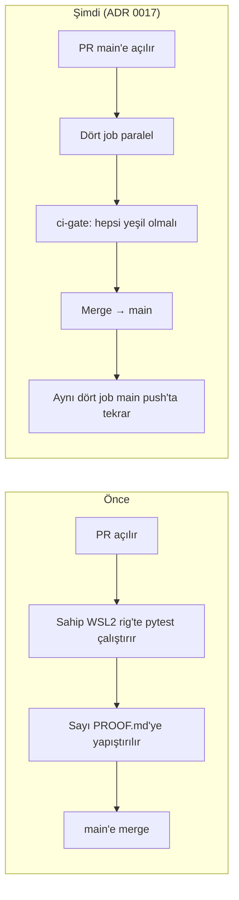
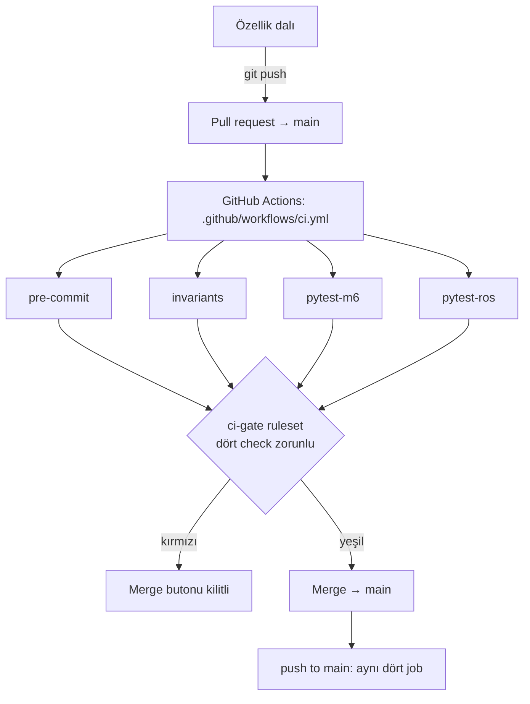
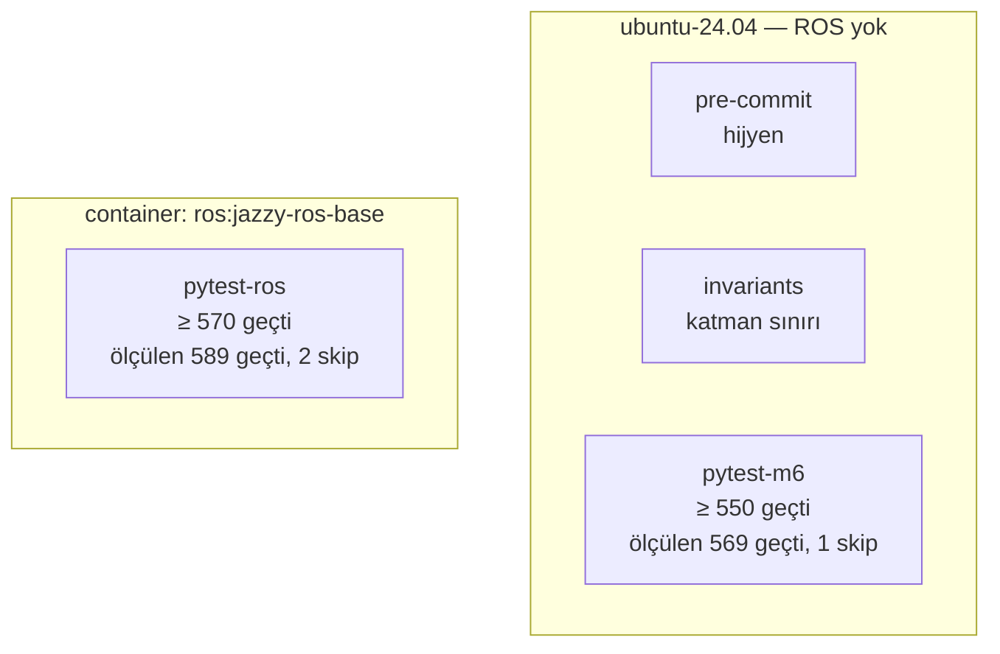
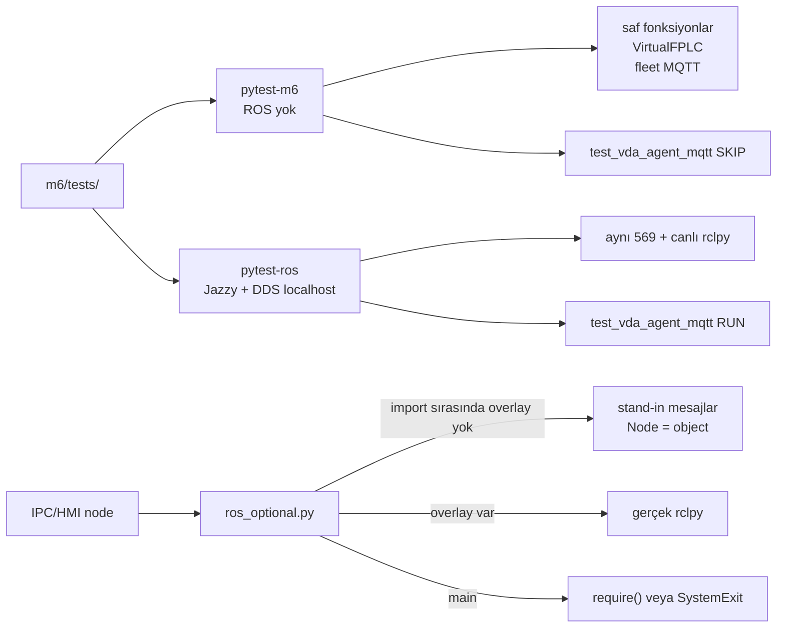

# CI/CD akışı — ne yaptık, kapı nasıl çalışır

Bu sayfa [ADR 0017](adr/0017-ci-as-the-integration-gate.md) kapısının
sahip anlatımıdır. Karar kaydı ve tasarım İngilizce durur; burası akışı
adım adım gösterir. Kız kardeş portföy
([robotics_cicd](https://github.com/ozkanceylan-dev/robotics_cicd),
OtoNav) disiplini verdi: korumalı `main`, her PR’de aynı kontroller,
localhost DDS, JUnit. Pipeline’ın kendisi kopyalanmadı — bu ağaç colcon
değil, Humble değil, MuJoCo değil.

**Kapı `main` üzerindedir.** `m5-ver3` gibi yan dallar bu ruleset’e
bağlı değildir. PR #6’nın `m5-ver3`’e girmesi beklenen davranıştır;
CI kapısı PR #5 ile `main`’e indi.

Yeşil kanıt: [Actions run 33149105366](https://github.com/ozkannceylan/amr-agent/actions/runs/33149105366)
(4/4 geçti). Karar: [PR #5](https://github.com/ozkannceylan/amr-agent/pull/5),
commit `667949c`.

---

## 1. Önce / sonra



Önce kalite sinyali **sahibin rig’inde** üretiliyordu. Gazebo, GPU ve
dört sanal F-PLC isteyen ölçüm orada kalır (`m6/PROOF.md`). Saf fonksiyon
regresyonu (`vda_orders.validate_order`, `traffic.reserve`, VirtualFPLC
ESTOP1 zinciri) rig beklemeden PR’de kırmızı olmak zorunda.

CI bir M-kapısını kapatmaz. Kaydedilmiş hücre koşusu hâlâ `PROOF.md`.

---

## 2. Uçtan uca akış



Tetikleyiciler (`on:`):

| Olay | Ne olur |
|---|---|
| `pull_request` hedefi `main` | Dört job; merge kapısı bunları bekler |
| `push` hedefi `main` | Aynı dört job; merge sonrası ağaç da yeşil kalır |
| `workflow_dispatch` | Elle tekrar koşu |

Aynı ref’te yeni push eski koşuyu iptal eder (`concurrency`,
`cancel-in-progress: true`). İzinler salt okunur (`contents: read`).

**GitHub UI’da, git’te değil:** ruleset adı `ci-gate`, **Active**,
hedef **Default (`main`)**, bypass boş.

Açık: Restrict deletions, Block force pushes, Require a pull request
before merging (onay sayısı **0**, Code Owners **kapalı**), Require
status checks: `pre-commit`, `invariants`, `pytest-m6`, `pytest-ros`
(Any source).

Kapalı (bilerek): Restrict updates/creations, linear history, signed
commits, **merge queue**, “Require branches to be up to date”.

---

## 3. Dört job

Dördü **paralel** başlar. Maliyet sırası ADR’de yazılı; Actions hepsini
aynı anda koşar. Hepsi yeşil olmadan `main`’e merge yok.



### 3.1 `pre-commit`

Hijyen. Formatter savaşı yok; tarihî ağaçları yeniden yazmaz.

Koşulan kancalar (`.pre-commit-config.yaml`): trailing whitespace,
EOF, YAML, merge-conflict işaretleri, LF satır sonu, 1 MB üstü yeni
dosya yasağı.

Hariç tutulanlar: `docs/archive/`, `m1/`–`m5/`, `m6/PROOF.md`,
evidence, harita/binaries, log/csv/png…

Yerelde: `pip install pre-commit && pre-commit install && pre-commit run --all-files`.

### 3.2 `invariants`

Yargı istemeyen, grep’in düşürebileceği ADR 0001 satırları.
`python3 m6/tools/check_layer_boundaries.py`.

| Kural | Anlamı |
|---|---|
| `m6/fleet/` `rclpy` / `ros_optional` / araç ROS düğümü import etmez | Filo ROS yaşamaz (inv. 11) |
| `m6/ipc/vda_orders.py` yalnızca stdlib | VDA kapısı iki uçta kaymasın |

Yargı isteyen kontrol verifier ajanında kalır; bu job değil.

### 3.3 `pytest-m6` — native, ROS yok

Ubuntu 24.04, Python 3.12, `m6/requirements-ci.txt` (`pytest==8.3.5`,
`paho-mqtt==2.1.0`, `PyYAML>=6.0.1,<7`), `python3-tk`, vendored
mosquitto (`m6/tools/install_broker.sh`). `ROS_DOMAIN_ID=89`.

```text
python3 -m pytest m6/tests/ -q --junit-xml=junit-m6.xml
python3 m6/tools/check_junit_floor.py junit-m6.xml 550
bash m6/m6.sh deploy && test -s m6/deploy/MANIFEST
```

Taban **550**. Ölçülen (2026-08-28): **569 geçti, 1 skip**. Skip
`test_vda_agent_mqtt.py` — canlı rclpy bağlamı ister; native job’da
bilerek durur.

IPC/HMI düğümleri ROS tiplerini `m6/ipc/ros_optional.py` üzerinden
alır. Overlay yokken mesaj stand-in’leri (`Twist.linear.x`,
`Float64.data`) iskelet testlerin toplanmasını sağlar. Overlay varken
modül geçiş kapısıdır; `main()` `require()` çağırır, overlay yoksa
`source /opt/ros/jazzy/setup.bash first` ile çıkar.

Gazebo bu job’da **yok**. `gz sim` açan test sayısı **0**.

### 3.4 `pytest-ros` — Jazzy overlay

Aynı suite, `ros:jazzy-ros-base` içinde. Bu job `test_vda_agent_mqtt.py`
koşar.

| Ayar | Değer |
|---|---|
| Image | `ros:jazzy-ros-base` |
| Overlay | `source /opt/ros/jazzy/setup.bash` |
| venv | `/tmp/ci-venv --system-site-packages` (Debian PyYAML/pluggy RECORD’u bozulmasın) |
| FastDDS | `$GITHUB_WORKSPACE/m6/tools/fastdds_loopback.xml` |
| Domain | `ROS_DOMAIN_ID=89` |
| RMW | `rmw_fastrtps_cpp` |
| Keşif | `ROS_AUTOMATIC_DISCOVERY_RANGE=LOCALHOST` |
| Taban | **570** |
| Ölçülen | **589 geçti, 2 skip** |

VDA MQTT fikstürü gitignore’lu `m6/vehicles/f1/config.yaml` yoksa
`instantiate_vehicle.py f1` üretir; `rclpy.try_shutdown()` her zaman
`finally` içinde.

JUnit her iki pytest job’dan artifact olarak yüklenir (`junit-m6`,
`junit-ros`).

---

## 4. İki suite neden var



Native job ucuz ve hızlı (~40 s, çoğunluk `test_fleet_manager_mqtt.py`).
ROS job VDA ajanını gerçek broker + gerçek rclpy ile doğrular. İkisi de
39 süreçlik hücreyi **başlatmaz**.

---

## 5. Kapının dışında kalanlar

Bunlar kırmızı check **üretemez**; `main`’e merge’ü CI durdurmaz.

| Ne | Neden |
|---|---|
| Gazebo / `m6.sh start` | 39 süreç + GPU; GitHub-hosted runner bunu taşımaz |
| PLCSIM Advanced, TIA, Windows writer | Sahibin Windows makinesi |
| `m5-ver3` ve diğer yan dallar | `ci-gate` yalnız `main` |
| Doğrudan `m5-ver3` PR merge | Ruleset hedefi değil |
| M7 / M8 kapanışı | CI mileston kapısı değil |
| Conventional-commit zorunluluğu | Bu çağın commit başlıkları düzyazı |
| MuJoCo / colcon / Humble / ament lint | Invariant 12 + ADR 0003 + düz Python |
| Secret / broker şifresi Actions’ta | Invariant 13; vendored mosquitto anonim |

---

## 6. Fazlar

| Faz | Durum | Ne |
|---|---|---|
| 1 Kapı | **indi** | pre-commit, invariants, pytest-m6 |
| 2 Overlay | **indi** | `ros_optional.py` + pytest-ros |
| 3 GHCR imaj | bekliyor | Test ortamı imajı; araç imajı değil. Deploy hâlâ `m6.sh deploy` (ADR 0016) |
| 4 Headless SIL | bekliyor | `m6.sh start --headless` ~39 süreç tutabilen runner’da; preflight topic hz; RTF rapor, 0.30 üstü kapı değil |
| 5 Merge queue | kısmen | `ci-gate` aktif. Native merge queue **bilerek kapalı** — check’ler `main`’de bir süre yeşil kalsın |

Her sonraki faz, önceki yeşil kaldıktan sonra required check olur.
Kırmızı gidemeyen check kapı değildir.

---

## 7. OtoNav’dan ne geldi, ne gelmedi

| OtoNav | Burada |
|---|---|
| Korumalı `main`, PR, required checks | evet |
| pre-commit hijyen | evet |
| FastDDS localhost | evet (`fastdds_loopback.xml`) |
| JUnit artifact | evet |
| CODEOWNERS + PR şablonu | evet, pytest/invariants/PROOF’a göre |
| Merge queue | sonra (Faz 5) |
| colcon + ament lint + gtest | **hayır** |
| Humble container | **hayır** — Jazzy |
| MuJoCo SIL | **hayır** — Gazebo |
| GHCR araç imajı | **hayır** — Faz 3 test ortamı |
| Conventional-commit gate | **hayır** |

---

## 8. Günlük kullanım

`main`’e gidecek iş:

1. Dal aç, değiştir, PR’ı **`main`’e** aç.
2. Dört check’in yeşil olmasını bekle. Kırmızıysa merge yok.
3. PR şablonundaki kutular: yerel `pre-commit`, layer-boundary, native
   pytest ≥ 550. VDA/DDS dokunuşunda `pytest-ros` yeşil.
4. Hücre koşusu (Gazebo, writer) gerekiyorsa `m6/PROOF.md` bölümünü
   göster; “CI kapsadı” deme.

Yerel native eşdeğer:

```bash
python3 -m pip install -r m6/requirements-ci.txt
bash m6/tools/install_broker.sh
python3 m6/tools/check_layer_boundaries.py
python3 -m pytest m6/tests/ -q
```

Dosyalar: [`.github/workflows/ci.yml`](../.github/workflows/ci.yml),
[ADR 0017](adr/0017-ci-as-the-integration-gate.md),
[tasarım](superpowers/specs/2026-08-28-ci-cd-integration-design.md),
[plan](superpowers/plans/2026-08-28-ci-cd-integration.md).
