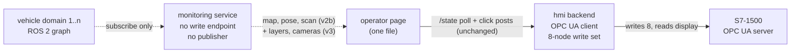

# HMI v3 — plan (m5-30)

**Plan document, not code.** Built AFTER M5 closes (owner ruling 2026-08-05);
planned now so it is ready, and so the one part of it that is cheap to shape
today — the constraints v3 needs from the not-yet-briefed m5-13 — is shaped
today (§2). Authority order unchanged: `docs/interfaces/opcua-nodes.md` wins
over this plan; `plc/forklift/SPEC.md` owns every rule the page displays;
ADR 0011 D4 and ADR 0016 D3(c) own the monitoring plane this plan rides on.
No OPC UA node and no ROS topic is invented here; where one is needed and does
not exist, it is a request (§7).

**The owner's four asks (2026-08-05, from the v2a screenshots), each mapped:**

| # | Ask | Where it lands |
|---|---|---|
| 1 | teleop joystick shown only when teleop mode is selected | Phase V3-1, `hmi/` only |
| 2 | the whole warehouse map, real time, vehicle's live position — "something like RViz" | the criterion half is **v2b (inside M5)**; the RViz-grade half is Phase V3-3 |
| 3 | every piece of vehicle information reachable from this page | Phase V3-2, the §4 inventory |
| 4 | selectable, openable, live camera views | Phases V3-4 and V3-5 — a model change first, measured |

---

## 1. The boundary: what v2b delivers, what v3 adds on top

**v2b is M5 work** (owner ruling 2026-08-05): roadmap criterion (e)'s clause
*"shows a real-time map with live obstacles"*, word for word. v3 **builds on
v2b and replaces nothing in it.** What this plan expects v2b to deliver —
stated here so the two versions cannot blur:

- The **m5-13 monitoring service** (ADR 0011 D4): subscribes to the vehicle's
  ROS 2 graph, **no write endpoint, no publisher**, never touches the PLC.
  Directory (`agv/` vs `viz/`) and reach-in mechanism (multi-context process
  vs `domain_bridge`, a new dependency, proposed-and-waiting) are **owner
  decisions ruled at m5-13** (ADR 0016 D3c). This plan assumes neither answer.
- A **map pane** in the third column v2a's layout reserves (`index.html`,
  V2A-DESIGN §11): the warehouse map, the vehicle's live pose, live obstacles.
  Fed from the monitoring service as a **second local source beside
  `/state`** — the OPC UA client, the eight-node write set and the 200 ms
  poll are untouched.
- The **restated header sentence** the m5-29 review names: the page's "no
  external request of any kind" was written against CDNs; a local
  monitoring-plane fetch is not what it forbids, and v2b says so in its design
  rather than silently widening it. v3 inherits the restated sentence.
- The **read-only enforcement ruling**, since ruled: `viz/DESIGN.md` §2
  rejected SROS2/DDS-Security as disproportionate and **recorded the
  limitation**, so the phrase now reads, everywhere and in full, **read-only by
  construction of the process and proven by test; not enforced by the
  middleware** (m5-judge finding 6). v3's camera selection is unaffected: it is
  subscription lifecycle only (§5), which is indifferent to whatever
  enforcement ruling ever supersedes that one.

**v3 adds, and only adds:** mode-conditional rendering of the teleop zone; map
interaction and layers beyond the criterion minimum; the full information
inventory; cameras. **v3 adds zero OPC UA nodes and zero HMI writes** — every
new datum on the page arrives over the monitoring plane, which is what makes
the owner's "everything visible" page compatible with the read-only invariant
by construction rather than by restraint (§5).

Solid is the process plane, the only command path (unchanged). Dotted is the
monitoring plane; nothing on it carries a command in either direction.

---

## 2. What v2b must decide NOW — the m5-13 shaping constraints

m5-13 has not been briefed. These five constraints cost m5-13 nothing extra if
adopted at its briefing and cost a rework of every consumer if retrofitted.
They are the single most valuable content of this plan, and they are
**requests to the m5-13 brief**, not v3 work:

1. **Per-vehicle namespace from day one.** The monitoring service's
   page-facing surface is rooted in the vehicle's VDA 5050 serialNumber
   (ADR 0016 D2 — the identity the fleet will use) even at n = 1, e.g. one
   URL space per serial. M6 is four vehicles and v3's camera selector is
   per-vehicle; a single-vehicle unnamespaced surface bakes n = 1 into every
   consumer — the exact defect LESSONS 2026-08-05 (104) records for
   `model.sdf`, one layer up.
2. **The whole warehouse map, not a vehicle-centred crop.** Criterion (e)
   could be satisfied by a local window; the owner's ask 2 could not. Serving
   the full map with the pose on it satisfies both and costs v2b nothing —
   the map_server map is one static raster.
3. **Bulk pixels never ride the JSON poll.** v2b picks the page transport;
   whatever it picks, the state poll carries values and verdicts only, and
   every raster (map now, camera frames later) is its own HTTP stream per
   kind. The m5-29 review already states video "rides its own stream … the
   poll was never asked to carry it"; making that a v2b design rule means v3
   adds endpoints instead of reshaping one.
4. **The D3c mechanism is ruled knowing v3's load.** `domain_bridge` forwards
   an explicitly named topic set (ADR 0016 F4) — adding cameras later means
   config churn per camera and full-time forwarding of heavyweight image
   topics whether watched or not. A multi-context in-process subscriber can
   create and destroy camera subscriptions on demand. This does not decide
   the owner's question; it is load information the ruling should have in
   front of it.
5. **"Selection" must be implementable as subscription lifecycle only.**
   Whatever enforcement m5-13 rules (SROS2 or recorded limitation), the
   design must let v3 select a camera by creating/destroying a DDS
   subscription in the operator-side service — never by a service call,
   parameter write or publisher into any vehicle domain. If m5-13's design
   would require a vehicle-side toggle to start a stream, that design
   forecloses v3's ask 4 and must be caught at briefing, not at build.

Nothing else in v3 reaches back into M5. In particular v3 forces **no** change
to v2a's state model, write set, node contract or `/state` schema (the m5-29
review verified none of the four owner wishes is foreclosed).

---

## 3. Phases

House style of `docs/reports/m5-22-vehicle-compute-deployment-research.md` §4:
one observable done-condition per phase, files touched, an explicit does-NOT
list. Each phase is one brief. Order is binding: V3-4 precedes V3-5 because an
unmeasured render cost must not be discovered on the page. Phases V3-1 and
V3-2 are independent of each other and of the camera pair.

### Phase V3-1 — the joystick appears only in teleop (hmi)
- **Do**: zone B (traction / steer / fork / ENABLE) renders only while the
  **mode in force** (`ForkliftDriveModeActive`, §12.3 M1 — never the
  selector's position, M2) reads `Teleop`; in every other mode the zone
  collapses to a one-line caption ("teleop controls appear when the machine
  is in Teleop"). Rendering only: **the eight-node write stream continues
  unchanged in every mode** (§10.8 H1 — a reverted DB is repaired by the next
  cycle), the rest values still stream, and the H6 deadman still governs.
  Unknown mode (link down, poll stale) hides the controls — M3's rule: a
  stale value never keeps its live look, and a control that cannot act must
  not invite acting.
- **Done-condition**: with the scenario double driving mode transitions, the
  capture instrument shows zone B present in Teleop, absent in None /
  Autonomous / unknown, while the backend's evidence CSV shows all eight
  nodes written every cycle throughout — one run, both facts in one log.
- **Touches**: `hmi/static/index.html`, `hmi/tools/capture_v2a_screens.mjs`
  (three new checks), `hmi/EVIDENCE_HMI.md`.
- **Does NOT**: stop, gate or thin the write stream; touch `hmi_server.py`'s
  cycle; hide the RESET or the process stop (they are mode-independent);
  derive visibility from the selector or the vehicle report.
- **Owner decision**: none.

### Phase V3-2 — every piece of information, reachable (hmi)
- **Do**: implement the §4 inventory as the page's information architecture:
  a per-vehicle detail view (drawer pattern scaled, as the m5-29 review
  anticipated) in which every datum of §4 is rendered with its owner named,
  grouped by source. The vehicle selector shell exists from the start (one
  vehicle listed at n = 1) so M6's four vehicles are a data change, not a
  layout change. The page recomputes nothing in the §4 "never recompute"
  column.
- **Done-condition**: every row of §4's inventory is reachable from the main
  page in at most two operator actions, each rendered value traceable to its
  source (OPC UA read, monitoring fetch, or backend-own), demonstrated by the
  capture instrument walking the full inventory; grep of the page for the §4
  forbidden derivations comes back empty.
- **Touches**: `hmi/static/index.html`, `hmi/tools/` capture instrument,
  `hmi/EVIDENCE_HMI.md`, this plan (checking rows off).
- **Does NOT**: add a write, a control or a verdict; poll the monitoring
  service faster than the page's existing cadence class; merge zone D
  (F-layer mirror) content into any vehicle-detail grouping (§11.4 MR7).
- **Owner decision**: none, provided v2b adopted §2 item 1; otherwise the
  namespace retrofit surfaces here and goes back to the owner.

### Phase V3-3 — the RViz-grade map (hmi + the monitoring directory)
- **Do**: on v2b's map pane: pan and zoom; layer toggles — static map,
  live pose + footprint, laser scan / obstacle overlay, and (if v2b's content
  ruling admits them, §4 note) the Nav2 global path and goal marker;
  click-a-datum inspection (hover a vehicle: serial, pose, mode as the PLC
  states it). All layers are monitoring-plane data; the pane issues **no
  request that changes anything anywhere**.
- **Done-condition**: with one vehicle driving a goal, the operator pans and
  zooms the full warehouse while the pose track updates live; each layer
  toggles independently; `ros2 node info` on the monitoring node in the
  vehicle's domain shows subscriptions only, zero publishers — the Phase-3
  observation of the m5-22 plan, re-run with v3's layer set.
- **Touches**: `hmi/static/index.html`; the monitoring service's serving side
  (whichever directory m5-13 ruled — request to that layer, not an `hmi/`
  write); evidence of both.
- **Does NOT**: implement goal-setting by map click — how a navigation goal is
  commanded is the standing owner decision `opcua-nodes.md` §12.13 item 4,
  and an RViz look must not smuggle in RViz's 2D-goal tool; compute any
  localization-quality verdict; fuse monitoring-plane pose with PLC data into
  any derived value.
- **Owner decision**: whether the map may ever gain a goal tool (§12.13
  item 4). Until ruled, the map is display-only and says so on the pane.

### Phase V3-4 — a camera on the model, measured (agv + sim)
- **Do**: add camera sensor(s) to `agv/forklift/model.sdf` (count, placement,
  resolution and rate are the owner's — a mast-mounted forward camera is the
  natural first candidate), wired per ADR 0016 D4: gz topic under the
  per-instance prefix, bridged by the vehicle's own `ros_gz` loom into the
  vehicle's domain, so the image topic is a vehicle-domain ROS topic like any
  sensor's. Then **measure before anything consumes it**, in the m5-22 §3
  recipe (alone, orphan-check clean, headless and GUI separately): RTF and
  core cost with the camera at the chosen res/rate, with zero subscribers and
  with one — whether Gazebo renders an unconsumed camera is itself one of the
  measurements, because it decides whether "selectable" saves anything.
- **Done-condition**: an evidence file states the camera's measured RTF and
  core cost in all four cells (headless/GUI × unsubscribed/subscribed) beside
  the m5-22 baseline figures, and the sensor-contract checkers pass with the
  new topic in the README contract table.
- **Touches**: `agv/forklift/model.sdf`, `agv/forklift/README.md`, the three
  sensor checkers, `agv/` and `sim/` evidence files.
- **Does NOT**: touch `hmi/` or the monitoring service; add a second camera
  before the first is measured; claim any figure not printed by the probe.
- **Owner decision**: camera count, placement, resolution, rate — **after**
  seeing the one-camera measurement. The budget frame is §6.

### Phase V3-5 — live camera views on the page (monitoring + hmi)
- **Do**: the monitoring service gains one stream endpoint per camera under
  the per-serial namespace (§2 items 1 and 3), producing a browser-consumable
  stream (MJPEG over HTTP is the no-new-dependency candidate: the service
  already holds the frames as ROS images and the page needs no codec or
  framework — anything beyond it is a proposed dependency). Selection is
  subscription lifecycle only (§2 item 5): opening a view creates the DDS
  subscription in the operator-side service, closing it destroys it, and no
  message of any kind enters a vehicle domain. The page renders camera age
  from its own stream arrival times (its own channel — the H6 class of
  timer), and a stalled stream renders stale, never last-frame-as-live.
- **Done-condition**: the operator opens a camera view and watches the
  vehicle drive, live; closing the view is followed by the subscription
  disappearing from `ros2 node info` in the vehicle's domain, and the
  vehicle-domain publisher count of the monitoring node is zero before,
  during and after — one recorded run carrying all three observations.
- **Touches**: the monitoring service (its ruled directory), `hmi/static/`,
  both layers' evidence.
- **Does NOT**: route pixels through `/state` or through any OPC UA node;
  add a camera-control of any kind (pan, exposure, enable — a camera control
  is a command into the vehicle and does not exist on this plane); declare a
  "camera OK" verdict beyond the page's own stream age.
- **Owner decision**: whether concurrent multi-camera viewing is wanted, or
  one-at-a-time is the rule — taken against Phase V3-4's measured numbers.

---

## 4. "Every piece of information", turned into a list

One owner per datum (invariant 10); the page displays, and never recomputes,
any value in the right-hand column. This table is Phase V3-2's specification.

| Source / owner | Data (all display-only on this page) | The page must NOT derive from it |
|---|---|---|
| **PLC standard program** (OPC UA, via the existing backend — all already read by v2a) | mode in force; envelope (enable, ceiling, permit); process-stop latch; obstacle latch; teleop/speed-limit active; reset required; `HmiLinkOk`; the §10.5 inputs and §10.6 outputs (drawer); vehicle report pair (`ForkliftVehicleModeApplied`, raw heartbeat counter) | any latch cause the PLC does not publish; a "vehicle alive" verdict from the raw counter (§12.6 V2 is the PLC's); the mode from anything but `ForkliftDriveModeActive` (M5) |
| **F-runtime group** (the four §11 mirrors, via PLC) | e-stop demand, zone-stop demand, safety reset required, reset device fault — zone D, own banner, unchanged | anything; the lamps feed no logic and merge with nothing (MR7) |
| **Vehicle control layer** (monitoring plane, v2b + v3) | warehouse map; live pose; laser scan / obstacles; per §2's content ruling: Nav2 path, goal state, envelope-gate report as the vehicle's own log view; camera streams (v3) | localization quality verdicts; "obstacle dangerous" classifications; any fusion of monitoring pose with PLC state; a stop, mode or fault verdict of its own |
| **HMI backend** (its own channels) | session state, last-write health, read-poll age, per-stream arrival age (v3) | nothing further — these are the only values this process may originate, because they watch only itself |

Note on the third row: ADR 0011 D4 names *map, pose and live obstacle data*.
Path, goal state and gate-report display are a **content widening of the
monitoring plane** — still read-only, still never touching the PLC, but a
scope statement m5-13's design (or the V3-3 brief) must make explicitly
rather than accrete. Flagged here so it is decided in a document, not
discovered on a page. Data that does not exist is not listed: the vehicle has
no battery model, no load sensor and no camera today; nothing here invents a
topic for them (§7).

---

## 5. Read-only, made structural rather than behavioural

The owner's page shows everything; ADR 0011 D4 says the plane it rides can
command nothing. How the design makes "just one small command" structurally
impossible, not merely absent:

1. **Zero new writes.** v3's OPC UA write surface is v2a's, byte for byte:
   eight nodes through the one allowlisted helper. Every new datum arrives
   over the monitoring plane. A v3 feature that needs a ninth write is
   outside this plan and goes to the interface agent first.
2. **The monitoring service holds no publisher and no service client in any
   vehicle domain** — the ADR 0011 D4 construction — and v3's only new
   operator-triggered behaviour, camera selection, is scoped to subscription
   lifecycle inside the operator-side process (§2 item 5). The observable
   check rides in every phase's done-condition: `ros2 node info` in the
   vehicle domain, publishers zero.
3. **The page's only state-changing requests remain the existing POSTs to
   the hmi backend**, which land on the allowlist. Requests to the monitoring
   service are GETs that at most open or close an operator-side stream.
4. **The standing qualification is inherited, not solved here**: m5-13 ruled
   it, and the ruling is that the monitoring service is **read-only by
   construction of the process and proven by test; not enforced by the
   middleware** (`viz/DESIGN.md` §2). Every v3 document and evidence file
   carries that sentence whole; the short form is never used.
5. **Named refusals, carried on the page as v2a carries PSU6**: no goal tool
   until §12.13 item 4 is ruled; no camera control; no F-layer interaction of
   any kind; the map pane captioned display-only.

---

## 6. The camera budget — what is measured, what is not, what gives

Measured today (docs/TODO.md, m5-22 §3, owner's WSL machine): three lidars at
910 rays cost nothing measurable headless (RTF 1.0004); the GUI costs ~8 RTF
points; one vehicle's full stack is 2.70–2.86 cores; four vehicles project to
12–14 of 20 cores — a projection Phase 4 of the m5-22 plan must confirm.

**Not measured, and not claimable:** any camera cost. Two facts frame the
risk without quantifying it: rendering on this machine is **llvmpipe**
(software rasterisation — read from the ogre2 log, LESSONS 2026-07-27), so a
camera sensor buys a per-frame software render at its resolution and rate;
and whether Gazebo renders a camera nobody subscribes to is unknown here —
it decides whether selection saves simulation cost or only bandwidth.
Phase V3-4 exists to convert both into numbers before any page work builds on
them; this plan deliberately states no estimate, because an unmeasured claim
here is worthless.

**What gives if it does not fit, in order** (each a quality cost, none an
architecture change — the m5-22 §3.3 pattern): resolution down (e.g. 320×240
before 640×480); rate down (5 Hz is watchable for commissioning); one active
camera at a time, selection-gated (if the unsubscribed cost measures low);
cameras on fewer vehicles than four at M6; and last, the owner drops ask 4
against the measured cost — their call, made against numbers.

---

## 7. Requests and open questions (carried in the m5-30 report)

- **Request (orchestrator, into the m5-13 brief):** the five shaping
  constraints of §2. This is the time-critical item; everything else in this
  plan waits for M5 to close.
- **Request (agv agent, at Phase V3-4):** camera sensor(s) in `model.sdf`
  with per-instance topic wiring per ADR 0016 D4 — the camera image topic is
  a new ROS topic minted by `agv/`'s contract, not by this plan.
- **Request (monitoring layer, at V3-3/V3-5):** map-layer and camera-stream
  endpoints under the per-serial namespace. Directory unknown until m5-13
  rules it; the request goes to whichever layer that is.
- **Dependency note:** MJPEG-over-HTTP needs no new package; if v2b or V3-5
  concludes otherwise (e.g. WebRTC), that is a proposed dependency per
  CLAUDE.md §10, waiting on the owner.
- **Owner decisions this plan leaves open, listed once:** m5-13 mechanism and
  directory (standing, ADR 0016 D3c); read-only enforcement vs recorded
  limitation (standing, TODO); camera count/placement/resolution/rate and
  concurrency (V3-4/V3-5); whether the map ever gains a goal tool (§12.13
  item 4); monitoring-plane content widening beyond map/pose/obstacles (§4
  note).
