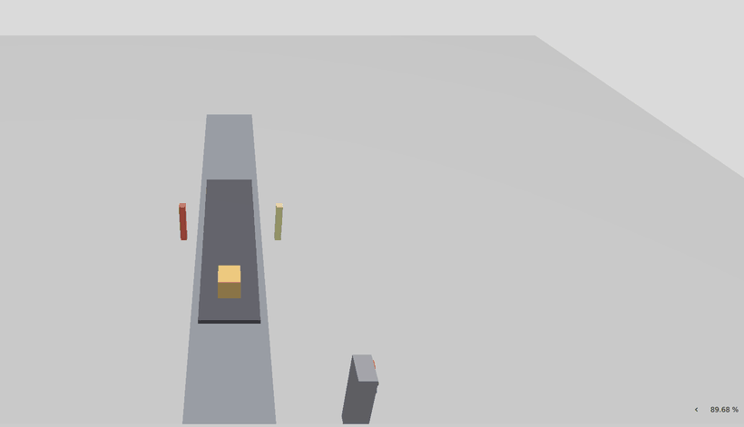

# m3/ — Milestone 3: the fixed-equipment I/O loop

**Closed 2026-07-28, verified *pass-with-findings* in
[`docs/archive/reports/m3-37-gate-verification.md`](../docs/archive/reports/m3-37-gate-verification.md).**

M3 is the first milestone that *moved*. A demonstration cell in Gazebo —
a conveyor, a product box, two sensor posts, an operator panel
([`sim/worlds/cell.sdf`](../sim/worlds/cell.sdf)) — wired both directions
to a standard PLC program running on S7-PLCSIM Advanced, over OPC UA,
through the [bridge](../bridge/): sensor state in, actuator commands out,
latency measured, signal loss behaved.

## The four gate criteria, as measured

| Criterion | Result | Establishing evidence |
|---|---|---|
| (a) Gazebo sensor state visible as PLC input bits in a TIA watch table | **MET** | `plc/demo-cell/evidence/watch-table/Screenshot 2026-07-28 135105.png` — `ProductSensorRange` = 1.440088 with the CPU in RUN; provenance closed by the STOP→RUN pair (value reverts to the DB start value 0.0) |
| (b) PLC output bits drive the Gazebo actuator, verified visually | **MET** | [`assets/plc-drives-cell.gif`](assets/plc-drives-cell.gif) (below); `ConveyorSpeedCommand` is read-only on the server — no client could have moved the belt |
| (c) Latency and update rate measured and written down | **MET** | 14 244 cycles at 20.00 Hz, one overrun; closed loop L7 median **46.163 ms**; [`bridge/EVIDENCE_LATENCY.md`](../bridge/EVIDENCE_LATENCY.md) |
| (d) Signal-loss behaviour defined and tested | **MET** | Four cases in `plc/demo-cell/SPEC.md` §8; heartbeat stale at **500 ms**, `BridgeLinkOk` drops in 0.5–0.6 s, no auto-resume, recovery takes two deliberate actions; [`bridge/EVIDENCE_SIGNAL_LOSS.md`](../bridge/EVIDENCE_SIGNAL_LOSS.md) |

*The belt and the product box move, commanded by the S7-1500 standard
program — the m3-26 live run of 2026-07-27. Honest caption, per the
gate verifier: this recording is build A, the run in which case D still
went 26.3 s undetected; the fixed behaviour (2.301 s, inside its window)
is measured in the evidence documents, not re-recorded.*

## The photos

Seventy watch-table captures — TIA Portal monitoring the cell's tags
against the running Gazebo window — live with the program they verify:
[`plc/demo-cell/evidence/watch-table/`](../plc/demo-cell/evidence/watch-table/).
The gate verifier opened 21 of the 23 dated 2026-07-28 pixel by pixel
and found every content claim holding. Cell bring-up evidence:
[`sim/worlds/CELL_EVIDENCE.md`](../sim/worlds/CELL_EVIDENCE.md).

## How it was run — and how to run it today

There was no scripted runbook in 2026-07 — that discipline arrives with
M5. The procedure M3 ran is `plc/demo-cell/SPEC.md` §11 (T1–T4), executed
by hand against PLCSIM Advanced (`PLC_1`, CPU 1513-1 PN) with the bridge
running in WSL; the as-run record is the two evidence documents above
plus the m3-* report series in [`docs/archive/reports/`](../docs/archive/reports/).
The cell's PLC program spec is [`plc/demo-cell/SPEC.md`](../plc/demo-cell/SPEC.md).

**Today the gate runs again, without PLCSIM.** The virtual PLC
(`m5/m5_ver1/virtual_plc/`) runs the transliterated cell program
(`demo_cell_program.py`, the SPEC §7 sketch to the statement) and serves
the §9 subtree; the bridge's cell group never left the code. See
**[RUNBOOK.md](RUNBOOK.md)** — bring-up in two commands, then a headless
gate exercise (`verify_cell.py`) that drives the panel, watches the PLC
and observes the product, printing PASS/FAIL per line. The 2026-08-21
re-run is recorded in **[EVIDENCE.md](EVIDENCE.md)**: 16/16 on a fresh
CPU, plus a warm-CPU re-run through the SPEC §5 re-home branch, and the
14-test unit suite pinning the program's behaviour.

The gate closed **pass-with-findings**: twelve findings, none unmeeting
a criterion, three carried into M4's queue. §11 T4 was honestly *not*
14/14 — four steps never ran, and the record says so everywhere it
should. That is the reporting standard every later milestone inherited.

## What it became

The cell's loop — one OPC UA server, one bridge, measured latency,
defined signal loss — is the pattern M4 put a forklift on, and the
bridge born here is the process plane the
[first M5 build](../m5/m5_ver1/) scaled into its layered stack.
