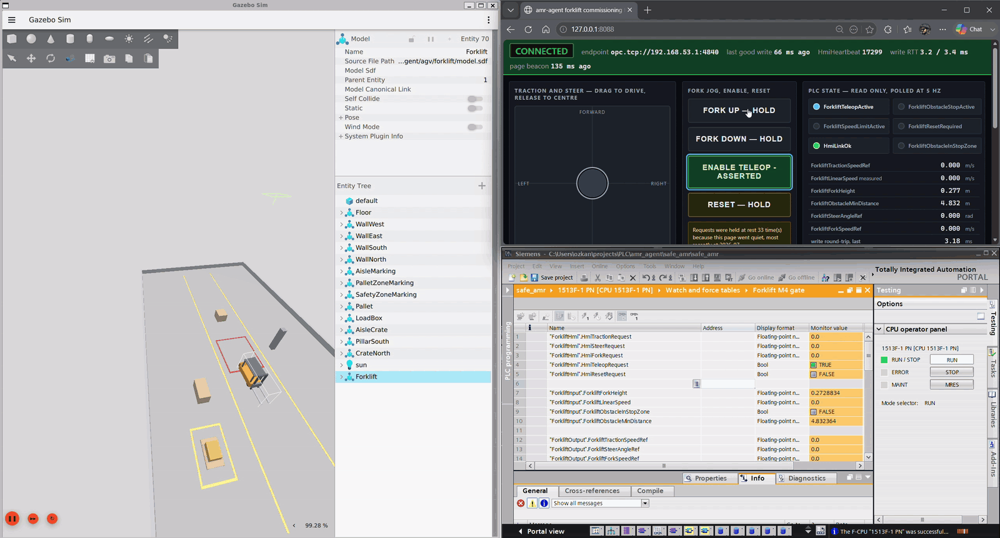

# m4/ — Milestone 4: the forklift commissioning cell

**Closed on the owner's recorded commissioning showcase, 2026-07-30 —
the video below.** The verification trail is the `m4f-*` report series in
[`docs/archive/reports/`](../docs/archive/reports/); the gate criteria are
the M4 row of the archived [roadmap](../docs/archive/roadmap.md) (ADR 0008).

M4 put the vehicle on the loop. The fixed cell gained the project's own
forklift model ([`agv/forklift/`](../agv/)) in its own arena
([`sim/worlds/forklift_arena.sdf`](../sim/worlds/forklift_arena.sdf)), and
an operator drove it from a commissioning HMI — **every command passing
HMI → PLC standard program → bridge → simulation**, every state report
returning the other way. No direct HMI-to-simulator path: the PLC forms
all motion setpoints.

## The showcase

*▶ [`assets/teleop-showcase.mp4`](assets/teleop-showcase.mp4) — the full
48.5 s run; the GIF is its 15 s highlight. One continuous teleoperated
session: driving, then FORK UP held — the carriage rises 0.275 → 0.781 m,
`ForkliftSpeedLimitActive` lights amber as it crosses the 0.50 m slow
threshold, and with the carriage up the watch table reads the operator's
`HmiTractionRequest` **−1.0** clamped by the PLC to
`ForkliftTractionSpeedRef` **−0.3**. That is criterion (c) on screen:
the PLC, not the HMI, caps the speed.*

## The five gate criteria

| Criterion | What it demonstrates |
|---|---|
| (a) | Teleoperated drive with the PLC forming all motion setpoints |
| (b) | The fork raised to a commanded height, stopped by the PLC's soft travel limits |
| (c) | Traction speed capped by the PLC while the fork is above its height threshold — visible in the showcase above |
| (d) | An obstacle in the lidar stop zone latching a PLC **process stop** that overrides teleop, cleared only by the edge-triggered monitored reset after the zone clears |
| (e) | Loss of the HMI heartbeat zeroing all motion setpoints within the watchdog period |

The procedures are `plc/forklift/SPEC.md` §11 (T5.1–T5.6) and the five
scenarios of [`sim/scenarios/forklift_commissioning.md`](../sim/scenarios/forklift_commissioning.md) —
each reaction named **standard-program process logic, not a safety
function**. That naming discipline is M2's boundary, enforced in the
showcase narration.

## What was built here

| Piece | Where | Note |
|---|---|---|
| The forklift model | [`agv/forklift/`](../agv/) | In-house platform (ADR 0010 retired the RB-KAIROS); config, I/O translator, STO contactor — still used in place by both M5 eras |
| The standard program spec | [`plc/forklift/SPEC.md`](../plc/forklift/SPEC.md) | `FB_ForkliftTeleop` — the M4 core (§7) that M5 later amended (§14); transliterated statement-for-statement in [`plc/forklift/double/logic.py`](../plc/forklift/double/logic.py) and again inside the [virtual PLC](../m5/m5_ver1/virtual_plc/) |
| The commissioning HMI | [`hmi/`](../hmi/) | Joystick, fork jog, reset — the ancestor of the M5 operator screen |
| The stack launcher | [`.archive/stack.sh`](../.archive/stack.sh) | m4f-10; the first one-command bring-up, predecessor of `demo.sh` |

## How it runs today

The cell runs headless against the [virtual PLC](../m5/m5_ver1/virtual_plc/)
— the same stand-in that serves M3 and M5 ver1, whose section-7 core **is**
this milestone's `FB_ForkliftTeleop`. [`RUNBOOK.md`](RUNBOOK.md) is the
today-working path: one script brings up the arena, the I/O translator,
the obstacle zone, the bridge and the HMI in WSL; one exercise script
drives all five gate criteria through the HMI's own HTTP API and the
T5.4 obstacle stimulus. [`EVIDENCE.md`](EVIDENCE.md) records the 12/12
PASS run.

The historical path is preserved for the record: the rehearsal driver is
[`sim/scenarios/run_forklift_rehearsal.py`](../sim/scenarios/run_forklift_rehearsal.py),
the stack came up through `.archive/stack.sh`, and the PLC ran on PLCSIM
Advanced.

## What it became

M4's forklift, HMI and standard program are the substrate M5 grew
sensors and the safety chain on. The M4 core logic still runs — inside
the [first M5 build's virtual PLC](../m5/m5_ver1/virtual_plc/standard_program.py),
which reproduces §7 statement for statement.
