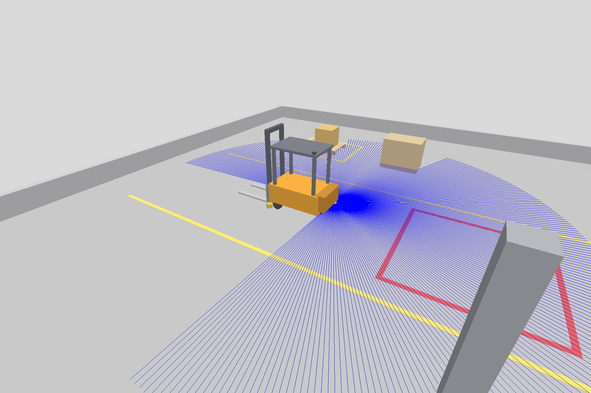
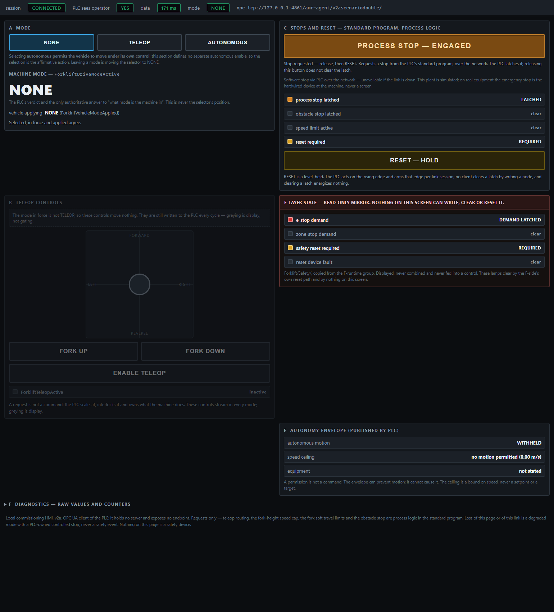
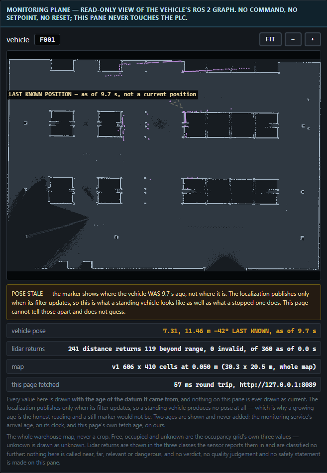

# M5 ver1 — the first build, as designed under Claude supervision

The first working Milestone 5: a teleoperated forklift in a Gazebo warehouse
with a live safety chain — two safety scanners, dual drive-shaft encoders,
field evaluation, a Siemens S7-1516F F-program (simulated in PLCSIM
Advanced) between the operator and the plant, and a local HMI. It ran and
was recorded in August 2026. It was also a dead end as an engineering
artefact: [PLC-PROGRAM.md](PLC-PROGRAM.md) is the post-mortem, and
[`../../m5_ver2/`](../../m5_ver2/) is what replaced it.

**It runs again.** The PLCSIM Advanced trial has expired, so this folder
carries [`virtual_plc/`](virtual_plc/) — a software stand-in for the CPU and
the stand-in writer together. The stack runs *as if the CPU existed*: same
address space, same boot signature, same monitored reset, same demands.
[RUNBOOK.md](RUNBOOK.md) brings it up in two commands; [EVIDENCE.md](EVIDENCE.md)
records the 2026-08-21 headless run (READY in 42 s, a real 0.3 m/s move,
verified-clean teardown). The stand-in is **not a PLC and claims no safety
integrity** — exactly as the PowerShell writer it replaces claimed none.

## The recorded demonstration

*▶ [The first build's demonstration](https://youtu.be/wl1rgWyX66s) — 4 min 9 s,
one continuous run: the scanner drops the speed ceiling at the warning
boundary, latches a stop at the protective one, and the monitored reset is
refused while the cause stands.*

Local copies and the rest of the era's media live in [`assets/`](assets/):

| File | What it shows |
|---|---|
| `assets/demo_m5.mp4` (53 MB, local only) | The full demonstration as recorded |
| `assets/m5-forklift/` | The vehicle and its sensor coverage (beams, layout) |
| `assets/hmi/` | The HMI, screen by screen (below) |

Older media this build inherited have their own milestone homes now:
the commissioning cell and the PLC-drives-the-belt GIF live in
[`../../m3/assets/`](../../m3/), the pre-safety teleop showcase in
[`../../m4/assets/`](../../m4/).

## The HMI

A local page (`hmi/hmi_server.py`, loopback only — the operator stands at
this machine), a client of the PLC like any other, with its own eight writes
(the five deadman requests, the two standing controls, the heartbeat) and
read-only display of everything else. It recomputes nothing.

Top to bottom:

- **The safety lamps** — the six F-CPU mirrors, display only. This is the
  screen's whole reason: what the F-program has latched, the operator sees
  lit. Here with demands active:

  

- **The mode selector** — NONE / TELEOP / AUTONOMOUS. It is a *request*; the
  PLC's answer (`in force`) is the only mode that drives. A selection the
  PLC refuses looks like this — requested TELEOP, in force NONE, because the
  entry conditions (standstill, no latched cause, links alive) were not met:

  

- **The envelope** — the three elements the autonomy layer would read:
  MOTION ENABLE, SPEED CEILING, EQUIPMENT PERMIT. A permission, not a
  command.
- **Forklift state and setpoints** — the plant's report (fork height, linear
  speed, obstacle stop zone, min distance) and the PLC's three actuator
  setpoints with its verdicts (teleop active, obstacle stop, speed limit,
  reset required).
- **The map pane** — the read-only monitoring plane (ADR 0011 D4), a second
  source beside the PLC's numbers. When the monitoring service goes quiet
  the marker fades to a hollow "last known position" rather than lying:

  

- **The controls** — traction / steer / fork sliders (deadman: they rest at
  zero), the TELEOP enable, the RESET button (held, for the monitored
  reset — shown held here), and PROCESS STOP, the operator's standing stop:

  

## The stack, in one paragraph

HMI → PLC → bridge → Gazebo (ADR 0008 D1): every command reaches the plant
through the CPU. The safety chain is onboard and hardwired and appears in no
launch file. In WSL: Gazebo (warehouse world), the vehicle stack
(estimators, `forklift_io`, `obstacle_zone`), the field evaluation and the
speed channels (which feed the CPU over two TCP links), the envelope gate,
the OPC UA bridge, the HMI. On Windows: the CPU — historically PLCSIM
Advanced plus the stand-in writer; today the virtual PLC. One script
orchestrates the WSL half and checks the Windows half: [`demo.sh`](demo.sh).

## Read next

- [RUNBOOK.md](RUNBOOK.md) — run it (virtual path and the historical recorded path)
- [PLC-PROGRAM.md](PLC-PROGRAM.md) — the controller post-mortem and the ver2 motivation
- [EVIDENCE.md](EVIDENCE.md) — the 2026-08-21 headless runs, transcribed
- [virtual_plc/](virtual_plc/) — the software CPU itself
- [`docs/claude-supervised-m5/`](../../docs/claude-supervised-m5/) — the era's original entry point (now points here)
