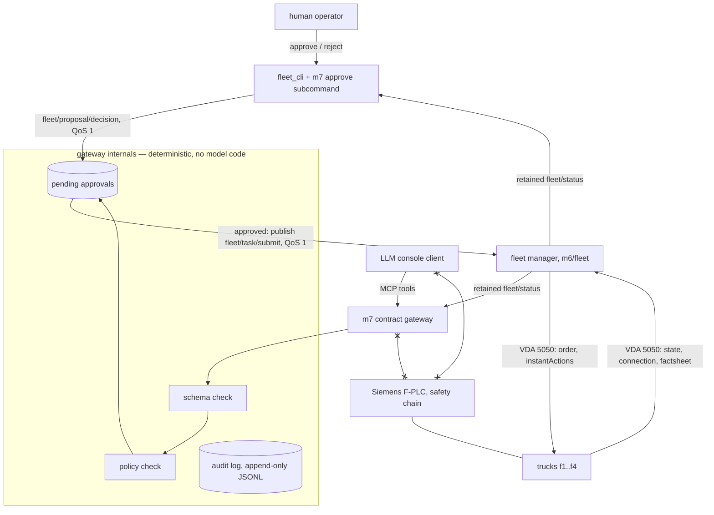
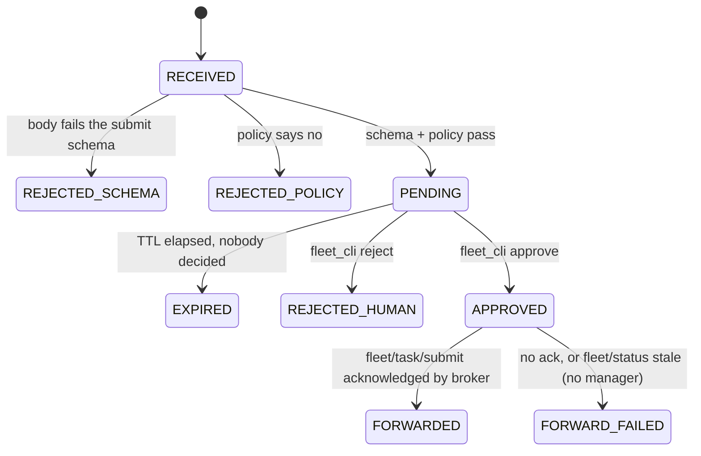

# M7 Architecture — the gated fleet console

Status: **decided 2026-09-06** (owner opened implementation for M7 and M8
the same evening; architecture and plan written first, code follows per
`m7/PLAN.md`). Research base: vault `m7/fable/{landscape,options,
vda-to-mcp-map,standardization}.md` (2026-09-02). Locked rulings honoured
verbatim; each is cited where it binds.

## 0. One sentence

M7 is a second operator that can only do what `fleet_cli` can do, whose
every proposal passes a deterministic gate and a human approval before it
reaches the fleet manager, and which never touches a VDA 5050 topic.

## 1. What M7 is and is not

| M7 is | M7 is not |
|---|---|
| An LLM-facing tool layer (MCP-shaped) on the fleet manager's **northbound** side | A second master. It never publishes on `uagv/…` |
| Console parity with `fleet_cli`: `submit FROM TO`, `status` | A remote control. No vehicle ids, no cmd_vel, no instantActions tools in Phase 1 |
| A deterministic gate: schema → policy → human approval → forward | A safety function. No PL / SIL / PFH figure is claimed anywhere |
| An audit trail: every proposal is a row, forever | A journal for the fleet. The manager stays memory-only (`m6/fleet/README.md`) |

Invariants it inherits unchanged (ADR 0001): 1, 2, 3 (VDA 5050 is the
seam; M7 adds nothing inside it), 6, 9, 11, 12, 13. The three `fleet/`
invariants (no ROS here; only path to a vehicle is VDA 5050; losing the
fleet degrades, never endangers) bind every M7 file.

## 2. Where it sits

The load-bearing facts, each checkable on the wire:

- The gateway speaks **exactly two fleet topics**: it publishes
  `fleet/task/submit` (what `fleet_cli submit` publishes) and reads the
  retained `fleet/status` (what `fleet_cli status` reads). It holds no
  `uagv/#` subscription and no credential that could reach one.
- Approval decisions travel on a new topic `fleet/proposal/decision`
  (QoS 1, not retained), published only by the approve subcommand. The
  gateway mirrors its pending set as a retained `fleet/proposals`
  document, same pattern and staleness rule as `fleet/status`.
- The fleet manager is **untouched**. It cannot tell an approved M7
  submission from an operator's. That is the console-parity ruling made
  mechanical.

## 3. The tool surface (Phase 1, final)

| Tool | Kind | Maps to | Gate |
|---|---|---|---|
| `get_fleet_status()` | read | retained `fleet/status`, rendered as typed JSON plus the document age | none |
| `list_stations()` | read | station table the fleet already uses | none |
| `propose_transport(from, to, reason, idempotency_key)` | propose | one `fleet/task/submit` body via the same builder `fleet_cli` uses | schema → policy → **human approval** |
| `get_proposal(proposal_id)` | read | gateway's own pending / decided set | none |

Not tools, by decision: `cancel` (operator-only, and today the fleet has
no operator cancel either; if one is added it is a `fleet_cli` command,
never a console tool), any vehicle-addressed action, `startPause` /
`stopPause` / `startCharging` (deferred to Phase 3 as GATED tools, not
before the approval path has evidence), anything on the never-set in
vault `vda-to-mcp-map` §2.3.

## 4. The gate, as a state machine

Policy check, Phase 1 contents (all plain data in `m7/gate/policy.yaml`):
station allowlist, `from != to`, max pending proposals per client, max
proposals per minute, duplicate `idempotency_key` returns the existing
proposal rather than a new one, refuse when `fleet/status` is older than
its staleness bound (the manager's own promise: republish at least every
2 s). Nothing in the policy reads a vehicle. Auto-approve does not exist
in Phase 1; whether any class ever auto-approves is an owner ruling for a
later phase with the audit log as evidence.

The gate is deterministic: same input, same verdict, and the verdict
never depends on model output. The model's text is stored as `reason`
in the audit row and is never parsed by the gate.

## 5. Audit row

One JSONL line per state transition:
`(ts, proposal_id, client_id, tool, arguments, schema_version, verdict,
policy_rule?, decided_by?, task_id?, forward_rc?)`. Append-only file
under `m7/audit/`, rotated by date, never rewritten. This is also the
raw material for the conformance suite (vault `standardization` Route D).

## 6. The LLM client

A thin console: Anthropic Messages API with tool use, model id and
endpoint as config values, tools bound to the MCP server above. The
client renders `PENDING` as "waiting for operator approval", never
retries a rejected proposal on its own, and cannot reach the broker
directly. It is replaceable by any MCP client; the gateway does not care.

## 7. What crosses the M7 / M8 seam

Locked: **M8 → M7 is VDA 5050 `state` only** (`loads`, `errors`,
`information`, `actionStates`) as the fleet manager already consumes and
folds into `fleet/status`; **M7 → M8 is `order` and `instantActions`
only**, authored by the fleet manager, never by the gateway. Camera
frames never leave the truck. M7 therefore needs no M8-specific code:
when M8 reports a `dockAbort` error or a slot table, it arrives in the
console as part of `get_fleet_status()` and nothing else.

## 8. Evidence the architecture must produce (gate criteria)

| Gate | Claim | Measured by |
|---|---|---|
| G0 | paper accepted | this document + `m7/PLAN.md` (owner) |
| G1 | the gateway cannot reach a vehicle | test: gateway process holds no `uagv/#` subscription and publishes on exactly one topic; static check in the style of `m6/tools/check_layer_boundaries.py` |
| G2 | every proposal is gated and audited | test: 100 % of transitions have an audit row; a proposal with a bad schema, a bad station, a stale status, and a duplicate key each produce the named verdict |
| G3 | approval is operator-only | test: a decision published by any client id other than the approve subcommand's is ignored and audited as `IGNORED_UNAUTHORISED` |
| G4 | end to end on the stub | `fleet_manager` stub (`m6/tests/test_fleet_manager_stub.py` lineage): console proposes, operator approves, `fleet/status` shows the task; console parity proven by diffing the submit body against `fleet_cli`'s |
| G5 | live plant | four trucks in `warehouse_ver3`: one proposed, approved, delivered transport; one rejected; audit file reviewed |

No gate claims a safety property. G1 and G3 are architecture hygiene
tests, not safety functions, and are labelled so in their docstrings.

## 9. Named leftovers (open from day one)

- VDA 5050 is pinned at 2.1.0 in this project; the research maps 3.0
  concepts (zones, path sharing). Nothing in M7 Phase 1 needs 3.0.
- Approval UI is `fleet_cli` only. An HMI panel is a later decision.
- The gateway has no persistence across restart: pending proposals are
  lost, exactly as unsubmitted tasks are lost when the manager restarts.
  Stated on the console, not hidden.
- Standardisation (SPEC + schemas + conformance) is Route D in the vault
  research and is Phase 4 here; it is not a prerequisite for G5.
