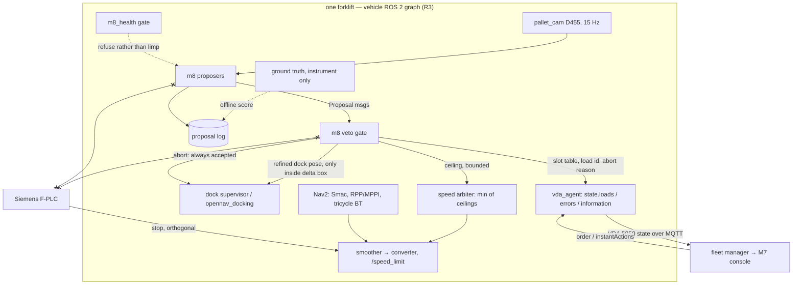
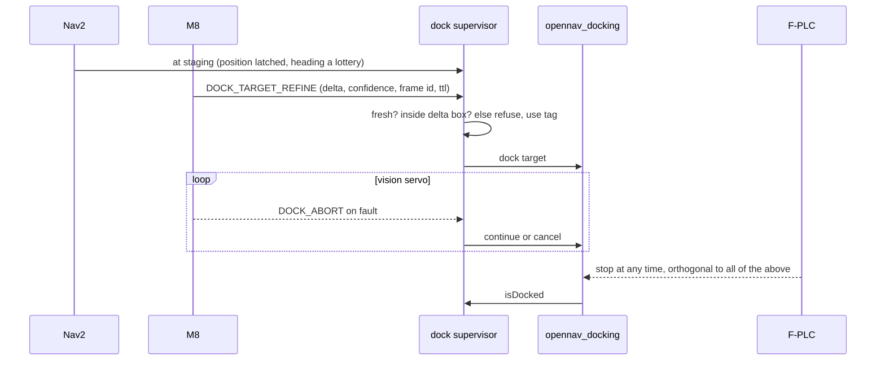

# M8 Architecture — per-vehicle propose → veto intelligence

Status: **decided 2026-09-06**. Owner-accepted rulings (locked, same
date) are numbered R1–R5 below and cited wherever they bind. Plant:
the m5-ver3 showcase forklift (`forklift_ver3` in `warehouse_ver3`,
gz-sim 8.11, ROS 2 Jazzy, Nav2, `opennav_docking` on an AprilTag, Intel
D455 `pallet_cam`). Evidence base: vault `M5v3-Architecture.md`,
`m5v3-09-f5-docking-pallet-film.md`, `m5v3-10-g5-stall-creep.md`.

## 0. One sentence

M8 looks through the pallet camera in the last metres, proposes a
tighter dock target, an abort, a slot table or a lower speed ceiling,
and every one of those can be refused by a deterministic consumer;
the classical stack keeps driving, ground truth keeps scoring, and the
F-PLC never hears from it.

## 1. Locked rulings

| # | Ruling | What it locks here |
|---|---|---|
| R1 | AprilTag backup on tagged pallets first, tagless later | Phase A is shadow mode beside the tag; the tag chain's measured numbers are the bar (rms 0.0706 m over 211 samples at staging; plugin dock 5/5; dock truth 0.2465–0.2553 m) |
| R2 | D455 only; OS0-32 fitted, not bridged | one sensor, one evidence label; RTF cost attributable to M8 alone (precedent: bridging the OS0 cost mean RTF 0.999 → 0.85) |
| R3 | On-vehicle compute; frames never leave the truck | M8 nodes live in the vehicle's ROS graph; only numbers and enums reach the VDA adapter; no image topic is ever bridged to MQTT |
| R4 | F-PLC never receives M8 input, not even information | the veto matrix's PLC column reads "orthogonal" on every row; the nanoScan3 channel stays unbridged and PLC-owned |
| R5 | Speed reduce only: floor > 0, one leg, TTL; never raise; never stop | zero is a stop and stopping is the PLC's; the arbiter takes the minimum of ceilings and M8's is bounded below |

Standing cautions inherited from m5-ver3, repeated here because every
derived artifact must carry them: **ground truth is a score, not a
command**; the instrument floor (rms 0.0291 m, MAX 0.1179 m) bounds any
absolute claim; **no PL / SIL / PFH claims**; the Nav2 collision monitor
is **not a safety function**. ADR 0001 invariant 12: simulation is
Gazebo; MuJoCo is not used, so the M8 evidence plan is Gazebo-only.

## 2. Where it sits



## 3. Capabilities, ranked (final)

MUST, in build order:

| # | Capability | Proposes | Consumer | Bar |
|---|---|---|---|---|
| C1 | Pallet pocket pose in the last two metres | `DOCK_TARGET_REFINE`: pose delta vs. the tag-derived target | dock supervisor, inside a delta box only | match or beat tag rms 0.0706 m at staging; no regression on the tagged dock cycle |
| C2 | Dock-abort classifier: pallet absent, rotated, laterally shifted, pocket blocked, stringer in fork path | `DOCK_ABORT` with reason code | dock supervisor, always accepted | recall on a staged fault set and false-abort rate on clean cycles, both stated; `proceed` is never an M8 output |
| C3 | Shelf-slot state at station approach: empty / occupied / blocked | `SLOT_STATE` table | VDA `information` only | confusion matrix vs world-state occupancy |

LATER: C4 load identity (`loads` entry; fleet reconciles against the
order), C5 aisle anomaly (`SPEED_REDUCE` under R5 plus `information`),
C6 staging-pose nudge inside the derived box, C7 read-only vehicle Q&A
for the M7 console via `information`.

NO, by existing decisions: end-to-end driving or any `cmd_vel`;
localisation (EKF / AMCL stay; no vision-language pose is fused); any
safety field, safety stop, field muting or speed raise (R4, R5);
recovery behaviours (AMR-DEC-004: recovery is not autonomy); fork lift
or tilt during engagement; anything needing ground truth at runtime.

## 4. The proposal contract

Pseudocode shape (one ROS message type, `m8_msgs/Proposal`):

```
Proposal
  kind        DOCK_TARGET_REFINE | DOCK_ABORT | SLOT_STATE | LOAD_ID | ANOMALY | SPEED_REDUCE
  payload     pose delta | reason code | slot table | load entry | class | ceiling m/s
  confidence  0..1
  evidence    frame id, sim stamp, sensor name (always "pallet_cam", R2)
  ttl_ms      expiry; never re-applied after expiry
  leg_id      required for SPEED_REDUCE (R5: one leg)
```

Three standing rules, enforced in the gate, tested in `m8/tests`:

1. **Monotone-safe.** A proposal may only tighten: smaller target delta,
   lower ceiling, abort. Nothing loosens.
2. **Expires.** Stale is refused. Frame age is checked before use.
3. **Logged with its frame.** Every proposal and every verdict is a log
   row, scorable offline against ground truth.

## 5. Veto matrix

| Proposal | Dock supervisor | Nav2 | F-PLC (R4) | Fleet via VDA / M7 |
|---|---|---|---|---|
| DOCK_TARGET_REFINE | accept only inside the delta box around the tag pose (Phase C value fixed from E1; Phase A/B: always refuse, shadow only) | — | orthogonal | `information` |
| DOCK_ABORT | always accepted; cycle ends at staging | replans only on a fleet order | orthogonal | `errors[]`, level WARNING, type `m8.dockAbort` |
| SPEED_REDUCE (R5) | — | converter honours min(Nav2, M8, other ceilings); M8 ≥ floor; one `leg_id`; TTL | orthogonal | `information` |
| SLOT_STATE, LOAD_ID | — | — | — | `information` / `loads`; a mismatch is a fleet-level finding, the vehicle does not act |
| ANOMALY | — | may receive SPEED_REDUCE only | orthogonal | `information`; reroute is the fleet's decision |

Health gate `m8_health`, in the m5-ver3 style (refuse rather than limp):
model loaded and warm, inference latency p95 under budget, frame age
under budget, RTF cost under budget. Any failure → M8 publishes nothing
and the dock runs on the tag alone. The dock sequence with M8 present:



## 6. Model choice, stated honestly

C1 starts **classical**: depth-plane fit of the pallet face plus pocket
segmentation from the D455 depth image, because that gives a scorable
baseline in days and needs no dataset. A learned detector (a small
vision model fine-tuned on gz frames with world-state labels) is the
second candidate for C1 and the first for C2/C3, where a
vision-language classifier is the honest fit: it answers "is this
pocket clear" and "is this slot empty", not "where do I drive". No
vision-language-action policy is used anywhere; VLA is manipulation,
and this truck's manipulation is the two-stage dock, which stays
classical with M8 proposing into it.

## 7. Evidence plan (Gazebo Harmonic only)

| Bench | Question | Scored against | Bar / output |
|---|---|---|---|
| E1 pocket pose | can M8 locate the pocket as well as the tag chain | gz pallet pose, instrument only | match or beat rms 0.0706 m at staging on tagged pallets; tagless number reported honestly, no bar (R1) |
| E2 dock end to end | does M8 refinement keep the dock result | dock truth 0.2465–0.2553 m, plugin 5/5 | no regression; strict 0.25 m class reported, not smoothed |
| E3 abort classifier | does it catch the staged fault set | fault labels from world state | recall and false-abort rate both stated; `proceed` never issued on a fault |
| E4 slot state | is the table right | world-state occupancy of `warehouse_ver3` racks | confusion matrix, lighting and camera-pitch variants |
| E5 cost and latency | what does M8 cost the rig | RTF before/after, frame-age and latency distributions | M8 publishes its own RTF cost; health budgets fixed from this bench |
| E6 adversarial | what breaks it | pitch error (the film's grey-frame bug), texture and lighting swaps | named failure modes, kept as leftovers |

Every bench uses the m5-ver3 machinery: mix refusals (one plant, one
arm, one localiser, one nav fingerprint), md5 gates on map and
registration, GT as instrument only. The sim-to-real domain gap is a
named leftover from day one.

## 8. Named leftovers (open, and staying named)

- On-truck compute budget for the real forklift (R3 makes it a hardware
  constraint later; in sim it is the one rig).
- Tagless pallets: separate ticket after E1 (R1).
- The dock plugin keeps `isDocked` as XY only; heading is not a class
  the plugin keeps; M8 cannot fix that and does not claim to.
- `UndockRobot` aims at the marker on this offset (error 905); the spur
  exit is a straight cmd_vel burst. Not M8's.
- Learned-model dataset provenance and licence: decided when C1's
  learned candidate starts, not before.
