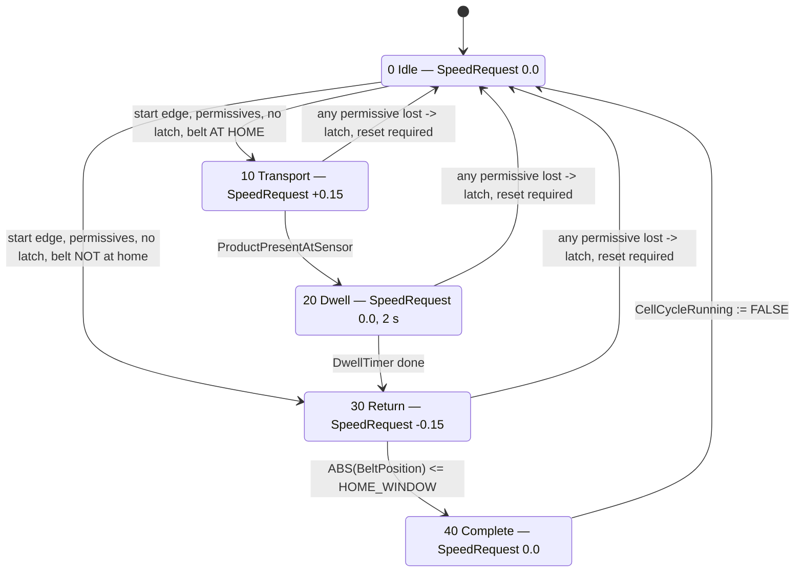

# Demonstration cell — S7-1500 standard program specification (M3)

Gate M3, ADR 0004. This is the **implementation specification for the TIA Portal
program** the owner builds by hand. It is written for an experienced controls
engineer sitting in front of the software and is meant to be buildable without
asking its author a question.

**Status: specification, not verification.** No part of this document has been
executed in TIA Portal or PLCSIM Advanced by its author, who has neither
installed. Every number below is a **design value to be confirmed at
commissioning**, every menu path is version-dependent and named so it can be
recognised rather than clicked blind, and nothing here is evidence for the gate.
The gate closes on the owner's run (§11), recorded in `bridge/EVIDENCE_LATENCY.md`
Section B and alongside the four cases of `bridge/EVIDENCE_SIGNAL_LOSS.md`.

## Authority

| Document | What it fixes | Relation to this one |
|---|---|---|
| `docs/interfaces/opcua-nodes.md` §9 | The 14 nodes: names, types, direction, ownership | **Contract.** If this document disagrees, §9 wins and this one is corrected |
| `docs/interfaces/bridge-design.md` | What the bridge does and what the PLC can therefore observe | Input. §6.3, §7.4 state expectations *on* this document |
| `bridge/EVIDENCE_SIGNAL_LOSS.md` | What the input image and the session actually did in the four failure modes | Measured input to §8 |
| `sim/README.md` § *Demonstration cell (M3)* | The physical cell: geometry, speeds, nominal sensor levels | Input to the constants of §3.3 |
| `CLAUDE.md` §9 | Wire NC / program NO, cycle flag vs actuator, monitored edge reset, no auto-resume | **Binding.** §6 is its application |
| `docs/adr/0004` | The red mushroom is a **process** stop | **Binding.** See §2 |

---

## 1. What the program does

One conveyor, one photo-eye, one three-button panel, all of it simulated in
Gazebo and reaching the CPU as OPC UA nodes written by the bridge. The program:

- forms a **presence verdict** from the raw photo-eye range,
- runs a **transport cycle**: forward until the product reaches the beam, dwell,
  return to home,
- supervises the **bridge heartbeat**, the **drive** and the **sensor**,
- latches every stop, and requires a **monitored, edge-triggered reset** followed
  by a **separate** start command before anything moves again.

All of the logic is here. None of it is in the bridge and none of it is in
Gazebo — that separation is the entire point of the gate (ADR 0004).

---

## 2. Boundary statement — read before anything else

> **Nothing in this program is a safety function.**
>
> `PanelProcessStopCircuitClosed` is a **process stop** input to the **standard**
> program. It is not an emergency stop, carries no SIL or PL claim, implements no
> safety function of `docs/safety/SRS.md`, and must never be labelled,
> demonstrated, recorded or narrated as an emergency stop (ADR 0004).
>
> Every node this program serves is process data. Safety never traverses the
> network (invariant 1); the real cell's e-stop chain (SRS SF-01) is executed by
> an F-CPU over PROFIsafe and hardwired channels. **The demonstration cell has no
> F-CPU and no safety layer at all.**
>
> Loss of the bridge is a **degraded mode, not a safety event** (invariant 2).
>
> The word "emergency" appears in no tag, node, comment, watch table, HMI text or
> recording produced from this specification.

The wire-NC/program-NO convention, the latching and the monitored reset are used
here because they are correct engineering practice for a stop of *any* class —
not because they confer safety integrity. They do not.

---

## 3. Tags

### 3.1 Server-visible tags — exactly the 14 nodes of `opcua-nodes.md` §9

The PLC symbol's leaf name **is** the OPC UA BrowseName, character for character,
so the two documents diff (CLAUDE.md §9). The DB name is a container, not part of
the BrowseName: the server interface (§4.2) places each tag under the folder path
below, so the client sees `DemoCell/Input/ConveyorBeltPosition` regardless of
which DB holds it.

| # | BrowseName path | PLC symbol | S7 type | Written by | Start value |
|---|---|---|---|---|---|
| 1 | `DemoCell/Input/ConveyorBeltPosition` | `"DemoCellInput".ConveyorBeltPosition` | Real | bridge | `0.0` |
| 2 | `DemoCell/Input/ConveyorBeltSpeed` | `"DemoCellInput".ConveyorBeltSpeed` | Real | bridge | `0.0` |
| 3 | `DemoCell/Input/ProductSensorRange` | `"DemoCellInput".ProductSensorRange` | Real | bridge | `0.0` |
| 4 | `DemoCell/Input/PanelStartPressed` | `"DemoCellInput".PanelStartPressed` | Bool | bridge | `FALSE` |
| 5 | `DemoCell/Input/PanelStopCircuitClosed` | `"DemoCellInput".PanelStopCircuitClosed` | Bool | bridge | `FALSE` |
| 6 | `DemoCell/Input/PanelProcessStopCircuitClosed` | `"DemoCellInput".PanelProcessStopCircuitClosed` | Bool | bridge | `FALSE` |
| 7 | `DemoCell/Output/ConveyorSpeedCommand` | `"DemoCellOutput".ConveyorSpeedCommand` | Real | **program** | `0.0` |
| 8 | `DemoCell/Status/CellCycleRunning` | `"DemoCellStatus".CellCycleRunning` | Bool | program | `FALSE` |
| 9 | `DemoCell/Status/CellProcessStopActive` | `"DemoCellStatus".CellProcessStopActive` | Bool | program | `FALSE` |
| 10 | `DemoCell/Status/CellResetRequired` | `"DemoCellStatus".CellResetRequired` | Bool | program | `FALSE` |
| 11 | `DemoCell/Status/ProductPresentAtSensor` | `"DemoCellStatus".ProductPresentAtSensor` | Bool | program | `FALSE` |
| 12 | `DemoCell/Status/ConveyorDriveFault` | `"DemoCellStatus".ConveyorDriveFault` | Bool | program | `FALSE` |
| 13 | `DemoCell/Link/BridgeHeartbeat` | `"DemoCellLink".BridgeHeartbeat` | UInt | bridge | `0` |
| 14 | `DemoCell/Link/BridgeLinkOk` | `"DemoCellLink".BridgeLinkOk` | Bool | program | `FALSE` |

The start values are the fail-safe pre-connection state that `bridge-design.md`
§6.3 places in the PLC precisely because the bridge is forbidden to invent
values. Note that they only apply at a **cold** restart, which is why §6.1
qualifies the inputs with the heartbeat rather than with the start values.

**No other tag is server-visible.** No timer, step number, latch, tolerance or
edge memory is exported (§9.8 of the node model). Exposing them would invite the
bridge to act on them.

### 3.2 Internal tags — statics of `FB_DemoCellControl`, not on the server

These are program content, delegated to this document by §9.5 and §9.7 of the
node model. They are not new interface tags and none is added to the server
interface. All live in the instance DB `"DemoCellControl_DB"`.

| Symbol | Type | Start value | Purpose |
|---|---|---|---|
| `LastBridgeHeartbeat` | UInt | `0` | Value of `BridgeHeartbeat` at the previous OB call. Compared for **inequality** only — never subtracted, never tested for `+1`, never assumed monotonic (§7.1 of the design; the counter wraps and restarts per bridge process) |
| `HeartbeatStaleTimer` | IEC_TIMER (TON) | — | Runs while the heartbeat is unchanged |
| `StartEdgeMemory` | Bool | **`TRUE`** | Previous state of `PanelStartPressed`. Start value `TRUE` so a contact already closed at the first scan produces **no** edge — a stuck or bridged start button can neither reset nor start |
| `ResetHoldTimer` | IEC_TIMER (TON) | — | Measures how long the start contact is held, for the monitored reset window |
| `ResetHoldValid` | Bool | `FALSE` | **Latched** while the current press is held ≥ `RESET_HOLD_MIN`, so it survives to the falling edge on which the reset acts. Re-armed (cleared) on the next rising edge. It must be a latch, not a live comparison: a TON's `ET` returns to 0 in the same call in which `IN` goes false, so a comparison evaluated at the release would always read 0 |
| `ResetDeviceFault` | Bool | `FALSE` | Press held longer than `RESET_HOLD_MAX`, or held at first scan. Blocks reset **and** start until the contact returns to 0 |
| `SeqStep` | Int | `0` | 0 Idle, 10 Transport, 20 Dwell, 30 Return, 40 Complete |
| `DwellTimer`, `StepTimer` | IEC_TIMER (TON) | — | Dwell at the beam; per-step watchdog |
| `PresenceOnTimer`, `PresenceOffTimer` | IEC_TIMER (TON) | — | Filter time on the presence verdict, both directions |
| `RangeInvalidTimer` | IEC_TIMER (TON) | — | Delay before a bad range becomes a fault |
| `DriveFaultTimer` | IEC_TIMER (TON) | — | Delay on the drive-disagreement condition |
| `PositionRef` | Real | `0.0` | Belt position sampled at the start of each drive-fault window |
| `PositionWindowTimer` | IEC_TIMER (TON) | — | Window over which belt travel is checked against `PositionRef` |
| `PosWindowArmed` | Bool | `FALSE` | `PositionRef` has been sampled for the current window. Static, not temp — it spans scans |
| `ProcessStopLatch` | Bool | `FALSE` | Panel stop or process stop has opened |
| `LinkLostLatch` | Bool | `FALSE` | Heartbeat went stale |
| `SensorFaultLatch` | Bool | `FALSE` | Range implausible for longer than the delay |
| `SequenceFaultLatch` | Bool | `FALSE` | Soft travel limit reached, or step watchdog expired |
| `SpeedRequest` | Real | `0.0` | The **requested** setpoint from the sequence. Never written to the output tag directly (§6.4) |

**No tag in this program is declared Retain.** A restart must re-read the world
and decide where it is, not resume from stale sequence state (CLAUDE.md §9). The
latches are level bits, so anything still true after a restart re-raises itself on
the first qualified scan — a process stop that is still pressed re-latches, and a
belt that is still stalled re-faults.

### 3.3 Constants

Declared in the FB's constant block. Every one of them is a **process decision**
that the node model and the bridge design deliberately refused to make
(§9.3, §9.5, §1.1 of the bridge design). Commissioning values, not measurements.

| Constant | Value | Basis |
|---|---|---|
| `PRESENT_THRESHOLD` | `1.00` m | Interface expectation, `opcua-nodes.md` §9.3: midway between 1.440 m clear and 0.540 m blocked, ≈0.45 m margin either side |
| `PRESENT_CLEAR` | `1.10` m | Hysteresis band of 0.10 m so a jittering beam cannot chatter the verdict |
| `PRESENCE_FILTER` | `T#100ms` | Both directions. Two bridge write cycles (50 ms), five OB calls |
| `RANGE_MIN` / `RANGE_MAX` | `0.05` / `3.00` m | The sensor's physical window (`sim/README.md`). Anything outside it, including `NaN` and `inf`, is not a measurement |
| `RANGE_FAULT_DELAY` | `T#200ms` | Tolerates one dropped sample without faulting |
| `TRANSPORT_SPEED` | `+0.15` m/s | Verified belt speed in the cell; ≈9 s from the product's start position to the beam |
| `RETURN_SPEED` | `-0.15` m/s | Return stroke. Negative = towards −x |
| `HOME_WINDOW` | `0.05` m | Belt is home when `ABS(position) ≤ 0.05` |
| `SOFT_LIMIT` | `2.40` m | 0.10 m inside the ±2.50 m mechanical stops, so the program stops the belt before the model does |
| `DWELL_TIME` | `T#2s` | Stand-in for a transfer at the station; makes the stop at the beam visible in the recording |
| `STEP_TIMEOUT` | `T#60s` | Watchdog on any moving step |
| `SPEED_TOLERANCE` | `0.02` m/s | 13 % of the transport speed. Measured belt speed tracks the command closely and reads ~1e-28 at rest (`EVIDENCE_SIGNAL_LOSS.md`), so this is generous |
| `DRIVE_FAULT_DELAY` | `T#1s` | Covers start transients and the direction reversal at step 30 |
| `POSITION_FREEZE_BAND` | `0.005` m | Travel expected in 1 s at the tolerance speed is 0.02 m; 0.005 m is comfortably below it |
| `HEARTBEAT_STALE_TIME` | `T#500ms` | Heartbeat nominal period 50 ms; the in-container run showed a 79 ms worst-case cycle. 500 ms ≈ 10 missed beats: tolerant of jitter, fast enough to be seen live. **Re-check against the PLCSIM run** and raise it only with evidence |
| `RESET_HOLD_MIN` / `RESET_HOLD_MAX` | `T#200ms` / `T#3s` | Monitored reset window (§6.7) |

---

## 4. Blocks, DBs and the server interface

### 4.1 Block structure

```
OB30  Cyclic interrupt, 20 ms          -- the only place demo-cell logic runs
  └── FB_DemoCellControl / "DemoCellControl_DB"
        reads   "DemoCellInput".*  ,  "DemoCellLink".BridgeHeartbeat
        writes  "DemoCellOutput".ConveyorSpeedCommand
                "DemoCellStatus".*  ,  "DemoCellLink".BridgeLinkOk

OB1   Main                              -- contains nothing for this cell
```

| Decision | Why |
|---|---|
| Cyclic interrupt OB, not OB1 | Every timer in the program shares one deterministic time base. OB1's period varies with load, which would make `HEARTBEAT_STALE_TIME` and `DRIVE_FAULT_DELAY` mean different things on different days |
| 20 ms | The bridge writes at 50 ms (20 Hz). Sampling at 20 ms gives at least two OB calls per bridge write, which is the sampling relationship `bridge-design.md` §9.2 assumed ("~2× the intended PLC scan"). Leave the OB's default priority |
| One FB, one instance | One writer for every output and status tag. `ConveyorSpeedCommand` is assigned in exactly one statement in the whole project (§6.4) |
| No hard real-time claim | This is a demonstration cell. Nothing here is a deterministic timing requirement in the sense of invariant 9; the invariant is satisfied by the logic being in the PLC at all, rather than in the Python bridge |

### 4.2 Global DBs and access rights

Four global DBs, one per node-model folder. Optimized block access (the S7-1500
default) is fine: the server interface addresses tags symbolically, so no absolute
address is needed anywhere.

| DB | Contents | *Accessible from HMI/OPC UA* | *Writable from HMI/OPC UA* |
|---|---|---|---|
| `DemoCellInput` | tags 1–6 | ✔ | **✔** |
| `DemoCellOutput` | tag 7 | ✔ | **✘** |
| `DemoCellStatus` | tags 8–12 | ✔ | **✘** |
| `DemoCellLink` | `BridgeHeartbeat` ✔/**✔**, `BridgeLinkOk` ✔/**✘** | ✔ | per tag |
| `DemoCellControl_DB` (instance) | §3.2 internals | **✘** | ✘ |

> The *Writable from HMI/OPC UA* column is where **invariant 6 is enforced by the
> server, not by convention**. With `ConveyorSpeedCommand` not writable, a bridge
> defect that tried to write an actuator output would be rejected by the CPU. The
> bridge already enforces the same allowlist on its side
> (`bridge/tools/check_write_allowlist.py`); two independent enforcements of the
> same rule is the correct amount for the one rule that matters most here.

### 4.3 Server interface

Create **one** server interface (CPU → *OPC UA communication* → *Server
interfaces*). Set its namespace URI to **`urn:amr-agent:cell:plc`** — the bridge
browses for that URI and never hardcodes an index (`opcua-nodes.md` §2), so a
mismatch here presents as "namespace not found" at every connect.

Build the folder tree exactly as below and drag each DB tag into it. Rename
nothing: the leaf name must remain the BrowseName of §3.1.

```
DemoCell/
  Input/   ConveyorBeltPosition  ConveyorBeltSpeed  ProductSensorRange
           PanelStartPressed  PanelStopCircuitClosed  PanelProcessStopCircuitClosed
  Output/  ConveyorSpeedCommand
  Status/  CellCycleRunning  CellProcessStopActive  CellResetRequired
           ProductPresentAtSensor  ConveyorDriveFault
  Link/    BridgeHeartbeat  BridgeLinkOk
```

Nothing else goes into the interface. The M1 nodes of `opcua-nodes.md` §3–§7
(`Cell/`, `Safety/`, `Conveyor/`, `Door/`, `Charger/`) belong to the target cell
served to the *fleet manager* and are **not** part of M3; they share the
namespace URI but no node, and the two sets are never merged.

---

## 5. Sequence



`SeqStep` is a **level** (an Int that survives the scan), not an edge. The step
sets `SpeedRequest` only; whether that request reaches the actuator is decided
separately, in §6.4.

---

## 6. Control logic, in words

Order of execution inside the OB matters and is stated per subsection. The whole
FB is written so that **every output is assigned on every call**, in both branches
of every decision.

### 6.1 First: heartbeat supervision and input qualification

```
IF BridgeHeartbeat <> LastBridgeHeartbeat THEN  reset the stale timer
ELSE                                            run the stale timer
LastBridgeHeartbeat := BridgeHeartbeat          -- after the comparison
BridgeLinkOk := NOT HeartbeatStaleTimer.Q
```

Inequality only. Never `BridgeHeartbeat - LastBridgeHeartbeat`, never a test for
`+1`: the counter is `UInt16`, wraps every ~55 minutes, and restarts from an
arbitrary value when the bridge process restarts. Any *change* is liveness
(§7.1 of the design).

> **The qualification rule, stated once and applied everywhere below.**
> While `BridgeLinkOk` is `FALSE`, the six input values are **not attributable to
> the cell** — they are DB start values, or values left over from a previous
> bridge session (§6.2 of the design). Therefore **no input-derived verdict is
> evaluated and no input-derived fault is latched while the link is stale.**
> Presence, range validity, drive fault, soft limits and the panel contacts are
> all gated by `BridgeLinkOk`.

This falls out correctly at power-up with no special case: `BridgeHeartbeat` and
`LastBridgeHeartbeat` both start at 0, so the stale timer runs from the first
scan and `BridgeLinkOk` is `FALSE` until the bridge has been writing for
`HEARTBEAT_STALE_TIME`. Nothing can start before then.

**Consistency caveat.** The server samples the DBs asynchronously from the
program, and the bridge's write ordering guarantee (heartbeat written last) is an
*ordering* guarantee, not atomicity. Do not write logic that requires two input
tags to have come from the same bridge cycle.

### 6.2 Range validity and the presence verdict

`ProductSensorRange` is a raw analogue in metres. The bridge holds no threshold
and passes `NaN` and `inf` through unchanged, by design (`bridge-design.md`
§4.5). A naive `range < 1.00` returns **FALSE for `NaN`**, i.e. "no product",
which is the wrong direction for a stop condition — so the program tests
plausibility *first* and never relies on the comparison alone:

```
RangeValid := IS_VALID(ProductSensorRange)                     -- see note
              AND ProductSensorRange >= RANGE_MIN
              AND ProductSensorRange <= RANGE_MAX
```

Both range comparisons are false for `NaN` and for `+inf`, so the explicit range
test already rejects them; `IS_VALID` is belt and braces and documents the
intent. *Note: in TIA the instruction is under Basic instructions → Comparator
operations → "OK — Check validity" (SCL `IS_VALID`); confirm the mnemonic in your
TIA version, and if it is unavailable the two range comparisons alone are
sufficient.*

`RangeValid` false continuously for `RANGE_FAULT_DELAY`, **while the link is
OK**, sets `SensorFaultLatch`.

Presence, evaluated only while `BridgeLinkOk AND RangeValid`:

- `ProductSensorRange < PRESENT_THRESHOLD` stable for `PRESENCE_FILTER`
  → `ProductPresentAtSensor := TRUE`
- `ProductSensorRange > PRESENT_CLEAR` stable for `PRESENCE_FILTER`
  → `ProductPresentAtSensor := FALSE`
- between the two thresholds the verdict holds its state (hysteresis)

While `BridgeLinkOk` is `FALSE`, `ProductPresentAtSensor := FALSE`. No decision
depends on it in that state — the cycle is already dropped and latched — and
reporting `FALSE` avoids publishing a product detection that no live sensor
supports.

### 6.3 The cycle-running flag and the permissive set

Machine state and actuator command are separate layers (CLAUDE.md §9).
`CellCycleRunning` says *the cell is enabled*. It says nothing about what the belt
is doing.

Three sets, derived from one. Keeping them distinct is what makes a reset
possible at all.

**`WorldOk`** — the live conditions, all must be TRUE:

| # | Condition | Reads as |
|---|---|---|
| C1 | `PanelStopCircuitClosed` | Stop circuit closed. **Wire NC, program NO**: the tag is used as a plain NO contact, so a pressed button, a broken wire and an absent signal all read `FALSE` and all stop the cell |
| C2 | `PanelProcessStopCircuitClosed` | Process stop circuit closed, same polarity, same reasoning |
| C3 | `BridgeLinkOk` | The input image is attributable to the cell |
| C4 | `RangeValid` | Photo-eye is delivering a plausible value right now |

Then:

| Set | Definition | Used for |
|---|---|---|
| `RunPermissive` | `WorldOk` **and** no latch pending: `NOT ConveyorDriveFault`, `NOT SensorFaultLatch`, `NOT SequenceFaultLatch` | May the cell run, and may the setpoint pass (§6.4) |
| `CauseGone` | `WorldOk` **and** `NOT (D1 OR D2)` — the drive is not disagreeing with its command *at this instant* (§6.6) | May a reset clear the latches (§6.7) |

Why the two differ:

- The **latches are not in `CauseGone`**. The reset tests `CauseGone`, so putting
  the latches there would make each latch its own precondition for clearing.
- The **instantaneous drive terms D1/D2 are not in `RunPermissive`**. D1 is
  momentarily true at every start of motion — the command steps to 0.15 m/s a
  scan before the belt does — so a permissive containing it would drop the cycle
  the instant it started. The *delayed* verdict `ConveyorDriveFault` is what gates
  running; the instantaneous terms only answer "is the drive still misbehaving
  right now", which is the question a reset asks. With the command at `0.0` they
  are false, which is what lets a drive fault be reset and then re-prove itself.

**The ±2.40 m soft limit is a step-level abort, not a blanket permissive.** If
"belt inside the limits" were a run permissive, a belt sitting on the limit could
never move off it — you cannot return without running, and you cannot run while
the limit is violated. Instead the limit aborts the *travelling step* in the
direction that would make it worse (§6.5), and recovery is the re-home branch
below.

Transitions:

- `CellCycleRunning` is set **only** by a start rising edge (§6.7) with
  `RunPermissive` true and no latch pending.
- The step it enters is chosen by **re-reading where the belt actually is**:
  home (`ABS(ConveyorBeltPosition) ≤ HOME_WINDOW`) → step 10 Transport;
  anywhere else → step 30 Return, which brings the belt home first. This is
  CLAUDE.md §9's "on restart the machine re-reads sensor states and decides where
  it is" applied literally, and it is also the recovery path from a soft-limit
  stop.
- `CellCycleRunning` is reset by **any** permissive going false, immediately, in
  the same OB call, and by reaching step 40.
- Losing C1 or C2 also sets `ProcessStopLatch` and therefore
  `CellProcessStopActive`; losing C3 sets `LinkLostLatch`. Every latch sets
  `CellResetRequired := TRUE`.

Never drive an actuator from a sensor: no step condition, no photo-eye value and
no panel contact reaches the output tag except through `CellCycleRunning` and the
permissive set.

### 6.4 The setpoint is **gated**, not switched — the one thing to get right

`ConveyorSpeedCommand` is a **Real setpoint**, not a coil. There is no output bit
to energise and no contact in series with it. The domain rule still applies —
"actuator outputs are formed from the cycle-running flag combined with
interlocks" — but for an analogue value the mechanism is **driving the value to
zero**, not de-energising an output:

```
IF CellCycleRunning AND RunPermissive THEN
    "DemoCellOutput".ConveyorSpeedCommand := SpeedRequest;   // from SeqStep
ELSE
    "DemoCellOutput".ConveyorSpeedCommand := 0.0;            // ACTIVELY zeroed
END_IF;
```

Rules, all of them load-bearing:

1. **The `ELSE` branch is mandatory and unconditional.** A conditional write with
   no `ELSE` leaves a Real tag holding its last value, and the bridge would keep
   republishing that value to the cell: the belt would run on after the stop.
   This is the failure mode this section exists to prevent.
2. **One writer, one statement.** `ConveyorSpeedCommand` is assigned in exactly
   one place in the project, unconditionally executed on every OB call, as the
   last action of the FB. Not inside the step logic, not in two branches of a
   CASE, never from an HMI, never by the bridge (§4.2).
3. **The steps produce `SpeedRequest`, an internal value.** The sequence never
   touches the output tag. `SpeedRequest` is where the process intent lives;
   the assignment above is where the interlocks live.
4. **The zero is written even when the bridge is down.** The PLC always commands
   what it means. Whether the command reaches the cell is the transport's
   problem, and during an outage it does not — see §8, residual.
5. **Do not implement this as a bit.** A "conveyor run" coil, a run/stop bit
   beside the setpoint, or a `MOVE` gated by a contact rung that skips when false,
   are each a wrong implementation. The node model deliberately provides one
   signed velocity and nothing else (§9.8): sign carries direction, magnitude
   carries speed, `0.0` is stop.

This closes open item 6 of `bridge-design.md` §12 (m3-02b open question 1).

### 6.5 The steps

Evaluated before §6.4, after §6.1–§6.3. Each moving step arms `StepTimer`;
expiry sets `SequenceFaultLatch`.

| Step | `SpeedRequest` | Leaves when | Also aborts on |
|---|---|---|---|
| 0 Idle | `0.0` | start rising edge, `RunPermissive`, no latch → **10 if the belt is home, 30 if it is not** (§6.3) | — |
| 10 Transport | `TRANSPORT_SPEED` | `ProductPresentAtSensor` → 20 | `ConveyorBeltPosition ≥ SOFT_LIMIT` → `SequenceFaultLatch` |
| 20 Dwell | `0.0` | `DwellTimer` done → 30 | — |
| 30 Return | `RETURN_SPEED` | `ABS(ConveyorBeltPosition) ≤ HOME_WINDOW` → 40 | `ConveyorBeltPosition ≤ -SOFT_LIMIT` → `SequenceFaultLatch` |
| 40 Complete | `0.0` | always → 0, and `CellCycleRunning := FALSE` | — |

Any loss of `RunPermissive` in steps 10–30 forces `SeqStep := 0` and drops
`CellCycleRunning`. There is no "hold the step and continue where we left off":
the next cycle starts from Idle and re-reads the world (CLAUDE.md §9).

### 6.6 Drive fault — and how case D is caught

Evaluated only while `BridgeLinkOk` is TRUE, so a frozen input image during a
bridge outage cannot raise a spurious drive fault (that case is already latched
by C3).

Two independent terms, either one arms `DriveFaultTimer` (`DRIVE_FAULT_DELAY`):

| Term | Condition | What it catches |
|---|---|---|
| **D1 — commanded but not moving** | `ABS(ConveyorSpeedCommand) > SPEED_TOLERANCE` **and** `ABS(ConveyorBeltSpeed) ≤ SPEED_TOLERANCE` | A stalled or unresponsive drive; the belt sitting on its mechanical stop; **and signal-loss case D**, where the simulation was stopped under a live bridge and the frozen input image reads speed ≈ 0 against a non-zero command |
| **D2 — moving on paper only** | `ABS(ConveyorBeltSpeed) > SPEED_TOLERANCE` **and** belt travel over the window `< POSITION_FREEZE_BAND` | A read-back frozen at a *non-zero* value: speed claims motion while position does not move. Physics and the encoder disagree, so one of them is stale |

D2's window: on the rising edge of the condition, sample `PositionRef :=
ConveyorBeltPosition` and start `PositionWindowTimer`; on expiry compare
`ABS(ConveyorBeltPosition - PositionRef)`. D2 therefore trips after its own
window **plus** `DRIVE_FAULT_DELAY` — about 2 s. That is intentional: D2 accuses
the encoder of lying, and it should be the slower of the two verdicts.

On `DriveFaultTimer.Q`: `ConveyorDriveFault := TRUE` (latched), which drops
`RunPermissive`, which drops `CellCycleRunning`, which drives the setpoint to
`0.0` via §6.4. `CellResetRequired := TRUE`.

**Honest limit, stated here rather than discovered later.** While the program is
commanding `0.0`, a stopped simulation is *not* detectable by this or any other
mechanism in the PLC: a frozen input image under a zero command is
indistinguishable from a genuinely idle cell. The bridge cannot detect it either
without adding a timer that gates a signal, which would be control in the wrong
layer; the three alternatives were considered and rejected in `bridge-design.md`
§7.3. This program adds no detector for the idle case and claims none.

### 6.7 Latches, the monitored reset, and no auto-resume

**The reset device.** The demonstration panel has three contacts — Start, Stop,
process stop — and there is no reset contact in the node model. This program
therefore uses **`PanelStartPressed` as both the reset device and the start
device, distinguished by gesture and by state**, and never conflates the two
actions:

| Gesture | Condition | Effect |
|---|---|---|
| **Reset**: press, hold 0.2–3 s, release | `CellResetRequired` is TRUE **and** `CauseGone` (§6.3) — the live world agrees, the latches need not | On the **falling** edge: clear all latches, `CellResetRequired := FALSE`. **Nothing energizes.** `CellCycleRunning` stays FALSE, the setpoint stays `0.0` |
| **Start**: press | `CellResetRequired` is FALSE at the **rising** edge, `RunPermissive` true, `SeqStep` = 0 | `CellCycleRunning := TRUE`, `SeqStep := 10` if the belt is home, `30` if it is not (§6.3) |

Because the latch is cleared on the *falling* edge of the reset press, the
*rising* edge of that same press saw `CellResetRequired` still TRUE and was
ignored. **A reset and a start are always two separate, deliberate presses.**
Evaluate the reset before the start within the OB so this ordering is explicit.

Monitoring, per CLAUDE.md §9 ("the reset is edge triggered so a stuck button does
not count as a reset"):

- `StartEdgeMemory` starts at `TRUE`, so a contact already closed at the first
  scan produces no edge at all. A bridged or stuck button cannot reset and cannot
  start.
- Held longer than `RESET_HOLD_MAX` (3 s) → `ResetDeviceFault := TRUE`: the press
  is rejected, and both reset and start stay blocked until the contact returns to
  0. Released sooner than `RESET_HOLD_MIN` (0.2 s) → not a valid reset (it is
  still a valid *start* press when no latch is pending).
- A reset attempted while a latch cause is still present is ignored; the latch
  stays and `CellResetRequired` stays TRUE.

**No auto-resume, by construction.** Nothing sets `CellCycleRunning` except a
start rising edge. No returning signal — heartbeat, closing stop circuit, clearing
fault, reconnecting session — sets it. A permissive returning restores the
*permission*, never the *motion*.

---

## 7. SCL sketch

Structure and the load-bearing statements only. Not compilable as written:
declarations, timer instances and the constant block are per §3. Identifiers not
listed in §3.2 (`#hbChanged`, `#linkOk`, `#rangeValid`, `#cmdMoving`,
`#beltMoving`, `#d1`, `#d2`, `#worldOk`, `#runPermissive`, `#causeGone`,
`#latchPending`, `#startRise`, `#startFall`) are **Temp**, computed and consumed
within one call. Everything in
§3.2 is **Static** and must survive the scan.

```pascal
// FB_DemoCellControl — called from OB30 (20 ms), once, nowhere else.

// ---- 1. Bridge liveness (before anything that reads an input) -------------
#hbChanged := ("DemoCellLink".BridgeHeartbeat <> #LastBridgeHeartbeat);
#HeartbeatStaleTimer(IN := NOT #hbChanged, PT := #HEARTBEAT_STALE_TIME);
#LastBridgeHeartbeat := "DemoCellLink".BridgeHeartbeat;   // never subtract
"DemoCellLink".BridgeLinkOk := NOT #HeartbeatStaleTimer.Q;
#linkOk := "DemoCellLink".BridgeLinkOk;

IF NOT #linkOk THEN
    #LinkLostLatch := TRUE;                      // degraded mode, not a safety event
END_IF;

// ---- 2. Sensor validity and presence (qualified by the link) -------------
#rangeValid := #linkOk
    AND IS_VALID("DemoCellInput".ProductSensorRange)          // NaN / inf out
    AND ("DemoCellInput".ProductSensorRange >= #RANGE_MIN)
    AND ("DemoCellInput".ProductSensorRange <= #RANGE_MAX);

#RangeInvalidTimer(IN := #linkOk AND NOT #rangeValid, PT := #RANGE_FAULT_DELAY);
IF #RangeInvalidTimer.Q THEN #SensorFaultLatch := TRUE; END_IF;

IF #rangeValid THEN
    #PresenceOnTimer (IN := "DemoCellInput".ProductSensorRange < #PRESENT_THRESHOLD,
                      PT := #PRESENCE_FILTER);
    #PresenceOffTimer(IN := "DemoCellInput".ProductSensorRange > #PRESENT_CLEAR,
                      PT := #PRESENCE_FILTER);
    IF    #PresenceOnTimer.Q  THEN "DemoCellStatus".ProductPresentAtSensor := TRUE;
    ELSIF #PresenceOffTimer.Q THEN "DemoCellStatus".ProductPresentAtSensor := FALSE;
    END_IF;                                       // between thresholds: hold
ELSE
    "DemoCellStatus".ProductPresentAtSensor := FALSE;   // not attributable
END_IF;

// ---- 3. Drive fault, incl. signal-loss case D ----------------------------
#cmdMoving  := ABS("DemoCellOutput".ConveyorSpeedCommand) > #SPEED_TOLERANCE;
#beltMoving := ABS("DemoCellInput".ConveyorBeltSpeed)     > #SPEED_TOLERANCE;

#PositionWindowTimer(IN := #linkOk AND #beltMoving, PT := #DRIVE_FAULT_DELAY);
IF #linkOk AND #beltMoving AND NOT #PosWindowArmed THEN
    #PositionRef := "DemoCellInput".ConveyorBeltPosition;  #PosWindowArmed := TRUE;
ELSIF NOT #beltMoving THEN
    #PosWindowArmed := FALSE;
END_IF;
#d1 := #cmdMoving  AND NOT #beltMoving;                          // stalled / case D
#d2 := #beltMoving AND #PositionWindowTimer.Q
       AND (ABS("DemoCellInput".ConveyorBeltPosition - #PositionRef) < #POSITION_FREEZE_BAND);

#DriveFaultTimer(IN := #linkOk AND (#d1 OR #d2), PT := #DRIVE_FAULT_DELAY);
IF #DriveFaultTimer.Q THEN "DemoCellStatus".ConveyorDriveFault := TRUE; END_IF;

// ---- 4. Stops (wire NC, program NO: plain NO contacts) -------------------
IF #linkOk AND (NOT "DemoCellInput".PanelStopCircuitClosed
             OR NOT "DemoCellInput".PanelProcessStopCircuitClosed) THEN
    #ProcessStopLatch := TRUE;                    // PROCESS stop. Not a safety function.
END_IF;
"DemoCellStatus".CellProcessStopActive := #ProcessStopLatch;

// ---- 5. World / permissive / cause-gone (kept distinct on purpose) ------
#worldOk :=
       "DemoCellInput".PanelStopCircuitClosed                              // C1
   AND "DemoCellInput".PanelProcessStopCircuitClosed                       // C2
   AND #linkOk                                                             // C3
   AND #rangeValid;                                                        // C4

#runPermissive := #worldOk                           // may the cell RUN
   AND NOT "DemoCellStatus".ConveyorDriveFault       // the DELAYED verdict...
   AND NOT #SensorFaultLatch
   AND NOT #SequenceFaultLatch;
// ...not #d1/#d2: D1 is momentarily true at every start of motion, so an
// instantaneous term here would drop the cycle the scan after it started.

#causeGone := #worldOk AND NOT (#d1 OR #d2);         // may a RESET clear latches
// Latches are absent from #causeGone on purpose: a latch must not be its own
// precondition for clearing. The soft limit is absent from both: a blanket
// limit permissive would strand a belt sitting on the limit, since returning
// requires running. It aborts the travelling step instead (part 7), and the
// re-home branch below recovers it.

#latchPending := #ProcessStopLatch OR #LinkLostLatch OR #SensorFaultLatch
                 OR #SequenceFaultLatch OR "DemoCellStatus".ConveyorDriveFault;
"DemoCellStatus".CellResetRequired := #latchPending;

// ---- 6. Monitored reset, then a SEPARATE start (order matters) ----------
#startRise := "DemoCellInput".PanelStartPressed AND NOT #StartEdgeMemory;
#startFall := NOT "DemoCellInput".PanelStartPressed AND #StartEdgeMemory;
#StartEdgeMemory := "DemoCellInput".PanelStartPressed;   // start value TRUE

#ResetHoldTimer(IN := "DemoCellInput".PanelStartPressed, PT := #RESET_HOLD_MAX);
IF #startRise THEN
    #ResetHoldValid := FALSE;                          // re-arm for this press
END_IF;
IF "DemoCellInput".PanelStartPressed AND (#ResetHoldTimer.ET >= #RESET_HOLD_MIN) THEN
    #ResetHoldValid := TRUE;                           // LATCHED: ET is gone at release
END_IF;
IF #ResetHoldTimer.Q THEN                              // held > 3 s: stuck / bridged
    #ResetDeviceFault := TRUE;  #ResetHoldValid := FALSE;
END_IF;
IF NOT "DemoCellInput".PanelStartPressed THEN
    #ResetDeviceFault := FALSE;                        // clears only on return to 0
END_IF;

IF #startFall AND #ResetHoldValid AND #latchPending AND #causeGone THEN
    #ProcessStopLatch := FALSE;  #LinkLostLatch := FALSE;
    #SensorFaultLatch := FALSE;  #SequenceFaultLatch := FALSE;
    "DemoCellStatus".ConveyorDriveFault := FALSE;
    // Reset clears latches. It energizes NOTHING: no step change, no cycle flag.
END_IF;

IF #startRise AND NOT #latchPending AND NOT #ResetDeviceFault
   AND #runPermissive AND (#SeqStep = 0) THEN
    "DemoCellStatus".CellCycleRunning := TRUE;
    // Re-read where the belt IS; never resume from stale sequence state.
    IF ABS("DemoCellInput".ConveyorBeltPosition) <= #HOME_WINDOW THEN
        #SeqStep := 10;                              // at home: transport
    ELSE
        #SeqStep := 30;                              // elsewhere: re-home first
    END_IF;
END_IF;

IF NOT #runPermissive THEN                       // any interlock, any time
    "DemoCellStatus".CellCycleRunning := FALSE;  #SeqStep := 0;
END_IF;

// ---- 7. Sequence: sets SpeedRequest ONLY --------------------------------
CASE #SeqStep OF
    0:  #SpeedRequest := 0.0;
    10: #SpeedRequest := #TRANSPORT_SPEED;
        IF "DemoCellStatus".ProductPresentAtSensor THEN #SeqStep := 20; END_IF;
        IF "DemoCellInput".ConveyorBeltPosition >= #SOFT_LIMIT THEN
            #SequenceFaultLatch := TRUE; END_IF;
    20: #SpeedRequest := 0.0;
        #DwellTimer(IN := TRUE, PT := #DWELL_TIME);
        IF #DwellTimer.Q THEN #SeqStep := 30; END_IF;
    30: #SpeedRequest := #RETURN_SPEED;
        IF ABS("DemoCellInput".ConveyorBeltPosition) <= #HOME_WINDOW THEN
            #SeqStep := 40; END_IF;
        IF "DemoCellInput".ConveyorBeltPosition <= -#SOFT_LIMIT THEN
            #SequenceFaultLatch := TRUE; END_IF;
    40: #SpeedRequest := 0.0;
        "DemoCellStatus".CellCycleRunning := FALSE;  #SeqStep := 0;
ELSE
    #SeqStep := 0;  #SpeedRequest := 0.0;
END_CASE;
#StepTimer(IN := (#SeqStep = 10) OR (#SeqStep = 30), PT := #STEP_TIMEOUT);
IF #StepTimer.Q THEN #SequenceFaultLatch := TRUE; END_IF;

// ---- 8. THE ONLY assignment to the actuator setpoint --------------------
// Gating an analogue value = driving it to zero. Not a coil. The ELSE is
// mandatory: without it the Real keeps its last value and the belt runs on.
IF "DemoCellStatus".CellCycleRunning AND #runPermissive THEN
    "DemoCellOutput".ConveyorSpeedCommand := #SpeedRequest;
ELSE
    "DemoCellOutput".ConveyorSpeedCommand := 0.0;
END_IF;
```

*Note on the reset condition*: it tests `#causeGone`, never `#runPermissive`.
`#runPermissive` contains the latches, so a reset gated on it could never fire —
the latch would be its own precondition for clearing (§6.3).

---

## 8. Signal-loss reactions — the four cases of `EVIDENCE_SIGNAL_LOSS.md`

The four cases were exercised on 2026-07-27 against the test double. That run
established **what the input image and the session look like**; the double runs no
program, so it established nothing about the reaction. The reaction is this
table.

| Case | What happened | What the PLC detects it with | Reaction | Restart |
|---|---|---|---|---|
| **A** — bridge crash (SIGKILL) | Heartbeat froze at 376; the six inputs froze at their last written values, `ConveyorBeltSpeed` reading a plausible 0.05 m/s **forever** | **`BridgeHeartbeat` unchanged for `HEARTBEAT_STALE_TIME`** (§6.1). Session state is deliberately **not** used: it is not exposed to the standard program as a supervisable input, and the evidence (A.4) shows it is not a faster or more reliable indicator | `BridgeLinkOk := FALSE` → C3 drops and `LinkLostLatch` sets → `CellCycleRunning := FALSE` → setpoint driven to `0.0` (§6.4) → `CellResetRequired := TRUE`. All input-derived evaluation suspended (§6.1) | Monitored reset (§6.7), then a **separate** start press. A returning heartbeat alone does nothing |
| **B** — clean shutdown (SIGTERM) | Identical input image to A; only the session closed more tidily | **The same mechanism, and deliberately no other.** | **Identical to A — no additional action, by design.** The program must not distinguish A from B: it has no mechanism that could, and `bridge-design.md` §7.3 states that a program which behaves differently for A and B is wrong. The bridge writes no farewell value and zeroes nothing, so the two are identical where it matters | As A |
| **C** — OPC UA link loss, bridge alive (server stopped / network) | Heartbeat stopped; inputs froze, then were **lost entirely** to DB start values when the server restarted; bridge reconnected and refreshed all six inputs within ~200 ms | Same mechanism. Two sub-cases: **(i) network or session loss with the CPU running** — indistinguishable from A at the PLC, same reaction. **(ii) the CPU itself stopped (PLCSIM stopped)** — **no program action is possible or required, because no program is running.** On restart, cold start applies the non-permissive start values of §3.1 and warm start leaves the previous session's values, which is exactly why §6.1 qualifies inputs with the heartbeat and not with the start values | As A. Additionally, the non-permissive start values (`PanelStopCircuitClosed := FALSE`, `ProductSensorRange := 0.0`, which is also outside `[RANGE_MIN, RANGE_MAX]`) mean a freshly cold-started CPU cannot run before the bridge is supplying real samples | As A |
| **D** — simulation stopped, bridge alive | **Heartbeat kept advancing** (326 → 628 → 929, exactly 20 Hz). The input image froze bit-identically for 30 s under a `ConveyorSpeedCommand` of 0.05. Session healthy. From the PLC's side the link looks perfect | **`ConveyorDriveFault`, term D1** (§6.6): a non-zero command with `ABS(ConveyorBeltSpeed) ≤ SPEED_TOLERANCE` for `DRIVE_FAULT_DELAY`. The captured values (cmd 0.05, speed 3.2e-28, constant) satisfy it after 1 s. Term D2 additionally covers a read-back frozen at a non-zero value | `ConveyorDriveFault := TRUE` (latched) → `RunPermissive` drops → `CellCycleRunning := FALSE` → setpoint `0.0` → `CellResetRequired := TRUE` | Monitored reset, then a separate start press. The fault will re-latch within `DRIVE_FAULT_DELAY` of the next attempt if the simulation is still stopped |
| **D, idle sub-case** | Simulation stopped while the program is commanding `0.0` | **Nothing.** No detector exists and none is added | **No action, and the reason is stated rather than papered over**: a frozen input image under a zero command is indistinguishable from a genuinely idle cell. The three bridge-side fixes were considered and rejected in `bridge-design.md` §7.3 (each puts a timer that gates a signal into the transport layer). The cell is stopped either way, so the undetected state is also the harmless one | Not applicable |

### Residual, stated honestly

While the bridge is down, **the PLC's `0.0` cannot reach the cell**. gz's
`JointController` holds the last velocity it was given, so the belt keeps running
at its last commanded speed until the bridge returns — measured in case A.3
(0.39 m → 1.16 m unsupervised) and case C.3 (belt ran to its +2.50 m mechanical
stop over a 21 s outage). The program's zero is delivered on the first read after
reconnect, within one bridge cycle (~50 ms nominal), which is what makes recovery
a PLC decision rather than a bridge decision (`bridge-design.md` §8.4, N4).

This is a property of the demonstration cell, not of the program. On real
equipment the drive is dropped by a wired enable and contactor, not by an OPC UA
value. **No safety function is involved and none is claimed** (invariant 1).

---

## 9. Watch table — `DemoCell M3 gate`

One watch table, four groups. Groups 1 and 2 are the gate's exit items (a) and
(b); groups 3 and 4 make the program's reasoning visible while they are
demonstrated. Symbolic addressing only — the DBs are optimized and have no
absolute addresses.

**Monitor only. Do not use *Modify* or *Force* on any `DemoCellInput` tag during
a gate run**: a forced input proves nothing about the loop, and it would fight
the bridge's 20 Hz cyclic write.

### Group 1 — Gazebo sensor state as PLC inputs *(exit item a)*

| Tag | Format | Expected |
|---|---|---|
| `"DemoCellInput".PanelStartPressed` | Bool | `FALSE` idle; `TRUE` while `/cell/panel/start` publishes `true` (NO contact) |
| `"DemoCellInput".PanelStopCircuitClosed` | Bool | `TRUE` when not actuated; `FALSE` when pressed **or on a broken/absent signal** |
| `"DemoCellInput".PanelProcessStopCircuitClosed` | Bool | `TRUE` when not actuated; `FALSE` when pressed. **Process stop** |
| `"DemoCellInput".ProductSensorRange` | Floating-point | ≈ `1.440` beam clear, ≈ `0.540` product in the beam |
| `"DemoCellInput".ConveyorBeltPosition` | Floating-point | `0.0` at home, rising while transporting, within ±2.50 |
| `"DemoCellInput".ConveyorBeltSpeed` | Floating-point | ≈ `0.0` at rest, ≈ `+0.15` transporting, ≈ `-0.15` returning |

### Group 2 — PLC output driving the Gazebo actuator *(exit item b)*

| Tag | Format | Expected |
|---|---|---|
| `"DemoCellOutput".ConveyorSpeedCommand` | Floating-point | `0.0` idle/stopped, `+0.15` step 10, `0.0` step 20, `-0.15` step 30. **Snaps to `0.0` in the same OB call as any interlock loss** |

### Group 3 — PLC verdicts, server-visible

| Tag | Format | Expected |
|---|---|---|
| `"DemoCellStatus".CellCycleRunning` | Bool | `TRUE` only between start and step 40 |
| `"DemoCellStatus".ProductPresentAtSensor` | Bool | `TRUE` when the range group shows ≈0.540 for ≥100 ms |
| `"DemoCellStatus".CellProcessStopActive` | Bool | Latched `TRUE` after either stop contact opens |
| `"DemoCellStatus".ConveyorDriveFault` | Bool | Latched `TRUE` in signal-loss case D |
| `"DemoCellStatus".CellResetRequired` | Bool | `TRUE` while any latch is pending |
| `"DemoCellLink".BridgeHeartbeat` | Decimal | Advancing ~20/s; frozen in cases A, B, C; **advancing in case D** |
| `"DemoCellLink".BridgeLinkOk` | Bool | `TRUE` while the heartbeat changes; `FALSE` 500 ms after it stops |

### Group 4 — internal, not on the server

`"DemoCellControl_DB".SeqStep`, `.SpeedRequest`, `.LastBridgeHeartbeat`,
`.ProcessStopLatch`, `.LinkLostLatch`, `.SensorFaultLatch`,
`.SequenceFaultLatch`, `.ResetDeviceFault`, `.StartEdgeMemory`,
`.HeartbeatStaleTimer.ET`, `.DriveFaultTimer.ET`.

`SpeedRequest` beside `ConveyorSpeedCommand` is the clearest single view of §6.4:
during an interlock loss the request may still read `+0.15` while the command
reads `0.0`.

---

## 10. PLCSIM Advanced and the OPC UA server — what to click and what bites

**Version-dependent.** Menu wording and dialog placement moved between TIA V16
and V20. The items below name what to look for and why it matters; they are not a
click path verified on your installation, and the author cannot run TIA Portal.

| # | Step | Watch out for |
|---|---|---|
| 1 | **CPU and firmware.** Add an S7-1500 CPU whose firmware supports the OPC UA server — **V2.0 minimum, V2.5+ recommended** for server-interface features. Match the firmware to what your PLCSIM Advanced version can simulate | An older firmware silently has no OPC UA page in the properties at all. If you cannot find the setting in step 3, this is why |
| 2 | **PLCSIM Advanced instance, network mode.** In the PLCSIM Advanced control panel choose **"TCP/IP communication with <adapter>"** (the PLCSIM Virtual Ethernet Adapter), give the instance a name and an IP in that adapter's subnet, then *Start* | **The single biggest trap.** In **"Local Communication (Softbus)"** the instance has no routable IP and exposes no TCP port: TIA can download to it, but **no OPC UA client can ever reach it**. Symptom: download works, the bridge cannot connect |
| 3 | **Activate the server.** CPU properties → **OPC UA → Server → "Activate OPC UA server"** | Off by default. The port is 4840 and the endpoint shown is `opc.tcp://<CPU IP>:4840`; that string goes into `bridge/config/bridge.yaml` → `opcua.endpoint` |
| 4 | **Runtime licence.** CPU properties → **Runtime licences → OPC UA** → select the licence type matching the CPU (Siemens sells it as SIMATIC OPC UA S7-1500 *small* / *medium* / *large*, banded by CPU size) | Compilation is not clean until a type is selected, even in simulation. Whether PLCSIM Advanced *enforces* the licence at runtime is version-dependent — set it either way, and check the figure against your CPU's manual rather than against this table |
| 5 | **Security.** For the demonstration, allow **"No security (none)"** as a server endpoint and permit **anonymous / guest** user access. Otherwise generate or import the bridge's client certificate and enable "automatically accept client certificates during runtime" | Must match `bridge.yaml` → `opcua.security_policy` (default `"none"`), and `certificate_path` / `private_key_path` / `username`, which are **absolute paths to files outside this repository** (invariant 13). Default S7-1500 settings are stricter than the default bridge settings, so one side must move — change the config, never the bridge code |
| 6 | **Server interface.** CPU → *OPC UA communication* → *Server interfaces* → add one; set its **namespace URI to `urn:amr-agent:cell:plc`**; build the `DemoCell/Input|Output|Status|Link` tree of §4.3 and drag in the DB tags | If the URI is left at the CPU default, the bridge's browse-by-URI fails at every connect and never falls back to an index — by design (`opcua-nodes.md` §2). Do not rename any leaf: the BrowseName is the diff key against `opcua-nodes.md` |
| 7 | **Per-tag access.** In each DB's declaration table set *Accessible from HMI/OPC UA* and *Writable from HMI/OPC UA* per §4.2 | Leaving `ConveyorSpeedCommand` writable would let a client write an actuator output — the one thing invariant 6 forbids. Leaving the six inputs **not** writable makes every bridge write fail with `BadNotWritable`, and the heartbeat never starts (startup rule R3) |
| 8 | **Compile, download, RUN.** Download to the running PLCSIM instance and put the CPU in RUN | The server starts with the CPU. In STOP there is no server, so the bridge sees a connection refusal, not a bad session |
| 9 | **Verify the address space independently** — UaExpert (or `opcua-client`) against the endpoint: browse the namespace, confirm **14 nodes**, the four folders and the data types | Do this before involving the bridge, so a naming or access mistake is not diagnosed as a bridge defect. The bridge logs `session established, N nodes resolved`; N must be 14 |
| 10 | **Firewall and host networking.** Allow inbound TCP **4840** on the PLCSIM virtual adapter profile | If the bridge runs under WSL and PLCSIM on Windows, the endpoint must be an address reachable *from WSL*; mirrored networking or a port proxy may be needed. That work is m3-07/m3-08's, not this document's — but it is the second most common reason "the bridge cannot connect" |

Finally: **the test double must not be running during any PLCSIM run**, and never
on the same endpoint (`bridge-design.md` §10). Every recorded number must state
which server produced it.

---

## 11. Owner-executable test procedure — the four closure items

Preconditions for all four: the cell running
(`ros2 launch sim/launch/cell_bringup.launch.py`), the program of this document
in RUN on PLCSIM Advanced, `bridge/config/bridge.yaml` pointed at the PLCSIM
endpoint **by configuration only — no code change**, the bridge running, the test
double **not** running, and the watch table of §9 open in *Monitor* mode.

Panel contacts are driven exactly as `sim/README.md` shows, e.g.
`ros2 topic pub -1 /cell/panel/start std_msgs/msg/Bool "{data: true}"`.

### T1 — Gazebo sensor state visible as PLC input bits *(exit item a)*

| Step | Action | Pass |
|---|---|---|
| 1.1 | Publish `start` `true`, then `false` | Group 1 `PanelStartPressed` follows `TRUE` → `FALSE` |
| 1.2 | Publish `stop` `false`, then `true` | `PanelStopCircuitClosed` follows `FALSE` → `TRUE`. **Confirm the polarity reads the way a broken wire would**: the tag is false when the button is pressed |
| 1.3 | Publish `process_stop` `false`, then `true` | `PanelProcessStopCircuitClosed` follows. Record it as a **process stop** |
| 1.4 | With the belt clear, read `ProductSensorRange`; then run the cycle until the product blocks the beam | ≈1.440 → ≈0.540, and `ProductPresentAtSensor` follows ~100 ms later |
| 1.5 | Screenshot the watch table with the belt moving | `ConveyorBeltPosition` and `ConveyorBeltSpeed` change live |

**Pass: all five.** Evidence: watch-table screenshots plus a note of the
corresponding `ros2 topic echo` output.

### T2 — PLC output driving the Gazebo actuator *(exit item b)*

| Step | Action | Pass |
|---|---|---|
| 2.1 | Ensure `CellResetRequired` is `FALSE` (reset first if not) and the belt is at home, then press start | `ConveyorSpeedCommand` goes `0.0` → `+0.15`; **the belt moves in Gazebo** and the product is carried, visible in the GUI or via `ros2 topic echo /cell/product_box/pose`. If the belt was **not** at home, the program re-homes first at `-0.15` — that is §6.3's re-read branch, and it is worth recording once |
| 2.2 | Let the product reach the beam | `ProductPresentAtSensor` → `TRUE`, `SeqStep` 10 → 20, command → `0.0`, belt stops |
| 2.3 | Wait out the dwell | `SeqStep` → 30, command → `-0.15`, belt reverses |
| 2.4 | Let it return home | `SeqStep` → 40 → 0, command → `0.0`, `CellCycleRunning` → `FALSE` |
| 2.5 | Start again, and mid-transport publish `process_stop` `false` | Command snaps to `0.0` **in the same watch-table update**, belt stops, `CellProcessStopActive` and `CellResetRequired` → `TRUE`, `SpeedRequest` may still read `+0.15` — that is §6.4 working |
| 2.6 | Publish `process_stop` `true` again and wait 30 s **without touching start** | **Nothing moves.** No auto-resume |
| 2.7 | Press and hold start 1 s, release | Latches clear, `CellResetRequired` → `FALSE`, **and nothing moves** |
| 2.8 | Press start again (short press) | The cycle starts. Two deliberate presses, never one |

**Pass: all eight.** Evidence: screen recording of Gazebo beside the watch table.

### T3 — Latency and update rate measured and written down *(exit item c)*

Run the bridge against PLCSIM for the duration `bridge-design.md` §9.3 requires
(at least one full product traverse and one process-stop press), then
`bridge/tools/summarize_latency.py evidence/latency-<date>-plcsim.csv`.

Record in **`bridge/EVIDENCE_LATENCY.md` Section B**, which already lists the
eight required items. This specification adds two PLC-side obligations to that
list:

- **L7, the closed loop**, is now measurable because a real program responds:
  the bridge writes a nominated `DemoCell/Input/` value → one PLC scan → the
  resulting `ConveyorSpeedCommand` read back. The natural nominated input here is
  `PanelProcessStopCircuitClosed` going false while the belt runs: the response
  is `ConveyorSpeedCommand` → `0.0`, which is a real program reaction rather than
  an echo.
- **The OB30 cycle time and the CPU's maximum cycle time**, read from the CPU's
  diagnostics, reported alongside — L7 contains one of them.

**Pass:** the statistics table is filled in with count / min / median / p95 / max
(never a bare mean), the achieved cycle rate is stated, and the environment
(TIA version, PLCSIM version, CPU, firmware, network path, and confirmation that
Tailscale is **not** in that path — invariant 8) is recorded.

### T4 — Signal-loss behaviour defined and tested *(exit item d)*

Repeat the four cases of `bridge/EVIDENCE_SIGNAL_LOSS.md` against PLCSIM. The
definition is §8 of this document; this is its test.

| Step | Action | Pass |
|---|---|---|
| 4.1 **(A)** | With the cycle running, `kill -9` the bridge | `BridgeHeartbeat` freezes; `BridgeLinkOk` → `FALSE` within ~500 ms; `CellCycleRunning` → `FALSE`; `ConveyorSpeedCommand` → `0.0`; `CellResetRequired` → `TRUE`. Note in the evidence that **the belt keeps running in Gazebo** until the bridge returns (§8 residual) |
| 4.2 | Restart the bridge, wait for the heartbeat to advance, and **do nothing else for 30 s** | `BridgeLinkOk` → `TRUE`, and **the cycle does not restart**. The first command delivered is `0.0` and the belt stops |
| 4.3 | Monitored reset, then a separate start press | Latches clear on the release; the cycle runs only after the second press |
| 4.4 **(B)** | Repeat 4.1 with `SIGTERM` | **Identical PLC behaviour to 4.1.** Any difference is a defect |
| 4.5 **(C)** | With the cycle running, break the link (stop PLCSIM's adapter, or the CPU to STOP and back) | Same reaction where a program is running; where the CPU stopped, confirm that on restart the non-permissive start values apply and nothing runs until the bridge supplies real samples and a reset+start is given |
| 4.6 **(D)** | With the belt transporting, `kill -9` the Gazebo server, leaving the bridge alive | `BridgeHeartbeat` **keeps advancing**, `BridgeLinkOk` stays `TRUE`, the input image freezes, and within `DRIVE_FAULT_DELAY` `ConveyorDriveFault` latches, `CellCycleRunning` → `FALSE`, command → `0.0` |
| 4.7 | Attempt a reset and start with the simulation still stopped | The fault re-latches within 1 s. No auto-resume, and no way to run a dead cell |
| 4.8 | **Startup rule against the real DB start values**: cold-start the CPU with the bridge stopped | The six inputs read the start values of §3.1, `BridgeLinkOk` is `FALSE`, and start presses do nothing. Then start the bridge and confirm the heartbeat only begins after all six inputs carry real samples |
| 4.9 | **Stuck reset device**: publish `start` `true` and leave it | No start, no reset. After 3 s `ResetDeviceFault` sets, and it clears only when the contact returns to `false` |
| 4.10 | **Session behaviour on a real server**: time how long the S7-1500 holds the session after a bridge `SIGKILL` | Recorded as a number. This is the one in-container result known not to transfer (`EVIDENCE_SIGNAL_LOSS.md` A.4) — and it must **not** be used as an input to the program |

**Pass: all ten.** Evidence appended to `bridge/EVIDENCE_SIGNAL_LOSS.md` as a
PLCSIM section beside the container run, per `EVIDENCE_LATENCY.md` Section B
item 6.

---

## 12. What this document does not specify, and why

| Item | Owner |
|---|---|
| Anything safety-related: F-CPU, F-I/O, PROFIsafe, e-stop chain, SF-01…SF-08 | `docs/safety/SRS.md`, gate M9. The demonstration cell has none of it (§2) |
| The M1 target-cell logic — conveyor transfer handshake, door, charger | Gate M8. `opcua-nodes.md` §3–§7 and `handshake-tables.md`; no node of theirs is touched here |
| The bridge's behaviour | `docs/interfaces/bridge-design.md`, implemented in `bridge/` |
| Cell geometry, speeds and topic names | `sim/README.md` |
| HMI | None exists in M3, and no tag here assumes one |

### Open items carried out of this specification

| # | Item | Status |
|---|---|---|
| 1 | **There is no reset contact in the cell.** `PanelStartPressed` doubles as the reset device (§6.7), distinguished from start by gesture and by state. It works and is honest, but a dedicated reset device is better practice and would be one topic in `sim/` and one node in `opcua-nodes.md` §9.3 | Requested in `docs/reports/m3-05-plc-program-spec.md`, **not** invented here. The program as specified requires no such node |
| 2 | `IS_VALID` mnemonic and its availability in the owner's TIA version | Confirm at implementation (§6.2). The two range comparisons alone are sufficient if it is absent |
| 3 | `HEARTBEAT_STALE_TIME` = 500 ms is derived from the in-container 20 Hz run | Re-check against the PLCSIM run (T3) and raise only with evidence |
| 4 | The OB30 period of 20 ms assumes the bridge's 50 ms cadence | If m3-04's 20 Hz expectation is revised with evidence (`bridge-design.md` §12.7), revise this together with it |
| 5 | Whether PLCSIM Advanced enforces the OPC UA runtime licence | Owner observes at step 4 of §10 and records it |
