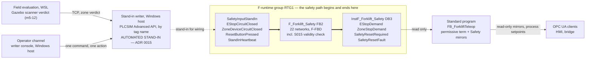

# Forklift twin — F-CPU safety program specification (M5 opening wave, cell-scope core)

ADR 0009, cell-scope core only. This is the **implementation specification for the
safety program** the owner builds by hand in TIA Safety, in the F-runtime group
that already exists in the `safe_amr` project, on the 1513F-1 PN CPU running under
PLCSIM Advanced.

It is written for an experienced controls engineer sitting in front of the
software, and it describes **deltas to a build that is already running** — not a
fresh project. Everything in `F_Forklift_Safety [FB2]`, `Main_Safety_RTG1 [FB1]`
and `InstF_Forklift_Safety [DB3]` stays where it is; §3.0 lists the seven changes
and §4.2 walks them in order.

**Status: specification, not verification.** No part of this document has been
executed in TIA Portal or PLCSIM Advanced by its author, who has neither
installed. Every menu path is version-dependent and named so it can be recognised
rather than clicked blind; every tool-derived value is a **design value until the
owner reads it back out of the tool** (ADR 0006). Nothing here is evidence for any
gate.

> **Revision 2026-08-05, against ADR 0015.** The m5-03 probe settled the input
> path in the tool: configured F-I/O never leaves passivation on this
> installation, and watch-table *Modify* of fail-safe-adjacent data is refused
> outright in permanent safety mode (`2206:000002`). The stimulus is now the
> **automated stand-in writer** of §7 — the S7-PLCSIM Advanced API writing
> `SafetyInputStandIn` by tag name, with no hand at a watch table anywhere in
> the chain — and the S015 validity check is carried **visibly in the F-code**
> as the §5.4 delta. Sections rewritten in this revision: §2 (F3, new F7,
> §2.1 closure note), §3.1–§3.3 (the heartbeat member and the validity
> statics), §4.3 (the recorded window deviation), §4.5 (new: the delta
> click-path), §5.0/§5.3/§5.4 (the validity networks), §6.3, §7 (whole), §8,
> §9 (all stimuli automated), §10. The fourteen networks of §5.1, the coupling
> contract of §6 and every demand/reset behaviour are **unchanged**.

> **Revision 2026-08-06 (m5-49).** A second F-delta — the speed monitor
> (SF-10 pattern) and the SS1 stop sequencer (SF-11 logic) — is specified in
> **§11**, as a delta to the as-built 2026-08-05 program. It adds seven
> stand-in members (SD2, §11.3), six FB2 inputs and two outputs, twenty-seven
> networks (§11.5), two pins on existing networks (`CauseGone` and
> `SafetyResetRequired`, §11.5 re-point table), watch Group 5 (§11.8) and the
> Q click-path (§11.9). §1–§10 are otherwise unchanged; where a §1–§10
> statement of counts or read sets is affected, a note at that statement
> points here.

## Authority

| Document | What it fixes | Relation to this one |
|---|---|---|
| `docs/safety/SRS.md` §3 SF-01, SF-07, SF-08 and their acceptance tests | The functions, their triggers, reactions, safe states, reset behaviour and AT sub-cases | **Contract.** If this document disagrees, the SRS wins and this one is corrected |
| `docs/safety/TWIN-DEMO-MAP.md` | Which SRS text the twin instantiates, which AT sub-cases are in scope and which are deferred, the non-claims, the wording, and rules R1–R6 on this document | **Binding.** §5.1's stand-in sentence, §5.2's stand-in rule and §6 R1 govern §5, §6 and §7 below |
| `docs/adr/0009-early-cell-scope-safety-on-the-forklift-twin.md` | Scope (D1), gate bounds (D2), the coupling architecture (D3), the fallback (D4), the ISO 13849 basis and wording discipline (D5) | **Binding** |
| `docs/safety/PL-SCENARIOS.md` | The risk-graph derivations behind every PLr quoted anywhere | **Contract.** No parameter is derived, re-derived or re-argued here |
| `docs/roadmap.md` row M5 | The gate criterion this work does **not** close | **Binding.** See §1.2 |
| `plc/forklift/SPEC.md` | The standard program this couples to: `FB_ForkliftTeleop`, its permissive sets, its process obstacle latch and its process reset | **Input, and unchanged by this document.** The standard-side delta is a separate brief; §6 is the contract it consumes |
| `plc/demo-cell/SPEC.md` | Document conventions: the `…CircuitClosed` polarity, fail-safe start values, watch-table shape, owner-executable procedure shape | **Pattern** |
| `CLAUDE.md` §9 | Wire NC / program NO, monitored edge-triggered reset, no auto-resume, edge versus level, PascalCase naming | **Binding.** §5 is its application to the F-side |

---

## 1. Scope and non-claims

### 1.1 What this program is

One F-runtime group on the same CPU that runs the M3 demonstration cell and the M4
forklift commissioning cell. It forms **two latched safety demands** from three
simulated F-input channels, and clears them on **one monitored reset**:

- **`EStopDemand`** — the logic of **SF-01**, from a simulated cell e-stop channel,
  read wire-NC / program-NO.
- **`ZoneStopDemand`** — the **SF-07 pattern** (`TWIN-DEMO-MAP.md` §2), from a
  simulated marked-zone device channel, same polarity.
- **`SafetyResetRequired`** and **`SafetyResetFault`** — the state and the device
  diagnosis of the **SF-08 cell instance**, the monitored edge-sequence reset that
  clears both latches and starts nothing.

The demand forms **entirely inside the CPU** and stays there (ADR 0009 D3.1). The
F-program's **entire write set is its own instance data block** (§3.4). Nothing
leaves the F-runtime group except by the standard program choosing to read it.



Thick arrows are the demand path. It is three boxes wide and never leaves the
F-runtime group. The dashed arrow is a **substitute for wiring** and carries no
claim (§7); it is automated end to end — no watch table, no client, no human
typing a value (ADR 0015 D1). What crosses to the standard program is a
**read**, and what leaves the CPU is a **consequence and a mirror**.

### 1.2 Non-claims — read before anything else

Every row below is carried from `TWIN-DEMO-MAP.md` §4 and ADR 0009 D5. They are
not caveats appended at the end; they are the terms on which this program is
allowed to exist at all.

| # | The claim that is **not** made |
|---|---|
| **N1** | **The reaction path is not instantiated.** SF-01 and SF-07 de-energize hardwired enabling outputs. **This program has no output to de-energize, and drives none** — no F-DQ, no contactor, no relay, no actuator, no setpoint. The stop a viewer sees is the **standard program** dropping its motion permissive and zeroing its three setpoints, which then travel to the plant over OPC UA and the bridge. That is a **process consequence of the demand**, never the safety reaction (`TWIN-DEMO-MAP.md` T4, NC-5). Every millisecond figure in SRS §3 stays a design requirement for real hardware and **nothing here is timed against one** |
| **N2** | **No achieved PL, anywhere.** The design targets are quoted, never derived: SF-01 **Category 3, PL d**; SF-07 **Category 3, PL d**; SF-08 **PL c** — all from `SRS.md` §5 with their `PL-SCENARIOS.md` derivations (SC-01, SC-02, SC-03; SC-10; SC-11), and a PLr is a **floor** belonging to the hazard, not to the instance modelling it. No SISTEMA model, no MTTF<sub>D</sub>, no DC<sub>avg</sub>, no CCF, no PFH<sub>D</sub>, no certified component, no ISO 13849-2 validation. This document creates no SF number, no AT identifier, no PLr and no PL value (NC-2) |
| **N3** | **No Category is demonstrated.** One stand-in channel per function, no second channel, no discrepancy monitoring, no diagnostics. AT-01 (c) is deferred and SC-03 is not exercised (NC-3) |
| **N4** | **No safety-rated input exists.** All three F-inputs are **engineering stand-ins** for hardwired, safety-rated devices that do not exist in this project. A stand-in is a substitute for **wiring**, not for a safety input, and it carries no Category, no PL, no channel count and no diagnostic coverage (`TWIN-DEMO-MAP.md` §5.2). What is demonstrated is what the safety program does with an input, **never how the input arrives** |
| **N5** | **Nothing here is an acceptance test passed, and nothing closes M5.** The M5 criterion additionally requires each AT with its standard-program-in-STOP sub-case (B3), the same reactions with the bridge stopped and the OPC UA session down, the read-only mirrors, and the recorded showcase that closes the gate (`docs/roadmap.md` row M5; ADR 0009 D2.3). **ADR 0010 D2 widens M5** — it absorbs the old vehicle gate, so the same gate also carries the forklift's safety scanners on the F-side, its navigation stack and HMI v2, and closes on a recorded **safety + autonomy** showcase (D7). ADR 0010 **extends** ADR 0009 rather than superseding it, and it makes that ADR's early opening the **opening wave of M5 itself** rather than a departure from gate discipline: the accurate statement is now *"M5's cell-scope core is being built first"* (ADR 0009 D2.4 as extended by ADR 0010 D2). **"M5 proper" below therefore means the rest of that same gate**, on real F-I/O this instance does not have — not a different gate |
| **N6** | **The 2026-07-29 F-run is not counted here.** It showed a latch form, hold after its cause cleared, and raise a reset-required flag — evidence that the **F-logic executes**, and nothing more: the input was network-fed, the acknowledgement was a level, and the standard program ran throughout (ADR 0009 context; `TWIN-DEMO-MAP.md` T5). It satisfies no AT sub-case and appears in no pass count below |
| **N7** | **The vehicle chain is out of scope of this document.** SF-02, SF-03, SF-04 and the vehicle instance of SF-08 also land at **M5** — in that gate's vehicle-chain content, not in this cell-scope core; SF-09 at M6; SF-05 and SF-06 at M6, with the stations (ADR 0009 D1, landing points under ADR 0010 D7). A vehicle-shaped machine stopping when a zone is entered is **not SF-03**: this plant has no safety laser scanner, no protective or warning field, no STO, no bumper and no onboard safety layer at all (NC-1) |
| **N8** | **The M3 demonstration cell is unchanged.** Its red mushroom stays a **process stop** (ADR 0004). Sharing a CPU with an F-runtime group does not make it part of one (NC-7) |
| **N9** | **Link loss stays degraded mode, not a safety event** (invariant 2, SRS B2). The twin's HMI- and bridge-link latches are standard-program process logic and are not SF-09 (NC-9) |

### 1.3 Two ways to say "stop" now exist on one machine

This is the single most likely place for the project's central claim to be
misread (`TWIN-DEMO-MAP.md` R4, ADR 0009 consequences), so it is stated as a
table rather than a sentence:

| | The lidar obstacle stop | The zone safety demand |
|---|---|---|
| Where it lives | Standard program, `FB_ForkliftTeleop` | F-runtime group, `F_Forklift_Safety` |
| Its input | `Forklift/Input/ForkliftObstacleInStopZone`, written by the bridge over OPC UA from a Gazebo lidar | `"SafetyInputStandIn".ZoneDeviceCircuitClosed`, an engineering stand-in for a hardwired safety-rated zone device |
| Its latch | `ObstacleStopLatch` → `Forklift/Status/ForkliftObstacleStopActive` | `EStopDemand` / `ZoneStopDemand` in `InstF_Forklift_Safety` |
| Its reset | `Forklift/Hmi/HmiResetRequest`, a **client write**, rising edge — the **process** reset | `"SafetyInputStandIn".ResetButtonPressed`, an F-input stand-in, **never a client write** — the **SF-08** reset |
| What it implements | **No** SRS function (ADR 0008 D3) | The logic of SF-07 as a **pattern**, and SF-08 |

**They never share a name, a node, a lamp or a sentence.** The tag names above
have no word in common by construction. §3.0 D2 exists mainly because the build in
front of you currently violates this: the F-block's zone input is literally wired
to the lidar bit.

---

## 2. Feasibility checkpoint — run this before building anything

**The abort rule, and it applies to every row below.** If a check fails and the
row's *Abort* column says *fallback*, **stop and take ADR 0009 D4**: every
early-opened item is dropped, the M4 teleop demonstration stands alone with its
criteria unchanged, and nothing is lost — the work continues as ordinary M5
content when the gate opens properly (`TWIN-DEMO-MAP.md` R6). A fallback that
needs a document edit is not a fallback: taking it means **not applying** the
deltas of §3.0 and **not applying** the standard-side delta of its own brief. No
document changes.

| # | Check | How, and what to record | Abort |
|---|---|---|---|
| **F0** | Safety Advanced licence present | **Answered 2026-07-29** (ADR 0009, context): the project compiled with its F-runtime group. Confirm it still holds by opening *Safety Administration* and reading the licence state; record it with the date | fallback |
| **F1** | The F-runtime group reaches RUN on the 1513F-1 PN PLCSIM Advanced instance | **Answered 2026-07-29** (ADR 0009, context): downloaded, CPU in RUN, F-runtime group executing, and the F-logic seen to latch. Re-confirm after each download of this document's deltas | fallback |
| **F2** | The **instruction set** this specification uses exists in the safety program | **Answered 2026-07-30, in the tool**: `RS`, `SR` and `TON` are present and are what §5 uses; **`R_TRIG` and `F_TRIG` are not offered in this safety instruction set**, so §5's networks 3, 4 and 14 form both edges by hand from one static (§5.0 note 4). Re-check the list after any TIA or firmware change and record it | The timer is the one with no substitute: without `TON` the monitored window cannot be built and §2's fallback applies. It is present, and networks 6 and 7 use it |
| **F3** | The **automated stimulus works with safety mode activated, read in the consumer's view** | The API write to `SafetyInputStandIn` by tag name must land in `InstF_Forklift_Safety`'s own members — the consumer's view, never the writer's read-back (LESSONS 2026-08-04) — with *Safety Administration* reading **safety mode activated**. **Answered 2026-08-04 on the probe copy** (m5-03b: `WriteBool` → F-block instance in 80.4 ms, the monitored reset ran on API-written data, corroborated by the CPU's OPC UA server, a witness that does not expose the stand-in DB). **Re-confirm on the working project `safe_amr` before any T6 run** — evidence is qualified by the environment that produced it (LESSONS 2026-07-27); `plc/forklift-safety/evidence/m5-25-standin-stimulus-repeat.ps1` is the instrument. Watch-table *Modify* is **retired as a stimulus** (ADR 0015 D1) and is not what this check exercises — the tool refuses fail-safe *Modify* outright in permanent safety mode (`2206:000002`, m5-03) | fallback |
| **F7** | The **S015 delta's instruction set exists**: an Int comparator (`<>`) and `MOVE` for Int are offered in this CPU's safety instruction set | §5.4's networks V1 and M2 need them, and F2's lesson is that this F-set omits instructions one would assume present (`R_TRIG`/`F_TRIG` are absent). Open the F-FBD instruction list, record what is offered with the date, **before building V1**. If either is missing, stop and report: the heartbeat's type then becomes a design change (a Bool toggle with a period of at least three writer cycles, so the F-OB cannot alias it), not a substitution to make at the keyboard | report before building; the fourteen networks of §5.1 are unaffected either way |
| **F4** | The F-program can **read** the stand-in DB, and no standard block **writes** it | After D1 and D2, compile the safety program. Record the warning text and count — a safety program reading standard data is expected to be reported. Then right-click `SafetyInputStandIn` → *Cross-references*: the only accesses must be the read pins in `Main_Safety_RTG1` — three as built, **four after the §5.4 delta** (§4.5 step 11) | fallback |
| **F5** | The standard program can **read** `InstF_Forklift_Safety` | After D2–D4, add one throwaway read of `"InstF_Forklift_Safety".EStopDemand` in a standard block and compile. **Delete it afterwards** — the real read is the standard-side brief's | fallback: without it the coupling contract of §6 cannot be honoured |
| **F6** | Safety mode is **activated** and the build in the CPU is the build on the screen | *Safety Administration* online: safety mode **activated**, and the **F-collective signature** online equals offline. Record the signature with its date | fallback for the run; re-download and re-check |

**F0 and F1 are substantially closed** (ADR 0009, context, 2026-07-29): the
project compiled with the F-runtime group present, downloaded, reached RUN, and
the F-logic executed end to end. What that closed is the *feasibility* question
ADR 0007 attached to the safety gate. What it did **not** close is the formal
acceptance procedure, and F2–F6 are the entry conditions for building the version
that could one day face one.

> **The F-collective signature is the F-side answer to the stale-build lesson.**
> A download that leaves project and CPU inconsistent shows up on the standard
> side as silent refusals and monitoring-error icons (LESSONS 2026-07-28). On the
> F-side there is a stronger instrument: the collective signature is a single
> value the tool computes from the safety program, and comparing online against
> offline answers *"is the CPU running what I am reading?"* in one glance. **Read
> it before every T6 run and record it beside the evidence.**

### 2.1 The F-input channel ruling, and its AT-07 consequence

**The open question.** `TWIN-DEMO-MAP.md` R2 requires the F-inputs to be driven
"at the simulated F-I/O / engineering interface, never through a process node a
cell client can write", and leaves open what that interface is on this instance.

**Ruling: no usable PROFIsafe F-I/O channel exists on this PLCSIM Advanced
instance, and none is configured.** The reasoning, stated so it can be checked
rather than believed:

1. PLCSIM Advanced simulates the **CPU**, not the distributed I/O behind it. There
   is no PROFIsafe partner for the F-driver to run the safety protocol against.
2. A configured F-DI with no PROFIsafe partner **passivates**, and the F-system
   substitutes fail-safe values — zeros — into the channel every F-cycle.
3. With wire-NC / program-NO polarity, a channel stuck at zero reads
   **permanently tripped**. The demand would latch at power-up and no reset could
   ever succeed, because the cause would never clear. The demonstration would show
   a machine that cannot be started, which demonstrates nothing.
4. Writing the channel's process image from outside does not help: the F-driver
   overwrites it with the fail-safe value in the same F-cycle while the module is
   passivated.

**This is a design assessment, not a tool read-back.** It is falsifiable in one
step and the owner is asked to falsify it: if a usable F-DI channel turns out to
exist on this instance, **§7 is the only section that changes**, because the swap
happens at three pins of one call in `Main_Safety_RTG1` (§4.2 step 8) and
**nothing inside `F_Forklift_Safety` moves**. That is the whole reason the input
channels are FB interface parameters rather than direct global reads.

> **Confirmed by observation, 2026-08-04.** The m5-03 probe ran exactly the
> falsification attempt this paragraph asks for, and the assessment held — and
> failed in a way the assessment had not predicted: the configured F-DI stays
> passivated **indefinitely, with clean diagnostics** (`QBAD` = `PASS_OUT` = 1,
> `ACK_REQ` never rising, `DIAG` = `16#00`, both modules "Module exists. OK"),
> and the API write to the channel lands only in the writer's view while the
> watch table reads the fail-safe value (`FIO-FEASIBILITY.md` §7, verdict
> **`ADR 0011 D2 fallback`**, owner, at the tool). §10 open item 1 is closed as
> **confirmed by observation**, ADR 0015 D1 fixes the stand-in as the M5 input
> path, and the "if a usable channel turns out to exist" branch above is
> retained for a future installation only — not for this one.

**The AT-07 consequence, stated rather than discovered.** With no F-I/O channel:

- **AT-07 (a) and (b) are exercised as logic and ordering only** — already the
  ruling of `TWIN-DEMO-MAP.md` §3, and this section is why. No ramp, no power
  removal, **no stop category demonstrated**, no timing claimed.
- **AT-01 (c) stays deferred and no Category is demonstrated** (N3). A second
  channel and its discrepancy monitoring have nowhere to live.
- **The provenance of the input is never claimed.** Any sentence of the form
  "the safety input detected…" is false here; the true sentence is "the value a
  device would have put on the wire was written into the stand-in over a
  software interface — by the field evaluation for the zone, by the operator's
  command for the e-stop and the reset (§7.2) — and the safety program did this
  with it".
- **What the ruling buys**, and it is the reason it is worth taking rather than
  waiting: the stimulus uses **neither the bridge nor the OPC UA session**. The
  2026-07-29 network-fed form could never satisfy the M5 criterion at all
  (`TWIN-DEMO-MAP.md` §5.2 rule 2); this form removes that particular
  disqualification from the demand's formation. It does **not** remove it from
  the observable, which is a process consequence produced by the standard program
  over OPC UA (N1).

---

## 3. F-tags, the stand-in DB, and the F-data the standard program reads

### 3.0 The build in front of you, and the seven deltas

Recorded from the owner's build state of 2026-07-29. **Nothing is created from
scratch**: `Main_Safety_RTG1 [FB1]`, `F_Forklift_Safety [FB2]` and
`InstF_Forklift_Safety [DB3]` all exist and stay.

| What exists today | What is wrong with it |
|---|---|
| `F_Forklift_Safety [FB2]`, F-FBD, two networks: an `SR` latch (S = zone, R1 = reset acknowledgement) driving `Q_StopActive`; and `Q_StopActive AND NOT zone` driving `Q_ResetRequired` | The latch is **reset-dominant** (§5.0 note 2), so a held acknowledgement defeats the demand. `Q_ResetRequired` drops while the cause stands, which inverts what SF-08's flag means. There is **no e-stop channel**, no monitored edge sequence, no hold window and no reset-fault |
| `I_ObstacleInStopZone` ← `DB_ROS_Bridge.Forklift.Input.ForkliftObstacleInStopZone` | A **network-fed standard tag** — doubly disqualified (`TWIN-DEMO-MAP.md` §5.2 rule 2) — and it is *the lidar obstacle bit itself*, so the zone demand and the process obstacle stop currently share one input and one name. That is R4 broken at the tag |
| `I_Reset_Ack` ← `DB_AGV_Drive.Sim_Reset_Button` | A **level**, in a DB that is client-reachable through the auto-published `DataBlocksGlobal` folder unless *Accessible from HMI/OPC UA* is cleared (`opcua-nodes.md` §9.8). An OPC UA client that can write it can clear a safety latch — exactly the client write R1 forbids |
| `Q_StopActive` → `Forklift.Status.ForkliftObstacleStopActive`, `Q_ResetRequired` → `Forklift.Status.ForkliftResetRequired` | **Dual writer.** Both tags belong to `FB_ForkliftTeleop`'s process latch and process reset (`plc/forklift/SPEC.md` §7). Two programs writing one tag breaks invariant 10, and writing the **process** obstacle flag from the **safety** program merges the two things §1.3 exists to keep apart |

| # | Delta | Why |
|---|---|---|
| **D1** | **Create** global DB `SafetyInputStandIn` — three Bools, all start `FALSE`, *Accessible from HMI/OPC UA* **✘** (§3.1) | R2: the F-inputs are driven at the engineering interface and are reachable by no client, on no path, including `DataBlocksGlobal` |
| **D2** | **Rewrite the interface** of `F_Forklift_Safety [FB2]`: three Inputs, four Outputs, the statics of §3.3 (§3.2) | The e-stop channel does not exist yet; R4 forbids the current zone-input name; CLAUDE.md §9 requires PascalCase, physical-thing-plus-meaning names, and the mirrors downstream diff against them |
| **D3** | **Replace FB2's two networks** with the fourteen of §5 | Set-dominant latches, the monitored edge sequence with its hold window and reset-fault, and `SafetyResetRequired` meaning what SF-08 says it means |
| **D4** | **Rewire the call** in `Main_Safety_RTG1 [FB1]`: three inputs from `"SafetyInputStandIn"`, and **all four outputs left unassigned** | The dual-writer resolution: after D4 the F-program's entire write set is `InstF_Forklift_Safety` (§3.4) |
| **D5** | **Verify by cross-reference** that no F-block writes anything in `DB_ROS_Bridge` | D4 should have removed it; D5 is the check, because "should have" is not a verification |
| **D6** | **Retire** `DB_AGV_Drive.Sim_Reset_Button` from the F-program | R1. The tag may stay in the project as a dead end; it is no longer connected to anything safety-related |
| **D7** | `InstF_Forklift_Safety [DB3]`: *Accessible from HMI/OPC UA* **✘**; download **with re-initialisation** of DB3 | No client reads or writes F-data directly — the `Safety/` mirrors are the only client-visible view (ADR 0009 D3.3). Re-initialisation because an interface change moves the DB layout, and a download without it preserves stale instance values forever (LESSONS 2026-07-28) |

### 3.1 The three simulated F-input channels

**One new standard global DB, `SafetyInputStandIn`, optimized access, no member
Retain.** It is a **standard** DB and not an F-DB, and §7 gives the four reasons.

| PLC symbol | S7 type | Start value | Meaning, and the polarity |
|---|---|---|---|
| `"SafetyInputStandIn".EStopCircuitClosed` | Bool | **`FALSE`** | The cell e-stop's NC circuit. **`TRUE` = closed = not actuated and the wiring healthy.** `FALSE` = actuated, or a broken wire, or an absent signal — all three read as a demand. **Wire NC, program NO** (CLAUDE.md §9): the program uses the tag as a plain NO contact, so every failure of the channel falls in the stopping direction |
| `"SafetyInputStandIn".ZoneDeviceCircuitClosed` | Bool | **`FALSE`** | The marked-zone device's NC output. **`TRUE` = zone clear and device healthy.** `FALSE` = zone occupied, device faulty, or wire broken. Same convention, same reasoning |
| `"SafetyInputStandIn".ResetButtonPressed` | Bool | **`FALSE`** | The monitored reset device. **NO contact, read NO: `TRUE` only while pressed.** This looks like an exception to wire-NC/program-NO and is exactly its intent — a reset must be *actively* commanded, so a broken wire, an absent signal and a dead device all mean **no reset**, which is the safe direction. A reset device wired NC would reset the machine when its cable was cut |
| `"SafetyInputStandIn".StandInHeartbeat` | Int | **`0`** | The writer's liveness counter, incremented every writer cycle (§7.1). **It is not a device and models no wiring**: it exists so the S015 validity check (§5.4) can tell a live stand-in from a frozen one. Frozen, or never started, reads **invalid** — and invalid reads as both circuits open and the reset unpressed, the stopping direction. This is the wire-break rule rebuilt for a software wire |

> **As-built delta (SD1).** The DB as built 2026-07-30 carries the three Bools
> only; `StandInHeartbeat` is the one stand-in change of the §4.5 session.
> After adding it, **re-open the DB's properties and read *Accessible from
> HMI/OPC UA* back** — it must still be ✘ — and re-verify by the independent
> browse of §4.2 step 14. An edit is an occasion for a property to revert, and
> "still unreachable" is a read-back, not an assumption (ADR 0006).

> **As-built delta (SD2, m5-49).** The §11 delta adds **seven further
> members** — the two speed readings, their two sequences, the two motion
> flags and the warning-field selector (§11.3) — under the same rules and the
> same re-read of the accessibility property. After SD2 the DB carries
> **eleven** members.

**Both start values are the fail-safe pre-connection state** (`plc/demo-cell/SPEC.md`
§3.1, `plc/forklift/SPEC.md` §3.1), and here they also model the truth about real
F-I/O: an F-DI boots passivated and reads zero until it is depassivated. The
consequence is not a defect and is written out so nobody hunts one:

> **`EStopDemand` and `ZoneStopDemand` both read `TRUE` from the first F-scan of
> every CPU run, and `SafetyResetRequired` with them.** The machine cannot be
> enabled until both stand-in circuits have been closed at the engineering
> interface and one monitored reset has been completed. That is step T6.0 of
> every run, it is what a real cell requires of an operator, and it is the
> correct reading of a fail-safe start value.

**No member is Retain.** A restart re-reads the world and decides where it is; it
never resumes from stale state (CLAUDE.md §9). Since a CPU restart reverts this DB
to its start values, a restart re-latches both demands — which is the same
statement.

### 3.2 `F_Forklift_Safety [FB2]` interface — before and after

| Section | Today | After D2 | Note |
|---|---|---|---|
| Input | `I_ObstacleInStopZone` | `ZoneDeviceCircuitClosed` | **Renamed, and the rename is mandatory**: R4 forbids the zone input sharing a name with the lidar bit, and the old name *is* the lidar bit's name |
| Input | `I_Reset_Ack` | `ResetButtonPressed` | Renamed. "Ack" describes a protocol; the tag describes a device and its state (CLAUDE.md §9) |
| Input | — | **`EStopCircuitClosed`** | **New.** The SF-01 demand channel does not exist in the build |
| Output | `Q_StopActive` | `ZoneStopDemand` | Renamed. "StopActive" would be a second name for the process obstacle flag (§1.3) |
| Output | — | **`EStopDemand`** | **New**, with its channel |
| Output | `Q_ResetRequired` | `SafetyResetRequired` | Renamed to the name `TWIN-DEMO-MAP.md` §3 uses throughout, and **its meaning changes** — see §5, network 13 |
| Output | — | **`SafetyResetFault`** | **New.** SF-08 requires a stuck-or-bridged actuator to be *flagged*, not merely ignored (`TWIN-DEMO-MAP.md` §3, AT-08 (a): "the upper bound and the power-up rejection are what make it a reset *fault* rather than merely a non-event") |
| Input | — | **`StandInHeartbeat`** (Int) | **New with the S015 delta** (§5.4, typed in the §4.5 session — not part of the 2026-07-30 build). Bound at the call to `"SafetyInputStandIn".StandInHeartbeat` |

All seven are **Bool**. The `I_` / `Q_` prefixes are dropped: this project names
tags in PascalCase after the physical thing plus its meaning, and the OPC UA
mirror names downstream diff against these names (CLAUDE.md §9).

> **As built, 2026-07-30.** D1–D7 are **fully applied**, so the *Today* column
> above is now the historical state and the *After D2* column is the build. The
> interface reads **3 Inputs, 4 Outputs, 10 statics and 2 constants** — ten and
> not eleven because this CPU's safety instruction set has no `R_TRIG`/`F_TRIG`,
> so the two edge instances are replaced by one static, `ResetMemory` (§3.3,
> §5.0 note 4). The call in `Main_Safety_RTG1` has its three input pins bound to
> `"SafetyInputStandIn"` and **all four output pins empty**, which is §3.4's
> write set as a fact rather than an instruction.

> **After the §5.4 S015 delta** (specified 2026-08-05, not yet built) the
> interface reads **4 Inputs, 4 Outputs, 18 statics and 3 constants**: one Int
> input, the eight statics of §3.3's second table, and `STANDIN_STALE_MAX`. The
> call in `Main_Safety_RTG1` gains a fourth input pin and the four output pins
> stay empty (§4.5 step 7). **Built 2026-08-05** — this is now the as-built
> state.

> **After the §11 SLS/SS1 delta** (specified 2026-08-06, not yet built) the
> interface reads **10 Inputs, 6 Outputs, 43 Statics and 17 Constants**
> (§11.3), the call gains six input pins, and all **six** output pins stay
> empty.

> **An interface change moves the instance DB layout.** After D2, `DB3` is
> regenerated on compile and the download must **re-initialise** it (§4.2 step
> 10). A download that preserves the old layout leaves stale values ruling —
> the failure LESSONS 2026-07-28 records for a timer `PT`, and the same mechanism
> applies to every static below.

### 3.3 Statics inside `InstF_Forklift_Safety [DB3]`

All Static, all non-Retain. **Ten of them as built 2026-07-30**, growing to
**eighteen** with the §5.4 S015 delta (second table below). Every timer instance
is declared as a **multi-instance** so it lives inside `DB3` and no extra data
block appears (§4.2 step 7, §4.5 step 3).

| Symbol | Type | Start value | Purpose |
|---|---|---|---|
| `CauseGone` | Bool | `FALSE` | **Both stand-in circuits closed, right now.** The live-world verdict a reset is tested against. **Contains no latch** — a latch is never a term in its own clearing condition (LESSONS 2026-07-27) |
| `ResetSeenOpen` | Bool | **`FALSE`** | *The reset device has been observed **not pressed** since the F-runtime group started.* Set once by the first scan that sees it open, never cleared while the group runs. This is the **power-up rejection** of SF-08: a device already pressed at start-up can never produce an accepted sequence |
| `ResetPressArmed` | Bool | `FALSE` | *The press currently in progress began with the cause already gone and the device previously seen open, and the live world has stayed clear ever since.* Set at a qualified **rising** edge; dropped on release **and on any return of a cause during the hold**. **This is the term that makes a held acknowledgement clear nothing** (§5.3 cases 3 and 6) |
| `ResetHoldValid` | Bool | `FALSE` | *The press currently in progress has been held at least `RESET_HOLD_MIN` and not yet `RESET_HOLD_MAX`, with the live world clear throughout.* Latched **while the contact is still held**, and re-armed on the next rising edge — never read off a running timer at the release, because an IEC `TON` returns `ET` to 0 in the same call in which `IN` goes false (LESSONS 2026-07-27) |
| `ResetRise` | Bool | `FALSE` | One-scan rising edge of `ResetButtonPressed` |
| `ResetFall` | Bool | `FALSE` | One-scan falling edge of `ResetButtonPressed` — **the edge the latch releases on** (SRS SF-08) |
| `ResetPulse` | Bool | `FALSE` | One-scan, fully qualified reset command. The **only** thing that clears either demand latch |
| `ResetMemory` | Bool | **`FALSE`** | `ResetButtonPressed` as it read in the **previous** F-cycle. The whole edge mechanism: networks 3 and 4 compare the device against this, and network 14 — the **last** network — copies the device into it. Start value `FALSE`, so a device already pressed at the first F-cycle **does** produce a rising edge, which is real and is refused downstream by `ResetSeenOpen` rather than suppressed here (network 3). This is what an `R_TRIG`'s hidden static would have held, made visible and watchable (§5.0 note 4, as built 2026-07-30) |
| `ResetHoldMinTimer` | `TON` | — | Multi-instance. Measures the minimum hold |
| `ResetHoldMaxTimer` | `TON` | — | Multi-instance. Measures the stuck-actuator bound |

**Constants.** Declared in the block's *Constant* section if the F-block offers
one; otherwise entered as literals at the `PT` pins. Either way **the `PT` is
explicit at the call site**, so no stale instance value can ever rule (LESSONS
2026-07-28).

| Constant | Value | Basis |
|---|---|---|
| `RESET_HOLD_MIN` | `T#200ms` | The lower bound of SF-08's monitored window, quoted from `SRS.md` §3 SF-08 ("held between **0.2 s** and 3 s"). Not a new number |
| `RESET_HOLD_MAX` | `T#3s` | The upper bound of the same window, same source. Beyond it the actuation is a stuck-or-bridged actuator |

**Neither is measured on the twin** (`TWIN-DEMO-MAP.md` §3, AT-08 (d): "the
0.2 s–3 s window is **not measured**"). They are built because the logic being
demonstrated is SF-08's logic, and a monitored reset without its window is a
different function.

**Added by the §5.4 S015 delta** — eight statics, all non-Retain, typed in the
§4.5 session:

| Symbol | Type | Start value | Purpose |
|---|---|---|---|
| `HeartbeatChanged` | Bool | `FALSE` | *The writer advanced the heartbeat since the previous F-cycle.* Recomputed every cycle; holds no state |
| `HeartbeatSeen` | Bool | **`FALSE`** | *The stand-in has been observed alive at least once since the F-runtime group started.* One-shot `S`, never cleared while the group runs — the boot polarity: a link verdict is `FALSE` until the heartbeat has been **seen to change**; "not yet proven stale" is not "alive" (LESSONS 2026-07-28) |
| `StandInStaleTimer` | `TON` | — | Multi-instance. Measures how long the heartbeat has gone without advancing |
| `StandInValid` | Bool | **`FALSE`** | *The stand-in is alive right now*: seen at least once, and not stale. The S015 verdict, one row in the watch table |
| `EStopClosedValid` | Bool | `FALSE` | The e-stop channel **as the logic reads it**: closed AND the stand-in valid. Invalid falls to open — the demand direction |
| `ZoneClosedValid` | Bool | `FALSE` | Same, zone channel |
| `ResetPressedValid` | Bool | `FALSE` | Same, reset channel: a press exists only while the stand-in is alive |
| `HeartbeatMemory` | Int | **`0`** | `StandInHeartbeat` as it read in the **previous** F-cycle — the same visible-static edge mechanism as `ResetMemory`, written by network M2, the last network (§5.4) |

**And a third constant**, same rules as the two above — declared in the
*Constant* section if offered, otherwise the literal at the `PT` pin, **explicit
at the call site either way** (LESSONS 2026-07-28):

| Constant | Value | Basis |
|---|---|---|
| `STANDIN_STALE_MAX` | `T#1s` | A design value of **this** specification, not an SRS number — no SRS window governs the stand-in, because the SRS contains no stand-in. Derivation: ten in-force F-OB cycles (`FOB_RTG1` = OB123, cyclic 100 ms, read back 2026-08-04, m5-03 report) and twenty writer cycles (50 ms, §7.1) — wide enough that jitter on either side cannot trip it, short enough that a dead writer latches both demands within about a second (§7.3). It comfortably satisfies the five-cycle sampling rule of §4.3 that `RESET_HOLD_MIN` currently does not |

### 3.4 The whole write set of the F-program

**`InstF_Forklift_Safety [DB3]`, and nothing else.**

That single sentence is the dual-writer resolution (ADR 0009 consequences,
`TWIN-DEMO-MAP.md` R3), and it is checkable in one command rather than argued: a
cross-reference on `DB_ROS_Bridge` must show **no write from any F-block**, and a
cross-reference on `DB_AGV_Drive` must show **no access from any F-block at all**
(§4.2 step 12).

It also settles a temptation worth naming, because the tool permits it: an F-block
**can** write a standard DB on this CPU — that is how the build in front of you
writes `Forklift.Status`. It must not. The `Safety/` mirrors are written by the
**standard** program copying F-data (ADR 0009 D3.3), because one tag has one
writer, and because a client-visible node written by the safety program would put
safety data on the wire under the safety program's name.

---

## 4. F-runtime group, safety administration and the build click-path

**Version-dependent.** Menu wording and dialog placement move between versions.
The steps name what to look for and why it matters; they are not a click path
verified on your installation.

### 4.1 What already exists and stays

```
Safety Administration
  F-runtime group RTG1
    FOB_RTG1                                   the F-OB that calls the group
      Main_Safety_RTG1 [FB1]                   main safety block  -- STAYS
        F_Forklift_Safety [FB2]  (F-FBD)       -- interface and body change
          InstF_Forklift_Safety [DB3]          -- regenerated, re-initialised
```

**Nothing in the standard program is touched by this document.** `OB30`, `OB1`,
`FB_DemoCellControl`, `FB_ForkliftTeleop`, the five forklift DBs and the `DemoCell`
server interface are all somebody else's brief (§10). The one new object on the
standard side is `SafetyInputStandIn`, which no standard block reads or writes.

### 4.2 Click-path, in order

| # | Step | Watch out for |
|---|---|---|
| 1 | **Run the §2 checkpoint first**, at least F0, F1 and F3. F3 needs only D1 | Building the whole delta and discovering at the end that the stimulus needs deactivated safety mode wastes the build and, worse, invites the temptation to demonstrate in deactivated safety mode |
| 2 | **D1 — add the global DB `SafetyInputStandIn`** with the three Bools of §3.1 (the heartbeat member arrives later, §4.5 step 2). Standard DB, optimized access, **no Retain**, start values all `FALSE` | It is a **standard** DB on purpose (§7). Do not create it inside the safety program and do not mark it as an F-DB — F-data cannot be stimulated from outside the safety program at all in permanent safety mode (m5-03: watch-table *Modify* refused, `2206:000002`, and an API write to an F-channel lands in a process image the F-driver overwrites), which would destroy the stimulus |
| 3 | **Clear *Accessible from HMI/OPC UA* on `SafetyInputStandIn`** in the DB's properties | This is the enforcement behind R1 and R2, and it is the whole reason the reset cannot be a client write. With the box ticked, the S7-1500 auto-publishes the DB under `Objects/DataBlocksGlobal` in its own namespace, where the commissioned access settings do not write-protect it (`opcua-nodes.md` §9.8, §9.10). **Any OPC UA client could then clear a safety latch.** Untick it, then verify in step 13 by browsing |
| 4 | **D2 — rewrite FB2's interface** per §3.2: rename two Inputs, add one; rename two Outputs, add two; add the ten statics of §3.3 | Rename in the interface table rather than deleting and re-adding, so TIA can carry the rename into the call in FB1. Expect the call in `Main_Safety_RTG1` to go inconsistent — step 8 repairs it |
| 5 | **Add the two constants** of §3.3 in the *Constant* section if the F-block offers one | If it does not, enter `T#200ms` and `T#3s` directly at the `PT` pins in networks 6 and 7. **Never leave a `PT` to an interface default** (LESSONS 2026-07-28) |
| 6 | **D3 — delete FB2's two existing networks and build the fourteen of §5**, in the order given | The order is not cosmetic: networks 1–10 form the reset, networks 11–13 consume it, so every value a network reads was produced earlier **in the same F-cycle**. Building the latches first makes the reset one cycle old. **Network 14 is the one deliberate exception and it stays last** — it writes `ResetMemory`, which networks 3 and 4 read from the *previous* cycle (§5.0 note 6) |
| 7 | **Set the multi-instance option** when TIA offers the call-options dialog for the two `TON` instances | Choosing *Single instance* creates extra data blocks and moves the statics out of `DB3`, so §8's watch table and §6's contract stop matching the build |
| 8 | **D4 — repair the call** in `Main_Safety_RTG1`: right-click the call box → *Update*, then wire the three input pins to `"SafetyInputStandIn".EStopCircuitClosed`, `.ZoneDeviceCircuitClosed` and `.ResetButtonPressed`, and **leave all four output pins unassigned** | An unassigned FB output pin is legal and is the point: the values live in `DB3` and the standard program reads them there. **If a usable F-DI channel is ever established, this step is the only one that changes** (§2.1) |
| 9 | **D6 — delete the old operands**: nothing may remain wired to `DB_AGV_Drive.Sim_Reset_Button` or to `DB_ROS_Bridge.Forklift.Input.ForkliftObstacleInStopZone` from any F-block | The lidar bit staying wired into the safety program is R4 broken and would make the recording's central claim false |
| 10 | **Compile the safety program. Read the warnings and record them** | A safety program that reads standard data is expected to be reported. After these deltas the F-side reads exactly three standard tags and writes none, so the two write-accesses into `Forklift.Status` must have disappeared from the report. **A warning that names `DB_ROS_Bridge` after step 9 means step 8 or 9 is incomplete** |
| 11 | **D7 — clear *Accessible from HMI/OPC UA* on `InstF_Forklift_Safety [DB3]`**. If the tool does not offer the property for an F instance DB, clear *Writable* for every member instead and **record what the tool allowed** | No client sees F-data directly. The client-visible view is the `Safety/` mirror group, written by the standard program (ADR 0009 D3.3) |
| 12 | **Download with re-initialisation of `DB3`**, then check the block diff circles are solid green | An interface change moved the DB layout. A download without re-initialisation preserves the old instance values, and the live tells are monitoring-error icons on exactly the rows whose offsets moved and an in-force `PT` that contradicts the call site (LESSONS 2026-07-28). Expect TIA to want the CPU in STOP for a safety-program download |
| 13 | **D5 — cross-reference three names**: `SafetyInputStandIn` (only three read accesses, all in `Main_Safety_RTG1`), `DB_ROS_Bridge` (**no** F-block access at all), `DB_AGV_Drive` (**no** F-block access at all) | This is the verification of §3.4's one-sentence write set. Do it after the download, not instead of it |
| 14 | **Browse the address space with an independent client** — UaExpert or an `asyncua` client, **not** the bridge and **not** the HMI — and confirm that `SafetyInputStandIn` and `InstF_Forklift_Safety` appear **nowhere**, including under `Objects/DataBlocksGlobal`. **Record the reading with its date** | This is the read-back that turns steps 3 and 11 from settings into facts (ADR 0006; LESSONS 2026-07-27). Until it is executed, "no client can clear a safety latch" is a design value, not a property |
| 15 | **Read back and record**: safety mode **activated**, the **F-collective signature** online and offline, the F-runtime group's monitoring time, and the F-OB's cycle time — all as the tool states them | Every one is a tool-derived value. None is invented in this document, and none may be quoted from it (§4.3) |

### 4.3 F-monitoring time, the F-OB cycle, and the hold window

**No number is proposed here for either, and that is deliberate.** The F-runtime
group's monitoring time and the F-OB's cycle time are proposed by the tool with
defaults that move between versions; a specification that names one would be
stating a design value as a fact, which is the failure ADR 0006 exists to prevent.
**Read both back and record them** (§4.2 step 15).

What this document does state is the **rule that connects them to §3.3**:

> **`RESET_HOLD_MIN` must span at least five F-runtime-group cycles**, or the hold
> measurement is meaningless — a 200 ms minimum sampled by a 100 ms F-OB is a
> two-sample verdict with a full sample of jitter either side.

Given the read-back value, exactly one of three things happens, and which one is
recorded with the evidence:

1. The F-OB cycle already leaves five or more cycles inside 200 ms. Nothing
   changes.
2. It does not, and the F-OB cycle is **lowered** until it does. Then re-measure
   the F-runtime group's execution time and the CPU's maximum cycle time, and
   record both — `OB30` already carries two function blocks (`plc/forklift/SPEC.md`
   §12 item 9) and the F-runtime group is a third load on the same CPU.
3. Neither is possible, and `RESET_HOLD_MIN` is **raised** above `T#200ms`. In
   that case it is **no longer the SRS's window**, and that is a **deviation to be
   recorded as an open item**, not a tuning decision. The SRS text stands; the
   twin's departure from it is what gets written down.

> **Outcome recorded 2026-08-04, at the tool** (m5-03 report, Faz 2 items 2–3):
> `FOB_RTG1` = **OB123, cyclic 100 ms** (warn 110 ms, maximum 120 ms). Five
> F-OB cycles are **500 ms**; `RESET_HOLD_MIN` = **200 ms** spans two — the
> rule above is **violated in the build as it stands**. Which repair to take —
> lower the F-OB cycle (outcome 2), raise the window off the SRS's number
> (outcome 3), or relax the five-cycle rule itself — is a change to the
> monitored-reset window the SRS states, and it belongs to a **safety-spec
> brief with AT-08 re-read beside it, not to this document and not to a
> keystroke at the tool**. Until that ruling lands: both constants stay exactly
> as the SRS states them, the deviation stands **open** (§10 open item 2), and
> **every T6 / AT-08 evidence record carries one line naming it**. It also
> shadows any AT-08 (b) scope ruling (§7.5): a 200 ms window sampled at 100 ms
> is a two-sample verdict with a full sample of jitter either side.

**The F-monitoring time governs the F-runtime group, not an F-I/O connection**,
because no F-I/O is configured (§2.1). If the CPU reports an F-runtime-group
timeout after the deltas, the F-runtime group's execution time has grown past its
monitoring time — read both, and raise the monitoring time only with the measured
execution time beside it.

### 4.4 Password and signature, stated honestly for a simulation context

- **The safety program's access protection password is set, and it is never
  written down in this repository** — not in this file, not in a report, not in a
  commit message, not in an evidence file. Credentials live outside version
  control (invariant 13). If the owner chooses **not** to set one, that is a
  legitimate choice for a simulated portfolio cell and it is **recorded as such**:
  on real equipment an unprotected safety program is not acceptable practice, and
  the honest statement is that the protection is out of scope here rather than
  that it is present.
- **The F-collective signature is recorded with its date** at every build that is
  tested against (§4.2 step 15). It is the one value that answers "is the CPU
  running the program I am reading?" without inference.
- **Safety mode reads *activated* for every step of §9.** If any step ever
  requires deactivating safety mode, that step is not a T6 step and does not go in
  the evidence — see §7.8.
- **No F-I/O acknowledgement (depassivation) logic exists**, because no F-I/O
  exists. On real F-I/O a depassivation acknowledgement is an additional device
  and an additional consideration for SF-08; it is deliberately not specified
  (§10).

### 4.5 The S015 / stimulus delta — click-path for the F-session, in order

This is the build session `plc/forklift/TIA-BUILD-PROCEDURE.md` chunk J waits
on. The base is the **as-built 2026-07-30 program** (D1–D7 applied, fourteen
networks in FB2); everything below is a delta to it. §0-style discipline from
§4.2 applies throughout: in-force values only, green diff circles, `_1` sweep,
signature read-back.

| # | Step | Verify before moving on |
|---|---|---|
| 1 | **Run §2 F3 on `safe_amr`** (the m5-25 repeat script) and **§2 F7** (open the F-FBD instruction list) | F3: consumer-view transitions in the repeat log, safety mode activated. F7: the Int comparator (`<>`) and `MOVE` recorded as offered, with the date. **If F7 fails, stop and report** — do not substitute at the keyboard |
| 2 | **SD1 — add `StandInHeartbeat : Int`, start value `0`, to `SafetyInputStandIn`** (§3.1) | The DB is still a standard DB, optimized, no Retain; re-open its properties and read *Accessible from HMI/OPC UA* back — still **✘** |
| 3 | **Extend FB2's interface** (§3.2, §3.3): Input `StandInHeartbeat : Int`; the eight statics of §3.3's second table, `StandInStaleTimer` as a **multi-instance** `TON`; constant `STANDIN_STALE_MAX := T#1s` in the *Constant* section if offered, else plan the literal at V3's `PT` pin | Interface reads **4 / 4 / 18 / 3** — counts read off the interface table, not assumed. Expect the call in `Main_Safety_RTG1` to go inconsistent; step 7 repairs it |
| 4 | **Build V1–V7 as the new *first seven* networks**, in §5.4's order, ahead of the existing fourteen | Each network's written operand matches §5.4; the previous network 1 (`CauseGone`) is now the eighth network in TIA's numbering |
| 5 | **Re-point the operands** of the existing networks per §5.4's re-point table — ten networks, thirteen pins | Search FB2 for `SafetyInputStandIn`: **no logic network reads a raw channel any more** — the only consumers of the raw inputs are V5–V7 (channels) and V1 (heartbeat) |
| 6 | **Build M2** (`MOVE`: `#StandInHeartbeat` → `#HeartbeatMemory`) as the **last network**, after the `ResetMemory` network — whose driver now reads `#ResetPressedValid` per the re-point | M2 is last; the two memory copies close the block, in the order `ResetMemory`, `HeartbeatMemory` |
| 7 | **Repair the call in `Main_Safety_RTG1`**: *Update*, then wire the fourth input pin to `"SafetyInputStandIn".StandInHeartbeat`; the three Bool pins unchanged, **all four output pins still empty** | Call box consistent: 4 inputs wired, 0 outputs wired |
| 8 | **Compile the safety program; read the warnings** | The standard-data disclosure (S015 territory) now lists **four members of `SafetyInputStandIn` and nothing else**. A warning naming any other DB means a re-point was missed |
| 9 | **Download with re-initialisation of `DB3`** — the interface change moved the layout (LESSONS 2026-07-28); expect the CPU in STOP | Diff circles solid green; **F-collective signature online = offline**, recorded with its date. It **will differ** from `AA735E2A` (the pre-delta signature, read 2026-08-04) — a changed collective signature is the *expected evidence* of the delta, not an error |
| 10 | **`_1` sweep** on every new name (LESSONS 2026-07-30) | No silent suffix on `StandInHeartbeat`, on any new static, or on any browse name |
| 11 | **Cross-reference `SafetyInputStandIn`** | Exactly **four read accesses**, all at the call in `Main_Safety_RTG1`; **no write access from any block on the CPU** — the only writer is the stand-in writer, outside the CPU (§7.1) |
| 12 | **Independent browse** (UaExpert / `asyncua` — not the bridge, not the HMI) | `SafetyInputStandIn` and `InstF_Forklift_Safety` appear **nowhere**, including `Objects/DataBlocksGlobal`. Record the reading with its date |
| 13 | **Start the stand-in writer; watch §8 Groups 1 and 3** | `HeartbeatSeen` → `TRUE` and `StandInValid` → `TRUE` within about one writer cycle plus one F-cycle (≈150 ms; do not stopwatch it, read the transition). Then **stop the writer**: `StandInValid` → `FALSE` within `STANDIN_STALE_MAX` plus one F-cycle and **both demands latch** — §7.3 row 1 observed, and a first rehearsal of T6.7 |
| 14 | **Read back and record**: safety mode activated; the new F-collective signature; the F-OB cycle; and the in-force `PT` of **all three** timers from the watch table | `StandInStaleTimer.PT` reads `T#1s`, `ResetHoldMinTimer.PT` `T#200ms`, `ResetHoldMaxTimer.PT` `T#3s` — **in force, never defaults** (LESSONS 2026-07-28) |

---

## 5. The safety program in F-FBD — network by network

### 5.0 Reading rules for §5.1

1. **Every network is one logic string ending in one coil or one flip-flop box.**
   Fourteen core networks, fourteen written operands — and, with the §5.4 S015
   delta, eight more for a total of **twenty-two**, still one written operand
   each. (The §11 SLS/SS1 delta adds twenty-seven more for a total of
   **forty-nine**, same rule — §11.5.)
2. **`SR` and `RS` are the opposite way round in TIA from IEC 61131-3, and getting
   it backwards is the single easiest way to build the wrong safety program.** In
   TIA the trailing `1` marks the **dominant** input:

   | Box | Pins, top to bottom | Dominant | Use it for |
   |---|---|---|---|
   | `SR` | `S`, **`R1`** | **Reset** | A flag that must clear as soon as its clearing condition appears — `SafetyResetFault`, `ResetHoldValid`, `ResetPressArmed` |
   | `RS` | `R`, **`S1`** | **Set** | **Every demand latch.** A demand that appears in the same cycle as a reset must win |

   **Verify this in the tool before trusting this paragraph**: select the box and
   read the instruction help, which names the dominant input. The build in front
   of you uses `SR` for its demand latch, which is reset-dominant — so a held
   acknowledgement currently defeats the demand, and D3 is what fixes it.
3. **A negated input pin** is written below as *(negated)*. Select the pin and use
   the *Negate* command from the pin's context menu or the toolbar; a small circle
   appears on the pin. **Every negation below is load-bearing** and each one is
   explained in its network's note.
4. **Both edges are formed by hand, from one static, and that is the build.**
   `R_TRIG` and `F_TRIG` are **not offered** in this CPU's safety instruction set
   (§2 check F2, answered in the tool 2026-07-30), so:
   - the rising edge is `ResetButtonPressed AND NOT ResetMemory` (network 3);
   - the falling edge is `NOT ResetButtonPressed AND ResetMemory` (network 4);
   - `ResetMemory := ResetButtonPressed` is **network 14, the last network**, so
     it runs after every reader of either edge (note 6, and network 14's own
     note).

   `TON` **is** present and networks 6 and 7 use it. It is the one instruction
   with **no substitute**: without a timer the monitored **window** cannot be
   built, SF-08's hold bounds cannot be built, and that is a **fallback** under §2
   rather than a simplification.

   > **The `R_TRIG` / `F_TRIG` form, for a CPU that has them — not this build.**
   > Networks 3 and 4 become one `R_TRIG` box with multi-instance `ResetRiseEdge`
   > and one `F_TRIG` box with `ResetFallEdge`, each driving its `=` coil from
   > `Q`; network 14 disappears and `ResetMemory` with it, taking the static count
   > from 10 to 11. **Nothing else moves** — no latch, no window, no pin, no
   > watch-table row outside those three. It is recorded so a future CPU does not
   > have to re-derive it, and it appears nowhere in §5.1.
5. **The operand of an `SR` / `RS` box is written above the box.** The `Q` output
   pin is optional and is left unconnected everywhere below — the operand *is* the
   value.
6. **No network reads a value that a later network writes — with exactly two
   exceptions, and both are memory copies.** `ResetMemory` is read in networks 3
   and 4 and written in network 14, deliberately: what those networks need is the
   value from the **previous** F-cycle, which is exactly what a variable written
   after them still holds. Moving network 14 earlier, or "repairing" the apparent
   forward reference, destroys both edges — network 3 would compare the device
   against itself and never see one. **Network 14 stays last among the core
   fourteen**, and the S015 delta adds the second copy of the same shape:
   `HeartbeatMemory`, read in V1 and written by M2, the final network of the
   block (§5.4). Everywhere else the order is the design.

### 5.1 The fourteen core networks — as built 2026-07-30

> **Read with §5.4.** After the S015 delta, seven validity networks run ahead
> of network 1 and every operand this section writes as
> `"SafetyInputStandIn".X` or as a raw channel input is re-pointed to its
> validated static per §5.4's re-point table. The logic of all fourteen
> networks is otherwise unchanged, so they are left exactly as built.

---

**Network 1 — `CauseGone`: both stand-in circuits closed, right now**

| Element | Pin | Operand |
|---|---|---|
| `AND` box, 2 inputs | in 1 | `"SafetyInputStandIn".EStopCircuitClosed` |
| | in 2 | `"SafetyInputStandIn".ZoneDeviceCircuitClosed` |
| `=` coil | — | `#CauseGone` |

**Reads as:** the live world is clear — the e-stop is not actuated and the zone
device reports clear, and both channels are healthy.

**Notes.** Neither pin is negated: this **is** the program-NO read of a wire-NC
channel. The signal being present is the permissive; its absence, for any reason
including a broken wire, is the demand.

**`CauseGone` contains no latch, and that is the whole reason a reset is possible
at all.** Putting `EStopDemand` or `ZoneStopDemand` in here would make each latch
its own precondition for clearing, and no reset could ever fire (LESSONS
2026-07-27). It is the F-side twin of the standard program's `causeGone`
(`plc/forklift/SPEC.md` §6.3).

**One reset, all latches, all causes.** `CauseGone` requires **both** circuits
closed, so a reset cannot clear the e-stop demand while the zone is still
occupied. That is stricter than the minimum and it is deliberate: one monitored
reset clears every F-latch when the whole live world is clear, which is one rule
to state in a recording instead of two.

---

**Network 2 — `ResetSeenOpen`: the power-up rejection**

| Element | Pin | Operand |
|---|---|---|
| `S` (set output) coil | in *(negated)* | `"SafetyInputStandIn".ResetButtonPressed` |
| | operand | `#ResetSeenOpen` |

**Reads as:** the reset device has been observed **not pressed** at least once
since the F-runtime group started.

**Notes.** Start value `FALSE`; an `S` coil never clears it, so it is a one-shot
that stays set for the rest of the run. **This is SF-08's "high at power-up is a
stuck-or-bridged actuator, rejected"** turned into a term: a device already
pressed when the group starts has never been seen open, so network 5 refuses to
arm the press and network 8 flags the fault.

It is deliberately **not** cleared at a link loss or any other event, because
unlike the standard program's per-session guard (`plc/forklift/SPEC.md` §6.7,
P6) there is no session here — the channel is a wired input, not a client write,
and the only boundary at which the program starts believing it is the F-runtime
group's start.

---

**Network 3 — `ResetRise`: the rising edge of the reset device**

| Element | Pin | Operand |
|---|---|---|
| `AND` box, 2 inputs | in 1 | `"SafetyInputStandIn".ResetButtonPressed` |
| | in 2 *(negated)* | `#ResetMemory` |
| `=` coil | — | `#ResetRise` |

**Reads as:** the operator has just pressed the reset device, this F-cycle only.

**Notes.** **The edge is formed by hand**, because this instruction set offers no
`R_TRIG` (§5.0 note 4). `ResetMemory` holds the device's state from the previous
F-cycle and is written by **network 14**, after every reader of either edge; the
apparent forward reference is the mechanism, not a defect (note 6).

`ResetMemory` starts `FALSE`, so a device **already pressed at the first F-cycle
produces a rising edge** — the same behaviour an `R_TRIG`'s hidden static would
have given, for the same reason. That edge is real and is not suppressed here: it
is refused downstream by network 5, which requires `ResetSeenOpen`. Suppressing
it here instead would hide the very condition SF-08 wants flagged.

---

**Network 4 — `ResetFall`: the falling edge, the edge the latch releases on**

| Element | Pin | Operand |
|---|---|---|
| `AND` box, 2 inputs | in 1 *(negated)* | `"SafetyInputStandIn".ResetButtonPressed` |
| | in 2 | `#ResetMemory` |
| `=` coil | — | `#ResetFall` |

**Reads as:** the operator has just released the reset device, this F-cycle only.

**Notes.** SRS SF-08: *"the latch releases on the **falling edge** (button
release)"*. The release is the acting edge; the press only starts the measurement.

**The same static, the negations swapped** — network 3's shape mirrored, reading
the same `ResetMemory` network 14 writes at the end of the cycle (§5.0 note 4).
With `ResetMemory` starting `FALSE` and the device unpressed, no spurious falling
edge can form at the first F-cycle.

---

**Network 5 — `ResetPressArmed`: is this press allowed to count?**

| Element | Pin | Operand |
|---|---|---|
| `AND` box, 3 inputs | in 1 | `#ResetRise` |
| | in 2 | `#CauseGone` |
| | in 3 | `#ResetSeenOpen` |
| `OR` box, 2 inputs | in 1 *(negated)* | `"SafetyInputStandIn".ResetButtonPressed` |
| | in 2 *(negated)* | `#CauseGone` |
| `SR` box, operand `#ResetPressArmed` | `S` | the `AND` output |
| | `R1` | the `OR` output |

**Reads as:** the press in progress began with the cause already gone and with the
device previously seen open, **and the live world has stayed clear ever since**. It
drops the moment the device is released, and the moment any cause returns.

**Notes — this is the network the whole reset hangs on.** `SR` is
**reset-dominant**, which is correct here: at the rising edge the device is
pressed and the world is clear, so `R1` is false and `S` may set; at the release,
or at any return of a cause, `R1` dominates and the arming drops. **It cannot be
re-armed without a fresh rising edge**, because `S` needs `ResetRise`.

**Why the arming is decided at the *rising* edge.** Without it, an operator could
press the reset while the zone was still occupied, hold it, have the zone clear
under the held button, and release — and a naive falling-edge design would clear
the latch, because at the moment of release the cause is gone and the hold was
long enough. **A held acknowledgement would then clear a demand it was never
entitled to clear**, which is the defect a monitored reset exists to prevent and
the exact shape the standard cell's procedure was corrected for
(`plc/forklift/SPEC.md` §11, the note under T5.4, and the K4 kernel of its logic
double). Deciding at the rising edge means the operator must **release and press
again after the cause has cleared** — the same "release, reset, enable again"
sequence the standard side teaches.

**And why `NOT CauseGone` is in `R1` as well.** Arming at the rising edge alone
leaves one hole, and it is the same defect one level deeper: press with the world
clear, hold, let a cause appear and disappear again during the hold, then release.
The press was validly armed and at the release the world is clear again, so a
design that only checked the rising edge would clear a demand that formed **after**
the acknowledgement began. Dropping the arming on any return of a cause closes it:
**an acknowledgement covers only the events that had already happened when it
began.** The condition the operator has to satisfy is one sentence — *press with
the world clear and keep it clear for the whole hold* — and it is the mirror of
the rule the standard cell's procedure was corrected to obey, that a test of an
edge-triggered control holds the control unbroken across the event under test
(LESSONS 2026-07-29).

---

**Network 6 — `ResetHoldMinTimer`: the minimum hold**

| Element | Pin | Operand / value |
|---|---|---|
| `AND` box, 2 inputs | in 1 | `"SafetyInputStandIn".ResetButtonPressed` |
| | in 2 | `#ResetPressArmed` |
| `TON` box, multi-instance `#ResetHoldMinTimer` | `IN` | the `AND` output |
| | `PT` | `#RESET_HOLD_MIN` (`T#200ms`) |

**Reads as:** an **armed** press has been held for at least 200 ms.

**Notes.** The `IN` is gated by `ResetPressArmed`, so an unarmed press never
starts the clock and therefore can never produce a valid hold, however long it
lasts. `PT` is stated at the pin, never left to an interface default (LESSONS
2026-07-28). `Q` is consumed in network 9; `ET` is a watch-table row (§8).

**`IN` is the press's own activity**, so the timer is released the moment the
device is released — a timer that is never released is correct exactly once
(LESSONS 2026-07-27).

---

**Network 7 — `ResetHoldMaxTimer`: the stuck-actuator bound**

| Element | Pin | Operand / value |
|---|---|---|
| `TON` box, multi-instance `#ResetHoldMaxTimer` | `IN` | `"SafetyInputStandIn".ResetButtonPressed` |
| | `PT` | `#RESET_HOLD_MAX` (`T#3s`) |

**Reads as:** the reset device has been held for more than 3 s.

**Notes.** **Ungated on purpose** — unlike network 6, this timer runs for *any*
press, armed or not. A stuck or bridged actuator must be **flagged** whether or
not the press was ever eligible; that is what makes AT-08 (a) a reset *fault*
rather than a non-event (`TWIN-DEMO-MAP.md` §3).

---

**Network 8 — `SafetyResetFault`: the device diagnosis**

| Element | Pin | Operand |
|---|---|---|
| `AND` box, 2 inputs | in 1 | `"SafetyInputStandIn".ResetButtonPressed` |
| | in 2 *(negated)* | `#ResetSeenOpen` |
| `OR` box, 2 inputs | in 1 | `#ResetHoldMaxTimer.Q` |
| | in 2 | the `AND` output |
| `SR` box, operand `#SafetyResetFault` | `S` | the `OR` output |
| | `R1` *(negated)* | `"SafetyInputStandIn".ResetButtonPressed` |

**Reads as:** the reset device is stuck or bridged — it was already pressed when
the F-runtime group started, or it has been held longer than the monitored window
allows. The flag clears when the signal returns to 0.

**Notes.** `SR` is **reset-dominant** and that is exactly the SRS's wording:
*"a reset-fault is flagged **until the signal returns to 0**"*. Both set terms
require the device pressed, so set and reset are mutually exclusive and the
dominance choice is a statement of intent rather than a tie-break.

The contrast with networks 11 and 12 is worth holding on to: **a fault flag is
reset-dominant, a demand latch is set-dominant.** Two boxes, opposite choices,
opposite reasons.

---

**Network 9 — `ResetHoldValid`: latch the verdict while the contact is still held**

| Element | Pin | Operand |
|---|---|---|
| `OR` box, 3 inputs | in 1 | `#ResetRise` |
| | in 2 | `#ResetHoldMaxTimer.Q` |
| | in 3 *(negated)* | `#CauseGone` |
| `SR` box, operand `#ResetHoldValid` | `S` | `#ResetHoldMinTimer.Q` |
| | `R1` | the `OR` output |

**Reads as:** the press in progress passed 200 ms, has not yet passed 3 s, and the
live world has been clear throughout.

**Notes — this network exists because of a specific defect.** An IEC `TON`
returns `ET` to 0 in the same call in which `IN` goes false, so a reset that reads
the elapsed time **at the release** always measures 0 and never fires. The verdict
must be **latched while the contact is still held** and **re-armed on the next
rising edge** (LESSONS 2026-07-27). That is precisely what `S` and the first `OR`
input do.

`SR` is **reset-dominant**, which is what makes the upper bound bite: once
`ResetHoldMaxTimer.Q` is true both `S` and `R1` are true, and reset dominance
keeps the verdict cleared for the rest of that press. **A press held past 3 s can
never become valid again by being held longer, and cannot become valid by being
released either** — nothing sets the verdict after the max timer has fired.

**The third `OR` input is the partner of network 5's.** Network 5 stops the min
timer when a cause returns; this one clears a verdict that was already latched
before it returned. **Both are needed**: without the first, the timer's `Q` stays
high and would immediately re-set this verdict the moment the cause cleared again;
without the second, a verdict latched before the cause returned would survive it.
Together they mean a hold that was interrupted by an event can only be made good
by a fresh press.

---

**Network 10 — `ResetPulse`: the one thing that clears a demand**

| Element | Pin | Operand |
|---|---|---|
| `AND` box, 4 inputs | in 1 | `#ResetFall` |
| | in 2 | `#ResetHoldValid` |
| | in 3 | `#CauseGone` |
| | in 4 *(negated)* | `#SafetyResetFault` |
| `=` coil | — | `#ResetPulse` |

**Reads as:** an armed press, held inside the monitored window, has just been
released, with the live world clear and the device healthy.

**Notes.** Four conjuncts, four independent refusals:

- `ResetFall` — a **held** control is not a reset, ever. No elapsed time makes an
  edge appear.
- `ResetHoldValid` — too short is refused (AT-08 (b)'s logic; whether its test
  enters scope is safety-spec's ruling, §7.5) and too long is refused
  (AT-08 (a)).
- `CauseGone` — a reset with a trigger still present is ignored (AT-08 (c)). This
  is the check **at the moment of release**. It is the third of three on the same
  condition: network 5 checks it at the **press**, networks 5 and 9 hold it
  **throughout the hold**, and this one checks it at the **release**. They are
  cheap, independent, and each catches a case the others do not.
- `NOT SafetyResetFault` — a stuck or bridged device is refused even if its
  release happens to look valid.

`ResetPulse` is one F-cycle long and is written by an `=` coil, so it is assigned
on **every** cycle, `TRUE` or `FALSE`. It is a Static rather than a Temp only so
that it can be watched (§8).

---

**Network 11 — `EStopDemand`: the SF-01 latch**

| Element | Pin | Operand |
|---|---|---|
| `RS` box, operand `#EStopDemand` | `R` | `#ResetPulse` |
| | `S1` *(negated)* | `"SafetyInputStandIn".EStopCircuitClosed` |

**Reads as:** the e-stop demand latches the moment the circuit opens, and clears
only on a fully qualified monitored reset.

**Notes.**

- **`RS` is set-dominant** (§5.0 note 2). If the circuit is still open when a
  reset pulse arrives, the demand **wins** — a second, independent refusal on top
  of `CauseGone` in network 10. The build in front of you uses `SR` here, which is
  reset-dominant, and that is the defect D3 corrects.
- **The `S1` pin is negated**: the circuit *not* being closed is the demand. Wire
  NC, program NO — a pressed button, a cut wire and a dead channel all read
  `FALSE` and all latch.
- **The latch is a level and survives its cause.** Releasing the button does not
  clear it (AT-01 (d)), and nothing auto-resumes (CLAUDE.md §9, SRS §2).
- **No timer, no delay, no debounce.** The demand latches in the F-cycle in which
  the circuit opens.

---

**Network 12 — `ZoneStopDemand`: the SF-07 pattern latch**

| Element | Pin | Operand |
|---|---|---|
| `RS` box, operand `#ZoneStopDemand` | `R` | `#ResetPulse` |
| | `S1` *(negated)* | `"SafetyInputStandIn".ZoneDeviceCircuitClosed` |

**Reads as:** the zone demand latches the moment the zone device reports occupied
or fails, and clears only on a fully qualified monitored reset.

**Notes.** Identical in shape to network 11, and separate on purpose: the two
demands are **separately named and separately observable**, so the watch table and
the recording can always say *which* demand stands.

**The latch is unconditional here.** SRS SF-07 latches "a trip during an active
transfer"; the twin has no transfer, so there is nothing for the latch to be
conditional on (`TWIN-DEMO-MAP.md` §2). This is a substitution, and it is named as
one: the equipment guarded is the twin's own drive, not a conveyor, and what the
zone detects is the **machine**, not a person. The twin instantiates the
**pattern** — zone occupied → F-latch → motion refused → reset required — and not
the hazard SC-10 describes.

---

**Network 13 — `SafetyResetRequired`**

| Element | Pin | Operand |
|---|---|---|
| `OR` box, 2 inputs | in 1 | `#EStopDemand` |
| | in 2 | `#ZoneStopDemand` |
| `=` coil | — | `#SafetyResetRequired` |

**Reads as:** at least one F-latch stands, so a monitored reset is required.

**Notes — the meaning changes here, and the change is the point.** The build in
front of you computes *latch set **and** zone clear*, which drops the flag while
the cause stands. That reads as "a reset would be accepted now", not as "a reset is
required". `TWIN-DEMO-MAP.md` §3 requires the SF-08 sense throughout — AT-01 (d)
"`SafetyResetRequired` stays 1", AT-08 (c) "refused, `SafetyResetRequired` stays
1", AT-08 (d) "`SafetyResetRequired` 1→0". **A plain `OR` of the two demands is
that flag.**

Whether a reset would currently be *accepted* is a different question with its own
watch-table row: `CauseGone`.

---

**Network 14 — `ResetMemory`: the edge mechanism, and it is last for a reason**

| Element | Pin | Operand |
|---|---|---|
| `=` coil | — | `#ResetMemory` |
| driven directly from | — | `"SafetyInputStandIn".ResetButtonPressed` |

**Reads as:** remember, for the next F-cycle, how the reset device reads in this
one.

**Notes.** One coil, no logic, and **its position is the whole design**. Networks
3 and 4 form the two edges by comparing the device against this static (§5.0
note 4); both must see the **previous** cycle's value, so the copy has to run
after every reader of either edge. Network 10 is the last of those readers, so
anywhere after it would do — **last is where it cannot drift**, and where a
network inserted later cannot silently get between a reader and the copy.

**This is the one network that reads nothing and changes nothing in the same
cycle**, and the one place §5.0 note 6's ordering rule is deliberately inverted.
Moved earlier, network 3 compares the device against itself, `ResetRise` is never
`TRUE`, no press is ever armed, and **no reset can ever succeed** — a failure
that looks like a broken reset device and is not.

**It is written unconditionally, on every F-cycle, `TRUE` or `FALSE`.** An `=`
coil assigns in both states; a `S`/`R` pair here would leave the memory stuck and
break the falling edge.

**Nothing downstream reads `ResetMemory`.** It exists for networks 3 and 4 and for
the watch table (§8 Group 3), where it is the row that tells a stuck edge from a
stuck device.

### 5.2 The four latches on one page

| Operand | Box | Dominant | Set by | Cleared by |
|---|---|---|---|---|
| `EStopDemand` | `RS` | **Set** | `EStopCircuitClosed` open | `ResetPulse` |
| `ZoneStopDemand` | `RS` | **Set** | `ZoneDeviceCircuitClosed` open | `ResetPulse` |
| `SafetyResetFault` | `SR` | **Reset** | held > `RESET_HOLD_MAX`, **or** pressed and never yet seen open | the device returning to 0 |
| `ResetHoldValid` | `SR` | **Reset** | armed press held ≥ `RESET_HOLD_MIN` | the next rising edge, **or** held > `RESET_HOLD_MAX`, **or** any cause returning |
| `ResetPressArmed` | `SR` | **Reset** | a rising edge with `CauseGone` and `ResetSeenOpen` | release, **or** any cause returning |

`ResetSeenOpen` is a one-shot set and never cleared; `CauseGone`, `ResetRise`,
`ResetFall` and `ResetPulse` are recomputed every F-cycle and hold no state.
`ResetMemory` holds exactly **one F-cycle** of state, which is what makes the two
edges possible at all (§5.0 note 4, network 14). The S015 delta adds one more of
each kind: `HeartbeatSeen` is a one-shot set like `ResetSeenOpen`,
`HeartbeatChanged`, `StandInValid` and the three validated channels are
recomputed every cycle, and `HeartbeatMemory` holds one F-cycle of state for V1
exactly as `ResetMemory` does for networks 3 and 4 (§5.4).

### 5.3 The six ways a reset must fail, and where each one fails

Every row is an SRS SF-08 sentence or an `TWIN-DEMO-MAP.md` §3 sub-case, mapped
onto the network that refuses it. **Each refusal is independent**; none relies on
another being correct.

| # | The attempt | Where it is refused | SRS / AT |
|---|---|---|---|
| 1 | **The device is held down** — for a second, for an hour | Network 10 needs `ResetFall`. There is no edge, and no elapsed time creates one. At 3 s network 8 additionally flags `SafetyResetFault` and network 9 clears `ResetHoldValid` for the rest of that press | SF-08 trigger; **AT-08 (a)**, both halves |
| 2 | **The device is already pressed when the F-runtime group starts** | `ResetSeenOpen` is `FALSE`, so network 5 refuses to arm and network 6's timer never runs; network 8 flags the fault from the first cycle. Once the device is released the fault clears and the **next** press behaves normally | SF-08 "high at power-up"; **AT-08 (a)**, second half |
| 3 | **The device is pressed while a demand stands and held across the cause clearing** | Network 5 saw `CauseGone` false at the rising edge, so the press was never armed; network 6's timer never ran; `ResetHoldValid` is `FALSE` at the release. **Nothing clears, whenever the cause goes away and however long the hold** | SF-08 "reset while any SF trigger is still present is ignored"; **AT-08 (c)** |
| 4 | **A valid-looking press and release while a demand still stands** | Network 10 needs `CauseGone` at the release, **and** networks 11/12 are set-dominant so the standing demand re-asserts in the same cycle | **AT-08 (c)** |
| 5 | **A press shorter than the monitored minimum** | Network 6's timer never reaches `Q`, so `ResetHoldValid` is never set and network 10's conjunction fails at the release | SF-08 "held between 0.2 s and 3 s"; **AT-08 (b)** — logic built; the timed stimulus now exists and the scope ruling is safety-spec's (§7.5, §9.2) |
| 6 | **A validly armed press during which a cause appears and disappears again before the release** | Network 5's `R1` drops the arming the moment the cause returns and it cannot re-arm without a fresh rising edge; network 9's `R1` clears the hold verdict that had already been latched. **The demand that formed during the acknowledgement survives it** | SF-08 "reset while any SF trigger is still present is ignored", read across the whole actuation rather than at its endpoints; **AT-08 (c)** |
| 7 | **The stand-in goes invalid during the hold — the writer dies mid-press** | V5–V7 drive every validated channel to open/unpressed in the same F-cycle validity drops. Network 1 drops `CauseGone`; network 5's `R1` disarms; network 9's `R1` clears the verdict, reset-dominant, even while the min timer's `Q` is still `TRUE` in that call; network 10's `CauseGone` conjunct refuses the falling edge the invalidation itself produced; and networks 11/12 latch both demands in the same cycle. **A dying stand-in cannot clear a latch on its way down** — the walkthrough is §5.4's | S015 check (§5.4); no SRS sub-case — the failing part is the stand-in, which the SRS does not contain |

**And the one way it must succeed:** an armed press — cause already gone, device
previously seen open — held between 200 ms and 3 s with the live world clear
**throughout**, and then released. Network 10 fires one pulse, networks 11 and 12
clear, and network 13 drops `SafetyResetRequired`.

**Nothing energizes.** The F-program has no output to energize (N1). On the
standard side, motion returns only on a **fresh teleop enable edge**, which the
reset does not produce (`plc/forklift/SPEC.md` §6.7). *"A reset is required, and
it starts nothing"* (`TWIN-DEMO-MAP.md` §5.3).

### 5.4 The S015 validity check — eight networks, visible in the F-code

**Why it exists.** The safety program reads standard data, and TIA's mechanism
for that is **disclosure, not protection**: warning **S015** lists the standard
tags in the safety summary and requires a **process-specific validity check per
F-runtime group** (ADR 0011 F6; FIO-FEASIBILITY §6 consequence 2, binding on
this document). This section is that check, written out as networks the owner
types — not acknowledged in a compile log and forgotten. **It adds no
integrity**: the stand-in stays a standard DB and standard tags stay unsafe;
what the check adds is honesty about liveness — a writer that dies, freezes or
never starts is converted into a **demand**, never into a silent "world clear"
(§7.3). That is wire NC / program NO rebuilt for a software wire.

**Why F-FBD and not SCL.** TIA Safety on the S7-1500 offers F-LAD and F-FBD
only — there is no F-SCL — so "written out as code" means the network tables
below, in exactly the form the fourteen built networks used. The §5.0 reading
rules apply unchanged.

**Position rule, load-bearing.** V1–V7 run **before** network 1: every consumer
must read a validated value computed earlier in the *same* F-cycle, or a dying
writer gets one cycle of stale trust. M2 runs **last**, after network 14 — the
second memory copy of §5.0 note 6. In TIA's numbering after the build, V1–V7
are networks 1–7, the core fourteen are 8–21, M2 is 22.

---

**V1 — `HeartbeatChanged`: has the writer advanced the heartbeat?**

| Element | Pin | Operand |
|---|---|---|
| `CMP <>` box (Int) | in 1 | `#StandInHeartbeat` |
| | in 2 | `#HeartbeatMemory` |
| `=` coil | — | `#HeartbeatChanged` |

**Reads as:** the writer has written a fresh heartbeat since the previous
F-cycle.

**Notes.** The comparison is against the **previous** cycle's value, held by
`HeartbeatMemory` and written by **M2, the last network** — the same deliberate
apparent-forward-reference as `ResetMemory` (§5.0 note 6). The writer increments
every 50 ms (§7.1) and the F-OB runs at 100 ms, so a live writer advances the
counter by about two per cycle and this coil is `TRUE` on **every** cycle while
the writer lives; wrap-around at the Int limit is just another inequality.
Confirm the Int comparator is offered before building (§2 F7).

---

**V2 — `HeartbeatSeen`: the boot polarity**

| Element | Pin | Operand |
|---|---|---|
| `S` (set output) coil | in | `#HeartbeatChanged` |
| | operand | `#HeartbeatSeen` |

**Reads as:** the stand-in has been observed alive at least once since the
F-runtime group started.

**Notes.** Start value `FALSE`, one-shot set, never cleared while the group
runs — the exact shape of `ResetSeenOpen` (network 2). **This term is the
lesson of `BridgeLinkOk`** (LESSONS 2026-07-28): a verdict built only on "not
yet proven stale" boots `TRUE` for the whole first stale window, and every
guard riding on it inherits the boot polarity. `StandInValid` therefore boots
`FALSE` and stays `FALSE` until life has been **seen**, which is why the
machine starts stopped even if the writer is slow to arrive.

---

**V3 — `StandInStaleTimer`: how long since the last advance**

| Element | Pin | Operand / value |
|---|---|---|
| `TON` box, multi-instance `#StandInStaleTimer` | `IN` | `#HeartbeatChanged` *(negated)* |
| | `PT` | `#STANDIN_STALE_MAX` (`T#1s`) |

**Reads as:** the heartbeat has not advanced for `STANDIN_STALE_MAX`.

**Notes.** Called **unconditionally, every cycle**, outside any branch — a
timer that must be released by an event is called with `IN` as the event's own
test, never from inside a state that stops executing (LESSONS 2026-07-28). A
live writer makes `HeartbeatChanged` `TRUE` every cycle, so `IN` is `FALSE` and
`ET` re-zeroes in the same call; the first cycle after the writer dies, `IN`
goes `TRUE` and the clock runs. `PT` is explicit at the pin (§3.3 for the
basis of the value).

---

**V4 — `StandInValid`: the S015 verdict**

| Element | Pin | Operand |
|---|---|---|
| `AND` box, 2 inputs | in 1 | `#HeartbeatSeen` |
| | in 2 *(negated)* | `#StandInStaleTimer.Q` |
| `=` coil | — | `#StandInValid` |

**Reads as:** the stand-in is alive right now — seen alive at least once, and
not currently stale.

**Notes.** Affirmative form, deliberately (LESSONS 2026-07-27 on analogue
plausibility, applied to liveness): validity is **asserted from evidence of
life**, and everything else — boot, stale, frozen, never-started — falls
through to invalid without being enumerated.

---

**V5 — `EStopClosedValid`** · **V6 — `ZoneClosedValid`** · **V7 —
`ResetPressedValid`**

Three networks of one shape; V5 shown, V6 and V7 substitute their channel.

| Element | Pin | Operand |
|---|---|---|
| `AND` box, 2 inputs | in 1 | `#EStopCircuitClosed` *(V6: `#ZoneDeviceCircuitClosed`; V7: `#ResetButtonPressed`)* |
| | in 2 | `#StandInValid` |
| `=` coil | — | `#EStopClosedValid` *(V6: `#ZoneClosedValid`; V7: `#ResetPressedValid`)* |

**Reads as:** the channel, as the logic is allowed to believe it — closed (or
pressed) only while the stand-in is alive.

**Notes.** Every failure direction is the stopping one: invalid makes both
circuits read **open** (demand latches) and the reset read **unpressed** (no
edge, no arming, no pulse). **From here on, no network reads a raw channel** —
the re-point table below is exhaustive and §4.5 step 5 verifies it by search.

---

**M2 — `HeartbeatMemory`: the second memory copy, and it is the final network**

| Element | Pin | Operand |
|---|---|---|
| `MOVE` box | `IN` | `#StandInHeartbeat` |
| | `OUT1` | `#HeartbeatMemory` |

**Reads as:** remember, for the next F-cycle, the heartbeat value read in this
one.

**Notes.** Every rule of network 14 applies verbatim: unconditional, every
cycle; last so it cannot drift and nothing can be inserted between it and V1's
read of the previous value. Moved earlier, V1 compares the heartbeat against
itself, `HeartbeatChanged` is never `TRUE`, the stale timer runs from the first
cycle and `StandInValid` dies — a failure that looks exactly like a dead writer
and is not. `MOVE` presence is §2 F7's check.

---

**The re-point table — every raw-channel read in the core fourteen, and what it
becomes.** Ten networks, thirteen pins; nothing else in any core network moves.

| Network | Pin | Was | Becomes |
|---|---|---|---|
| 1 `CauseGone` | `AND` in 1 | `"SafetyInputStandIn".EStopCircuitClosed` | `#EStopClosedValid` |
| 1 `CauseGone` | `AND` in 2 | `"SafetyInputStandIn".ZoneDeviceCircuitClosed` | `#ZoneClosedValid` |
| 2 `ResetSeenOpen` | `S` coil input | `ResetButtonPressed` *(negated)* | an `AND` box: `#StandInValid` AND `#ResetPressedValid` *(negated)* |
| 3 `ResetRise` | `AND` in 1 | `ResetButtonPressed` | `#ResetPressedValid` |
| 4 `ResetFall` | `AND` in 1 *(negated)* | `ResetButtonPressed` | `#ResetPressedValid` |
| 5 `ResetPressArmed` | `OR` in 1 *(negated)* | `ResetButtonPressed` | `#ResetPressedValid` |
| 6 `ResetHoldMinTimer` | `AND` in 1 | `ResetButtonPressed` | `#ResetPressedValid` |
| 7 `ResetHoldMaxTimer` | `TON` `IN` | `ResetButtonPressed` | `#ResetPressedValid` |
| 8 `SafetyResetFault` | `AND` in 1 | `ResetButtonPressed` | `#ResetPressedValid` |
| 8 `SafetyResetFault` | `R1` *(negated)* | `ResetButtonPressed` | `#ResetPressedValid` |
| 11 `EStopDemand` | `S1` *(negated)* | `"SafetyInputStandIn".EStopCircuitClosed` | `#EStopClosedValid` |
| 12 `ZoneStopDemand` | `S1` *(negated)* | `"SafetyInputStandIn".ZoneDeviceCircuitClosed` | `#ZoneClosedValid` |
| 14 `ResetMemory` | coil driver | `"SafetyInputStandIn".ResetButtonPressed` | `#ResetPressedValid` |

**Network 2's change is the one that is more than a substitution**, so it is
said in full: "seen open" now means *observed not pressed **while the stand-in
was alive***. Without the `#StandInValid` conjunct, the invalid boot window —
during which `ResetPressedValid` is forced `FALSE` — would count as having seen
the device open, and a device genuinely stuck from before start-up would slip
the power-up rejection the moment validity arrived. With it, nothing is "seen"
until the stand-in can be believed.

**The walkthrough this section owes — a writer dying mid-press cannot fire the
reset.** Suppose an armed, valid press is being held and the writer dies. At
most `STANDIN_STALE_MAX` plus one F-cycle later, V4 drops `StandInValid`. In
that same F-cycle, in order: V5–V7 force all three validated channels to
open/unpressed; network 1 drops `CauseGone`; network 4 forms a **falling
edge** (`ResetPressedValid` fell against `ResetMemory` still `TRUE`); network
5's `R1` (`NOT pressed OR NOT CauseGone`) disarms the press; network 9's `R1`
(`NOT CauseGone`) clears `ResetHoldValid`, reset-dominant, even while the min
timer's `Q` is still `TRUE` in this call; network 10 sees the falling edge but
refuses it — `ResetHoldValid` and `CauseGone` are both already `FALSE`,
computed earlier **in the same scan**; and networks 11/12 latch both demands.
The one edge a dying stand-in can produce lands on a cycle in which the world
already reads unclear. This is why the position rule is load-bearing and why
§5.0 note 6's ordering discipline extends to the validity networks.

---

## 6. The coupling contract

**This section is authoritative for the standard-side delta and for the `Safety/`
mirror node group.** Those are separate briefs; what follows is the interface
between them and this program.

### 6.1 What the standard program reads — four Bools, read-only

> **After the §11 delta: six Bools.** `SpeedMonitorDemand` and
> `TorqueOffDemand` join the four below, and the permissive term gains one
> conjunct — §11.8's coupling rows are the delta to this section.

| PLC symbol | Type | Reads as |
|---|---|---|
| `"InstF_Forklift_Safety".EStopDemand` | Bool | The SF-01 demand is latched |
| `"InstF_Forklift_Safety".ZoneStopDemand` | Bool | The SF-07-pattern demand is latched |
| `"InstF_Forklift_Safety".SafetyResetRequired` | Bool | At least one F-latch stands |
| `"InstF_Forklift_Safety".SafetyResetFault` | Bool | The reset device stand-in is stuck or bridged |

**The one new term in the standard program's motion permissive**, affirmative form,
derived locally and owned nowhere else:

> *safety demand clear* = **NOT** `EStopDemand` **AND NOT** `ZoneStopDemand`

Affirmative, so that both flags must be readable and clear for motion to be
permitted; the demand's presence is never inferred from the absence of something
else. It joins the existing permissive as one additional conjunct and changes
nothing about the three setpoints' single-assignment, mandatory-`ELSE`-to-zero
structure — which stays exactly as `plc/forklift/SPEC.md` §6.4 builds it, because
gating an analogue setpoint means driving it to zero in an unconditional
assignment with a mandatory `ELSE`, and a conditional write is not a gate (LESSONS
2026-07-27).

**The consequence when a demand stands is motion refused, and that is not a
defect.** With `EStopDemand` or `ZoneStopDemand` set, the teleop enable cannot be
taken and all three setpoints are zero, whatever the operator asks for. Any
procedure step that expects motion under a standing demand is a defective step.

**A precondition every run inherits.** Both stand-in circuits start `FALSE`
(§3.1), so both demands are latched at the first F-cycle of every CPU run. Once
the permissive term is applied, **no scenario of any procedure can enable the
machine until the circuits have been closed and one monitored reset completed**
(T6.0). That is one extra precondition line per scenario, not a change to any
existing step.

### 6.2 What the standard program must never do

| # | Rule | Why |
|---|---|---|
| **S1** | **Never write anything in `InstF_Forklift_Safety`** | One tag, one writer (invariant 10). The F-program owns every value in it |
| **S2** | **Never write anything in `SafetyInputStandIn`** | R2, and §3.4's write-set check. A standard block writing an F-input would let the standard program create or clear a safety demand, which is the one thing the architecture forbids |
| **S3** | **Never recompute a demand from the mirrors** | The mirror of a demand is not the demand (ADR 0009 D3.3). A consumer never recomputes an owned value (invariant 10) |
| **S4** | **Never let the process obstacle stop and the zone demand share a tag, a node, a lamp or a sentence** | R4, §1.3. They are architecturally opposite and look identical from outside |
| **S5** | **The `Safety/` mirrors are written by the standard program, unconditionally, every cycle, and are read-only to every client** | ADR 0009 D3.3. Unconditionally, because a conditional mirror write leaves a stale display saying "clear" after a demand has formed |

### 6.3 What the F-program reads, and what it never reads

**Its entire read set is the four members of `SafetyInputStandIn`** — the three
channel Bools and the `StandInHeartbeat` Int the S015 check consumes (§5.4). It
reads no teleop state, no HMI request, no bridge value, no link verdict, no
plant feedback and no standard-program status bit (ADR 0009 D3.2). (After the
§11 delta the read set is **ten members of the same DB** — §11.3; the sentence
above it is otherwise unchanged, and the write set stays §3.4's one DB.)

**Invariant 7, honestly.** The safety program must remain correct if the standard
program halts or misbehaves. It reads no value the standard program produces, so
standard-program *logic* cannot break it. What it does read lives in a **standard
data block**, and the honest residual is therefore: *a standard block that wrote
`SafetyInputStandIn` could create or clear a demand.* Three things hold that shut,
and the first two are enforcement rather than intention:

1. **No standard block writes it** — verified by cross-reference at §4.2 step 13
   and §4.5 step 11, at every build, not once. The DB's one writer is the
   stand-in writer, outside the CPU, through the PLCSIM Advanced API (§7.1) —
   exactly one writer per tag, and it is not the standard program.
2. **No client can reach it** — *Accessible from HMI/OPC UA* cleared, verified by
   an independent browse at §4.2 step 14 and §4.5 step 12.
3. **A writer that dies or lies frozen is a demand, not a clear world** — the
   §5.4 validity check converts stand-in silence into both circuits reading
   open (§7.3). What the check cannot do is add integrity: the data stays
   standard, and the claim boundary of §7.8 governs every sentence about it.
4. **It disappears entirely on real hardware.** The DB exists only because there
   is no F-DI to wire to. When one exists, §4.2 step 8 re-points the input pins
   at the channel, the DB is deleted, and the standard-to-safety access goes
   with it (§2.1).

That is the correct shape of the claim: not "the F-program is isolated" but
"the F-program's only dependency on standard storage is a stand-in for wiring,
its writers are enumerated and checked, its liveness is checked in the F-code,
and it is removed by the change that makes the input real".

### 6.4 Notes for the mirror node group

These were F-side facts the interface work needed, plus two collisions found
while writing this document. **The ruling they waited for has landed**:
`opcua-nodes.md` §11 (commit `2d2d497`, 2026-07-29) fixes the path, the data
block, the four node names, the per-tag rights and the start values, and the
notes below are closed against it. Where the two documents divide: **§11 is
authoritative for what the nodes are called, which block holds them and who may
read them; this section stays authoritative for what the flags mean** (§11
preamble, §11.8 item 7). **No network, tag, constant, watch-table row or T6 step
moved when it landed**: the ruling took the resolution these notes suggested, so
what changed is that they now read it back instead of asking for it.

1. **Four flags exist**, not three: the fourth is `SafetyResetFault`. **Ruled: it
   is a mirror node** (`opcua-nodes.md` §11.2). A group of display diagnostics
   that omitted the one flag saying the reset device is lying to you would be a
   curated view rather than a mirror, and AT-08 (a)'s "reset-fault flagged" half
   needs an observable outside TIA. **The watch table keeps its row regardless**:
   §8 Group 2 reads all four from F-data directly, and the node is an addition to
   that instrument, never a replacement for it. Whether the flag also becomes a
   **lamp** is `hmi/`'s decision, not an interface one (§11.8 item 5).
2. **Name collision — resolved by moving the path, not a leaf.** `opcua-nodes.md`
   §4 defines `Safety/SafetyResetRequired` for the **fixed cell** (SF-08, M5) and
   the twin's flag carries that exact leaf name. **Ruled: the twin's mirrors are
   `DemoCell/Forklift/Safety/`**, a sixth subfolder in the `Forklift/` subtree of
   the existing `DemoCell` server interface, and they are **not** added to the
   top-level `Safety/` group (§11.1). Neither leaf could move — §4's is cited by
   name in `docs/safety/SRS.md` §4, and the twin's is fixed by
   `"InstF_Forklift_Safety".SafetyResetRequired` and by CLAUDE.md §9 — so what
   moved is the path, the only part of the address neither side owns by name.
   **The leaf names are the F-side tag names exactly, with no prefix** (§11.2),
   which is what lets this document, the TIA export and §6.1 be diffed three ways.
3. **Second collision, on the standard side — resolved by the same ruling.**
   `Forklift/Status/ForkliftResetRequired` is the **process** reset-required flag
   of `FB_ForkliftTeleop`; `Forklift/Safety/SafetyResetRequired` is the twin's
   F-flag. They differ in **both folder and leaf**, and their reset *inputs* sit
   on opposite sides of the client boundary — one is a client write, the other is
   `"SafetyInputStandIn".ResetButtonPressed`, which no client can reach (§11.1's
   three-values table). Under R4 they still share no lamp, no caption and no
   sentence.
4. **The mirrors are the only client-visible view of F-state**, because `DB3` is
   not accessible from HMI/OPC UA (§4.2 step 11). A mirror that is missing shows
   as absent, not as clear.

**The ruling in the four values this document has to know**, so they can be read
here rather than fetched:

| What | The ruling (`opcua-nodes.md` §11) |
|---|---|
| **Path** | `DemoCell/Forklift/Safety/`, a sixth subfolder beside `Hmi`, `Input`, `Output`, `Status` and `Link`; **not** the top-level `Safety/` group of §4 (§11.1) |
| **Data block** | One new global DB **`ForkliftSafetyMirror`**, four Bools. The name carries the word *Mirror* deliberately, so it is never one underscore from `F_Forklift_Safety [FB2]` in a screenshot. Written by the **standard** program copying F-data — never by this program, whose whole write set is §3.4 (§11.3) |
| **Per-tag access** | `ForkliftSafetyMirror`: *Accessible from HMI/OPC UA* ✔, *Writable* **✘ on all four members**. `InstF_Forklift_Safety`: **✘ / ✘**. `SafetyInputStandIn`: **✘ / ✘** — §11.3 restates D7 and D1, which is what makes the mirror group the only client-visible view of F-state (note 4) |
| **Start values** | `EStopDemand` **`TRUE`**, `ZoneStopDemand` **`TRUE`**, `SafetyResetRequired` **`TRUE`**, `SafetyResetFault` `FALSE` (§11.6). A mirror's start value is its **source's** start value, not the type's zero — and that is exactly the F-side truth at every CPU start, because both stand-in circuits start open (§3.1) |

**Zero PLC readers, and that is the group's defining property.** The standard
program writes the four and no program logic reads them; the one new permissive
term is derived from **this program's F-data directly** and never from a mirror
(§6.1, §6.2 S3, §11.3). It is checkable by cross-reference rather than by
assertion, which is where it belongs.

### 6.5 The fallback, precisely

ADR 0009 D4 requires every early-opened deliverable to carry its own no-F-layer
behaviour, and requires the fallback to need no document edit.

**For this document the fallback is: the deltas of §3.0 are not applied.** The
F-runtime group stays as it was, the standard-side delta is not applied either,
and `plc/forklift/SPEC.md` §1–§12 stand unchanged as the M4 specification with its
criteria untouched (R6). No file changes and no sentence is edited to take the
fallback.

Two honest qualifications, because "inert" is doing a lot of work in D4:

- **The permissive term is runtime-inert whenever no demand stands.** With the
  F-program built, the circuits closed and one reset done, *safety demand clear* is
  `TRUE` and every M4 behaviour is exactly as specified. It is not, however,
  **compile-inert**: once the standard program reads `InstF_Forklift_Safety`,
  deleting the F-program breaks the standard build. Abandoning the F-layer after
  the standard-side delta has been applied therefore costs one term's removal,
  and that is stated here rather than discovered at a compile.
- **Nothing early-opened may be cited as M4 evidence** (ADR 0009 D2.2). The M4
  showcase names every reaction as standard-program process logic, and an F-layer
  reaction in that recording would contradict it. If T6 and the M4 scenarios are
  run in one session, they are recorded as two sets of evidence.

---

## 7. Driving the simulated F-inputs — the automated stand-in writer

### 7.1 The path, exactly (ADR 0015 D1)

**The channels of `SafetyInputStandIn` are written by one process — the
stand-in writer — through the S7-PLCSIM Advanced API by tag name, with no hand
at a watch table anywhere in the chain.** That is the whole mechanism.
Watch-table *Modify* is **retired as a stimulus** (ADR 0015 D1): the m5-03
probe recorded the tool refusing fail-safe *Modify* outright in permanent
safety mode — *"Debugging of fail-safe tags is not allowed in permanent safety
mode. (2206:000002)"* — and the judge review had already shown a hand-typed
value fails criterion (a)'s substance, because a human typing a value is not a
signal reaching anything. Watch tables remain what they are everywhere else in
this project: a **reading** instrument (§8).

| Property | Statement |
|---|---|
| **Writer process** | One long-lived process on the **Windows host**, beside PLCSIM Advanced. It loads the installed API assembly the way both proofs did — Windows PowerShell 5.1, `Add-Type -Path` on `Siemens.Simatic.Simulation.Runtime.Api.x64.dll` (API 7.0) — introducing **no new dependency**. The assembly path and version are **read-back values from the m5-03 record**, never values to re-derive from this document. Its implementation home in the repository is an **owner ruling still open** (judge review F6; §10 open item 8); this section is the contract any implementation satisfies |
| **What it writes** | **All four members of `SafetyInputStandIn`, every cycle**: the three channel levels, and `StandInHeartbeat` incremented once per cycle. By tag name, via `WriteBool` / `WriteInt32`-class calls — never by address area (ADR 0011 F7). *(After the §11 extension: eleven members, with the seven speed/motion/warning members governed by §11.2's per-channel freshness rules — the sequences advance only on fresh source data, deliberately, so silence stays visible)* |
| **Cycle** | **50 ms**, logged by the writer at start-up. Half the in-force F-OB cycle (`FOB_RTG1` = OB123, cyclic 100 ms, read back 2026-08-04), so every F-cycle samples a fresh write and an advanced heartbeat |
| **Level republish, never write-on-change** | A CPU restart reverts the DB to its start values, and a write-on-change writer never repairs the levels whose source state did not change — the exact bridge failure LESSONS 2026-07-28 records. Republishing every level every 50 ms repairs a restart within one F-cycle, and repairs it as a **level**, latching nothing |
| **After a CPU restart** | The DB reads start values for at most one writer cycle; both demands latch (correctly — §3.1); the writer restores the levels; the latches stand until one monitored reset — T6.0 / T6.6 |
| **Verification** | A write on this path is proven **in the consumer's view** — `InstF_Forklift_Safety`'s own members — never in the writer's read-back (LESSONS 2026-08-04, the m5-03 divergence), and gate evidence carries at least one witness that cannot see the written DB: the CPU's own OPC UA server, which does not expose `SafetyInputStandIn` (m5-03b) |
| **Safety mode** | **Activated**, throughout. The API write path runs under activated safety mode — proven, not assumed (m5-03b) |
| **Clients** | **None.** The bridge and the HMI are not involved in forming, holding or clearing any demand, and no client can reach the DB (§4.2 steps 3, 14) |

**Why the stand-in lives in a standard DB rather than in F-data** — four
reasons, re-verified by the probe:

1. **F-data cannot be stimulated from outside the safety program at all in
   permanent safety mode** — the watch table is refused (`2206:000002`), and the
   API's write to an F-channel lands in a process image the F-driver overwrites
   (m5-03, both views never agreeing for a single sample).
2. **Fabricating F-data would test the writer, not the program.** Writing
   `EStopDemand` directly would set the latch without exercising a single
   network of §5. The stimulus enters at the **channel**, which is where a
   device would enter.
3. **It keeps the swap to real F-I/O a pin-level change** (§2.1, §4.2 step 8).
4. **It is honest about what it is.** The DB's own name carries the word
   *stand-in*, so the substitution is visible in every fully qualified tag,
   every watch-table row and every screenshot — the strongest possible place to
   satisfy `TWIN-DEMO-MAP.md` §5.2 rule 1.

### 7.2 The writer's two sources — and who owns which channel

| Channel | Source | Mechanism |
|---|---|---|
| `ZoneDeviceCircuitClosed` | **The field evaluation** (m5-12), whenever its link is up | The protective-field verdict crosses to the writer, which maps *intrusion* to `FALSE` (open) and *clear* to `TRUE` — with **no human act anywhere in that chain**. This is criterion (a)'s form |
| `ZoneDeviceCircuitClosed` | The operator channel, **only while no field link is up** | `zone open` / `zone close` — the pre-m5-12 form, and the floor-marking play of §7.7 |
| `EStopCircuitClosed` | The operator channel only | `estop open` / `estop close`. A deliberate command: no device exists to play the e-stop, and the field evaluation has no business touching it |
| `ResetButtonPressed` | The operator channel **only** | §7.4 — the reset's origin gets its own section |
| `StandInHeartbeat` | The writer itself | Incremented every cycle; no source commands it |

**One channel, one source at any moment.** While a field-evaluation link is up,
the zone channel belongs to it and operator `zone` commands are **refused with
a logged refusal**. The e-stop and reset channels never take field input, by
construction — the writer simply has no mapping from the field link to them.

**The transport, named.** The field evaluation runs in WSL (ROS 2); the writer
runs on Windows. The link is **one TCP connection, WSL client → Windows
listener on the writer**, port **45015** (a design value of this spec),
carrying newline-delimited text: `ZONE 0` / `ZONE 1` at every verdict
transition, plus a `PING` keepalive at 1 Hz. The Windows-side address WSL must
dial is host-configuration-derived and is a **read-back value**: the field
evaluation takes it from its own configuration, never from this document
(ADR 0006). If the link is silent longer than **`FIELD_LINK_STALE_MAX` = 1 s**,
the writer drives the zone channel **open** and logs the transition — loss of
the intrusion source reads as an intrusion, never as a clear field. The
operator channel is the writer's own console on the Windows host: engineering
access on the simulation machine, not a network endpoint and not a client.

**The operator command set** — the vocabulary §9 T6 uses:

| Command | Effect |
|---|---|
| `estop open` / `estop close` | `EStopCircuitClosed` := `FALSE` / `TRUE` |
| `zone open` / `zone close` | The zone channel; **refused while the field link is up** |
| `reset press` / `reset release` | `ResetButtonPressed` := `TRUE` / `FALSE`, held until countermanded |
| `reset pulse <ms>` | One shaped actuation: `TRUE` for `<ms>`, then `FALSE` — the timed injection of §7.5 |

**One command, one action.** The writer never repeats, retries or auto-releases
a press (beyond the pulse's own shaped release), so a stuck operator key cannot
produce a second actuation, and a second reset needs a second deliberate
command.

**The log is part of the design, not a nicety.** One log file per writer
session, **unique name per start** (LESSONS 2026-07-28: never share an evidence
file across restarts), wall-clock stamped, one line each for: every source
event received (`FIELD` or `OPERATOR`, with the value), every API write issued,
every field-link state change, every refusal. §7.6 is why this log is
load-bearing rather than diagnostic.

### 7.3 Failure behaviour — what the F-program sees when the writer dies, and why each direction is safe

| # | Failure | What the F-program sees | Why it is safe |
|---|---|---|---|
| 1 | **The writer dies** — process killed, host down, API session lost | Every member freezes; `StandInHeartbeat` stops advancing. Within `STANDIN_STALE_MAX` plus one F-cycle, §5.4 drops `StandInValid`; all three validated channels read open/unpressed; **both demands latch and no reset can be accepted** | A frozen "circuit closed" is never trusted: the S015 check converts silence into a demand. Wire NC / program NO, rebuilt for a software wire |
| 2 | **The field-evaluation link dies, writer alive** | The writer drives the zone channel open after `FIELD_LINK_STALE_MAX`; `ZoneStopDemand` latches. The heartbeat keeps advancing, so `StandInValid` stays `TRUE` and the watch table shows exactly **which** demand stands and why | Loss of the intrusion source reads as an intrusion, not as a clear field |
| 3 | **The writer wedges with `ResetButtonPressed` `TRUE`**, heartbeat still advancing | A press held past `RESET_HOLD_MAX` = 3 s: `SafetyResetFault` flags, `ResetHoldValid` is cleared for that press, no latch clears | Exactly the stuck-or-bridged actuator SF-08 exists to refuse — the software failure lands on the branch built for the hardware failure (§5.3 case 1) |
| 4 | **The CPU restarts under a live writer** | Start values for at most one writer cycle; demands latched by the restart stay latched; the writer restores levels, which latches nothing | The restart re-latches by design (§3.1); the writer repairs **levels**, and no level repair produces an edge |
| 5 | **Writer dying mid-press** | §5.3 case 7 — the falling edge the invalidation produces is refused in the same cycle it forms | The §5.4 walkthrough, network by network |
| 6 | **Both writer and field evaluation dead** | The §3.1 start-value world: everything open, both demands latched | The fail-safe pre-connection state, unchanged |

**None of this is a safety claim.** The writer is standard software driving a
standard DB. The S015 check buys **honesty about liveness**, not integrity
(§7.8), and every failure row above is a statement about demonstration
behaviour, not about a safety function.

### 7.4 The reset's origin — the compliant stimulus, and why it is still a monitored reset

**The gap, named before the ruling** (judge review F3, soft spot 2): retiring
*Modify* left `ResetButtonPressed` with **no compliant stimulus at all** — it is
"never a client write" (R1), the field evaluation has no business pressing a
reset, and m5-03b drove it from a test script, which is fine for a proof and
not for a showcase.

**The ruling of this specification: the reset originates at the writer's
operator channel, and nowhere else.**

- **Never a client write** — R1 unchanged. No OPC UA, HMI or bridge path to the
  DB exists (verified by browse, §4.2 step 14), so the rule is enforced by
  reachability, not by policy.
- **Never the field evaluation** — the writer has no field mapping to this
  channel by construction (§7.2).
- **Never a watch table** (ADR 0015 D1).
- **One deliberate human act per reset**: the operator issues one command —
  `reset press` … `reset release`, or `reset pulse <ms>` — at the writer's
  console on the Windows host. The command channel sits in the same trust
  domain as the retired watch table (engineering access on the simulation
  host); what moved is the human's act, from *typing a value into a table* to
  *commanding one shaped actuation of the stand-in channel*, with the write
  itself automated, logged and identical in mechanism to the other two
  channels.

**Why this is still the monitored reset CLAUDE.md §9 requires.** The monitoring
is the F-program's, and it is unchanged by where the signal comes from: the
reset acts only on a **falling edge**, after a rise and a hold inside the
monitored window; a **stuck signal is not a reset** — no elapsed time creates
an edge, and past 3 s the stuck signal is a flagged fault; a press that began
before the cause cleared clears nothing; a reset never starts motion. Every one
of those refusals tests the **signal**, and the F-logic tests it identically
whatever produced it — m5-03b ran precisely this acceptance logic on
API-written data: a commanded 1000 ms hold, clearance 37 ms after release,
edge-triggered, with closing the circuit alone clearing nothing. A writer
defect is caught the same way a device defect would be: wedged `TRUE` is the
stuck actuator (§7.3 row 3), and death mid-press is refused in-cycle (§5.3
case 7).

**And why a human here does not break "no human in the loop".** ADR 0015 D1 and
criterion (a) demand no human act in the **scanner chain** — intrusion → field
evaluation → writer → F-blocks → stop — and that chain has none (§7.2, §7.6).
The reset is the opposite case by specification: CLAUDE.md §9 and SF-08 demand
a **deliberate operator action**, so a human *originating* the reset is the
requirement, not a violation. What the criterion actually forbids at the reset
is a **hand at a watch table**, and there is none: the human commands, the
writer writes, the write is logged and mechanically identical to every other
stand-in write.

**Stated honestly, what this path does not demonstrate.** With a shaped pulse,
the *hold duration* is produced by the writer, not by a human holding a device
against a clock. AT-08 (d) on this path therefore demonstrates the F-logic
**accepting a compliant actuation and refusing every non-compliant one**
(§5.3) — it does not demonstrate reset-device ergonomics, nothing in the SRS
asks it to, and the stand-in sentence (§7.7) already says no device exists.

### 7.5 Timed injection now exists — AT-08 (b) is safety-spec's call

`reset pulse <ms>` is a timed injection: m5-03b held a commanded 1000 ms press,
so the facility §10 open item 3 waited for **exists on this path**, and a
commanded 100 ms pulse is exactly AT-08 (b)'s stimulus. Whether AT-08 (b)
**enters scope** is a `TWIN-DEMO-MAP.md` §3 condition and therefore
**safety-spec's ruling, not this document's** (ADR 0015 consequences say the
same). Until ruled, the sub-case stays an outstanding row (§9.2) with its
reason changed: not "no stimulus exists" but "stimulus exists; scope ruling
pending". One caution travels with the hand-over: the §4.3 deviation —
`RESET_HOLD_MIN` = 200 ms against an in-force 100 ms F-OB — is the **same
brief's** to resolve, and a 100 ms rejection test against a 100 ms sampler
proves little either way until the window question is settled.

### 7.6 What the F-program can check about a write's origin — and what it cannot

Criterion (a) requires the intrusion to originate **in Gazebo**. Honestly:

- **What the F-program can check**: liveness and plausibility of the stand-in —
  the heartbeat advancing (else invalid, §5.4), and nothing more; the channels
  are Bools, so no analogue plausibility window applies. The §5.4 check is the
  **whole** in-CPU instrument.
- **What it cannot check, said flatly: origin.** A `WriteBool` issued by the
  field evaluation and one issued by a test script are **byte-identical at the
  CPU**. No F-network can tell them apart, and none below pretends to.
- **Where the distinction is actually made — outside the F-program, in
  correlated records.** Gate evidence for criterion (a) carries, time-correlated
  at every zone transition: (1) the field evaluation's own transition log on
  the Gazebo side — a deliverable the m5-12 brief must specify (§10 open item
  9); (2) the writer's session log, naming the source of each write (`FIELD`);
  (3) the consumer's-view record (`InstF_Forklift_Safety`); and (4) the OPC UA
  witness, which cannot see the written DB. A run whose zone transition appears
  in the writer log with source `OPERATOR`, or appears in no field-evaluation
  log, is **not criterion-(a) evidence, whatever the narration says**.

### 7.7 How the zone is played — two forms, both labelled

**The field form — criterion (a)'s, once m5-12 exists.** The Gazebo protective
field evaluates an intrusion; the verdict crosses the §7.2 link; the writer
opens `ZoneDeviceCircuitClosed`; no human acts anywhere in the chain. What is
still true and still said: the evaluation is a **model feeding a stand-in for
wiring**, not a safety-rated device, and it carries no claim.

**The operator form — available now, and the floor-marking play.** The marked
arena zone is a **floor marking**; no sensor watches it. The operator issues
`zone open` at the moment the machine crosses the marking. This form exercises
every network of §5 identically and satisfies **nothing** in criterion (a)'s
intrusion chain — §7.6's correlated record is exactly what tells the two forms
apart in evidence.

Either way, the recording says so in the stand-in sentence that
`TWIN-DEMO-MAP.md` §5.1 fixes word for word:

> "The inputs that trip this demand are engineering stand-ins. In a simulated cell
> there is no wiring, so the value a safety-rated device would put on a hardwired
> two-channel F-input — the e-stop, the zone device, the reset — is written into
> the F-input image from outside the CPU over a software interface. What is
> demonstrated is what the safety program does with the input, never how the input
> arrives; the stand-in carries no category, no performance level and no claim."

### 7.8 What the stimulus is, and is not

- **It is not the safety path** and is never called one. It stands in for
  **wiring**, not for a safety input (`TWIN-DEMO-MAP.md` §5.2).
- **It is not a client write**, and this is what separates it from the form used
  on 2026-07-29. That form drove the F-block from a standard tag written over
  OPC UA and was doubly disqualified: an engineering stand-in that is also unable
  to satisfy the M5 criterion at all, because a reaction whose input arrives over
  OPC UA cannot execute with the session down (§5.2 rule 2). **The demand's
  formation uses neither the bridge nor the OPC UA session** — the writer's API
  path enters below any client interface.
- **It is not a hand at a watch table** (ADR 0015 D1). No step of §9 modifies
  anything, anywhere; a step that needed *Modify* would not be a T6 step.
- **It does not make the reaction network-free.** The observable stop is produced
  by the standard program and travels to the plant over OPC UA and the bridge
  (N1). What is independent of the network is the **demand**; what is not is the
  **consequence**, and the recording distinguishes them.
- **It never touches F-data.** The writer writes `SafetyInputStandIn` and
  nothing else; `InstF_Forklift_Safety` is written only by the F-program.
- **The S015 check adds no integrity.** Standard tags are explicitly not
  fail-safe data (ADR 0011 F6); TIA's mechanism for standard data in a safety
  program is **disclosure, not protection**, and §5.4 is what makes the
  disclosure honest — it converts writer death into a demand, and it makes no
  data fail-safe.
- **It carries no Category, no PL, no channel count and no diagnostic coverage**
  (N2, N3, N4). Every design target quoted anywhere in this document — SF-01
  and SF-07 **Category 3, PL d targets**, SF-08 **PL c target** — remains a
  target and never an achievement (ADR 0011 D5).

**Still out of reach with this stimulus, whatever its automation:** anything
requiring a second channel (AT-01 (c), discrepancy monitoring — no second
channel exists to inject into), and anything requiring the standard program in
STOP (AT-01 (b), AT-07 (d)) — the twin's observable consequence is produced
*by* the standard program, so halting it removes the observable instead of
testing it (`TWIN-DEMO-MAP.md` §3). AT-08 (b) is no longer on this list: §7.5.

---

## 8. Watch table — `Forklift F gate`

One watch table, four groups, symbolic addressing only — **five after the §11
delta, which adds Group 5, the speed monitor (§11.8)**. Open it in *Monitor*
mode beside the `Forklift M4 gate` table, which is unchanged.

**No row of this table is ever modified.** Watch tables are a **reading
instrument** in this project (ADR 0015 D1): the stimulus is the stand-in writer
(§7), fail-safe rows could not be modified anyway with safety mode activated
(`2206:000002`), and a fabricated latch demonstrates nothing. Groups 1–4 are
all read, all the time.

### Group 1 — the stand-in channels *(written by the writer; read-only here)*

| Tag | Format | Expected |
|---|---|---|
| `"SafetyInputStandIn".EStopCircuitClosed` | Bool | `FALSE` at every CPU start, restored by the writer's next republish. `TRUE` = circuit closed, e-stop not actuated. **`FALSE` is the demand**, and covers actuation, a cut wire and a dead channel alike |
| `"SafetyInputStandIn".ZoneDeviceCircuitClosed` | Bool | `FALSE` at every CPU start. `TRUE` = zone clear and device healthy. Follows the field evaluation while its link is up, the operator `zone` commands otherwise (§7.2) |
| `"SafetyInputStandIn".ResetButtonPressed` | Bool | `TRUE` only while the writer holds a commanded press. The program acts on the **falling** edge of this row, after a hold inside the monitored window |
| `"SafetyInputStandIn".StandInHeartbeat` | Dec | **Advancing while the writer runs; frozen means the writer is dead** — and the row that says so authoritatively is Group 3's `StandInValid` |

### Group 2 — F-data: the coupling contract *(what the standard program reads)*

| Tag | Format | Expected |
|---|---|---|
| `"InstF_Forklift_Safety".EStopDemand` | Bool | `TRUE` from the first F-cycle of every CPU run. Latches on the e-stop circuit opening; **stays `TRUE` after the circuit closes again** |
| `"InstF_Forklift_Safety".ZoneStopDemand` | Bool | Same, from the zone circuit |
| `"InstF_Forklift_Safety".SafetyResetRequired` | Bool | The `OR` of the two above. `TRUE` while any latch stands, including while the cause still stands |
| `"InstF_Forklift_Safety".SafetyResetFault` | Bool | `TRUE` while the reset device is held past `RESET_HOLD_MAX`, or while it is pressed and has never been seen open. Clears when the device returns to `FALSE` |

### Group 3 — F internals: why the reset did or did not fire

| Tag | Format | Expected |
|---|---|---|
| `"InstF_Forklift_Safety".CauseGone` | Bool | Both circuits closed **right now**. This is the row that answers "would a reset be accepted?" — `SafetyResetRequired` answers only "is one required?" |
| `"InstF_Forklift_Safety".ResetSeenOpen` | Bool | `FALSE` at start; `TRUE` once the reset device has been seen not pressed. **`FALSE` with the device visibly pressed is the power-up-stuck diagnosis** |
| `"InstF_Forklift_Safety".ResetPressArmed` | Bool | `TRUE` only for a press that began with the cause already gone. **`FALSE` with the device held is the whole diagnosis of a refused reset** in the commonest case |
| `"InstF_Forklift_Safety".ResetHoldValid` | Bool | `TRUE` between 200 ms and 3 s of an armed press; cleared past 3 s and at the next rising edge |
| `"InstF_Forklift_Safety".ResetPulse` | Bool | One F-cycle wide. **Expected never to be caught by eye** — its effect is read off Group 2 |
| `"InstF_Forklift_Safety".ResetHoldMinTimer.ET` | Time | Runs only while an **armed** press is held. Frozen at `0` for an unarmed press, which is the visible difference between the two |
| `"InstF_Forklift_Safety".ResetHoldMinTimer.PT` | Time | **Must read `T#200ms`.** An interface default governs nothing once the instance DB exists (LESSONS 2026-07-28) |
| `"InstF_Forklift_Safety".ResetHoldMaxTimer.ET` | Time | Runs for **any** press |
| `"InstF_Forklift_Safety".ResetHoldMaxTimer.PT` | Time | **Must read `T#3s`** |
| `"InstF_Forklift_Safety".ResetRise` / `.ResetFall` | Bool | One F-cycle wide; not observable by eye |
| `"InstF_Forklift_Safety".ResetMemory` | Bool | The device as it read in the **previous** F-cycle (§5.1 network 14; after the §5.4 re-point it tracks `ResetPressedValid`). In monitor it tracks Group 1's `ResetButtonPressed` row and differs from it only in the one cycle an edge is being formed, which is why neither edge can be caught by eye. **Stuck `TRUE` with the device visibly released is network 14 not executing** — and the visible symptom of that is a reset that never fires |
| `"InstF_Forklift_Safety".StandInValid` | Bool | The S015 verdict (§5.4). `FALSE` at every start **until the writer's heartbeat has been seen to change** — the boot polarity, not a defect; `TRUE` while the writer lives; `FALSE` within `STANDIN_STALE_MAX` of the writer dying. **`FALSE` with Group 1 showing closed circuits is the whole diagnosis of a dead writer**: the logic is refusing to believe a frozen world |
| `"InstF_Forklift_Safety".HeartbeatSeen` | Bool | `FALSE` at start; `TRUE` once the stand-in has ever been seen alive; never falls while the F-runtime group runs |
| `"InstF_Forklift_Safety".StandInStaleTimer.ET` | Time | Near `0` while the writer lives (re-zeroed every cycle a heartbeat advance is seen); climbing means the writer has stopped |
| `"InstF_Forklift_Safety".StandInStaleTimer.PT` | Time | **Must read `T#1s`.** An interface default governs nothing once the instance DB exists (LESSONS 2026-07-28) |
| `"InstF_Forklift_Safety".EStopClosedValid` / `.ZoneClosedValid` / `.ResetPressedValid` | Bool | The channels **as the logic reads them** (§5.4 V5–V7). They differ from Group 1's raw rows exactly when `StandInValid` is `FALSE` — and that difference on screen is the S015 check doing its work |
| `"InstF_Forklift_Safety".HeartbeatMemory` | Dec | The heartbeat one F-cycle behind (§5.4 M2). Frozen while Group 1's heartbeat advances is M2 not executing — the visible symptom of which is `StandInValid` dying with a live writer |

### Group 4 — the process consequence *(the standard side, lands with its own delta)*

| Tag | Format | Expected |
|---|---|---|
| `"ForkliftOutput".ForkliftTractionSpeedRef` | Floating-point | `0.0` while any demand stands, whatever the operator asks for |
| `"ForkliftOutput".ForkliftSteerAngleRef` | Floating-point | `0.0` while any demand stands |
| `"ForkliftOutput".ForkliftForkSpeedRef` | Floating-point | `0.0` while any demand stands |
| `"ForkliftStatus".ForkliftTeleopActive` | Bool | `FALSE` while any demand stands; returns only on a **fresh enable edge** after the demand has cleared |
| `"ForkliftHmi".HmiTractionRequest` | Floating-point | Kept in view beside the setpoints: during a demand it may read a full driving value while the setpoint reads `0.0`. **The operator is asking and the PLC is refusing** |

**Until the standard-side delta is applied, Group 4 shows the M4 program's own
behaviour and does not respond to a demand at all.** That is expected, and it is
what makes the F-side of §9 runnable before the standard side lands (§9's *needs*
column).

**Two rows that will read differently from the build in front of you.**
`Forklift/Status/ForkliftObstacleStopActive` and
`Forklift/Status/ForkliftResetRequired` are no longer written by the F-program
after D4, and are not yet written by anything else until `FB_ForkliftTeleop`
exists. They read `FALSE`. That is correct: they are the **process** latch and the
**process** reset-required flag, and their owner has not been built yet.

---

## 9. T6 — the owner-executable demonstration procedure

**Preconditions.** The F-program of §5 **including the §5.4 delta** in RUN with
safety mode **activated** and the F-collective signature recorded (§4.5 step
14); §2 F3 re-confirmed on `safe_amr` (§4.5 step 1); the **stand-in writer of
§7 available on the Windows host** with a fresh session log per start; the
`Forklift F gate` watch table of §8 open in *Monitor* mode; the `Forklift M4
gate` watch table open beside it. **Every stimulus below is a writer action —
an operator command at the writer's console (§7.2), or the field evaluation
itself — and no step touches a watch table for anything but reading**
(ADR 0015 D1). For every step whose *needs* column says **std**, additionally:
the standard program with its permissive delta applied, the forklift world
running, the bridge running with the forklift slots configured, and the
commissioning HMI connected — i.e. everything the M4 procedure needs, plus the
delta.

> **This section runs only when the F-program exists.** If the F-layer is not
> ready, every item is dropped and the M4 teleop demonstration stands alone with
> its criteria unchanged (ADR 0009 D4, `TWIN-DEMO-MAP.md` R6). Taking the fallback
> means not running T6; it edits nothing.

> **Nothing below is an acceptance test passed** (N5). Each step names the AT
> sub-case whose **logic** it exercises. `TWIN-DEMO-MAP.md` §3 is the authority for
> which sub-cases are in scope and on what terms — every in-scope row has a step
> here, and every deferred row has an outstanding row in §9.2.

### How the Pass lines are counted

1. **A count is the number of rows in that scenario's own step table, and nothing
   else**, re-derived whenever the table changes.
2. **A count here is the specified denominator, never a claim about a run.** If a
   step is added after a run, the count here grows and the evidence record gains
   an **outstanding row**. The denominator of a run that already happened never
   grows: what ran, ran (LESSONS 2026-07-28).
3. **A step recorded as failed, not run or not executable is not a pass by
   default.** A pass claim names the build — here, the **F-collective signature**
   — it was taken against.

### 9.1 The steps

| Step | Needs | Action | Pass | AT |
|---|---|---|---|---|
| **T6.0.1** | F | CPU in RUN, **writer not yet started**. Read Groups 1–3 **before touching anything** | `EStopDemand` `TRUE`, `ZoneStopDemand` `TRUE`, `SafetyResetRequired` `TRUE`, `SafetyResetFault` `FALSE`, `CauseGone` `FALSE` — and `StandInValid` `FALSE`, `HeartbeatSeen` `FALSE`. **The machine starts stopped and unbelieving**: both stand-in circuits start open (§3.1) and the stand-in itself is not yet trusted (§5.4 boot polarity) | — |
| **T6.0.2** | F | **Start the stand-in writer** (fresh session log, §7.2) | Group 1's heartbeat row advances; `HeartbeatSeen` → `TRUE` and `StandInValid` → `TRUE` within about one writer cycle plus one F-cycle. **Both demands stay latched** — validity restores *belief*, never motion | — |
| **T6.0.3** | F | Writer commands `estop close`, then `zone close` | `CauseGone` → `TRUE`. **Both demands stay latched** — closing the circuits restores the *permission*, never the *motion* | AT-01 (d) shape |
| **T6.0.4** | F | `reset press`, hold about 1 s, `reset release` | `ResetPressArmed` `TRUE` while held, `ResetHoldValid` `TRUE` after 200 ms, then on release both demands clear and `SafetyResetRequired` → `FALSE` | **AT-08 (d)** |
| **T6.0.5** | std | Enable teleop and drive | The machine drives normally. **This is the baseline**: with no demand standing, the safety layer is invisible in the process behaviour | — |
| **T6.1.1** | std | **Driving** at a steady traction demand, writer command `estop open` | In the F-cycle that samples the open circuit: `EStopDemand` → `TRUE`, `SafetyResetRequired` → `TRUE`. In the standard program's same call: `ForkliftTeleopActive` → `FALSE` and **all three setpoints → `0.0`**; the model stops in Gazebo. **Record that `HmiTractionRequest` is still standing at its driving value** — the demand overrides a live command | **AT-01 (a)**, logic and ordering only. No output is de-energized and **the 100 ms figure is not measured** (N1) |
| **T6.1.2** | F | `estop close` — the button released, no reset | `EStopDemand` stays **`TRUE`**, `SafetyResetRequired` stays `TRUE`, setpoints stay `0.0`. `CauseGone` → `TRUE`. **The latch survives its cause** | **AT-01 (d)** |
| **T6.2.1** | F | `estop open` again; then `reset press` and **hold — no `reset release` until T6.2.4** | `ResetPressArmed` reads **`FALSE`** while the device is visibly held. `ResetHoldMinTimer.ET` stays `0`. The press was never armed, because `CauseGone` was false at its rising edge | **AT-08 (c)** |
| **T6.2.2** | F | **With the press still held**, `estop close` | `CauseGone` → `TRUE` while `ResetButtonPressed` still reads `TRUE`. `EStopDemand` stays **`TRUE`**. **Two properties in one observation**: the cause clearing releases no latch, and the held device supplies **no edge** — the edge it did produce happened while the cause was still standing | **AT-08 (c)** |
| **T6.2.3** | F | Keep it held a further 10 s — no command | `ResetHoldMaxTimer.ET` reaches `T#3s` and `SafetyResetFault` → `TRUE`. **`ResetHoldValid` stays `FALSE` and was never `TRUE` in this press** — it was never armed, so there is nothing here for the upper bound to clear; that transition is only visible in holds that *were* armed. The latch **never** clears, for as long as it is held, and no elapsed time makes an edge appear | **AT-08 (a)**, both halves |
| **T6.2.4** | F | `reset release` | `SafetyResetFault` → `FALSE`. `EStopDemand` still **`TRUE`**: the release produced a falling edge, but `ResetHoldValid` was `FALSE`, so no pulse formed. **A press that began under a standing demand clears nothing, whenever the cause goes away** | **AT-08 (a)**, **AT-08 (c)** |
| **T6.3.1** | F | Confirm Group 1's `ResetButtonPressed` reads `FALSE`, then `reset press` and hold about 1 s, circuits closed | `ResetPressArmed` → `TRUE` this time; `ResetHoldValid` → `TRUE` after 200 ms | **AT-08 (d)** |
| **T6.3.2** | F | `reset release` | `EStopDemand` → `FALSE`, `SafetyResetRequired` → `FALSE`, on the **falling** edge | **AT-08 (d)** |
| **T6.3.3** | std | Observe the machine and the setpoints, touching nothing, for 30 s | **Nothing moves.** All three setpoints stay `0.0` and `ForkliftTeleopActive` stays `FALSE`, even if the enable has been held throughout — a level that never fell produces no edge. **"Nothing energizes" is the load-bearing observation** | **AT-08 (d)** |
| **T6.3.4** | std | Release the enable, confirm it reads `FALSE`, assert it again | Teleop returns on that **fresh** edge and the machine is driveable. **Reset and enable are two separate, deliberate actions** | **AT-08 (d)** |
| **T6.3.5** | F | **Re-trip under an armed hold.** With no demand standing, `reset press` and hold. After about 1 s, `estop open` then `estop close`, **without releasing the press**. Then `reset release` | `EStopDemand` latches on the opening and **is still latched after the release**. While the press is still held, `ResetPressArmed` and `ResetHoldValid` both read **`FALSE`** — the demand that appeared during the hold disarmed the press, and it cannot re-arm without a fresh rising edge. **An acknowledgement covers only the events that had already happened when it began.** Clear it with a fresh press | **AT-08 (c)** |
| **T6.4.1** | std | Drive the forklift across the floor toward the marked zone | Nothing changes as it approaches. Operator form: **no sensor watches the marking** (§7.7). Field form: the protective field is evaluating and nothing opens until an intrusion | — |
| **T6.4.2** | std | **Operator form:** at the moment the machine crosses the marking, `zone open`. **Field form** (criterion (a)'s chain; needs m5-12 and the §7.2 link): drive into the protective field — **no command is issued; the evaluation opens the channel** | In the F-cycle that samples it: `ZoneStopDemand` → `TRUE`, `SafetyResetRequired` → `TRUE`; standard side: `ForkliftTeleopActive` → `FALSE`, **all three setpoints → `0.0`**, the model stops. **`EStopDemand` stays `FALSE`** — the watch table names *which* demand stands. **Gate evidence for criterion (a) uses the field form with §7.6's correlated record**; the operator form is labelled as such and satisfies nothing in the intrusion chain | **AT-07 (a)**, logic and ordering only. No ramp, no power removal, **no stop category demonstrated**, no timing claimed |
| **T6.4.3** | F | Reverse out of the zone. Operator form: `zone close` as it clears the marking; field form: the evaluation closes the channel | `ZoneStopDemand` stays **`TRUE`**, setpoints stay `0.0`. **No restart without a monitored reset** | **AT-07 (b)** |
| **T6.4.4** | std | With the demand standing, release the enable and assert it again — a **fresh** enable edge | **Refused.** `ForkliftTeleopActive` stays `FALSE` and every setpoint stays `0.0`. The inhibiting duty, and the half most easily left untested | **AT-07 (c)** |
| **T6.4.5** | F | Monitored reset: `reset press` about 1 s, `reset release` | `ZoneStopDemand` → `FALSE`, `SafetyResetRequired` → `FALSE`. **Nothing moves** | **AT-08 (d)** |
| **T6.4.6** | std | Release the enable, assert it again | Driveable. **No auto-resume at any point in T6.1–T6.4** | — |
| **T6.5.1** | F | `estop open` and `zone open`; then `zone close` only; then attempt a valid reset (`reset press` about 1 s, `reset release`) | Refused, and the watch table says exactly why: `CauseGone` `FALSE` because the e-stop circuit is still open, so `ResetPressArmed` reads `FALSE` while the press is held and `ResetHoldMinTimer.ET` stays `0`. Both latches hold. **One reset clears every latch, and only when the whole live world is clear** (§5.1 network 1) | **AT-08 (c)** |
| **T6.5.2** | F | `estop close` too, then a valid reset | Both demands clear together on one pulse | **AT-08 (d)** |
| **T6.6.1** | F | **Power-up stuck device.** `reset press` and leave it held; **restart the CPU with the writer left running** | `ResetSeenOpen` **`FALSE`**, `SafetyResetFault` **`TRUE`** from the first believed F-cycle, both demands latched. Then `estop close` and `zone close`: `CauseGone` `TRUE`, and **the held device still clears nothing**. *Recorded caveat:* the writer republishes every 50 ms against a 100 ms F-OB, so the first valid sample is expected to read the held press; **if `ResetSeenOpen` reads `TRUE` instead**, the first believed cycle sampled the DB's start values before the writer's first post-RUN republish — a race of the stand-in, not a program defect. Record which occurred, `reset release`, and re-run the step | **AT-08 (a)**, second half |
| **T6.6.2** | F | `reset release` | `ResetSeenOpen` → `TRUE`, `SafetyResetFault` → `FALSE`. **Nothing clears on that release** — the press was never armed | **AT-08 (a)** |
| **T6.6.3** | F | `reset press` about 1 s, `reset release` | Both demands clear. **The rejection lasted exactly as long as the stuck condition** | **AT-08 (d)** |
| **T6.7.1** | F | **Writer death.** With no demand standing (straight after T6.6.3) and the machine idle, **kill the writer process** | Within `STANDIN_STALE_MAX` plus one F-cycle: `StandInValid` → `FALSE`, all three validated channels fall, **both demands latch**, `SafetyResetRequired` → `TRUE`. **§7.3 row 1 observed: a dead stand-in is a demand, never a silently clear world** | S015 check (§5.4); no AT — the SRS contains no stand-in |
| **T6.7.2** | F | Restart the writer (fresh session log); `estop close`, `zone close`; then a valid reset | `StandInValid` returns within one writer cycle plus one F-cycle; **the demands stay latched across the writer's death and rebirth** and clear only on the reset. The latch outlived its transport | S015 check; AT-08 (d) shape |

**Pass: all 29 steps of the table above**, each recorded against the F-collective
signature of the build it was run on. The count is the number of rows in this
table at writing time and is re-derived whenever the table changes; the
denominator of a run that already happened never grows (LESSONS 2026-07-28).

**Evidence.** Watch-table screenshots showing Group 1 beside Group 2 at each
transition; for the **std** steps, the same screenshot beside Group 4 — the
operator asking and the PLC refusing, on one screen; **the writer's session log
for every run** (§7.2), and for any field-form step the §7.6 correlated record;
and the recorded segment, which speaks the three statements of
`TWIN-DEMO-MAP.md` §5.1 as written. Every T6 / AT-08 record carries one line
naming the open `RESET_HOLD_MIN` window deviation (§4.3).

### 9.2 Outstanding rows — deferred sub-cases

**A deferred sub-case is never absorbed into a pass count** (R5). These rows stay
outstanding wherever this demonstration is recorded, alongside the 29 above:

| Sub-case | Why it is not in the table | Where it lands |
|---|---|---|
| **AT-01 (b)** — repeat (a) with the standard program in STOP | The twin's observable consequence is produced *by* the standard program, so halting it removes the observable instead of testing it | M5 proper, on real F-I/O outputs |
| **AT-01 (c)** — open one of two channels → trip **plus discrepancy fault** | One stand-in channel, no second channel, no discrepancy monitoring. **SC-03 is not exercised, so no Category is demonstrated** (N3) | M5 proper |
| **AT-07 (d)** — standard program in STOP, repeat (a) | AT-01 (b)'s reason | M5 proper |
| **AT-08 (b)** — pulse shorter than 0.2 s → rejected | **The timed stimulus now exists** — `reset pulse <ms>` (§7.5) — so the `TWIN-DEMO-MAP.md` §3 condition ("if, and only if, the F-spec's stimulus strategy provides timed injection") is met on the stimulus side. **The logic is built and untested**, not absent. What is pending is the **scope ruling, which is safety-spec's**, taken together with the §4.3 window deviation that shadows any sub-window test | Safety-spec ruling (§10, open item 3); stays outstanding until then |

### 9.3 What the recording says

Three statements, spoken as well as written, on a cell where a viewer can see both
kinds of reaction at once. They are fixed word for word by `TWIN-DEMO-MAP.md` §5.1
— **on the demand**, **on the numbers**, and **on the inputs** (the stand-in
sentence, quoted in §7.1 above) — and the say/never-say table of §5.3 governs every
other sentence in the segment. In particular: *"the demand formed inside the CPU;
the network carried the consequence"*, never *"the safety system stopped it over
OPC UA"*; and *"the obstacle stop is standard-program process logic, not a safety
function"*, never *"protective stop"* for the lidar latch.

---

## 10. What this document does not specify, and why

| Item | Owner |
|---|---|
| The standard program's permissive term, the `Safety/` mirror copy statements and their effect on the M4 procedure | `plc/forklift/SPEC.md`, its own brief. §6 is the contract it consumes |
| The `Safety/` mirror node names, their group, their access rights and their TIA click path | `docs/interfaces/opcua-nodes.md`, **and §11 there has now ruled on all four**. §6.4 supplied the F-side facts and named the two collisions that ruling resolved; it now reads the ruling back rather than asking for it |
| How the HMI displays safety state | `hmi/`, its own brief. Note that a lamp for the zone demand and a lamp for the lidar process stop must never be the same lamp or carry the same caption (R4) |
| The marked zone's geometry, its floor marking and the T6 scenario document | `sim/`, its own brief. This document specifies what happens at the F-input; the arena specifies where the marking is |
| Any second channel, discrepancy monitoring, or anything that would support a Category claim | Real F-I/O **on the forklift twin**, M5 proper — the forklift's F-I/O is M5 content, while the fixed cell's F-I/O **behind SF-05 and SF-06** arrives with the stations at M6 (ADR 0010 D2, D3). SF-08 is M5 in both its instances (SRS §4). Not reachable on this instance (§2.1) |
| F-I/O passivation, depassivation and its acknowledgement device | No F-I/O exists (§2.1). On real F-I/O this is an additional device and an additional SF-08 consideration |
| The reaction path — de-energization, stop categories, measured times | Real hardware (N1). This plant has no output to de-energize |
| SF-02, SF-03, SF-04, SF-05, SF-06, SF-09 and the vehicle instance of SF-08 | `docs/safety/SRS.md` at their own gates (ADR 0009 D1). Out of scope here (N7) |
| The M3 demonstration cell and the M4 forklift program's own logic | `plc/demo-cell/SPEC.md` and `plc/forklift/SPEC.md`, **unchanged by this document** |
| Fleet, MQTT, VDA 5050, anything about vehicles | Other layers entirely. Nothing here touches them |

### Open items carried out of this specification

| # | Item | Status |
|---|---|---|
| 1 | **CLOSED, confirmed by observation** (m5-03, 2026-08-04): the configured F-DI stays passivated indefinitely on this installation with clean diagnostics, and no usable PROFIsafe channel exists. ADR 0015 D1 fixes the stand-in as the M5 input path | Closed. The §2.1 "if a usable channel exists" branch survives for a future installation only |
| 2 | **The `RESET_HOLD_MIN` window deviation is OPEN and is safety-spec's.** Read back 2026-08-04: F-OB cycle 100 ms, so five cycles are 500 ms against the SRS's 200 ms minimum — the §4.3 sampling rule is violated in the build as it stands | **Safety-spec brief**, with AT-08 re-read beside it: lower the F-OB cycle, raise the window off the SRS number, or relax the five-cycle rule. **Deliberately not tuned here.** Until ruled, both constants stay as the SRS states them and every T6 / AT-08 record names the deviation (§4.3, §9.1) |
| 3 | **AT-08 (b): the timed stimulus exists** (`reset pulse <ms>`, §7.5); the scope ruling is pending | **Safety-spec ruling**, taken together with open item 2 — a 200 ms window sampled at 100 ms shadows any sub-window rejection test. The program behaves identically either way |
| 4 | **Closed by `opcua-nodes.md` §11** (commit `2d2d497`, 2026-07-29): `SafetyResetFault` **is** a mirror node; the twin's four mirrors are `DemoCell/Forklift/Safety/` in DB `ForkliftSafetyMirror`, *Accessible* ✔ and *Writable* **✘** on every member, with start values `TRUE`, `TRUE`, `TRUE`, `FALSE`; the leaf names are the F-side tag names unchanged (§6.4) | **No network, tag, constant, watch-table row or T6 step moved**, and §8 Group 2 keeps all four rows because it reads F-data directly. What remains open elsewhere: whether the fault flag also gets a **lamp** (`hmi/`, §11.8 item 5), and the standard program's copy statements (`plc/forklift/SPEC.md`, §11.8 item 7) |
| 5 | **`plc/README.md` has no `forklift-safety/SPEC.md` row**, and its boundary statement names only the two process-stop cells | Requested: one row, and one sentence stating that this cell's F-program implements the **logic** of SF-01, SF-07 as a pattern and SF-08 with no achieved PL, no Category and stand-in inputs. Outside this document's deliverable |
| 6 | **Every tool-derived value in §2, §4 and §8 is a design value until it is read back**: the licence state, the safety mode, the F-collective signature, the monitoring and cycle times, the compile warnings, the per-DB accessibility as an independent client sees it, and both timer `PT` values in force | Owner, at §4.2 steps 10, 12, 13, 14 and 15, recorded with their date, in the manner phase 0 recorded the M3 node set (`opcua-nodes.md` §9.10). **No gate criterion may rest on one before then** (ADR 0006; LESSONS 2026-07-27) |
| 7 | **The permissive term is runtime-inert but not compile-inert** (§6.5): once the standard program reads `InstF_Forklift_Safety`, deleting the F-program breaks the standard build | Stated rather than solved. Abandoning the F-layer after the standard-side delta has landed costs the removal of one term |
| 8 | **The stand-in writer's implementation home has no owner** (judge review F6): the process crosses the Windows host, the WSL field evaluation and the plc-specified contract, and no roster agent's write scope obviously holds it | **Owner ruling requested.** §7.1–§7.3 are the contract any implementation satisfies; the m5-03b scripts in `plc/forklift-safety/evidence/` are its proven kernel. Until ruled, no implementation is written |
| 9 | **The field evaluation must log its verdict transitions wall-clock stamped** — §7.6's correlated record is the only instrument that distinguishes a field-originated write from a scripted one, and its first log is the evaluation's own | Requested of the **m5-12 brief** (vehicle side). Without it, no run can be criterion-(a) evidence, whatever the narration says |
| 10 | **`sim/scenarios/forklift_commissioning.md` §13 still stimulates by watch-table *Modify*** — its T6 mirror steps (T6.0.2–T6.6.3 there, plus the §13 preamble naming the Modify mechanism) predate ADR 0015 | Requested of the **sim agent**: mirror the rewritten §9.1 — writer commands and the two zone forms — and sweep that document **by subject** (*Modify*, stand-in, `SafetyInputStandIn`), not by the row list named here, which is a starting point and not an enumeration (LESSONS 2026-07-29) |
| 11 | **The writer's path appears in no topology diagram** (judge review F6): field evaluation (WSL) → TCP → writer (Windows) → API → CPU is drawn only in §1.1 here | Requested of **arch-docs**, with the pending bridge/ topology item it parallels: an invariant that names a diagram can only bind what the diagram contains (LESSONS 2026-07-30) |

---

## 11. The SLS / SS1 delta — the speed monitor and the stop sequencer (m5-49)

> **Revision 2026-08-06, second F-delta.** This section specifies the speed
> monitor (the logic of **SF-10** as a pattern) and the SS1 stop sequencer (the
> logic of **SF-11**) as a delta to the 22-network build of §5.1 + §5.4. It is
> written the way §5.4 was: element/pin/operand tables the owner types in
> F-FBD, every timer with its `PT` explicit at the call site, a click-path
> (§11.9) in §4.5's shape, and a per-step verification. Nothing in §1–§10
> above is restated; where this delta touches an earlier section, the touch
> is a re-point row in §11.5 or a note placed at the touched section.

### 11.0 What this delta is, and its non-claims

**The certified split, applied.** The **standard** program lowers the envelope
speed ceiling when the warning field trips (`plc/forklift/SPEC.md` §14.16 —
that delta and this one are one brief, two documents). The **F-program**
independently measures the drive shaft's speed from two readings, checks it
against the speed limit in force, and **demands a stop** when the limit is
exceeded, when the two readings disagree, when a reading goes missing, or when
a claimed standstill is contradicted by the motion-present observation. On any
of those demands the SS1 sequencer runs: the standing demand produces the
plant's controlled stop through the existing chain, and at
standstill-or-timeout the F-program raises the torque-off demand. This
placement — limiting in standard logic with no safety credit, measurement +
monitoring + reaction in the safety layer — is **modelled on** the certified
practice recorded in `docs/safety/SLS-STANDARDS-BASIS.md` (F5) and on the
IEC/EN 61800-5-2 function definitions as vendors render them (F1). It is
never described as *in conformance with* anything (basis §3 row 1 wording
rule), and no clause number appears here because none was read.

Non-claims, in addition to every row of §1.2:

| # | The claim that is **not** made |
|---|---|
| **N10** | **The measurement arrangement is a SINGLE-CHANNEL TESTED SYSTEM, never a two-channel one.** One shaft, one measured quantity, two readings of it, cross-compared (basis F4, S4's own classification). No Category is claimed or implied by the pair, and the word *two-channel* appears in this section only inside this negation |
| **N11** | **The motion-present observation is a labelled STAND-IN for a mechanical fault exclusion.** Real systems close the shared-shaft hole with a construction argument on the coupling, not a monitored signal (basis F4). This project has no such argument, substitutes an observation from the navigation lidar, and says so wherever the observation appears |
| **N12** | **The readings arrive as standard data**, over the stand-in writer, into a standard DB. The S015 disclosure grows and its validity check is extended visibly in the F-code (§11.5). No integrity claim of any kind attaches to the path: no PL, no Category, no SIL, no PFH (ADR 0011 D5). SF-10's and SF-11's design targets stay `docs/safety/SRS.md` §5's and are quoted nowhere here as achievements |
| **N13** | **No speed value leaves the F-program** (ADR 0014). Its outputs are two more Bools — `SpeedMonitorDemand` and `TorqueOffDemand` — demands, never speeds. The readings themselves cross no client interface: the stand-in DB remains unreachable by any client (§4.2 step 14) |
| **N14** | **The torque-off reaction path does not exist yet.** The plant's holding brake and controller disable are the next brief's `model.sdf` change (design spec §5, phase 4). Until it lands, `TorqueOffDemand` is a latched Bool in `DB3` and its mirror, and drives nothing — the same shape as N1. §11.7 lists exactly what cannot be tested until the plant exists |
| **N15** | **The SS1 time limit and the stop are logic only.** No stop category is demonstrated, no deceleration is monitored (this is SS1-t-shaped sequencing, not SS1-r), and no millisecond figure of SRS §3 is measured here |

### 11.1 The two derived constants — quoted, not re-derived

Both are **measurements from `agv/forklift/EVIDENCE_ODOMETRY.md` §15.4**
(n = 13 200 paired samples, 660.0 s, reproduced across three runs). They are
quoted here and re-derived nowhere; if this section and that evidence
disagree, the evidence is right and this file is corrected.

| Derived value | As measured | As typed (§11.3) | The one transformation, and its direction |
|---|---|---|---|
| discrepancy threshold | **0.0308 m/s** = 4 × σ of the channel difference (σ = 0.007696 m/s) | `SPEED_DISCREPANCY_MAX` = **31** mm/s | The seam carries Int mm/s (§11.2), so 30.784 mm/s is rounded **up** to 31. Up is the direction that **preserves the measured property** — zero exceedances in 6 600 F-grid samples held above 0.0308, so it holds a fortiori above 0.031 — at a cost of 0.2 mm/s of sensitivity (0.03 σ). Rounding down would have manufactured a threshold the nuisance measurement was never run at |
| discrepancy time | **200 ms** — the two-cycle floor on the F-program's 100 ms grid; the measured longest excursion run above threshold was **0 of 6 600**, and lag-1 autocorrelation on the F-grid measured −0.0105, so consecutive F-samples are independent draws | `SPEED_DISCREPANCY_TIME` = `T#200ms` | None. Implemented as a `TON` (§11.5 SL12), which raises `Q` on the F-sample at which 200 ms of **continuous** discrepancy has elapsed — the third consecutive discrepant sample. No single sample and no two-sample blip can demand |

**The honest limit travels with them** (evidence §15.4): a frozen reading is
visible to the cross-comparison only above 0.0308 m/s of tread speed; below
that, the motion-present stand-in is what covers the regime. The two
mechanisms are complementary and neither substitutes for the other. And a
channel that goes **missing** — as opposed to frozen — is caught by neither of
these but by the stale rule of §11.5, which is why the sources deliberately go
silent rather than repeat (§11.2).

### 11.2 The transport ruling — how the readings reach the F-program

**The gap this section closes** (m5-48 report, requests 1–3): the two speed
readings and the motion observation existed only as ROS topics in WSL, with no
transport, no payload and no stale rule specified on the PLC side.

**Ruling: the stand-in writer carries them, exactly as it carries the zone
verdict — and nothing else may.** The demand these readings feed must form
inside the CPU using **neither the bridge nor the OPC UA session** (§7.8);
routing a speed over OPC UA would both put the demand's formation on the
client seam (the 2026-07-29 disqualification) and put a motion value on the
network seam ADR 0014 closed. The writer's API path enters below any client
interface and already owns the stand-in DB.

**Why the seam carries Int mm/s and not Real m/s.** Two reasons, and the
decision stands whichever way the first resolves in the tool:

1. **`Real` is not expected in this CPU's safety instruction set.** The F2/F7
   lesson is that this F-set omits instructions one would assume present, so
   §11.4's check F8 reads the offered comparators before anything is built —
   but the design does not gamble on the answer: Int is F-conformant on any
   reading of the set.
2. **The quantisation costs nothing.** 1 mm/s of quantisation against a
   measured per-channel σ of 5.4 mm/s (evidence §15.4) is noise-floor
   irrelevant, and an integer compare is exact where a floating compare
   invites tolerance arguments.

The scaling — `round(v × 1000)`, signed — is applied by the WSL-side client
before the line is written, so the wire, the writer log and the DB member all
carry the same integer and can be diffed. A non-finite value (`NaN`, `±inf`)
is **never scaled and never sent**: the client publishes no line for it, the
sequence freezes, and the stale rule reads the channel as missing. This is
the analogue-plausibility lesson (LESSONS 2026-07-27) applied at the source;
the F-side window in §11.5 SL6/SL7 is the independent second application.

**The speed-source link — a second TCP connection, same shape as §7.2's.**
WSL client → Windows listener on the writer, port **45016** (a design value of
this spec, beside 45015), newline-delimited text:

| Line | Sent when | Meaning |
|---|---|---|
| `SPD A <int>` | every evaluation tick with a **fresh** channel-A reading | signed drive-wheel tread speed, mm/s, channel A |
| `SPD B <int>` | same, channel B | channel B |
| `MOT <p> <v>` | every evaluation tick (20 Hz) | `p` = 1 motion present, `v` = 1 observation valid. `p` already folds the source's fail direction: an invalid observation is published as motion-present TRUE (`agv/forklift/config.yaml` `safe_speed:`) |
| `PING` | 1 Hz | keepalive, for the writer's link log only |

**The client is `agv/forklift/scripts/safe_speed_channels.py`** (or a
forwarder beside it — `agv/`'s choice), which already implements the
source-side stale rule: a channel whose plant read is stale is **not
published** (`read_fresh_max_s` = 0.25 s), precisely so that a frozen speed
can never be handed to a monitor. **That silence is the payload's most
important property and every layer below preserves it**:

| Layer | The rule |
|---|---|
| Source (WSL) | No fresh plant read → no `SPD` line. Silence, never repetition |
| Writer, per 50 ms cycle | For each channel: **if** at least one `SPD` line arrived since the previous cycle, write the latest value to `SpeedReadingA`/`B` **and increment `SpeedSeqA`/`B`**; **else write neither** — the sequence freezes, which is what the F-code reads as missing. For `MOT`: write `MotionPresent` from the latest line; if no `MOT` line for **`MOTION_SILENCE_MAX` = 250 ms** (writer design value, the source's own five-interval window), or the 45016 link is down, write `MotionPresent := TRUE` and log the transition — an unobservable vehicle is *moving*, never *still* |
| F-program | §11.5 SL1–SL8: a sequence that stops advancing for `SPEED_STALE_MAX` makes that channel invalid, and an invalid channel **is a demand** (SL8 → D1), never a zero speed and never the last value |

**The warning field's channel rides the existing field link.** The field
evaluation's TCP connection (§7.2, port 45015) gains one vocabulary entry,
same polarity convention as `ZONE`:

| Line | Meaning |
|---|---|
| `WARN 0` | warning field **occupied** (sent at every warning-verdict transition) |
| `WARN 1` | warning field clear |

The writer maps `WARN 0` → `WarningFieldClear := FALSE`, `WARN 1` → `TRUE`.
On field-link silence beyond `FIELD_LINK_STALE_MAX` (= 1 s, §7.2) the writer
drives **both** the zone channel open **and** `WarningFieldClear := FALSE`:
loss of the field source reads as intrusion *and* as warning-occupied, never
as a clear field. Before the first `WARN` line of a session the channel holds
its start value `FALSE` — the limit is in force until the source has said
otherwise. (The warning verdict also travels a second, process path to the
standard program — `plc/forklift/SPEC.md` §14.16. One producer, two
consumers, no recomputation: the field evaluation owns the verdict, invariant
10 holds, and the two paths never substitute for each other.)

**Who implements what** — this section is the contract; the implementations
are requests of this brief's report, not deliverables of this document:

| Piece | Owner | What §11 fixes for it |
|---|---|---|
| Writer: 45016 listener, seven new members' write behaviour, `WARN` handling, log lines for every source event and refusal | **bridge/** (`standin_writer`, owner ruling 2026-08-05) | The table above, §11.3's member set, the log obligations of §7.2 unchanged |
| WSL client: the `SPD`/`MOT`/`PING` sender beside the channel node | **agv/** | The line grammar, the scaling, the never-send-non-finite rule |
| Two new mirror nodes under `Forklift/Safety/` | **interface** (`opcua-nodes.md`) | The F-side tag names `SpeedMonitorDemand`, `TorqueOffDemand` (§11.3); leaf = tag, mirror rules of §6.4 unchanged |
| The standard program's copy statements and its permissive term gaining the new demand | **plc/forklift/SPEC.md**'s standard-side brief | §11.8's coupling rows |

### 11.3 New members, interface, statics and constants

**`SafetyInputStandIn` gains seven members** (SD2). Still a standard DB,
optimized, no Retain, *Accessible from HMI/OPC UA* still **✘** — re-read the
property after the edit and re-verify by independent browse, exactly as SD1
required.

| PLC symbol | S7 type | Start value | Meaning, and the polarity |
|---|---|---|---|
| `"SafetyInputStandIn".SpeedReadingA` | Int | **`0`** | Signed drive-wheel tread speed, **mm/s**, reading channel A of the single-channel tested system (N10). A value, not a verdict; trusted only while its sequence advances |
| `"SafetyInputStandIn".SpeedReadingB` | Int | **`0`** | Same, reading channel B |
| `"SafetyInputStandIn".SpeedSeqA` | Int | **`0`** | Channel A's freshness sequence: incremented by the writer **only** in a cycle that received a fresh channel-A reading (§11.2). Frozen means the reading is missing, and missing is a demand. The heartbeat mechanism of §3.1, rebuilt per channel |
| `"SafetyInputStandIn".SpeedSeqB` | Int | **`0`** | Same, channel B |
| `"SafetyInputStandIn".MotionPresent` | Bool | **`TRUE`** | The motion-present observation — **a labelled stand-in for a mechanical fault exclusion on the shaft coupling** (N11). `TRUE` = the world is seen moving past the vehicle, **or** the observation is invalid, stale or absent: every uncertainty resolves to *moving*, because a false *still* is what corroborates a lying encoder. Start value `TRUE` for the same reason |
| `"SafetyInputStandIn".MotionObservationValid` | Bool | **`FALSE`** | Diagnosis only: the observation behind `MotionPresent` was valid. **Read by no F-network** — it exists for the watch table (§11.8), so *moving because observed* and *moving because unobservable* can be told apart on screen. Not bound at the FB call |
| `"SafetyInputStandIn".WarningFieldClear` | Bool | **`FALSE`** | The warning field's verdict as the speed monitor's **limit selector**: `TRUE` = warning field clear and the field source alive; `FALSE` = occupied, source silent, link down, or never yet heard — all of which select the limit. Wire NC / program NO, applied to a field verdict |

**`F_Forklift_Safety [FB2]` interface after this delta: 10 Inputs, 6 Outputs,
43 Statics, 17 Constants** (3 existing + 14 new identifiers on the eleven
rows below) — counts to be read off the interface table at §11.9 step Q3,
never assumed.

| Section | Added | Bound at the call to |
|---|---|---|
| Input | `SpeedReadingA`, `SpeedReadingB` (Int) | the two reading members |
| Input | `SpeedSeqA`, `SpeedSeqB` (Int) | the two sequence members |
| Input | `MotionPresent` (Bool) | `"SafetyInputStandIn".MotionPresent` |
| Input | `WarningFieldClear` (Bool) | `"SafetyInputStandIn".WarningFieldClear` |
| Output | **`SpeedMonitorDemand`** (Bool) | left unassigned, like all four existing outputs (§3.4). The SF-10-pattern demand: over-limit, discrepancy, missing reading, or contradicted standstill — latched, cleared only by the monitored reset |
| Output | **`TorqueOffDemand`** (Bool) | left unassigned. The SS1 sequencer's second stage: standstill-or-timeout reached under a standing vehicle stop demand. Holds no latch of its own beyond the demand's life (SRS SF-11: the safe state is released by the demanding function's reset) |

**New statics in `InstF_Forklift_Safety [DB3]`** — twenty-five, all
non-Retain, every timer a multi-instance:

| Symbol | Type | Start | Purpose |
|---|---|---|---|
| `SpeedSeqAChanged` | Bool | `FALSE` | Channel A's sequence advanced since the previous F-cycle. Recomputed every cycle |
| `SpeedSeqBChanged` | Bool | `FALSE` | Same, B |
| `SpeedChainSeen` | Bool | **`FALSE`** | *A speed reading has been seen alive at least once since the F-runtime group started* — either channel. One-shot `S`, never cleared while the group runs: the `HeartbeatSeen` boot polarity, per chain. **This is the arming term**: a run in which the speed sources never start (every cell-scope T6 run, every `safe_speed:=false` launch) never arms the monitor and is not blocked by it — and once armed, silence is a demand for the rest of the run. The residual this buys, and its mitigation: §11.6 |
| `SpeedAStaleTimer` | `TON` | — | How long channel A's sequence has gone without advancing |
| `SpeedBStaleTimer` | `TON` | — | Same, B |
| `SpeedAValid` | Bool | `FALSE` | Channel A as the logic may believe it: stand-in alive, chain seen, sequence advancing, value inside the physical window. Affirmative form; everything else falls to invalid |
| `SpeedBValid` | Bool | `FALSE` | Same, B |
| `SpeedStaleNow` | Bool | `FALSE` | The chain has been seen and at least one channel is not currently valid — the *missing reading* condition, live |
| `WarningFieldClearValid` | Bool | `FALSE` | The limit selector as the logic reads it: clear only while the stand-in is alive |
| `SpeedDiff` | Int | `0` | `SpeedReadingA − SpeedReadingB`, this cycle |
| `SpeedDiscrepantNow` | Bool | `FALSE` | Both channels valid and \|A−B\| above `SPEED_DISCREPANCY_MAX`, live |
| `SpeedDiscrepancyTimer` | `TON` | — | The discrepancy persistence clock |
| `SpeedNearZero` | Bool | `FALSE` | Both channels valid and both inside the standstill window |
| `MotionPresentValid` | Bool | `FALSE` | The motion observation as the logic reads it: present, **or** stand-in invalid — the one validated channel whose fail direction is `TRUE` (N11) |
| `ShaftDoubtNow` | Bool | `FALSE` | The shaft claims standstill while the world is seen moving — the shared-shaft hole, live |
| `ShaftDoubtTimer` | `TON` | — | Its persistence clock |
| `SpeedLimitOnsetTimer` | `TON` | — | Runs while the limit is selected; its `Q` is the enforcement gate, so the plant gets its budgeted slow-down time before the limit bites |
| `SpeedOverLimitNow` | Bool | `FALSE` | Enforcement in force and either valid channel beyond the limit, live |
| `SpeedOverLimitTimer` | `TON` | — | Over-limit persistence clock |
| `SpeedCauseGone` | Bool | `FALSE` | The speed world is clear right now (or was never armed). Joins network 1's `CauseGone` conjunction: one reset, all latches, only when the **whole** live world is clear. Contains no latch (LESSONS 2026-07-27) |
| `Ss1Demand` | Bool | `FALSE` | The vehicle's category-1 stop path is demanded: `ZoneStopDemand OR SpeedMonitorDemand`. **`EStopDemand` is deliberately absent**: the cell e-stop stops no vehicle (SRS B4, owner ruling 2026-08-06) |
| `Ss1Timer` | `TON` | — | The SS1 time-limit clock |
| `VehicleStandstillNow` | Bool | `FALSE` | Standstill as the F-program can honestly assert it: both readings valid and inside the window **and** the motion observation not contradicting them. Unconfirmable standstill (invalid channels, unobservable world) stays `FALSE`, and SS1 then completes on its timeout — the SS1-t degradation a real drive takes with no encoder feedback |
| `SpeedSeqAMemory` | Int | **`0`** | Channel A's sequence as it read in the **previous** F-cycle; written by M3, at the block's end (§5.0 note 6, third instance) |
| `SpeedSeqBMemory` | Int | **`0`** | Same, B; written by M4, the final network |

**New constants** — same rules as §3.3's: declared in the *Constant* section
if offered, otherwise literals at the pins, **explicit at the call site either
way** (LESSONS 2026-07-28). Every derivation is on the row.

| Constant | Value | Basis |
|---|---|---|
| `SPEED_DISCREPANCY_MAX` | `31` | §11.1. mm/s, 4 σ measured, rounded up |
| `SPEED_DISCREPANCY_NEG` | `-31` | The same bound, negative side — declared so both `CMP` pins stay symbolic |
| `SPEED_DISCREPANCY_TIME` | `T#200ms` | §11.1. The two-cycle floor, measured longest run 0 |
| `SPEED_STALE_MAX` | `T#500ms` | A design value of this spec: the source's own no-reading window (0.25 s, `read_fresh_max_s`) + one writer cycle (50 ms) + one F-cycle (100 ms) + margin, rounded up to **five F-OB cycles** — the §4.3 sampling rule satisfied by construction. A dead channel is a latched demand within ~0.6 s of its last reading |
| `SPEED_PLAUSIBLE_MAX` / `SPEED_PLAUSIBLE_NEG` | `4000` / `-4000` | The physical window (LESSONS 2026-07-27, swept to every signal of the kind per LESSONS 2026-07-28): the drive wheel is steered, so tread speed reaches body speed / cos δ; at `TRACTION_SPEED_MAX` = 1.0 m/s and the 1.31 rad steer stop that is 1.0 / 0.2579 = **3 877 mm/s**, rounded **away** from real values so no physically reachable speed can read implausible. Outside the window is a channel fault (invalid), never a value |
| `SPEED_LIMIT_MAX` / `SPEED_LIMIT_NEG` | `300` / `-300` | **The SLS limit, quoted**: SRS SF-10 / SC-13's 0.3 m/s creep cap, independently corroborated by the standards basis (F2, the muted-detection row). Not a new number. It bounds the **measured tread speed**, which is ≥ body speed always — conservative in the demanding direction (§11.6) |
| `SPEED_LIMIT_ONSET_MAX` | `T#1s500ms` | The slow-down time the plant is entitled to before the limit bites, derived from the warning chain's own budget (`agv/forklift/FIELD-EVALUATION.md` §3, §6.1): verdict-to-ceiling response T_w = 0.35 s + the ramp (0.60 − 0.20) / 0.50 m/s² = 0.80 s ⇒ worst compliance 1.15 s, plus 0.35 s margin for the transport asymmetry (the F-side hears of the trip in ~0.15 s over the writer; the plant hears over the longer process path). 15 F-cycles. **After it, a vehicle still above the limit is the failed slow-down this function exists to catch**, discovered within a further `SPEED_OVERLIMIT_TIME` + one F-cycle |
| `SPEED_OVERLIMIT_TIME` | `T#200ms` | The same two-cycle floor as the discrepancy time, resting on the same measured sample independence (lag-1 −0.0105): no single noise sample at the margin can demand, and a real over-limit persists |
| `SPEED_STANDSTILL_MAX` / `SPEED_STANDSTILL_NEG` | `50` / `-50` | mm/s. Above the 1 mm/s quantisation and above 4 σ of read noise (22 mm/s), far below the 300 mm/s regime. Its value coincides with the standard program's `STANDSTILL_SPEED` (0.05 m/s); that is a coincidence of two independently owned windows on two devices, not a shared decision — the §14.3 `VEHICLE_STALE_TIME` rule again |
| `SHAFT_DOUBT_TIME` | `T#1s` | Longer than the observation's legitimate trailing edge at every stop — the source holds *moving* for 0.50 s after motion ends (`motion_hold_s`) plus scan and grid lags, ≈ 0.7 s worst — so a normal braking-to-rest never demands; and short enough that a decoupled shaft under a rolling vehicle is a latched demand within 1 s + one F-cycle. Ten F-cycles |
| `SS1_TIME_MAX` | `T#1s` | **Quoted**: SRS SF-03's reaction row — "STO + brake at standstill or at the SS1 time limit (≤ 1 s), whichever comes first". Not a new number |

### 11.4 Feasibility check F8 — run before building anything in §11.5

| # | Check | How, and what to record | Abort |
|---|---|---|---|
| **F8** | The F-FBD instruction set offers, for **Int**: `CMP >`, `CMP <`, and `SUB`; and accepts a **negative Int constant** at a `CMP` pin | Open the instruction list on this CPU with the date, exactly as F7 was run. `CMP <>` and `MOVE` are already confirmed (F7, 2026-08-05 session). Build one throwaway network with `CMP <` against `-31`, compile, delete it | **If `SUB` or a comparator is missing, stop and report** — the cross-comparison then needs a design change (e.g. two one-sided comparisons per ordering, or a DInt path), not a substitution at the keyboard. The 49-network layout of §11.5 is not built until F8 passes |

F0–F7 are unchanged and re-run as §4.5 step 1 requires. F4's expected
cross-reference count changes: after this delta the stand-in DB shows **ten
read accesses**, all at the call in `Main_Safety_RTG1` (§11.9 step Q12).

### 11.5 The networks — twenty-seven new, two pins re-pointed, 49 in all

**Reading rules: §5.0 applies unchanged.** One logic string, one written
operand per network; `RS` for demand latches (set-dominant), `SR` for flags
that must clear (reset-dominant); every negation is load-bearing and noted.

**Position rule, load-bearing, in three parts.**

1. **SL1–SL20 run after V7 and before `CauseGone`** — `CauseGone` gains the
   `SpeedCauseGone` conjunct, so the speed world must be computed earlier in
   the same F-cycle, exactly as V1–V7 must precede the channels they validate.
2. **D1 runs between `ZoneStopDemand` and `SafetyResetRequired`** — the flag
   ORs the new demand, so the demand must be computed first; and D1's `R` pin
   reads `ResetPulse`, computed at network 10 of the core set.
3. **Q1–Q4 run after `SafetyResetRequired`; M3 and M4 run last, after M2** —
   the sequencer reads the latches decided this cycle, and the two sequence
   memories are the third and fourth instances of §5.0 note 6's memory-copy
   shape.

**The block after this delta, in TIA's numbering** (each name is the
network's written operand):

    1–7    V1–V7                        §5.4, unchanged
    8–27   SL1–SL20                     the speed validity and monitor terms, below
    28     CauseGone                    core network 1, +1 pin (re-point table)
    29–39  core networks 2–12           unchanged (ResetPulse is 37,
                                        EStopDemand 38, ZoneStopDemand 39)
    40     D1  SpeedMonitorDemand       the new demand latch, below
    41     SafetyResetRequired          core network 13, +1 pin (re-point table)
    42–45  Q1–Q4                        the SS1 sequencer, below
    46     ResetMemory                  core network 14, unchanged
    47     M2  HeartbeatMemory          §5.4, unchanged
    48     M3  SpeedSeqAMemory          below
    49     M4  SpeedSeqBMemory          below — the final network

---

**SL1 — `SpeedSeqAChanged`: did channel A deliver a fresh reading?**

| Element | Pin | Operand |
|---|---|---|
| `CMP <>` box (Int) | in 1 | `#SpeedSeqA` |
| | in 2 | `#SpeedSeqAMemory` |
| `=` coil | — | `#SpeedSeqAChanged` |

**Reads as:** the writer advanced channel A's sequence since the previous
F-cycle — which it does only in a cycle that received a fresh reading (§11.2).

**Notes.** V1's mechanism per channel: the comparison is against the previous
cycle's value, held by `SpeedSeqAMemory` and written by **M3, at the block's
end**. The apparent forward reference is the design (§5.0 note 6). Wrap-around
is just another inequality. A live source at 20 Hz against a 50 ms writer and
a 100 ms F-OB makes this coil `TRUE` on every cycle; single dropped samples
are absorbed by `SPEED_STALE_MAX`, not here.

---

**SL2 — `SpeedSeqBChanged`** — SL1's shape with `#SpeedSeqB` /
`#SpeedSeqBMemory`, coil `#SpeedSeqBChanged`.

---

**SL3 — `SpeedChainSeen`: the arming one-shot**

| Element | Pin | Operand |
|---|---|---|
| `OR` box, 2 inputs | in 1 | `#SpeedSeqAChanged` |
| | in 2 | `#SpeedSeqBChanged` |
| `S` (set output) coil | in | the `OR` output |
| | operand | `#SpeedChainSeen` |

**Reads as:** a speed reading has been seen alive at least once since the
F-runtime group started.

**Notes.** One shot, never cleared — `HeartbeatSeen`'s shape (§5.4 V2), and
the same boot-polarity lesson: nothing speed-related is believed, **and
nothing speed-related demands**, until life has been seen. **Either channel
arms the pair**: one channel arriving while the other never does is a chain
that has been seen with a channel missing, which SL8 turns into a demand —
a half-fitted measurement is a fault, not a smaller measurement.

---

**SL4 — `SpeedAStaleTimer`: how long since channel A's last fresh reading**

| Element | Pin | Operand / value |
|---|---|---|
| `TON` box, multi-instance `#SpeedAStaleTimer` | `IN` | `#SpeedSeqAChanged` *(negated)* |
| | `PT` | `#SPEED_STALE_MAX` (`T#500ms`) |

**Notes.** V3's shape per channel: called unconditionally, every cycle; a
fresh reading re-zeroes `ET` in the same call; the first cycle after the
source falls silent, the clock runs. `PT` explicit at the pin.

---

**SL5 — `SpeedBStaleTimer`** — SL4's shape with `#SpeedSeqBChanged`
*(negated)*, multi-instance `#SpeedBStaleTimer`, same `PT`.

---

**SL6 — `SpeedAValid`: channel A as the logic may believe it**

| Element | Pin | Operand |
|---|---|---|
| `AND` box, 5 inputs | in 1 | `#StandInValid` |
| | in 2 | `#SpeedChainSeen` |
| | in 3 *(negated)* | `#SpeedAStaleTimer.Q` |
| `CMP >` box (Int) → | in 4 | `#SpeedReadingA` > `#SPEED_PLAUSIBLE_NEG` |
| `CMP <` box (Int) → | in 5 | `#SpeedReadingA` < `#SPEED_PLAUSIBLE_MAX` |
| `=` coil | — | `#SpeedAValid` |

**Reads as:** the stand-in is alive, the chain has been seen, channel A's
sequence is advancing, and its value sits inside the physically reachable
window.

**Notes.** **Affirmative, like V4 and for the same reason** (LESSONS
2026-07-27): validity is asserted from evidence; boot, stale, frozen-sequence
and out-of-window all fall through to invalid without being enumerated. The
window is the plausibility rule for an analogue-class input applied on the
F-side even though the source already refuses non-finite values — two
independent applications, not one shared one (LESSONS 2026-07-28: sweep the
rule to every signal of the kind).

---

**SL7 — `SpeedBValid`** — SL6's shape with channel B's operands, coil
`#SpeedBValid`.

---

**SL8 — `SpeedStaleNow`: a missing reading, live**

| Element | Pin | Operand |
|---|---|---|
| `OR` box, 2 inputs | in 1 *(negated)* | `#SpeedAValid` |
| | in 2 *(negated)* | `#SpeedBValid` |
| `AND` box, 2 inputs | in 1 | `#SpeedChainSeen` |
| | in 2 | the `OR` output |
| `=` coil | — | `#SpeedStaleNow` |

**Reads as:** the speed measurement has existed in this run and at least one
of its readings is missing, stale, implausible or unbelievable **right now**.

**Notes — this network is the m5-48 request 3 answer, as F-code.** A missing
reading is a demand (D1 latches on this), never a zero speed and never the
last value. Gated by `SpeedChainSeen` so that a run with no speed sources —
every cell-scope T6 run — is not blocked by a measurement it never had.

---

**SL9 — `WarningFieldClearValid`: the limit selector, validated**

| Element | Pin | Operand |
|---|---|---|
| `AND` box, 2 inputs | in 1 | `#WarningFieldClear` |
| | in 2 | `#StandInValid` |
| `=` coil | — | `#WarningFieldClearValid` |

**Reads as:** the warning field is clear, said by a live source through a live
stand-in. Anything else — occupied, silent field link, dead writer, never yet
heard — selects the limit. V5's shape, third application.

---

**SL10 — `SpeedDiff`: the cross-comparison's subtraction**

| Element | Pin | Operand |
|---|---|---|
| `SUB` box (Int) | in 1 | `#SpeedReadingA` |
| | in 2 | `#SpeedReadingB` |
| `MOVE`-style output | `OUT` | `#SpeedDiff` |

**Reads as:** the difference of the two readings of one shaft, this cycle.

**Notes.** Both readings carry the same sign convention from the same shaft,
so the difference cancels the common speed and leaves the reading heads'
disagreement — the only thing the comparison is for. Int overflow cannot
occur: both operands are inside ±4000 whenever they are believed (SL6/SL7),
and the difference is compared, never accumulated.

---

**SL11 — `SpeedDiscrepantNow`: the readings disagree, live**

| Element | Pin | Operand |
|---|---|---|
| `CMP >` box (Int) | — | `#SpeedDiff` > `#SPEED_DISCREPANCY_MAX` |
| `CMP <` box (Int) | — | `#SpeedDiff` < `#SPEED_DISCREPANCY_NEG` |
| `OR` box, 2 inputs | in 1, in 2 | the two comparisons |
| `AND` box, 3 inputs | in 1 | `#SpeedAValid` |
| | in 2 | `#SpeedBValid` |
| | in 3 | the `OR` output |
| `=` coil | — | `#SpeedDiscrepantNow` |

**Reads as:** both readings are believable and they differ by more than the
measured 4 σ bound in either direction.

**Notes.** Validity is conjoined so that a stale or implausible channel is
reported as **missing** (SL8), not as **discrepant** — two different
diagnoses on two watch rows. The two-sided comparison is written with two
constants rather than an `ABS` box so F8 stays a three-instruction check.

---

**SL12 — `SpeedDiscrepancyTimer`: the derived discrepancy time**

| Element | Pin | Operand / value |
|---|---|---|
| `TON` box, multi-instance `#SpeedDiscrepancyTimer` | `IN` | `#SpeedDiscrepantNow` |
| | `PT` | `#SPEED_DISCREPANCY_TIME` (`T#200ms`) |

**Notes.** `Q` rises on the F-sample at which 200 ms of continuous
discrepancy has elapsed — the third consecutive discrepant sample on the
100 ms grid. The measured longest run in 6 600 samples was zero (§11.1), so
any `Q` here is a fault, never noise. Called unconditionally; a single clean
sample re-zeroes `ET` in the same call.

---

**SL13 — `SpeedNearZero`: the shaft claims standstill**

| Element | Pin | Operand |
|---|---|---|
| `AND` box, 6 inputs | in 1 | `#SpeedAValid` |
| | in 2 | `#SpeedBValid` |
| `CMP <` (Int) → | in 3 | `#SpeedReadingA` < `#SPEED_STANDSTILL_MAX` |
| `CMP >` (Int) → | in 4 | `#SpeedReadingA` > `#SPEED_STANDSTILL_NEG` |
| `CMP <` (Int) → | in 5 | `#SpeedReadingB` < `#SPEED_STANDSTILL_MAX` |
| `CMP >` (Int) → | in 6 | `#SpeedReadingB` > `#SPEED_STANDSTILL_NEG` |
| `=` coil | — | `#SpeedNearZero` |

**Reads as:** both readings are believable and both sit inside the standstill
window.

**Notes.** Consumed twice, with opposite partners: with motion **present** it
is the shared-shaft doubt (SL15); with motion **absent** it is the standstill
that lets SS1 remove torque early (Q3). Requiring validity means an invalid
channel can neither claim standstill nor confirm one.

---

**SL14 — `MotionPresentValid`: the observation as the logic reads it**

| Element | Pin | Operand |
|---|---|---|
| `OR` box, 2 inputs | in 1 | `#MotionPresent` |
| | in 2 *(negated)* | `#StandInValid` |
| `=` coil | — | `#MotionPresentValid` |

**Reads as:** the world is seen moving — or nobody can say, which counts as
moving.

**Notes.** The one validated channel whose fail direction is `TRUE`: V5–V7
force their channels to the *open/unpressed* demand direction on invalidity;
this one forces to *moving*, because for this observation the demanding
direction is the one that refuses to corroborate a standstill (N11; LESSONS
2026-08-06 on choosing the statistic's failure direction — the same asymmetry,
one layer up).

---

**SL15 — `ShaftDoubtNow`: the shared-shaft hole, live**

| Element | Pin | Operand |
|---|---|---|
| `AND` box, 2 inputs | in 1 | `#SpeedNearZero` |
| | in 2 | `#MotionPresentValid` |
| `=` coil | — | `#ShaftDoubtNow` |

**Reads as:** the shaft reports standstill while the world is seen moving
past the vehicle — the signature of a decoupled encoder, whose two readings
lie together (N11).

---

**SL16 — `ShaftDoubtTimer`**

| Element | Pin | Operand / value |
|---|---|---|
| `TON` box, multi-instance `#ShaftDoubtTimer` | `IN` | `#ShaftDoubtNow` |
| | `PT` | `#SHAFT_DOUBT_TIME` (`T#1s`) |

**Notes.** The `PT` is what makes every normal stop silent: braking to rest
legitimately produces up to ~0.7 s of *readings-zero, motion-still-held*
while the observation's 0.5 s hold decays (§11.3 basis row). A doubt that
outlives the hold is a fault.

---

**SL17 — `SpeedLimitOnsetTimer`: the slow-down budget**

| Element | Pin | Operand / value |
|---|---|---|
| `TON` box, multi-instance `#SpeedLimitOnsetTimer` | `IN` | `#WarningFieldClearValid` *(negated)* |
| | `PT` | `#SPEED_LIMIT_ONSET_MAX` (`T#1s500ms`) |

**Reads as:** the limit has been selected for longer than the plant's
budgeted slow-down time; from here the limit is **enforced**.

**Notes.** The onset delay is a property of the monitor, not a grace given to
a fault: during the window the discrepancy, stale and shaft-doubt checks all
remain in force — only the over-limit comparison waits. The field clearing
re-zeroes the clock in the same call, so a re-entry restarts the budget.

---

**SL18 — `SpeedOverLimitNow`: above the limit under enforcement, live**

| Element | Pin | Operand |
|---|---|---|
| `CMP >` (Int) → `OR` A | — | `#SpeedReadingA` > `#SPEED_LIMIT_MAX` |
| `CMP <` (Int) → `OR` A | — | `#SpeedReadingA` < `#SPEED_LIMIT_NEG` |
| `AND` box A, 2 inputs | in 1 | `#SpeedAValid` |
| | in 2 | `OR` A output |
| *(same three elements again for B)* | | `AND` box B from `#SpeedBValid` and channel B's two comparisons |
| `OR` box, 2 inputs | in 1, in 2 | `AND` A, `AND` B |
| `AND` box, 2 inputs | in 1 | `#SpeedLimitOnsetTimer.Q` |
| | in 2 | the `OR` output |
| `=` coil | — | `#SpeedOverLimitNow` |

**Reads as:** enforcement is in force and **either** believable reading is
beyond the limit in either direction.

**Notes.** *Either*, not *both*: one channel reading high is a demand even
while its partner reads compliant — the cross-comparison will usually also
fire, but neither check waits for the other. The comparison is against the
**tread** speed, which is ≥ body speed always; §11.6 states what that
conservatism costs and where.

---

**SL19 — `SpeedOverLimitTimer`**

| Element | Pin | Operand / value |
|---|---|---|
| `TON` box, multi-instance `#SpeedOverLimitTimer` | `IN` | `#SpeedOverLimitNow` |
| | `PT` | `#SPEED_OVERLIMIT_TIME` (`T#200ms`) |

---

**SL20 — `SpeedCauseGone`: the speed world, clear right now**

| Element | Pin | Operand |
|---|---|---|
| `AND` box, 4 inputs | in 1 *(negated)* | `#SpeedStaleNow` |
| | in 2 *(negated)* | `#SpeedDiscrepantNow` |
| | in 3 *(negated)* | `#ShaftDoubtNow` |
| | in 4 *(negated)* | `#SpeedOverLimitNow` |
| `=` coil | — | `#SpeedCauseGone` |

**Reads as:** no speed-world cause stands right now — including trivially,
by construction, in a run whose speed chain was never armed (every term is
gated by validity or by `SpeedChainSeen`, so all four read `FALSE` before the
chain exists and `SpeedCauseGone` reads `TRUE`).

**Notes.** **Contains no latch** — `SpeedMonitorDemand` is deliberately not a
term, or the latch would be its own clearing precondition and no reset could
ever fire (LESSONS 2026-07-27; the `CauseGone` rule, third application). It
tests the four *live* conditions, not the timers' `Q`s: a discrepancy that
stopped 100 ms ago is a world already clear, exactly as a released e-stop is.

---

**D1 — `SpeedMonitorDemand`: the SF-10-pattern latch**

| Element | Pin | Operand |
|---|---|---|
| `OR` box, 4 inputs | in 1 | `#SpeedStaleNow` |
| | in 2 | `#SpeedDiscrepancyTimer.Q` |
| | in 3 | `#ShaftDoubtTimer.Q` |
| | in 4 | `#SpeedOverLimitTimer.Q` |
| `RS` box, operand `#SpeedMonitorDemand` | `R` | `#ResetPulse` |
| | `S1` | the `OR` output |

**Reads as:** the speed measurement is missing, the readings disagree beyond
the measured bound for the derived time, the shaft's standstill claim is
contradicted, or the vehicle is over the limit under enforcement — latched,
cleared only by the fully qualified monitored reset.

**Notes.** **`RS`, set-dominant, like every demand latch** (§5.0 note 2): a
cause standing in the same cycle as a reset pulse wins. The stale term enters
**unfiltered** — its persistence is already inside `SPEED_STALE_MAX` — while
the other three enter through their timers. Four causes, four watch rows,
one latch: which cause fired is read off SL8/SL12/SL16/SL19, not guessed.

**Position.** Between `ZoneStopDemand` and `SafetyResetRequired`, so the flag
network ORs a value computed this cycle.

---

**Q1 — `Ss1Demand`: the vehicle's one category-1 stop path is demanded**

| Element | Pin | Operand |
|---|---|---|
| `OR` box, 2 inputs | in 1 | `#ZoneStopDemand` |
| | in 2 | `#SpeedMonitorDemand` |
| `=` coil | — | `#Ss1Demand` |

**Reads as:** a vehicle stop demand stands — the protective-field pattern
latch or the speed monitor.

**Notes.** **Exactly one stop path** (SRS SF-11: a second path is the one
nobody tests): both demanding functions enter here and nowhere else.
**`EStopDemand` is deliberately absent** — the cell e-stop stops no vehicle
(SRS B4); its consequence remains the standard program's cell-side refusal,
unchanged. Recomputed every cycle; the latching lives in the demands, never
here (SRS SF-11 holds no latch of its own).

---

**Q2 — `Ss1Timer`: the SS1 time limit**

| Element | Pin | Operand / value |
|---|---|---|
| `TON` box, multi-instance `#Ss1Timer` | `IN` | `#Ss1Demand` |
| | `PT` | `#SS1_TIME_MAX` (`T#1s`) |

**Notes.** `IN` is the demand's own level, so the clock starts in the cycle
the demand latches and re-zeroes in the cycle the reset clears it — never
released from inside a state (LESSONS 2026-07-27/28).

---

**Q3 — `VehicleStandstillNow`: standstill the F-program can assert**

| Element | Pin | Operand |
|---|---|---|
| `AND` box, 2 inputs | in 1 | `#SpeedNearZero` |
| | in 2 *(negated)* | `#MotionPresentValid` |
| `=` coil | — | `#VehicleStandstillNow` |

**Reads as:** both believable readings sit in the standstill window **and**
the motion observation does not contradict them.

**Notes.** The corroboration is the whole point (N11): a decoupled shaft
reads zero on both channels, and without the second observation SS1 would
remove torque "at standstill" on a rolling vehicle. With channels invalid or
the world unobservable this coil is `FALSE` and stage two waits for the
timeout — late, never wrong.

---

**Q4 — `TorqueOffDemand`: the second stage**

| Element | Pin | Operand |
|---|---|---|
| `OR` box, 2 inputs | in 1 | `#VehicleStandstillNow` |
| | in 2 | `#Ss1Timer.Q` |
| `AND` box, 2 inputs | in 1 | `#Ss1Demand` |
| | in 2 | the `OR` output |
| `RS` box, operand `#TorqueOffDemand` | `R` | `#Ss1Demand` *(negated)* |
| | `S1` | the `AND` output |

**Reads as:** a vehicle stop demand stands and either standstill is
confirmed or the SS1 time limit has expired — torque-off is demanded, and it
holds for as long as the demand does.

**Notes.** **Set-dominant, and the latch's life is the demand's life** — `R`
is `NOT Ss1Demand`, so the flag cannot flicker off if standstill unconfirms
(a vehicle moving under applied torque-off is a brake failure; withdrawing
the demand then would be exactly backwards), and it drops in the same cycle
the monitored reset clears the demanding latches. That is SRS SF-11's "no
latch of its own": the safe state is released by the reset rule of the
function that demanded it, and no separate reset exists here. `S` and `R`
are mutually exclusive by construction, so the dominance is a statement of
intent. **What consumes this flag does not exist yet** (N14): the plant's
brake and controller disable are the next brief's; until then the observable
is this operand and its mirror.

---

**M3 — `SpeedSeqAMemory`** · **M4 — `SpeedSeqBMemory`: the third and fourth
memory copies, and M4 is the final network**

| Element | Pin | Operand |
|---|---|---|
| `MOVE` box | `IN` | `#SpeedSeqA` *(M4: `#SpeedSeqB`)* |
| | `OUT1` | `#SpeedSeqAMemory` *(M4: `#SpeedSeqBMemory`)* |

**Notes.** Every rule of network 14 and M2 verbatim: unconditional, every
cycle, last — after M2, in the order M3 then M4 — so nothing can sit between
SL1/SL2's read of the previous value and the copy. Moved earlier, SL1
compares the sequence against itself, `SpeedSeqAChanged` is never `TRUE`, the
stale timer condemns a live channel, and the failure looks exactly like a
dead source and is not (M2's note, per channel).

---

**The re-point table — every pin in the existing 22 networks that this delta
touches. Two pins, and nothing else moves.**

| Network (TIA # after delta) | Pin | Was | Becomes |
|---|---|---|---|
| 28 `CauseGone` | `AND` box | 2 inputs: `#EStopClosedValid`, `#ZoneClosedValid` | **3 inputs**: the same two plus `#SpeedCauseGone` |
| 41 `SafetyResetRequired` | `OR` box | 2 inputs: `#EStopDemand`, `#ZoneStopDemand` | **3 inputs**: the same two plus `#SpeedMonitorDemand` |

**`CauseGone`'s change keeps the one-reset rule whole**: one monitored reset
clears every F-latch — now three — and only when the whole live world is
clear, speed world included. A reset attempted while the readings still
disagree, or while the writer's speed source is dead, is refused with
`CauseGone` `FALSE` on the watch table saying why, exactly as a standing zone
is refused today. **`SafetyResetRequired` keeps its meaning**: at least one
F-latch stands — the plain OR, now of three.

### 11.6 The stale rule and the failure walkthroughs

**The rule, in one sentence, as built above:** a reading that stops arriving
becomes an invalid channel within `SPEED_STALE_MAX` (SL4–SL7), an invalid
channel on an armed chain is `SpeedStaleNow` (SL8), and `SpeedStaleNow`
latches `SpeedMonitorDemand` in the same F-cycle (D1) — **a missing reading
is a demand, never a zero and never the last value**, and the latch then
outlives the failure until one monitored reset.

| # | Failure | What the F-program sees | Why the direction is safe |
|---|---|---|---|
| 1 | **One channel's source dies** (node stops publishing that channel; writer alive) | That channel's `SPD` lines stop; its sequence freezes; `SpeedAValid`/`BValid` falls at `SPEED_STALE_MAX`; `SpeedStaleNow` → D1 latches; SS1 runs; torque-off at the timeout (standstill unconfirmable with one channel invalid — Q3 requires both) | Silence is visible by construction: the source never repeats, the writer never re-increments, and the F-code converts the frozen sequence into a demand |
| 2 | **Both channels die** (the WSL node dies, or the 45016 link drops) | Both sequences freeze; same path, both channels; `MotionPresent` is driven `TRUE` by the writer's `MOT` silence rule, so no standstill can be confirmed either | Same, and the motion stand-in fails toward *moving* |
| 3 | **The writer dies** | `StandInHeartbeat` freezes; §5.4 drops `StandInValid`; **every** validated channel falls — the three §5.4 channels to open/unpressed, both speed channels to invalid, motion to *moving*, warning to *limit selected*. All three demands latch | The §7.3 row-1 behaviour, extended: one liveness verdict gates every belief |
| 4 | **A channel freezes at a value** (a head fault inside the source, still publishing) | Above 31 mm/s of true-speed change the cross-comparison catches it in `SPEED_DISCREPANCY_TIME`; below, the frozen channel tracks its partner within noise and is invisible to the comparison — **the regime the motion stand-in covers**: a frozen *zero* under a rolling vehicle is `ShaftDoubtNow` within the observation's lag | The measured detection floor, stated in §11.1 and in the evidence rather than discovered |
| 5 | **The shaft or coupling "fails"** — both readings zero, vehicle rolling | `SpeedNearZero` with `MotionPresentValid` → `ShaftDoubtTimer` → D1 within `SHAFT_DOUBT_TIME` + one F-cycle | The stand-in for the mechanical fault exclusion doing its one job (N11) |
| 6 | **The slow-down itself fails** — warning field trips, ceiling does not come down or the vehicle does not follow it | `WarningFieldClearValid` falls within ~0.15 s of the trip; `SPEED_LIMIT_ONSET_MAX` grants the budgeted 1.5 s; a tread reading still beyond 300 mm/s then persists through `SPEED_OVERLIMIT_TIME` → D1 → SS1 → torque-off | **The reason the function exists** (design spec §4 property 3): the safety layer catches the failure of the process-side reduction it never relied on |
| 7 | **The field link dies while driving fast** | The writer drives the zone channel open (existing rule) **and** the warning channel to limit-selected. `ZoneStopDemand` latches immediately — the vehicle is already stopping — and the speed monitor's enforcement arms behind it | Loss of the field source was already an intrusion; the limit selection is a second, independent consequence in the same direction |
| 8 | **The writer wedges with values held and heartbeat advancing** | Sequences freeze (the wedge stops the 45016 reads) → row 1. If the wedge somehow keeps incrementing sequences while holding stale values, the readings still agree with each other and with the last plant state; the motion stand-in covers the rolling case, the cross-comparison the diverging case | Named honestly: a byzantine writer is outside the stand-in's threat model (§7.8 — the writer is standard software and carries no claim) |

**The conservatism, named with its cost.** The monitored quantity is **tread**
speed; the limit is the body-speed cap. Tread = body / cos δ on a steered
drive wheel, so the monitor over-reads exactly when the vehicle turns. At the
warning ceiling of 0.20 m/s (`plc/forklift/SPEC.md` §14.16) the enforcement
margin is 100 mm/s: compliant straight-line creep sits 78 mm/s of noise-margin
under the limit, and the full ceiling remains compliant up to \|δ\| ≤
acos(200/300) ≈ **48°** of steer. Beyond that, in the warning regime, the
vehicle must slow further or the monitor will — correctly, by its own law —
demand. This is the demanding-direction conservatism the source documents
already state (`config.yaml` `safe_speed:`), it is the direction a real
drive-shaft SLS errs in, and the vehicle-side compliance question is named as
an open item in this brief's report, not silently absorbed.

**The residual of arming-by-first-sight, named.** A run in which the vehicle
drives autonomously while the speed sources were **never started** is not
monitored — `SpeedChainSeen` never sets, and nothing in the CPU can know a
measurement it never met. Three things bound it: the launch default couples
the channels to the vehicle stack (`safe_speed` is a `vehicle.launch.py`
argument, one flag beside the nodes that drive); the T7 rehearsal (§11.9 step
Q17) makes *chain armed* a read-back precondition of any speed-monitor
evidence; and the honest default question — whether `safe_speed` should
default `true` once this chain exists — is m5-48's open question 2, carried
to the report, not decided here.

### 11.7 SS1 — the two stages, and what cannot be tested until the plant exists

**Stage one, the controlled stop, is the existing chain and this delta adds
nothing to it.** A standing `Ss1Demand` cause (`ZoneStopDemand` today,
`SpeedMonitorDemand` with this delta) reaches the standard program's motion
permissive through the coupling contract, the permissive drops, the three
setpoints take `0.0` in their mandatory `ELSE`, the envelope goes
non-permissive, and the vehicle executes its **own** controlled stop on its
own ramp — the PLC withdrew permission, it did not command a stop
(`plc/forklift/SPEC.md` §14). Nothing here times that ramp and no deceleration
is monitored (N15).

**Stage two is Q2–Q4**: at standstill-confirmed or at `SS1_TIME_MAX`,
whichever comes first, `TorqueOffDemand` sets and holds for the demand's
life. **What stage two will mean at the plant** — specified now, against the
next brief, so that brief builds a consumer and not a design:

| The plant obligation (next brief, `agv/` `model.sdf`) | Source of the requirement |
|---|---|
| On `TorqueOffDemand` `TRUE` (via its mirror and the bridge): joint controller **disabled** and holding brake **applied** | Design spec §2 decision 3, §5 |
| While applied, **the vehicle is deaf to commands** — setpoints, envelope values and teleop requests reach no actuator, and the envelope reopening does **not** restore authority | Design spec §5's observable; the m5-49 task ruling |
| Authority returns only when `TorqueOffDemand` falls — which happens only when the monitored reset clears the demanding latch — and motion then needs a **fresh** affirmative command | SRS SF-11 reset row; CLAUDE.md §9 no-auto-resume |

**Testable now, at the watch table, before the plant exists** (T7 rows,
§11.9 step Q17): the demand causes latching D1; `Ss1Timer` running from the
demand; `TorqueOffDemand` setting at `Q` with standstill unconfirmable
(SS1-t shape); the whole set clearing on one monitored reset; the boot
signature. **Not testable until the plant's brake and controller disable
exist:**

| Untestable today | Which acceptance test waits on it |
|---|---|
| Torque-off having any effect — the vehicle going deaf, staying deaf on envelope reopen, holding on the brake | **AT-11** (a), (b) entirely; AT-10 (a)'s "torque is removed" clause |
| The *standstill-confirmed, earlier than the limit* branch under a real stop (Q3 going `TRUE` from live readings as the vehicle rests) | **AT-11 (b)** — observable in the watch table once the vehicle chain runs, but only meaningful against a plant that then obeys |
| "Whichever comes first" demonstrated rather than asserted — the (a)/(b) pair with deceleration disabled and working | **AT-11 (a)+(b)** |
| The single-stop-path property under SF-10 as the demanding function | **AT-11 (c)** |

The AT-10/AT-11 runs themselves are Task 6's (m5-52); this section is what
they run against.

### 11.8 Watch table and coupling additions

**`Forklift F gate` gains Group 5 — the speed monitor.** No row is ever
modified (§8 preamble unchanged).

| Tag | Format | Expected |
|---|---|---|
| `"SafetyInputStandIn".SpeedReadingA` / `.SpeedReadingB` | Dec | mm/s, signed. `0` until the speed source runs; tracking each other within ~31 while it does |
| `"SafetyInputStandIn".SpeedSeqA` / `.SpeedSeqB` | Dec | Advancing while the source publishes; **frozen is a missing reading and Group 5's `SpeedStaleNow` is the row that says so authoritatively** |
| `"SafetyInputStandIn".MotionPresent` | Bool | `TRUE` at start (fail direction), `FALSE` only while a valid observation says the world stands still |
| `"SafetyInputStandIn".MotionObservationValid` | Bool | Diagnosis only, read by no network: distinguishes *moving because observed* from *moving because unobservable* |
| `"SafetyInputStandIn".WarningFieldClear` | Bool | `FALSE` at start and whenever the field source is silent; `TRUE` only on a live `WARN 1` |
| `"InstF_Forklift_Safety".SpeedChainSeen` | Bool | `FALSE` until the first fresh reading of the run; never falls after. **`FALSE` here is why a cell-scope run is not blocked by the speed monitor** |
| `"InstF_Forklift_Safety".SpeedAValid` / `.SpeedBValid` | Bool | The channels as the logic believes them |
| `"InstF_Forklift_Safety".SpeedStaleNow` / `.SpeedDiscrepantNow` / `.ShaftDoubtNow` / `.SpeedOverLimitNow` | Bool | The four live causes — which one fired is read here, never guessed from the latch |
| `"InstF_Forklift_Safety".SpeedDiff` | Dec | The cross-comparison's input; hunting a discrepancy starts at this row |
| `"InstF_Forklift_Safety".WarningFieldClearValid` | Bool | The limit selector in force |
| `"InstF_Forklift_Safety".SpeedLimitOnsetTimer.ET` / `.PT` | Time | `PT` **must read `T#1s500ms` in force** (LESSONS 2026-07-28) |
| `"InstF_Forklift_Safety".SpeedDiscrepancyTimer.ET` / `.PT` | Time | `PT` **`T#200ms`** |
| `"InstF_Forklift_Safety".SpeedAStaleTimer.PT` / `.SpeedBStaleTimer.PT` | Time | **`T#500ms`**, both |
| `"InstF_Forklift_Safety".ShaftDoubtTimer.ET` / `.PT` | Time | `PT` **`T#1s`** |
| `"InstF_Forklift_Safety".SpeedOverLimitTimer.ET` / `.PT` | Time | `PT` **`T#200ms`** |
| `"InstF_Forklift_Safety".SpeedMonitorDemand` | Bool | The latch. `TRUE` stays after every cause clears; only the monitored reset drops it |
| `"InstF_Forklift_Safety".Ss1Demand` | Bool | `ZoneStopDemand OR SpeedMonitorDemand`, live |
| `"InstF_Forklift_Safety".Ss1Timer.ET` / `.PT` | Time | `PT` **`T#1s`**; `ET` runs exactly while `Ss1Demand` stands |
| `"InstF_Forklift_Safety".VehicleStandstillNow` | Bool | Standstill the F-program can assert; `FALSE` whenever channels are invalid or the world unobservable |
| `"InstF_Forklift_Safety".TorqueOffDemand` | Bool | Sets at standstill-or-timeout under a demand; **drops only when the demand does** |
| `"InstF_Forklift_Safety".SpeedSeqAMemory` / `.SpeedSeqBMemory` | Dec | One F-cycle behind their Group-5 partners; frozen while the partner advances is M3/M4 not executing — the M2 diagnosis, per channel |

**The coupling contract of §6 gains two rows and one term** — the standard
side stays its own brief; this is the contract it consumes:

| Addition | Statement |
|---|---|
| §6.1 read set | The standard program reads **six** Bools from `InstF_Forklift_Safety`: the four of §6.1 plus `SpeedMonitorDemand` and `TorqueOffDemand`, read-only, one writer (this program) |
| §6.1 permissive term | *safety demand clear* = **NOT** `EStopDemand` **AND NOT** `ZoneStopDemand` **AND NOT** `SpeedMonitorDemand`. (`TorqueOffDemand` is deliberately not a permissive term: it is a strict consequence of causes already in the conjunction, and its consumer is the **vehicle's** inhibit, not the cell's permissive) |
| §6.4 mirrors | `ForkliftSafetyMirror` grows to **six** Bools, leaf = tag name exactly: `SpeedMonitorDemand` start `FALSE` (its latch cannot be set before the chain is armed), `TorqueOffDemand` start **`TRUE`** (its source reads `TRUE` from the first believed F-cycle of every run: `ZoneStopDemand` boots latched, so `Ss1Timer` expires within 1 s of boot — a mirror's start value is its source's start-state truth, §6.4's own rule). **Requested of the interface agent**, with the §11.2 ownership table; the path, rights and start-value rulings are `opcua-nodes.md`'s to make |

### 11.9 The click-path — the owner's session, in §4.5's shape

The base is the **as-built 2026-08-05 program** (22 networks, S015 delta in
the CPU, signature read back). Everything below is a delta to it. §0-style
discipline throughout: in-force values only, green diff circles, `_1` sweep,
signature read-back. **The delta is typeable today, before the writer
extension exists**: with the writer still writing only four members, the
seven new members hold their start values, no sequence ever advances, the
monitor never arms, and step Q16's no-source signature is the proof the
build fails in the stopping direction. A later brief expands this table into
numbered one-action steps in `plc/forklift/TIA-BUILD-PROCEDURE.md` (its
chunk Q stub names this table as the source).

| # | Step | Verify before moving on |
|---|---|---|
| Q1 | **Run §2 F3 on `safe_amr`** (the m5-25 repeat script) and **§11.4 F8** (the instruction list, plus the throwaway `CMP < -31` network, compiled then deleted) | F3: consumer-view transitions, safety mode activated. F8: Int `CMP >`, `CMP <`, `SUB` recorded as offered with the date; the negative literal accepted. **If F8 fails, stop and report** |
| Q2 | **SD2 — add the seven members of §11.3 to `SafetyInputStandIn`**, types and start values exactly as the table (note `MotionPresent` starts **`TRUE`**) | Member list reads 11 (4 + 7); still a standard DB, optimized, no Retain; *Accessible from HMI/OPC UA* re-read — still **✘** |
| Q3 | **Extend FB2's interface**: six Inputs (§11.3 — `MotionObservationValid` is **not** among them), two Outputs, twenty-five Statics with every `TON` a **multi-instance**, and the **fourteen new constant identifiers** in the *Constant* section if offered (else plan literals at the pins) | Interface reads **10 / 6 / 43 / 17**, read off the table. The call in `Main_Safety_RTG1` goes inconsistent; Q10 repairs it |
| Q4 | **Build SL1–SL20 as new networks between V7 and `CauseGone`**, in §11.5's order | Twenty written operands matching §11.5; `CauseGone` now sits at network 28. The two `TON` traps hold: every `IN` is the condition's own test, every `PT` explicit |
| Q5 | **Re-point `CauseGone`**: the `AND` box gains a third input, `#SpeedCauseGone` | The network reads three inputs: `#EStopClosedValid`, `#ZoneClosedValid`, `#SpeedCauseGone` |
| Q6 | **Build D1 (`SpeedMonitorDemand`) between `ZoneStopDemand` and `SafetyResetRequired`** | `RS` box — **set-dominant, trailing `1` on `S1`** — with `R` = `#ResetPulse`. The build in front of you has two `RS` demand latches to copy the shape from |
| Q7 | **Re-point `SafetyResetRequired`**: the `OR` box gains `#SpeedMonitorDemand` | Three inputs; the flag still means "at least one F-latch stands" |
| Q8 | **Build Q1–Q4 after `SafetyResetRequired`**, in order | Four written operands; Q4's `RS` has `R` = `#Ss1Demand` *(negated)* and its `S1` carries the `AND` |
| Q9 | **Build M3 and M4 as the final two networks**, after M2 | Network count **49**; the last four read, in order: `ResetMemory`, `HeartbeatMemory`, `SpeedSeqAMemory`, `SpeedSeqBMemory` |
| Q10 | **Repair the call in `Main_Safety_RTG1`**: *Update*, wire the six new input pins to their §11.3 members; **all six output pins stay empty** | 10 inputs wired, 0 outputs wired. `MotionObservationValid` is bound to no pin |
| Q11 | **Compile the safety program; read the warnings** | The S015 disclosure lists **ten members of `SafetyInputStandIn` and nothing else** (`MotionObservationValid` is unread and does not appear). Any other DB named means a wire is wrong |
| Q12 | **Download with re-initialisation of `DB3`** (the interface moved the layout — LESSONS 2026-07-28); CPU in STOP as TIA requires | Diff circles solid green; **F-collective signature online = offline, recorded with its date** — it differs from the 2026-08-05 signature, which is the delta's expected evidence |
| Q13 | **`_1` sweep** on every new name, DB members and statics both (LESSONS 2026-07-30) | Zero silent suffixes |
| Q14 | **Cross-reference `SafetyInputStandIn`** | **Ten read accesses**, all at the `Main_Safety_RTG1` call; **zero writes from any block on the CPU** |
| Q15 | **Independent browse** (UaExpert / `asyncua` — not the bridge, not the HMI) | `SafetyInputStandIn` and `InstF_Forklift_Safety` appear **nowhere**, `DataBlocksGlobal` included; recorded with the date |
| Q16 | **Add §11.8's Group 5 rows; read the no-source signature** — writer in whatever state it is in, speed source absent | `SpeedChainSeen` `FALSE`, both valids `FALSE`, `SpeedStaleNow` `FALSE`, `SpeedCauseGone` **`TRUE`**, `SpeedMonitorDemand` **`FALSE`**, `WarningFieldClearValid` `FALSE`, `SpeedLimitOnsetTimer.ET` at `PT`, `Ss1Demand` tracking the zone latch, `TorqueOffDemand` `TRUE` if a demand has stood ≥ 1 s (boot state) — **the monitor is silent because it never met its measurement, and everything it cannot verify reads in the stopping direction.** Two readings would be the delta's defect signature: `SpeedChainSeen` `TRUE` with no source ever started (SL3 mis-wired), or `SpeedCauseGone` `FALSE` blocking the reset in a cell-scope run (a validity gate missing on one of SL8/SL11/SL15/SL18) |
| Q17 | **Read back and record**: safety mode activated; the new signature; the in-force `PT` of **all seven** new timers plus the three existing ones, from the watch table with each timer's `IN` state noted (a `T#0MS` on a never-run timer is the instrument, not the value — LESSONS 2026-08-05) | Ten `PT`s in force as §11.8 lists them. **T7 rehearsal, once the writer extension and the WSL client exist**: start the speed source, watch `SpeedChainSeen` then both valids rise; kill the source, watch `SpeedStaleNow` → D1 latch → `Ss1Timer` run → `TorqueOffDemand` at `T#1s`; restore, close circuits, one monitored reset clears all three latches together — refused until the speed world is clear, `CauseGone` saying why |

### 11.10 What this delta does not specify, and its requests

| Item | Owner |
|---|---|
| The writer extension (45016 listener, seven members, `WARN`, `MOT` silence rule, log lines) | **bridge/** — §11.2 is the contract; requested in the m5-49 report |
| The WSL-side `SPD`/`MOT`/`PING` client | **agv/** — same table; requested |
| The two mirror nodes, their path, rights and start values | **interface**, `opcua-nodes.md` — §11.8's row is the request and the F-side facts |
| The standard program's two copy statements and the third permissive conjunct | `plc/forklift/SPEC.md`'s standard-side brief, from §11.8 |
| The warning-field ceiling — the process consumer | `plc/forklift/SPEC.md` **§14.16**, this same brief |
| The plant's brake and controller disable, and everything N14 defers | The next brief (m5-50), against §11.7's obligation table |
| AT-10 / AT-11 runs and their evidence | Task 6 (m5-52) |
| Whether the warning field is the right **selector** for the SLS limit — the SRS holds SF-10's selection to the reduced-detection monitoring case (SC-13) and records the warning-field coupling as open (SC-06); this delta implements the plan's ruling on the only selector that exists, on one channel a future case-selector can drive instead | **safety-spec** — flagged in the m5-49 report, not resolved here |
| Whether `safe_speed` should default `true` once this chain exists | Owner, with the agv agent (m5-48 open question 2, carried) |
