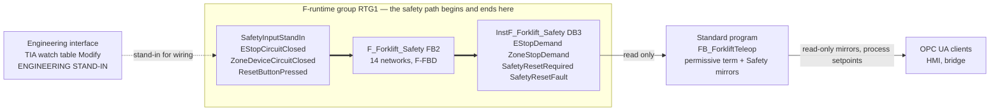

# Forklift twin — F-CPU safety program specification (M5 opening wave, cell-scope core)

ADR 0009, cell-scope core only. This is the **implementation specification for the
safety program** the owner builds by hand in TIA Safety, in the F-runtime group
that already exists in the `safe_amr` project, on the 1513F-1 PN CPU running under
PLCSIM Advanced.

It is written for an experienced controls engineer sitting in front of the
software, and it describes **deltas to a build that is already running** — not a
fresh project. Everything in `F_Forklift_Safety [FB2]`, `Main_Safety_RTG1 [FB1]`
and `InstF_Forklift_Safety [DB3]` stays where it is; §3.0 lists the seven changes
and §4.2 walks them in order.

**Status: specification, not verification.** No part of this document has been
executed in TIA Portal or PLCSIM Advanced by its author, who has neither
installed. Every menu path is version-dependent and named so it can be recognised
rather than clicked blind; every tool-derived value is a **design value until the
owner reads it back out of the tool** (ADR 0006). Nothing here is evidence for any
gate.

## Authority

| Document | What it fixes | Relation to this one |
|---|---|---|
| `docs/safety/SRS.md` §3 SF-01, SF-07, SF-08 and their acceptance tests | The functions, their triggers, reactions, safe states, reset behaviour and AT sub-cases | **Contract.** If this document disagrees, the SRS wins and this one is corrected |
| `docs/safety/TWIN-DEMO-MAP.md` | Which SRS text the twin instantiates, which AT sub-cases are in scope and which are deferred, the non-claims, the wording, and rules R1–R6 on this document | **Binding.** §5.1's stand-in sentence, §5.2's stand-in rule and §6 R1 govern §5, §6 and §7 below |
| `docs/adr/0009-early-cell-scope-safety-on-the-forklift-twin.md` | Scope (D1), gate bounds (D2), the coupling architecture (D3), the fallback (D4), the ISO 13849 basis and wording discipline (D5) | **Binding** |
| `docs/safety/PL-SCENARIOS.md` | The risk-graph derivations behind every PLr quoted anywhere | **Contract.** No parameter is derived, re-derived or re-argued here |
| `docs/roadmap.md` row M5 | The gate criterion this work does **not** close | **Binding.** See §1.2 |
| `plc/forklift/SPEC.md` | The standard program this couples to: `FB_ForkliftTeleop`, its permissive sets, its process obstacle latch and its process reset | **Input, and unchanged by this document.** The standard-side delta is a separate brief; §6 is the contract it consumes |
| `plc/demo-cell/SPEC.md` | Document conventions: the `…CircuitClosed` polarity, fail-safe start values, watch-table shape, owner-executable procedure shape | **Pattern** |
| `CLAUDE.md` §9 | Wire NC / program NO, monitored edge-triggered reset, no auto-resume, edge versus level, PascalCase naming | **Binding.** §5 is its application to the F-side |

---

## 1. Scope and non-claims

### 1.1 What this program is

One F-runtime group on the same CPU that runs the M3 demonstration cell and the M4
forklift commissioning cell. It forms **two latched safety demands** from three
simulated F-input channels, and clears them on **one monitored reset**:

- **`EStopDemand`** — the logic of **SF-01**, from a simulated cell e-stop channel,
  read wire-NC / program-NO.
- **`ZoneStopDemand`** — the **SF-07 pattern** (`TWIN-DEMO-MAP.md` §2), from a
  simulated marked-zone device channel, same polarity.
- **`SafetyResetRequired`** and **`SafetyResetFault`** — the state and the device
  diagnosis of the **SF-08 cell instance**, the monitored edge-sequence reset that
  clears both latches and starts nothing.

The demand forms **entirely inside the CPU** and stays there (ADR 0009 D3.1). The
F-program's **entire write set is its own instance data block** (§3.4). Nothing
leaves the F-runtime group except by the standard program choosing to read it.



Thick arrows are the demand path. It is three boxes wide and never leaves the
F-runtime group. The dashed arrow is a **substitute for wiring** and carries no
claim (§7). What crosses to the standard program is a **read**, and what leaves
the CPU is a **consequence and a mirror**.

### 1.2 Non-claims — read before anything else

Every row below is carried from `TWIN-DEMO-MAP.md` §4 and ADR 0009 D5. They are
not caveats appended at the end; they are the terms on which this program is
allowed to exist at all.

| # | The claim that is **not** made |
|---|---|
| **N1** | **The reaction path is not instantiated.** SF-01 and SF-07 de-energize hardwired enabling outputs. **This program has no output to de-energize, and drives none** — no F-DQ, no contactor, no relay, no actuator, no setpoint. The stop a viewer sees is the **standard program** dropping its motion permissive and zeroing its three setpoints, which then travel to the plant over OPC UA and the bridge. That is a **process consequence of the demand**, never the safety reaction (`TWIN-DEMO-MAP.md` T4, NC-5). Every millisecond figure in SRS §3 stays a design requirement for real hardware and **nothing here is timed against one** |
| **N2** | **No achieved PL, anywhere.** The design targets are quoted, never derived: SF-01 **Category 3, PL d**; SF-07 **Category 3, PL d**; SF-08 **PL c** — all from `SRS.md` §5 with their `PL-SCENARIOS.md` derivations (SC-01, SC-02, SC-03; SC-10; SC-11), and a PLr is a **floor** belonging to the hazard, not to the instance modelling it. No SISTEMA model, no MTTF<sub>D</sub>, no DC<sub>avg</sub>, no CCF, no PFH<sub>D</sub>, no certified component, no ISO 13849-2 validation. This document creates no SF number, no AT identifier, no PLr and no PL value (NC-2) |
| **N3** | **No Category is demonstrated.** One stand-in channel per function, no second channel, no discrepancy monitoring, no diagnostics. AT-01 (c) is deferred and SC-03 is not exercised (NC-3) |
| **N4** | **No safety-rated input exists.** All three F-inputs are **engineering stand-ins** for hardwired, safety-rated devices that do not exist in this project. A stand-in is a substitute for **wiring**, not for a safety input, and it carries no Category, no PL, no channel count and no diagnostic coverage (`TWIN-DEMO-MAP.md` §5.2). What is demonstrated is what the safety program does with an input, **never how the input arrives** |
| **N5** | **Nothing here is an acceptance test passed, and nothing closes M5.** The M5 criterion additionally requires each AT with its standard-program-in-STOP sub-case (B3), the same reactions with the bridge stopped and the OPC UA session down, the read-only mirrors, and the recorded showcase that closes the gate (`docs/roadmap.md` row M5; ADR 0009 D2.3). **ADR 0010 D2 widens M5** — it absorbs the old vehicle gate, so the same gate also carries the forklift's safety scanners on the F-side, its navigation stack and HMI v2, and closes on a recorded **safety + autonomy** showcase (D7). ADR 0010 **extends** ADR 0009 rather than superseding it, and it makes that ADR's early opening the **opening wave of M5 itself** rather than a departure from gate discipline: the accurate statement is now *"M5's cell-scope core is being built first"* (ADR 0009 D2.4 as extended by ADR 0010 D2). **"M5 proper" below therefore means the rest of that same gate**, on real F-I/O this instance does not have — not a different gate |
| **N6** | **The 2026-07-29 F-run is not counted here.** It showed a latch form, hold after its cause cleared, and raise a reset-required flag — evidence that the **F-logic executes**, and nothing more: the input was network-fed, the acknowledgement was a level, and the standard program ran throughout (ADR 0009 context; `TWIN-DEMO-MAP.md` T5). It satisfies no AT sub-case and appears in no pass count below |
| **N7** | **The vehicle chain is out of scope of this document.** SF-02, SF-03, SF-04 and the vehicle instance of SF-08 also land at **M5** — in that gate's vehicle-chain content, not in this cell-scope core; SF-09 at M6; SF-05 and SF-06 at M6, with the stations (ADR 0009 D1, landing points under ADR 0010 D7). A vehicle-shaped machine stopping when a zone is entered is **not SF-03**: this plant has no safety laser scanner, no protective or warning field, no STO, no bumper and no onboard safety layer at all (NC-1) |
| **N8** | **The M3 demonstration cell is unchanged.** Its red mushroom stays a **process stop** (ADR 0004). Sharing a CPU with an F-runtime group does not make it part of one (NC-7) |
| **N9** | **Link loss stays degraded mode, not a safety event** (invariant 2, SRS B2). The twin's HMI- and bridge-link latches are standard-program process logic and are not SF-09 (NC-9) |

### 1.3 Two ways to say "stop" now exist on one machine

This is the single most likely place for the project's central claim to be
misread (`TWIN-DEMO-MAP.md` R4, ADR 0009 consequences), so it is stated as a
table rather than a sentence:

| | The lidar obstacle stop | The zone safety demand |
|---|---|---|
| Where it lives | Standard program, `FB_ForkliftTeleop` | F-runtime group, `F_Forklift_Safety` |
| Its input | `Forklift/Input/ForkliftObstacleInStopZone`, written by the bridge over OPC UA from a Gazebo lidar | `"SafetyInputStandIn".ZoneDeviceCircuitClosed`, an engineering stand-in for a hardwired safety-rated zone device |
| Its latch | `ObstacleStopLatch` → `Forklift/Status/ForkliftObstacleStopActive` | `EStopDemand` / `ZoneStopDemand` in `InstF_Forklift_Safety` |
| Its reset | `Forklift/Hmi/HmiResetRequest`, a **client write**, rising edge — the **process** reset | `"SafetyInputStandIn".ResetButtonPressed`, an F-input stand-in, **never a client write** — the **SF-08** reset |
| What it implements | **No** SRS function (ADR 0008 D3) | The logic of SF-07 as a **pattern**, and SF-08 |

**They never share a name, a node, a lamp or a sentence.** The tag names above
have no word in common by construction. §3.0 D2 exists mainly because the build in
front of you currently violates this: the F-block's zone input is literally wired
to the lidar bit.

---

## 2. Feasibility checkpoint — run this before building anything

**The abort rule, and it applies to every row below.** If a check fails and the
row's *Abort* column says *fallback*, **stop and take ADR 0009 D4**: every
early-opened item is dropped, the M4 teleop demonstration stands alone with its
criteria unchanged, and nothing is lost — the work continues as ordinary M5
content when the gate opens properly (`TWIN-DEMO-MAP.md` R6). A fallback that
needs a document edit is not a fallback: taking it means **not applying** the
deltas of §3.0 and **not applying** the standard-side delta of its own brief. No
document changes.

| # | Check | How, and what to record | Abort |
|---|---|---|---|
| **F0** | Safety Advanced licence present | **Answered 2026-07-29** (ADR 0009, context): the project compiled with its F-runtime group. Confirm it still holds by opening *Safety Administration* and reading the licence state; record it with the date | fallback |
| **F1** | The F-runtime group reaches RUN on the 1513F-1 PN PLCSIM Advanced instance | **Answered 2026-07-29** (ADR 0009, context): downloaded, CPU in RUN, F-runtime group executing, and the F-logic seen to latch. Re-confirm after each download of this document's deltas | fallback |
| **F2** | The **instruction set** this specification uses exists in the safety program | **Answered 2026-07-30, in the tool**: `RS`, `SR` and `TON` are present and are what §5 uses; **`R_TRIG` and `F_TRIG` are not offered in this safety instruction set**, so §5's networks 3, 4 and 14 form both edges by hand from one static (§5.0 note 4). Re-check the list after any TIA or firmware change and record it | The timer is the one with no substitute: without `TON` the monitored window cannot be built and §2's fallback applies. It is present, and networks 6 and 7 use it |
| **F3** | The **engineering stimulus works with safety mode activated** | Build D1 of §3.0 alone, download, confirm *Safety Administration* reads **safety mode activated**, then *Modify* `"SafetyInputStandIn".EStopCircuitClosed` in a watch table and read it back. **If a Modify of this DB requires deactivating safety mode, the ruling of §7 is broken and there is no honest stimulus** | fallback |
| **F4** | The F-program can **read** the stand-in DB, and no standard block **writes** it | After D1 and D2, compile the safety program. Record the warning text and count — a safety program reading standard data is expected to be reported. Then right-click `SafetyInputStandIn` → *Cross-references*: the only accesses must be the three read pins in `Main_Safety_RTG1` | fallback |
| **F5** | The standard program can **read** `InstF_Forklift_Safety` | After D2–D4, add one throwaway read of `"InstF_Forklift_Safety".EStopDemand` in a standard block and compile. **Delete it afterwards** — the real read is the standard-side brief's | fallback: without it the coupling contract of §6 cannot be honoured |
| **F6** | Safety mode is **activated** and the build in the CPU is the build on the screen | *Safety Administration* online: safety mode **activated**, and the **F-collective signature** online equals offline. Record the signature with its date | fallback for the run; re-download and re-check |

**F0 and F1 are substantially closed** (ADR 0009, context, 2026-07-29): the
project compiled with the F-runtime group present, downloaded, reached RUN, and
the F-logic executed end to end. What that closed is the *feasibility* question
ADR 0007 attached to the safety gate. What it did **not** close is the formal
acceptance procedure, and F2–F6 are the entry conditions for building the version
that could one day face one.

> **The F-collective signature is the F-side answer to the stale-build lesson.**
> A download that leaves project and CPU inconsistent shows up on the standard
> side as silent refusals and monitoring-error icons (LESSONS 2026-07-28). On the
> F-side there is a stronger instrument: the collective signature is a single
> value the tool computes from the safety program, and comparing online against
> offline answers *"is the CPU running what I am reading?"* in one glance. **Read
> it before every T6 run and record it beside the evidence.**

### 2.1 The F-input channel ruling, and its AT-07 consequence

**The open question.** `TWIN-DEMO-MAP.md` R2 requires the F-inputs to be driven
"at the simulated F-I/O / engineering interface, never through a process node a
cell client can write", and leaves open what that interface is on this instance.

**Ruling: no usable PROFIsafe F-I/O channel exists on this PLCSIM Advanced
instance, and none is configured.** The reasoning, stated so it can be checked
rather than believed:

1. PLCSIM Advanced simulates the **CPU**, not the distributed I/O behind it. There
   is no PROFIsafe partner for the F-driver to run the safety protocol against.
2. A configured F-DI with no PROFIsafe partner **passivates**, and the F-system
   substitutes fail-safe values — zeros — into the channel every F-cycle.
3. With wire-NC / program-NO polarity, a channel stuck at zero reads
   **permanently tripped**. The demand would latch at power-up and no reset could
   ever succeed, because the cause would never clear. The demonstration would show
   a machine that cannot be started, which demonstrates nothing.
4. Writing the channel's process image from outside does not help: the F-driver
   overwrites it with the fail-safe value in the same F-cycle while the module is
   passivated.

**This is a design assessment, not a tool read-back.** It is falsifiable in one
step and the owner is asked to falsify it: if a usable F-DI channel turns out to
exist on this instance, **§7 is the only section that changes**, because the swap
happens at three pins of one call in `Main_Safety_RTG1` (§4.2 step 8) and
**nothing inside `F_Forklift_Safety` moves**. That is the whole reason the input
channels are FB interface parameters rather than direct global reads.

**The AT-07 consequence, stated rather than discovered.** With no F-I/O channel:

- **AT-07 (a) and (b) are exercised as logic and ordering only** — already the
  ruling of `TWIN-DEMO-MAP.md` §3, and this section is why. No ramp, no power
  removal, **no stop category demonstrated**, no timing claimed.
- **AT-01 (c) stays deferred and no Category is demonstrated** (N3). A second
  channel and its discrepancy monitoring have nowhere to live.
- **The provenance of the input is never claimed.** Any sentence of the form
  "the safety input detected…" is false here; the true sentence is "the operator
  at the engineering interface played the device, and the safety program did
  this with it".
- **What the ruling buys**, and it is the reason it is worth taking rather than
  waiting: the stimulus uses **neither the bridge nor the OPC UA session**. The
  2026-07-29 network-fed form could never satisfy the M5 criterion at all
  (`TWIN-DEMO-MAP.md` §5.2 rule 2); this form removes that particular
  disqualification from the demand's formation. It does **not** remove it from
  the observable, which is a process consequence produced by the standard program
  over OPC UA (N1).

---

## 3. F-tags, the stand-in DB, and the F-data the standard program reads

### 3.0 The build in front of you, and the seven deltas

Recorded from the owner's build state of 2026-07-29. **Nothing is created from
scratch**: `Main_Safety_RTG1 [FB1]`, `F_Forklift_Safety [FB2]` and
`InstF_Forklift_Safety [DB3]` all exist and stay.

| What exists today | What is wrong with it |
|---|---|
| `F_Forklift_Safety [FB2]`, F-FBD, two networks: an `SR` latch (S = zone, R1 = reset acknowledgement) driving `Q_StopActive`; and `Q_StopActive AND NOT zone` driving `Q_ResetRequired` | The latch is **reset-dominant** (§5.0 note 2), so a held acknowledgement defeats the demand. `Q_ResetRequired` drops while the cause stands, which inverts what SF-08's flag means. There is **no e-stop channel**, no monitored edge sequence, no hold window and no reset-fault |
| `I_ObstacleInStopZone` ← `DB_ROS_Bridge.Forklift.Input.ForkliftObstacleInStopZone` | A **network-fed standard tag** — doubly disqualified (`TWIN-DEMO-MAP.md` §5.2 rule 2) — and it is *the lidar obstacle bit itself*, so the zone demand and the process obstacle stop currently share one input and one name. That is R4 broken at the tag |
| `I_Reset_Ack` ← `DB_AGV_Drive.Sim_Reset_Button` | A **level**, in a DB that is client-reachable through the auto-published `DataBlocksGlobal` folder unless *Accessible from HMI/OPC UA* is cleared (`opcua-nodes.md` §9.8). An OPC UA client that can write it can clear a safety latch — exactly the client write R1 forbids |
| `Q_StopActive` → `Forklift.Status.ForkliftObstacleStopActive`, `Q_ResetRequired` → `Forklift.Status.ForkliftResetRequired` | **Dual writer.** Both tags belong to `FB_ForkliftTeleop`'s process latch and process reset (`plc/forklift/SPEC.md` §7). Two programs writing one tag breaks invariant 10, and writing the **process** obstacle flag from the **safety** program merges the two things §1.3 exists to keep apart |

| # | Delta | Why |
|---|---|---|
| **D1** | **Create** global DB `SafetyInputStandIn` — three Bools, all start `FALSE`, *Accessible from HMI/OPC UA* **✘** (§3.1) | R2: the F-inputs are driven at the engineering interface and are reachable by no client, on no path, including `DataBlocksGlobal` |
| **D2** | **Rewrite the interface** of `F_Forklift_Safety [FB2]`: three Inputs, four Outputs, the statics of §3.3 (§3.2) | The e-stop channel does not exist yet; R4 forbids the current zone-input name; CLAUDE.md §9 requires PascalCase, physical-thing-plus-meaning names, and the mirrors downstream diff against them |
| **D3** | **Replace FB2's two networks** with the fourteen of §5 | Set-dominant latches, the monitored edge sequence with its hold window and reset-fault, and `SafetyResetRequired` meaning what SF-08 says it means |
| **D4** | **Rewire the call** in `Main_Safety_RTG1 [FB1]`: three inputs from `"SafetyInputStandIn"`, and **all four outputs left unassigned** | The dual-writer resolution: after D4 the F-program's entire write set is `InstF_Forklift_Safety` (§3.4) |
| **D5** | **Verify by cross-reference** that no F-block writes anything in `DB_ROS_Bridge` | D4 should have removed it; D5 is the check, because "should have" is not a verification |
| **D6** | **Retire** `DB_AGV_Drive.Sim_Reset_Button` from the F-program | R1. The tag may stay in the project as a dead end; it is no longer connected to anything safety-related |
| **D7** | `InstF_Forklift_Safety [DB3]`: *Accessible from HMI/OPC UA* **✘**; download **with re-initialisation** of DB3 | No client reads or writes F-data directly — the `Safety/` mirrors are the only client-visible view (ADR 0009 D3.3). Re-initialisation because an interface change moves the DB layout, and a download without it preserves stale instance values forever (LESSONS 2026-07-28) |

### 3.1 The three simulated F-input channels

**One new standard global DB, `SafetyInputStandIn`, optimized access, no member
Retain.** It is a **standard** DB and not an F-DB, and §7 gives the four reasons.

| PLC symbol | S7 type | Start value | Meaning, and the polarity |
|---|---|---|---|
| `"SafetyInputStandIn".EStopCircuitClosed` | Bool | **`FALSE`** | The cell e-stop's NC circuit. **`TRUE` = closed = not actuated and the wiring healthy.** `FALSE` = actuated, or a broken wire, or an absent signal — all three read as a demand. **Wire NC, program NO** (CLAUDE.md §9): the program uses the tag as a plain NO contact, so every failure of the channel falls in the stopping direction |
| `"SafetyInputStandIn".ZoneDeviceCircuitClosed` | Bool | **`FALSE`** | The marked-zone device's NC output. **`TRUE` = zone clear and device healthy.** `FALSE` = zone occupied, device faulty, or wire broken. Same convention, same reasoning |
| `"SafetyInputStandIn".ResetButtonPressed` | Bool | **`FALSE`** | The monitored reset device. **NO contact, read NO: `TRUE` only while pressed.** This looks like an exception to wire-NC/program-NO and is exactly its intent — a reset must be *actively* commanded, so a broken wire, an absent signal and a dead device all mean **no reset**, which is the safe direction. A reset device wired NC would reset the machine when its cable was cut |

**Both start values are the fail-safe pre-connection state** (`plc/demo-cell/SPEC.md`
§3.1, `plc/forklift/SPEC.md` §3.1), and here they also model the truth about real
F-I/O: an F-DI boots passivated and reads zero until it is depassivated. The
consequence is not a defect and is written out so nobody hunts one:

> **`EStopDemand` and `ZoneStopDemand` both read `TRUE` from the first F-scan of
> every CPU run, and `SafetyResetRequired` with them.** The machine cannot be
> enabled until both stand-in circuits have been closed at the engineering
> interface and one monitored reset has been completed. That is step T6.0 of
> every run, it is what a real cell requires of an operator, and it is the
> correct reading of a fail-safe start value.

**No member is Retain.** A restart re-reads the world and decides where it is; it
never resumes from stale state (CLAUDE.md §9). Since a CPU restart reverts this DB
to its start values, a restart re-latches both demands — which is the same
statement.

### 3.2 `F_Forklift_Safety [FB2]` interface — before and after

| Section | Today | After D2 | Note |
|---|---|---|---|
| Input | `I_ObstacleInStopZone` | `ZoneDeviceCircuitClosed` | **Renamed, and the rename is mandatory**: R4 forbids the zone input sharing a name with the lidar bit, and the old name *is* the lidar bit's name |
| Input | `I_Reset_Ack` | `ResetButtonPressed` | Renamed. "Ack" describes a protocol; the tag describes a device and its state (CLAUDE.md §9) |
| Input | — | **`EStopCircuitClosed`** | **New.** The SF-01 demand channel does not exist in the build |
| Output | `Q_StopActive` | `ZoneStopDemand` | Renamed. "StopActive" would be a second name for the process obstacle flag (§1.3) |
| Output | — | **`EStopDemand`** | **New**, with its channel |
| Output | `Q_ResetRequired` | `SafetyResetRequired` | Renamed to the name `TWIN-DEMO-MAP.md` §3 uses throughout, and **its meaning changes** — see §5, network 13 |
| Output | — | **`SafetyResetFault`** | **New.** SF-08 requires a stuck-or-bridged actuator to be *flagged*, not merely ignored (`TWIN-DEMO-MAP.md` §3, AT-08 (a): "the upper bound and the power-up rejection are what make it a reset *fault* rather than merely a non-event") |

All seven are **Bool**. The `I_` / `Q_` prefixes are dropped: this project names
tags in PascalCase after the physical thing plus its meaning, and the OPC UA
mirror names downstream diff against these names (CLAUDE.md §9).

> **As built, 2026-07-30.** D1–D7 are **fully applied**, so the *Today* column
> above is now the historical state and the *After D2* column is the build. The
> interface reads **3 Inputs, 4 Outputs, 10 statics and 2 constants** — ten and
> not eleven because this CPU's safety instruction set has no `R_TRIG`/`F_TRIG`,
> so the two edge instances are replaced by one static, `ResetMemory` (§3.3,
> §5.0 note 4). The call in `Main_Safety_RTG1` has its three input pins bound to
> `"SafetyInputStandIn"` and **all four output pins empty**, which is §3.4's
> write set as a fact rather than an instruction.

> **An interface change moves the instance DB layout.** After D2, `DB3` is
> regenerated on compile and the download must **re-initialise** it (§4.2 step
> 10). A download that preserves the old layout leaves stale values ruling —
> the failure LESSONS 2026-07-28 records for a timer `PT`, and the same mechanism
> applies to every static below.

### 3.3 Statics inside `InstF_Forklift_Safety [DB3]`

All Static, all non-Retain. **Ten of them**, as built. The two timer instances are
declared as **multi-instances** so they live inside `DB3` and no extra data block
appears (§4.2 step 7).

| Symbol | Type | Start value | Purpose |
|---|---|---|---|
| `CauseGone` | Bool | `FALSE` | **Both stand-in circuits closed, right now.** The live-world verdict a reset is tested against. **Contains no latch** — a latch is never a term in its own clearing condition (LESSONS 2026-07-27) |
| `ResetSeenOpen` | Bool | **`FALSE`** | *The reset device has been observed **not pressed** since the F-runtime group started.* Set once by the first scan that sees it open, never cleared while the group runs. This is the **power-up rejection** of SF-08: a device already pressed at start-up can never produce an accepted sequence |
| `ResetPressArmed` | Bool | `FALSE` | *The press currently in progress began with the cause already gone and the device previously seen open, and the live world has stayed clear ever since.* Set at a qualified **rising** edge; dropped on release **and on any return of a cause during the hold**. **This is the term that makes a held acknowledgement clear nothing** (§5.3 cases 3 and 6) |
| `ResetHoldValid` | Bool | `FALSE` | *The press currently in progress has been held at least `RESET_HOLD_MIN` and not yet `RESET_HOLD_MAX`, with the live world clear throughout.* Latched **while the contact is still held**, and re-armed on the next rising edge — never read off a running timer at the release, because an IEC `TON` returns `ET` to 0 in the same call in which `IN` goes false (LESSONS 2026-07-27) |
| `ResetRise` | Bool | `FALSE` | One-scan rising edge of `ResetButtonPressed` |
| `ResetFall` | Bool | `FALSE` | One-scan falling edge of `ResetButtonPressed` — **the edge the latch releases on** (SRS SF-08) |
| `ResetPulse` | Bool | `FALSE` | One-scan, fully qualified reset command. The **only** thing that clears either demand latch |
| `ResetMemory` | Bool | **`FALSE`** | `ResetButtonPressed` as it read in the **previous** F-cycle. The whole edge mechanism: networks 3 and 4 compare the device against this, and network 14 — the **last** network — copies the device into it. Start value `FALSE`, so a device already pressed at the first F-cycle **does** produce a rising edge, which is real and is refused downstream by `ResetSeenOpen` rather than suppressed here (network 3). This is what an `R_TRIG`'s hidden static would have held, made visible and watchable (§5.0 note 4, as built 2026-07-30) |
| `ResetHoldMinTimer` | `TON` | — | Multi-instance. Measures the minimum hold |
| `ResetHoldMaxTimer` | `TON` | — | Multi-instance. Measures the stuck-actuator bound |

**Constants.** Declared in the block's *Constant* section if the F-block offers
one; otherwise entered as literals at the `PT` pins. Either way **the `PT` is
explicit at the call site**, so no stale instance value can ever rule (LESSONS
2026-07-28).

| Constant | Value | Basis |
|---|---|---|
| `RESET_HOLD_MIN` | `T#200ms` | The lower bound of SF-08's monitored window, quoted from `SRS.md` §3 SF-08 ("held between **0.2 s** and 3 s"). Not a new number |
| `RESET_HOLD_MAX` | `T#3s` | The upper bound of the same window, same source. Beyond it the actuation is a stuck-or-bridged actuator |

**Neither is measured on the twin** (`TWIN-DEMO-MAP.md` §3, AT-08 (d): "the
0.2 s–3 s window is **not measured**"). They are built because the logic being
demonstrated is SF-08's logic, and a monitored reset without its window is a
different function.

### 3.4 The whole write set of the F-program

**`InstF_Forklift_Safety [DB3]`, and nothing else.**

That single sentence is the dual-writer resolution (ADR 0009 consequences,
`TWIN-DEMO-MAP.md` R3), and it is checkable in one command rather than argued: a
cross-reference on `DB_ROS_Bridge` must show **no write from any F-block**, and a
cross-reference on `DB_AGV_Drive` must show **no access from any F-block at all**
(§4.2 step 12).

It also settles a temptation worth naming, because the tool permits it: an F-block
**can** write a standard DB on this CPU — that is how the build in front of you
writes `Forklift.Status`. It must not. The `Safety/` mirrors are written by the
**standard** program copying F-data (ADR 0009 D3.3), because one tag has one
writer, and because a client-visible node written by the safety program would put
safety data on the wire under the safety program's name.

---

## 4. F-runtime group, safety administration and the build click-path

**Version-dependent.** Menu wording and dialog placement move between versions.
The steps name what to look for and why it matters; they are not a click path
verified on your installation.

### 4.1 What already exists and stays

```
Safety Administration
  F-runtime group RTG1
    FOB_RTG1                                   the F-OB that calls the group
      Main_Safety_RTG1 [FB1]                   main safety block  -- STAYS
        F_Forklift_Safety [FB2]  (F-FBD)       -- interface and body change
          InstF_Forklift_Safety [DB3]          -- regenerated, re-initialised
```

**Nothing in the standard program is touched by this document.** `OB30`, `OB1`,
`FB_DemoCellControl`, `FB_ForkliftTeleop`, the five forklift DBs and the `DemoCell`
server interface are all somebody else's brief (§10). The one new object on the
standard side is `SafetyInputStandIn`, which no standard block reads or writes.

### 4.2 Click-path, in order

| # | Step | Watch out for |
|---|---|---|
| 1 | **Run the §2 checkpoint first**, at least F0, F1 and F3. F3 needs only D1 | Building the whole delta and discovering at the end that the stimulus needs deactivated safety mode wastes the build and, worse, invites the temptation to demonstrate in deactivated safety mode |
| 2 | **D1 — add the global DB `SafetyInputStandIn`** with the three Bools of §3.1. Standard DB, optimized access, **no Retain**, start values all `FALSE` | It is a **standard** DB on purpose (§7). Do not create it inside the safety program and do not mark it as an F-DB — an F-DB cannot be modified from a watch table with safety mode activated, which would destroy the stimulus |
| 3 | **Clear *Accessible from HMI/OPC UA* on `SafetyInputStandIn`** in the DB's properties | This is the enforcement behind R1 and R2, and it is the whole reason the reset cannot be a client write. With the box ticked, the S7-1500 auto-publishes the DB under `Objects/DataBlocksGlobal` in its own namespace, where the commissioned access settings do not write-protect it (`opcua-nodes.md` §9.8, §9.10). **Any OPC UA client could then clear a safety latch.** Untick it, then verify in step 13 by browsing |
| 4 | **D2 — rewrite FB2's interface** per §3.2: rename two Inputs, add one; rename two Outputs, add two; add the ten statics of §3.3 | Rename in the interface table rather than deleting and re-adding, so TIA can carry the rename into the call in FB1. Expect the call in `Main_Safety_RTG1` to go inconsistent — step 8 repairs it |
| 5 | **Add the two constants** of §3.3 in the *Constant* section if the F-block offers one | If it does not, enter `T#200ms` and `T#3s` directly at the `PT` pins in networks 6 and 7. **Never leave a `PT` to an interface default** (LESSONS 2026-07-28) |
| 6 | **D3 — delete FB2's two existing networks and build the fourteen of §5**, in the order given | The order is not cosmetic: networks 1–10 form the reset, networks 11–13 consume it, so every value a network reads was produced earlier **in the same F-cycle**. Building the latches first makes the reset one cycle old. **Network 14 is the one deliberate exception and it stays last** — it writes `ResetMemory`, which networks 3 and 4 read from the *previous* cycle (§5.0 note 6) |
| 7 | **Set the multi-instance option** when TIA offers the call-options dialog for the two `TON` instances | Choosing *Single instance* creates extra data blocks and moves the statics out of `DB3`, so §8's watch table and §6's contract stop matching the build |
| 8 | **D4 — repair the call** in `Main_Safety_RTG1`: right-click the call box → *Update*, then wire the three input pins to `"SafetyInputStandIn".EStopCircuitClosed`, `.ZoneDeviceCircuitClosed` and `.ResetButtonPressed`, and **leave all four output pins unassigned** | An unassigned FB output pin is legal and is the point: the values live in `DB3` and the standard program reads them there. **If a usable F-DI channel is ever established, this step is the only one that changes** (§2.1) |
| 9 | **D6 — delete the old operands**: nothing may remain wired to `DB_AGV_Drive.Sim_Reset_Button` or to `DB_ROS_Bridge.Forklift.Input.ForkliftObstacleInStopZone` from any F-block | The lidar bit staying wired into the safety program is R4 broken and would make the recording's central claim false |
| 10 | **Compile the safety program. Read the warnings and record them** | A safety program that reads standard data is expected to be reported. After these deltas the F-side reads exactly three standard tags and writes none, so the two write-accesses into `Forklift.Status` must have disappeared from the report. **A warning that names `DB_ROS_Bridge` after step 9 means step 8 or 9 is incomplete** |
| 11 | **D7 — clear *Accessible from HMI/OPC UA* on `InstF_Forklift_Safety [DB3]`**. If the tool does not offer the property for an F instance DB, clear *Writable* for every member instead and **record what the tool allowed** | No client sees F-data directly. The client-visible view is the `Safety/` mirror group, written by the standard program (ADR 0009 D3.3) |
| 12 | **Download with re-initialisation of `DB3`**, then check the block diff circles are solid green | An interface change moved the DB layout. A download without re-initialisation preserves the old instance values, and the live tells are monitoring-error icons on exactly the rows whose offsets moved and an in-force `PT` that contradicts the call site (LESSONS 2026-07-28). Expect TIA to want the CPU in STOP for a safety-program download |
| 13 | **D5 — cross-reference three names**: `SafetyInputStandIn` (only three read accesses, all in `Main_Safety_RTG1`), `DB_ROS_Bridge` (**no** F-block access at all), `DB_AGV_Drive` (**no** F-block access at all) | This is the verification of §3.4's one-sentence write set. Do it after the download, not instead of it |
| 14 | **Browse the address space with an independent client** — UaExpert or an `asyncua` client, **not** the bridge and **not** the HMI — and confirm that `SafetyInputStandIn` and `InstF_Forklift_Safety` appear **nowhere**, including under `Objects/DataBlocksGlobal`. **Record the reading with its date** | This is the read-back that turns steps 3 and 11 from settings into facts (ADR 0006; LESSONS 2026-07-27). Until it is executed, "no client can clear a safety latch" is a design value, not a property |
| 15 | **Read back and record**: safety mode **activated**, the **F-collective signature** online and offline, the F-runtime group's monitoring time, and the F-OB's cycle time — all as the tool states them | Every one is a tool-derived value. None is invented in this document, and none may be quoted from it (§4.3) |

### 4.3 F-monitoring time, the F-OB cycle, and the hold window

**No number is proposed here for either, and that is deliberate.** The F-runtime
group's monitoring time and the F-OB's cycle time are proposed by the tool with
defaults that move between versions; a specification that names one would be
stating a design value as a fact, which is the failure ADR 0006 exists to prevent.
**Read both back and record them** (§4.2 step 15).

What this document does state is the **rule that connects them to §3.3**:

> **`RESET_HOLD_MIN` must span at least five F-runtime-group cycles**, or the hold
> measurement is meaningless — a 200 ms minimum sampled by a 100 ms F-OB is a
> two-sample verdict with a full sample of jitter either side.

Given the read-back value, exactly one of three things happens, and which one is
recorded with the evidence:

1. The F-OB cycle already leaves five or more cycles inside 200 ms. Nothing
   changes.
2. It does not, and the F-OB cycle is **lowered** until it does. Then re-measure
   the F-runtime group's execution time and the CPU's maximum cycle time, and
   record both — `OB30` already carries two function blocks (`plc/forklift/SPEC.md`
   §12 item 9) and the F-runtime group is a third load on the same CPU.
3. Neither is possible, and `RESET_HOLD_MIN` is **raised** above `T#200ms`. In
   that case it is **no longer the SRS's window**, and that is a **deviation to be
   recorded as an open item**, not a tuning decision. The SRS text stands; the
   twin's departure from it is what gets written down.

**The F-monitoring time governs the F-runtime group, not an F-I/O connection**,
because no F-I/O is configured (§2.1). If the CPU reports an F-runtime-group
timeout after the deltas, the F-runtime group's execution time has grown past its
monitoring time — read both, and raise the monitoring time only with the measured
execution time beside it.

### 4.4 Password and signature, stated honestly for a simulation context

- **The safety program's access protection password is set, and it is never
  written down in this repository** — not in this file, not in a report, not in a
  commit message, not in an evidence file. Credentials live outside version
  control (invariant 13). If the owner chooses **not** to set one, that is a
  legitimate choice for a simulated portfolio cell and it is **recorded as such**:
  on real equipment an unprotected safety program is not acceptable practice, and
  the honest statement is that the protection is out of scope here rather than
  that it is present.
- **The F-collective signature is recorded with its date** at every build that is
  tested against (§4.2 step 15). It is the one value that answers "is the CPU
  running the program I am reading?" without inference.
- **Safety mode reads *activated* for every step of §9.** If any step ever
  requires deactivating safety mode, that step is not a T6 step and does not go in
  the evidence — see §7.2.
- **No F-I/O acknowledgement (depassivation) logic exists**, because no F-I/O
  exists. On real F-I/O a depassivation acknowledgement is an additional device
  and an additional consideration for SF-08; it is deliberately not specified
  (§10).

---

## 5. The safety program in F-FBD — network by network

### 5.0 Reading rules for §5.1

1. **Every network is one logic string ending in one coil or one flip-flop box.**
   Fourteen networks, fourteen written operands.
2. **`SR` and `RS` are the opposite way round in TIA from IEC 61131-3, and getting
   it backwards is the single easiest way to build the wrong safety program.** In
   TIA the trailing `1` marks the **dominant** input:

   | Box | Pins, top to bottom | Dominant | Use it for |
   |---|---|---|---|
   | `SR` | `S`, **`R1`** | **Reset** | A flag that must clear as soon as its clearing condition appears — `SafetyResetFault`, `ResetHoldValid`, `ResetPressArmed` |
   | `RS` | `R`, **`S1`** | **Set** | **Every demand latch.** A demand that appears in the same cycle as a reset must win |

   **Verify this in the tool before trusting this paragraph**: select the box and
   read the instruction help, which names the dominant input. The build in front
   of you uses `SR` for its demand latch, which is reset-dominant — so a held
   acknowledgement currently defeats the demand, and D3 is what fixes it.
3. **A negated input pin** is written below as *(negated)*. Select the pin and use
   the *Negate* command from the pin's context menu or the toolbar; a small circle
   appears on the pin. **Every negation below is load-bearing** and each one is
   explained in its network's note.
4. **Both edges are formed by hand, from one static, and that is the build.**
   `R_TRIG` and `F_TRIG` are **not offered** in this CPU's safety instruction set
   (§2 check F2, answered in the tool 2026-07-30), so:
   - the rising edge is `ResetButtonPressed AND NOT ResetMemory` (network 3);
   - the falling edge is `NOT ResetButtonPressed AND ResetMemory` (network 4);
   - `ResetMemory := ResetButtonPressed` is **network 14, the last network**, so
     it runs after every reader of either edge (note 6, and network 14's own
     note).

   `TON` **is** present and networks 6 and 7 use it. It is the one instruction
   with **no substitute**: without a timer the monitored **window** cannot be
   built, SF-08's hold bounds cannot be built, and that is a **fallback** under §2
   rather than a simplification.

   > **The `R_TRIG` / `F_TRIG` form, for a CPU that has them — not this build.**
   > Networks 3 and 4 become one `R_TRIG` box with multi-instance `ResetRiseEdge`
   > and one `F_TRIG` box with `ResetFallEdge`, each driving its `=` coil from
   > `Q`; network 14 disappears and `ResetMemory` with it, taking the static count
   > from 10 to 11. **Nothing else moves** — no latch, no window, no pin, no
   > watch-table row outside those three. It is recorded so a future CPU does not
   > have to re-derive it, and it appears nowhere in §5.1.
5. **The operand of an `SR` / `RS` box is written above the box.** The `Q` output
   pin is optional and is left unconnected everywhere below — the operand *is* the
   value.
6. **No network reads a value that a later network writes — with exactly one
   exception, and it is the edge mechanism.** `ResetMemory` is read in networks 3
   and 4 and written in network 14, deliberately: what those networks need is the
   value from the **previous** F-cycle, which is exactly what a variable written
   after them still holds. Moving network 14 earlier, or "repairing" the apparent
   forward reference, destroys both edges — network 3 would compare the device
   against itself and never see one. **Network 14 stays last.** Everywhere else
   the order is the design.

### 5.1 The fourteen networks

---

**Network 1 — `CauseGone`: both stand-in circuits closed, right now**

| Element | Pin | Operand |
|---|---|---|
| `AND` box, 2 inputs | in 1 | `"SafetyInputStandIn".EStopCircuitClosed` |
| | in 2 | `"SafetyInputStandIn".ZoneDeviceCircuitClosed` |
| `=` coil | — | `#CauseGone` |

**Reads as:** the live world is clear — the e-stop is not actuated and the zone
device reports clear, and both channels are healthy.

**Notes.** Neither pin is negated: this **is** the program-NO read of a wire-NC
channel. The signal being present is the permissive; its absence, for any reason
including a broken wire, is the demand.

**`CauseGone` contains no latch, and that is the whole reason a reset is possible
at all.** Putting `EStopDemand` or `ZoneStopDemand` in here would make each latch
its own precondition for clearing, and no reset could ever fire (LESSONS
2026-07-27). It is the F-side twin of the standard program's `causeGone`
(`plc/forklift/SPEC.md` §6.3).

**One reset, all latches, all causes.** `CauseGone` requires **both** circuits
closed, so a reset cannot clear the e-stop demand while the zone is still
occupied. That is stricter than the minimum and it is deliberate: one monitored
reset clears every F-latch when the whole live world is clear, which is one rule
to state in a recording instead of two.

---

**Network 2 — `ResetSeenOpen`: the power-up rejection**

| Element | Pin | Operand |
|---|---|---|
| `S` (set output) coil | in *(negated)* | `"SafetyInputStandIn".ResetButtonPressed` |
| | operand | `#ResetSeenOpen` |

**Reads as:** the reset device has been observed **not pressed** at least once
since the F-runtime group started.

**Notes.** Start value `FALSE`; an `S` coil never clears it, so it is a one-shot
that stays set for the rest of the run. **This is SF-08's "high at power-up is a
stuck-or-bridged actuator, rejected"** turned into a term: a device already
pressed when the group starts has never been seen open, so network 5 refuses to
arm the press and network 8 flags the fault.

It is deliberately **not** cleared at a link loss or any other event, because
unlike the standard program's per-session guard (`plc/forklift/SPEC.md` §6.7,
P6) there is no session here — the channel is a wired input, not a client write,
and the only boundary at which the program starts believing it is the F-runtime
group's start.

---

**Network 3 — `ResetRise`: the rising edge of the reset device**

| Element | Pin | Operand |
|---|---|---|
| `AND` box, 2 inputs | in 1 | `"SafetyInputStandIn".ResetButtonPressed` |
| | in 2 *(negated)* | `#ResetMemory` |
| `=` coil | — | `#ResetRise` |

**Reads as:** the operator has just pressed the reset device, this F-cycle only.

**Notes.** **The edge is formed by hand**, because this instruction set offers no
`R_TRIG` (§5.0 note 4). `ResetMemory` holds the device's state from the previous
F-cycle and is written by **network 14**, after every reader of either edge; the
apparent forward reference is the mechanism, not a defect (note 6).

`ResetMemory` starts `FALSE`, so a device **already pressed at the first F-cycle
produces a rising edge** — the same behaviour an `R_TRIG`'s hidden static would
have given, for the same reason. That edge is real and is not suppressed here: it
is refused downstream by network 5, which requires `ResetSeenOpen`. Suppressing
it here instead would hide the very condition SF-08 wants flagged.

---

**Network 4 — `ResetFall`: the falling edge, the edge the latch releases on**

| Element | Pin | Operand |
|---|---|---|
| `AND` box, 2 inputs | in 1 *(negated)* | `"SafetyInputStandIn".ResetButtonPressed` |
| | in 2 | `#ResetMemory` |
| `=` coil | — | `#ResetFall` |

**Reads as:** the operator has just released the reset device, this F-cycle only.

**Notes.** SRS SF-08: *"the latch releases on the **falling edge** (button
release)"*. The release is the acting edge; the press only starts the measurement.

**The same static, the negations swapped** — network 3's shape mirrored, reading
the same `ResetMemory` network 14 writes at the end of the cycle (§5.0 note 4).
With `ResetMemory` starting `FALSE` and the device unpressed, no spurious falling
edge can form at the first F-cycle.

---

**Network 5 — `ResetPressArmed`: is this press allowed to count?**

| Element | Pin | Operand |
|---|---|---|
| `AND` box, 3 inputs | in 1 | `#ResetRise` |
| | in 2 | `#CauseGone` |
| | in 3 | `#ResetSeenOpen` |
| `OR` box, 2 inputs | in 1 *(negated)* | `"SafetyInputStandIn".ResetButtonPressed` |
| | in 2 *(negated)* | `#CauseGone` |
| `SR` box, operand `#ResetPressArmed` | `S` | the `AND` output |
| | `R1` | the `OR` output |

**Reads as:** the press in progress began with the cause already gone and with the
device previously seen open, **and the live world has stayed clear ever since**. It
drops the moment the device is released, and the moment any cause returns.

**Notes — this is the network the whole reset hangs on.** `SR` is
**reset-dominant**, which is correct here: at the rising edge the device is
pressed and the world is clear, so `R1` is false and `S` may set; at the release,
or at any return of a cause, `R1` dominates and the arming drops. **It cannot be
re-armed without a fresh rising edge**, because `S` needs `ResetRise`.

**Why the arming is decided at the *rising* edge.** Without it, an operator could
press the reset while the zone was still occupied, hold it, have the zone clear
under the held button, and release — and a naive falling-edge design would clear
the latch, because at the moment of release the cause is gone and the hold was
long enough. **A held acknowledgement would then clear a demand it was never
entitled to clear**, which is the defect a monitored reset exists to prevent and
the exact shape the standard cell's procedure was corrected for
(`plc/forklift/SPEC.md` §11, the note under T5.4, and the K4 kernel of its logic
double). Deciding at the rising edge means the operator must **release and press
again after the cause has cleared** — the same "release, reset, enable again"
sequence the standard side teaches.

**And why `NOT CauseGone` is in `R1` as well.** Arming at the rising edge alone
leaves one hole, and it is the same defect one level deeper: press with the world
clear, hold, let a cause appear and disappear again during the hold, then release.
The press was validly armed and at the release the world is clear again, so a
design that only checked the rising edge would clear a demand that formed **after**
the acknowledgement began. Dropping the arming on any return of a cause closes it:
**an acknowledgement covers only the events that had already happened when it
began.** The condition the operator has to satisfy is one sentence — *press with
the world clear and keep it clear for the whole hold* — and it is the mirror of
the rule the standard cell's procedure was corrected to obey, that a test of an
edge-triggered control holds the control unbroken across the event under test
(LESSONS 2026-07-29).

---

**Network 6 — `ResetHoldMinTimer`: the minimum hold**

| Element | Pin | Operand / value |
|---|---|---|
| `AND` box, 2 inputs | in 1 | `"SafetyInputStandIn".ResetButtonPressed` |
| | in 2 | `#ResetPressArmed` |
| `TON` box, multi-instance `#ResetHoldMinTimer` | `IN` | the `AND` output |
| | `PT` | `#RESET_HOLD_MIN` (`T#200ms`) |

**Reads as:** an **armed** press has been held for at least 200 ms.

**Notes.** The `IN` is gated by `ResetPressArmed`, so an unarmed press never
starts the clock and therefore can never produce a valid hold, however long it
lasts. `PT` is stated at the pin, never left to an interface default (LESSONS
2026-07-28). `Q` is consumed in network 9; `ET` is a watch-table row (§8).

**`IN` is the press's own activity**, so the timer is released the moment the
device is released — a timer that is never released is correct exactly once
(LESSONS 2026-07-27).

---

**Network 7 — `ResetHoldMaxTimer`: the stuck-actuator bound**

| Element | Pin | Operand / value |
|---|---|---|
| `TON` box, multi-instance `#ResetHoldMaxTimer` | `IN` | `"SafetyInputStandIn".ResetButtonPressed` |
| | `PT` | `#RESET_HOLD_MAX` (`T#3s`) |

**Reads as:** the reset device has been held for more than 3 s.

**Notes.** **Ungated on purpose** — unlike network 6, this timer runs for *any*
press, armed or not. A stuck or bridged actuator must be **flagged** whether or
not the press was ever eligible; that is what makes AT-08 (a) a reset *fault*
rather than a non-event (`TWIN-DEMO-MAP.md` §3).

---

**Network 8 — `SafetyResetFault`: the device diagnosis**

| Element | Pin | Operand |
|---|---|---|
| `AND` box, 2 inputs | in 1 | `"SafetyInputStandIn".ResetButtonPressed` |
| | in 2 *(negated)* | `#ResetSeenOpen` |
| `OR` box, 2 inputs | in 1 | `#ResetHoldMaxTimer.Q` |
| | in 2 | the `AND` output |
| `SR` box, operand `#SafetyResetFault` | `S` | the `OR` output |
| | `R1` *(negated)* | `"SafetyInputStandIn".ResetButtonPressed` |

**Reads as:** the reset device is stuck or bridged — it was already pressed when
the F-runtime group started, or it has been held longer than the monitored window
allows. The flag clears when the signal returns to 0.

**Notes.** `SR` is **reset-dominant** and that is exactly the SRS's wording:
*"a reset-fault is flagged **until the signal returns to 0**"*. Both set terms
require the device pressed, so set and reset are mutually exclusive and the
dominance choice is a statement of intent rather than a tie-break.

The contrast with networks 11 and 12 is worth holding on to: **a fault flag is
reset-dominant, a demand latch is set-dominant.** Two boxes, opposite choices,
opposite reasons.

---

**Network 9 — `ResetHoldValid`: latch the verdict while the contact is still held**

| Element | Pin | Operand |
|---|---|---|
| `OR` box, 3 inputs | in 1 | `#ResetRise` |
| | in 2 | `#ResetHoldMaxTimer.Q` |
| | in 3 *(negated)* | `#CauseGone` |
| `SR` box, operand `#ResetHoldValid` | `S` | `#ResetHoldMinTimer.Q` |
| | `R1` | the `OR` output |

**Reads as:** the press in progress passed 200 ms, has not yet passed 3 s, and the
live world has been clear throughout.

**Notes — this network exists because of a specific defect.** An IEC `TON`
returns `ET` to 0 in the same call in which `IN` goes false, so a reset that reads
the elapsed time **at the release** always measures 0 and never fires. The verdict
must be **latched while the contact is still held** and **re-armed on the next
rising edge** (LESSONS 2026-07-27). That is precisely what `S` and the first `OR`
input do.

`SR` is **reset-dominant**, which is what makes the upper bound bite: once
`ResetHoldMaxTimer.Q` is true both `S` and `R1` are true, and reset dominance
keeps the verdict cleared for the rest of that press. **A press held past 3 s can
never become valid again by being held longer, and cannot become valid by being
released either** — nothing sets the verdict after the max timer has fired.

**The third `OR` input is the partner of network 5's.** Network 5 stops the min
timer when a cause returns; this one clears a verdict that was already latched
before it returned. **Both are needed**: without the first, the timer's `Q` stays
high and would immediately re-set this verdict the moment the cause cleared again;
without the second, a verdict latched before the cause returned would survive it.
Together they mean a hold that was interrupted by an event can only be made good
by a fresh press.

---

**Network 10 — `ResetPulse`: the one thing that clears a demand**

| Element | Pin | Operand |
|---|---|---|
| `AND` box, 4 inputs | in 1 | `#ResetFall` |
| | in 2 | `#ResetHoldValid` |
| | in 3 | `#CauseGone` |
| | in 4 *(negated)* | `#SafetyResetFault` |
| `=` coil | — | `#ResetPulse` |

**Reads as:** an armed press, held inside the monitored window, has just been
released, with the live world clear and the device healthy.

**Notes.** Four conjuncts, four independent refusals:

- `ResetFall` — a **held** control is not a reset, ever. No elapsed time makes an
  edge appear.
- `ResetHoldValid` — too short is refused (AT-08 (b)'s logic, whose *test* is
  deferred, §7.3) and too long is refused (AT-08 (a)).
- `CauseGone` — a reset with a trigger still present is ignored (AT-08 (c)). This
  is the check **at the moment of release**. It is the third of three on the same
  condition: network 5 checks it at the **press**, networks 5 and 9 hold it
  **throughout the hold**, and this one checks it at the **release**. They are
  cheap, independent, and each catches a case the others do not.
- `NOT SafetyResetFault` — a stuck or bridged device is refused even if its
  release happens to look valid.

`ResetPulse` is one F-cycle long and is written by an `=` coil, so it is assigned
on **every** cycle, `TRUE` or `FALSE`. It is a Static rather than a Temp only so
that it can be watched (§8).

---

**Network 11 — `EStopDemand`: the SF-01 latch**

| Element | Pin | Operand |
|---|---|---|
| `RS` box, operand `#EStopDemand` | `R` | `#ResetPulse` |
| | `S1` *(negated)* | `"SafetyInputStandIn".EStopCircuitClosed` |

**Reads as:** the e-stop demand latches the moment the circuit opens, and clears
only on a fully qualified monitored reset.

**Notes.**

- **`RS` is set-dominant** (§5.0 note 2). If the circuit is still open when a
  reset pulse arrives, the demand **wins** — a second, independent refusal on top
  of `CauseGone` in network 10. The build in front of you uses `SR` here, which is
  reset-dominant, and that is the defect D3 corrects.
- **The `S1` pin is negated**: the circuit *not* being closed is the demand. Wire
  NC, program NO — a pressed button, a cut wire and a dead channel all read
  `FALSE` and all latch.
- **The latch is a level and survives its cause.** Releasing the button does not
  clear it (AT-01 (d)), and nothing auto-resumes (CLAUDE.md §9, SRS §2).
- **No timer, no delay, no debounce.** The demand latches in the F-cycle in which
  the circuit opens.

---

**Network 12 — `ZoneStopDemand`: the SF-07 pattern latch**

| Element | Pin | Operand |
|---|---|---|
| `RS` box, operand `#ZoneStopDemand` | `R` | `#ResetPulse` |
| | `S1` *(negated)* | `"SafetyInputStandIn".ZoneDeviceCircuitClosed` |

**Reads as:** the zone demand latches the moment the zone device reports occupied
or fails, and clears only on a fully qualified monitored reset.

**Notes.** Identical in shape to network 11, and separate on purpose: the two
demands are **separately named and separately observable**, so the watch table and
the recording can always say *which* demand stands.

**The latch is unconditional here.** SRS SF-07 latches "a trip during an active
transfer"; the twin has no transfer, so there is nothing for the latch to be
conditional on (`TWIN-DEMO-MAP.md` §2). This is a substitution, and it is named as
one: the equipment guarded is the twin's own drive, not a conveyor, and what the
zone detects is the **machine**, not a person. The twin instantiates the
**pattern** — zone occupied → F-latch → motion refused → reset required — and not
the hazard SC-10 describes.

---

**Network 13 — `SafetyResetRequired`**

| Element | Pin | Operand |
|---|---|---|
| `OR` box, 2 inputs | in 1 | `#EStopDemand` |
| | in 2 | `#ZoneStopDemand` |
| `=` coil | — | `#SafetyResetRequired` |

**Reads as:** at least one F-latch stands, so a monitored reset is required.

**Notes — the meaning changes here, and the change is the point.** The build in
front of you computes *latch set **and** zone clear*, which drops the flag while
the cause stands. That reads as "a reset would be accepted now", not as "a reset is
required". `TWIN-DEMO-MAP.md` §3 requires the SF-08 sense throughout — AT-01 (d)
"`SafetyResetRequired` stays 1", AT-08 (c) "refused, `SafetyResetRequired` stays
1", AT-08 (d) "`SafetyResetRequired` 1→0". **A plain `OR` of the two demands is
that flag.**

Whether a reset would currently be *accepted* is a different question with its own
watch-table row: `CauseGone`.

---

**Network 14 — `ResetMemory`: the edge mechanism, and it is last for a reason**

| Element | Pin | Operand |
|---|---|---|
| `=` coil | — | `#ResetMemory` |
| driven directly from | — | `"SafetyInputStandIn".ResetButtonPressed` |

**Reads as:** remember, for the next F-cycle, how the reset device reads in this
one.

**Notes.** One coil, no logic, and **its position is the whole design**. Networks
3 and 4 form the two edges by comparing the device against this static (§5.0
note 4); both must see the **previous** cycle's value, so the copy has to run
after every reader of either edge. Network 10 is the last of those readers, so
anywhere after it would do — **last is where it cannot drift**, and where a
network inserted later cannot silently get between a reader and the copy.

**This is the one network that reads nothing and changes nothing in the same
cycle**, and the one place §5.0 note 6's ordering rule is deliberately inverted.
Moved earlier, network 3 compares the device against itself, `ResetRise` is never
`TRUE`, no press is ever armed, and **no reset can ever succeed** — a failure
that looks like a broken reset device and is not.

**It is written unconditionally, on every F-cycle, `TRUE` or `FALSE`.** An `=`
coil assigns in both states; a `S`/`R` pair here would leave the memory stuck and
break the falling edge.

**Nothing downstream reads `ResetMemory`.** It exists for networks 3 and 4 and for
the watch table (§8 Group 3), where it is the row that tells a stuck edge from a
stuck device.

### 5.2 The four latches on one page

| Operand | Box | Dominant | Set by | Cleared by |
|---|---|---|---|---|
| `EStopDemand` | `RS` | **Set** | `EStopCircuitClosed` open | `ResetPulse` |
| `ZoneStopDemand` | `RS` | **Set** | `ZoneDeviceCircuitClosed` open | `ResetPulse` |
| `SafetyResetFault` | `SR` | **Reset** | held > `RESET_HOLD_MAX`, **or** pressed and never yet seen open | the device returning to 0 |
| `ResetHoldValid` | `SR` | **Reset** | armed press held ≥ `RESET_HOLD_MIN` | the next rising edge, **or** held > `RESET_HOLD_MAX`, **or** any cause returning |
| `ResetPressArmed` | `SR` | **Reset** | a rising edge with `CauseGone` and `ResetSeenOpen` | release, **or** any cause returning |

`ResetSeenOpen` is a one-shot set and never cleared; `CauseGone`, `ResetRise`,
`ResetFall` and `ResetPulse` are recomputed every F-cycle and hold no state.
`ResetMemory` holds exactly **one F-cycle** of state, which is what makes the two
edges possible at all (§5.0 note 4, network 14).

### 5.3 The six ways a reset must fail, and where each one fails

Every row is an SRS SF-08 sentence or an `TWIN-DEMO-MAP.md` §3 sub-case, mapped
onto the network that refuses it. **Each refusal is independent**; none relies on
another being correct.

| # | The attempt | Where it is refused | SRS / AT |
|---|---|---|---|
| 1 | **The device is held down** — for a second, for an hour | Network 10 needs `ResetFall`. There is no edge, and no elapsed time creates one. At 3 s network 8 additionally flags `SafetyResetFault` and network 9 clears `ResetHoldValid` for the rest of that press | SF-08 trigger; **AT-08 (a)**, both halves |
| 2 | **The device is already pressed when the F-runtime group starts** | `ResetSeenOpen` is `FALSE`, so network 5 refuses to arm and network 6's timer never runs; network 8 flags the fault from the first cycle. Once the device is released the fault clears and the **next** press behaves normally | SF-08 "high at power-up"; **AT-08 (a)**, second half |
| 3 | **The device is pressed while a demand stands and held across the cause clearing** | Network 5 saw `CauseGone` false at the rising edge, so the press was never armed; network 6's timer never ran; `ResetHoldValid` is `FALSE` at the release. **Nothing clears, whenever the cause goes away and however long the hold** | SF-08 "reset while any SF trigger is still present is ignored"; **AT-08 (c)** |
| 4 | **A valid-looking press and release while a demand still stands** | Network 10 needs `CauseGone` at the release, **and** networks 11/12 are set-dominant so the standing demand re-asserts in the same cycle | **AT-08 (c)** |
| 5 | **A press shorter than the monitored minimum** | Network 6's timer never reaches `Q`, so `ResetHoldValid` is never set and network 10's conjunction fails at the release | SF-08 "held between 0.2 s and 3 s"; **AT-08 (b)** — logic built, **test deferred** (§7.3) |
| 6 | **A validly armed press during which a cause appears and disappears again before the release** | Network 5's `R1` drops the arming the moment the cause returns and it cannot re-arm without a fresh rising edge; network 9's `R1` clears the hold verdict that had already been latched. **The demand that formed during the acknowledgement survives it** | SF-08 "reset while any SF trigger is still present is ignored", read across the whole actuation rather than at its endpoints; **AT-08 (c)** |

**And the one way it must succeed:** an armed press — cause already gone, device
previously seen open — held between 200 ms and 3 s with the live world clear
**throughout**, and then released. Network 10 fires one pulse, networks 11 and 12
clear, and network 13 drops `SafetyResetRequired`.

**Nothing energizes.** The F-program has no output to energize (N1). On the
standard side, motion returns only on a **fresh teleop enable edge**, which the
reset does not produce (`plc/forklift/SPEC.md` §6.7). *"A reset is required, and
it starts nothing"* (`TWIN-DEMO-MAP.md` §5.3).

---

## 6. The coupling contract

**This section is authoritative for the standard-side delta and for the `Safety/`
mirror node group.** Those are separate briefs; what follows is the interface
between them and this program.

### 6.1 What the standard program reads — four Bools, read-only

| PLC symbol | Type | Reads as |
|---|---|---|
| `"InstF_Forklift_Safety".EStopDemand` | Bool | The SF-01 demand is latched |
| `"InstF_Forklift_Safety".ZoneStopDemand` | Bool | The SF-07-pattern demand is latched |
| `"InstF_Forklift_Safety".SafetyResetRequired` | Bool | At least one F-latch stands |
| `"InstF_Forklift_Safety".SafetyResetFault` | Bool | The reset device stand-in is stuck or bridged |

**The one new term in the standard program's motion permissive**, affirmative form,
derived locally and owned nowhere else:

> *safety demand clear* = **NOT** `EStopDemand` **AND NOT** `ZoneStopDemand`

Affirmative, so that both flags must be readable and clear for motion to be
permitted; the demand's presence is never inferred from the absence of something
else. It joins the existing permissive as one additional conjunct and changes
nothing about the three setpoints' single-assignment, mandatory-`ELSE`-to-zero
structure — which stays exactly as `plc/forklift/SPEC.md` §6.4 builds it, because
gating an analogue setpoint means driving it to zero in an unconditional
assignment with a mandatory `ELSE`, and a conditional write is not a gate (LESSONS
2026-07-27).

**The consequence when a demand stands is motion refused, and that is not a
defect.** With `EStopDemand` or `ZoneStopDemand` set, the teleop enable cannot be
taken and all three setpoints are zero, whatever the operator asks for. Any
procedure step that expects motion under a standing demand is a defective step.

**A precondition every run inherits.** Both stand-in circuits start `FALSE`
(§3.1), so both demands are latched at the first F-cycle of every CPU run. Once
the permissive term is applied, **no scenario of any procedure can enable the
machine until the circuits have been closed and one monitored reset completed**
(T6.0). That is one extra precondition line per scenario, not a change to any
existing step.

### 6.2 What the standard program must never do

| # | Rule | Why |
|---|---|---|
| **S1** | **Never write anything in `InstF_Forklift_Safety`** | One tag, one writer (invariant 10). The F-program owns every value in it |
| **S2** | **Never write anything in `SafetyInputStandIn`** | R2, and §3.4's write-set check. A standard block writing an F-input would let the standard program create or clear a safety demand, which is the one thing the architecture forbids |
| **S3** | **Never recompute a demand from the mirrors** | The mirror of a demand is not the demand (ADR 0009 D3.3). A consumer never recomputes an owned value (invariant 10) |
| **S4** | **Never let the process obstacle stop and the zone demand share a tag, a node, a lamp or a sentence** | R4, §1.3. They are architecturally opposite and look identical from outside |
| **S5** | **The `Safety/` mirrors are written by the standard program, unconditionally, every cycle, and are read-only to every client** | ADR 0009 D3.3. Unconditionally, because a conditional mirror write leaves a stale display saying "clear" after a demand has formed |

### 6.3 What the F-program reads, and what it never reads

**Its entire read set is the three Bools of `SafetyInputStandIn`.** It reads no
teleop state, no HMI request, no bridge value, no link verdict, no plant feedback
and no standard-program status bit (ADR 0009 D3.2).

**Invariant 7, honestly.** The safety program must remain correct if the standard
program halts or misbehaves. It reads no value the standard program produces, so
standard-program *logic* cannot break it. What it does read lives in a **standard
data block**, and the honest residual is therefore: *a standard block that wrote
`SafetyInputStandIn` could create or clear a demand.* Three things hold that shut,
and the first two are enforcement rather than intention:

1. **No standard block writes it** — verified by cross-reference at §4.2 step 13,
   at every build, not once.
2. **No client can reach it** — *Accessible from HMI/OPC UA* cleared, verified by
   an independent browse at §4.2 step 14.
3. **It disappears entirely on real hardware.** The DB exists only because there
   is no F-DI to wire to. When one exists, §4.2 step 8 re-points three pins at the
   channel, the DB is deleted, and the standard-to-safety access goes with it
   (§2.1).

That is the correct shape of the claim: not "the F-program is isolated" but
"the F-program's only dependency on standard storage is a stand-in for wiring,
its writers are enumerated and checked, and it is removed by the change that makes
the input real".

### 6.4 Notes for the mirror node group

These were F-side facts the interface work needed, plus two collisions found
while writing this document. **The ruling they waited for has landed**:
`opcua-nodes.md` §11 (commit `2d2d497`, 2026-07-29) fixes the path, the data
block, the four node names, the per-tag rights and the start values, and the
notes below are closed against it. Where the two documents divide: **§11 is
authoritative for what the nodes are called, which block holds them and who may
read them; this section stays authoritative for what the flags mean** (§11
preamble, §11.8 item 7). **No network, tag, constant, watch-table row or T6 step
moved when it landed**: the ruling took the resolution these notes suggested, so
what changed is that they now read it back instead of asking for it.

1. **Four flags exist**, not three: the fourth is `SafetyResetFault`. **Ruled: it
   is a mirror node** (`opcua-nodes.md` §11.2). A group of display diagnostics
   that omitted the one flag saying the reset device is lying to you would be a
   curated view rather than a mirror, and AT-08 (a)'s "reset-fault flagged" half
   needs an observable outside TIA. **The watch table keeps its row regardless**:
   §8 Group 2 reads all four from F-data directly, and the node is an addition to
   that instrument, never a replacement for it. Whether the flag also becomes a
   **lamp** is `hmi/`'s decision, not an interface one (§11.8 item 5).
2. **Name collision — resolved by moving the path, not a leaf.** `opcua-nodes.md`
   §4 defines `Safety/SafetyResetRequired` for the **fixed cell** (SF-08, M5) and
   the twin's flag carries that exact leaf name. **Ruled: the twin's mirrors are
   `DemoCell/Forklift/Safety/`**, a sixth subfolder in the `Forklift/` subtree of
   the existing `DemoCell` server interface, and they are **not** added to the
   top-level `Safety/` group (§11.1). Neither leaf could move — §4's is cited by
   name in `docs/safety/SRS.md` §4, and the twin's is fixed by
   `"InstF_Forklift_Safety".SafetyResetRequired` and by CLAUDE.md §9 — so what
   moved is the path, the only part of the address neither side owns by name.
   **The leaf names are the F-side tag names exactly, with no prefix** (§11.2),
   which is what lets this document, the TIA export and §6.1 be diffed three ways.
3. **Second collision, on the standard side — resolved by the same ruling.**
   `Forklift/Status/ForkliftResetRequired` is the **process** reset-required flag
   of `FB_ForkliftTeleop`; `Forklift/Safety/SafetyResetRequired` is the twin's
   F-flag. They differ in **both folder and leaf**, and their reset *inputs* sit
   on opposite sides of the client boundary — one is a client write, the other is
   `"SafetyInputStandIn".ResetButtonPressed`, which no client can reach (§11.1's
   three-values table). Under R4 they still share no lamp, no caption and no
   sentence.
4. **The mirrors are the only client-visible view of F-state**, because `DB3` is
   not accessible from HMI/OPC UA (§4.2 step 11). A mirror that is missing shows
   as absent, not as clear.

**The ruling in the four values this document has to know**, so they can be read
here rather than fetched:

| What | The ruling (`opcua-nodes.md` §11) |
|---|---|
| **Path** | `DemoCell/Forklift/Safety/`, a sixth subfolder beside `Hmi`, `Input`, `Output`, `Status` and `Link`; **not** the top-level `Safety/` group of §4 (§11.1) |
| **Data block** | One new global DB **`ForkliftSafetyMirror`**, four Bools. The name carries the word *Mirror* deliberately, so it is never one underscore from `F_Forklift_Safety [FB2]` in a screenshot. Written by the **standard** program copying F-data — never by this program, whose whole write set is §3.4 (§11.3) |
| **Per-tag access** | `ForkliftSafetyMirror`: *Accessible from HMI/OPC UA* ✔, *Writable* **✘ on all four members**. `InstF_Forklift_Safety`: **✘ / ✘**. `SafetyInputStandIn`: **✘ / ✘** — §11.3 restates D7 and D1, which is what makes the mirror group the only client-visible view of F-state (note 4) |
| **Start values** | `EStopDemand` **`TRUE`**, `ZoneStopDemand` **`TRUE`**, `SafetyResetRequired` **`TRUE`**, `SafetyResetFault` `FALSE` (§11.6). A mirror's start value is its **source's** start value, not the type's zero — and that is exactly the F-side truth at every CPU start, because both stand-in circuits start open (§3.1) |

**Zero PLC readers, and that is the group's defining property.** The standard
program writes the four and no program logic reads them; the one new permissive
term is derived from **this program's F-data directly** and never from a mirror
(§6.1, §6.2 S3, §11.3). It is checkable by cross-reference rather than by
assertion, which is where it belongs.

### 6.5 The fallback, precisely

ADR 0009 D4 requires every early-opened deliverable to carry its own no-F-layer
behaviour, and requires the fallback to need no document edit.

**For this document the fallback is: the deltas of §3.0 are not applied.** The
F-runtime group stays as it was, the standard-side delta is not applied either,
and `plc/forklift/SPEC.md` §1–§12 stand unchanged as the M4 specification with its
criteria untouched (R6). No file changes and no sentence is edited to take the
fallback.

Two honest qualifications, because "inert" is doing a lot of work in D4:

- **The permissive term is runtime-inert whenever no demand stands.** With the
  F-program built, the circuits closed and one reset done, *safety demand clear* is
  `TRUE` and every M4 behaviour is exactly as specified. It is not, however,
  **compile-inert**: once the standard program reads `InstF_Forklift_Safety`,
  deleting the F-program breaks the standard build. Abandoning the F-layer after
  the standard-side delta has been applied therefore costs one term's removal,
  and that is stated here rather than discovered at a compile.
- **Nothing early-opened may be cited as M4 evidence** (ADR 0009 D2.2). The M4
  showcase names every reaction as standard-program process logic, and an F-layer
  reaction in that recording would contradict it. If T6 and the M4 scenarios are
  run in one session, they are recorded as two sets of evidence.

---

## 7. Driving the simulated F-inputs

### 7.1 The stimulus, exactly

**The three channels of `SafetyInputStandIn` are driven by *Modify* from the TIA
watch table of §8, over the engineering connection.** That is the whole mechanism.

| Property | Statement |
|---|---|
| **Command** | *Modify* (`Modify value` → `Modify now`, or the permanent modify trigger). **Not *Force***: on an S7-1500, force applies to I/O tags, not to data block members, so it is not offered for these operands |
| **Persistence** | Nothing in the program writes these tags, so a modified value **stands until it is modified again**. There is no cyclic writer to fight, which is what makes a hand-driven stimulus workable here and is not true of the `Forklift/Hmi/` or `Forklift/Input/` groups (`plc/forklift/SPEC.md` §9) |
| **After a CPU restart** | The DB reverts to its start values, so both circuits read open and both demands latch. Re-close them and reset — T6.0 |
| **Safety mode** | **Activated**, throughout. Nothing in this stimulus requires it to be deactivated, and §7.2 explains why that is the decisive property |
| **Clients** | **None.** The bridge and the HMI are not involved in forming, holding or clearing any demand |

**Why the stand-in lives in a standard DB rather than in F-data** — four reasons,
in order of weight:

1. **A watch-table modify of F-data requires deactivating safety mode.** Then the
   demonstration would be conducted in the one CPU state where the safety
   program's protections are lifted, which is not a demonstration of a safety
   program.
2. **Fabricating F-data tests the watch table, not the program.** Modifying
   `EStopDemand` directly would set the latch without exercising a single network
   of §5. The stimulus must enter at the **channel**, which is where a device
   would enter.
3. **It keeps the swap to real F-I/O a three-pin change** (§2.1, §4.2 step 8).
4. **It is honest about what it is.** The DB's own name carries the word
   *stand-in*, so the substitution is visible in every fully qualified tag,
   every watch-table row and every screenshot — the strongest possible place to
   satisfy `TWIN-DEMO-MAP.md` §5.2 rule 1.

**How the zone is played, said plainly because a viewer will assume otherwise.**
The marked arena zone is a **floor marking**. The device that would watch it does
not exist. The owner, at the engineering interface, opens
`ZoneDeviceCircuitClosed` at the moment the machine crosses the marking. **No
sensor detects the crossing**, and the recording says so in the stand-in sentence
that `TWIN-DEMO-MAP.md` §5.1 fixes word for word:

> "The inputs that trip this demand are engineering stand-ins. In a simulated cell
> there is no wiring, so the value a safety-rated device would put on a hardwired
> two-channel F-input — the e-stop, the zone device, the reset — is written into
> the F-input image from outside the CPU over a software interface. What is
> demonstrated is what the safety program does with the input, never how the input
> arrives; the stand-in carries no category, no performance level and no claim."

### 7.2 What the stimulus is, and is not

- **It is not the safety path** and is never called one. It stands in for
  **wiring**, not for a safety input (`TWIN-DEMO-MAP.md` §5.2).
- **It is not a client write**, and this is what separates it from the form used
  on 2026-07-29. That form drove the F-block from a standard tag written over
  OPC UA and was doubly disqualified: an engineering stand-in that is also unable
  to satisfy the M5 criterion at all, because a reaction whose input arrives over
  OPC UA cannot execute with the session down (§5.2 rule 2). **The demand's
  formation now uses neither the bridge nor the OPC UA session.**
- **It does not make the reaction network-free.** The observable stop is produced
  by the standard program and travels to the plant over OPC UA and the bridge
  (N1). What is independent of the network is the **demand**; what is not is the
  **consequence**, and the recording distinguishes them.
- **It never touches F-data.** No step of §9 modifies anything in
  `InstF_Forklift_Safety`. A step that needed to would not be a T6 step.
- **It carries no Category, no PL, no channel count and no diagnostic coverage**
  (N2, N3, N4).

### 7.3 What the stimulus cannot produce

**A controlled actuation shorter than 200 ms.** A hand-driven modify has no timing
guarantee anywhere near the monitored minimum, so **AT-08 (b) stays deferred**
exactly as `TWIN-DEMO-MAP.md` §3 has it: *"It moves into scope if, and only if,
the F-spec's stimulus strategy provides timed injection."* **This strategy does
not provide timed injection**, so the sub-case stays deferred and stays an
outstanding row wherever the demonstration is recorded (R5).

What would move it into scope is a timed injection facility writing
`SafetyInputStandIn` from the engineering side with a controlled pulse width. That
is not specified here and is not a change to this program, which must behave
identically whether or not it exists (§10, open item 3). **The logic that rejects
a short pulse is built and is testable the moment such a facility exists** — it is
the test, not the program, that is missing.

**Also out of reach with this stimulus:** anything requiring a second channel
(AT-01 (c), discrepancy monitoring), and anything requiring the standard program
in STOP (AT-01 (b), AT-07 (d)) — the latter because the twin's observable
consequence is produced *by* the standard program, so halting it removes the
observable instead of testing it (`TWIN-DEMO-MAP.md` §3).

---

## 8. Watch table — `Forklift F gate`

One watch table, four groups, symbolic addressing only. Open it in *Monitor* mode
beside the `Forklift M4 gate` table, which is unchanged.

**Modify is used on Group 1 only.** Groups 2, 3 and 4 are read. **Never modify
anything in Group 2 or Group 3** — those are F-data, modifying them requires
deactivating safety mode, and a fabricated latch demonstrates nothing (§7.2).

### Group 1 — the three stand-in F-inputs *(the stimulus, and the only modified rows)*

| Tag | Format | Expected |
|---|---|---|
| `"SafetyInputStandIn".EStopCircuitClosed` | Bool | `FALSE` at every CPU start. `TRUE` = circuit closed, e-stop not actuated. **`FALSE` is the demand**, and covers actuation, a cut wire and a dead channel alike |
| `"SafetyInputStandIn".ZoneDeviceCircuitClosed` | Bool | `FALSE` at every CPU start. `TRUE` = zone clear and device healthy |
| `"SafetyInputStandIn".ResetButtonPressed` | Bool | `TRUE` only while the reset device is held. The program acts on the **falling** edge of this row, after a hold inside the monitored window |

### Group 2 — F-data: the coupling contract *(what the standard program reads)*

| Tag | Format | Expected |
|---|---|---|
| `"InstF_Forklift_Safety".EStopDemand` | Bool | `TRUE` from the first F-cycle of every CPU run. Latches on the e-stop circuit opening; **stays `TRUE` after the circuit closes again** |
| `"InstF_Forklift_Safety".ZoneStopDemand` | Bool | Same, from the zone circuit |
| `"InstF_Forklift_Safety".SafetyResetRequired` | Bool | The `OR` of the two above. `TRUE` while any latch stands, including while the cause still stands |
| `"InstF_Forklift_Safety".SafetyResetFault` | Bool | `TRUE` while the reset device is held past `RESET_HOLD_MAX`, or while it is pressed and has never been seen open. Clears when the device returns to `FALSE` |

### Group 3 — F internals: why the reset did or did not fire

| Tag | Format | Expected |
|---|---|---|
| `"InstF_Forklift_Safety".CauseGone` | Bool | Both circuits closed **right now**. This is the row that answers "would a reset be accepted?" — `SafetyResetRequired` answers only "is one required?" |
| `"InstF_Forklift_Safety".ResetSeenOpen` | Bool | `FALSE` at start; `TRUE` once the reset device has been seen not pressed. **`FALSE` with the device visibly pressed is the power-up-stuck diagnosis** |
| `"InstF_Forklift_Safety".ResetPressArmed` | Bool | `TRUE` only for a press that began with the cause already gone. **`FALSE` with the device held is the whole diagnosis of a refused reset** in the commonest case |
| `"InstF_Forklift_Safety".ResetHoldValid` | Bool | `TRUE` between 200 ms and 3 s of an armed press; cleared past 3 s and at the next rising edge |
| `"InstF_Forklift_Safety".ResetPulse` | Bool | One F-cycle wide. **Expected never to be caught by eye** — its effect is read off Group 2 |
| `"InstF_Forklift_Safety".ResetHoldMinTimer.ET` | Time | Runs only while an **armed** press is held. Frozen at `0` for an unarmed press, which is the visible difference between the two |
| `"InstF_Forklift_Safety".ResetHoldMinTimer.PT` | Time | **Must read `T#200ms`.** An interface default governs nothing once the instance DB exists (LESSONS 2026-07-28) |
| `"InstF_Forklift_Safety".ResetHoldMaxTimer.ET` | Time | Runs for **any** press |
| `"InstF_Forklift_Safety".ResetHoldMaxTimer.PT` | Time | **Must read `T#3s`** |
| `"InstF_Forklift_Safety".ResetRise` / `.ResetFall` | Bool | One F-cycle wide; not observable by eye |
| `"InstF_Forklift_Safety".ResetMemory` | Bool | The device as it read in the **previous** F-cycle (§5.1 network 14). In monitor it tracks Group 1's `ResetButtonPressed` row and differs from it only in the one cycle an edge is being formed, which is why neither edge can be caught by eye. **Stuck `TRUE` with the device visibly released is network 14 not executing** — and the visible symptom of that is a reset that never fires |

### Group 4 — the process consequence *(the standard side, lands with its own delta)*

| Tag | Format | Expected |
|---|---|---|
| `"ForkliftOutput".ForkliftTractionSpeedRef` | Floating-point | `0.0` while any demand stands, whatever the operator asks for |
| `"ForkliftOutput".ForkliftSteerAngleRef` | Floating-point | `0.0` while any demand stands |
| `"ForkliftOutput".ForkliftForkSpeedRef` | Floating-point | `0.0` while any demand stands |
| `"ForkliftStatus".ForkliftTeleopActive` | Bool | `FALSE` while any demand stands; returns only on a **fresh enable edge** after the demand has cleared |
| `"ForkliftHmi".HmiTractionRequest` | Floating-point | Kept in view beside the setpoints: during a demand it may read a full driving value while the setpoint reads `0.0`. **The operator is asking and the PLC is refusing** |

**Until the standard-side delta is applied, Group 4 shows the M4 program's own
behaviour and does not respond to a demand at all.** That is expected, and it is
what makes the F-side of §9 runnable before the standard side lands (§9's *needs*
column).

**Two rows that will read differently from the build in front of you.**
`Forklift/Status/ForkliftObstacleStopActive` and
`Forklift/Status/ForkliftResetRequired` are no longer written by the F-program
after D4, and are not yet written by anything else until `FB_ForkliftTeleop`
exists. They read `FALSE`. That is correct: they are the **process** latch and the
**process** reset-required flag, and their owner has not been built yet.

---

## 9. T6 — the owner-executable demonstration procedure

**Preconditions.** The F-program of §5 in RUN with safety mode **activated** and
the F-collective signature recorded (§4.2 step 15); the `Forklift F gate` watch
table of §8 open in *Monitor* mode; the `Forklift M4 gate` watch table open beside
it. For every step whose *needs* column says **std**, additionally: the standard
program with its permissive delta applied, the forklift world running, the bridge
running with the forklift slots configured, and the commissioning HMI connected —
i.e. everything the M4 procedure needs, plus the delta.

> **This section runs only when the F-program exists.** If the F-layer is not
> ready, every item is dropped and the M4 teleop demonstration stands alone with
> its criteria unchanged (ADR 0009 D4, `TWIN-DEMO-MAP.md` R6). Taking the fallback
> means not running T6; it edits nothing.

> **Nothing below is an acceptance test passed** (N5). Each step names the AT
> sub-case whose **logic** it exercises. `TWIN-DEMO-MAP.md` §3 is the authority for
> which sub-cases are in scope and on what terms — every in-scope row has a step
> here, and every deferred row has an outstanding row in §9.2.

### How the Pass lines are counted

1. **A count is the number of rows in that scenario's own step table, and nothing
   else**, re-derived whenever the table changes.
2. **A count here is the specified denominator, never a claim about a run.** If a
   step is added after a run, the count here grows and the evidence record gains
   an **outstanding row**. The denominator of a run that already happened never
   grows: what ran, ran (LESSONS 2026-07-28).
3. **A step recorded as failed, not run or not executable is not a pass by
   default.** A pass claim names the build — here, the **F-collective signature**
   — it was taken against.

### 9.1 The steps

| Step | Needs | Action | Pass | AT |
|---|---|---|---|---|
| **T6.0.1** | F | CPU started. Read Group 2 **before touching anything** | `EStopDemand` `TRUE`, `ZoneStopDemand` `TRUE`, `SafetyResetRequired` `TRUE`, `SafetyResetFault` `FALSE`. `CauseGone` `FALSE`. **The machine starts stopped**, because both stand-in circuits start open (§3.1) | — |
| **T6.0.2** | F | *Modify* both circuits to `TRUE` | `CauseGone` → `TRUE`. **Both demands stay latched** — closing the circuits restores the *permission*, never the *motion* | AT-01 (d) shape |
| **T6.0.3** | F | Press and release the reset device stand-in, holding it about 1 s | `ResetPressArmed` `TRUE` while held, `ResetHoldValid` `TRUE` after 200 ms, then on release both demands clear and `SafetyResetRequired` → `FALSE` | **AT-08 (d)** |
| **T6.0.4** | std | Enable teleop and drive | The machine drives normally. **This is the baseline**: with no demand standing, the safety layer is invisible in the process behaviour | — |
| **T6.1.1** | std | **Driving** at a steady traction demand, *Modify* `EStopCircuitClosed` → `FALSE` | In the same F-cycle: `EStopDemand` → `TRUE`, `SafetyResetRequired` → `TRUE`. In the standard program's same call: `ForkliftTeleopActive` → `FALSE` and **all three setpoints → `0.0`**; the model stops in Gazebo. **Record that `HmiTractionRequest` is still standing at its driving value** — the demand overrides a live command | **AT-01 (a)**, logic and ordering only. No output is de-energized and **the 100 ms figure is not measured** (N1) |
| **T6.1.2** | F | *Modify* `EStopCircuitClosed` back to `TRUE` — the button released, no reset | `EStopDemand` stays **`TRUE`**, `SafetyResetRequired` stays `TRUE`, setpoints stay `0.0`. `CauseGone` → `TRUE`. **The latch survives its cause** | **AT-01 (d)** |
| **T6.2.1** | F | With the e-stop circuit **still open** (re-open it), press the reset device and **hold it — do not release until T6.2.4** | `ResetPressArmed` reads **`FALSE`** while the device is visibly held. `ResetHoldMinTimer.ET` stays `0`. The press was never armed, because `CauseGone` was false at its rising edge | **AT-08 (c)** |
| **T6.2.2** | F | **Close the e-stop circuit with the reset still held** | `CauseGone` → `TRUE` while `ResetButtonPressed` still reads `TRUE`. `EStopDemand` stays **`TRUE`**. **Two properties in one observation**: the cause clearing releases no latch, and the held device supplies **no edge** — the edge it did produce happened while the cause was still standing | **AT-08 (c)** |
| **T6.2.3** | F | Keep holding for a further 10 s | `ResetHoldMaxTimer.ET` reaches `T#3s` and `SafetyResetFault` → `TRUE`. **`ResetHoldValid` stays `FALSE` and was never `TRUE` in this press** — it was never armed, so there is nothing here for the upper bound to clear; that transition is only visible in T6.6-style holds that *were* armed. The latch **never** clears, for as long as it is held, and no elapsed time makes an edge appear | **AT-08 (a)**, both halves |
| **T6.2.4** | F | Release the reset device | `SafetyResetFault` → `FALSE`. `EStopDemand` still **`TRUE`**: the release produced a falling edge, but `ResetHoldValid` was `FALSE`, so no pulse formed. **A press that began under a standing demand clears nothing, whenever the cause goes away** | **AT-08 (a)**, **AT-08 (c)** |
| **T6.3.1** | F | Confirm `ResetButtonPressed` reads `FALSE`, then press again and hold about 1 s with the circuits closed | `ResetPressArmed` → `TRUE` this time; `ResetHoldValid` → `TRUE` after 200 ms | **AT-08 (d)** |
| **T6.3.2** | F | Release | `EStopDemand` → `FALSE`, `SafetyResetRequired` → `FALSE`, on the **falling** edge | **AT-08 (d)** |
| **T6.3.3** | std | Observe the machine and the setpoints, touching nothing, for 30 s | **Nothing moves.** All three setpoints stay `0.0` and `ForkliftTeleopActive` stays `FALSE`, even if the enable has been held throughout — a level that never fell produces no edge. **"Nothing energizes" is the load-bearing observation** | **AT-08 (d)** |
| **T6.3.4** | std | Release the enable, confirm it reads `FALSE`, assert it again | Teleop returns on that **fresh** edge and the machine is driveable. **Reset and enable are two separate, deliberate actions** | **AT-08 (d)** |
| **T6.3.5** | F | **Re-trip under an armed hold.** With no demand standing, press the reset device and hold it. After about 1 s, *Modify* `EStopCircuitClosed` → `FALSE` and back to `TRUE`, **without releasing the reset device**. Then release it | `EStopDemand` latches on the opening and **is still latched after the release**. While the device is still held, `ResetPressArmed` and `ResetHoldValid` both read **`FALSE`** — the demand that appeared during the hold disarmed the press, and it cannot re-arm without a fresh rising edge. **An acknowledgement covers only the events that had already happened when it began.** Clear it with a fresh press | **AT-08 (c)** |
| **T6.4.1** | std | Drive the forklift across the floor toward the marked zone | Nothing changes as it approaches. **No sensor watches the marking** (§7.1) | — |
| **T6.4.2** | std | At the moment the machine crosses the marking, *Modify* `ZoneDeviceCircuitClosed` → `FALSE` | In the same F-cycle: `ZoneStopDemand` → `TRUE`, `SafetyResetRequired` → `TRUE`; standard side: `ForkliftTeleopActive` → `FALSE`, **all three setpoints → `0.0`**, the model stops. **`EStopDemand` stays `FALSE`** — the watch table names *which* demand stands | **AT-07 (a)**, logic and ordering only. No ramp, no power removal, **no stop category demonstrated**, no timing claimed |
| **T6.4.3** | F | *Modify* `ZoneDeviceCircuitClosed` back to `TRUE` — reversing out of the zone | `ZoneStopDemand` stays **`TRUE`**, setpoints stay `0.0`. **No restart without a monitored reset** | **AT-07 (b)** |
| **T6.4.4** | std | With the demand standing, release the enable and assert it again — a **fresh** enable edge | **Refused.** `ForkliftTeleopActive` stays `FALSE` and every setpoint stays `0.0`. The inhibiting duty, and the half most easily left untested | **AT-07 (c)** |
| **T6.4.5** | F | Monitored reset: press ~1 s, release | `ZoneStopDemand` → `FALSE`, `SafetyResetRequired` → `FALSE`. **Nothing moves** | **AT-08 (d)** |
| **T6.4.6** | std | Release the enable, assert it again | Driveable. **No auto-resume at any point in T6.1–T6.4** | — |
| **T6.5.1** | F | Open **both** circuits, then close only the zone circuit, then attempt a valid reset | Refused, and the watch table says exactly why: `CauseGone` `FALSE` because the e-stop circuit is still open, so `ResetPressArmed` reads `FALSE` while the device is held and `ResetHoldMinTimer.ET` stays `0`. Both latches hold. **One reset clears every latch, and only when the whole live world is clear** (§5.1 network 1) | **AT-08 (c)** |
| **T6.5.2** | F | Close the e-stop circuit too, then a valid reset | Both demands clear together on one pulse | **AT-08 (d)** |
| **T6.6.1** | F | **Power-up stuck device.** With the reset device *Modified* to `TRUE`, restart the CPU and let the F-runtime group start with it held | `ResetSeenOpen` **`FALSE`**, `SafetyResetFault` **`TRUE`** from the first F-cycle, both demands latched. Close both circuits: `CauseGone` `TRUE`, and **the held device still clears nothing** | **AT-08 (a)**, second half |
| **T6.6.2** | F | Release the device | `ResetSeenOpen` → `TRUE`, `SafetyResetFault` → `FALSE`. **Nothing clears on that release** — the press was never armed | **AT-08 (a)** |
| **T6.6.3** | F | Press again, hold ~1 s, release | Both demands clear. **The rejection lasted exactly as long as the stuck condition** | **AT-08 (d)** |

**Pass: all 26 steps of the table above**, each recorded against the F-collective
signature of the build it was run on.

**Evidence.** Watch-table screenshots showing Group 1 beside Group 2 at each
transition; for the **std** steps, the same screenshot beside Group 4 — the
operator asking and the PLC refusing, on one screen; and the recorded segment,
which speaks the three statements of `TWIN-DEMO-MAP.md` §5.1 as written.

### 9.2 Outstanding rows — deferred sub-cases

**A deferred sub-case is never absorbed into a pass count** (R5). These rows stay
outstanding wherever this demonstration is recorded, alongside the 26 above:

| Sub-case | Why it is not in the table | Where it lands |
|---|---|---|
| **AT-01 (b)** — repeat (a) with the standard program in STOP | The twin's observable consequence is produced *by* the standard program, so halting it removes the observable instead of testing it | M5 proper, on real F-I/O outputs |
| **AT-01 (c)** — open one of two channels → trip **plus discrepancy fault** | One stand-in channel, no second channel, no discrepancy monitoring. **SC-03 is not exercised, so no Category is demonstrated** (N3) | M5 proper |
| **AT-07 (d)** — standard program in STOP, repeat (a) | AT-01 (b)'s reason | M5 proper |
| **AT-08 (b)** — pulse shorter than 0.2 s → rejected | A hand-driven modify has no sub-0.2 s timing guarantee (§7.3). **The logic is built and untested**, not absent | Moves into scope if a timed injection facility exists (§10, open item 3) |

### 9.3 What the recording says

Three statements, spoken as well as written, on a cell where a viewer can see both
kinds of reaction at once. They are fixed word for word by `TWIN-DEMO-MAP.md` §5.1
— **on the demand**, **on the numbers**, and **on the inputs** (the stand-in
sentence, quoted in §7.1 above) — and the say/never-say table of §5.3 governs every
other sentence in the segment. In particular: *"the demand formed inside the CPU;
the network carried the consequence"*, never *"the safety system stopped it over
OPC UA"*; and *"the obstacle stop is standard-program process logic, not a safety
function"*, never *"protective stop"* for the lidar latch.

---

## 10. What this document does not specify, and why

| Item | Owner |
|---|---|
| The standard program's permissive term, the `Safety/` mirror copy statements and their effect on the M4 procedure | `plc/forklift/SPEC.md`, its own brief. §6 is the contract it consumes |
| The `Safety/` mirror node names, their group, their access rights and their TIA click path | `docs/interfaces/opcua-nodes.md`, **and §11 there has now ruled on all four**. §6.4 supplied the F-side facts and named the two collisions that ruling resolved; it now reads the ruling back rather than asking for it |
| How the HMI displays safety state | `hmi/`, its own brief. Note that a lamp for the zone demand and a lamp for the lidar process stop must never be the same lamp or carry the same caption (R4) |
| The marked zone's geometry, its floor marking and the T6 scenario document | `sim/`, its own brief. This document specifies what happens at the F-input; the arena specifies where the marking is |
| Any second channel, discrepancy monitoring, or anything that would support a Category claim | Real F-I/O **on the forklift twin**, M5 proper — the forklift's F-I/O is M5 content, while the fixed cell's F-I/O **behind SF-05 and SF-06** arrives with the stations at M6 (ADR 0010 D2, D3). SF-08 is M5 in both its instances (SRS §4). Not reachable on this instance (§2.1) |
| F-I/O passivation, depassivation and its acknowledgement device | No F-I/O exists (§2.1). On real F-I/O this is an additional device and an additional SF-08 consideration |
| The reaction path — de-energization, stop categories, measured times | Real hardware (N1). This plant has no output to de-energize |
| SF-02, SF-03, SF-04, SF-05, SF-06, SF-09 and the vehicle instance of SF-08 | `docs/safety/SRS.md` at their own gates (ADR 0009 D1). Out of scope here (N7) |
| The M3 demonstration cell and the M4 forklift program's own logic | `plc/demo-cell/SPEC.md` and `plc/forklift/SPEC.md`, **unchanged by this document** |
| Fleet, MQTT, VDA 5050, anything about vehicles | Other layers entirely. Nothing here touches them |

### Open items carried out of this specification

| # | Item | Status |
|---|---|---|
| 1 | **The F-input channel ruling of §2.1 is a design assessment, not a tool read-back.** No usable PROFIsafe F-DI is assumed to exist on this PLCSIM Advanced instance | Owner, at the §2 checkpoint. If a usable channel is established, **§7 is the only section that changes** and three pins move at §4.2 step 8. The AT-07 and AT-01 (c) consequences (§2.1) are re-read at the same time |
| 2 | **The F-runtime group's monitoring time and the F-OB's cycle time are not stated here**, and `RESET_HOLD_MIN` must span at least five F-runtime-group cycles (§4.3) | Owner, at §4.2 step 15: read both back, record them, and record which of §4.3's three outcomes applies. If outcome 3 is taken, `RESET_HOLD_MIN` is no longer the SRS's window and that is a **recorded deviation**, not a tuning |
| 3 | **AT-08 (b) is deferred for want of timed injection** (§7.3). The logic that rejects a sub-200 ms actuation is built and untestable with a hand-driven modify | A timed injection facility writing `SafetyInputStandIn` from the engineering side would move it into scope. **Not a change to this program**, which must behave identically whether or not it exists. This is the F-side twin of the fault-injection facility `plc/forklift/SPEC.md` §12 item 6 already requests |
| 4 | **Closed by `opcua-nodes.md` §11** (commit `2d2d497`, 2026-07-29): `SafetyResetFault` **is** a mirror node; the twin's four mirrors are `DemoCell/Forklift/Safety/` in DB `ForkliftSafetyMirror`, *Accessible* ✔ and *Writable* **✘** on every member, with start values `TRUE`, `TRUE`, `TRUE`, `FALSE`; the leaf names are the F-side tag names unchanged (§6.4) | **No network, tag, constant, watch-table row or T6 step moved**, and §8 Group 2 keeps all four rows because it reads F-data directly. What remains open elsewhere: whether the fault flag also gets a **lamp** (`hmi/`, §11.8 item 5), and the standard program's copy statements (`plc/forklift/SPEC.md`, §11.8 item 7) |
| 5 | **`plc/README.md` has no `forklift-safety/SPEC.md` row**, and its boundary statement names only the two process-stop cells | Requested: one row, and one sentence stating that this cell's F-program implements the **logic** of SF-01, SF-07 as a pattern and SF-08 with no achieved PL, no Category and stand-in inputs. Outside this document's deliverable |
| 6 | **Every tool-derived value in §2, §4 and §8 is a design value until it is read back**: the licence state, the safety mode, the F-collective signature, the monitoring and cycle times, the compile warnings, the per-DB accessibility as an independent client sees it, and both timer `PT` values in force | Owner, at §4.2 steps 10, 12, 13, 14 and 15, recorded with their date, in the manner phase 0 recorded the M3 node set (`opcua-nodes.md` §9.10). **No gate criterion may rest on one before then** (ADR 0006; LESSONS 2026-07-27) |
| 7 | **The permissive term is runtime-inert but not compile-inert** (§6.5): once the standard program reads `InstF_Forklift_Safety`, deleting the F-program breaks the standard build | Stated rather than solved. Abandoning the F-layer after the standard-side delta has landed costs the removal of one term |
