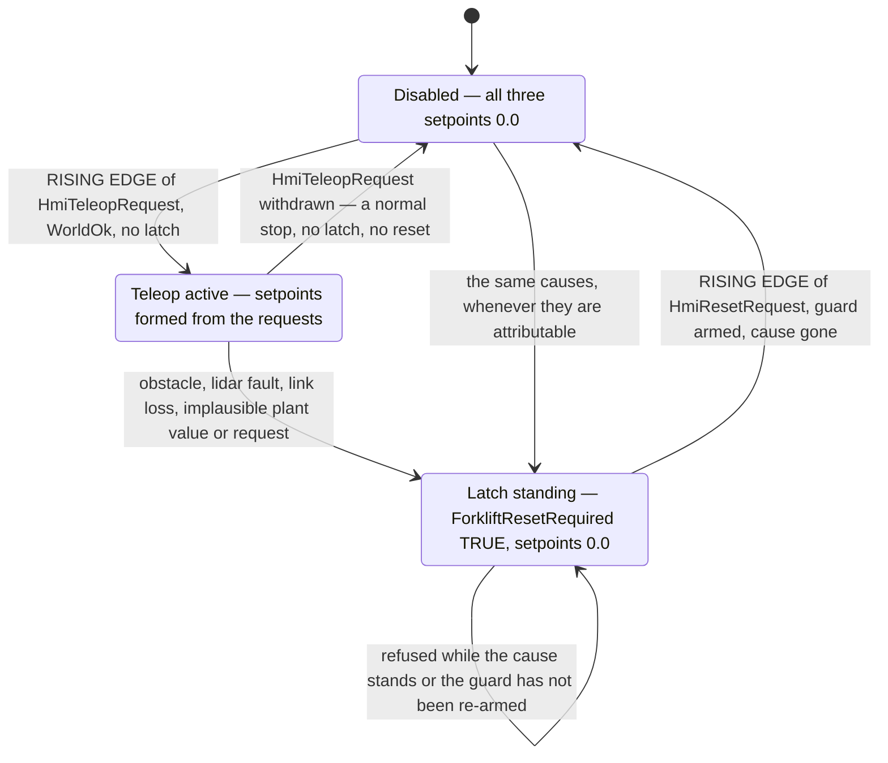

# Forklift commissioning cell — S7-1500 standard program specification (M4)

Gate M4, ADR 0008. This is the **implementation specification for the TIA Portal
program** the owner builds by hand, beside the M3 demonstration cell in the same
CPU. It is written for an experienced controls engineer sitting in front of the
software and is meant to be buildable without asking its author a question.

**Status: specification, not verification.** No part of this document has been
executed in TIA Portal or PLCSIM Advanced by its author, who has neither
installed. Every number below is a **design value to be confirmed at
commissioning**, every menu path is version-dependent and named so it can be
recognised rather than clicked blind, and nothing here is evidence for the gate.
The gate closes on the owner's run (§11) and on the recorded commissioning
showcase the roadmap's M4 row requires.

## Authority

| Document | What it fixes | Relation to this one |
|---|---|---|
| `docs/interfaces/opcua-nodes.md` §10 | The 18 nodes: names, types, units, ranges, plausibility windows, ownership, writability, start values, and the P1–P7 expectations on this document | **Contract.** If this document disagrees, §10 wins and this one is corrected |
| `docs/adr/0008-forklift-commissioning-gate-and-hmi-layer.md` | That teleop routing, the speed cap, the soft limits and the obstacle stop are **process logic in the standard program** and implement no SRS function | **Binding.** See §2 |
| `plc/demo-cell/SPEC.md` | `FB_DemoCellControl`, the four M3 DBs, `BridgeLinkOk` and `HEARTBEAT_STALE_TIME` | **Input, and unchanged by this document.** `BridgeLinkOk` is *consumed* here and owned there (§6.1) |
| `CLAUDE.md` §9 | Wire NC / program NO, cycle flag vs actuator, monitored edge reset, no auto-resume | **Binding.** §6 is its application |
| `docs/roadmap.md`, row M4 | Exit criteria (a)–(e) | §11 is one scenario per criterion |
| `agv/forklift/config.yaml`, `agv/forklift/model.sdf` | The plant: joint limits, vehicle-layer clamps, topic names | Input to the constants of §3.3 |

---

## 1. What the program does

One tricycle forklift plant in Gazebo — steered drive, a mast-driven fork, one
planar lidar — teleoperated from a local commissioning HMI. The HMI is an OPC UA
*client* that writes **requests**; the bridge is a second OPC UA client that
writes the plant's state and reads back the setpoints. The program:

- supervises the **HMI heartbeat** and forms `HmiLinkOk`, and **consumes**
  `BridgeLinkOk` from the M3 cell's function block,
- tests **every Real** that reaches it — three operator requests and three plant
  values — against its own plausibility window before any process comparison
  reads it,
- latches an **obstacle process stop** on the lidar's field-violation bit, and
  clears it only on a **monitored, edge-triggered reset**,
- caps the traction setpoint while the **fork is raised**,
- aborts fork motion **in the offending direction only** at each soft travel
  limit,
- forms all three actuator setpoints from a **teleop-active flag combined with
  interlocks**, each in exactly one statement with a mandatory `ELSE` to `0.0`.

**No command reaches the plant without passing through this logic** — that is the
gate's claim (ADR 0008 D1). None of it is in the bridge (ADR 0005 D1) and none of
it is in the HMI (ADR 0008 D2.2).

---

## 2. Boundary statement — read before anything else

> **Nothing in this program is a safety function.**
>
> The obstacle stop, the fork-height speed cap and the fork soft travel limits
> are **standard-program process interlocks**. They implement **no** function of
> `docs/safety/SRS.md`: not SF-02, not SF-03, not SF-04, not SF-07, not SF-09
> (ADR 0008 D3). No SIL or PL is claimed for any of them.
>
> The words "emergency" and "protective" appear in **no tag name, node name,
> topic name, code comment, watch-table entry, HMI text or recording** produced
> from this specification — the naming discipline `opcua-nodes.md` §10.1 sets and
> ADR 0004 set before it. Where the two words appear in this document at all,
> they appear only in statements of what this cell **does not have**, as they do
> in this section.
>
> Every node this program serves is process data. Safety never traverses the
> network (invariant 1). **This plant has no F-CPU, no safety-rated device and no
> onboard safety layer at all** — on real equipment the protective stop and safe
> torque off would be onboard and hardwired, and they do not exist here.
>
> Loss of either client link is a **degraded mode, not a safety event**
> (invariant 2).

The wire-NC/program-NO convention, the latching, the monitored reset and the
no-auto-resume rule are used here because they are correct engineering practice
for a stop of *any* class — not because they confer safety integrity. They do
not.

---

## 3. Tags

### 3.1 Server-visible tags — exactly the 18 nodes of `opcua-nodes.md` §10

The PLC symbol's leaf name **is** the OPC UA BrowseName, character for character,
so the two documents diff (CLAUDE.md §9). The DB name is a container, not part of
the BrowseName: the server interface (§4.3) places each tag under the folder path
below, so a client sees `Forklift/Hmi/HmiTractionRequest` regardless of which DB
holds it.

| # | BrowseName path (under the `DemoCell` interface) | PLC symbol | S7 type | Written by | Start value |
|---|---|---|---|---|---|
| 1 | `Forklift/Hmi/HmiTractionRequest` | `"ForkliftHmi".HmiTractionRequest` | Real | HMI | `0.0` |
| 2 | `Forklift/Hmi/HmiSteerRequest` | `"ForkliftHmi".HmiSteerRequest` | Real | HMI | `0.0` |
| 3 | `Forklift/Hmi/HmiForkRequest` | `"ForkliftHmi".HmiForkRequest` | Real | HMI | `0.0` |
| 4 | `Forklift/Hmi/HmiTeleopRequest` | `"ForkliftHmi".HmiTeleopRequest` | Bool | HMI | `FALSE` |
| 5 | `Forklift/Hmi/HmiResetRequest` | `"ForkliftHmi".HmiResetRequest` | Bool | HMI | `FALSE` |
| 6 | `Forklift/Input/ForkliftForkHeight` | `"ForkliftInput".ForkliftForkHeight` | Real | bridge | `0.0` |
| 7 | `Forklift/Input/ForkliftLinearSpeed` | `"ForkliftInput".ForkliftLinearSpeed` | Real | bridge | `0.0` |
| 8 | `Forklift/Input/ForkliftObstacleInStopZone` | `"ForkliftInput".ForkliftObstacleInStopZone` | Bool | bridge | **`TRUE`** |
| 9 | `Forklift/Input/ForkliftObstacleMinDistance` | `"ForkliftInput".ForkliftObstacleMinDistance` | Real | bridge | `0.0` |
| 10 | `Forklift/Output/ForkliftTractionSpeedRef` | `"ForkliftOutput".ForkliftTractionSpeedRef` | Real | **program** | `0.0` |
| 11 | `Forklift/Output/ForkliftSteerAngleRef` | `"ForkliftOutput".ForkliftSteerAngleRef` | Real | **program** | `0.0` |
| 12 | `Forklift/Output/ForkliftForkSpeedRef` | `"ForkliftOutput".ForkliftForkSpeedRef` | Real | **program** | `0.0` |
| 13 | `Forklift/Status/ForkliftTeleopActive` | `"ForkliftStatus".ForkliftTeleopActive` | Bool | program | `FALSE` |
| 14 | `Forklift/Status/ForkliftObstacleStopActive` | `"ForkliftStatus".ForkliftObstacleStopActive` | Bool | program | `FALSE` |
| 15 | `Forklift/Status/ForkliftSpeedLimitActive` | `"ForkliftStatus".ForkliftSpeedLimitActive` | Bool | program | `FALSE` |
| 16 | `Forklift/Status/ForkliftResetRequired` | `"ForkliftStatus".ForkliftResetRequired` | Bool | program | `FALSE` |
| 17 | `Forklift/Link/HmiHeartbeat` | `"ForkliftLink".HmiHeartbeat` | UInt | HMI | `0` |
| 18 | `Forklift/Link/HmiLinkOk` | `"ForkliftLink".HmiLinkOk` | Bool | program | `FALSE` |

> **`ForkliftObstacleInStopZone` starts `TRUE`, the one start value here that is
> not the type's zero, and that is deliberate** (`opcua-nodes.md` §10.9). Its
> polarity inverts the `…CircuitClosed` convention of the M3 panel: `TRUE` is the
> **non-permissive** state, and the vehicle layer publishes `TRUE` whenever the
> scan is invalid, non-finite or stale. The bridge may not invert a signal, so
> fail-safety is carried by the publisher's polarity, by this start value, and by
> the qualification rule below — not by the name. Anyone renaming this node must
> move the polarity of `/forklift/obstacle/in_stop_zone` with it, in the vehicle
> layer, in the same change.

> **`ForkliftObstacleMinDistance` starts `0.0`, which is *outside* its
> plausibility window on purpose.** `0.0` is the vehicle layer's no-data
> sentinel, so the affirmative window test of §6.2 reads it as a **transducer
> fault** at the same moment the field bit reads as an obstacle — two independent
> signals pointing the same, non-permissive way.

**The start values are the fail-safe pre-connection state, and the program never
reasons from them.** §6.1 qualifies every input with its link verdict instead.
That is the robust statement whichever restart type applies, and it is what the
M3 cell learned the hard way (`plc/demo-cell/SPEC.md` §6.1, LESSONS 2026-07-28).

**No other tag is server-visible.** No timer, latch, edge memory, constant or
guard is exported (`opcua-nodes.md` §10.11). Exposing them would invite a client
to act on them.

### 3.1b The one tag this program reads but does not own

| PLC symbol | S7 type | Owner | Why it is read here |
|---|---|---|---|
| `"DemoCellLink".BridgeLinkOk` | Bool | **`FB_DemoCellControl`** | One bridge session serves both function blocks, so there is **one** bridge heartbeat and **one** bridge-link verdict (`opcua-nodes.md` §10.1, §10.11). This FB **consumes** it as a shared DB bit and **never writes it**. Creating a second verdict here would give one value two owners (invariant 10) |

`FB_ForkliftTeleop` is called **after** `FB_DemoCellControl` in OB30 (§4.1), so
the value read here was formed in the same OB call, from the same scan's
heartbeat. Nothing else of the M3 cell is read, and nothing of it is written.

### 3.2 Internal tags — statics of `FB_ForkliftTeleop`, not on the server

All live in the instance DB `"ForkliftControl_DB"`.

| Symbol | Type | Start value | Purpose |
|---|---|---|---|
| `LastHmiHeartbeat` | UInt | `0` | Value of `HmiHeartbeat` at the previous OB call. Compared for **inequality** only — never subtracted, never tested for `+1`, never assumed monotonic across the wrap or across an HMI restart (`opcua-nodes.md` §10.8 P1, H4) |
| `HmiStaleTimer` | IEC_TIMER (TON) | — | Runs while the heartbeat is unchanged |
| `HmiSeenAlive` | Bool | `FALSE` | *The HMI heartbeat has been observed to change at least once since CPU start.* One-shot, set by the first inequality, never cleared while the CPU runs. It is the **first term** of `HmiLinkOk` and is what makes the verdict `FALSE` — rather than "not yet proven stale" — for the whole boot window (§6.1, P2, LESSONS 2026-07-28) |
| `TeleopEnableEdgeMemory` | Bool | **`TRUE`** | Previous state of `HmiTeleopRequest`, for the rising edge that enables teleop. Start value `TRUE` so an enable already asserted at the first scan produces **no** edge: an HMI that boots with the control held cannot start the machine |
| `ResetEdgeMemory` | Bool | **`TRUE`** | Previous state of `HmiResetRequest`, for the rising edge the reset acts on. Start value `TRUE` for the same reason and with the same effect: a reset already asserted at the first scan can never clear a latch |
| `ResetDeviceFault` | Bool | **`TRUE`** | *The reset request has not been observed `FALSE` **in the current HMI link session**.* Set `TRUE` whenever `HmiLinkOk` is `FALSE` — at CPU start and again at every HMI link loss — and cleared while `HmiLinkOk` is `TRUE` and `HmiResetRequest` reads `FALSE`. This is the **per-link-session arming guard** of `opcua-nodes.md` §10.8 P6. A **level** verdict about the present session, not a run-long latch: returning to `TRUE` after an outage is the mechanism working, not a device fault. It blocks the reset and nothing else |
| `ObstacleStopLatch` | Bool | `FALSE` | The lidar field read violated, or its diagnostic distance was implausible for longer than the delay. Mirrored to `ForkliftObstacleStopActive` |
| `HmiLinkLostLatch` | Bool | `FALSE` | `HmiLinkOk` was `FALSE` |
| `BridgeLinkLostLatch` | Bool | `FALSE` | `BridgeLinkOk` was `FALSE`. **Separate from the HMI latch** so the watch table names the link that died — two independent watchdogs on two independent clients, and neither substitutes for the other (P7) |
| `PlantInputFaultLatch` | Bool | `FALSE` | `ForkliftForkHeight` **or** `ForkliftLinearSpeed` implausible for longer than `PLANT_FAULT_DELAY`. One latch for both: they arrive from the same vehicle-layer publisher at the same rate, so there is nothing to tell apart at this level. Which one is bad is read off the raw values in the watch table (§9) |
| `RequestFaultLatch` | Bool | `FALSE` | Any of the three HMI Reals implausible for longer than `REQUEST_FAULT_DELAY`. An out-of-window request is a **broken client**, not a demand, and clamping it silently would hide exactly that (`opcua-nodes.md` §10.4) |
| `PlantInvalidTimer` | IEC_TIMER (TON) | — | Delay before implausible plant feedback becomes a latch |
| `LidarInvalidTimer` | IEC_TIMER (TON) | — | Delay before an implausible `ForkliftObstacleMinDistance` becomes a latch |
| `RequestInvalidTimer` | IEC_TIMER (TON) | — | Delay before an implausible HMI request becomes a latch |

**No tag in this program is declared Retain.** A restart must re-read the world
and decide where it is, not resume from stale state (CLAUDE.md §9). The latches
are level bits, so anything still true after a restart re-raises itself on the
first *qualified* scan — an obstacle still in the field re-latches, a link still
down re-latches.

**There is no held setpoint anywhere in this FB.** No `…Hold`, no last-known-good
substitution, no filter and no ramp on any of the three outputs. Every output is
recomputed from scratch on every OB call (§6.4).

### 3.3 Constants

Declared in the FB's constant block. Every one is a **process decision** that the
node model deliberately refused to make (`opcua-nodes.md` §10, repeatedly:
"interface expectation for the PLC specification"). Commissioning values, not
measurements.

| Constant | Value | Basis |
|---|---|---|
| `HMI_STALE_TIME` | `T#600ms` | `opcua-nodes.md` §10.8 **P3**: three worst-case HMI write periods at the 5 Hz contractual floor (200 ms). **The rule is three worst-case periods, not this number** — if the measured worst case at commissioning exceeds 200 ms, re-derive the constant from the measurement rather than reinterpreting the floor. **P4: it is its own constant and is never shared with the M3 cell's `HEARTBEAT_STALE_TIME` (`T#500ms`)** — the two watch different clients at different rates, and retuning one must not silently retune the other (invariant 10) |
| `TRACTION_SPEED_MAX` | `1.00` m/s | `opcua-nodes.md` §10.12 item 4: `ForkliftLinearSpeed`'s plausibility window must stay **at least twice** this cap, and the window is ±2.00 m/s, which bounds the cap at 1.00 m/s. **Raising the cap re-derives the window first**, in the interface document, and is not a change this specification may make. The vehicle layer's own `traction_speed_max_mps: 1.50` is a *different layer's* last-ditch clamp on a different value; because 1.00 < 1.50 the PLC never asks the plant for a speed its clamp would touch, which is the correct relationship |
| `TRACTION_SPEED_CAP_RAISED` | `0.30` m/s | Reduced traction speed while the fork is raised. Process decision; 30 % of the uncapped cap, large enough to be driveable and small enough that the reduction is unmistakable in the recording |
| `FORK_HEIGHT_SLOW_THRESHOLD` | `0.50` m | Carriage height above which the cap applies. Process decision, inside the 0.00…1.60 travel with clear room either side so the crossing is easy to drive to and easy to see |
| `FORK_SPEED_MAX` | `0.15` m/s | The full-scale fork jog speed. Matches `ForkliftForkSpeedRef`'s declared range of ±0.15 m/s (`opcua-nodes.md` §10.6) and the vehicle layer's `fork_speed_max_mps` |
| `STEER_ANGLE_MAX` | `1.31` rad | The plant's mechanical steer stop (`agv/forklift/config.yaml` `steer_limit_rad`), and `ForkliftSteerAngleRef`'s declared range. Used as the clamp on the steer request |
| `FORK_TRAVEL_MIN` / `FORK_TRAVEL_MAX` | `0.05` / `1.55` m | **Soft** travel limits, 0.05 m inside the model's 0.00/1.60 mechanical stops, so the program stops the carriage before the model does. One OB call of overtravel at `FORK_SPEED_MAX` is 0.003 m and one bridge round trip (~100 ms) is 0.015 m, so 0.05 m is ≈3× the worst latency-induced overshoot. **Deliberately different constants from the plausibility window below**, which is a statement about what the transducer can report |
| `FORK_HEIGHT_MIN` / `FORK_HEIGHT_MAX` | `-0.05` / `1.70` m | Plausibility window, `opcua-nodes.md` §10.5. Widened past **both** mechanical stops so a carriage resting **on** a stop is never called implausible — the `BELT_POSITION_MIN/MAX` reasoning of `plc/demo-cell/SPEC.md` §3.3 |
| `LINEAR_SPEED_MIN` / `LINEAR_SPEED_MAX` | `-2.00` / `+2.00` m/s | Plausibility window, `opcua-nodes.md` §10.5. A statement about what the odometry can report, **not** a process cap — the cap is `TRACTION_SPEED_MAX` and is a different decision in a different layer |
| `OBSTACLE_DISTANCE_MIN` / `OBSTACLE_DISTANCE_MAX` | `0.05` / `8.10` m | Plausibility window, `opcua-nodes.md` §10.5, widened past the 0.10…8.00 m sensor window. The vehicle layer's `0.0` no-data sentinel falls outside it and therefore reads as a fault |
| `TRACTION_REQUEST_MIN` / `TRACTION_REQUEST_MAX` | `-1.05` / `+1.05` | Plausibility window on the traction fraction, `opcua-nodes.md` §10.4. Wider than the ±1.00 engineering range by the `float64 → Real` narrowing margin, so a legitimate ±1.0 never reads as a fault |
| `FORK_REQUEST_MIN` / `FORK_REQUEST_MAX` | `-1.05` / `+1.05` | Same window on the fork fraction. **Its own constant pair** even though the numbers coincide with the traction pair, for the reason P4 gives: retuning one must not silently retune the other |
| `STEER_REQUEST_MIN` / `STEER_REQUEST_MAX` | `-1.35` / `+1.35` rad | Plausibility window on the steer request, `opcua-nodes.md` §10.4, wider than the ±1.31 rad mechanical range by the same margin |
| `TRACTION_REQUEST_CLAMP` | `1.00` | The traction fraction's **engineering range**, and the clamp target. A request of, say, 1.03 is *plausible* (inside the window) and is clamped to 1.00; a request of 1.20 is *implausible* and is a fault. The window and the clamp are two different decisions and must not be conflated |
| `FORK_REQUEST_CLAMP` | `1.00` | The fork fraction's engineering range and clamp target. Its own constant, same reasoning |
| `PLANT_FAULT_DELAY` | `T#300ms` | Three source periods: the vehicle layer publishes `fork_height` and `linear_speed` at 10 Hz. Tolerates two corrupt or dropped samples without latching |
| `LIDAR_FAULT_DELAY` | `T#300ms` | Same basis, same rate, **its own constant** so the lidar's tolerance and the drive feedback's tolerance can be tuned apart (invariant 10, the `BELT_FAULT_DELAY` precedent) |
| `REQUEST_FAULT_DELAY` | `T#600ms` | Three worst-case HMI write periods at the 5 Hz floor — the same rule as `HMI_STALE_TIME`, and again its own constant. An implausible request drops the motion permissive **immediately** through `WorldOk`; this delay only governs when it becomes a *latch* |

---

## 4. Blocks, DBs and the server interface

### 4.1 Block structure

```
OB30  Cyclic interrupt, 20 ms          -- the only place cell logic runs
  ├── FB_DemoCellControl / "DemoCellControl_DB"      (M3, unchanged)
  │       writes "DemoCellLink".BridgeLinkOk
  └── FB_ForkliftTeleop  / "ForkliftControl_DB"      (this document)
          reads   "ForkliftHmi".*      "ForkliftInput".*
                  "ForkliftLink".HmiHeartbeat
                  "DemoCellLink".BridgeLinkOk        -- CONSUMED, never written
          writes  "ForkliftOutput".*   "ForkliftStatus".*
                  "ForkliftLink".HmiLinkOk

OB1   Main                              -- still contains nothing
```

| Decision | Why |
|---|---|
| **Called after `FB_DemoCellControl`, in the same OB** | `BridgeLinkOk` is formed by the M3 FB from the same scan's heartbeat, so calling this FB second means it reads a verdict that is one call old at most — not one *scan* old. Calling it first would use last scan's verdict for every plant-input qualification |
| One cyclic interrupt OB, not OB1 | Every timer in both programs shares one deterministic time base. OB1's period varies with load, which would make `HMI_STALE_TIME` mean different things on different days |
| 20 ms, unchanged from M3 | The bridge writes at 50 ms (20 Hz) and the HMI at 100 ms nominal, so 20 ms gives at least two OB calls per bridge write and five per HMI cycle. **The OB now carries two FBs**: measure the OB30 cycle time and the CPU maximum cycle time after the download and record them (§12 open item 9) |
| One FB, one instance, no second instance | Every output and status tag has exactly one writer in exactly one statement (invariant 10, ADR 0008 consequences). This FB is instanced **once** |
| No hard real-time claim | Nothing here is a deterministic timing requirement in the sense of invariant 9. The invariant is satisfied by the logic being in the PLC at all rather than in Python |

> **`FB_ForkliftTeleop` / `"ForkliftControl_DB"` do not match the way
> `FB_DemoCellControl` / `"DemoCellControl_DB"` do, and that is on purpose.** The
> FB name is this layer's to choose (ADR 0008 D3) and is taken from the brief;
> the **instance DB name is tabulated in `opcua-nodes.md` §10.3** with its access
> rights, so that is the name used. The DB is marked *Accessible from HMI/OPC UA*
> ✘, so it is never on the server, carries no BrowseName and nothing outside the
> CPU depends on the pairing.

### 4.2 Global DBs and access rights

**Five new global DBs, one per node-model folder. The four M3 DBs are not
extended** (`opcua-nodes.md` §10.3): adding members to `DemoCellInput` and its
siblings would move the offsets of tags that current M3 evidence, watch tables
and test records depend on, and a download that leaves project and CPU
inconsistent shows up as monitoring errors on exactly the rows whose offsets
moved (LESSONS 2026-07-28). Separate DBs leave the M3 cell byte-identical.

Optimized block access (the S7-1500 default) throughout: the server interface
addresses tags symbolically, so no absolute address is needed anywhere.

| DB | Contents | *Accessible from HMI/OPC UA* | *Writable from HMI/OPC UA* |
|---|---|---|---|
| `ForkliftHmi` | tags 1–5 | ✔ | **✔** (all five) |
| `ForkliftInput` | tags 6–9 | ✔ | **✔** (all four) |
| `ForkliftOutput` | tags 10–12 | ✔ | **✘** |
| `ForkliftStatus` | tags 13–16 | ✔ | **✘** |
| `ForkliftLink` | `HmiHeartbeat` ✔/**✔**, `HmiLinkOk` ✔/**✘** | ✔ | per tag |
| `ForkliftControl_DB` (instance) | §3.2 internals | **✘** | ✘ |

> The *Writable* column is where the direction rules are **enforced by the server
> rather than by convention**: with `ForkliftOutput` not writable, a defect in
> *either* client that tried to write an actuator setpoint is refused by the CPU.
> Each client also enforces its own allowlist, which is the same
> two-independent-enforcements arrangement the M3 cell uses.
>
> **Per-*client* scoping is not enforced**, and with two writing clients that gap
> is materially wider than it was with one. The commissioned CPU runs with access
> control disabled and security `None` (`opcua-nodes.md` §9.10), so "only the HMI
> writes the `Hmi` group and only the bridge writes the `Input` group" is
> **policy, not enforcement** (ADR 0008 D2.5). Closing it is OPC UA access
> control, carried as `opcua-nodes.md` §10.12 item 6 and **not** a change to this
> program.

### 4.3 Server interface — `DemoCell` is extended, not replaced

**Ruling, from `opcua-nodes.md` §10.2: the forklift nodes are added to the
existing `DemoCell` server interface as a `Forklift/` subtree beside the four M3
folders. No second server interface is created, and the existing one is not
renamed.**

The interface name **is** the namespace URI — TIA derives it as
`http://<interface name>` and the field is not editable (ADR 0006) — so renaming
`DemoCell` would break every browse-by-URI at connect, for the bridge and now for
the HMI as well. Adding folders and tags does not touch the name, so
`http://DemoCell` does not move and every existing browse path keeps working.

The honest consequence, stated rather than discovered: **`DemoCell` is now an
identifier, not a description.** One interface carries the demonstration cell and
the forklift commissioning cell.

Build the tree exactly as below and drag each DB tag into it. **Rename nothing**:
each leaf name must remain the BrowseName of §3.1.

```
DemoCell/                                       ns http://DemoCell, unchanged
  Input/ Output/ Status/ Link/                  the M3 cell, byte-identical
  Forklift/
    Hmi/       HmiTractionRequest  HmiSteerRequest  HmiForkRequest
               HmiTeleopRequest  HmiResetRequest
    Input/     ForkliftForkHeight  ForkliftLinearSpeed
               ForkliftObstacleInStopZone  ForkliftObstacleMinDistance
    Output/    ForkliftTractionSpeedRef  ForkliftSteerAngleRef
               ForkliftForkSpeedRef
    Status/    ForkliftTeleopActive  ForkliftObstacleStopActive
               ForkliftSpeedLimitActive  ForkliftResetRequired
    Link/      HmiHeartbeat  HmiLinkOk
```

Full browse paths start at the interface node, which is **not** a child of
`Objects`: `Forklift/Hmi/HmiTractionRequest` is
`Objects/ServerInterfaces/DemoCell/Forklift/Hmi/HmiTractionRequest`, with
`ServerInterfaces` in the Siemens namespace and everything from `DemoCell` down
in `http://DemoCell` (`opcua-nodes.md` §2.1). A client resolves **two** namespace
indices by URI at connect and hardcodes neither.

---

## 5. Mode and state

There is **no sequencer here.** The M3 cell runs a transport cycle; this cell is
teleoperated, so the machine state is a single enable — `ForkliftTeleopActive` —
and the operator is the sequence.



`ForkliftTeleopActive` is **this cell's cycle-running flag** in the sense of
CLAUDE.md §9: it says *the machine is enabled*, and it says nothing about what any
actuator is doing. Whether the operator's requests reach the plant is decided
separately, in §6.4.

**The only path out of `Latched` is a monitored reset, and the only path from
`Disabled` to `Active` is a fresh rising edge of the enable.** A reset energizes
nothing.

---

## 6. Control logic, in words

Order of execution inside the FB matters and is stated per subsection. The whole
FB is written so that **every output is assigned on every call**, in both branches
of every decision.

### 6.1 First: link supervision and input qualification

```
-- HMI link, owned here
IF HmiHeartbeat <> LastHmiHeartbeat THEN  reset the stale timer
                                          and latch HmiSeenAlive
ELSE                                      run the stale timer
LastHmiHeartbeat := HmiHeartbeat          -- after the comparison
HmiLinkOk := HmiSeenAlive AND NOT HmiStaleTimer.Q

-- Bridge link, owned by FB_DemoCellControl
bridgeLinkOk := "DemoCellLink".BridgeLinkOk     -- read only, never written here
```

**Inequality only** (P1). Never `HmiHeartbeat - LastHmiHeartbeat`, never a test
for `+1`: the counter is `UInt16`, it wraps, and it restarts from an arbitrary
value at every HMI restart (H4). Any *change* is liveness.

**Two terms, and the first one is the one that is easy to forget.** `NOT
HmiStaleTimer.Q` alone reads *"the heartbeat has not yet been proven stale"*,
which at CPU start is not the same statement as *"the heartbeat is alive"*: at
the first scan `HmiHeartbeat` and `LastHmiHeartbeat` are both `0`, the TON begins
counting, and a verdict formed from that term alone reads **`TRUE` for the first
600 ms of every CPU run**, before a single operator input has arrived.
`HmiSeenAlive` makes the boot polarity pessimistic: **`HmiLinkOk` is `FALSE` from
the first scan and stays `FALSE` until the heartbeat has actually moved.** "Not
yet proven stale" is not "alive", and every guard that rides on link-up inherits
this polarity (P2, ADR 0008 D2.3, LESSONS 2026-07-28).

`BridgeLinkOk` already carries the same correction in `FB_DemoCellControl`
(`plc/demo-cell/SPEC.md` §6.1), which is a second reason not to recompute it
here: the fix would have to be maintained twice.

**A first heartbeat write equal to the start value is invisible for exactly one
HMI cycle.** The counter is arbitrary at HMI start; if its first written value
happens to be `0`, the inequality sees no change until the next cycle. The
verdict is then late by one HMI cycle — never wrong in direction.

> **The qualification rule, stated once and applied everywhere below**
> (`opcua-nodes.md` §10.9).
> While `BridgeLinkOk` is `FALSE`, the four `Forklift/Input/` values are **not
> attributable to the plant**. While `HmiLinkOk` is `FALSE`, the five
> `Forklift/Hmi/` values are **not attributable to an operator**. Therefore **no
> verdict derived from either group is evaluated, and no fault from either group
> is latched, while its link verdict is `FALSE`.** Start values are the last
> line, not the first: the boot polarity above is what actually prevents a
> freshly started CPU from acting on them.

Both link verdicts latch on loss:

```
IF NOT hmiLinkOk    THEN HmiLinkLostLatch    := TRUE;
IF NOT bridgeLinkOk THEN BridgeLinkLostLatch := TRUE;
```

so a returning heartbeat — of either client — never by itself restores teleop
(P5). **Both latches are therefore set at the first scan of every CPU run**, and
`ForkliftResetRequired` reads `TRUE` from power-up. That is intended: a fresh CPU
requires a monitored reset before the machine can be enabled, and any link-up
preceded by a scan with that link down is reached with a latch already pending.

**Consistency caveat.** The server samples the DBs asynchronously from the
program, and the HMI's write ordering guarantee — heartbeat written last (H3) —
is an *ordering* guarantee, not atomicity. **No logic here requires two HMI tags
to have come from the same cycle**, and none may be added.

### 6.2 Plausibility, in affirmative form — all six Reals, none exempted

**Six Reals reach this program.** Three are written by the HMI, three by the
bridge. **Every one of them is tested against its own window before any process
comparison consumes it**, and the fault is taken in the `ELSE` of an affirmative
test:

```
valid := (LOW < x) AND (x < HIGH)          -- fault is the ELSE of this
```

**Never invert this into `NOT (x < LOW OR x > HIGH)`.** `NaN` and `inf` make
*every* comparison false: in the affirmative form they land in the fault branch,
which is where they belong; in the inverted form they read as *valid* and a dead
transducer is passed downstream as a measurement (LESSONS 2026-07-27, and the
half-fix of 2026-07-28 that this sweep exists to avoid repeating). `IS_VALID(x)`
may be `AND`ed in as documentation of intent — it is redundant **only** because
the test is affirmative, and for no other reason.

| Value | Window constants | Verdict | On failure |
|---|---|---|---|
| `ForkliftForkHeight` | `FORK_HEIGHT_MIN/MAX` | `heightValid` | drops `WorldOk`; latches `PlantInputFaultLatch` after `PLANT_FAULT_DELAY`; **and** forces `forkRaised` (§6.5) and blocks fork motion in **both** directions (§6.6) |
| `ForkliftLinearSpeed` | `LINEAR_SPEED_MIN/MAX` | `speedValid` | drops `WorldOk`; same latch |
| `ForkliftObstacleMinDistance` | `OBSTACLE_DISTANCE_MIN/MAX` | `distanceValid` | drops `WorldOk`; sets `ObstacleStopLatch` after `LIDAR_FAULT_DELAY` (§6.7) |
| `HmiTractionRequest` | `TRACTION_REQUEST_MIN/MAX` | `requestsValid` | drops `WorldOk`; latches `RequestFaultLatch` after `REQUEST_FAULT_DELAY` |
| `HmiSteerRequest` | `STEER_REQUEST_MIN/MAX` | `requestsValid` | as above |
| `HmiForkRequest` | `FORK_REQUEST_MIN/MAX` | `requestsValid` | as above |

Each verdict is conjoined with its own link verdict, so an unattributable value
is never called implausible and never latched — it is simply not evaluated.

**The window and the clamp are different decisions.** A request inside its window
but outside its engineering range is a legitimate ±1.0 that narrowed upward
through `float64 → Real`; it is **clamped** to the engineering range with `LIMIT`
(§6.4). A request outside the window is a **broken client** and is a fault.
Silently clamping the second case would hide exactly what it is there to reveal
(`opcua-nodes.md` §10.4).

**`ForkliftObstacleMinDistance` is tested for health, never thresholded.** The
lidar's field verdict belongs to the device and arrives as
`ForkliftObstacleInStopZone`; forming a second "obstacle present" in the PLC from
the distance would create a second owner for one value (invariant 10,
`opcua-nodes.md` §10.5). **No comparison of `ForkliftObstacleMinDistance` against
any stop distance appears anywhere in this program.** Its window test is a
statement about the transducer, and the vehicle layer's `0.0` no-data sentinel
falls outside that window precisely so that "no data" reads as a fault at the
same moment the field bit reads as an obstacle.

**`ForkliftLinearSpeed` is read, qualified, and otherwise unused.** It feeds no
verdict: there is no traction drive-fault detection in this program, because no
node exists to carry one and inventing the verdict without the node was
explicitly declined (`opcua-nodes.md` §10.11, §10.12 item 3). See §8 and §12.

### 6.3 The teleop-active flag and the two sets

Machine state and actuator command are separate layers (CLAUDE.md §9).
`ForkliftTeleopActive` says *the machine is enabled*. It says nothing about what
any actuator is doing.

**`WorldOk`** — the live conditions, all must be `TRUE`:

| # | Condition | Reads as |
|---|---|---|
| C1 | `BridgeLinkOk` | The plant image is attributable: the bridge heartbeat has been **seen to change** and has not since gone stale. `FALSE` from the first scan of every CPU run |
| C2 | `HmiLinkOk` | The operator is present, by the same boot polarity (§6.1). **Both are required and neither substitutes for the other** (P7) |
| C3 | `NOT ForkliftObstacleInStopZone` | The forward field reads clear **right now**. The device's verdict, not a PLC threshold |
| C4 | `heightValid AND speedValid` | Both plant Reals are inside their physical windows right now |
| C5 | `distanceValid` | The lidar's diagnostic distance is a measurement right now |
| C6 | `requestsValid` | All three operator Reals are inside their windows right now |

Then:

| Set | Definition | Used for |
|---|---|---|
| `latchPending` | `ObstacleStopLatch` OR `HmiLinkLostLatch` OR `BridgeLinkLostLatch` OR `PlantInputFaultLatch` OR `RequestFaultLatch` | Mirrored to `ForkliftResetRequired`; blocks the enable edge |
| `MotionPermissive` | `WorldOk` **and** `NOT latchPending` | May the machine move, and may the setpoints pass (§6.4) |
| `CauseGone` | `WorldOk` **only** | May a reset clear the latches (§6.7) |

Why the two differ, and it is the whole reason a reset is possible at all:

- **The latches are not in `CauseGone`.** The reset tests `CauseGone`, so putting
  the latches there would make each latch its own precondition for clearing and
  no reset could ever fire (LESSONS 2026-07-27).
- **`CauseGone` is exactly `WorldOk` here**, with no separate instantaneous-versus-
  delayed pair to subtract. C3–C6 *are* the instantaneous terms; their delayed
  forms are the latches, and those are excluded by construction.

**The fork soft limits are absent from both sets, and that is the point.** A
carriage sitting on a limit can only leave it by moving, so a blanket "fork
inside its limits" permissive would strand it: you cannot come off the limit
without moving, and you could not move while the limit was violated. The limits
abort fork motion **in the offending direction only** (§6.6), which is a
step-level refusal, not a permissive (LESSONS 2026-07-27).

**C4 and C5 *are* blanket permissives, and the difference is what clears them.**
An implausible reading is escaped by the *signal* becoming a number again — the
machine need not move, and indeed must not. Both windows are set wider than the
transducer's physical range, so a machine parked anywhere it can physically be
still reads plausible. **Never tighten either window towards a process limit.**

Transitions:

- `ForkliftTeleopActive` is set **only** by a **rising edge** of
  `HmiTeleopRequest` with `MotionPermissive` true and no latch pending.
- It is cleared by `HmiTeleopRequest` going false, by any permissive going false,
  and by any latch — immediately, in the same OB call.
- Losing C1 sets `BridgeLinkLostLatch`; losing C2 sets `HmiLinkLostLatch`; losing
  C3, or losing C5 for `LIDAR_FAULT_DELAY`, sets `ObstacleStopLatch`; losing C4
  for `PLANT_FAULT_DELAY` sets `PlantInputFaultLatch`; losing C6 for
  `REQUEST_FAULT_DELAY` sets `RequestFaultLatch`. The delayed ones drop the
  machine immediately through `WorldOk` and latch a moment later, so a single
  corrupt sample stops the machine **without** requiring a reset — it still
  requires a fresh enable edge, because nothing auto-resumes.
- **Withdrawing the enable is a normal stop.** It sets no latch, requires no
  reset, and the machine is re-enabled by asserting the control again. That is
  the operator letting go of the controls, not a fault.

Never drive an actuator from a sensor: no plant value and no operator request
reaches an output tag except through `ForkliftTeleopActive` combined with
`MotionPermissive`.

### 6.4 The three setpoints are **gated**, not switched — the thing to get right

Each of `ForkliftTractionSpeedRef`, `ForkliftSteerAngleRef` and
`ForkliftForkSpeedRef` is a **Real setpoint**, not a coil. The domain rule still
applies — actuator outputs are formed from the enable flag combined with
interlocks — but for an analogue value the mechanism is **driving the value to
zero**, not de-energising an output:

```
IF ForkliftTeleopActive AND MotionPermissive THEN
    ForkliftTractionSpeedRef := tractionDemand * speedCap;
ELSE
    ForkliftTractionSpeedRef := 0.0;              // ACTIVELY zeroed
END_IF;
```

Rules, all of them load-bearing:

1. **The `ELSE` branch is mandatory and unconditional.** A conditional write with
   no `ELSE` leaves a Real holding its last value, and the bridge would keep
   republishing that value to the plant: the machine would keep driving after the
   stop. This is the failure mode this section exists to prevent (LESSONS
   2026-07-27, `plc/demo-cell/SPEC.md` §6.4, ADR 0008 D2.3).
2. **One writer, one statement, three times.** Each of the three output tags is
   assigned in exactly one `IF … ELSE` construct in the whole project, executed
   unconditionally on every OB call, as the last action of the FB. Never inside a
   branch that can be skipped, never twice, never from a client (§4.2).
3. **The requests are inputs, not outputs.** The operator's numbers are clamped
   and scaled into internal values; the assignment above is where the interlocks
   live.
4. **The zero is written even when a link is down.** The PLC always commands what
   it means. Whether the command reaches the plant is the transport's problem,
   and during an outage it does not — see §8, residual.
5. **Do not implement any of this as a bit.** A "teleop run" coil or a run/stop
   bit beside a setpoint is a wrong implementation. The node model deliberately
   provides three signed analogue values and nothing else: sign carries
   direction, magnitude carries rate, `0.0` is stop or hold.

#### The steer setpoint — ruled, and the ruling is what is built here

`ForkliftSteerAngleRef` takes **the same mandatory `ELSE` to `0.0`** as the other
two. This was the one open question in the first revision of this document: an
earlier `opcua-nodes.md` §10.6 exempted steering in its table row while its own
gating paragraph required the zero, and this specification implemented the zero
and raised the contradiction rather than choosing quietly.

**`opcua-nodes.md` §10.6 now carries the ruling and the exemption is withdrawn**
(commit `ae93667`, 2026-07-29): *"all three setpoints, the steer angle included,
take `0.0` in the interlock-failed `ELSE`"*, and the table row is rewritten to
say the steer angle is "gated to `0.0` by the interlocks of §10.7 **exactly as
the other two are**". §10.8 P5 is rewritten with it — "every motion setpoint" is
explicitly *not* the test, because a steer angle is arguably not a motion and
that reading is what invited the exemption. **The ruling ratifies what this
document already specified: no statement, constant, tag or start value changed on
either side.**

The three grounds it decides on are the three this section argued: a hold needs
stored state and the zero needs none, one rule across three analogue outputs is
what survives being read in a hurry, and what the exemption was protecting
against does not occur — all three assignments execute in the same call, so the
wheel is re-aimed on a machine whose traction setpoint has already gone to `0.0`.
**The steer joint moves; the machine does not.**

**The visible consequence, stated so it is not a surprise on the recording: the
steered wheel returns to centre while the machine is stopping.** It appears in
every stop scenario of §11 and it is not a defect.

**Were it ever ruled back**, the change is one branch: declare a static
`SteerAngleHold : Real := 0.0`, assign it inside the permissive branch, and put
`SteerAngleHold` in the `ELSE` instead of `0.0`. Nothing else moves, on either
side — no node, count, access right or start value.

### 6.5 The fork-height speed cap

```
forkRaised := (NOT heightValid) OR (ForkliftForkHeight > FORK_HEIGHT_SLOW_THRESHOLD)

speedCap   := TRACTION_SPEED_CAP_RAISED   if forkRaised
              TRACTION_SPEED_MAX          otherwise

ForkliftSpeedLimitActive := ForkliftTeleopActive AND forkRaised
```

**The `(NOT heightValid) OR …` is the load-bearing half.** Written the obvious
way — `forkRaised := height > threshold` — a `NaN` height makes the comparison
false, so a broken transducer reads as *not raised* and the machine gets the
**full** speed cap. That is the permissive direction on a fault, which is exactly
the failure the analogue-validity lesson exists to prevent. Treating an
implausible height as *raised* is the restrictive direction, and it is the one
the brief and this document require.

**The cap limits; it does not command.** With the fork raised and a demand of
0.2, the setpoint is 0.20 m/s, not 0.30 m/s.

**`ForkliftSpeedLimitActive` reads "the cap is in force", not "the cap is
biting".** It is `TRUE` whenever teleop is active and the carriage is raised, and
it does not flicker with the operator's control. `opcua-nodes.md` §10.7 describes
it as "the carriage is raised past the cap's height **and** the traction setpoint
is being limited below what the operator asked for", which could be read as the
narrower verdict; the wider reading is implemented because it is the one that is
useful on a display and stable in a recording. The alternative is one conjunct:
`AND (ABS(tractionDemand) * TRACTION_SPEED_MAX > TRACTION_SPEED_CAP_RAISED)`.

### 6.6 The fork soft travel limits — direction-scoped aborts

```
raiseBlocked := (NOT heightValid) OR (ForkliftForkHeight >= FORK_TRAVEL_MAX)
lowerBlocked := (NOT heightValid) OR (ForkliftForkHeight <= FORK_TRAVEL_MIN)

forkDemandAllowed := (forkDemand > 0.0 AND NOT raiseBlocked)
                  OR (forkDemand < 0.0 AND NOT lowerBlocked)
```

- **Never a blanket permissive.** A carriage at 1.55 m may still be lowered; a
  carriage at 0.03 m may still be raised. Making "inside the limits" a run
  permissive would strand the carriage on whichever limit it reached, because
  leaving a limit requires moving and moving would be blocked (LESSONS
  2026-07-27, and `plc/demo-cell/SPEC.md` §6.3 for the belt that taught it).
- **An implausible height blocks both directions**, which is the "inhibit fork
  motion" half of the same defensive form as §6.5. It is not a deadlock: the
  height signal recovers by *becoming a number again*, which needs no motion.
- **A soft-limit abort sets no latch and requires no reset.** It is a refusal of
  one direction while the condition holds, and it clears itself the moment the
  carriage is off the limit.
- **`forkDemand = 0.0` is not "allowed"**, so it falls to the `ELSE` and the
  setpoint is `0.0`. Same value, one branch.

**Expect the lower abort to be active at rest.** The mast's mechanical bottom is
0.00 m and `FORK_TRAVEL_MIN` is 0.05 m, so a parked carriage sits **below** the
soft limit and only raising is permitted. That is the correct reading of a
direction-scoped abort, it is visible from the first scan of every run, and it is
step 5.2.1 of the test procedure rather than a surprise.

### 6.7 The obstacle latch, the monitored reset, and no auto-resume

**The obstacle latch.**

```
IF bridgeLinkOk AND (ForkliftObstacleInStopZone OR LidarInvalidTimer.Q) THEN
    ObstacleStopLatch := TRUE;               -- PROCESS stop. Not a safety function.
END_IF;
ForkliftObstacleStopActive := ObstacleStopLatch;
```

- The field bit sets the latch **immediately, on level** — no delay, no debounce.
  A delay on an obstacle would be a filter that changes meaning.
- The lidar's diagnostic distance sets **the same latch** after
  `LIDAR_FAULT_DELAY`, because "the forward path is not known to be clear" is one
  condition however it is learned. Which of the two fired is read off
  `ForkliftObstacleInStopZone` and `ForkliftObstacleMinDistance` in the watch
  table — the M3 cell's one-latch-one-diagnosis-from-the-raw-values pattern
  (`plc/demo-cell/SPEC.md` §6.2.2).
- **The `bridgeLinkOk` conjunct is what keeps this out of the boot window.** The
  node's start value is `TRUE`, so without it a cold-started CPU would latch an
  obstacle stop from a value no lidar produced. With it, the cold-start signature
  is `ForkliftObstacleStopActive` **`FALSE`** and `BridgeLinkLostLatch` set — the
  program gives the true reason, the link, rather than accusing a sensor.
- **The field clearing does not release the latch.** This machine does not resume
  by itself (CLAUDE.md §9, `opcua-nodes.md` §10.7).

**The reset device.** `HmiResetRequest` is a level carrying the operator's action;
the PLC acts on its **rising edge**.

| Action | Device and edge | Condition | Effect |
|---|---|---|---|
| **Reset** | **rising** edge of `HmiResetRequest` | a latch is pending **and** `CauseGone` **and** `NOT ResetDeviceFault` | Clear all five latches, `ForkliftResetRequired := FALSE`. **Nothing energizes**: `ForkliftTeleopActive` stays `FALSE` and all three setpoints stay `0.0` |
| **Enable** | **rising** edge of `HmiTeleopRequest` | no latch pending **and** `MotionPermissive` | `ForkliftTeleopActive := TRUE` |

Monitoring, per CLAUDE.md §9 ("the reset is edge triggered so a stuck button does
not count as a reset"):

- **The rising edge is the whole mechanism.** `ResetEdgeMemory` starts `TRUE`, so
  a request already asserted at the first scan produces no edge at all. A held or
  stuck reset therefore never resets — not after one second, not after an hour —
  and a reset held down across a later stop cannot clear that stop's latch
  either, because the edge happened before the latch did.
- **`ResetDeviceFault` is armed per HMI link session** (`opcua-nodes.md` §10.8
  **P6**). It is `TRUE` — *the request has not been observed `FALSE` in this
  session* — whenever `HmiLinkOk` is `FALSE`, and it clears while the link is up
  and `HmiResetRequest` reads `FALSE`.

  **Why per-session and not once per program run.** The edge memory is what makes
  a stuck request harmless at the first scan of a *CPU* run. It does nothing at a
  **link-up**, which is the other boundary at which the program starts believing
  the request: during an outage the value freezes, typically at `FALSE`, so
  `ResetEdgeMemory` sits at `FALSE` and the first attributable `TRUE` is a
  genuine rising edge. A guard cleared once and kept clear for the whole run
  would let that edge through, and a reset held across an HMI restart would clear
  every latch the moment the link formed — the automatic resume CLAUDE.md §9
  forbids, and the exact failure the M3 cell recorded on 2026-07-28. **A guard
  scoped per session is tested by ending a session, not by restarting the
  machine** (LESSONS 2026-07-28) — which is why §11 tests it at 5.5.5 and not at
  a CPU start.

  **In normal operation the re-arm costs nothing.** The HMI writes **all six** of
  its nodes every cycle rather than on change (`opcua-nodes.md` §10.4, H1), so at
  a normal link-up the reset node already carries a real `FALSE` and the guard
  clears within one OB call. The re-arm bites only when the request is genuinely
  asserted at link-up, which is the case it exists for.

  **And it is stronger here than at M3.** The M3 guard's guarantee is conditional
  on a write-on-change bridge repairing a reverted input image; the HMI's
  every-cycle stream has no stale level to repair, so the hole recorded as
  `plc/demo-cell/SPEC.md` §12 item 7 **does not exist on the `Forklift/Hmi/`
  group**. It still exists on the `Forklift/Input/` group, which the bridge
  writes.
- **The reset is qualified by the link** like every other input: the condition
  contains `CauseGone`, which contains both link verdicts, so a reset cannot be
  honoured from a frozen or start-value image.
- **A reset attempted while a cause is still present is ignored**; the latch
  stays and `ForkliftResetRequired` stays `TRUE`. Release the control and assert
  it again once the cause is gone.
- **Evaluate the reset before the enable within the OB**, and note the
  consequence: `latchPending` is computed **once**, ahead of both, so an enable
  edge arriving in the *same* 20 ms call as a reset still sees the latch and is
  refused. `ForkliftResetRequired` therefore reads `TRUE` for one further OB call
  after the clearing reset, and `ForkliftObstacleStopActive` likewise. The two
  actions cannot be collapsed into one.

**No auto-resume, by construction — and the one conflation this cell carries.**

Nothing sets `ForkliftTeleopActive` except a rising edge of `HmiTeleopRequest`.
No returning signal — heartbeat, clearing field, recovering transducer,
reconnecting session — sets it. A permissive returning restores the *permission*,
never the *motion*.

> **The conflation, written out rather than left to be discovered.** The M3 cell
> has two devices: a reset button that clears latches and a **separate** start
> button that energizes. This cell has no start request node — `opcua-nodes.md`
> §10.4 defines five HMI requests and none of them is a start — so
> **`HmiTeleopRequest` doubles as the enable and as the post-reset start
> action**. The operator's sequence after a latch is therefore: *release the
> enable, press reset, then assert the enable again.* An enable left asserted
> through the reset produces no edge and the machine stays stopped, which is the
> behaviour CLAUDE.md §9 requires and is demonstrated at 5.4.8 and 5.4.9.
>
> This follows the rule the M3 cell established for exactly this situation: when
> a gate mandates a CLAUDE.md §9 behaviour and the signal table has no device for
> it, implement the behaviour on an existing device, state the conflation, and
> **request the missing device rather than inventing a tag** (LESSONS
> 2026-07-27). A separate `HmiStartRequest` node is requested in the report for
> this brief; it is an interface decision and is not taken here.

---

## 7. SCL sketch

Structure and the load-bearing statements only. Not compilable as written:
declarations, timer instances and the constant block are per §3. Identifiers not
listed in §3.2 — `#hmiHbChanged`, `#hmiLinkOk`, `#bridgeLinkOk`, `#heightValid`,
`#speedValid`, `#plantInputsValid`, `#distanceValid`, `#requestsValid`,
`#forkRaised`, `#speedCap`, `#tractionDemand`, `#forkDemand`, `#raiseBlocked`,
`#lowerBlocked`, `#forkDemandAllowed`, `#worldOk`, `#motionPermissive`,
`#causeGone`, `#latchPending`, `#resetRise`, `#teleopRise` — are **Temp**,
computed and consumed within one call. Everything in §3.2 is **Static** and must
survive the scan. `IEC_TIMER` may be declared as `TON_TIME` on an S7-1500; either
compiles, and every call site below states its `PT` explicitly.

```pascal
// FB_ForkliftTeleop — called from OB30 (20 ms), once, AFTER FB_DemoCellControl.
// Nowhere else, and never a second instance.

// ---- 1. Link supervision (before anything that reads an input) ------------
// HMI heartbeat: this FB owns HmiLinkOk.
#hmiHbChanged := ("ForkliftLink".HmiHeartbeat <> #LastHmiHeartbeat);
#HmiStaleTimer(IN := NOT #hmiHbChanged, PT := #HMI_STALE_TIME);
#LastHmiHeartbeat := "ForkliftLink".HmiHeartbeat;   // inequality only, never subtract
IF #hmiHbChanged THEN
    #HmiSeenAlive := TRUE;   // one-shot, start value FALSE, non-retain
END_IF;
// BOTH terms. NOT staleTimer.Q alone reads "not YET proven stale", which is TRUE
// for the first HMI_STALE_TIME of every CPU run, before any operator input has
// arrived. NEVER write HmiLinkOk := NOT #HmiStaleTimer.Q.
"ForkliftLink".HmiLinkOk := #HmiSeenAlive AND NOT #HmiStaleTimer.Q;
#hmiLinkOk := "ForkliftLink".HmiLinkOk;

// Bridge heartbeat: owned by FB_DemoCellControl, CONSUMED here. One session,
// one heartbeat, one verdict (invariant 10). NEVER assign to this tag.
#bridgeLinkOk := "DemoCellLink".BridgeLinkOk;

IF NOT #hmiLinkOk THEN
    #HmiLinkLostLatch := TRUE;        // degraded mode, not a safety event
END_IF;
IF NOT #bridgeLinkOk THEN
    #BridgeLinkLostLatch := TRUE;     // separate latch: the watch table names the link
END_IF;

// ---- 2. Plausibility: all six Reals, affirmative, link-qualified ----------
// Affirmative AND of two window comparisons per value; the fault is the ELSE of
// this. NaN and inf make BOTH comparisons false, so they land in the fault
// branch. NEVER invert into NOT(x < MIN OR x > MAX): that form returns TRUE for
// NaN and passes a dead transducer downstream as a measurement.
// IS_VALID(...) may be ANDed in as documentation of intent. It is redundant
// ONLY because the test below is affirmative, and on that ground alone.

// 2a. Plant state (bridge-written).
#heightValid := #bridgeLinkOk
    AND (#FORK_HEIGHT_MIN < "ForkliftInput".ForkliftForkHeight)
    AND ("ForkliftInput".ForkliftForkHeight < #FORK_HEIGHT_MAX);
#speedValid := #bridgeLinkOk
    AND (#LINEAR_SPEED_MIN < "ForkliftInput".ForkliftLinearSpeed)
    AND ("ForkliftInput".ForkliftLinearSpeed < #LINEAR_SPEED_MAX);
#plantInputsValid := #heightValid AND #speedValid;

#PlantInvalidTimer(IN := #bridgeLinkOk AND NOT #plantInputsValid,
                   PT := #PLANT_FAULT_DELAY);
IF #PlantInvalidTimer.Q THEN #PlantInputFaultLatch := TRUE; END_IF;

// 2b. Lidar diagnostic distance. This is a statement about the TRANSDUCER.
// The vehicle layer's no-data sentinel 0.0 lies outside the window on purpose.
// There is NO comparison of this value against a stop distance anywhere in this
// program: the field verdict belongs to the device (invariant 10).
#distanceValid := #bridgeLinkOk
    AND (#OBSTACLE_DISTANCE_MIN < "ForkliftInput".ForkliftObstacleMinDistance)
    AND ("ForkliftInput".ForkliftObstacleMinDistance < #OBSTACLE_DISTANCE_MAX);

#LidarInvalidTimer(IN := #bridgeLinkOk AND NOT #distanceValid,
                   PT := #LIDAR_FAULT_DELAY);

// 2c. Operator requests (HMI-written). An out-of-window request is a BROKEN
// CLIENT, not a demand. Clamping it silently would hide exactly that.
#requestsValid := #hmiLinkOk
    AND (#TRACTION_REQUEST_MIN < "ForkliftHmi".HmiTractionRequest)
    AND ("ForkliftHmi".HmiTractionRequest < #TRACTION_REQUEST_MAX)
    AND (#STEER_REQUEST_MIN    < "ForkliftHmi".HmiSteerRequest)
    AND ("ForkliftHmi".HmiSteerRequest    < #STEER_REQUEST_MAX)
    AND (#FORK_REQUEST_MIN     < "ForkliftHmi".HmiForkRequest)
    AND ("ForkliftHmi".HmiForkRequest     < #FORK_REQUEST_MAX);

#RequestInvalidTimer(IN := #hmiLinkOk AND NOT #requestsValid,
                     PT := #REQUEST_FAULT_DELAY);
IF #RequestInvalidTimer.Q THEN #RequestFaultLatch := TRUE; END_IF;

// ---- 3. Obstacle latch (PROCESS stop; not SF-03, not any SRS function) ----
// Level, no delay, no debounce on the field bit. The #bridgeLinkOk conjunct is
// what keeps this out of the boot window: the node's START VALUE IS TRUE, so
// without it a cold-started CPU would latch a stop no lidar ever reported.
IF #bridgeLinkOk AND ("ForkliftInput".ForkliftObstacleInStopZone
                      OR #LidarInvalidTimer.Q) THEN
    #ObstacleStopLatch := TRUE;
END_IF;
"ForkliftStatus".ForkliftObstacleStopActive := #ObstacleStopLatch;

// ---- 4. World / permissive / cause-gone (kept distinct on purpose) -------
#worldOk :=
       #bridgeLinkOk                                                   // C1
   AND #hmiLinkOk                                                      // C2
   AND NOT "ForkliftInput".ForkliftObstacleInStopZone                  // C3
   AND #plantInputsValid                                               // C4
   AND #distanceValid                                                  // C5
   AND #requestsValid;                                                 // C6

#latchPending := #ObstacleStopLatch OR #HmiLinkLostLatch
                 OR #BridgeLinkLostLatch OR #PlantInputFaultLatch
                 OR #RequestFaultLatch;
"ForkliftStatus".ForkliftResetRequired := #latchPending;

#motionPermissive := #worldOk AND NOT #latchPending;   // may the machine MOVE
#causeGone        := #worldOk;                         // may a RESET clear latches
// Latches are absent from #causeGone on purpose: a latch must not be its own
// precondition for clearing. The fork soft limits are absent from BOTH: a
// blanket limit permissive would strand a carriage sitting on a limit, since
// leaving one requires moving. They abort fork motion in the offending
// direction only, in part 6 below.

// ---- 5. Monitored reset, then a SEPARATE enable edge (order matters) -----
// #latchPending was computed ONCE, above, so an enable edge in the SAME call as
// a reset still sees the latch and is refused.
#resetRise  := "ForkliftHmi".HmiResetRequest  AND NOT #ResetEdgeMemory;
#teleopRise := #hmiLinkOk AND "ForkliftHmi".HmiTeleopRequest
                          AND NOT #TeleopEnableEdgeMemory;
#ResetEdgeMemory        := "ForkliftHmi".HmiResetRequest;   // start value TRUE
#TeleopEnableEdgeMemory := "ForkliftHmi".HmiTeleopRequest;  // start value TRUE

// The guard is a LEVEL verdict about the CURRENT HMI link session, re-armed at
// every link loss — not a once-per-run latch. Cleared only by seeing the request
// FALSE with the link up AFTER the last outage, so a reset asserted across a CPU
// restart or an HMI restart cannot clear a latch at link-up (P6). The HMI writes
// all six of its nodes EVERY cycle, so at a normal link-up the node already
// carries a real FALSE and this clears within one OB call.
IF NOT #hmiLinkOk THEN
    #ResetDeviceFault := TRUE;       // re-arm; start value is TRUE for the same reason
ELSIF NOT "ForkliftHmi".HmiResetRequest THEN
    #ResetDeviceFault := FALSE;      // seen FALSE, in THIS link session
END_IF;

IF #resetRise AND NOT #ResetDeviceFault AND #latchPending AND #causeGone THEN
    #ObstacleStopLatch    := FALSE;  #HmiLinkLostLatch    := FALSE;
    #BridgeLinkLostLatch  := FALSE;  #PlantInputFaultLatch := FALSE;
    #RequestFaultLatch    := FALSE;
    // Reset clears latches. It energizes NOTHING: no enable, no setpoint.
    // Enabling the machine is a SEPARATE, deliberate operator action, below.
END_IF;

IF #teleopRise AND NOT #latchPending AND #motionPermissive THEN
    "ForkliftStatus".ForkliftTeleopActive := TRUE;
END_IF;

// Dropped by ANY interlock, any latch, or the operator withdrawing the enable —
// immediately, in the same OB call. #motionPermissive already carries both link
// verdicts and #latchPending, so this one test covers every drop condition.
IF NOT (#motionPermissive AND "ForkliftHmi".HmiTeleopRequest) THEN
    "ForkliftStatus".ForkliftTeleopActive := FALSE;
END_IF;

// ---- 6. Caps, clamps and the direction-scoped fork limits ----------------
// (NOT #heightValid) OR ... is the load-bearing half: written as a bare
// comparison, a NaN height reads as NOT raised and hands the machine the FULL
// speed cap — the permissive direction on a fault.
#forkRaised := (NOT #heightValid)
    OR ("ForkliftInput".ForkliftForkHeight > #FORK_HEIGHT_SLOW_THRESHOLD);

IF #forkRaised THEN
    #speedCap := #TRACTION_SPEED_CAP_RAISED;
ELSE
    #speedCap := #TRACTION_SPEED_MAX;
END_IF;
// "The cap is IN FORCE", not "the cap is biting": stable on a display and in a
// recording, and it does not flicker with the operator's control (§6.5).
"ForkliftStatus".ForkliftSpeedLimitActive :=
    "ForkliftStatus".ForkliftTeleopActive AND #forkRaised;

// Clamp to the ENGINEERING RANGE. A value inside the plausibility window but
// outside this range is a legitimate +/-1.0 that narrowed upward through
// float64 -> Real. A value outside the WINDOW is a fault and was caught in
// part 2c — the window and the clamp are two different decisions.
#tractionDemand := LIMIT(MN := -#TRACTION_REQUEST_CLAMP,
                         IN := "ForkliftHmi".HmiTractionRequest,
                         MX := #TRACTION_REQUEST_CLAMP);
#forkDemand     := LIMIT(MN := -#FORK_REQUEST_CLAMP,
                         IN := "ForkliftHmi".HmiForkRequest,
                         MX := #FORK_REQUEST_CLAMP);

// Direction-scoped aborts. NEVER a blanket "inside the limits" permissive: a
// carriage on a limit can only leave it by moving, and a permissive would
// strand it there. An implausible height blocks BOTH directions.
#raiseBlocked := (NOT #heightValid)
    OR ("ForkliftInput".ForkliftForkHeight >= #FORK_TRAVEL_MAX);
#lowerBlocked := (NOT #heightValid)
    OR ("ForkliftInput".ForkliftForkHeight <= #FORK_TRAVEL_MIN);
#forkDemandAllowed := ((#forkDemand > 0.0) AND NOT #raiseBlocked)
                   OR ((#forkDemand < 0.0) AND NOT #lowerBlocked);
// #forkDemand = 0.0 is not "allowed" and falls to the ELSE below: same 0.0,
// one branch.

// ---- 7. THE ONLY assignments to the three actuator setpoints ------------
// Gating an analogue value = driving it to zero. Not a coil. Each ELSE is
// mandatory: without it the Real keeps its last value, the bridge keeps
// republishing it, and the machine keeps moving after the stop.
IF "ForkliftStatus".ForkliftTeleopActive AND #motionPermissive THEN
    "ForkliftOutput".ForkliftTractionSpeedRef := #tractionDemand * #speedCap;
ELSE
    "ForkliftOutput".ForkliftTractionSpeedRef := 0.0;
END_IF;

// Steering returns to CENTRE on every stop. RULED: opcua-nodes.md §10.6 and P5
// require all three setpoints, the steer angle included, to take 0.0 in the
// interlock-failed ELSE; the earlier exemption for steering is withdrawn (§6.4).
// All three assignments run in the same call, so the wheel is re-aimed on a
// machine whose traction setpoint has already gone to 0.0.
IF "ForkliftStatus".ForkliftTeleopActive AND #motionPermissive THEN
    "ForkliftOutput".ForkliftSteerAngleRef := LIMIT(MN := -#STEER_ANGLE_MAX,
                                                    IN := "ForkliftHmi".HmiSteerRequest,
                                                    MX := #STEER_ANGLE_MAX);
ELSE
    "ForkliftOutput".ForkliftSteerAngleRef := 0.0;
END_IF;

// 0.0 means HOLD: the plant holds the carriage against gravity.
IF "ForkliftStatus".ForkliftTeleopActive AND #motionPermissive
   AND #forkDemandAllowed THEN
    "ForkliftOutput".ForkliftForkSpeedRef := #forkDemand * #FORK_SPEED_MAX;
ELSE
    "ForkliftOutput".ForkliftForkSpeedRef := 0.0;
END_IF;
```

*Note on the reset condition*: it tests `#causeGone`, never `#motionPermissive`.
`#motionPermissive` contains the latches, so a reset gated on it could never fire
— the latch would be its own precondition for clearing (§6.3).

*Note on the status mirrors*: `ForkliftObstacleStopActive` (part 3) and
`ForkliftResetRequired` (part 4) are written **before** the reset of part 5, so
both read `TRUE` for one further OB call after the clearing reset. That is the
same one-call lag the M3 cell carries and it is intentional — the alternative is
a second write to each tag, which breaks one-writer-one-statement.

---

## 8. Supervision reactions

Every reaction below is **standard-program process logic**. None is a safety
function, none carries a SIL or PL claim, and loss of either link is a **degraded
mode, not a safety event** (invariant 2, ADR 0008 D3).

| Case | What happened | What the PLC detects it with | Reaction | Restart |
|---|---|---|---|---|
| **H1** — HMI process stopped or crashed | `HmiHeartbeat` freezes; the five request nodes hold their last written values on the server, so a stopped HMI is not detectable from the requests alone | `HmiHeartbeat` unchanged for `HMI_STALE_TIME` (600 ms), `HmiSeenAlive` already `TRUE` (§6.1) | `HmiLinkOk := FALSE` → C2 drops and `HmiLinkLostLatch` sets → `ForkliftTeleopActive := FALSE` → **all three setpoints driven to `0.0` in the same OB call** → `ForkliftResetRequired := TRUE`. No request value is evaluated while the verdict is `FALSE`: the requests are not attributable to an operator | Monitored reset, then a **fresh** enable edge. A returning heartbeat alone does nothing (P5). The outage also **re-armed `ResetDeviceFault`**; because the HMI writes all six nodes every cycle, the guard clears within one OB call of link-up unless the reset request is genuinely asserted at that moment |
| **H2** — HMI link lost with the HMI alive (network, session) | Identical at the PLC to H1 | **The same mechanism, and deliberately no other.** Session state is not exposed to the standard program as a supervisable input | **Identical to H1 — no additional action, by design.** The program has no mechanism that could distinguish them, and one that behaved differently would be wrong | As H1 |
| **B** — bridge stopped or its session lost | `BridgeHeartbeat` freezes; the four `Forklift/Input/` nodes freeze at their last written values | `BridgeLinkOk`, formed in `FB_DemoCellControl` from `HEARTBEAT_STALE_TIME` and consumed here | `C1` drops and `BridgeLinkLostLatch` sets → `ForkliftTeleopActive := FALSE` → **all three setpoints `0.0`** → `ForkliftResetRequired := TRUE`. **All plant-input evaluation is suspended**: `ForkliftObstacleStopActive` does not change, no plausibility latch forms, and a frozen field bit cannot latch a stop | Monitored reset, then a fresh enable edge. **The plant-side residual applies** — see below |
| **S** — CPU restart under surviving client sessions | The five `Forklift/Hmi/` nodes and the four `Forklift/Input/` nodes revert to their DB start values | Both `…SeenAlive` flags are `FALSE` at the first scan, so both link verdicts are `FALSE` and nothing is attributable | Cold-start signature: `HmiLinkOk` `FALSE`, `BridgeLinkOk` `FALSE`, **both link latches set**, `ForkliftResetRequired` `TRUE`, all three setpoints `0.0`, `ForkliftTeleopActive` `FALSE`, and **`ForkliftObstacleStopActive` `FALSE`** despite the `TRUE` start value on the field bit — no sensor is accused of something no sensor reported | **The two clients part company here.** The HMI's every-cycle stream repairs its own five nodes on the next cycle, so no stale HMI level can survive (`opcua-nodes.md` §10.4). The bridge writes plant *bits* on change, so the `Forklift/Input/` group inherits the M3 cell's open item — see below |
| **P** — plant stopped, bridge alive (case D of `bridge-design.md` §7.3) | The four input nodes freeze at plausible values while `BridgeHeartbeat` keeps advancing. From the PLC's side both links look perfect | **Nothing. No detector exists on this plant and none is added here.** The M3 cell catches the equivalent with `ConveyorDriveFault`, which needs a node to publish the verdict on; **no `ForkliftDriveFault` node exists** (`opcua-nodes.md` §10.11) and inventing the verdict without the node was explicitly declined | **No action, and the reason is stated rather than papered over.** `ForkliftLinearSpeed` is read and qualified but feeds no verdict (§6.2). A frozen image under a live link is indistinguishable from a machine the operator is holding still | Not applicable. Raised as `opcua-nodes.md` §10.12 item 3 and carried here as §12 open item 3 |

### Residual, stated honestly

**While the bridge is down, the PLC's `0.0` cannot reach the plant.** The vehicle
layer holds the last command it was given, so the machine keeps driving at its
last commanded traction and the fork keeps jogging at its last commanded rate
until the bridge returns. The program's zero is delivered on the first read after
reconnect, within one bridge cycle, which is what makes recovery a PLC decision
rather than a bridge decision. This is the same residual M3 measured and recorded
for the belt.

This is a property of the demonstration setup, not of the program. On real
equipment the drive is dropped by a wired enable and contactor, not by an OPC UA
value. **No safety function is involved and none is claimed** (invariant 1).

**One M3 open item is inherited and one is not.** A CPU restart under a surviving
bridge session leaves the `Forklift/Input/` group holding reverted start values
that a write-on-change bridge never repairs — `plc/demo-cell/SPEC.md` §12 item 7,
a **bridge** defect, and the reason `ForkliftObstacleInStopZone`'s `TRUE` start
value matters. The `Forklift/Hmi/` group is **not** exposed to it: the HMI writes
all six of its nodes every cycle, so there is no stale HMI level for a restart to
strand (§10.4, H1).

---

## 9. Watch table — `Forklift M4 gate`

One watch table, five groups. Symbolic addressing only — the DBs are optimized
and have no absolute addresses. Open it in *Monitor* mode alongside the M3 cell's
`DemoCell M3 gate` table, which is unchanged.

**Monitor only. Do not use *Modify* or *Force* on any `ForkliftHmi` or
`ForkliftInput` tag during a gate run**: a modified value proves nothing about
the loop, and it would fight the HMI's 10 Hz and the bridge's 20 Hz cyclic
writes.

### Group 1 — Operator requests as PLC inputs *(the command source)*

| Tag | Format | Expected |
|---|---|---|
| `"ForkliftHmi".HmiTractionRequest` | Floating-point | `0.0` at rest; follows the HMI's traction control within ±1.00. A value beyond ±1.05 is a **broken client**, not a demand |
| `"ForkliftHmi".HmiSteerRequest` | Floating-point | `0.0` centred; follows the steer control within ±1.31 rad |
| `"ForkliftHmi".HmiForkRequest` | Floating-point | `0.0` at rest; ±1.00 while jogging |
| `"ForkliftHmi".HmiTeleopRequest` | Bool | `TRUE` while the operator holds the enable. A **level**, not an edge |
| `"ForkliftHmi".HmiResetRequest` | Bool | `TRUE` only while the reset control is held. The PLC acts on its **rising edge** |

### Group 2 — Plant state as PLC inputs

| Tag | Format | Expected |
|---|---|---|
| `"ForkliftInput".ForkliftForkHeight` | Floating-point | `0.00` parked; rises at ≈0.15 m/s while jogging up; within −0.05 … 1.70 |
| `"ForkliftInput".ForkliftLinearSpeed` | Floating-point | ≈`0.0` at rest; tracks `ForkliftTractionSpeedRef`; within ±2.00 |
| `"ForkliftInput".ForkliftObstacleInStopZone` | Bool | **`TRUE` is the non-permissive state.** `FALSE` with the forward sector clear; `TRUE` on a field violation **and** on an invalid, non-finite or stale scan |
| `"ForkliftInput".ForkliftObstacleMinDistance` | Floating-point | 0.10 … 8.00 with a usable scan; **`0.0` is the no-data sentinel** and reads as a transducer fault, not as a clear path |

### Group 3 — PLC output setpoints driving the plant

| Tag | Format | Expected |
|---|---|---|
| `"ForkliftOutput".ForkliftTractionSpeedRef` | Floating-point | `0.0` unless teleop is active and permissive; `demand × 1.00` uncapped, `demand × 0.30` with the fork raised. **Snaps to `0.0` in the same OB call as any interlock loss** |
| `"ForkliftOutput".ForkliftSteerAngleRef` | Floating-point | Follows the clamped steer request while permissive; **`0.0` on every stop** — the wheel returns to centre (§6.4) |
| `"ForkliftOutput".ForkliftForkSpeedRef` | Floating-point | `±0.15` while jogging in a permitted direction; `0.0` at a soft limit **in that direction only**, and `0.0` on any interlock loss |

### Group 4 — PLC verdicts, server-visible

| Tag | Format | Expected |
|---|---|---|
| `"ForkliftStatus".ForkliftTeleopActive` | Bool | `TRUE` only between an enable rising edge and the next drop condition. Never `TRUE` from a level alone |
| `"ForkliftStatus".ForkliftObstacleStopActive` | Bool | Latched `TRUE` on the field bit or a sustained lidar fault; **stays `TRUE` after the field clears** |
| `"ForkliftStatus".ForkliftSpeedLimitActive` | Bool | `TRUE` while teleop is active and the carriage is above 0.50 m, whether or not the cap is biting |
| `"ForkliftStatus".ForkliftResetRequired` | Bool | `TRUE` while any latch is pending; `TRUE` from power-up, because both link latches form at the first scan |
| `"ForkliftLink".HmiHeartbeat` | Decimal | Advancing ~10/s while the HMI runs; frozen in H1 and H2 |
| `"ForkliftLink".HmiLinkOk` | Bool | `TRUE` while the heartbeat changes; `FALSE` 600 ms after it stops; **`FALSE` from the first scan of every CPU run until the heartbeat has been seen to change at least once** — it never reads `TRUE` before the first change, whatever `HMI_STALE_TIME` is |
| `"DemoCellLink".BridgeLinkOk` | Bool | The M3 cell's verdict, **read here and owned there**. Included in this table because every plant-input verdict is gated on it |

### Group 5 — internal, not on the server

`"ForkliftControl_DB".LastHmiHeartbeat`, `.HmiSeenAlive`, `.HmiStaleTimer.ET`,
`.TeleopEnableEdgeMemory`, `.ResetEdgeMemory`, `.ResetDeviceFault`,
`.ObstacleStopLatch`, `.HmiLinkLostLatch`, `.BridgeLinkLostLatch`,
`.PlantInputFaultLatch`, `.RequestFaultLatch`, `.PlantInvalidTimer.ET`,
`.LidarInvalidTimer.ET`, `.RequestInvalidTimer.ET`.

`HmiSeenAlive` beside `HmiLinkOk` separates "never seen alive" from "seen alive
and now stale", which the verdict alone cannot tell you. `FALSE` with the
heartbeat visibly advancing in Group 4 means the HMI's writes are not reaching
this node.

`ResetDeviceFault` reads `TRUE` from power-up, and again from every HMI link
loss, until the reset request has been seen `FALSE` with the link up **in the
current session**; while it is `TRUE`, no assertion of the reset control will
clear a latch. So `TRUE` immediately after an outage means only that the guard
has re-armed — it should clear within one OB call of link-up, because the HMI
writes all six nodes every cycle. `TRUE` that *persists* after link-up is the
diagnosis: the reset control is held or stuck.

The **five latch bits together are the whole of §6.7 on one screen**, and they
are what turns "the machine will not start" into a named cause. `ForkliftResetRequired`
says only *that* something is latched.

`PlantInputFaultLatch` says only *that* the plant feedback is not a measurement.
**Which of the two is bad is read from Group 2**: compare `ForkliftForkHeight`
against −0.05 … 1.70 and `ForkliftLinearSpeed` against ±2.00. A watch table shows
`NaN` and `inf` as such in *Floating-point* format, so the common case is visible
at a glance.

Group 1 beside Group 3 is the clearest single view of §6.4: during an interlock
loss `HmiTractionRequest` may still read `+1.00` while
`ForkliftTractionSpeedRef` reads `0.0`. **That contrast is the gate's whole
claim on one screen** — the operator is asking and the PLC is refusing.

---

## 10. TIA Portal — what to click and what bites

**Version-dependent.** Menu wording and dialog placement move between versions.
The items below name what to look for and why it matters; they are not a click
path verified on your installation, and the author cannot run TIA Portal.

**Everything the M3 cell already commissioned stays as it is** — the CPU, the
firmware, the PLCSIM instance and network mode, the server activation, the
runtime licence, the security settings and the endpoint (`opcua-nodes.md` §9.10).
This section adds only what M4 needs.

| # | Step | Watch out for |
|---|---|---|
| 1 | **Open the existing server interface.** CPU → *OPC UA communication* → *Server interfaces* → open **`DemoCell`**. Do **not** create a second interface and do **not** rename this one | A second interface carries a second derived URI, so every client would resolve a third namespace index and browse two roots to reach one cell (`opcua-nodes.md` §10.2). Renaming breaks every browse-by-URI at connect, for the bridge **and** the HMI |
| 2 | **Read the namespace URI back** and confirm it still reads `http://DemoCell`. **Nothing is entered**: the field is derived as `http://<interface name>` and is not editable (ADR 0006) | This read-back is the check that the interface you opened is the one the clients browse for. Repeat it after **any** *Change device*, which is known to delete server interfaces and reset security settings silently (LESSONS 2026-07-27) |
| 3 | **Create the five new global DBs** of §4.2 — `ForkliftHmi`, `ForkliftInput`, `ForkliftOutput`, `ForkliftStatus`, `ForkliftLink` — with the tags and start values of §3.1. **New DBs, not new members of the M3 DBs** | Adding members to `DemoCellInput` and its siblings moves the offsets of tags the M3 evidence depends on. A monitoring-error icon on exactly the rows whose offsets moved is the live tell (LESSONS 2026-07-28) |
| 4 | **Set the start values**, and check `ForkliftInput.ForkliftObstacleInStopZone` in particular: it is **`TRUE`** | It is the one start value here that is not the type's zero. A `FALSE` there makes a freshly started CPU believe the forward path is clear |
| 5 | **Per-tag access rights.** In each DB's declaration table set *Accessible from HMI/OPC UA* and *Writable from HMI/OPC UA* exactly per §4.2 | Leaving any `ForkliftOutput` tag writable would let a client write an actuator setpoint — the one thing invariant 6 forbids. Leaving the `ForkliftHmi` or `ForkliftInput` tags **not** writable makes every client write fail with `BadNotWritable`, and neither heartbeat ever starts |
| 6 | **Instance DB.** `ForkliftControl_DB` is *Accessible from HMI/OPC UA* **✘** | Timers, latches, edge memories and the reset guard are not exported. Exposing them would invite a client to act on them |
| 7 | **Add the folder tree.** In the interface, add a folder `Forklift` **beside** `Input`, `Output`, `Status` and `Link`, then the five subfolders, then drag each DB tag into its subfolder | **Rename nothing.** Each leaf name must remain the BrowseName of §3.1, because the BrowseName is the diff key against `opcua-nodes.md` §10 |
| 8 | **Create `FB_ForkliftTeleop`** with the declarations of §3.2 and §3.3 and the body of §7, and **call it from OB30 after `FB_DemoCellControl`**, with instance DB `ForkliftControl_DB` | Calling it *before* the M3 FB means every plant-input verdict is qualified with last scan's `BridgeLinkOk`. OB1 stays empty |
| 9 | **Compile, download, then confirm the block diff circles are solid green before testing** | A download that leaves project and CPU inconsistent shows up as silent refusals, monitoring-error icons on the rows whose DB offsets moved, and an in-force timer `PT` that contradicts the call site. Those are the live tells of a stale build (LESSONS 2026-07-28) |
| 10 | **Check the in-force timer values in the watch table**, not the interface defaults: `HmiStaleTimer.PT` must read `T#600ms`, and the three fault timers their §3.3 values | An interface *Default value* governs nothing once the instance DB exists, and a download without reinitialisation preserves the DB's stale `PT` forever (LESSONS 2026-07-28). This is why §7 states `PT` explicitly at every call site |
| 11 | **Verify the address space independently** — UaExpert or an `asyncua` client, **not** the bridge and **not** the HMI — against the commissioned endpoint. Browse `Objects` → `ServerInterfaces` → `DemoCell` → `Forklift`, confirm the **five subfolders and 18 nodes** with their data types and start values, and confirm the **15 M3 nodes are unchanged beside them**. **Record the reading with its date** | Do this before involving either client, so a naming or access mistake is not diagnosed as a bridge or HMI defect. Node-count checks are **set-scoped**: a client browsing from `Objects` sees more than 18, and more than 33, because the S7-1500 also auto-publishes every global DB under `DataBlocksGlobal` in its own namespace. That is not a defect (`opcua-nodes.md` §9.8) |
| 12 | **Read back and record what the tool produced**: the derived namespace URI, the full browse path of one leaf, and the per-tag writability as the server reports it | **Every value in §4.3 and in `opcua-nodes.md` §10 is a design value until step 11 and step 12 are executed.** A spec value authored without the tool that realises it is a design value, not a fact (LESSONS 2026-07-27), and no gate criterion may rest on one before it has been owner-verified in the tool |

Finally: **the test double must not be running during any PLCSIM run**, and never
on the same endpoint. Every recorded number must state which server produced it.

---

## 11. Owner-executable test procedure — the five M4 criteria

Preconditions for all six scenarios: the forklift world running, the program of
this document in RUN on PLCSIM Advanced, the bridge running with the forklift
slots configured, the commissioning HMI running and connected, the test double
**not** running, and the watch table of §9 open in *Monitor* mode.

> **Prerequisites outside this document.** None of the six scenarios is runnable
> until three other deliverables land: the **bridge's forklift slots** (the four
> `Forklift/Input/` writes and the three `Forklift/Output/` reads), the
> **commissioning HMI** (which writes the six `Forklift/Hmi/` and
> `Forklift/Link/HmiHeartbeat` nodes every cycle at 10 Hz nominal), and the
> **world scenario** that places a movable obstacle in the forward sector for
> T5.4. Confirm all three before T5.1: if the HMI is absent, `HmiLinkOk` never
> becomes `TRUE`, nothing can be enabled, and `ForkliftResetRequired` stays
> `TRUE` forever.
>
> **A watch-table dry run before the HMI exists proves exactly one thing.**
> *Modify* on the `ForkliftHmi` tags with no HMI running leaves `HmiHeartbeat`
> frozen, so `HmiLinkOk` stays `FALSE` and every setpoint stays `0.0` however the
> requests are modified. That is worth doing once — it demonstrates the refusal —
> and it is **not** evidence for any criterion below.

### How the **Pass** lines below are counted

Three rules govern every pass claim in this section. They exist because a count
written once outlives the run it was written for.

1. **A count is the number of rows in that scenario's own step table, and nothing
   else.** The counts are stated on each scenario's own **Pass** line and are
   re-derived from the table whenever that table changes.
2. **A count here is the specified denominator, never a claim about a run.** When
   this document adds or re-specifies a step after a run, the count here grows
   and the evidence record gains an **outstanding row**. The denominator of a run
   that already happened never grows: what ran, ran.
3. **A step recorded as failed, not run or not executable is not a pass by
   default.** A scenario passes when every step in its table has been executed
   against the program build in RUN and recorded — so a pass claim always names
   the build it was taken against.

### T5.1 — Teleoperated drive, the PLC forming all motion setpoints *(criterion a)*

| Step | Action | Pass |
|---|---|---|
| 5.1.1 | Start the world, the bridge and the HMI. Read the watch table **before touching a control** | `HmiLinkOk` `TRUE`, `BridgeLinkOk` `TRUE`, `ForkliftTeleopActive` `FALSE`, `ForkliftResetRequired` **`TRUE`** (both link latches formed at the first scan), all three `…Ref` `0.0`, `ForkliftObstacleStopActive` **`FALSE`** despite the field bit's `TRUE` start value |
| 5.1.2 | Assert the enable **before** any reset | Nothing happens: `ForkliftTeleopActive` stays `FALSE`, all three refs stay `0.0`. A latch is pending and the enable edge is refused |
| 5.1.3 | Release the enable. Assert and release the reset control once | `ForkliftResetRequired` → `FALSE` within two OB calls. `ForkliftTeleopActive` stays `FALSE` and every ref stays `0.0` — **the reset energizes nothing** |
| 5.1.4 | Assert the enable again (a fresh rising edge) with the traction control at zero | `ForkliftTeleopActive` → `TRUE`; all three refs still `0.0` |
| 5.1.5 | Move the traction control to full forward | `ForkliftTractionSpeedRef` → `+1.00` m/s; the model drives forward in Gazebo; `ForkliftLinearSpeed` rises to track it. **Screenshot Group 1 beside Group 3** — the request and the setpoint the PLC formed from it |
| 5.1.6 | Move the steer control to ≈+0.8 rad, then ≈−0.8 rad | `ForkliftSteerAngleRef` follows the clamped request and the model steers both ways |
| 5.1.7 | Move the traction control to full reverse | `ForkliftTractionSpeedRef` → `−1.00` m/s and the model reverses. Sign carries direction; there is no run bit anywhere |
| 5.1.8 | **Release the enable while driving** | All three refs → `0.0` in the same OB call; `ForkliftTeleopActive` → `FALSE`; the steered wheel returns to centre (§6.4); `ForkliftResetRequired` stays `FALSE` — a normal stop, no latch |
| 5.1.9 | Re-assert the enable | Teleop returns with **no reset** — releasing the enable is not a fault |

**Pass: all nine steps of the table above.** Evidence: watch-table screenshots and
the recorded showcase segment for criterion (a).

### T5.2 — Fork to height, and both soft-limit aborts *(criterion b)*

| Step | Action | Pass |
|---|---|---|
| 5.2.1 | With the carriage parked, read `ForkliftForkHeight` and try to lower | Height ≈`0.00`, i.e. **below `FORK_TRAVEL_MIN` (0.05)**, so lowering is blocked and raising is permitted. `ForkliftForkSpeedRef` stays `0.0` with the lower control held. **This is the expected resting condition, not a fault**: `ForkliftResetRequired` stays `FALSE` |
| 5.2.2 | With teleop active, command full raise | `ForkliftForkSpeedRef` → `+0.15` m/s; `ForkliftForkHeight` rises at ≈0.15 m/s |
| 5.2.3 | Release to a partial raise demand (≈0.4) | Ref → ≈`+0.06` m/s. The demand scales; it is not a two-state jog |
| 5.2.4 | **Hold full raise until the carriage reaches the soft limit** | At `ForkliftForkHeight` ≥ 1.55 the ref snaps to `0.0` **while the raise control is still held**, and the height stops short of the model's 1.60 mechanical stop. **Record the stopping height as a number** |
| 5.2.5 | With the carriage held at the upper limit, command full lower | Ref → `−0.15` and the carriage lowers. **The abort is direction-scoped**: the carriage is not stranded on the limit |
| 5.2.6 | Hold the lower until the carriage passes 0.05 m | The ref snaps to `0.0` at `FORK_TRAVEL_MIN` with the lower control still held; commanding raise moves it again immediately |
| 5.2.7 | Read `ForkliftResetRequired` and the five latch bits throughout 5.2.1–5.2.6 | All stay `FALSE`. **A soft-limit abort is a refusal of one direction, not a latch**, and it needs no reset |
| 5.2.8 | With the carriage mid-travel, release the enable | `ForkliftForkSpeedRef` → `0.0` and the carriage **holds its height** against gravity — `0.0` means hold, not fall |

**Pass: all eight steps of the table above.**

### T5.3 — Traction capped while the fork is raised *(criterion c)*

| Step | Action | Pass |
|---|---|---|
| 5.3.1 | Carriage below 0.50 m, teleop active, traction control at full forward | `ForkliftTractionSpeedRef` = `+1.00` m/s; `ForkliftSpeedLimitActive` `FALSE` |
| 5.3.2 | **Raise the carriage past 0.50 m with the traction control still at full** | `ForkliftTractionSpeedRef` drops to `+0.30` m/s in the OB call after the height crosses the threshold; `ForkliftSpeedLimitActive` → `TRUE`; the model **visibly slows** in Gazebo without the operator touching anything. **Record both refs and the crossing height** |
| 5.3.3 | Lower the carriage back below 0.50 m | Ref returns to `+1.00`; `ForkliftSpeedLimitActive` → `FALSE`; the model speeds up again |
| 5.3.4 | With the carriage raised, move the traction control to ≈0.2 | Ref = ≈`+0.20` m/s — **the cap limits, it does not command**. `ForkliftSpeedLimitActive` stays `TRUE`: it reads "the cap is in force", not "the cap is biting" (§6.5) |
| 5.3.5 | Read `ForkliftLinearSpeed` in 5.3.1 and 5.3.2 | It tracks each ref. Record that it feeds **no verdict** in this program — there is no traction drive-fault detection (§8 case P, §12) |

**Pass: all five steps of the table above.**

### T5.4 — Obstacle latch, override, refusal and monitored reset *(criterion d)*

| Step | Action | Pass |
|---|---|---|
| 5.4.1 | Teleop active, driving at a steady traction demand, approach the obstacle | `ForkliftObstacleMinDistance` falls steadily and **nothing changes**: no PLC threshold exists on that value, and the field verdict belongs to the device (§6.2) |
| 5.4.2 | Continue until `ForkliftObstacleInStopZone` goes `TRUE` | In the same OB call: `ForkliftObstacleStopActive` → `TRUE`, `ForkliftTeleopActive` → `FALSE`, **all three refs → `0.0`**, `ForkliftResetRequired` → `TRUE`. **Record that `HmiTractionRequest` is still standing at its driving value in Group 1** — the latch overrides a live command, which is the criterion |
| 5.4.3 | Hold the traction control at its driving value for 10 s | Refs stay `0.0`. Nothing resumes, and nothing creeps |
| 5.4.4 | **Attempt a reset while the obstacle is still in the zone**: assert the reset control and **leave it asserted — do not release it until 5.4.8** | `HmiResetRequest` reads `TRUE` in Group 1. The reset is **refused**: `ForkliftResetRequired` stays `TRUE`, `ForkliftObstacleStopActive` stays `TRUE`, all three refs stay `0.0`. `CauseGone` is false on C3 |
| 5.4.5 | Attempt to drive out of the zone: release and re-assert **the enable** (not the reset, which stays asserted) | **Refused** — `ForkliftTeleopActive` stays `FALSE`, because teleop cannot be enabled while a latch stands, so the machine cannot drive itself clear. **This is a deliberate consequence, not a defect** (§12): the zone is cleared by moving the obstacle, and no creep-out mode exists. **Leave the enable asserted** — 5.4.8 reads it |
| 5.4.6 | **Clear the zone with the reset control still asserted**: remove the obstacle in Gazebo without touching either control | `ForkliftObstacleInStopZone` → `FALSE` while `HmiResetRequest` still reads `TRUE`. `ForkliftObstacleStopActive` stays **`TRUE`** and `ForkliftResetRequired` stays **`TRUE`**. **Two properties in one observation**: the field clearing does not release the latch, and the still-asserted reset supplies **no edge** — the edge it did produce happened at 5.4.4, while the cause was still standing |
| 5.4.7 | **Stuck reset**: keep the reset control asserted for a further 10 s with the zone now clear | The latch **never** clears, for as long as it is held. There is no edge to act on, and no elapsed time makes one appear. `ForkliftObstacleStopActive` and `ForkliftResetRequired` both still `TRUE` |
| 5.4.8 | Release the reset control, confirm `HmiResetRequest` reads `FALSE`, then assert it again | All five latches clear on that **fresh** rising edge; `ForkliftResetRequired` → `FALSE`; `ForkliftObstacleStopActive` → `FALSE` one OB call later. **Nothing moves**: all three refs stay `0.0` and `ForkliftTeleopActive` stays **`FALSE`** — and it stays `FALSE` even though the enable has been asserted since 5.4.5, because a level that never fell produces no edge. **That is the no-auto-resume property**, read here rather than argued |
| 5.4.9 | Release the enable, confirm `HmiTeleopRequest` reads `FALSE`, then assert it again | Teleop returns on that fresh edge and the refs follow the operator's controls again. **Reset and enable are two separate, deliberate actions**, and this step with 5.4.8 is where the §6.7 conflation is demonstrated: the operator's sequence after any latch is *release the enable, reset, assert the enable again* |
| 5.4.10 | **Lidar transducer fault**: with the scan interrupted at the source so `ForkliftObstacleMinDistance` reads the `0.0` sentinel for longer than `LIDAR_FAULT_DELAY` | `ForkliftObstacleStopActive` latches from the **window test**, not from a threshold, and `ForkliftObstacleInStopZone` is expected to read `TRUE` at the same moment — two independent signals pointing the same way. **If the scenario cannot interrupt the scan, record this step as not run** (rule 3); it is not a pass by default |

**Pass: all ten steps of the table above.**

> **Why the reset is asserted at 5.4.4 and held unbroken to 5.4.8, and why that
> is not a typo.** An earlier revision of this table released the reset at 5.4.4
> and re-asserted it at 5.4.7 to test the stuck button. That cannot work: a
> release followed by an assertion **is a fresh rising edge**, and by 5.4.7 the
> zone is clear, so `resetRise AND NOT ResetDeviceFault AND latchPending AND
> causeGone` is satisfied and the program **correctly** clears the latch. The
> step measured nothing and 5.4.8 was left with nothing to clear. Anyone running
> it would have watched the latch clear where the table said it never could, and
> gone looking for a defect in a program that does not have one.
>
> The property §6.7 claims is that *the edge happened before the cause went
> away*. Testing it needs one **uninterrupted** hold spanning the moment the
> cause clears, which is what 5.4.4 → 5.4.7 now is. Found by transliterating §7
> into the logic double, whose K4 kernel runs exactly this order
> (`plc/forklift/double/EVIDENCE_DOUBLE.md`); corrected here rather than in the
> double, because the program was never wrong.

### T5.5 — HMI heartbeat loss zeroing all motion setpoints *(criterion e)*

| Step | Action | Pass |
|---|---|---|
| 5.5.1 | Teleop active and **driving**, with the fork jogging as well. Stop the HMI process. **Note the wall-clock instant** | `HmiHeartbeat` freezes at its last value |
| 5.5.2 | Read `HmiLinkOk` and the three refs | `HmiLinkOk` → `FALSE` within `HMI_STALE_TIME` (600 ms) of the last advancing beat; **all three refs → `0.0` in the same OB call as the verdict**; `ForkliftTeleopActive` → `FALSE`; `ForkliftResetRequired` → `TRUE`. **Record the elapsed time as a number**, from the last advancing beat to the refs reaching `0.0` — the bound, not the average, is what passes the criterion |
| 5.5.3 | Observe the model in Gazebo | It stops on the zero command. Record what the plant does and how quickly — the PLC's zero reaches it as fast as the bridge polls the output slots, and until then the plant holds the last value it was given (§8 residual) |
| 5.5.4 | Restart the HMI, let the heartbeat advance, and **do nothing else for 30 s** | `HmiLinkOk` → `TRUE`; **teleop does not return**; refs stay `0.0`; `ForkliftResetRequired` stays `TRUE`. `ResetDeviceFault` (Group 5) read `TRUE` through the outage — the re-arm of §6.7 — and clears within one watch-table update of link-up, because the HMI writes all six of its nodes every cycle |
| 5.5.5 | **Reset asserted from before the link came up** — the P6 guard, and it is tested by **ending a session, not by restarting the machine**. Stop the HMI; arrange for it to write `HmiResetRequest` `TRUE` from its very first cycle; restart it | `ResetDeviceFault` reads `TRUE` **before, through and after** link-up, so the rising edge arriving with the first attributable sample is **refused**: `ForkliftResetRequired` stays `TRUE`, every latch stays set, nothing moves. The watch table says why — `ResetDeviceFault TRUE` beside `HmiLinkOk TRUE`. Then have the HMI write the request `FALSE` (the guard clears within one update) and `TRUE` again: **that** fresh edge clears the latches |
| 5.5.6 | Reset normally, then assert the enable | Latches clear, then teleop returns on the fresh enable edge, and the machine is driveable. **No auto-resume at any point in 5.5.1–5.5.5** |

**Pass: all six steps of the table above.**

### T5.6 — Bridge session loss mid-motion

| Step | Action | Pass |
|---|---|---|
| 5.6.1 | Teleop active and driving. `kill -9` the bridge. **Note the wall-clock instant** | `BridgeHeartbeat` (the M3 node) freezes; `BridgeLinkOk` → `FALSE` within the M3 cell's `HEARTBEAT_STALE_TIME` |
| 5.6.2 | Read the three refs and Group 4 | All three refs → `0.0` in the same OB call as `BridgeLinkOk` dropping; `ForkliftTeleopActive` → `FALSE`; `BridgeLinkLostLatch` set and `ForkliftResetRequired` → `TRUE`. **`ForkliftObstacleStopActive` does not change** and no plausibility latch forms — all plant-input evaluation is suspended while the image is unattributable (§6.1) |
| 5.6.3 | Observe the model in Gazebo | It **keeps its last commanded traction** until the bridge returns: the PLC's `0.0` cannot reach the plant while the transport is down. **Record this as the §8 residual** — a property of the demonstration setup, not of the program, and the same residual M3 recorded for the belt |
| 5.6.4 | Restart the bridge, let the heartbeat advance, and **do nothing else for 30 s** | `BridgeLinkOk` → `TRUE`; the first setpoint the bridge reads and republishes is `0.0`, so the model stops; **teleop does not return**; `ForkliftResetRequired` stays `TRUE` |
| 5.6.5 | Reset, then a fresh enable edge | The machine is driveable again. **No auto-resume at any point in 5.6.1–5.6.4**, and the reason the program gives for refusing is the link, not a sensor |

**Pass: all five steps of the table above.**

---

## 12. What this document does not specify, and why

| Item | Owner |
|---|---|
| Anything safety-related: F-CPU, F-I/O, PROFIsafe, e-stop chain, any SF of the SRS | `docs/safety/SRS.md`, gate M5. This plant has none of it (§2), and no function here is a safety function (ADR 0008 D3) |
| The commissioning HMI — its technology, its controls, its display, its write cadence | `hmi/`, ADR 0008 D2.6. This document consumes the six HMI-written nodes and the H1–H5 semantics of `opcua-nodes.md` §10.8 and specifies nothing about how they are produced |
| The bridge's forklift slots, QoS, reconnect and startup rule | `docs/interfaces/bridge-design.md`, which is **M3-scope today** and does not yet describe the forklift path (`opcua-nodes.md` §10.12 item 2) |
| The plant: geometry, joint limits, kinematics, the lidar's sector and stop distance | `agv/forklift/` and `sim/`. The field verdict is configured in the vehicle layer and reaches the PLC as one bit (§6.2) |
| Fork **positioning**: a height target, a profile, a positioner | Deliberately absent. The operator jogs a **speed**; a height target would make the PLC a positioner running a profile, which this gate does not need (`opcua-nodes.md` §10.11) |
| A traction drive-fault verdict | **No node exists to carry one** (`opcua-nodes.md` §10.11, §10.12 item 3). See open item 3 |
| A creep-out or override mode that drives the machine clear of a latched obstacle | Deliberately absent. Clearing the zone is an action in the world, and an override that moved a machine while its stop was latched would be the auto-resume CLAUDE.md §9 forbids (§11 step 5.4.5) |
| The M3 demonstration cell's logic | `plc/demo-cell/SPEC.md`, **unchanged by this document**. `BridgeLinkOk` is consumed, never recomputed |
| Per-client write scoping on the server | `opcua-nodes.md` §10.12 item 6 and §9.8's open item. It is policy today, not enforcement, and closing it is access-control work at a later gate |

### Open items carried out of this specification

| # | Item | Status |
|---|---|---|
| 1 | **`TRACTION_SPEED_MAX` is `1.00` m/s, not the `1.50` m/s the brief named.** `opcua-nodes.md` §10.12 item 4 requires `ForkliftLinearSpeed`'s plausibility window to stay at least twice the cap, and the window is ±2.00 m/s. The vehicle layer's own clamp is 1.50 m/s, so the PLC simply never asks for a speed that clamp would touch | If the owner wants 1.50 m/s, the **window is re-derived first** in `opcua-nodes.md` §10.5 (to ±3.00 m/s), and only then does this constant change. Not a change this document may make |
| 2 | **The steer setpoint's gating — the one open question this document raised**: an earlier `opcua-nodes.md` §10.6 exempted steering from the zero in its table row while its own gating paragraph required it | **Closed by the ruling of 2026-07-29** (`opcua-nodes.md` §10.6 and §10.8 P5, commit `ae93667`): all three setpoints, the steer angle included, take `0.0` in the interlock-failed `ELSE`, and the exemption row is withdrawn. **The ruling ratifies what §6.4 and §7 already build** — no statement, constant, tag, start value or node moved on either side. The one-branch alternative stays recorded in §6.4 in case it is ever ruled back |
| 3 | **No `ForkliftDriveFault` node**, so case D — plant stopped, bridge alive, input image looks live — has **no PLC-visible verdict on this plant** (§8 case P). `ForkliftLinearSpeed` is read and qualified but feeds no verdict | Owner decision, then a revision of this document. One status node would carry it; the detection is PLC content and was not briefed (`opcua-nodes.md` §10.12 item 3) |
| 4 | **There is no start/enable separation**: `HmiTeleopRequest` doubles as the enable and as the post-reset start action, so the operator must release and re-assert it after every reset (§6.7), which §11 steps 5.4.8 and 5.4.9 demonstrate | **Requested and recorded as `opcua-nodes.md` §10.12 item 7**: an `HmiStartRequest` node in the `Forklift/Hmi/` group, which would let this cell match the M3 cell's two-device separation. Ruled there as an **owner decision, post-gate** — a sixth request node moves the node count, the `ForkliftHmi` DB, a start value (§10.9), the HMI's every-cycle write set (§10.8 H1) and this program's enable edge together, which is not a change to make inside a commissioning run. Until it is taken the conflation stands and is written out rather than hidden |
| 5 | **`HMI_STALE_TIME` = 600 ms is derived from the 5 Hz contractual floor, not from a measurement** | Re-derive from the HMI's measured worst-case write period at commissioning if it exceeds 200 ms (`opcua-nodes.md` §10.8 P3). Raise it only with evidence, and never by sharing `HEARTBEAT_STALE_TIME` (P4) |
| 6 | **The plausibility latches are specified and unverifiable on this plant**, exactly as the M3 cell's are. Gazebo publishes real values, the bridge invents none, and a watch-table *Modify* is overwritten within one write cycle — so there is no way to present the CPU with a genuine `NaN`, an `inf` or a held out-of-window value on any of the six Reals | The same fault-injection facility `plc/demo-cell/SPEC.md` §12 item 6 already requests of `bridge/`, extended to the `Forklift/Hmi/` and `Forklift/Input/` Reals. **Not a change to this program**, which must behave identically whether or not it exists |
| 7 | **`plc/README.md` has no `forklift/SPEC.md` row** in its Contents table, and its boundary statement names only the M3 cell's process stop | Requested: one row, and one sentence stating that the forklift's obstacle stop, speed cap and soft limits are process interlocks and no safety function. Outside this brief's deliverable |
| 8 | **`agv/forklift/README.md` does not exist**, though `opcua-nodes.md` §10.10 cites it as the vehicle layer's topic contract | `agv/` work. The topic names used in §11's stimuli are taken from `agv/forklift/config.yaml` and from `opcua-nodes.md` §10.10, which agree |
| 9 | **OB30 now carries two function blocks.** The 20 ms period was chosen for one | Measure the OB30 cycle time and the CPU's maximum cycle time after the download (§10 step 9) and record them beside the M4 evidence. If the budget is tight, the decision is a longer OB period for both FBs — never a second OB with a second time base |
| 10 | **Every value in §3.1, §4.2 and §4.3 is a design value until it is read back out of the tool** — the folder tree, the per-tag rights, the node count, the browse path and the start values | Owner, at commissioning: §10 steps 11 and 12, recorded with their date, in the manner phase 0 recorded the 15 M3 nodes (`opcua-nodes.md` §9.10). No gate criterion may rest on one before then |
