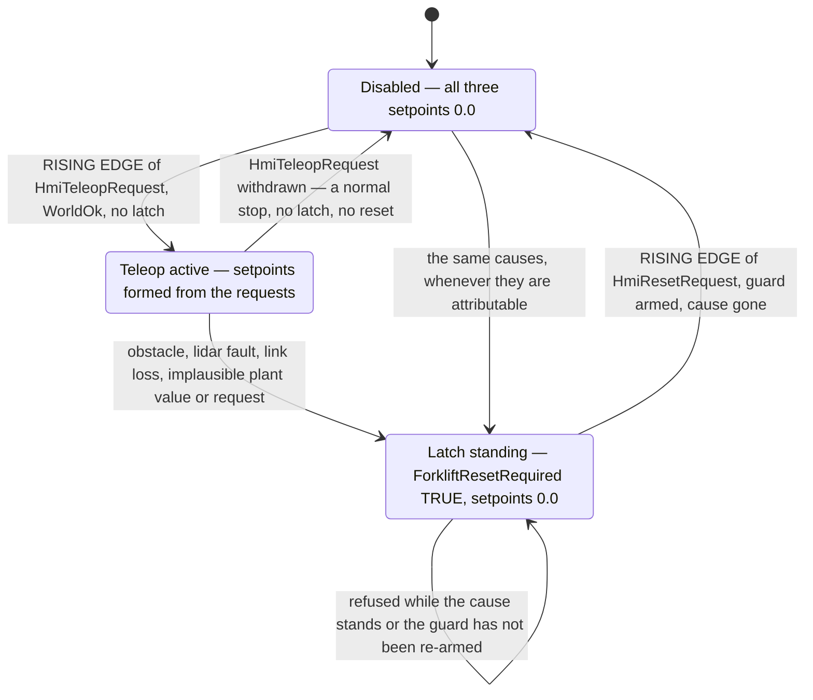
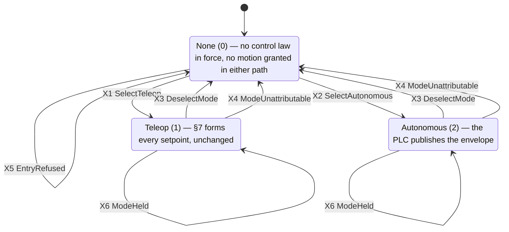

# Forklift commissioning cell — S7-1500 standard program specification (M4)

Gate M4, ADR 0008. This is the **implementation specification for the TIA Portal
program** the owner builds by hand. It is written for an experienced controls
engineer sitting in front of the software and is meant to be buildable without
asking its author a question.

> **As built, this project runs one standard function block and no demonstration
> cell** — owner decision, **2026-07-30**, from the TIA session handover. The
> `safe_amr` project contains no `FB_DemoCellControl`, no `DemoCellLink` data
> block and none of the M3 node set, so the **bridge watchdog was built inside
> `FB_ForkliftTeleop`**, reading `"ForkliftLink".BridgeHeartbeat` with the same
> stale window and the same boot polarity the M3 cell used. No new server node
> was created and the server interface was not otherwise touched. §3.1b records
> the consequence, §6.1 and §7 build it, §9 watches it, and every sentence in
> this document that assumed a neighbouring cell is corrected to match.
> `plc/demo-cell/SPEC.md` stays a **precedent this document cites**; its program
> is not in this project.

**Status: specification, not verification.** No part of this document has been
executed in TIA Portal or PLCSIM Advanced by its author, who has neither
installed. Every number below is a **design value to be confirmed at
commissioning**, every menu path is version-dependent and named so it can be
recognised rather than clicked blind, and nothing here is evidence for the gate.
The gate closes on the owner's run (§11) and on the recorded commissioning
showcase the roadmap's M4 row requires.

## Authority

| Document | What it fixes | Relation to this one |
|---|---|---|
| `docs/interfaces/opcua-nodes.md` §10 | The 18 nodes: names, types, units, ranges, plausibility windows, ownership, writability, start values, and the P1–P7 expectations on this document | **Contract.** If this document disagrees, §10 wins and this one is corrected |
| `docs/adr/0008-forklift-commissioning-gate-and-hmi-layer.md` | That teleop routing, the speed cap, the soft limits and the obstacle stop are **process logic in the standard program** and implement no SRS function | **Binding.** See §2 |
| `plc/demo-cell/SPEC.md` | The bridge watchdog's shape: `HEARTBEAT_STALE_TIME` = `T#500ms`, the `…SeenAlive` boot polarity, the one-latch-one-diagnosis watch table | **Precedent, not a dependency.** That program is **not in this project** (owner decision 2026-07-30), so its bridge verdict is **re-formed here** rather than consumed — same shape, new owner (§3.1b, §6.1) |
| `CLAUDE.md` §9 | Wire NC / program NO, cycle flag vs actuator, monitored edge reset, no auto-resume | **Binding.** §6 is its application |
| `docs/roadmap.md`, row M4 | Exit criteria (a)–(e) | §11 is one scenario per criterion |
| `agv/forklift/config.yaml`, `agv/forklift/model.sdf` | The plant: joint limits, vehicle-layer clamps, topic names | Input to the constants of §3.3 |
| `docs/interfaces/opcua-nodes.md` §12 | The nine M5 nodes — the drive mode, the autonomy envelope, the vehicle's report and the operator's process stop — with their types, start values, ownership, writability and the **M1–M6**, **E1–E8**, **Z1–Z4**, **V1–V4**, **PS1–PS6**, **C1–C4** expectations | **Contract for §14.** If §14 disagrees, §12 wins and §14 is corrected |
| `docs/adr/0014-motion-control-locus.md` | **D1** the loop closes onboard and no motion value crosses the seam; **D3** the word *onboard* covers the F-runtime group and not this program; **D4** the three seams; **D5** the disclosure obligation | **Binding on §14.** The PLC's autonomous-mode authority is permissive and **checked, not compelled** |

---

## 1. What the program does

One tricycle forklift plant in Gazebo — steered drive, a mast-driven fork, one
planar lidar — teleoperated from a local commissioning HMI. The HMI is an OPC UA
*client* that writes **requests**; the bridge is a second OPC UA client that
writes the plant's state and reads back the setpoints. The program:

- supervises **both client heartbeats** and forms **both** link verdicts — the
  HMI's, published as `HmiLinkOk`, and the bridge's, kept internal — because
  this project has no second function block to own either (§3.1b),
- tests **every Real** that reaches it — three operator requests and three plant
  values — against its own plausibility window before any process comparison
  reads it,
- latches an **obstacle process stop** on the lidar's field-violation bit, and
  clears it only on a **monitored, edge-triggered reset**,
- caps the traction setpoint while the **fork is raised**,
- aborts fork motion **in the offending direction only** at each soft travel
  limit,
- forms all three actuator setpoints from a **teleop-active flag combined with
  interlocks**, each in exactly one statement with a mandatory `ELSE` to `0.0`.

**No command reaches the plant without passing through this logic** — that is the
gate's claim (ADR 0008 D1). None of it is in the bridge (ADR 0005 D1) and none of
it is in the HMI (ADR 0008 D2.2).

---

## 2. Boundary statement — read before anything else

> **Nothing in this program is a safety function.**
>
> The obstacle stop, the fork-height speed cap and the fork soft travel limits
> are **standard-program process interlocks**. They implement **no** function of
> `docs/safety/SRS.md`: not SF-02, not SF-03, not SF-04, not SF-07, not SF-09
> (ADR 0008 D3). No SIL or PL is claimed for any of them.
>
> The words "emergency" and "protective" appear in **no tag name, node name,
> topic name, code comment, watch-table entry, HMI text or recording** produced
> from this specification — the naming discipline `opcua-nodes.md` §10.1 sets and
> ADR 0004 set before it. Where the two words appear in this document at all,
> they appear only in statements of what this cell **does not have**, as they do
> in this section.
>
> Every node this program serves is process data. Safety never traverses the
> network (invariant 1). **This plant has no F-CPU, no safety-rated device and no
> onboard safety layer at all** — on real equipment the protective stop and safe
> torque off would be onboard and hardwired, and they do not exist here.
>
> **One clause of that sentence expired, and it is the F-CPU clause.** ADR 0009
> put the twin on a 1513F-1 PN running an F-runtime group, so from the moment
> the §13 delta's precondition is met **this CPU does run an F-program**. The
> other two clauses stand word for word: the three F-inputs are **engineering
> stand-ins for wiring**, not safety-rated devices, and this plant still has no
> onboard safety layer of any kind (`plc/forklift-safety/SPEC.md` §1.2 N4, N7).
> **This boundary statement is unchanged and now carries more weight, not less.**
> Reading an F-flag and refusing motion is a **process consequence of a demand**,
> never the safety reaction — this program still has no safety function, no SIL
> and no PL, and it de-energizes nothing (N1). What §13 adds is one conjunct and
> four display copies; it adds no safety function to this program.
>
> Loss of either client link is a **degraded mode, not a safety event**
> (invariant 2).

The wire-NC/program-NO convention, the latching, the monitored reset and the
no-auto-resume rule are used here because they are correct engineering practice
for a stop of *any* class — not because they confer safety integrity. They do
not.

---

## 3. Tags

### 3.1 Server-visible tags — exactly the 18 nodes of `opcua-nodes.md` §10

The PLC symbol's leaf name **is** the OPC UA BrowseName, character for character,
so the two documents diff (CLAUDE.md §9). The DB name is a container, not part of
the BrowseName: the server interface (§4.3) places each tag under the folder path
below, so a client sees `Forklift/Hmi/HmiTractionRequest` regardless of which DB
holds it.

| # | BrowseName path (under the `DemoCell` interface) | PLC symbol | S7 type | Written by | Start value |
|---|---|---|---|---|---|
| 1 | `Forklift/Hmi/HmiTractionRequest` | `"ForkliftHmi".HmiTractionRequest` | Real | HMI | `0.0` |
| 2 | `Forklift/Hmi/HmiSteerRequest` | `"ForkliftHmi".HmiSteerRequest` | Real | HMI | `0.0` |
| 3 | `Forklift/Hmi/HmiForkRequest` | `"ForkliftHmi".HmiForkRequest` | Real | HMI | `0.0` |
| 4 | `Forklift/Hmi/HmiTeleopRequest` | `"ForkliftHmi".HmiTeleopRequest` | Bool | HMI | `FALSE` |
| 5 | `Forklift/Hmi/HmiResetRequest` | `"ForkliftHmi".HmiResetRequest` | Bool | HMI | `FALSE` |
| 6 | `Forklift/Input/ForkliftForkHeight` | `"ForkliftInput".ForkliftForkHeight` | Real | bridge | `0.0` |
| 7 | `Forklift/Input/ForkliftLinearSpeed` | `"ForkliftInput".ForkliftLinearSpeed` | Real | bridge | `0.0` |
| 8 | `Forklift/Input/ForkliftObstacleInStopZone` | `"ForkliftInput".ForkliftObstacleInStopZone` | Bool | bridge | **`TRUE`** |
| 9 | `Forklift/Input/ForkliftObstacleMinDistance` | `"ForkliftInput".ForkliftObstacleMinDistance` | Real | bridge | `0.0` |
| 10 | `Forklift/Output/ForkliftTractionSpeedRef` | `"ForkliftOutput".ForkliftTractionSpeedRef` | Real | **program** | `0.0` |
| 11 | `Forklift/Output/ForkliftSteerAngleRef` | `"ForkliftOutput".ForkliftSteerAngleRef` | Real | **program** | `0.0` |
| 12 | `Forklift/Output/ForkliftForkSpeedRef` | `"ForkliftOutput".ForkliftForkSpeedRef` | Real | **program** | `0.0` |
| 13 | `Forklift/Status/ForkliftTeleopActive` | `"ForkliftStatus".ForkliftTeleopActive` | Bool | program | `FALSE` |
| 14 | `Forklift/Status/ForkliftObstacleStopActive` | `"ForkliftStatus".ForkliftObstacleStopActive` | Bool | program | `FALSE` |
| 15 | `Forklift/Status/ForkliftSpeedLimitActive` | `"ForkliftStatus".ForkliftSpeedLimitActive` | Bool | program | `FALSE` |
| 16 | `Forklift/Status/ForkliftResetRequired` | `"ForkliftStatus".ForkliftResetRequired` | Bool | program | `FALSE` |
| 17 | `Forklift/Link/HmiHeartbeat` | `"ForkliftLink".HmiHeartbeat` | UInt | HMI | `0` |
| 18 | `Forklift/Link/HmiLinkOk` | `"ForkliftLink".HmiLinkOk` | Bool | program | `FALSE` |

> **`ForkliftObstacleInStopZone` starts `TRUE`, the one start value here that is
> not the type's zero, and that is deliberate** (`opcua-nodes.md` §10.9). Its
> polarity inverts the `…CircuitClosed` convention of the M3 panel: `TRUE` is the
> **non-permissive** state, and the vehicle layer publishes `TRUE` only when the
> scan is missing, stale or structurally unusable, or the forward sector has no
> sample in either valid class — never merely because a sample reads beyond the
> scan's own `range_max`, which is `CLEAR` and reads `FALSE` at `8.00`
> (`docs/reports/m4f-02c-inf-means-clear.md`, commit `74c7d5f`). The bridge may
> not invert a signal, so
> fail-safety is carried by the publisher's polarity, by this start value, and by
> the qualification rule below — not by the name. Anyone renaming this node must
> move the polarity of `/forklift/obstacle/in_stop_zone` with it, in the vehicle
> layer, in the same change.

> **`ForkliftObstacleMinDistance` starts `0.0`, which is *outside* its
> plausibility window on purpose.** `0.0` is the vehicle layer's no-data
> sentinel, so the affirmative window test of §6.2 reads it as a **transducer
> fault** at the same moment the field bit reads as an obstacle — two independent
> signals pointing the same, non-permissive way.

**The start values are the fail-safe pre-connection state, and the program never
reasons from them.** §6.1 qualifies every input with its link verdict instead.
That is the robust statement whichever restart type applies, and it is what the
M3 cell learned the hard way (`plc/demo-cell/SPEC.md` §6.1, LESSONS 2026-07-28).

**No other tag is server-visible.** No timer, latch, edge memory, constant or
guard is exported (`opcua-nodes.md` §10.11). Exposing them would invite a client
to act on them.

**One further server-visible tag lives in the `ForkliftLink` DB and is not one of
the 18: `BridgeHeartbeat`**, the bridge's own liveness counter, `UInt`, written
by the **bridge**, start value `0`. It is **not a new node and not a forklift
node** — it is `opcua-nodes.md` §9.7's single bridge heartbeat, the one the
bridge's configured slot has always pointed at, and there is still exactly **one
of it for the whole bridge process** (§9.7, §10.1: no second heartbeat is created
for the forklift subtree). What the owner decision of 2026-07-30 moved is the
**data block that backs it**, from `DemoCellLink` to `ForkliftLink`, because this
project has no `DemoCellLink` (§3.1b). Its BrowseName is unchanged, so the
bridge's path resolves unchanged.

**The §13 delta adds four server-visible tags and nothing else** — the read-only
mirrors of `Forklift/Safety/`, in their own data block and their own folder
(`opcua-nodes.md` §11). The sentence above stays true of the set it is about:
§10's node set is still exactly these 18, and no timer, latch, edge memory,
constant, guard or F-internal becomes visible on any path (§13.4).

### 3.1b Both link verdicts are formed here — the as-built bridge watchdog

**Owner decision, 2026-07-30.** The `safe_amr` TIA project contains no
demonstration cell: no `FB_DemoCellControl`, no `DemoCellLink` data block, none
of the M3 node set. An earlier revision of this document specified the bridge
verdict as a value *consumed* from that function block. **There is nothing to
consume it from**, so the watchdog is built here, in the shape the M3 cell
proved:

| What | As built |
|---|---|
| Input | `"ForkliftLink".BridgeHeartbeat`, the bridge's liveness counter (§3.1) |
| Constant | `HEARTBEAT_STALE_TIME` = `T#500ms`, ≈10 missed beats at the bridge's 50 ms nominal write period (§3.3) |
| Statics | `LastBridgeHeartbeat`, `BridgeSeenAlive`, `BridgeStaleTimer` (§3.2) |
| Verdict | `BridgeSeenAlive AND NOT BridgeStaleTimer.Q` — the **pessimistic boot polarity**, `FALSE` from the first scan until the counter has been seen to change (§6.1) |
| Published? | **No.** The verdict is a Temp, read off its two terms in the watch table (§9 Group 5). No new server node was created |

**Invariant 10 holds, with a new single owner.** One bridge process, one
heartbeat, one verdict — and in this project the one program that forms it is
this one. The invariant forbids *two* owners for a value, not a different one;
what would break it is a second verdict computed somewhere else, and there is no
somewhere else here.

**Nothing outside this program's own data blocks is read** — with one
delta-scoped exception, the four F-flags of §13, which are read and never
written (§13.4).

**Two consequences worth stating rather than discovering.**

- `opcua-nodes.md` §10.1 still describes the shared-project arrangement — *"the
  verdict is written by the demonstration cell's FB and consumed by the forklift
  FB as a shared DB bit"*. That sentence is about a project that has both cells;
  this one has one. It is `docs/interfaces/`'s to reconcile and is **requested,
  not taken here**. Nothing in the node set moves either way: the heartbeat is
  still one node, and no verdict node is added.
- **Which folder the heartbeat hangs in is a read-back.** Every bridge
  configuration resolves it at `Link/BridgeHeartbeat` relative to the interface
  node, i.e. `DemoCell/Link/BridgeHeartbeat`. The DB behind it moved; the browse
  path must not. Confirm it with the independent client at §10 step 11 and record
  it with its date — a path is a tool-derived value until it is read back
  (ADR 0006).

### 3.2 Internal tags — statics of `FB_ForkliftTeleop`, not on the server

All live in the instance DB `"ForkliftControl_DB"`.

| Symbol | Type | Start value | Purpose |
|---|---|---|---|
| `LastHmiHeartbeat` | UInt | `0` | Value of `HmiHeartbeat` at the previous OB call. Compared for **inequality** only — never subtracted, never tested for `+1`, never assumed monotonic across the wrap or across an HMI restart (`opcua-nodes.md` §10.8 P1, H4) |
| `HmiStaleTimer` | IEC_TIMER (TON) | — | Runs while the heartbeat is unchanged |
| `HmiSeenAlive` | Bool | `FALSE` | *The HMI heartbeat has been observed to change at least once since CPU start.* One-shot, set by the first inequality, never cleared while the CPU runs. It is the **first term** of `HmiLinkOk` and is what makes the verdict `FALSE` — rather than "not yet proven stale" — for the whole boot window (§6.1, P2, LESSONS 2026-07-28) |
| `LastBridgeHeartbeat` | UInt | `0` | Value of `BridgeHeartbeat` at the previous OB call. Compared for **inequality** only, for the same reasons and with the same prohibitions as the HMI counter above (§3.1b, as built 2026-07-30) |
| `BridgeStaleTimer` | IEC_TIMER (TON) | — | Runs while the bridge heartbeat is unchanged |
| `BridgeSeenAlive` | Bool | `FALSE` | *The bridge heartbeat has been observed to change at least once since CPU start.* The same one-shot as `HmiSeenAlive`, on the other client, and the **first term** of the bridge verdict. **Two independent watchdogs, two independent one-shots**: neither substitutes for the other (P7) |
| `TeleopEnableEdgeMemory` | Bool | **`TRUE`** | Previous state of `HmiTeleopRequest`, for the rising edge that enables teleop. Start value `TRUE` so an enable already asserted at the first scan produces **no** edge: an HMI that boots with the control held cannot start the machine |
| `ResetEdgeMemory` | Bool | **`TRUE`** | Previous state of `HmiResetRequest`, for the rising edge the reset acts on. Start value `TRUE` for the same reason and with the same effect: a reset already asserted at the first scan can never clear a latch |
| `ResetDeviceFault` | Bool | **`TRUE`** | *The reset request has not been observed `FALSE` **in the current HMI link session**.* Set `TRUE` whenever `HmiLinkOk` is `FALSE` — at CPU start and again at every HMI link loss — and cleared while `HmiLinkOk` is `TRUE` and `HmiResetRequest` reads `FALSE`. This is the **per-link-session arming guard** of `opcua-nodes.md` §10.8 P6. A **level** verdict about the present session, not a run-long latch: returning to `TRUE` after an outage is the mechanism working, not a device fault. It blocks the reset and nothing else |
| `ObstacleStopLatch` | Bool | `FALSE` | The lidar field read violated, or its diagnostic distance was implausible for longer than the delay. Mirrored to `ForkliftObstacleStopActive` |
| `HmiLinkLostLatch` | Bool | `FALSE` | `HmiLinkOk` was `FALSE` |
| `BridgeLinkLostLatch` | Bool | `FALSE` | `BridgeLinkOk` was `FALSE`. **Separate from the HMI latch** so the watch table names the link that died — two independent watchdogs on two independent clients, and neither substitutes for the other (P7) |
| `PlantInputFaultLatch` | Bool | `FALSE` | `ForkliftForkHeight` **or** `ForkliftLinearSpeed` implausible for longer than `PLANT_FAULT_DELAY`. One latch for both: they arrive from the same vehicle-layer publisher at the same rate, so there is nothing to tell apart at this level. Which one is bad is read off the raw values in the watch table (§9) |
| `RequestFaultLatch` | Bool | `FALSE` | Any of the three HMI Reals implausible for longer than `REQUEST_FAULT_DELAY`. An out-of-window request is a **broken client**, not a demand, and clamping it silently would hide exactly that (`opcua-nodes.md` §10.4) |
| `PlantInvalidTimer` | IEC_TIMER (TON) | — | Delay before implausible plant feedback becomes a latch |
| `LidarInvalidTimer` | IEC_TIMER (TON) | — | Delay before an implausible `ForkliftObstacleMinDistance` becomes a latch |
| `RequestInvalidTimer` | IEC_TIMER (TON) | — | Delay before an implausible HMI request becomes a latch |

**No tag in this program is declared Retain.** A restart must re-read the world
and decide where it is, not resume from stale state (CLAUDE.md §9). The latches
are level bits, so anything still true after a restart re-raises itself on the
first *qualified* scan — an obstacle still in the field re-latches, a link still
down re-latches.

**There is no held setpoint anywhere in this FB.** No `…Hold`, no last-known-good
substitution, no filter and no ramp on any of the three outputs. Every output is
recomputed from scratch on every OB call (§6.4).

**The §14 delta adds ten statics to this instance DB and edits none of the rows
above.** They are declared in §14.3 with their start values and their reasons, and
they are **read back out of the watch table after the download** rather than
trusted from the FB interface — adding a member to a live instance DB is exactly
the situation LESSONS 2026-07-28 records.

### 3.3 Constants

Declared in the FB's constant block. Every one is a **process decision** that the
node model deliberately refused to make (`opcua-nodes.md` §10, repeatedly:
"interface expectation for the PLC specification"). Commissioning values, not
measurements.

| Constant | Value | Basis |
|---|---|---|
| `HMI_STALE_TIME` | `T#600ms` | `opcua-nodes.md` §10.8 **P3**: three worst-case HMI write periods at the 5 Hz contractual floor (200 ms). **The rule is three worst-case periods, not this number** — if the measured worst case at commissioning exceeds 200 ms, re-derive the constant from the measurement rather than reinterpreting the floor. **P4: it is its own constant and is never shared with `HEARTBEAT_STALE_TIME`** — the two watch different clients at different rates, and retuning one must not silently retune the other (invariant 10). Since 2026-07-30 both constants live in **this** FB's constant block, one row apart, which makes P4 easier to break and therefore worth reading twice |
| `HEARTBEAT_STALE_TIME` | `T#500ms` | The **bridge** watchdog's stale window, ≈10 missed beats at the bridge's 50 ms nominal write period, taken unchanged from `plc/demo-cell/SPEC.md` §3.3 and `opcua-nodes.md` §9.7 — the same number the M3 cell used, now evaluated here (§3.1b). Its own constant, never shared with `HMI_STALE_TIME` (P4) |
| `TRACTION_SPEED_MAX` | `1.00` m/s | `opcua-nodes.md` §10.12 item 4: `ForkliftLinearSpeed`'s plausibility window must stay **at least twice** this cap, and the window is ±2.00 m/s, which bounds the cap at 1.00 m/s. **Raising the cap re-derives the window first**, in the interface document, and is not a change this specification may make. The vehicle layer's own `traction_speed_max_mps: 1.50` is a *different layer's* last-ditch clamp on a different value; because 1.00 < 1.50 the PLC never asks the plant for a speed its clamp would touch, which is the correct relationship |
| `TRACTION_SPEED_CAP_RAISED` | `0.30` m/s | Reduced traction speed while the fork is raised. Process decision; 30 % of the uncapped cap, large enough to be driveable and small enough that the reduction is unmistakable in the recording |
| `FORK_HEIGHT_SLOW_THRESHOLD` | `0.50` m | Carriage height above which the cap applies. Process decision, inside the 0.00…1.60 travel with clear room either side so the crossing is easy to drive to and easy to see |
| `FORK_SPEED_MAX` | `0.15` m/s | The full-scale fork jog speed. Matches `ForkliftForkSpeedRef`'s declared range of ±0.15 m/s (`opcua-nodes.md` §10.6) and the vehicle layer's `fork_speed_max_mps` |
| `STEER_ANGLE_MAX` | `1.31` rad | The plant's mechanical steer stop (`agv/forklift/config.yaml` `steer_limit_rad`), and `ForkliftSteerAngleRef`'s declared range. Used as the clamp on the steer request |
| `FORK_TRAVEL_MIN` / `FORK_TRAVEL_MAX` | `0.05` / `1.55` m | **Soft** travel limits, 0.05 m inside the model's 0.00/1.60 mechanical stops, so the program stops the carriage before the model does. One OB call of overtravel at `FORK_SPEED_MAX` is 0.003 m and one bridge round trip (~100 ms) is 0.015 m, so 0.05 m is ≈3× the worst latency-induced overshoot. **Deliberately different constants from the plausibility window below**, which is a statement about what the transducer can report |
| `FORK_HEIGHT_MIN` / `FORK_HEIGHT_MAX` | `-0.05` / `1.70` m | Plausibility window, `opcua-nodes.md` §10.5. Widened past **both** mechanical stops so a carriage resting **on** a stop is never called implausible — the `BELT_POSITION_MIN/MAX` reasoning of `plc/demo-cell/SPEC.md` §3.3 |
| `LINEAR_SPEED_MIN` / `LINEAR_SPEED_MAX` | `-2.00` / `+2.00` m/s | Plausibility window, `opcua-nodes.md` §10.5. A statement about what the odometry can report, **not** a process cap — the cap is `TRACTION_SPEED_MAX` and is a different decision in a different layer |
| `OBSTACLE_DISTANCE_MIN` / `OBSTACLE_DISTANCE_MAX` | `0.05` / `8.10` m | Plausibility window, `opcua-nodes.md` §10.5, widened past the 0.10…8.00 m sensor window. The vehicle layer's `0.0` no-data sentinel falls outside it and therefore reads as a fault |
| `TRACTION_REQUEST_MIN` / `TRACTION_REQUEST_MAX` | `-1.05` / `+1.05` | Plausibility window on the traction fraction, `opcua-nodes.md` §10.4. Wider than the ±1.00 engineering range by the `float64 → Real` narrowing margin, so a legitimate ±1.0 never reads as a fault |
| `FORK_REQUEST_MIN` / `FORK_REQUEST_MAX` | `-1.05` / `+1.05` | Same window on the fork fraction. **Its own constant pair** even though the numbers coincide with the traction pair, for the reason P4 gives: retuning one must not silently retune the other |
| `STEER_REQUEST_MIN` / `STEER_REQUEST_MAX` | `-1.35` / `+1.35` rad | Plausibility window on the steer request, `opcua-nodes.md` §10.4, wider than the ±1.31 rad mechanical range by the same margin |
| `TRACTION_REQUEST_CLAMP` | `1.00` | The traction fraction's **engineering range**, and the clamp target. A request of, say, 1.03 is *plausible* (inside the window) and is clamped to 1.00; a request of 1.20 is *implausible* and is a fault. The window and the clamp are two different decisions and must not be conflated |
| `FORK_REQUEST_CLAMP` | `1.00` | The fork fraction's engineering range and clamp target. Its own constant, same reasoning |
| `PLANT_FAULT_DELAY` | `T#300ms` | Three source periods: the vehicle layer publishes `fork_height` and `linear_speed` at 10 Hz. Tolerates two corrupt or dropped samples without latching |
| `LIDAR_FAULT_DELAY` | `T#300ms` | Same basis, same rate, **its own constant** so the lidar's tolerance and the drive feedback's tolerance can be tuned apart (invariant 10, the `BELT_FAULT_DELAY` precedent) |
| `REQUEST_FAULT_DELAY` | `T#600ms` | Three worst-case HMI write periods at the 5 Hz floor — the same rule as `HMI_STALE_TIME`, and again its own constant. An implausible request drops the motion permissive **immediately** through `WorldOk`; this delay only governs when it becomes a *latch* |

**The §14 delta adds six constant rows to this block and changes none of the rows
above.** They are declared in §14.3 with their bases. **P4 applies to them
too**: `VEHICLE_STALE_TIME` is its own window on a third watched party and is
never shared with `HMI_STALE_TIME` or `HEARTBEAT_STALE_TIME`, even where the
numbers coincide.

---

## 4. Blocks, DBs and the server interface

### 4.1 Block structure

```
OB30  Cyclic interrupt, 20 ms          -- the only place standard logic runs
  └── FB_ForkliftTeleop  / "ForkliftControl_DB"      (this document, and the
                                                      ONLY standard FB here)
          reads   "ForkliftHmi".*      "ForkliftInput".*
                  "ForkliftLink".HmiHeartbeat        -- HMI watchdog input
                  "ForkliftLink".BridgeHeartbeat     -- BRIDGE watchdog input,
                                                        as built 2026-07-30
          writes  "ForkliftOutput".*   "ForkliftStatus".*
                  "ForkliftLink".HmiLinkOk

F-OB  F-runtime group RTG1             -- ADR 0009. Its own OB, NOT called from
                                          OB30 and not part of this program.
                                          The §13 delta READS four of its flags
                                          and writes none of them.

OB1   Main                              -- still contains nothing
```

| Decision | Why |
|---|---|
| **One standard FB, and no call order to get right** | This project has no demonstration cell (§3.1b, owner decision 2026-07-30), so there is no second block to be called before or after and no shared DB bit to read. **Both** link verdicts are formed at the top of this FB, from the counters as they read in **this** call, which is the freshest either can be |
| One cyclic interrupt OB, not OB1 | Every timer in both programs shares one deterministic time base. OB1's period varies with load, which would make `HMI_STALE_TIME` mean different things on different days |
| 20 ms, the period the M3 cell used | The bridge writes at 50 ms (20 Hz) and the HMI at 100 ms nominal, so 20 ms gives at least two OB calls per bridge write and five per HMI cycle. **The OB carries one FB**, and the CPU additionally runs the F-runtime group in its own F-OB: measure the OB30 cycle time and the CPU maximum cycle time after the download and record them (§12 open item 9) |
| One FB, one instance, no second instance | Every output and status tag has exactly one writer in exactly one statement (invariant 10, ADR 0008 consequences). This FB is instanced **once** |
| No hard real-time claim | Nothing here is a deterministic timing requirement in the sense of invariant 9. The invariant is satisfied by the logic being in the PLC at all rather than in Python |

> **`FB_ForkliftTeleop` and `"ForkliftControl_DB"` do not share a stem, and that
> is on purpose.** The
> FB name is this layer's to choose (ADR 0008 D3) and is taken from the brief;
> the **instance DB name is tabulated in `opcua-nodes.md` §10.3** with its access
> rights, so that is the name used. The DB is marked *Accessible from HMI/OPC UA*
> ✘, so it is never on the server, carries no BrowseName and nothing outside the
> CPU depends on the pairing.

### 4.2 Global DBs and access rights

**Five global DBs, one per node-model folder** (`opcua-nodes.md` §10.3). That
rule was written against a project that also held the four M3 DBs: adding members
to `DemoCellInput` and its siblings would have moved the offsets of tags that M3
evidence, watch tables and test records depend on, and a download that leaves
project and CPU inconsistent shows up as monitoring errors on exactly the rows
whose offsets moved (LESSONS 2026-07-28). **This project holds none of those data
blocks** (§3.1b), so that particular hazard is absent here — and the five-DB
split stands unchanged anyway, because it is what keeps the folder tree and the
per-tag access rights one to one.

Optimized block access (the S7-1500 default) throughout: the server interface
addresses tags symbolically, so no absolute address is needed anywhere.

| DB | Contents | *Accessible from HMI/OPC UA* | *Writable from HMI/OPC UA* |
|---|---|---|---|
| `ForkliftHmi` | tags 1–5 | ✔ | **✔** (all five) |
| `ForkliftInput` | tags 6–9 | ✔ | **✔** (all four) |
| `ForkliftOutput` | tags 10–12 | ✔ | **✘** |
| `ForkliftStatus` | tags 13–16 | ✔ | **✘** |
| `ForkliftLink` | `HmiHeartbeat` ✔/**✔**, `BridgeHeartbeat` ✔/**✔**, `HmiLinkOk` ✔/**✘** | ✔ | per tag |
| `ForkliftControl_DB` (instance) | §3.2 internals | **✘** | ✘ |

> The *Writable* column is where the direction rules are **enforced by the server
> rather than by convention**: with `ForkliftOutput` not writable, a defect in
> *either* client that tried to write an actuator setpoint is refused by the CPU.
> Each client also enforces its own allowlist, which is the same
> two-independent-enforcements arrangement the M3 cell uses.
>
> **Per-*client* scoping is not enforced**, and with two writing clients that gap
> is materially wider than it was with one. The commissioned CPU runs with access
> control disabled and security `None` (`opcua-nodes.md` §9.10), so "only the HMI
> writes the `Hmi` group and `HmiHeartbeat`, and only the bridge writes the
> `Input` group and `BridgeHeartbeat`" is
> **policy, not enforcement** (ADR 0008 D2.5). Closing it is OPC UA access
> control, carried as `opcua-nodes.md` §10.12 item 6 and **not** a change to this
> program.

### 4.3 Server interface — `DemoCell` is extended, not replaced

**Ruling, from `opcua-nodes.md` §10.2: the forklift nodes are added to the
existing `DemoCell` server interface as a `Forklift/` subtree. No second server
interface is created, and the existing one is not renamed.** The ruling was
written for a project carrying the four M3 folders beside it; **this project
carries the `Forklift/` subtree and the bridge's `Link/BridgeHeartbeat`, and no
other M3 folder** (§3.1b, owner decision 2026-07-30). Nothing about the ruling
changes with the neighbours.

The interface name **is** the namespace URI — TIA derives it as
`http://<interface name>` and the field is not editable (ADR 0006) — so renaming
`DemoCell` would break every browse-by-URI at connect, for the bridge and now for
the HMI as well. Adding folders and tags does not touch the name, so
`http://DemoCell` does not move and every existing browse path keeps working.

The honest consequence, stated rather than discovered: **`DemoCell` is an
identifier, not a description.** In this project it carries the forklift
commissioning cell, the one bridge heartbeat node, and — with the §13 delta —
the four safety mirrors. It carries no demonstration cell at all.

Build the tree exactly as below and drag each DB tag into it. **Rename nothing**:
each leaf name must remain the BrowseName of §3.1.

```
DemoCell/                                       ns http://DemoCell, unchanged
  Link/      BridgeHeartbeat                    the bridge's one liveness node
                                                (opcua-nodes.md §9.7). The DB
                                                behind it is ForkliftLink here;
                                                the browse path is unchanged and
                                                is READ BACK, not typed (§3.1b)
  Forklift/
    Hmi/       HmiTractionRequest  HmiSteerRequest  HmiForkRequest
               HmiTeleopRequest  HmiResetRequest
    Input/     ForkliftForkHeight  ForkliftLinearSpeed
               ForkliftObstacleInStopZone  ForkliftObstacleMinDistance
    Output/    ForkliftTractionSpeedRef  ForkliftSteerAngleRef
               ForkliftForkSpeedRef
    Status/    ForkliftTeleopActive  ForkliftObstacleStopActive
               ForkliftSpeedLimitActive  ForkliftResetRequired
    Link/      HmiHeartbeat  HmiLinkOk
```

Full browse paths start at the interface node, which is **not** a child of
`Objects`: `Forklift/Hmi/HmiTractionRequest` is
`Objects/ServerInterfaces/DemoCell/Forklift/Hmi/HmiTractionRequest`, with
`ServerInterfaces` in the Siemens namespace and everything from `DemoCell` down
in `http://DemoCell` (`opcua-nodes.md` §2.1). A client resolves **two** namespace
indices by URI at connect and hardcodes neither.

---

## 5. Mode and state

There is **no sequencer here.** The M3 cell runs a transport cycle; this cell is
teleoperated, so the machine state is a single enable — `ForkliftTeleopActive` —
and the operator is the sequence.



`ForkliftTeleopActive` is **this cell's cycle-running flag** in the sense of
CLAUDE.md §9: it says *the machine is enabled*, and it says nothing about what any
actuator is doing. Whether the operator's requests reach the plant is decided
separately, in §6.4.

**The only path out of `Latched` is a monitored reset, and the only path from
`Disabled` to `Active` is a fresh rising edge of the enable.** A reset energizes
nothing.

**The §14 delta adds no state and no transition to the diagram above.** The drive
mode is a **second, separate** state machine, drawn in §14.4 with its five named
transitions; the only thing it changes here is that the `Disabled → Active` edge
additionally requires the mode in force to be `Teleop`.

---

## 6. Control logic, in words

Order of execution inside the FB matters and is stated per subsection. The whole
FB is written so that **every output is assigned on every call**, in both branches
of every decision.

### 6.1 First: link supervision and input qualification

```
-- HMI link, owned here
IF HmiHeartbeat <> LastHmiHeartbeat THEN  reset the stale timer
                                          and latch HmiSeenAlive
ELSE                                      run the stale timer
LastHmiHeartbeat := HmiHeartbeat          -- after the comparison
HmiLinkOk := HmiSeenAlive AND NOT HmiStaleTimer.Q

-- Bridge link, owned HERE TOO since 2026-07-30 (§3.1b) -- same shape, other
-- client, its own constant and its own one-shot
IF BridgeHeartbeat <> LastBridgeHeartbeat THEN  reset the stale timer
                                                and latch BridgeSeenAlive
ELSE                                            run the stale timer
LastBridgeHeartbeat := BridgeHeartbeat          -- after the comparison
bridgeLinkOk := BridgeSeenAlive AND NOT BridgeStaleTimer.Q   -- Temp, not a node
```

**Inequality only** (P1). Never `HmiHeartbeat - LastHmiHeartbeat`, never a test
for `+1`: the counter is `UInt16`, it wraps, and it restarts from an arbitrary
value at every HMI restart (H4). Any *change* is liveness.

**Two terms, and the first one is the one that is easy to forget.** `NOT
HmiStaleTimer.Q` alone reads *"the heartbeat has not yet been proven stale"*,
which at CPU start is not the same statement as *"the heartbeat is alive"*: at
the first scan `HmiHeartbeat` and `LastHmiHeartbeat` are both `0`, the TON begins
counting, and a verdict formed from that term alone reads **`TRUE` for the first
600 ms of every CPU run**, before a single operator input has arrived.
`HmiSeenAlive` makes the boot polarity pessimistic: **`HmiLinkOk` is `FALSE` from
the first scan and stays `FALSE` until the heartbeat has actually moved.** "Not
yet proven stale" is not "alive", and every guard that rides on link-up inherits
this polarity (P2, ADR 0008 D2.3, LESSONS 2026-07-28).

**Both verdicts carry that correction, and since 2026-07-30 both carry it here.**
The bridge half is the same six lines with the other client's counter, its own
constant and its own one-shot — `BridgeSeenAlive` is as load-bearing as
`HmiSeenAlive`, for exactly the reason above, and `bridgeLinkOk := NOT
BridgeStaleTimer.Q` would read `TRUE` for the first 500 ms of every CPU run
before the bridge had written anything. The M3 cell paid for this lesson once
(`plc/demo-cell/SPEC.md` §6.1, LESSONS 2026-07-28); applying it twice inside one
block is cheaper than maintaining it in two programs, which was the shape this
document assumed before the project turned out to hold only one.

**A first heartbeat write equal to the start value is invisible for exactly one
HMI cycle.** The counter is arbitrary at HMI start; if its first written value
happens to be `0`, the inequality sees no change until the next cycle. The
verdict is then late by one HMI cycle — never wrong in direction.

> **The qualification rule, stated once and applied everywhere below**
> (`opcua-nodes.md` §10.9).
> While `BridgeLinkOk` is `FALSE`, the four `Forklift/Input/` values are **not
> attributable to the plant**. While `HmiLinkOk` is `FALSE`, the five
> `Forklift/Hmi/` values are **not attributable to an operator**. Therefore **no
> verdict derived from either group is evaluated, and no fault from either group
> is latched, while its link verdict is `FALSE`.** Start values are the last
> line, not the first: the boot polarity above is what actually prevents a
> freshly started CPU from acting on them.

Both link verdicts latch on loss:

```
IF NOT hmiLinkOk    THEN HmiLinkLostLatch    := TRUE;
IF NOT bridgeLinkOk THEN BridgeLinkLostLatch := TRUE;
```

so a returning heartbeat — of either client — never by itself restores teleop
(P5). **Both latches are therefore set at the first scan of every CPU run**, and
`ForkliftResetRequired` reads `TRUE` from power-up. That is intended: a fresh CPU
requires a monitored reset before the machine can be enabled, and any link-up
preceded by a scan with that link down is reached with a latch already pending.

**Consistency caveat.** The server samples the DBs asynchronously from the
program, and the HMI's write ordering guarantee — heartbeat written last (H3) —
is an *ordering* guarantee, not atomicity. **No logic here requires two HMI tags
to have come from the same cycle**, and none may be added.

### 6.2 Plausibility, in affirmative form — all six Reals, none exempted

**Six Reals reach this program.** Three are written by the HMI, three by the
bridge. **Every one of them is tested against its own window before any process
comparison consumes it**, and the fault is taken in the `ELSE` of an affirmative
test:

```
valid := (LOW < x) AND (x < HIGH)          -- fault is the ELSE of this
```

**Never invert this into `NOT (x < LOW OR x > HIGH)`.** `NaN` and `inf` make
*every* comparison false: in the affirmative form they land in the fault branch,
which is where they belong; in the inverted form they read as *valid* and a dead
transducer is passed downstream as a measurement (LESSONS 2026-07-27, and the
half-fix of 2026-07-28 that this sweep exists to avoid repeating). `IS_VALID(x)`
may be `AND`ed in as documentation of intent — it is redundant **only** because
the test is affirmative, and for no other reason.

| Value | Window constants | Verdict | On failure |
|---|---|---|---|
| `ForkliftForkHeight` | `FORK_HEIGHT_MIN/MAX` | `heightValid` | drops `WorldOk`; latches `PlantInputFaultLatch` after `PLANT_FAULT_DELAY`; **and** forces `forkRaised` (§6.5) and blocks fork motion in **both** directions (§6.6) |
| `ForkliftLinearSpeed` | `LINEAR_SPEED_MIN/MAX` | `speedValid` | drops `WorldOk`; same latch |
| `ForkliftObstacleMinDistance` | `OBSTACLE_DISTANCE_MIN/MAX` | `distanceValid` | drops `WorldOk`; sets `ObstacleStopLatch` after `LIDAR_FAULT_DELAY` (§6.7) |
| `HmiTractionRequest` | `TRACTION_REQUEST_MIN/MAX` | `requestsValid` | drops `WorldOk`; latches `RequestFaultLatch` after `REQUEST_FAULT_DELAY` |
| `HmiSteerRequest` | `STEER_REQUEST_MIN/MAX` | `requestsValid` | as above |
| `HmiForkRequest` | `FORK_REQUEST_MIN/MAX` | `requestsValid` | as above |

Each verdict is conjoined with its own link verdict, so an unattributable value
is never called implausible and never latched — it is simply not evaluated.

**The window and the clamp are different decisions.** A request inside its window
but outside its engineering range is a legitimate ±1.0 that narrowed upward
through `float64 → Real`; it is **clamped** to the engineering range with `LIMIT`
(§6.4). A request outside the window is a **broken client** and is a fault.
Silently clamping the second case would hide exactly what it is there to reveal
(`opcua-nodes.md` §10.4).

**`ForkliftObstacleMinDistance` is tested for health, never thresholded.** The
lidar's field verdict belongs to the device and arrives as
`ForkliftObstacleInStopZone`; forming a second "obstacle present" in the PLC from
the distance would create a second owner for one value (invariant 10,
`opcua-nodes.md` §10.5). **No comparison of `ForkliftObstacleMinDistance` against
any stop distance appears anywhere in this program.** Its window test is a
statement about the transducer, and the vehicle layer's `0.0` no-data sentinel
falls outside that window precisely so that "no data" reads as a fault at the
same moment the field bit reads as an obstacle.

**`ForkliftLinearSpeed` is read, qualified, and otherwise unused.** It feeds no
verdict: there is no traction drive-fault detection in this program, because no
node exists to carry one and inventing the verdict without the node was
explicitly declined (`opcua-nodes.md` §10.11, §10.12 item 3). See §8 and §12.

### 6.3 The teleop-active flag and the two sets

Machine state and actuator command are separate layers (CLAUDE.md §9).
`ForkliftTeleopActive` says *the machine is enabled*. It says nothing about what
any actuator is doing.

**`WorldOk`** — the live conditions, all must be `TRUE`:

| # | Condition | Reads as |
|---|---|---|
| C1 | `BridgeLinkOk` | The plant image is attributable: the bridge heartbeat has been **seen to change** and has not since gone stale. `FALSE` from the first scan of every CPU run |
| C2 | `HmiLinkOk` | The operator is present, by the same boot polarity (§6.1). **Both are required and neither substitutes for the other** (P7) |
| C3 | `NOT ForkliftObstacleInStopZone` | The forward field reads clear **right now**. The device's verdict, not a PLC threshold |
| C4 | `heightValid AND speedValid` | Both plant Reals are inside their physical windows right now |
| C5 | `distanceValid` | The lidar's diagnostic distance is a measurement right now |
| C6 | `requestsValid` | All three operator Reals are inside their windows right now |
| C7 | `NOT HmiProcessStopRequest` | **§14 only.** The operator is not asking the machine to stop right now. It is a term of `WorldOk` and therefore of `CauseGone`, because **PS3** makes the released button this latch's live-world term |
| C8 | `NOT ModeDisagreeTimer.Q` | **§14 only.** The vehicle's applied mode has not been disagreeing with the mode in force for `MODE_DISAGREE_DELAY` — evaluated only while the vehicle's report is attributable, so it is permissive when no vehicle control layer is running. **This is the one delayed cause whose `WorldOk` term is the *debounced* verdict and not the live one**, and §14.7 gives the reason: the vehicle's normal adopt window is a disagreement, and a live term would disarm the mode it was just given |

Then:

| Set | Definition | Used for |
|---|---|---|
| `latchPending` | `ObstacleStopLatch` OR `HmiLinkLostLatch` OR `BridgeLinkLostLatch` OR `PlantInputFaultLatch` OR `RequestFaultLatch` — **and `ProcessStopLatch` and `ModeDisagreeLatch` once the §14 delta is applied, making seven** | Mirrored to `ForkliftResetRequired`; blocks the enable edge **and the entry into any drive mode** (§14.4) |
| `MotionPermissive` | `WorldOk` **and** `NOT latchPending` — **and `safetyDemandClear` once the §13 delta is applied**, which is the delta's one and only new term | May the machine move, and may the setpoints pass (§6.4) |
| `CauseGone` | `WorldOk` **only** | May a reset clear the latches (§6.7) |

**`CauseGone` does not take the §13 term, and that is a decision rather than an
omission** (§13.5): the F-layer's demand is cleared by its own monitored reset
at an F-input no client can reach, and the process reset clears process latches.
Putting the safety term in `CauseGone` would make a client's reset request wait
on the F-layer and would change two sets where the contract asks for one.

Why the two differ, and it is the whole reason a reset is possible at all:

- **The latches are not in `CauseGone`.** The reset tests `CauseGone`, so putting
  the latches there would make each latch its own precondition for clearing and
  no reset could ever fire (LESSONS 2026-07-27).
- **`CauseGone` is exactly `WorldOk` here**, with no separate instantaneous-versus-
  delayed pair to subtract. C3–C6 *are* the instantaneous terms; their delayed
  forms are the latches, and those are excluded by construction.

**The fork soft limits are absent from both sets, and that is the point.** A
carriage sitting on a limit can only leave it by moving, so a blanket "fork
inside its limits" permissive would strand it: you cannot come off the limit
without moving, and you could not move while the limit was violated. The limits
abort fork motion **in the offending direction only** (§6.6), which is a
step-level refusal, not a permissive (LESSONS 2026-07-27).

**C4 and C5 *are* blanket permissives, and the difference is what clears them.**
An implausible reading is escaped by the *signal* becoming a number again — the
machine need not move, and indeed must not. Both windows are set wider than the
transducer's physical range, so a machine parked anywhere it can physically be
still reads plausible. **Never tighten either window towards a process limit.**

Transitions:

- `ForkliftTeleopActive` is set **only** by a **rising edge** of
  `HmiTeleopRequest` with `MotionPermissive` true and no latch pending.
- It is cleared by `HmiTeleopRequest` going false, by any permissive going false,
  and by any latch — immediately, in the same OB call.
- Losing C1 sets `BridgeLinkLostLatch`; losing C2 sets `HmiLinkLostLatch`; losing
  C3, or losing C5 for `LIDAR_FAULT_DELAY`, sets `ObstacleStopLatch`; losing C4
  for `PLANT_FAULT_DELAY` sets `PlantInputFaultLatch`; losing C6 for
  `REQUEST_FAULT_DELAY` sets `RequestFaultLatch`. The delayed ones drop the
  machine immediately through `WorldOk` and latch a moment later, so a single
  corrupt sample stops the machine **without** requiring a reset — it still
  requires a fresh enable edge, because nothing auto-resumes.
- **Withdrawing the enable is a normal stop.** It sets no latch, requires no
  reset, and the machine is re-enabled by asserting the control again. That is
  the operator letting go of the controls, not a fault.

Never drive an actuator from a sensor: no plant value and no operator request
reaches an output tag except through `ForkliftTeleopActive` combined with
`MotionPermissive`.

### 6.4 The three setpoints are **gated**, not switched — the thing to get right

Each of `ForkliftTractionSpeedRef`, `ForkliftSteerAngleRef` and
`ForkliftForkSpeedRef` is a **Real setpoint**, not a coil. The domain rule still
applies — actuator outputs are formed from the enable flag combined with
interlocks — but for an analogue value the mechanism is **driving the value to
zero**, not de-energising an output:

```
IF ForkliftTeleopActive AND MotionPermissive THEN
    ForkliftTractionSpeedRef := tractionDemand * speedCap;
ELSE
    ForkliftTractionSpeedRef := 0.0;              // ACTIVELY zeroed
END_IF;
```

Rules, all of them load-bearing:

1. **The `ELSE` branch is mandatory and unconditional.** A conditional write with
   no `ELSE` leaves a Real holding its last value, and the bridge would keep
   republishing that value to the plant: the machine would keep driving after the
   stop. This is the failure mode this section exists to prevent (LESSONS
   2026-07-27, `plc/demo-cell/SPEC.md` §6.4, ADR 0008 D2.3).
2. **One writer, one statement, three times.** Each of the three output tags is
   assigned in exactly one `IF … ELSE` construct in the whole project, executed
   unconditionally on every OB call, as the last action of the FB. Never inside a
   branch that can be skipped, never twice, never from a client (§4.2).
3. **The requests are inputs, not outputs.** The operator's numbers are clamped
   and scaled into internal values; the assignment above is where the interlocks
   live.
4. **The zero is written even when a link is down.** The PLC always commands what
   it means. Whether the command reaches the plant is the transport's problem,
   and during an outage it does not — see §8, residual.
5. **Do not implement any of this as a bit.** A "teleop run" coil or a run/stop
   bit beside a setpoint is a wrong implementation. The node model deliberately
   provides three signed analogue values and nothing else: sign carries
   direction, magnitude carries rate, `0.0` is stop or hold.

#### The steer setpoint — ruled, and the ruling is what is built here

`ForkliftSteerAngleRef` takes **the same mandatory `ELSE` to `0.0`** as the other
two. This was the one open question in the first revision of this document: an
earlier `opcua-nodes.md` §10.6 exempted steering in its table row while its own
gating paragraph required the zero, and this specification implemented the zero
and raised the contradiction rather than choosing quietly.

**`opcua-nodes.md` §10.6 now carries the ruling and the exemption is withdrawn**
(commit `ae93667`, 2026-07-29): *"all three setpoints, the steer angle included,
take `0.0` in the interlock-failed `ELSE`"*, and the table row is rewritten to
say the steer angle is "gated to `0.0` by the interlocks of §10.7 **exactly as
the other two are**". §10.8 P5 is rewritten with it — "every motion setpoint" is
explicitly *not* the test, because a steer angle is arguably not a motion and
that reading is what invited the exemption. **The ruling ratifies what this
document already specified: no statement, constant, tag or start value changed on
either side.**

The three grounds it decides on are the three this section argued: a hold needs
stored state and the zero needs none, one rule across three analogue outputs is
what survives being read in a hurry, and what the exemption was protecting
against does not occur — all three assignments execute in the same call, so the
wheel is re-aimed on a machine whose traction setpoint has already gone to `0.0`.
**The steer joint moves; the machine does not.**

**The visible consequence, stated so it is not a surprise on the recording: the
steered wheel returns to centre while the machine is stopping.** It appears in
every stop scenario of §11 and it is not a defect.

**Were it ever ruled back**, the change is one branch: declare a static
`SteerAngleHold : Real := 0.0`, assign it inside the permissive branch, and put
`SteerAngleHold` in the `ELSE` instead of `0.0`. Nothing else moves, on either
side — no node, count, access right or start value.

### 6.5 The fork-height speed cap

```
forkRaised := (NOT heightValid) OR (ForkliftForkHeight > FORK_HEIGHT_SLOW_THRESHOLD)

speedCap   := TRACTION_SPEED_CAP_RAISED   if forkRaised
              TRACTION_SPEED_MAX          otherwise

ForkliftSpeedLimitActive := ForkliftTeleopActive AND forkRaised
```

**The `(NOT heightValid) OR …` is the load-bearing half.** Written the obvious
way — `forkRaised := height > threshold` — a `NaN` height makes the comparison
false, so a broken transducer reads as *not raised* and the machine gets the
**full** speed cap. That is the permissive direction on a fault, which is exactly
the failure the analogue-validity lesson exists to prevent. Treating an
implausible height as *raised* is the restrictive direction, and it is the one
the brief and this document require.

**The cap is a scale, not a ceiling — and it never commands.** `speedCap` is the
multiplier §6.4's one statement applies to the demand, so raising the carriage
swaps the full-scale value from `TRACTION_SPEED_MAX` to
`TRACTION_SPEED_CAP_RAISED` and the operator keeps proportional control inside
the reduced range. With the fork raised, a demand of 1.0 gives `0.30` m/s and a
demand of 0.2 gives **`0.060` m/s** — not `0.20` m/s, which is what a *clamp* of
the full-scale product would give, and not `0.30` m/s, because a small demand is
never pulled **up** to the cap. The setpoint is `demand × 0.30` raised and
`demand × 1.00` otherwise, which is what §9's Group 3 row states and what §7
builds in a single multiplication.

**Full demand is where the two forms agree**, and that is why the distinction is
easy to lose: at a demand of 1.0 the scale gives `0.30` m/s and a clamp would
give `0.30` m/s too. Only a *partial* demand under a raised carriage tells them
apart, which is why §11 has step 5.3.4 at all.

**`ForkliftSpeedLimitActive` reads "the cap is in force", not "the cap is
biting".** It is `TRUE` whenever teleop is active and the carriage is raised, and
it does not flicker with the operator's control. **`opcua-nodes.md` §10.7 now
states this wider reading and the caveat is withdrawn** (commit `1618dff`,
2026-07-29): the flag is `TRUE` *"while teleop is active and the carriage is
raised … regardless of the momentary demand"*, and §10.7 names **"the cap is
biting"** as the discarded reading so it cannot be re-derived. The revision it
replaces described the flag as a conjunction — raised **and** the traction
setpoint being limited below what the operator asked for — which read as the
narrower verdict. **The ruling ratifies what this section already implements**:
no statement, constant, tag or start value moved on either side, and the wider
reading remains the one that is useful on a display and stable in a recording.

**Under a scale the narrower verdict collapses to "the operator is asking for
something".** `demand × 0.30` is below `demand × 1.00` for *every* non-zero
demand, so the narrow flag is one conjunct — `AND (ABS(tractionDemand) > 0.0)` —
and it would drop out each time the control passed through centre, which is
exactly the flicker the wider reading exists to avoid. **Do not write `AND
(ABS(tractionDemand) * TRACTION_SPEED_MAX > TRACTION_SPEED_CAP_RAISED)`**: that
conjunct asks whether the *uncapped* setpoint would have exceeded the cap value,
which is the question a clamp would ask and this program never asks.

### 6.6 The fork soft travel limits — direction-scoped aborts

```
raiseBlocked := (NOT heightValid) OR (ForkliftForkHeight >= FORK_TRAVEL_MAX)
lowerBlocked := (NOT heightValid) OR (ForkliftForkHeight <= FORK_TRAVEL_MIN)

forkDemandAllowed := (forkDemand > 0.0 AND NOT raiseBlocked)
                  OR (forkDemand < 0.0 AND NOT lowerBlocked)
```

- **Never a blanket permissive.** A carriage at 1.55 m may still be lowered; a
  carriage at 0.03 m may still be raised. Making "inside the limits" a run
  permissive would strand the carriage on whichever limit it reached, because
  leaving a limit requires moving and moving would be blocked (LESSONS
  2026-07-27, and `plc/demo-cell/SPEC.md` §6.3 for the belt that taught it).
- **An implausible height blocks both directions**, which is the "inhibit fork
  motion" half of the same defensive form as §6.5. It is not a deadlock: the
  height signal recovers by *becoming a number again*, which needs no motion.
- **A soft-limit abort sets no latch and requires no reset.** It is a refusal of
  one direction while the condition holds, and it clears itself the moment the
  carriage is off the limit.
- **`forkDemand = 0.0` is not "allowed"**, so it falls to the `ELSE` and the
  setpoint is `0.0`. Same value, one branch.

**Expect the lower abort to be active at rest.** The mast's mechanical bottom is
0.00 m and `FORK_TRAVEL_MIN` is 0.05 m, so a parked carriage sits **below** the
soft limit and only raising is permitted. That is the correct reading of a
direction-scoped abort, it is visible from the first scan of every run, and it is
step 5.2.1 of the test procedure rather than a surprise.

### 6.7 The obstacle latch, the monitored reset, and no auto-resume

**The obstacle latch.**

```
IF bridgeLinkOk AND (ForkliftObstacleInStopZone OR LidarInvalidTimer.Q) THEN
    ObstacleStopLatch := TRUE;               -- PROCESS stop. Not a safety function.
END_IF;
ForkliftObstacleStopActive := ObstacleStopLatch;
```

- The field bit sets the latch **immediately, on level** — no delay, no debounce.
  A delay on an obstacle would be a filter that changes meaning.
- The lidar's diagnostic distance sets **the same latch** after
  `LIDAR_FAULT_DELAY`, because "the forward path is not known to be clear" is one
  condition however it is learned. Which of the two fired is read off
  `ForkliftObstacleInStopZone` and `ForkliftObstacleMinDistance` in the watch
  table — the M3 cell's one-latch-one-diagnosis-from-the-raw-values pattern
  (`plc/demo-cell/SPEC.md` §6.2.2).
- **The `bridgeLinkOk` conjunct is what keeps this out of the boot window.** The
  node's start value is `TRUE`, so without it a cold-started CPU would latch an
  obstacle stop from a value no lidar produced. With it, the cold-start signature
  is `ForkliftObstacleStopActive` **`FALSE`** and `BridgeLinkLostLatch` set — the
  program gives the true reason, the link, rather than accusing a sensor.
- **The field clearing does not release the latch.** This machine does not resume
  by itself (CLAUDE.md §9, `opcua-nodes.md` §10.7).

**The reset device.** `HmiResetRequest` is a level carrying the operator's action;
the PLC acts on its **rising edge**.

| Action | Device and edge | Condition | Effect |
|---|---|---|---|
| **Reset** | **rising** edge of `HmiResetRequest` | a latch is pending **and** `CauseGone` **and** `NOT ResetDeviceFault` | Clear all five latches — **seven once the §14 delta is applied** — and `ForkliftResetRequired := FALSE`. **Nothing energizes**: `ForkliftTeleopActive` stays `FALSE` and all three setpoints stay `0.0` |
| **Enable** | **rising** edge of `HmiTeleopRequest` | no latch pending **and** `MotionPermissive` — **and the mode in force is `Teleop` once the §14 delta is applied** | `ForkliftTeleopActive := TRUE` |

Monitoring, per CLAUDE.md §9 ("the reset is edge triggered so a stuck button does
not count as a reset"):

- **The rising edge is the whole mechanism.** `ResetEdgeMemory` starts `TRUE`, so
  a request already asserted at the first scan produces no edge at all. A held or
  stuck reset therefore never resets — not after one second, not after an hour —
  and a reset held down across a later stop cannot clear that stop's latch
  either, because the edge happened before the latch did.
- **`ResetDeviceFault` is armed per HMI link session** (`opcua-nodes.md` §10.8
  **P6**). It is `TRUE` — *the request has not been observed `FALSE` in this
  session* — whenever `HmiLinkOk` is `FALSE`, and it clears while the link is up
  and `HmiResetRequest` reads `FALSE`.

  **Why per-session and not once per program run.** The edge memory is what makes
  a stuck request harmless at the first scan of a *CPU* run. It does nothing at a
  **link-up**, which is the other boundary at which the program starts believing
  the request: during an outage the value freezes, typically at `FALSE`, so
  `ResetEdgeMemory` sits at `FALSE` and the first attributable `TRUE` is a
  genuine rising edge. A guard cleared once and kept clear for the whole run
  would let that edge through, and a reset held across an HMI restart would clear
  every latch the moment the link formed — the automatic resume CLAUDE.md §9
  forbids, and the exact failure the M3 cell recorded on 2026-07-28. **A guard
  scoped per session is tested by ending a session, not by restarting the
  machine** (LESSONS 2026-07-28) — which is why §11 tests it at 5.5.5 and not at
  a CPU start.

  **In normal operation the re-arm costs nothing.** The HMI writes **all six** of
  its nodes every cycle rather than on change (`opcua-nodes.md` §10.4, H1), so at
  a normal link-up the reset node already carries a real `FALSE` and the guard
  clears within one OB call. The re-arm bites only when the request is genuinely
  asserted at link-up, which is the case it exists for.

  **And it is stronger here than at M3.** The M3 guard's guarantee is conditional
  on a write-on-change bridge repairing a reverted input image; the HMI's
  every-cycle stream has no stale level to repair, so the hole recorded as
  `plc/demo-cell/SPEC.md` §12 item 7 **does not exist on the `Forklift/Hmi/`
  group**. It still exists on the `Forklift/Input/` group, which the bridge
  writes.
- **The reset is qualified by the link** like every other input: the condition
  contains `CauseGone`, which contains both link verdicts, so a reset cannot be
  honoured from a frozen or start-value image.
- **A reset attempted while a cause is still present is ignored**; the latch
  stays and `ForkliftResetRequired` stays `TRUE`. Release the control and assert
  it again once the cause is gone.
- **Evaluate the reset before the enable within the OB**, and note the
  consequence: `latchPending` is computed **once**, ahead of both, so an enable
  edge arriving in the *same* 20 ms call as a reset still sees the latch and is
  refused. `ForkliftResetRequired` therefore reads `TRUE` for one further OB call
  after the clearing reset, and `ForkliftObstacleStopActive` likewise. The two
  actions cannot be collapsed into one.

**No auto-resume, by construction — and the one conflation this cell carries.**

Nothing sets `ForkliftTeleopActive` except a rising edge of `HmiTeleopRequest`.
No returning signal — heartbeat, clearing field, recovering transducer,
reconnecting session — sets it. A permissive returning restores the *permission*,
never the *motion*.

> **The conflation, written out rather than left to be discovered.** The M3 cell
> has two devices: a reset button that clears latches and a **separate** start
> button that energizes. This cell has no start request node — `opcua-nodes.md`
> §10.4 defines five HMI requests and none of them is a start — so
> **`HmiTeleopRequest` doubles as the enable and as the post-reset start
> action**. The operator's sequence after a latch is therefore: *release the
> enable, press reset, then assert the enable again.* An enable left asserted
> through the reset produces no edge and the machine stays stopped, which is the
> behaviour CLAUDE.md §9 requires and is demonstrated at 5.4.8 and 5.4.9.
>
> This follows the rule the M3 cell established for exactly this situation: when
> a gate mandates a CLAUDE.md §9 behaviour and the signal table has no device for
> it, implement the behaviour on an existing device, state the conflation, and
> **request the missing device rather than inventing a tag** (LESSONS
> 2026-07-27). A separate `HmiStartRequest` node is requested in the report for
> this brief; it is an interface decision and is not taken here.

---

## 7. SCL sketch

Structure and the load-bearing statements only. Not compilable as written:
declarations, timer instances and the constant block are per §3. Identifiers not
listed in §3.2 — `#hmiHbChanged`, `#bridgeHbChanged`, `#hmiLinkOk`,
`#bridgeLinkOk`, `#heightValid`,
`#speedValid`, `#plantInputsValid`, `#distanceValid`, `#requestsValid`,
`#forkRaised`, `#speedCap`, `#tractionDemand`, `#forkDemand`, `#raiseBlocked`,
`#lowerBlocked`, `#forkDemandAllowed`, `#safetyDemandClear` (§13), `#worldOk`,
`#motionPermissive`,
`#causeGone`, `#latchPending`, `#resetRise`, `#teleopRise` — are **Temp**,
computed and consumed within one call. Everything in §3.2 is **Static** and must
survive the scan. `IEC_TIMER` may be declared as `TON_TIME` on an S7-1500; either
compiles, and every call site below states its `PT` explicitly.

**The fence below is the M4 program with the §13 delta applied. The §14 delta
adds three parts to it and modifies five of its statements**, at the insertion
points §14.8 names; its eleven further Temps are listed in §14.3. **This fence is
not edited by §14, and the size and hash recorded after it stay true about the
listing they describe.**

```pascal
// FB_ForkliftTeleop — called from OB30 (20 ms), once. It is the ONLY standard
// FB in this project (§3.1b, owner decision 2026-07-30): there is no demo cell
// to call before it. Nowhere else, and never a second instance.

// ---- 0. F-data: the M5 opening-wave coupling delta (§13) -----------------
// The ONLY place this FB touches F-data, and it only READS it. The F-program
// owns every value in InstF_Forklift_Safety; this program writes none of them,
// and writes nothing in SafetyInputStandIn either (plc/forklift-safety/SPEC.md
// §6.2 S1, S2). Omit this part and part 4's #safetyDemandClear conjunct and
// what is left is the M4 program of §1-§12, unchanged: that is the whole
// fallback (§13.7, ADR 0009 D4).

// Four mirrors, four UNCONDITIONAL assignments, on every call, each from ONE
// F-flag of the same name. The copy derives nothing: no threshold, no
// combination, no inversion, no filter, no timer (opcua-nodes.md §11.3). A
// CONDITIONAL mirror write would leave a display reading "clear" after a
// demand had formed (MR5). Read-only to every client (MR1).
"ForkliftSafetyMirror".EStopDemand         := "InstF_Forklift_Safety".EStopDemand;
"ForkliftSafetyMirror".ZoneStopDemand      := "InstF_Forklift_Safety".ZoneStopDemand;
"ForkliftSafetyMirror".SafetyResetRequired := "InstF_Forklift_Safety".SafetyResetRequired;
"ForkliftSafetyMirror".SafetyResetFault    := "InstF_Forklift_Safety".SafetyResetFault;

// The one new permissive term, in AFFIRMATIVE form: both demand flags must be
// readable and read clear before motion is permitted (plc/forklift-safety/
// SPEC.md §6.1). Taken from the F-DATA, NEVER from the four mirrors above — a
// consumer never recomputes an owned value, and logic reading a mirror turns a
// display group into a causal element (invariant 10, opcua-nodes.md §11.3).
// NEVER write it as NOT "InstF_Forklift_Safety".SafetyResetRequired either:
// that flag is the F-side OR of the two demands, an aggregate, and a permissive
// formed from an aggregate cannot say WHICH demand stands (opcua-nodes.md
// §11.7). This term sets no latch and starts no timer (§13.5).
#safetyDemandClear := NOT "InstF_Forklift_Safety".EStopDemand
                  AND NOT "InstF_Forklift_Safety".ZoneStopDemand;

// ---- 1. Link supervision (before anything that reads an input) ------------
// HMI heartbeat: this FB owns HmiLinkOk.
#hmiHbChanged := ("ForkliftLink".HmiHeartbeat <> #LastHmiHeartbeat);
#HmiStaleTimer(IN := NOT #hmiHbChanged, PT := #HMI_STALE_TIME);
#LastHmiHeartbeat := "ForkliftLink".HmiHeartbeat;   // inequality only, never subtract
IF #hmiHbChanged THEN
    #HmiSeenAlive := TRUE;   // one-shot, start value FALSE, non-retain
END_IF;
// BOTH terms. NOT staleTimer.Q alone reads "not YET proven stale", which is TRUE
// for the first HMI_STALE_TIME of every CPU run, before any operator input has
// arrived. NEVER write HmiLinkOk := NOT #HmiStaleTimer.Q.
"ForkliftLink".HmiLinkOk := #HmiSeenAlive AND NOT #HmiStaleTimer.Q;
#hmiLinkOk := "ForkliftLink".HmiLinkOk;

// Bridge heartbeat: OWNED HERE since 2026-07-30, because this project has no
// demonstration-cell FB to own it (§3.1b). One bridge session, one heartbeat, one
// verdict — and here one program forms it (invariant 10). Same six lines as the
// HMI half above, on the other client, with its OWN constant and its OWN
// one-shot. NEVER write #bridgeLinkOk := NOT #BridgeStaleTimer.Q: that reads
// TRUE for the first HEARTBEAT_STALE_TIME of every CPU run, before the bridge
// has written anything at all.
#bridgeHbChanged := ("ForkliftLink".BridgeHeartbeat <> #LastBridgeHeartbeat);
#BridgeStaleTimer(IN := NOT #bridgeHbChanged, PT := #HEARTBEAT_STALE_TIME);
#LastBridgeHeartbeat := "ForkliftLink".BridgeHeartbeat;  // inequality only
IF #bridgeHbChanged THEN
    #BridgeSeenAlive := TRUE;   // one-shot, start value FALSE, non-retain
END_IF;
#bridgeLinkOk := #BridgeSeenAlive AND NOT #BridgeStaleTimer.Q;   // Temp, no node

IF NOT #hmiLinkOk THEN
    #HmiLinkLostLatch := TRUE;        // degraded mode, not a safety event
END_IF;
IF NOT #bridgeLinkOk THEN
    #BridgeLinkLostLatch := TRUE;     // separate latch: the watch table names the link
END_IF;

// ---- 2. Plausibility: all six Reals, affirmative, link-qualified ----------
// Affirmative AND of two window comparisons per value; the fault is the ELSE of
// this. NaN and inf make BOTH comparisons false, so they land in the fault
// branch. NEVER invert into NOT(x < MIN OR x > MAX): that form returns TRUE for
// NaN and passes a dead transducer downstream as a measurement.
// IS_VALID(...) may be ANDed in as documentation of intent. It is redundant
// ONLY because the test below is affirmative, and on that ground alone.

// 2a. Plant state (bridge-written).
#heightValid := #bridgeLinkOk
    AND (#FORK_HEIGHT_MIN < "ForkliftInput".ForkliftForkHeight)
    AND ("ForkliftInput".ForkliftForkHeight < #FORK_HEIGHT_MAX);
#speedValid := #bridgeLinkOk
    AND (#LINEAR_SPEED_MIN < "ForkliftInput".ForkliftLinearSpeed)
    AND ("ForkliftInput".ForkliftLinearSpeed < #LINEAR_SPEED_MAX);
#plantInputsValid := #heightValid AND #speedValid;

#PlantInvalidTimer(IN := #bridgeLinkOk AND NOT #plantInputsValid,
                   PT := #PLANT_FAULT_DELAY);
IF #PlantInvalidTimer.Q THEN #PlantInputFaultLatch := TRUE; END_IF;

// 2b. Lidar diagnostic distance. This is a statement about the TRANSDUCER.
// The vehicle layer's no-data sentinel 0.0 lies outside the window on purpose.
// There is NO comparison of this value against a stop distance anywhere in this
// program: the field verdict belongs to the device (invariant 10).
#distanceValid := #bridgeLinkOk
    AND (#OBSTACLE_DISTANCE_MIN < "ForkliftInput".ForkliftObstacleMinDistance)
    AND ("ForkliftInput".ForkliftObstacleMinDistance < #OBSTACLE_DISTANCE_MAX);

#LidarInvalidTimer(IN := #bridgeLinkOk AND NOT #distanceValid,
                   PT := #LIDAR_FAULT_DELAY);

// 2c. Operator requests (HMI-written). An out-of-window request is a BROKEN
// CLIENT, not a demand. Clamping it silently would hide exactly that.
#requestsValid := #hmiLinkOk
    AND (#TRACTION_REQUEST_MIN < "ForkliftHmi".HmiTractionRequest)
    AND ("ForkliftHmi".HmiTractionRequest < #TRACTION_REQUEST_MAX)
    AND (#STEER_REQUEST_MIN    < "ForkliftHmi".HmiSteerRequest)
    AND ("ForkliftHmi".HmiSteerRequest    < #STEER_REQUEST_MAX)
    AND (#FORK_REQUEST_MIN     < "ForkliftHmi".HmiForkRequest)
    AND ("ForkliftHmi".HmiForkRequest     < #FORK_REQUEST_MAX);

#RequestInvalidTimer(IN := #hmiLinkOk AND NOT #requestsValid,
                     PT := #REQUEST_FAULT_DELAY);
IF #RequestInvalidTimer.Q THEN #RequestFaultLatch := TRUE; END_IF;

// ---- 3. Obstacle latch (PROCESS stop; not SF-03, not any SRS function) ----
// Level, no delay, no debounce on the field bit. The #bridgeLinkOk conjunct is
// what keeps this out of the boot window: the node's START VALUE IS TRUE, so
// without it a cold-started CPU would latch a stop no lidar ever reported.
IF #bridgeLinkOk AND ("ForkliftInput".ForkliftObstacleInStopZone
                      OR #LidarInvalidTimer.Q) THEN
    #ObstacleStopLatch := TRUE;
END_IF;
"ForkliftStatus".ForkliftObstacleStopActive := #ObstacleStopLatch;

// ---- 4. World / permissive / cause-gone (kept distinct on purpose) -------
#worldOk :=
       #bridgeLinkOk                                                   // C1
   AND #hmiLinkOk                                                      // C2
   AND NOT "ForkliftInput".ForkliftObstacleInStopZone                  // C3
   AND #plantInputsValid                                               // C4
   AND #distanceValid                                                  // C5
   AND #requestsValid;                                                 // C6

#latchPending := #ObstacleStopLatch OR #HmiLinkLostLatch
                 OR #BridgeLinkLostLatch OR #PlantInputFaultLatch
                 OR #RequestFaultLatch;
"ForkliftStatus".ForkliftResetRequired := #latchPending;

// #safetyDemandClear is the §13 delta's ONE new conjunct, and it lands HERE.
// #causeGone does NOT take it: the process reset stays independent of the
// F-layer, and the two reset paths never touch (§13.5).
#motionPermissive := #worldOk AND #safetyDemandClear
                     AND NOT #latchPending;            // may the machine MOVE
#causeGone        := #worldOk;                         // may a RESET clear latches
// Latches are absent from #causeGone on purpose: a latch must not be its own
// precondition for clearing. The fork soft limits are absent from BOTH: a
// blanket limit permissive would strand a carriage sitting on a limit, since
// leaving one requires moving. They abort fork motion in the offending
// direction only, in part 6 below.

// ---- 5. Monitored reset, then a SEPARATE enable edge (order matters) -----
// #latchPending was computed ONCE, above, so an enable edge in the SAME call as
// a reset still sees the latch and is refused.
#resetRise  := "ForkliftHmi".HmiResetRequest  AND NOT #ResetEdgeMemory;
#teleopRise := #hmiLinkOk AND "ForkliftHmi".HmiTeleopRequest
                          AND NOT #TeleopEnableEdgeMemory;
#ResetEdgeMemory        := "ForkliftHmi".HmiResetRequest;   // start value TRUE
#TeleopEnableEdgeMemory := "ForkliftHmi".HmiTeleopRequest;  // start value TRUE

// The guard is a LEVEL verdict about the CURRENT HMI link session, re-armed at
// every link loss — not a once-per-run latch. Cleared only by seeing the request
// FALSE with the link up AFTER the last outage, so a reset asserted across a CPU
// restart or an HMI restart cannot clear a latch at link-up (P6). The HMI writes
// all six of its nodes EVERY cycle, so at a normal link-up the node already
// carries a real FALSE and this clears within one OB call.
IF NOT #hmiLinkOk THEN
    #ResetDeviceFault := TRUE;       // re-arm; start value is TRUE for the same reason
ELSIF NOT "ForkliftHmi".HmiResetRequest THEN
    #ResetDeviceFault := FALSE;      // seen FALSE, in THIS link session
END_IF;

IF #resetRise AND NOT #ResetDeviceFault AND #latchPending AND #causeGone THEN
    #ObstacleStopLatch    := FALSE;  #HmiLinkLostLatch    := FALSE;
    #BridgeLinkLostLatch  := FALSE;  #PlantInputFaultLatch := FALSE;
    #RequestFaultLatch    := FALSE;
    // Reset clears latches. It energizes NOTHING: no enable, no setpoint.
    // Enabling the machine is a SEPARATE, deliberate operator action, below.
END_IF;

IF #teleopRise AND NOT #latchPending AND #motionPermissive THEN
    "ForkliftStatus".ForkliftTeleopActive := TRUE;
END_IF;

// Dropped by ANY interlock, any latch, or the operator withdrawing the enable —
// immediately, in the same OB call. #motionPermissive already carries both link
// verdicts and #latchPending, so this one test covers every drop condition.
IF NOT (#motionPermissive AND "ForkliftHmi".HmiTeleopRequest) THEN
    "ForkliftStatus".ForkliftTeleopActive := FALSE;
END_IF;

// ---- 6. Caps, clamps and the direction-scoped fork limits ----------------
// (NOT #heightValid) OR ... is the load-bearing half: written as a bare
// comparison, a NaN height reads as NOT raised and hands the machine the FULL
// speed cap — the permissive direction on a fault.
#forkRaised := (NOT #heightValid)
    OR ("ForkliftInput".ForkliftForkHeight > #FORK_HEIGHT_SLOW_THRESHOLD);

IF #forkRaised THEN
    #speedCap := #TRACTION_SPEED_CAP_RAISED;
ELSE
    #speedCap := #TRACTION_SPEED_MAX;
END_IF;
// "The cap is IN FORCE", not "the cap is biting": stable on a display and in a
// recording, and it does not flicker with the operator's control (§6.5).
"ForkliftStatus".ForkliftSpeedLimitActive :=
    "ForkliftStatus".ForkliftTeleopActive AND #forkRaised;

// Clamp to the ENGINEERING RANGE. A value inside the plausibility window but
// outside this range is a legitimate +/-1.0 that narrowed upward through
// float64 -> Real. A value outside the WINDOW is a fault and was caught in
// part 2c — the window and the clamp are two different decisions.
#tractionDemand := LIMIT(MN := -#TRACTION_REQUEST_CLAMP,
                         IN := "ForkliftHmi".HmiTractionRequest,
                         MX := #TRACTION_REQUEST_CLAMP);
#forkDemand     := LIMIT(MN := -#FORK_REQUEST_CLAMP,
                         IN := "ForkliftHmi".HmiForkRequest,
                         MX := #FORK_REQUEST_CLAMP);

// Direction-scoped aborts. NEVER a blanket "inside the limits" permissive: a
// carriage on a limit can only leave it by moving, and a permissive would
// strand it there. An implausible height blocks BOTH directions.
#raiseBlocked := (NOT #heightValid)
    OR ("ForkliftInput".ForkliftForkHeight >= #FORK_TRAVEL_MAX);
#lowerBlocked := (NOT #heightValid)
    OR ("ForkliftInput".ForkliftForkHeight <= #FORK_TRAVEL_MIN);
#forkDemandAllowed := ((#forkDemand > 0.0) AND NOT #raiseBlocked)
                   OR ((#forkDemand < 0.0) AND NOT #lowerBlocked);
// #forkDemand = 0.0 is not "allowed" and falls to the ELSE below: same 0.0,
// one branch.

// ---- 7. THE ONLY assignments to the three actuator setpoints ------------
// Gating an analogue value = driving it to zero. Not a coil. Each ELSE is
// mandatory: without it the Real keeps its last value, the bridge keeps
// republishing it, and the machine keeps moving after the stop.
IF "ForkliftStatus".ForkliftTeleopActive AND #motionPermissive THEN
    "ForkliftOutput".ForkliftTractionSpeedRef := #tractionDemand * #speedCap;
ELSE
    "ForkliftOutput".ForkliftTractionSpeedRef := 0.0;
END_IF;

// Steering returns to CENTRE on every stop. RULED: opcua-nodes.md §10.6 and P5
// require all three setpoints, the steer angle included, to take 0.0 in the
// interlock-failed ELSE; the earlier exemption for steering is withdrawn (§6.4).
// All three assignments run in the same call, so the wheel is re-aimed on a
// machine whose traction setpoint has already gone to 0.0.
IF "ForkliftStatus".ForkliftTeleopActive AND #motionPermissive THEN
    "ForkliftOutput".ForkliftSteerAngleRef := LIMIT(MN := -#STEER_ANGLE_MAX,
                                                    IN := "ForkliftHmi".HmiSteerRequest,
                                                    MX := #STEER_ANGLE_MAX);
ELSE
    "ForkliftOutput".ForkliftSteerAngleRef := 0.0;
END_IF;

// 0.0 means HOLD: the plant holds the carriage against gravity.
IF "ForkliftStatus".ForkliftTeleopActive AND #motionPermissive
   AND #forkDemandAllowed THEN
    "ForkliftOutput".ForkliftForkSpeedRef := #forkDemand * #FORK_SPEED_MAX;
ELSE
    "ForkliftOutput".ForkliftForkSpeedRef := 0.0;
END_IF;
```

*Note on the fence's size and its hash*: as built on **2026-07-30** this fence is
**264 lines including its `pascal` markers, of which 131 are statement lines**
(non-blank, not a full-line comment). It has moved twice from the 118-statement-
line M4 baseline: **+7 for the §13 safety coupling** and **+6 for the bridge
watchdog of §3.1b**, which replaced one consumed assignment with the seven lines
in part 1's second half. Its `sha256/16`, taken over the fence **including** its
two markers, is **`2864b018aa0a41d7`** — `a100896d41e7a315` at the M4 baseline
and `55306f610e09a9f7` after §13. **A revision claiming this fence is
byte-identical quotes the current value**, not an earlier one. The count of lines
ending in `;` is 60 and is **not** a statement count: several statements here
carry a trailing comment, so that metric undercounts and is recorded only because
earlier revisions used it.

*Note on the reset condition*: it tests `#causeGone`, never `#motionPermissive`.
`#motionPermissive` contains the latches, so a reset gated on it could never fire
— the latch would be its own precondition for clearing (§6.3).

*Note on the status mirrors*: `ForkliftObstacleStopActive` (part 3) and
`ForkliftResetRequired` (part 4) are written **before** the reset of part 5, so
both read `TRUE` for one further OB call after the clearing reset. That is the
same one-call lag the M3 cell carries and it is intentional — the alternative is
a second write to each tag, which breaks one-writer-one-statement.

---

## 8. Supervision reactions

Every reaction below is **standard-program process logic**. None is a safety
function, none carries a SIL or PL claim, and loss of either link is a **degraded
mode, not a safety event** (invariant 2, ADR 0008 D3).

| Case | What happened | What the PLC detects it with | Reaction | Restart |
|---|---|---|---|---|
| **H1** — HMI process stopped or crashed | `HmiHeartbeat` freezes; the five request nodes hold their last written values on the server, so a stopped HMI is not detectable from the requests alone | `HmiHeartbeat` unchanged for `HMI_STALE_TIME` (600 ms), `HmiSeenAlive` already `TRUE` (§6.1) | `HmiLinkOk := FALSE` → C2 drops and `HmiLinkLostLatch` sets → `ForkliftTeleopActive := FALSE` → **all three setpoints driven to `0.0` in the same OB call** → `ForkliftResetRequired := TRUE`. No request value is evaluated while the verdict is `FALSE`: the requests are not attributable to an operator | Monitored reset, then a **fresh** enable edge. A returning heartbeat alone does nothing (P5). The outage also **re-armed `ResetDeviceFault`**; because the HMI writes all six nodes every cycle, the guard clears within one OB call of link-up unless the reset request is genuinely asserted at that moment |
| **H2** — HMI link lost with the HMI alive (network, session) | Identical at the PLC to H1 | **The same mechanism, and deliberately no other.** Session state is not exposed to the standard program as a supervisable input | **Identical to H1 — no additional action, by design.** The program has no mechanism that could distinguish them, and one that behaved differently would be wrong | As H1 |
| **B** — bridge stopped or its session lost | `BridgeHeartbeat` freezes; the four `Forklift/Input/` nodes freeze at their last written values | The bridge verdict, formed **here** from `BridgeHeartbeat`, `HEARTBEAT_STALE_TIME` (500 ms) and `BridgeSeenAlive` (§3.1b, §6.1) | `C1` drops and `BridgeLinkLostLatch` sets → `ForkliftTeleopActive := FALSE` → **all three setpoints `0.0`** → `ForkliftResetRequired := TRUE`. **All plant-input evaluation is suspended**: `ForkliftObstacleStopActive` does not change, no plausibility latch forms, and a frozen field bit cannot latch a stop | Monitored reset, then a fresh enable edge. **The plant-side residual applies** — see below |
| **S** — CPU restart under surviving client sessions | The five `Forklift/Hmi/` nodes and the four `Forklift/Input/` nodes revert to their DB start values | Both `…SeenAlive` flags are `FALSE` at the first scan, so both link verdicts are `FALSE` and nothing is attributable | Cold-start signature: `HmiLinkOk` `FALSE`, `BridgeLinkOk` `FALSE`, **both link latches set**, `ForkliftResetRequired` `TRUE`, all three setpoints `0.0`, `ForkliftTeleopActive` `FALSE`, and **`ForkliftObstacleStopActive` `FALSE`** despite the `TRUE` start value on the field bit — no sensor is accused of something no sensor reported | **The two clients part company here.** The HMI's every-cycle stream repairs its own five nodes on the next cycle, so no stale HMI level can survive (`opcua-nodes.md` §10.4). The bridge writes plant *bits* on change, so the `Forklift/Input/` group inherits the M3 cell's open item — see below |
| **P** — plant stopped, bridge alive (case D of `bridge-design.md` §7.3) | The four input nodes freeze at plausible values while `BridgeHeartbeat` keeps advancing. From the PLC's side both links look perfect | **Nothing. No detector exists on this plant and none is added here.** The M3 cell catches the equivalent with `ConveyorDriveFault`, which needs a node to publish the verdict on; **no `ForkliftDriveFault` node exists** (`opcua-nodes.md` §10.11) and inventing the verdict without the node was explicitly declined | **No action, and the reason is stated rather than papered over.** `ForkliftLinearSpeed` is read and qualified but feeds no verdict (§6.2). A frozen image under a live link is indistinguishable from a machine the operator is holding still | Not applicable. Raised as `opcua-nodes.md` §10.12 item 3 and carried here as §12 open item 3 |

### Residual, stated honestly

**While the bridge is down, the PLC's `0.0` cannot reach the plant.** The vehicle
layer holds the last command it was given, so the machine keeps driving at its
last commanded traction and the fork keeps jogging at its last commanded rate
until the bridge returns. The program's zero is delivered on the first read after
reconnect, within one bridge cycle, which is what makes recovery a PLC decision
rather than a bridge decision. This is the same residual M3 measured and recorded
for the belt.

This is a property of the demonstration setup, not of the program. On real
equipment the drive is dropped by a wired enable and contactor, not by an OPC UA
value. **No safety function is involved and none is claimed** (invariant 1).

**One M3 open item is inherited and one is not.** A CPU restart under a surviving
bridge session leaves the `Forklift/Input/` group holding reverted start values
that a write-on-change bridge never repairs — `plc/demo-cell/SPEC.md` §12 item 7,
a **bridge** defect, and the reason `ForkliftObstacleInStopZone`'s `TRUE` start
value matters. The `Forklift/Hmi/` group is **not** exposed to it: the HMI writes
all six of its nodes every cycle, so there is no stale HMI level for a restart to
strand (§10.4, H1).

---

## 9. Watch table — `Forklift M4 gate`

One watch table, five groups. Symbolic addressing only — the DBs are optimized
and have no absolute addresses. Open it in *Monitor* mode. There is no second
cell table to open beside it in this project (§3.1b); with the §13 delta applied,
the table to have open beside it is the `Forklift F gate` one
(`plc/forklift-safety/SPEC.md` §8).

**With the §14 delta applied this table gains a sixth group and Group 5 gains
eleven internal rows**, both listed in §14.11. The five groups below are otherwise
unchanged, and every "five latch bits" reading in them is scoped to the M4
program: under §14 the number is seven.

**Monitor only. Do not use *Modify* or *Force* on any `ForkliftHmi` or
`ForkliftInput` tag during a gate run**: a modified value proves nothing about
the loop, and it would fight the HMI's 10 Hz and the bridge's 20 Hz cyclic
writes.

### Group 1 — Operator requests as PLC inputs *(the command source)*

| Tag | Format | Expected |
|---|---|---|
| `"ForkliftHmi".HmiTractionRequest` | Floating-point | `0.0` at rest; follows the HMI's traction control within ±1.00. A value beyond ±1.05 is a **broken client**, not a demand |
| `"ForkliftHmi".HmiSteerRequest` | Floating-point | `0.0` centred; follows the steer control within ±1.31 rad |
| `"ForkliftHmi".HmiForkRequest` | Floating-point | `0.0` at rest; ±1.00 while jogging |
| `"ForkliftHmi".HmiTeleopRequest` | Bool | `TRUE` while the operator holds the enable. A **level**, not an edge |
| `"ForkliftHmi".HmiResetRequest` | Bool | `TRUE` only while the reset control is held. The PLC acts on its **rising edge** |

### Group 2 — Plant state as PLC inputs

| Tag | Format | Expected |
|---|---|---|
| `"ForkliftInput".ForkliftForkHeight` | Floating-point | `0.00` parked; rises at ≈0.15 m/s while jogging up; within −0.05 … 1.70 |
| `"ForkliftInput".ForkliftLinearSpeed` | Floating-point | ≈`0.0` at rest; tracks `ForkliftTractionSpeedRef`; within ±2.00 |
| `"ForkliftInput".ForkliftObstacleInStopZone` | Bool | **`TRUE` is the non-permissive state.** `FALSE` with the forward sector clear, including a sector entirely beyond the scan's `range_max` — beyond-range is `CLEAR` at `8.00`, not absent data; `TRUE` on a field violation **and** on a missing, stale or structurally unusable scan, or a sector with no sample in either valid class (`docs/reports/m4f-02c-inf-means-clear.md`, commit `74c7d5f`) |
| `"ForkliftInput".ForkliftObstacleMinDistance` | Floating-point | 0.10 … 8.00 with a usable scan; **`0.0` is the no-data sentinel** and reads as a transducer fault, not as a clear path |

### Group 3 — PLC output setpoints driving the plant

| Tag | Format | Expected |
|---|---|---|
| `"ForkliftOutput".ForkliftTractionSpeedRef` | Floating-point | `0.0` unless teleop is active and permissive; `demand × 1.00` uncapped, `demand × 0.30` with the fork raised. **Snaps to `0.0` in the same OB call as any interlock loss** |
| `"ForkliftOutput".ForkliftSteerAngleRef` | Floating-point | Follows the clamped steer request while permissive; **`0.0` on every stop** — the wheel returns to centre (§6.4) |
| `"ForkliftOutput".ForkliftForkSpeedRef` | Floating-point | `±0.15` while jogging in a permitted direction; `0.0` at a soft limit **in that direction only**, and `0.0` on any interlock loss |

### Group 4 — PLC verdicts, server-visible

| Tag | Format | Expected |
|---|---|---|
| `"ForkliftStatus".ForkliftTeleopActive` | Bool | `TRUE` only between an enable rising edge and the next drop condition. Never `TRUE` from a level alone |
| `"ForkliftStatus".ForkliftObstacleStopActive` | Bool | Latched `TRUE` on the field bit or a sustained lidar fault; **stays `TRUE` after the field clears** |
| `"ForkliftStatus".ForkliftSpeedLimitActive` | Bool | `TRUE` while teleop is active and the carriage is above 0.50 m, whether or not the cap is biting — and the cap is a **scale**, so it bites at every non-zero demand (§6.5) |
| `"ForkliftStatus".ForkliftResetRequired` | Bool | `TRUE` while any latch is pending; `TRUE` from power-up, because both link latches form at the first scan |
| `"ForkliftLink".HmiHeartbeat` | Decimal | Advancing ~10/s while the HMI runs; frozen in H1 and H2 |
| `"ForkliftLink".HmiLinkOk` | Bool | `TRUE` while the heartbeat changes; `FALSE` 600 ms after it stops; **`FALSE` from the first scan of every CPU run until the heartbeat has been seen to change at least once** — it never reads `TRUE` before the first change, whatever `HMI_STALE_TIME` is |
| `"ForkliftLink".BridgeHeartbeat` | Decimal | Advancing ~20/s while the bridge runs; frozen in case B. **Written by the bridge, and the input to the watchdog this FB now owns** (§3.1b). The verdict formed from it is a Temp with no node, and is read off its two terms in Group 5 |

### Group 5 — internal, not on the server

`"ForkliftControl_DB".LastHmiHeartbeat`, `.HmiSeenAlive`, `.HmiStaleTimer.ET`,
`.LastBridgeHeartbeat`, `.BridgeSeenAlive`, `.BridgeStaleTimer.ET`,
`.TeleopEnableEdgeMemory`, `.ResetEdgeMemory`, `.ResetDeviceFault`,
`.ObstacleStopLatch`, `.HmiLinkLostLatch`, `.BridgeLinkLostLatch`,
`.PlantInputFaultLatch`, `.RequestFaultLatch`, `.PlantInvalidTimer.ET`,
`.LidarInvalidTimer.ET`, `.RequestInvalidTimer.ET`.

`HmiSeenAlive` beside `HmiLinkOk` separates "never seen alive" from "seen alive
and now stale", which the verdict alone cannot tell you. `FALSE` with the
heartbeat visibly advancing in Group 4 means the HMI's writes are not reaching
this node.

**`BridgeSeenAlive` and `BridgeStaleTimer.ET` are the *whole* of the bridge
verdict**, because it is a Temp and has no node to watch (§3.1b). Read them as a
pair: `BridgeSeenAlive` `FALSE` means the bridge has never written this CPU —
suspect the endpoint, the slot path or the process, not the link; `TRUE` with
`BridgeStaleTimer.ET` at or past `T#500ms` means it wrote and then stopped, which
is case B. `.LastBridgeHeartbeat` beside Group 4's counter shows the comparison
the FB actually makes, and the two differ for exactly one call after each write.

`ResetDeviceFault` reads `TRUE` from power-up, and again from every HMI link
loss, until the reset request has been seen `FALSE` with the link up **in the
current session**; while it is `TRUE`, no assertion of the reset control will
clear a latch. So `TRUE` immediately after an outage means only that the guard
has re-armed — it should clear within one OB call of link-up, because the HMI
writes all six nodes every cycle. `TRUE` that *persists* after link-up is the
diagnosis: the reset control is held or stuck.

The **five latch bits together are the whole of §6.7 on one screen**, and they
are what turns "the machine will not start" into a named cause. `ForkliftResetRequired`
says only *that* something is latched.

`PlantInputFaultLatch` says only *that* the plant feedback is not a measurement.
**Which of the two is bad is read from Group 2**: compare `ForkliftForkHeight`
against −0.05 … 1.70 and `ForkliftLinearSpeed` against ±2.00. A watch table shows
`NaN` and `inf` as such in *Floating-point* format, so the common case is visible
at a glance.

Group 1 beside Group 3 is the clearest single view of §6.4: during an interlock
loss `HmiTractionRequest` may still read `+1.00` while
`ForkliftTractionSpeedRef` reads `0.0`. **That contrast is the gate's whole
claim on one screen** — the operator is asking and the PLC is refusing.

---

## 10. TIA Portal — what to click and what bites

**Version-dependent.** Menu wording and dialog placement move between versions.
The items below name what to look for and why it matters; they are not a click
path verified on your installation, and the author cannot run TIA Portal.

**Everything commissioned at phase 0 stays as it is** — the CPU, the firmware,
the PLCSIM instance and network mode, the server activation, the runtime licence,
the security settings and the endpoint (`opcua-nodes.md` §9.10). This section
adds only what M4 needs.

| # | Step | Watch out for |
|---|---|---|
| 1 | **Open the existing server interface.** CPU → *OPC UA communication* → *Server interfaces* → open **`DemoCell`**. Do **not** create a second interface and do **not** rename this one | A second interface carries a second derived URI, so every client would resolve a third namespace index and browse two roots to reach one cell (`opcua-nodes.md` §10.2). Renaming breaks every browse-by-URI at connect, for the bridge **and** the HMI |
| 2 | **Read the namespace URI back** and confirm it still reads `http://DemoCell`. **Nothing is entered**: the field is derived as `http://<interface name>` and is not editable (ADR 0006) | This read-back is the check that the interface you opened is the one the clients browse for. Repeat it after **any** *Change device*, which is known to delete server interfaces and reset security settings silently (LESSONS 2026-07-27) |
| 3 | **Create the five global DBs** of §4.2 — `ForkliftHmi`, `ForkliftInput`, `ForkliftOutput`, `ForkliftStatus`, `ForkliftLink` — with the tags and start values of §3.1. **`ForkliftLink` carries three members**: `HmiHeartbeat`, `BridgeHeartbeat` and `HmiLinkOk` (§3.1b) | The bridge cannot write a heartbeat that does not exist, and without it the bridge verdict never leaves its boot `FALSE`. Any later change to a DB's member list moves offsets: a monitoring-error icon on exactly the rows whose offsets moved is the live tell (LESSONS 2026-07-28) |
| 4 | **Set the start values**, and check `ForkliftInput.ForkliftObstacleInStopZone` in particular: it is **`TRUE`** | It is the one start value here that is not the type's zero. A `FALSE` there makes a freshly started CPU believe the forward path is clear |
| 5 | **Per-tag access rights.** In each DB's declaration table set *Accessible from HMI/OPC UA* and *Writable from HMI/OPC UA* exactly per §4.2 | Leaving any `ForkliftOutput` tag writable would let a client write an actuator setpoint — the one thing invariant 6 forbids. Leaving the `ForkliftHmi` or `ForkliftInput` tags **not** writable makes every client write fail with `BadNotWritable`, and neither heartbeat ever starts |
| 6 | **Instance DB.** `ForkliftControl_DB` is *Accessible from HMI/OPC UA* **✘** | Timers, latches, edge memories and the reset guard are not exported. Exposing them would invite a client to act on them |
| 7 | **Add the folder tree.** In the interface, add a folder `Forklift` **beside** `Input`, `Output`, `Status` and `Link`, then the five subfolders, then drag each DB tag into its subfolder | **Rename nothing.** Each leaf name must remain the BrowseName of §3.1, because the BrowseName is the diff key against `opcua-nodes.md` §10 |
| 8 | **Create `FB_ForkliftTeleop`** with the declarations of §3.2 and §3.3 and the body of §7, and **call it from OB30 as the only standard FB**, with instance DB `ForkliftControl_DB` | There is no second standard block in this project, so there is no call order to get wrong (§3.1b) — and both link verdicts are formed inside this FB, from this call's counters. OB1 stays empty |
| 9 | **Compile, download, then confirm the block diff circles are solid green before testing** | A download that leaves project and CPU inconsistent shows up as silent refusals, monitoring-error icons on the rows whose DB offsets moved, and an in-force timer `PT` that contradicts the call site. Those are the live tells of a stale build (LESSONS 2026-07-28) |
| 10 | **Check the in-force timer values in the watch table**, not the interface defaults: `HmiStaleTimer.PT` must read `T#600ms`, and the three fault timers their §3.3 values | An interface *Default value* governs nothing once the instance DB exists, and a download without reinitialisation preserves the DB's stale `PT` forever (LESSONS 2026-07-28). This is why §7 states `PT` explicitly at every call site |
| 11 | **Verify the address space independently** — UaExpert or an `asyncua` client, **not** the bridge and **not** the HMI — against the commissioned endpoint. Browse `Objects` → `ServerInterfaces` → `DemoCell` → `Forklift`, confirm the **five subfolders and 18 nodes** with their data types and start values, then browse **`DemoCell` → `Link` → `BridgeHeartbeat`** and confirm that node resolves at that path — it is the one the bridge is configured for, and only its data block moved (§3.1b). **Record both readings with their date** | Do this before involving either client, so a naming or access mistake is not diagnosed as a bridge or HMI defect. Node-count checks are **set-scoped**: a client browsing from `Objects` sees more than 18 because the S7-1500 also auto-publishes every global DB under `DataBlocksGlobal` in its own namespace. That is not a defect (`opcua-nodes.md` §9.8) |
| 12 | **Read back and record what the tool produced**: the derived namespace URI, the full browse path of one leaf, and the per-tag writability as the server reports it | **Every value in §4.3 and in `opcua-nodes.md` §10 is a design value until step 11 and step 12 are executed.** A spec value authored without the tool that realises it is a design value, not a fact (LESSONS 2026-07-27), and no gate criterion may rest on one before it has been owner-verified in the tool |

Finally: **the test double must not be running during any PLCSIM run**, and never
on the same endpoint. Every recorded number must state which server produced it.

---

## 11. Owner-executable test procedure — the five M4 criteria

Preconditions for all six scenarios: the forklift world running, the program of
this document in RUN on PLCSIM Advanced, the bridge running with the forklift
slots configured, the commissioning HMI running and connected, the test double
**not** running, and the watch table of §9 open in *Monitor* mode.

> **Prerequisites outside this document.** None of the six scenarios is runnable
> until three other deliverables land: the **bridge's forklift slots** (the four
> `Forklift/Input/` writes and the three `Forklift/Output/` reads), the
> **commissioning HMI** (which writes the six `Forklift/Hmi/` and
> `Forklift/Link/HmiHeartbeat` nodes every cycle at 10 Hz nominal), and the
> **world scenario** that places a movable obstacle in the forward sector for
> T5.4. Confirm all three before T5.1: if the HMI is absent, `HmiLinkOk` never
> becomes `TRUE`, nothing can be enabled, and `ForkliftResetRequired` stays
> `TRUE` forever.
>
> **A watch-table dry run before the HMI exists proves exactly one thing.**
> *Modify* on the `ForkliftHmi` tags with no HMI running leaves `HmiHeartbeat`
> frozen, so `HmiLinkOk` stays `FALSE` and every setpoint stays `0.0` however the
> requests are modified. That is worth doing once — it demonstrates the refusal —
> and it is **not** evidence for any criterion below.

> **One further precondition once the §13 delta is applied — and one refusal it
> explains.** Both stand-in circuits closed and one monitored F-reset completed
> before T5.1 begins (`plc/forklift-safety/SPEC.md` T6.0.1–T6.0.3), so that
> `Forklift/Safety/EStopDemand` and `Forklift/Safety/ZoneStopDemand` both read
> `FALSE`. **Both demands are latched at the first F-cycle of every CPU run by
> design** — the stand-in circuits carry fail-safe start values
> (`plc/forklift-safety/SPEC.md` §3.1) — so closing them and resetting once is a
> step of every run rather than a fault. This is **one precondition line: it
> changes no step, no pass line and no pass count in this section** (§13.6).
>
> **The refusal signature, so nobody hunts a defect that is not there.** With a
> demand standing, the enable edge is refused and all three refs stay `0.0`
> **while every process latch is clear and `ForkliftResetRequired` reads
> `FALSE`** — the one signature in this document that says *read the safety
> group, not the process latches*. A standing demand is **motion refused, not a
> defect** (`plc/forklift-safety/SPEC.md` §6.1). The process reset of 5.1.3 is
> unaffected either way: it tests `CauseGone`, which the delta does not touch
> (§13.5). **Without the delta applied none of this paragraph applies**, and
> §11 runs exactly as written below.

> **Two further preconditions once the §14 delta is applied, and the first is a
> hard dependency rather than a formality.**
>
> 1. **HMI v2 is running and writing all eight of its nodes every cycle**
>    (`opcua-nodes.md` §12.1; m5-14). `HmiProcessStopRequest` starts `TRUE`, so a
>    v1 HMI writing only six nodes leaves it `TRUE` forever, `WorldOk` is `FALSE`
>    forever, and **no scenario below can be enabled in either mode.** That is the
>    delta's dependency showing rather than a defect, and the watch table says so
>    in one row: `HmiProcessStopRequest` `TRUE` beside `ForkliftProcessStopActive`
>    `TRUE` (§14.14 state C).
> 2. **The mode in force reads `Teleop`** before any enable edge below is expected
>    to do anything. Reaching it is step **5.1.3b**, which is a step rather than a
>    precondition line because it can only be taken *after* the reset at 5.1.3.
>
> **This delta moves two things in this section and they are named rather than
> absorbed** (§14.12): T5.1 gains step **5.1.3b**, so its specified denominator is
> **10**; and T5.5's step **5.5.6 is re-specified** to include a mode
> re-selection. **The denominator of a run that already happened never grows** —
> a T5.1 run recorded against the 9-row table is a 9-row run, and its evidence
> record gains an outstanding row instead.

### How the **Pass** lines below are counted

Three rules govern every pass claim in this section. They exist because a count
written once outlives the run it was written for.

1. **A count is the number of rows in that scenario's own step table, and nothing
   else.** The counts are stated on each scenario's own **Pass** line and are
   re-derived from the table whenever that table changes.
2. **A count here is the specified denominator, never a claim about a run.** When
   this document adds or re-specifies a step after a run, the count here grows
   and the evidence record gains an **outstanding row**. The denominator of a run
   that already happened never grows: what ran, ran.
3. **A step recorded as failed, not run or not executable is not a pass by
   default.** A scenario passes when every step in its table has been executed
   against the program build in RUN and recorded — so a pass claim always names
   the build it was taken against.

### T5.1 — Teleoperated drive, the PLC forming all motion setpoints *(criterion a)*

| Step | Action | Pass |
|---|---|---|
| 5.1.1 | Start the world, the bridge and the HMI. **Wait until `HmiLinkOk` reads `TRUE` and Group 5 shows `BridgeSeenAlive` `TRUE` with `BridgeStaleTimer.ET` far below `T#500ms`** — the bridge verdict is a Temp with no node of its own (§3.1b) — **then let one further OB call pass**, and read the watch table **before touching a control**. Read Group 2's `ForkliftObstacleInStopZone` and `ForkliftObstacleMinDistance` in the same reading, **before** judging `ForkliftObstacleStopActive` | `HmiLinkOk` `TRUE`, the bridge verdict up (`BridgeSeenAlive` `TRUE`, `BridgeStaleTimer.ET` short), `ForkliftTeleopActive` `FALSE`, `ForkliftResetRequired` **`TRUE`** (at least both link latches, formed at the first scan), all three `…Ref` `0.0`. **`ForkliftObstacleStopActive` may read `FALSE` or `TRUE`, and both pass** — it is not a guarantee and must not be read as one. The field bit's `TRUE` **start value** is not what is at stake: §6.7's `bridgeLinkOk` conjunct keeps it out of the boot window, and by the time that conjunct lifts the bridge has written the slot at least once from a real sample. What decides the reading is a **race** the PLC does not own: the vehicle layer publishes a no-data sentinel until its first scan arrives, so if that sentinel is still standing when the bridge's heartbeat begins, the field bit is `TRUE` with the link up and the latch **correctly** forms on level, with no delay; if the first true scan wins, no latch forms. **The check is the pair, not the value**: with `ForkliftObstacleInStopZone` now reading `FALSE` and `ForkliftObstacleMinDistance` inside 0.05 … 8.10, `ForkliftObstacleStopActive` must **hold** — set stays set, because a clearing field releases no latch (§6.7), and clear stays clear. A `FALSE` → `TRUE` transition under those two readings is the one defect signature here. **A latch found set clears at 5.1.3** with the two link latches, and changes no later step |
| 5.1.2 | Assert the enable **before** any reset | Nothing happens: `ForkliftTeleopActive` stays `FALSE`, all three refs stay `0.0`. A latch is pending and the enable edge is refused |
| 5.1.3 | Release the enable. Assert and release the reset control once | `ForkliftResetRequired` → `FALSE` within two OB calls. `ForkliftTeleopActive` stays `FALSE` and every ref stays `0.0` — **the reset energizes nothing** |
| 5.1.3b | **§14 only.** Move the mode selector to `None` and then to `Teleop`, i.e. drive `HmiDriveModeRequest` `1 → 0 → 1`. Read Group 6 before and after | `ForkliftDriveModeActive` → `1` on the transition **into** `1`, not on the value standing there: a selector already reading `1` at link-up produces no transition, which is why the round trip through `0` is the action. Nothing energizes — `ForkliftTeleopActive` stays `FALSE`, all three refs stay `0.0`, `ForkliftMotionEnable` stays `FALSE` and `ForkliftSpeedCeiling` stays `0.0`. **If the mode stays `0`, read `latchPending` first**: entry is admitted only with every latch clear and the machine at standstill (§14.4) |
| 5.1.4 | Assert the enable again (a fresh rising edge) with the traction control at zero | `ForkliftTeleopActive` → `TRUE`; all three refs still `0.0` |
| 5.1.5 | Move the traction control to full forward | `ForkliftTractionSpeedRef` → `+1.00` m/s; the model drives forward in Gazebo; `ForkliftLinearSpeed` rises to track it. **Screenshot Group 1 beside Group 3** — the request and the setpoint the PLC formed from it |
| 5.1.6 | Move the steer control to ≈+0.8 rad, then ≈−0.8 rad | `ForkliftSteerAngleRef` follows the clamped request and the model steers both ways |
| 5.1.7 | Move the traction control to full reverse | `ForkliftTractionSpeedRef` → `−1.00` m/s and the model reverses. Sign carries direction; there is no run bit anywhere |
| 5.1.8 | **Release the enable while driving** | All three refs → `0.0` in the same OB call; `ForkliftTeleopActive` → `FALSE`; the steered wheel returns to centre (§6.4); `ForkliftResetRequired` stays `FALSE` — a normal stop, no latch |
| 5.1.9 | Re-assert the enable | Teleop returns with **no reset** — releasing the enable is not a fault |

**Pass: all nine steps of the table above — ten with the §14 delta applied**, the
tenth being 5.1.3b. Evidence: watch-table screenshots and the recorded showcase
segment for criterion (a).

### T5.2 — Fork to height, and both soft-limit aborts *(criterion b)*

| Step | Action | Pass |
|---|---|---|
| 5.2.1 | With the carriage parked, read `ForkliftForkHeight` and try to lower | Height ≈`0.00`, i.e. **below `FORK_TRAVEL_MIN` (0.05)**, so lowering is blocked and raising is permitted. `ForkliftForkSpeedRef` stays `0.0` with the lower control held. **This is the expected resting condition, not a fault**: `ForkliftResetRequired` stays `FALSE` |
| 5.2.2 | With teleop active, command full raise | `ForkliftForkSpeedRef` → `+0.15` m/s; `ForkliftForkHeight` rises at ≈0.15 m/s |
| 5.2.3 | Release to a partial raise demand (≈0.4) | Ref → ≈`+0.06` m/s. The demand scales; it is not a two-state jog |
| 5.2.4 | **Hold full raise until the carriage reaches the soft limit** | At `ForkliftForkHeight` ≥ 1.55 the ref snaps to `0.0` **while the raise control is still held**, and the height stops short of the model's 1.60 mechanical stop. **Record the stopping height as a number** |
| 5.2.5 | With the carriage held at the upper limit, command full lower | Ref → `−0.15` and the carriage lowers. **The abort is direction-scoped**: the carriage is not stranded on the limit |
| 5.2.6 | Hold the lower until the carriage passes 0.05 m | The ref snaps to `0.0` at `FORK_TRAVEL_MIN` with the lower control still held; commanding raise moves it again immediately |
| 5.2.7 | Read `ForkliftResetRequired` and the five latch bits throughout 5.2.1–5.2.6 | All stay `FALSE`. **A soft-limit abort is a refusal of one direction, not a latch**, and it needs no reset |
| 5.2.8 | With the carriage mid-travel, release the enable | `ForkliftForkSpeedRef` → `0.0` and the carriage **holds its height** against gravity — `0.0` means hold, not fall |

**Pass: all eight steps of the table above.**

### T5.3 — Traction capped while the fork is raised *(criterion c)*

| Step | Action | Pass |
|---|---|---|
| 5.3.1 | Carriage below 0.50 m, teleop active, traction control at full forward | `ForkliftTractionSpeedRef` = `+1.00` m/s; `ForkliftSpeedLimitActive` `FALSE` |
| 5.3.2 | **Raise the carriage past 0.50 m with the traction control still at full** | `ForkliftTractionSpeedRef` drops to `+0.30` m/s in the OB call after the height crosses the threshold; `ForkliftSpeedLimitActive` → `TRUE`; the model **visibly slows** in Gazebo without the operator touching anything. **Record both refs and the crossing height** |
| 5.3.3 | Lower the carriage back below 0.50 m | Ref returns to `+1.00`; `ForkliftSpeedLimitActive` → `FALSE`; the model speeds up again |
| 5.3.4 | With the carriage raised, move the traction control to ≈0.2 | Ref = ≈`+0.060` m/s — **the cap is a scale, not a ceiling**. §7 forms the setpoint in one multiplication, `#tractionDemand * #speedCap`, and while the carriage is raised `#speedCap` **is** `TRACTION_SPEED_CAP_RAISED`: 0.2 × 0.30 = 0.060 m/s, which is `demand × 0.30` as §9's Group 3 row states. `≈+0.20` would be the reading if the cap clamped a full-scale product, and it does not; a small demand is never pulled **up** to `0.30` either. `ForkliftSpeedLimitActive` stays `TRUE`: it reads "the cap is in force", not "the cap is biting" (§6.5) |
| 5.3.5 | Read `ForkliftLinearSpeed` in 5.3.1 and 5.3.2 | It tracks each ref. Record that it feeds **no verdict** in this program — there is no traction drive-fault detection (§8 case P, §12) |

**Pass: all five steps of the table above.**

> **Why 5.3.4's number is `0.060` and not `0.20`, and why the two are easy to
> confuse.** The cap is a **scale**: §7 assigns the traction setpoint once, as
> `#tractionDemand * #speedCap`, and raising the carriage swaps `#speedCap` from
> `TRACTION_SPEED_MAX` to `TRACTION_SPEED_CAP_RAISED`. **At full demand a scale
> and a clamp give the same answer** — 1.0 × 0.30, and a clamp of 1.00 down to
> 0.30, are both `+0.30` m/s — so 5.3.1, 5.3.2 and 5.3.3 never distinguish them,
> and an earlier revision of 5.3.4 stated the clamp's number while §7 and §9's
> Group 3 row stated the scale's. **5.3.4 is the only step in this section that
> tells the two apart**, which makes its number the one that has to be right: an
> owner reading `+0.060` against a pass line saying `≈+0.20` would have gone
> looking for a defect in a program that computes exactly what it was specified
> to compute. Surfaced when the procedure was rehearsed and by the logic double,
> which transliterates §7 statement for statement and prints `0.2 x 0.30 = 0.06`
> (`plc/forklift/double/EVIDENCE_DOUBLE.md`, kernel K2). **That is arithmetic,
> not evidence**: the gate's number is the one the owner reads off the watch
> table against PLCSIM.

### T5.4 — Obstacle latch, override, refusal and monitored reset *(criterion d)*

| Step | Action | Pass |
|---|---|---|
| 5.4.1 | Teleop active, driving at a steady traction demand, approach the obstacle | `ForkliftObstacleMinDistance` falls steadily and **nothing changes**: no PLC threshold exists on that value, and the field verdict belongs to the device (§6.2) |
| 5.4.2 | Continue until `ForkliftObstacleInStopZone` goes `TRUE` | In the same OB call: `ForkliftObstacleStopActive` → `TRUE`, `ForkliftTeleopActive` → `FALSE`, **all three refs → `0.0`**, `ForkliftResetRequired` → `TRUE`. **Record that `HmiTractionRequest` is still standing at its driving value in Group 1** — the latch overrides a live command, which is the criterion |
| 5.4.3 | Hold the traction control at its driving value for 10 s | Refs stay `0.0`. Nothing resumes, and nothing creeps |
| 5.4.4 | **Attempt a reset while the obstacle is still in the zone**: assert the reset control and **leave it asserted — do not release it until 5.4.8** | `HmiResetRequest` reads `TRUE` in Group 1. The reset is **refused**: `ForkliftResetRequired` stays `TRUE`, `ForkliftObstacleStopActive` stays `TRUE`, all three refs stay `0.0`. `CauseGone` is false on C3 |
| 5.4.5 | Attempt to drive out of the zone: release and re-assert **the enable** (not the reset, which stays asserted) | **Refused** — `ForkliftTeleopActive` stays `FALSE`, because teleop cannot be enabled while a latch stands, so the machine cannot drive itself clear. **This is a deliberate consequence, not a defect** (§12): the zone is cleared by moving the obstacle, and no creep-out mode exists. **Leave the enable asserted** — 5.4.8 reads it |
| 5.4.6 | **Clear the zone with the reset control still asserted**: remove the obstacle in Gazebo without touching either control | `ForkliftObstacleInStopZone` → `FALSE` while `HmiResetRequest` still reads `TRUE`. `ForkliftObstacleStopActive` stays **`TRUE`** and `ForkliftResetRequired` stays **`TRUE`**. **Two properties in one observation**: the field clearing does not release the latch, and the still-asserted reset supplies **no edge** — the edge it did produce happened at 5.4.4, while the cause was still standing |
| 5.4.7 | **Stuck reset**: keep the reset control asserted for a further 10 s with the zone now clear | The latch **never** clears, for as long as it is held. There is no edge to act on, and no elapsed time makes one appear. `ForkliftObstacleStopActive` and `ForkliftResetRequired` both still `TRUE` |
| 5.4.8 | Release the reset control, confirm `HmiResetRequest` reads `FALSE`, then assert it again | All five latches clear on that **fresh** rising edge; `ForkliftResetRequired` → `FALSE`; `ForkliftObstacleStopActive` → `FALSE` one OB call later. **Nothing moves**: all three refs stay `0.0` and `ForkliftTeleopActive` stays **`FALSE`** — and it stays `FALSE` even though the enable has been asserted since 5.4.5, because a level that never fell produces no edge. **That is the no-auto-resume property**, read here rather than argued |
| 5.4.9 | Release the enable, confirm `HmiTeleopRequest` reads `FALSE`, then assert it again | Teleop returns on that fresh edge and the refs follow the operator's controls again. **Reset and enable are two separate, deliberate actions**, and this step with 5.4.8 is where the §6.7 conflation is demonstrated: the operator's sequence after any latch is *release the enable, reset, assert the enable again* |
| 5.4.10 | **Lidar transducer fault**: with the scan interrupted at the source so `ForkliftObstacleMinDistance` reads the `0.0` sentinel for longer than `LIDAR_FAULT_DELAY` | `ForkliftObstacleStopActive` latches from the **window test**, not from a threshold, and `ForkliftObstacleInStopZone` is expected to read `TRUE` at the same moment — two independent signals pointing the same way. **If the scenario cannot interrupt the scan, record this step as not run** (rule 3); it is not a pass by default |

**Pass: all ten steps of the table above.**

> **Why the reset is asserted at 5.4.4 and held unbroken to 5.4.8, and why that
> is not a typo.** An earlier revision of this table released the reset at 5.4.4
> and re-asserted it at 5.4.7 to test the stuck button. That cannot work: a
> release followed by an assertion **is a fresh rising edge**, and by 5.4.7 the
> zone is clear, so `resetRise AND NOT ResetDeviceFault AND latchPending AND
> causeGone` is satisfied and the program **correctly** clears the latch. The
> step measured nothing and 5.4.8 was left with nothing to clear. Anyone running
> it would have watched the latch clear where the table said it never could, and
> gone looking for a defect in a program that does not have one.
>
> The property §6.7 claims is that *the edge happened before the cause went
> away*. Testing it needs one **uninterrupted** hold spanning the moment the
> cause clears, which is what 5.4.4 → 5.4.7 now is. Found by transliterating §7
> into the logic double, whose K4 kernel runs exactly this order
> (`plc/forklift/double/EVIDENCE_DOUBLE.md`); corrected here rather than in the
> double, because the program was never wrong.

### T5.5 — HMI heartbeat loss zeroing all motion setpoints *(criterion e)*

| Step | Action | Pass |
|---|---|---|
| 5.5.1 | Teleop active and **driving**, with the fork jogging as well. Stop the HMI process. **Note the wall-clock instant** | `HmiHeartbeat` freezes at its last value |
| 5.5.2 | Read `HmiLinkOk` and the three refs | `HmiLinkOk` → `FALSE` within `HMI_STALE_TIME` (600 ms) of the last advancing beat; **all three refs → `0.0` in the same OB call as the verdict**; `ForkliftTeleopActive` → `FALSE`; `ForkliftResetRequired` → `TRUE`. **Record the elapsed time as a number**, from the last advancing beat to the refs reaching `0.0` — the bound, not the average, is what passes the criterion |
| 5.5.3 | Observe the model in Gazebo | It stops on the zero command. Record what the plant does and how quickly — the PLC's zero reaches it as fast as the bridge polls the output slots, and until then the plant holds the last value it was given (§8 residual) |
| 5.5.4 | Restart the HMI, let the heartbeat advance, and **do nothing else for 30 s** | `HmiLinkOk` → `TRUE`; **teleop does not return**; refs stay `0.0`; `ForkliftResetRequired` stays `TRUE`. `ResetDeviceFault` (Group 5) read `TRUE` through the outage — the re-arm of §6.7 — and clears within one watch-table update of link-up, because the HMI writes all six of its nodes every cycle |
| 5.5.5 | **Reset asserted from before the link came up** — the P6 guard, and it is tested by **ending a session, not by restarting the machine**. Stop the HMI; arrange for it to write `HmiResetRequest` `TRUE` from its very first cycle; restart it | `ResetDeviceFault` reads `TRUE` **before, through and after** link-up, so the rising edge arriving with the first attributable sample is **refused**: `ForkliftResetRequired` stays `TRUE`, every latch stays set, nothing moves. The watch table says why — `ResetDeviceFault TRUE` beside `HmiLinkOk TRUE`. Then have the HMI write the request `FALSE` (the guard clears within one update) and `TRUE` again: **that** fresh edge clears the latches |
| 5.5.6 | Reset normally, **then — §14 only — re-select `Teleop` (drive `HmiDriveModeRequest` `1 → 0 → 1`)**, then assert the enable | Latches clear, then teleop returns on the fresh enable edge, and the machine is driveable. **No auto-resume at any point in 5.5.1–5.5.5.** With the delta applied the re-selection is required and is not optional: the outage took the mode to `None` through **X4**, and `LastModeRequest` was tracked through the outage precisely so that the link coming back up manufactures no transition (§14.4). Without the delta the step is *reset, then assert the enable*, as it was written |

**Pass: all six steps of the table above.**

### T5.6 — Bridge session loss mid-motion

| Step | Action | Pass |
|---|---|---|
| 5.6.1 | Teleop active and driving. `kill -9` the bridge. **Note the wall-clock instant** | `BridgeHeartbeat` freezes; the bridge verdict drops within `HEARTBEAT_STALE_TIME` (500 ms), formed in this FB — visible as `BridgeStaleTimer.ET` reaching `T#500ms` (§3.1b) |
| 5.6.2 | Read the three refs and Group 4 | All three refs → `0.0` in the same OB call as the bridge verdict dropping; `ForkliftTeleopActive` → `FALSE`; `BridgeLinkLostLatch` set and `ForkliftResetRequired` → `TRUE`. **`ForkliftObstacleStopActive` does not change** and no plausibility latch forms — all plant-input evaluation is suspended while the image is unattributable (§6.1) |
| 5.6.3 | Observe the model in Gazebo | It **keeps its last commanded traction** until the bridge returns: the PLC's `0.0` cannot reach the plant while the transport is down. **Record this as the §8 residual** — a property of the demonstration setup, not of the program, and the same residual M3 recorded for the belt |
| 5.6.4 | Restart the bridge, let the heartbeat advance, and **do nothing else for 30 s** | The bridge verdict returns — `BridgeStaleTimer.ET` resets and `BridgeSeenAlive` was already `TRUE`; the first setpoint the bridge reads and republishes is `0.0`, so the model stops; **teleop does not return**; `ForkliftResetRequired` stays `TRUE` |
| 5.6.5 | Reset, then a fresh enable edge | The machine is driveable again. **No auto-resume at any point in 5.6.1–5.6.4**, and the reason the program gives for refusing is the link, not a sensor |

**Pass: all five steps of the table above.**

---

## 12. What this document does not specify, and why

| Item | Owner |
|---|---|
| Anything safety-related: F-CPU, F-I/O, PROFIsafe, e-stop chain, any SF of the SRS | `docs/safety/SRS.md`, gate M5, and `plc/forklift-safety/SPEC.md` for the twin's F-program. **The F-CPU clause of §2 expired with ADR 0009** and §13 is the standard side's whole share of it: four read-only flags and one permissive conjunct. No function here is a safety function (ADR 0008 D3), and this document still specifies no F-I/O, no PROFIsafe, no F-network and no SF |
| The commissioning HMI — its technology, its controls, its display, its write cadence | `hmi/`, ADR 0008 D2.6. This document consumes the six HMI-written nodes and the H1–H5 semantics of `opcua-nodes.md` §10.8 and specifies nothing about how they are produced |
| The bridge's forklift slots, QoS, reconnect and startup rule | `docs/interfaces/bridge-design.md`, which is **M3-scope today** and does not yet describe the forklift path (`opcua-nodes.md` §10.12 item 2) |
| The plant: geometry, joint limits, kinematics, the lidar's sector and stop distance | `agv/forklift/` and `sim/`. The field verdict is configured in the vehicle layer and reaches the PLC as one bit (§6.2) |
| Fork **positioning**: a height target, a profile, a positioner | Deliberately absent. The operator jogs a **speed**; a height target would make the PLC a positioner running a profile, which this gate does not need (`opcua-nodes.md` §10.11) |
| A traction drive-fault verdict | **No node exists to carry one** (`opcua-nodes.md` §10.11, §10.12 item 3). See open item 3 |
| A creep-out or override mode that drives the machine clear of a latched obstacle | Deliberately absent. Clearing the zone is an action in the world, and an override that moved a machine while its stop was latched would be the auto-resume CLAUDE.md §9 forbids (§11 step 5.4.5) |
| The M3 demonstration cell's logic | `plc/demo-cell/SPEC.md`. **That program is not in this project** (§3.1b, owner decision 2026-07-30) and is cited here as precedent only; its bridge verdict is **re-formed** here, not consumed |
| Per-client write scoping on the server | `opcua-nodes.md` §10.12 item 6 and §9.8's open item. It is policy today, not enforcement, and closing it is access-control work at a later gate |

### Open items carried out of this specification

| # | Item | Status |
|---|---|---|
| 1 | **`TRACTION_SPEED_MAX` is `1.00` m/s, not the `1.50` m/s the brief named.** `opcua-nodes.md` §10.12 item 4 requires `ForkliftLinearSpeed`'s plausibility window to stay at least twice the cap, and the window is ±2.00 m/s. The vehicle layer's own clamp is 1.50 m/s, so the PLC simply never asks for a speed that clamp would touch | If the owner wants 1.50 m/s, the **window is re-derived first** in `opcua-nodes.md` §10.5 (to ±3.00 m/s), and only then does this constant change. Not a change this document may make |
| 2 | **The steer setpoint's gating — the one open question this document raised**: an earlier `opcua-nodes.md` §10.6 exempted steering from the zero in its table row while its own gating paragraph required it | **Closed by the ruling of 2026-07-29** (`opcua-nodes.md` §10.6 and §10.8 P5, commit `ae93667`): all three setpoints, the steer angle included, take `0.0` in the interlock-failed `ELSE`, and the exemption row is withdrawn. **The ruling ratifies what §6.4 and §7 already build** — no statement, constant, tag, start value or node moved on either side. The one-branch alternative stays recorded in §6.4 in case it is ever ruled back |
| 3 | **No `ForkliftDriveFault` node**, so case D — plant stopped, bridge alive, input image looks live — has **no PLC-visible verdict on this plant** (§8 case P). `ForkliftLinearSpeed` is read and qualified but feeds no verdict | Owner decision, then a revision of this document. One status node would carry it; the detection is PLC content and was not briefed (`opcua-nodes.md` §10.12 item 3) |
| 4 | **There is no start/enable separation**: `HmiTeleopRequest` doubles as the enable and as the post-reset start action, so the operator must release and re-assert it after every reset (§6.7), which §11 steps 5.4.8 and 5.4.9 demonstrate | **Requested and recorded as `opcua-nodes.md` §10.12 item 7**: an `HmiStartRequest` node in the `Forklift/Hmi/` group, which would let this cell match the M3 cell's two-device separation. Ruled there as an **owner decision, post-gate** — a sixth request node moves the node count, the `ForkliftHmi` DB, a start value (§10.9), the HMI's every-cycle write set (§10.8 H1) and this program's enable edge together, which is not a change to make inside a commissioning run. Until it is taken the conflation stands and is written out rather than hidden |
| 5 | **`HMI_STALE_TIME` = 600 ms is derived from the 5 Hz contractual floor, not from a measurement** | Re-derive from the HMI's measured worst-case write period at commissioning if it exceeds 200 ms (`opcua-nodes.md` §10.8 P3). Raise it only with evidence, and never by sharing `HEARTBEAT_STALE_TIME` (P4) |
| 6 | **The plausibility latches are specified and unverifiable on this plant**, exactly as the M3 cell's are. Gazebo publishes real values, the bridge invents none, and a watch-table *Modify* is overwritten within one write cycle — so there is no way to present the CPU with a genuine `NaN`, an `inf` or a held out-of-window value on any of the six Reals | The same fault-injection facility `plc/demo-cell/SPEC.md` §12 item 6 already requests of `bridge/`, extended to the `Forklift/Hmi/` and `Forklift/Input/` Reals. **Not a change to this program**, which must behave identically whether or not it exists |
| 7 | **`plc/README.md` has no `forklift/SPEC.md` row** in its Contents table, and its boundary statement names only the M3 cell's process stop | Requested: one row, and one sentence stating that the forklift's obstacle stop, speed cap and soft limits are process interlocks and no safety function. Outside this brief's deliverable |
| 8 | **`agv/forklift/README.md` does not exist**, though `opcua-nodes.md` §10.10 cites it as the vehicle layer's topic contract | `agv/` work. The topic names used in §11's stimuli are taken from `agv/forklift/config.yaml` and from `opcua-nodes.md` §10.10, which agree |
| 9 | **OB30 carries one function block, and the CPU also runs the F-runtime group.** The two-FB figure earlier revisions carried was the shared-project case, and this project is not it (§3.1b, owner decision 2026-07-30): one standard FB in OB30, plus `Main_Safety_RTG1` in its own F-OB (ADR 0009). The 20 ms period was chosen before either was known | Measure the OB30 cycle time and the CPU's maximum cycle time after the download (§10 step 9) and record them beside the M4 evidence — **after** the F-program is downloaded, since it is the F-OB that now shares the budget (§13.8 item 5). If the budget is tight, the decision is a longer OB30 period — never a second standard OB with a second time base. The F-runtime group's own cycle and monitoring times are `plc/forklift-safety/SPEC.md` §4.3, not this document's |
| 10 | **Every value in §3.1, §4.2 and §4.3 is a design value until it is read back out of the tool** — the folder tree, the per-tag rights, the node count, the browse path and the start values | Owner, at commissioning: §10 steps 11 and 12, recorded with their date, in the manner phase 0 recorded the 15 M3 nodes (`opcua-nodes.md` §9.10). No gate criterion may rest on one before then |

---

## 13. The M5 opening-wave safety coupling delta (ADR 0009)

**§1–§12 specify the M4 program. This section is the delta applied on top of the
program that is already built**, so that the teleop permissive learns the
F-layer's demand and a client can see a copy of it. It is written as an explicit
**before and after**: applying it in TIA should not require re-reading anything
above.

| Document | What it fixes for this section |
|---|---|
| `plc/forklift-safety/SPEC.md` §6 | **Contract** for what the four F-flags mean, which of them the permissive reads, and the five rules S1–S5 this program obeys. If this section disagrees, that one wins |
| `docs/interfaces/opcua-nodes.md` §11 | **Contract** for what the nodes are called, which data block holds them, which folder they hang under and who may read them. If this section disagrees, that one wins |
| `docs/adr/0009-early-cell-scope-safety-on-the-forklift-twin.md` | D3 the coupling architecture, D4 the fallback, D2.2 that nothing early-opened is M4 evidence |

**Three statements this section does not weaken.** Nothing here is a safety
function and no SIL or PL is claimed (§2). Nothing here closes M5 or any part of
its criterion (ADR 0009 D2.3, D2.4). Nothing here may be cited as M4 evidence
(D2.2). What the delta adds is **one conjunct and four display copies**.

**Why this reads *opening wave* and not *early*.** ADR 0010 D2 widens M5 to
absorb the old vehicle gate and takes ADR 0009's direction to completion: the
early cell-scope opening on the twin becomes the **opening wave of M5 itself**
rather than a departure from gate discipline. ADR 0010 **extends** ADR 0009
instead of superseding it, so D3's coupling architecture — everything this
section specifies — carries over unchanged, and the three statements above stand
as written.

### 13.1 The whole delta on one screen

| # | Where | Change |
|---|---|---|
| **E1** | §7, new **part 0** | Four unconditional mirror copies into `ForkliftSafetyMirror`, then `#safetyDemandClear` from the two F-side demand flags |
| **E2** | §7, part 4 | `#motionPermissive` gains **one** conjunct, `#safetyDemandClear` |
| **E3** | §7 preamble, §6.3 table | `#safetyDemandClear` declared **Temp**; the `MotionPermissive` row states the new term |
| **E4** | TIA, outside this document | One new global DB `ForkliftSafetyMirror` and one new interface folder `Forklift/Safety/`, per `opcua-nodes.md` §11.3 and §11.5 |
| **E5** | §11 preconditions | One precondition line and the refusal signature. **No step, no pass line and no count changes** (§13.6) |

**Nothing else in §1–§12 moves.** In particular the three setpoint assignments of
§6.4 and §7 part 7 are **byte-identical**: each is still one unconditional
`IF … ELSE` with a mandatory `ELSE` to `0.0`, executed on every OB call as the
last action of the FB. The delta reaches them the way every other interlock
does — through `#motionPermissive` — and adds no branch, no hold, no second
writer and no analogue path (LESSONS 2026-07-27: gating an analogue setpoint
means an unconditional assignment with a mandatory `ELSE` to zero, and a
conditional write is not a gate).

**The count, exactly.** §7's fence gains **5 SCL statements** — four mirror
copies and one permissive term — and **modifies 1**, the `#motionPermissive`
assignment, which gains one conjunct. Nothing is deleted and nothing moves.
Under the metric earlier revisions of this document have used — non-blank,
non-comment lines inside the `pascal` fence — this delta is **+7 statement
lines**: four copy lines, two for the term (it wraps), and one because the
permissive assignment now occupies two lines instead of one. It took the fence
from 118 to 125 statement lines **when it landed**, and it was the first revision
to move that fence since it was written. **Those totals are no longer the fence's
totals**: the bridge watchdog of §3.1b added six more on 2026-07-30. The current
size and hash are stated once, at the end of §7, and that is the only place to
read them from — a total quoted in two places goes stale in one of them.

### 13.2 Before applying it — four preconditions

1. **The F-program of `plc/forklift-safety/SPEC.md` §5 is built and running**,
   safety mode activated, F-collective signature recorded (its §2 F1 and F6).
2. **Its checkpoint F5 has passed**: a standard block can read
   `"InstF_Forklift_Safety"` and the project compiles. **This delta rests on
   exactly one checkpoint, and F5 is it.** Applying E1 before F5 passes turns a
   coupling question into a build failure in the middle of the standard program.
3. **The data block and the folder exist**: one new global DB
   `ForkliftSafetyMirror` with the four Bools, *Accessible from HMI/OPC UA* ✔
   and *Writable from HMI/OPC UA* **✘ on every member**, and a `Safety` folder
   beside `Hmi`, `Input`, `Output`, `Status` and `Link` under `Forklift`
   (`opcua-nodes.md` §11.3, §11.5 — that document owns those steps and this one
   does not restate them).
4. **§10's build discipline is unchanged**: compile, download, and confirm the
   block diff circles are solid green before testing; read the in-force timer
   values from the watch table rather than from interface defaults. An interface
   change to a DB is exactly the situation those two steps exist for.

### 13.3 The delta, before and after

**E1 — §7 gains a part 0, ahead of link supervision.** Before: nothing. After
(the text now in §7, repeated here so the delta can be applied without scrolling):

```pascal
"ForkliftSafetyMirror".EStopDemand         := "InstF_Forklift_Safety".EStopDemand;
"ForkliftSafetyMirror".ZoneStopDemand      := "InstF_Forklift_Safety".ZoneStopDemand;
"ForkliftSafetyMirror".SafetyResetRequired := "InstF_Forklift_Safety".SafetyResetRequired;
"ForkliftSafetyMirror".SafetyResetFault    := "InstF_Forklift_Safety".SafetyResetFault;

#safetyDemandClear := NOT "InstF_Forklift_Safety".EStopDemand
                  AND NOT "InstF_Forklift_Safety".ZoneStopDemand;
```

**Why part 0 and not part 8.** Every top-level statement in §7 executes on every
call, so "unconditional" holds anywhere in the block; the position is chosen for
two other reasons. It keeps **every** access to F-data in one region, so the
cross-reference check of §13.4 is a single-region check rather than a hunt. And
it leaves parts 1–7 numbered as they were, so §6.4's *"as the last action of the
FB"* and every "part 2c", "part 3", "part 4", "part 6" reference in this
document stays true without an edit.

**E2 — §7 part 4, one conjunct.** Before:

```pascal
#motionPermissive := #worldOk AND NOT #latchPending;   // may the machine MOVE
```

After:

```pascal
#motionPermissive := #worldOk AND #safetyDemandClear
                     AND NOT #latchPending;            // may the machine MOVE
```

`#causeGone := #worldOk;` is **unchanged**, deliberately (§13.5).

**E3 — the declaration.** `#safetyDemandClear` is **Temp**, computed and consumed
within one call, like every other identifier in §7's preamble list. It is not
Static, because it is not state: it is a verdict about the value read this call,
and a Static copy of it would be a second, staler answer to a question the F-DB
already answers.

**Three forms this term must not take.** Each is a plausible-looking edit that
changes what is claimed:

| Do not write | Why not |
|---|---|
| `NOT "ForkliftSafetyMirror".EStopDemand AND …` — reading the **mirror** | A consumer never recomputes an owned value (invariant 10), and the mirror group's defining property is that no logic reads it. Logic reading a mirror turns a display group into a causal element (`opcua-nodes.md` §11.3, `plc/forklift-safety/SPEC.md` §6.2 S3). The two hold the same value in the same call, which is exactly what makes this edit easy to make and impossible to see |
| `NOT "InstF_Forklift_Safety".SafetyResetRequired` | It is the F-side **OR** of the two demands. A permissive formed from an aggregate cannot say which demand stands, and this project does not merge safety states into a computed flag used for control (`opcua-nodes.md` §11.7) |
| A conditional write to a setpoint, or a second `IF` around part 7 | The gate on an analogue setpoint is the unconditional assignment with its mandatory `ELSE` to `0.0`. A second, conditional writer is not a stronger gate, it is a second writer (§6.4 rules 1 and 2) |

### 13.4 What the delta reads, what it writes, and the two checks

| Direction | Tag | Type | Owner | Note |
|---|---|---|---|---|
| **read** | `"InstF_Forklift_Safety".EStopDemand` | Bool | F-program | Feeds `#safetyDemandClear` **and** the mirror |
| **read** | `"InstF_Forklift_Safety".ZoneStopDemand` | Bool | F-program | Same |
| **read** | `"InstF_Forklift_Safety".SafetyResetRequired` | Bool | F-program | **Mirrored only.** No logic in this program reads it |
| **read** | `"InstF_Forklift_Safety".SafetyResetFault` | Bool | F-program | **Mirrored only** |
| **write** | `"ForkliftSafetyMirror".EStopDemand` | Bool | **this FB** | Server-visible, read-only to every client |
| **write** | `"ForkliftSafetyMirror".ZoneStopDemand` | Bool | **this FB** | Same |
| **write** | `"ForkliftSafetyMirror".SafetyResetRequired` | Bool | **this FB** | Same |
| **write** | `"ForkliftSafetyMirror".SafetyResetFault` | Bool | **this FB** | Same |

§4.1's call-structure box lists this FB's **M4** read and write sets; the four
reads and four writes above are the delta's, and they are the whole of it.

**Two flags are read and never used in logic, and that is the design.**
`SafetyResetRequired` is the F-side `OR` and `SafetyResetFault` is a diagnosis of
a device; both belong on a display and neither belongs in a permissive. The
permissive names its two flags one at a time.

**Three cross-reference checks, run at every build rather than argued once.**

- `InstF_Forklift_Safety` → the standard program shows **reads only**, all of
  them inside part 0. Any write from a standard block is S1 broken.
- `ForkliftSafetyMirror` → **writes only from `FB_ForkliftTeleop`**, and **no
  read from any program at all**. A read is how a display group quietly becomes
  a causal element, and it is visible here before it is visible anywhere else.
- `SafetyInputStandIn` → **no access from any standard block**, ever (S2). The
  standard program must not be able to create or clear a safety demand.

**The browse path is a read-back, never a field to type.** After the folder is
added, a client that is not the bridge should resolve
`Objects/ServerInterfaces/DemoCell/Forklift/Safety/EStopDemand` and the three
beside it, with the namespace URI still reading `http://DemoCell` — derived by
TIA from the interface name and not editable (ADR 0006). **The counts move and
stay set-scoped**: `Forklift/` carries six subfolders and 18 + 4 = 22 nodes, the
`DemoCell` interface carries 15 + 18 + 4 = 37 (`opcua-nodes.md` §11.8), and a
client browsing from `Objects` sees more than any of those numbers because the
CPU also auto-publishes every global DB under `DataBlocksGlobal`. §10 steps 7 and
11 state the **M4** tree and the **M4** count; they are true about the set they
are about and are not edited by this delta. All of it is a design value until the
owner reads it back and records it with its date, together with **one refused
write** — the only evidence there is for a read-only claim (`opcua-nodes.md`
§11.5 step 6).

### 13.5 What changes in behaviour, and what deliberately does not

**What changes.** While either demand stands: `#motionPermissive` is `FALSE`, so
`ForkliftTeleopActive` drops in the same OB call, **all three setpoints are
driven to `0.0` in that same call**, and a fresh enable edge is refused for as
long as the demand is latched. The operator's request may still read a full
driving value in Group 1 while Group 3 reads `0.0` — the same one-screen contrast
§9 already describes, with a different cause.

**The delta sets no latch in this program, and that is a decision.** Three
reasons, in the order that decides it:

1. **The F-latch already holds the state.** A standard-program copy of it would
   be a second answer to one question (invariant 10), and it would need its own
   clearing rule.
2. **A process latch is cleared by a client write.** `HmiResetRequest` clears the
   five latches of §6.7; a sixth latch standing for a safety demand would be
   cleared by a client — the shadow of a safety demand dismissed from the
   network, which is precisely the reading `TWIN-DEMO-MAP.md` R1 and R4 exist to
   prevent, whether or not it cleared anything real.
3. **The contract asks for one term, not a latch** (`plc/forklift-safety/SPEC.md`
   §6.1).

**No auto-resume, without a latch to enforce it.** When the F-side reset clears
the demand, `#motionPermissive` returns `TRUE` — the *permission* returns. Motion
does not: `ForkliftTeleopActive` is set only by `#teleopRise`, and an enable held
through the stop kept `#TeleopEnableEdgeMemory` `TRUE` throughout, so there is no
edge. The operator must **release the enable and assert it again** (§6.7), which
is what `plc/forklift-safety/SPEC.md` T6.3.3 and T6.3.4 read.

**`CauseGone` is untouched, so the two reset paths never touch.** The process
reset tests `#causeGone`, which stays exactly `#worldOk`. A standing safety
demand therefore does **not** block a process reset, and a process reset does not
touch an F-latch. Putting the term in `#worldOk` instead would have changed
**two** sets rather than one, would have made a client's reset request wait on
the F-layer, and would have made §11 step 5.1.3 unrunnable before the F-side
T6.0 — a coupling in the direction the architecture forbids, bought for nothing.

**Where it lands in §5 and §6.3, and why neither needed rewriting.** §6.3 already
says `ForkliftTeleopActive` is cleared *"by any permissive going false"*, and the
delta adds a permissive term; §5's state diagram gains no state and no
transition, because a demand drives `Active → Disabled` with no latch and blocks
`Disabled → Active` — both already drawn.

**Consistency, stated as §6.1 states it for the HMI group.** The F-runtime group
runs in its own F-OB. **No logic here requires two F-flags to have come from the
same F-cycle**, and none may be added. A preemption between two statements of
part 0 can at worst mix two F-cycles, which delays a refusal by one 20 ms call or
delays the return of permission by one — never a wrong steady state, and nothing
in this project times either edge (`plc/forklift-safety/SPEC.md` §1.2 N1).

**The boot window, and why the delta cannot open it.** If OB30 runs before the
first F-cycle, the F-flags may read `FALSE` for a scan or two and
`#safetyDemandClear` reads `TRUE`. Nothing can be enabled in that window anyway:
both link verdicts are `FALSE` from the first scan, both link latches are already
set, and `ForkliftResetRequired` reads `TRUE` from power-up (§6.1). **Start
values are the last line, not the first** — the rule §3.1 states, applied to a
fourth group of tags.

**The mirror is exactly as old as its source.** The four mirror tags carry the
fail-safe start values `TRUE`, `TRUE`, `TRUE`, `FALSE` (`opcua-nodes.md` §11.6)
so a display cannot read "clear" before the first copy executes; after that they
are overwritten every call, and at a CPU start they may show the F-side truth one
or two calls late. That is a display artefact of at most one OB call, no logic
reads it, and the instrument that answers *"which F-build is running?"* is the
F-collective signature, not a mirror.

### 13.6 T5 impact — every scenario checked, counts re-derived

**A standing demand reads as motion refused, never as a defect.** Every T5
scenario runs with the delta applied provided §11's new precondition is met, and
none of them raises a demand.

| Scenario | What the delta could have touched | Verdict |
|---|---|---|
| **T5.1** teleop drive | 5.1.4's enable, and 5.1.3's process reset | **No change.** 5.1.4 needs `#safetyDemandClear`, which the precondition supplies. 5.1.3 tests `CauseGone`, which the delta does not touch, so the process reset still clears the two link latches even with a demand standing |
| **T5.2** fork and soft limits | 5.2.7's *"all five latch bits stay `FALSE`"* | **No change.** The delta adds **no sixth latch**; a demand would show in `Forklift/Safety/SafetyResetRequired`, never in `Forklift/Status/ForkliftResetRequired` (`opcua-nodes.md` §11.1's three-values table) |
| **T5.3** speed cap | The cap arithmetic | **No change.** `#speedCap` and the single multiplication are untouched; the delta reaches the setpoint only through `#motionPermissive` |
| **T5.4** obstacle latch and monitored reset | Whether the process obstacle stop and the zone demand could be confused | **No change, and the separation is the point.** The lidar latch is still standard-program process logic with a client-writable reset; the zone demand is an F-latch with an F-input reset no client can reach (`plc/forklift-safety/SPEC.md` §1.3) |
| **T5.5** HMI heartbeat loss | Whether a link loss now involves the F-layer | **No change.** Link loss is a degraded mode, not a safety event (invariant 2). The demand path uses neither client |
| **T5.6** bridge session loss | The §8 residual | **No change**, and it is worth saying why: the demand forms and holds with the bridge dead, but the **observable** stop still travels over the bridge, so the residual is exactly as §8 records it |

**Counts, re-derived from the step tables rather than carried forward** (rule 1
of *How the Pass lines below are counted*): T5.1 **9**, T5.2 **8**, T5.3 **5**,
T5.4 **10**, T5.5 **6**, T5.6 **5** — **43 steps, unchanged**. The delta adds no
step row to any scenario, so no denominator moves and no pass line is amended.

**These counts are scoped to the §13 delta and stay true about it.** The §14 delta
does add one step row — T5.1's 5.1.3b — so under §14 the counts are T5.1 **10**,
T5.2 8, T5.3 5, T5.4 10, T5.5 6, T5.6 5, **44 steps** (§14.12). Two deltas, two
denominators, and neither absorbs the other.

**One evidence rule, so a single session does not blur two claims.** T5 may be
run with the delta applied: with no demand standing, every T5 reaction is
standard-program process logic exactly as §8 and §11 describe, and the F-layer is
invisible in it. **If a demand is raised during a session, that segment is T6
evidence and not M4 evidence** — the two are recorded as two sets (ADR 0009 D2.2,
`plc/forklift-safety/SPEC.md` §6.5).

### 13.7 The fallback, precisely — four states, only one of which is inert

ADR 0009 D4 requires the fallback to need no document edit. It does not: the
fallback is **state A**, and taking it means not typing the delta.

| State | The world | What happens |
|---|---|---|
| **A — the fallback** | Delta **not applied**; F-layer not built | §1–§12 stand as the M4 specification with its criteria unchanged. No DB, no folder, no nodes, no conjunct. **No file changes and no sentence is edited to take it** (ADR 0009 D4, `plc/forklift-safety/SPEC.md` §6.5) |
| **B — applied, no demand standing** | Delta applied; F-program built; circuits closed; one reset done | `#safetyDemandClear` is `TRUE` and **every M4 behaviour is exactly as §1–§12 specifies**. This is the sense in which the delta is inert, and it is a **runtime** statement |
| **C — applied, F-program absent** | Delta applied; `InstF_Forklift_Safety` does not exist | **The standard program does not compile.** The delta is *not* compile-inert, and the flags do not "read clear" — there is nothing to read. Abandoning the F-layer after applying the delta costs removing part 0 and one conjunct, which is why E1 and E2 are marked in §7 and why nothing else moved |
| **D — applied, F-logic not yet built** | `InstF_Forklift_Safety` exists with its four output flags, but no network sets them — `plc/forklift-safety/SPEC.md` D2 applied and D3 not | Both demand flags read `FALSE`, `#safetyDemandClear` reads `TRUE`, and the delta is inert — **and it looks identical to "all clear" from the standard side.** Nothing in this project depends on telling those apart, because the F-flags carry no claim of their own (N1–N5); the instrument that says which F-build is running is the **F-collective signature**, read online against offline before every run |

### 13.8 Watch rows, and what this delta does not specify

**§9's five groups are unchanged.** The four mirror tags are read **beside their
sources**, in the `Forklift F gate` table of `plc/forklift-safety/SPEC.md` §8,
because a mirror read on its own tells you nothing: what is worth seeing is the
copy beside the value it copies, on one screen.

| Tag | Format | Expected |
|---|---|---|
| `"ForkliftSafetyMirror".EStopDemand` | Bool | Equals `"InstF_Forklift_Safety".EStopDemand` on every call. A difference that persists past one OB call means part 0 is not executing |
| `"ForkliftSafetyMirror".ZoneStopDemand` | Bool | Equals its source, same reading |
| `"ForkliftSafetyMirror".SafetyResetRequired` | Bool | Equals its source. **Not** `ForkliftStatus.ForkliftResetRequired`, which is the process flag and answers a different question |
| `"ForkliftSafetyMirror".SafetyResetFault` | Bool | Equals its source. Mirrored, and read by no logic here |

| # | Item | Owner |
|---|---|---|
| 1 | **The four mirror rows above are not in any watch table this document owns.** They belong beside `plc/forklift-safety/SPEC.md` §8 Group 2, where their sources already are | That document's own brief. Requested, not taken here |
| 2 | **Everything in §13.4's read-back is a design value until the owner reads it back**: the folder, the four BrowseNames, the per-tag rights, the four start values, the node counts and the refused write with its status code | Owner, at commissioning, recorded with its date (`opcua-nodes.md` §11.5 step 6, §11.8 item 2) |
| 3 | **Whether the HMI shows any of this** — and the rule that a lamp for the zone demand and a lamp for the lidar process stop are never the same lamp or the same caption | `hmi/`, its own brief (`opcua-nodes.md` §11.4 MR7, §11.8 item 5) |
| 4 | **The logic double transliterates §7 as it stood before this delta** (`plc/forklift/double/`). Its kernels exercise the M4 permissive; none of them models an F-flag | `plc/forklift/double/`, a later brief if the delta is to be rehearsed the way §7 was |
| 5 | **§12 open item 9's cycle-time measurement is now taken with the F-runtime group running.** OB30 carries two function blocks and the CPU additionally runs an F-OB, so the OB30 cycle time and the CPU maximum are read *after* the F-program is downloaded, not before | Owner, at the same download. The F-OB's own cycle and monitoring times are `plc/forklift-safety/SPEC.md` §4.3 and its open item 2, not this document's |

---

## 14. The M5 autonomous-mode delta — the drive mode, the autonomy envelope and the operator's process stop

**§1–§12 specify the M4 program and §13 the safety-coupling delta. This section
is the second delta, applied on top of both**, so that the standard program can
supervise a vehicle that drives itself. It is written as an explicit **before and
after** in §13's shape: applying it in TIA should not require re-reading anything
above.

| Document | What it fixes for this section |
|---|---|
| `docs/interfaces/opcua-nodes.md` §12 | **Contract** for the nine nodes: names, types, units, ranges, ownership, writability, start values, and the **M1–M6**, **E1–E8**, **Z1–Z4**, **V1–V4**, **PS1–PS6** and **C1–C4** expectations placed on this document. **This section implements them and redefines none.** If this section disagrees, §12 wins and this one is corrected |
| `docs/adr/0011-sensored-autonomy-architecture.md` D3 | That in autonomous mode the standard program publishes an envelope and the navigation loop closes **onboard the vehicle at its own rate** |
| `docs/adr/0012-envelope-composition.md` D1 | That the envelope's third element is a **fixed-equipment / station permit**, not a zone permit |
| `docs/adr/0014-motion-control-locus.md` | **D1** no motion value crosses the OPC UA seam at any granularity; **D3** the word *onboard* covers the F-runtime group and **not this program**; **D4** the three seams; **D5** the disclosure obligation §14.5 discharges |

### The one sentence that decides how this section is read

> **In autonomous mode this program is a supervisor, not a controller. Its
> authority over motion is permissive and checked, not compelled: the standard
> program forms and publishes the envelope, and the gate that enforces it runs on
> the vehicle** (ADR 0014 D5, `opcua-nodes.md` §12.6). **This program can withhold
> permission, and it can notice that permission was not honoured. It cannot stop
> the vehicle.**

Two consequences of that sentence, both load-bearing below:

- **No statement in this section may be written so that it reads as a command.**
  The envelope permits, bounds and states a readiness; it never instructs. Any
  future edit that gives this program a per-sample motion value in autonomous
  mode is an ADR 0014 D1 change, not a specification change.
- **This program is the *cell's* PLC, not the vehicle's onboard controller.**
  ADR 0014 D3 bounds ADR 0011 D1's word *onboard* to the F-runtime group. Nothing
  in this section makes the S7-1500 a vehicle-borne controller, and no sentence
  produced from it may say that it does.

**In teleoperated mode nothing changes at all.** §7 still forms every motion
setpoint from the operator's requests, in the same three assignments with the
same mandatory `ELSE` to `0.0` (§14.10). The drive mode decides only **which of
the two command sources may reach the actuators**; it changes no node's
writability, no client's allowlist and no request node.

**Three statements this section does not weaken.** Nothing here is a safety
function and no SIL, PL, Category or PFH is claimed for any of it (§2, ADR 0008
D3, ADR 0011 D5). Nothing here is on the F-input path, is written or read by the
F-runtime group, or names the safe scanner channel — **nothing in this section
presumes the m5-03 F-I/O verdict, whichever way it falls** (`opcua-nodes.md`
§12.12). And nothing here closes M5 or any part of its criterion: a specification
is not an acceptance test passed.

### 14.1 The whole delta on one screen

| # | Where | Change |
|---|---|---|
| **A1** | TIA, outside this document | **Four new global DBs** — `ForkliftMode`, `ForkliftEnvelope`, `ForkliftVehicle`, `ForkliftProcessStop` — and **four new interface folders** `Mode/`, `Envelope/`, `Vehicle/`, `ProcessStop/` under `Forklift/`, per `opcua-nodes.md` §12.2 and §12.11. **No existing DB gains a member** (§14.2) |
| **A2** | §3.3 | **Six new constant rows**, eight identifiers, §14.3 |
| **A3** | §3.2 | **Ten new statics**, three of them timers, §14.3 |
| **A4** | §7, new **part 2d** | Mode-request validity, the **vehicle heartbeat watchdog**, the mode-disagreement detector and the standstill timer |
| **A5** | §7, new **part 3b** | The **operator's process-stop latch** and its published node |
| **A6** | §7, part 4 | `#worldOk` gains **C7** and **C8**; `#latchPending` gains **two** members — seven latches, not five |
| **A7** | §7, new **part 5a** | The **mode arbiter**: five named transitions, evaluated once per call ahead of both command paths |
| **A8** | §7, part 5 | The reset clears **seven** latches; the two `ForkliftTeleopActive` statements each gain **one conjunct**, `#DriveModeInForce = #MODE_TELEOP` |
| **A9** | §7, new **part 8** | The **only** assignments to the mode node and the three envelope nodes |
| **A10** | §6.3, §5, §9 | Two permissive rows, one pointer to the arbiter's state machine, one new watch group |
| **A11** | §11 | Two preconditions, **one new step row** (5.1.3b) and **one re-specified step** (5.5.6). §14.12 states the count movement rather than absorbing it |

**Nothing else in §1–§13 moves.** In particular:

- **The three setpoint assignments of §6.4 and §7 part 7 are byte-identical.**
  Each is still one unconditional `IF … ELSE` with a mandatory `ELSE` to `0.0`,
  executed on every OB call as the last of the three. The mode reaches them the
  way every other interlock does — through `ForkliftTeleopActive`, which can now
  only be `TRUE` while the mode in force is `Teleop` — and this section adds **no
  branch, no hold, no second writer and no analogue path** to any of them
  (`opcua-nodes.md` §12.9 **C2**; LESSONS 2026-07-27).
- **§7's fence, its statement-line count and its `sha256/16` are not restated or
  amended here.** They describe the M4 + §13 listing and stay true about it; the
  M5 program is that listing **plus** §14.8's parts, inserted at the points §14.8
  names.
- **§13 is neither required nor excluded.** This section reads `#motionPermissive`
  and does not care whether that term carries `#safetyDemandClear` yet. Applied
  after §13 it inherits the safety conjunct; applied without §13 it inherits the
  M4 form. No statement below changes either way.

### 14.2 Server-visible tags — exactly the nine nodes of `opcua-nodes.md` §12

The PLC symbol's leaf name **is** the OPC UA BrowseName, character for character,
as in §3.1. The DB is a container: a client sees `Forklift/Mode/HmiDriveModeRequest`
regardless of which DB holds it.

| # | BrowseName path (under the `DemoCell` interface) | PLC symbol | S7 type | Written by | Start value |
|---|---|---|---|---|---|
| 1 | `Forklift/Mode/HmiDriveModeRequest` | `"ForkliftMode".HmiDriveModeRequest` | UInt | HMI | `0` (None) |
| 2 | `Forklift/Mode/ForkliftDriveModeActive` | `"ForkliftMode".ForkliftDriveModeActive` | UInt | **program** | `0` (None) |
| 3 | `Forklift/Envelope/ForkliftMotionEnable` | `"ForkliftEnvelope".ForkliftMotionEnable` | Bool | **program** | `FALSE` |
| 4 | `Forklift/Envelope/ForkliftSpeedCeiling` | `"ForkliftEnvelope".ForkliftSpeedCeiling` | Real | **program** | `0.0` |
| 5 | `Forklift/Envelope/ForkliftEquipmentPermit` | `"ForkliftEnvelope".ForkliftEquipmentPermit` | Bool | **program** | `FALSE` |
| 6 | `Forklift/Vehicle/ForkliftVehicleModeApplied` | `"ForkliftVehicle".ForkliftVehicleModeApplied` | UInt | bridge | `0` (None) |
| 7 | `Forklift/Vehicle/ForkliftVehicleHeartbeat` | `"ForkliftVehicle".ForkliftVehicleHeartbeat` | UInt | bridge | `0` |
| 8 | `Forklift/ProcessStop/HmiProcessStopRequest` | `"ForkliftProcessStop".HmiProcessStopRequest` | Bool | HMI | **`TRUE`** |
| 9 | `Forklift/ProcessStop/ForkliftProcessStopActive` | `"ForkliftProcessStop".ForkliftProcessStopActive` | Bool | **program** | **`TRUE`** |

**The numbering above is scoped to this set of nine and continues nothing.** Every
count in this document stays **set-scoped** in the sense `opcua-nodes.md` §9.8
fixes: §3.1's "exactly the 18 nodes of §10" stays a true statement about the M4
set, §13.4's "18 + 4 = 22" a true statement about the M4 + mirror set, and
`Forklift/` now carries **ten** subfolders and 18 + 4 + 9 = **31** nodes.

**Two interface totals exist and they are different numbers, which is worth one
sentence rather than a later correction.** `opcua-nodes.md` §12.2 gives the
**node model's** total as 15 (§9) + 18 (§10) + 4 (§11) + 9 (§12) = **46**. **This
project's `DemoCell` interface does not carry the §9 demonstration cell at all**
(§3.1b, owner decision 2026-07-30): it carries `Link/BridgeHeartbeat` and the
`Forklift/` subtree, so **as built it is 1 + 31 = 32**. §13.4's "15 + 18 + 4 = 37"
is the node model's arithmetic quoted for the mirror set and is true about that
document, not about this CPU. A client browsing from `Objects` sees more than any
of these numbers, because the CPU also auto-publishes every global DB under
`DataBlocksGlobal`. That is not a defect.

**Four new global DBs, one per folder, and no existing DB gains a member.** This
is §4.2's rule applied a third time and for the same reason: adding members to
`ForkliftHmi`, `ForkliftInput`, `ForkliftStatus`, `ForkliftLink` or
`ForkliftSafetyMirror` moves the offsets of tags that the M4 and §13 watch tables
and evidence depend on, and a download that leaves project and CPU inconsistent
shows up as monitoring errors on exactly the rows whose offsets moved (LESSONS
2026-07-28).

| DB | Contents | *Accessible from HMI/OPC UA* | *Writable from HMI/OPC UA* |
|---|---|---|---|
| `ForkliftMode` | tags 1–2 above | ✔ | **✔ on `HmiDriveModeRequest` only** |
| `ForkliftEnvelope` | tags 3–5 above | ✔ | **✘ (all three)** |
| `ForkliftVehicle` | tags 6–7 above | ✔ | **✔ (both — the bridge writes them)** |
| `ForkliftProcessStop` | tags 8–9 above | ✔ | **✔ on `HmiProcessStopRequest` only** |

> **`ForkliftEnvelope` not writable is where "a permission is not a command" stops
> being a convention and becomes a server refusal** (`opcua-nodes.md` §12.2). A
> defect in either client that tried to write the enable, the ceiling or the
> permit is refused by the CPU. **Per-*client* scoping remains policy**, unchanged
> and no wider than §4.2 records: the commissioned CPU runs with access control
> disabled and security `None`, so "only the HMI writes the two `Hmi…` tags and
> only the bridge writes the two `Vehicle/` tags" is each client's own allowlist,
> not the server's. Closing that is the access-control work `opcua-nodes.md`
> §10.12 item 6 already carries, and is not a change to this program.

**No member of any of the four new DBs is declared Retain**, for §3.2's reason: a
restart re-reads the world and decides where it is.

**The folder tree of §4.3 gains four folders and is otherwise untouched:**

```
DemoCell/                                       ns http://DemoCell, unchanged
  Link/      BridgeHeartbeat
  Forklift/
    Hmi/  Input/  Output/  Status/  Link/       §3.1, unchanged
    Safety/                                     §13, unchanged
    Mode/         HmiDriveModeRequest  ForkliftDriveModeActive
    Envelope/     ForkliftMotionEnable  ForkliftSpeedCeiling
                  ForkliftEquipmentPermit
    Vehicle/      ForkliftVehicleModeApplied  ForkliftVehicleHeartbeat
    ProcessStop/  HmiProcessStopRequest  ForkliftProcessStopActive
```

**Rename nothing, and read the namespace URI back rather than typing it.** The
interface name **is** the namespace URI, derived by TIA as `http://<interface
name>` in a field that is not editable (ADR 0006); the browse paths above are
**read-back values**, not fields to enter, and every one of them is a design value
until the owner reads it out of the tool and records it with its date (§14.13).

### 14.3 New constants and new statics

**Six new constant rows — eight identifiers** — in the FB's constant block beside
§3.3's. Every one is a **process decision** the node model deliberately refused to
make. Commissioning values, not measurements.

| Constant | Type | Value | Basis |
|---|---|---|---|
| `MODE_NONE` / `MODE_TELEOP` / `MODE_AUTONOMOUS` | UInt | `0` / `1` / `2` | The `opcua-nodes.md` §12.3 encoding, **written once and re-encoded nowhere**. Every comparison in §14.8 is against these three symbols, so a literal `2` appears in no statement of this program. Counted as one constant row because they are one decision |
| `VEHICLE_STALE_TIME` | Time | `T#500ms` | The **vehicle control layer's** stale window — ≈10 missed beats at the 50 ms cadence the bridge carries the counter at (`opcua-nodes.md` §12.10). **Its own constant, never shared with `HMI_STALE_TIME` or `HEARTBEAT_STALE_TIME`** (§12.6 **V3**, §10.8 **P4**): three parties are now watched across three transports, and retuning one must not silently retune another. Its value coincides with `HEARTBEAT_STALE_TIME`'s; that is a coincidence of two rates, not a shared decision, exactly as `FORK_REQUEST_MIN/MAX` coincides with the traction pair |
| `MODE_DISAGREE_DELAY` | Time | `T#2s` | How long `ForkliftVehicleModeApplied` may differ from `ForkliftDriveModeActive` before the difference is a **fault** (§12.13 item 7). **The rule is "comfortably longer than the vehicle's worst-case adopt-and-report time", not this number.** The supervision round trip is ~46 ms measured one way and an upper bound at that (ADR 0014 **G1**), but the vehicle may complete its own controlled-stop ramp before it reports the new mode, and that time is `agv/`'s (m5-11) and is **not known here** — §14.15 open item 2 asks for it, and this constant is re-derived from it when it lands |
| `AUTONOMOUS_SPEED_CEILING` | Real | `0.60` m/s | The ceiling published while autonomous motion is permitted. **60 % of `TRACTION_SPEED_MAX`**, chosen so that the fork-height clamp to `TRACTION_SPEED_CAP_RAISED` (`0.30`) is an **unmistakable halving** in the recording rather than a change nobody can see, and so the ceiling can never exceed `TRACTION_SPEED_MAX` (`opcua-nodes.md` §10.12 item 4 and §12.4's row). **No conformity is claimed for this or any other speed in this document** (ADR 0011 D5); ADR 0014 records `0.3` m/s as **G7**, a practice figure, and this constant is not derived from it and must not be presented as it |
| `STANDSTILL_SPEED` | Real | `0.05` m/s | The standstill window on `ForkliftLinearSpeed`, 5 % of `TRACTION_SPEED_MAX` — above odometry quantisation and far below any speed the cell drives at. A design value to be confirmed against the plant's resting `ForkliftLinearSpeed` at commissioning |
| `STANDSTILL_TIME` | Time | `T#500ms` | How long the machine must read standstill before a mode entry is admitted, so a zero crossing on the way through cannot be mistaken for a stop. Its own constant |

**Ten new statics**, in the instance DB `"ForkliftControl_DB"` beside §3.2's.

| Symbol | Type | Start value | Purpose |
|---|---|---|---|
| `DriveModeInForce` | UInt | `0` (None) | **The mode arbiter's state.** The single internal answer to "what mode is the machine in"; `ForkliftDriveModeActive` is its published copy, assigned in exactly one statement in part 8. Start value `0` is the non-permissive one: before the arbiter has decided anything the machine is in **no** mode, and no motion is granted in either path |
| `LastModeRequest` | UInt | `0` | Value of `HmiDriveModeRequest` at the previous OB call, for the **selector transition** the arbiter treats as the operator's affirmative action. Compared for **inequality** only. **Tracked unconditionally, including while the request is unattributable**, so a link coming back up manufactures no transition (§14.4 **X4**) |
| `AutonomousArmed` | Bool | `FALSE` | **This cell's cycle-running flag for the autonomous control law**, in the sense of CLAUDE.md §9 — it says *the operator has enabled autonomous mode*, and it says nothing about what any actuator is doing. Set **only** by transition **X2**; cleared by any drop condition in the same OB call. It is the exact counterpart of `ForkliftTeleopActive` for the other mode, and it is **internal**: `opcua-nodes.md` §12.12 refuses a second enable **node**, and this is not one |
| `LastVehicleHeartbeat` | UInt | `0` | Value of `ForkliftVehicleHeartbeat` at the previous OB call. **Inequality only** — never subtracted, never tested for `+1`, never assumed monotonic across the wrap or across a restart of the vehicle layer (§12.6 **V1**) |
| `VehicleSeenAlive` | Bool | `FALSE` | *The vehicle's heartbeat has been observed to change at least once since CPU start.* One-shot, set by the first inequality, never cleared while the CPU runs. **The first term of the vehicle verdict** and what makes it `FALSE` — rather than "not yet proven stale" — for the whole boot window (§12.6 **V2**, LESSONS 2026-07-28). **Three independent watchdogs, three independent one-shots**: none substitutes for another |
| `VehicleStaleTimer` | IEC_TIMER (TON) | — | Runs while the vehicle heartbeat is unchanged |
| `ModeDisagreeTimer` | IEC_TIMER (TON) | — | Runs while the vehicle's applied mode differs from the mode in force and the report is attributable. **Its `Q` is both the latch's trigger and `WorldOk`'s C8 term** (§14.7) |
| `ModeDisagreeLatch` | Bool | `FALSE` | The disagreement stood for `MODE_DISAGREE_DELAY`. A **sixth** cause of `ForkliftResetRequired`. **The reaction is never to adopt the vehicle's value** (§12.3 **M4**) |
| `ProcessStopLatch` | Bool | **`TRUE`** | The operator's latched process stop, mirrored to `ForkliftProcessStopActive`. **Start value `TRUE`** so that the published node cannot read *clear* before the program has decided anything, matching the node's own start value (§12.7). A **seventh** cause of `ForkliftResetRequired` |
| `StandstillTimer` | IEC_TIMER (TON) | — | Delay before a plausible standstill admits a mode entry |

**New Temps**, computed and consumed within one call, added to §7's preamble list:
`#modeRequest`, `#modeRequestValid`, `#modeSelectRise`, `#modeEntryAdmitted`,
`#vehicleHbChanged`, `#vehicleAlive`, `#vehicleModeValid`, `#modeDisagreeRaw`,
`#atStandstill`, `#autonomousMotionPermitted`, `#equipmentPermit`.

> **The instance DB outliving the declaration is the failure this project has
> already paid for.** An interface *Default value* governs nothing once the
> instance DB exists, and a download without reinitialisation preserves the DB's
> old contents (LESSONS 2026-07-28). Adding ten statics to a live
> `"ForkliftControl_DB"` is exactly that situation: after the download, **read
> every value in the table above out of the watch table**, not out of the FB
> interface, and reinitialise the instance DB if any of them disagrees.
> `ProcessStopLatch` is the one to check first, because a stale `FALSE` there
> publishes a cleared process stop that nobody cleared. **Nothing is Retain**, so
> a reinitialisation costs nothing.

### 14.4 The mode arbiter

Two sources can reach the vehicle's actuators once autonomy exists — the PLC's
three §10.6 setpoints, and the vehicle's own controller — and **exactly one may
be live at any moment** (`opcua-nodes.md` §12.9). The arbiter below is what makes
that true, and it is written as a state machine because "the HMI should not do
that" is not a specification: what the program does when a client does it is.



**The decision is taken once per OB call, ahead of both command paths.** That is
what makes `opcua-nodes.md` §12.3 **M6** — *`ForkliftTeleopActive` and
`ForkliftMotionEnable` are never both `TRUE`, in any state, including during a
transition* — true **by construction** rather than by inspection: both are formed
later in the same call from the one value `#DriveModeInForce`, so no scan ends
with two live sources.

| # | Transition | From → To | Condition | What it is |
|---|---|---|---|---|
| **X1** | `SelectTeleop` | None → Teleop | `#modeSelectRise` into `Teleop` **and** `#modeEntryAdmitted` | The operator selected teleoperated mode and the machine was in a state to accept it |
| **X2** | `SelectAutonomous` | None → Autonomous | `#modeSelectRise` into `Autonomous` **and** `#modeEntryAdmitted` **and** `#vehicleAlive` | The operator selected autonomous mode. **This transition is the affirmative action that enables autonomous motion** — `opcua-nodes.md` §12.3 defines no separate autonomous enable, so the selection *is* the edge, and it is the only thing that sets `AutonomousArmed` |
| **X3** | `DeselectMode` | Teleop \| Autonomous → None | the request no longer equals the mode in force, while `#hmiLinkOk` | The operator moved the selector. **Leaving a mode is unconditional**: there is no state, latch or motion that can hold the machine in a mode the operator has left |
| **X4** | `ModeUnattributable` | any → None | `NOT #modeRequestValid` — the HMI link verdict is `FALSE`, **or** the request is outside `{0, 1, 2}` | *Not yet told* is `None`, never a mode. A dead client's last written value is not an operator's selection (§10.9's qualification rule), and a value outside the set is a **broken writer, not a mode to clamp** (§12.3) |
| **X5** | `EntryRefused` | None → None | `#modeSelectRise` with `#modeEntryAdmitted` (or, for `Autonomous`, `#vehicleAlive`) `FALSE` | The selection was made and **consumed**: `LastModeRequest` advances, so the same selector position produces no second transition. Re-entry needs the operator to move the selector **away and back**. This is the no-auto-resume rule of CLAUDE.md §9 written for a selector instead of a button |
| **X6** | `ModeHeld` | Teleop \| Autonomous → same | none of X3, X4 | **A latch, a safety demand or a process stop does *not* move the mode.** They drop `ForkliftTeleopActive`, clear `AutonomousArmed` and take the envelope non-permissive; the mode in force is the selector's verdict and stays where the operator put it. `opcua-nodes.md` §12.4's enable row is written the same way — the enable carries the latches, the mode does not — and §12.3 **M5** anticipates exactly this reading: an envelope with `ForkliftMotionEnable` `FALSE` is not "teleop", it is an autonomy envelope withholding permission |

**`#modeEntryAdmitted` has exactly two terms, and both are checkable at a watch
table**: `#StandstillTimer.Q` — the machine has read standstill for
`STANDSTILL_TIME` — and `#motionPermissive`, the M4 permissive unchanged, which
already carries both link verdicts, the obstacle field, all six plausibility
windows, the seven latches and (once §13 is applied) the safety demand. Entry
into `Autonomous` takes one further term, `#vehicleAlive`: **a supervisor does not
declare a control law in force that nobody is applying.**

#### The three cases that would otherwise be argued at the watch table

| Case | What the program does |
|---|---|
| **A mode request arrives mid-motion** | **X3 fires in the call the request changes**, so the mode goes to `None` immediately. In `Teleop` that drops `ForkliftTeleopActive` in the same call and the three setpoints go to `0.0` through the existing mandatory `ELSE`; in `Autonomous` it clears `AutonomousArmed` in the same call, so `ForkliftMotionEnable` goes `FALSE` and `ForkliftSpeedCeiling` goes `0.0` in the same call, and the vehicle takes its **own** controlled stop on its own ramp — the PLC withdrew permission, it did not command a stop. **Entry into the newly selected mode is then refused** (X5), because the machine is still moving and `#StandstillTimer.Q` is `FALSE`; the transition is consumed. The operator must wait for standstill and **select again**. A mode change mid-motion therefore always costs one deliberate re-selection, and there is no path by which the machine swaps control laws while moving |
| **A mode request arrives while a process stop is latched** | `ProcessStopLatch` is a member of `#latchPending`, so `#motionPermissive` is `FALSE`, so `#modeEntryAdmitted` is `FALSE`: **X5**, the mode stays `None`, nothing is armed, and the transition is consumed. When the operator later clears the latch with the monitored reset, **the selector still reads the mode it requested and no transition exists**, so the machine does not enter it: the operator must move the selector away and back. That is `opcua-nodes.md` §12.3's stated sequence — *leave the mode, press reset, select the mode again* — and it is why a reset energizes nothing here either. If instead the latch forms while a mode is already in force, **X6** holds the mode and the enable, the arming and the setpoints all drop; the same re-selection is required afterwards, because `AutonomousArmed` is set only by X2 and `ForkliftTeleopActive` only by a fresh `#teleopRise` |
| **The losing source keeps writing** | **HMI writing while `Autonomous` is in force:** the five `Forklift/Hmi/` requests are still qualified and still plausibility-tested — a broken client still latches `RequestFaultLatch` and still drops `#worldOk`, which drops the **envelope** as well — but `ForkliftTeleopActive` cannot be set while the mode is not `Teleop`, so the three setpoints stay `0.0` through the **existing** `ELSE`, with no new branch (§12.9 **C2**). A held `HmiTeleopRequest` produces **no edge** when `Teleop` is later selected, so the machine does not start. `HmiProcessStopRequest` stays live in every mode: the operator's stop is not mode-scoped. **Vehicle writing its own actuators while `Teleop` is in force, or while the enable is `FALSE`:** the PLC publishes the non-permissive envelope and **notices** through `ForkliftVehicleModeApplied ≠ ForkliftDriveModeActive`. After `MODE_DISAGREE_DELAY` the timer's `Q` drops `#worldOk` through **C8** **and** sets `ModeDisagreeLatch` in the same call, so teleop drops, the envelope goes non-permissive, `ForkliftResetRequired` goes `TRUE` and a monitored reset is required — and the reset is refused for as long as the disagreement is still standing, because C8 is in `#causeGone`. **What the PLC cannot do is stop the vehicle**, and no sentence in this document may suggest otherwise: the enforcing gate runs on the vehicle (ADR 0014 D5). The two report nodes exist so that "checked" is a demonstrated check rather than a word |

**The reaction to a disagreement is never to adopt the vehicle's value** (§12.3
**M4**). `ForkliftDriveModeActive` is formed from `HmiDriveModeRequest`, the link
verdicts and the standing latches, and from nothing else; `ForkliftVehicleModeApplied`
is read, compared, and used to withdraw permission — never to set a mode.

### 14.5 The envelope — three elements, one source each

> **Stated once, plainly, where the envelope is specified: the PLC's authority in
> autonomous mode is permissive and *checked, not compelled*. This program forms
> and publishes the envelope; the gate that enforces it runs on the vehicle
> (ADR 0014 D5, `opcua-nodes.md` §12.6). A specification implying that this
> program compels the vehicle would be false, and the M5 showcase narration has
> to say so in the same words.**

| Element | Node | Source, in one line |
|---|---|---|
| **Motion enable** | `ForkliftMotionEnable` | `#autonomousMotionPermitted` — the mode in force is `Autonomous`, `AutonomousArmed` is set, the **M4 permissive** `#motionPermissive` holds, and the vehicle is answering. **It permits; it never commands** (**E6**) |
| **Speed ceiling** | `ForkliftSpeedCeiling` | `MIN(AUTONOMOUS_SPEED_CEILING, #speedCap)` while motion is permitted, `0.0` in a **mandatory `ELSE`** otherwise. `#speedCap` is §6.5's existing fork-height value, so **the fork-height clamp applies in autonomous mode exactly as it does in teleop** |
| **Equipment permit** | `ForkliftEquipmentPermit` | The conjunction of the **named equipment register** below. Never a literal |

**The ceiling is not a setpoint, and this program must not write logic that makes
it read like one** (**E2**, **E3**). Four properties keep it a bound and all four
are in the statement that forms it: it is **unsigned** and expresses a magnitude
in either direction, while every §10.6 setpoint is signed; it is not multiplied by
any demand and no demand exists in autonomous mode to multiply it by; it is
published at this program's own cycle and **no consumer may depend on the rate**
(**E1**); and it ends in neither `Ref` nor `Cmd`, suffixes this model reserves for
the three nodes that command an actuator. A ceiling of `0.60` does **not** ask for
`0.60` m/s. The PLC never learns what the vehicle commanded, and does not need to.

**One constant serves two roles and that is worth naming.** `#speedCap` is a
**scale** in teleop — `#tractionDemand * #speedCap`, §6.5 — and a **bound** here.
Both readings agree numerically because `#speedCap` is a full-scale value in m/s:
with the carriage raised the teleop full scale is `0.30` m/s and the autonomous
ceiling is `0.30` m/s. The arithmetic is a `MIN`, not a multiplication, and there
is no demand term anywhere in it.

**`ForkliftSpeedLimitActive` stays teleop-scoped, and the consequence is stated
rather than hidden.** `opcua-nodes.md` §10.7 defines it as *"`TRUE` while teleop
is active and the carriage is raised"*, and **this section does not redefine a
§10 node**. So in autonomous mode the fork-height clamp is visible only as the
ceiling's value falling from `0.60` to `0.30`, and not on that flag. Widening the
flag is a §10.7 change and is **requested, not taken** (§14.15 open item 3).

#### The equipment permit's terms, at M5 and at M6

`opcua-nodes.md` §12.5 **Z4** records that the permit's equipment term set is
empty at M5, and **Z3** that its terms come from the PLC's **own station
handshake** and never from an order, a route or a destination. Two things follow,
and the second is a decision this document takes rather than inherits.

**First, the finding, stated because it is not obvious from the world file.** The
M5 warehouse world does contain fixed equipment as geometry — a conveyor station,
a transfer-station frame, two charge bays and a dock-door opening
(`sim/worlds/warehouse.sdf`, model list recorded in
`sim/worlds/WAREHOUSE_EVIDENCE.md` §1) — and **this project's standard program
holds no signal from any of them.** There is no
conveyor, door or charger input node in this CPU, because there is no
demonstration cell in this project at all (§3.1b, owner decision 2026-07-30): the
`DemoCell` interface carries the forklift subtree, the bridge heartbeat and the
four safety mirrors, and nothing else. **There is likewise no station handshake to
derive from at M5** — `handshake-tables.md` describes a cell this project does not
contain — so no term of the M6 register can be evaluated today.

**Second, the decision: an empty register is not published as a granted permit,
and it is not published as a literal either.** The register is declared with named
members, and its **M5 membership is two terms that are real, PLC-held and
falsifiable at a watch table**:

| # | Term | Reads as | Falsified by |
|---|---|---|---|
| **EQ1** | `#bridgeLinkOk` | *I can see my own cell.* Every item of equipment this program could own reaches it through the bridge; with that transport dark the program can state no readiness about equipment it cannot observe. A stated readiness formed while blind is the one thing a permit must never be | `kill -9` the bridge; the permit drops within `HEARTBEAT_STALE_TIME` |
| **EQ2** | `NOT #ProcessStopLatch` | *My cell is not stopped.* While the operator's process stop stands, the cell is not ready for a vehicle to act on any part of it | Press the process stop on the HMI |

Neither term is an order, a route, a destination, a zone, a reservation or a
traffic verdict, and **no term added at M6 may be one either** (invariants 3 and
5; **Z1**–**Z3**). The word *zone* appears in no name in this group, for the reason
**Z2** gives: the project already spends it three times on three different things.

**What M6 adds**, without a node, a name or a consumer changing (**Z4**), each term
named here so the M6 brief can be written from this table:

| M6 term | The question it answers | Where its value will come from |
|---|---|---|
| `#dockDoorOpen` | is the door open | the door's own status group (`opcua-nodes.md` §6) |
| `#conveyorStationReady` | is the conveyor ready to be loaded or unloaded | the conveyor's handshake group (§5) |
| `#chargeBayClear` | is the charging bay clear | the charger's handshake group (§7) |
| `#stationHandshakeSatisfied` | has the handshake for the station this vehicle is engaged with completed | `handshake-tables.md`, **from the PLC's own handshake state and from no order, route or destination** (**Z3**) |

**Granularity stays one Bool per vehicle** (**Z3**). A per-station node set is the
station handshake's own group and is not an enlargement of the envelope.

**Three forms this permit must not take.** Each is a plausible-looking edit that
changes what is claimed:

| Do not write | Why not |
|---|---|
| `ForkliftEquipmentPermit := TRUE;` | A permit that cannot be `FALSE` is a decoration. It would also survive to M6 unnoticed, because nothing would ever have exercised it |
| A term derived from a goal, a destination, a route, a station **identifier** or a zone | Those are fleet data this PLC does not hold (invariant 5) and the permit is not the channel through which they would arrive (**Z1**, **Z3**, **E7**) |
| A conditional write with no `ELSE`, or a second writer | The permit is a Bool assigned **unconditionally in exactly one statement**, like every other published verdict in this program |

### 14.6 The process stop, the seventh latch and the reset

`Forklift/ProcessStop/` implements `opcua-nodes.md` §12.7 and adds nothing to it.

| Rule | How this program meets it |
|---|---|
| **PS1** the latch is set while the request stands and stays set after it clears | Set on level in part 3b, qualified by `#hmiLinkOk`; cleared **only** by the monitored reset of part 5 |
| **PS2** the only reset input is `HmiResetRequest`, on its **rising edge**, under the per-link-session arming of §10.8 **P6** | Unchanged: `#resetRise AND NOT #ResetDeviceFault`. **No second reset node is minted** |
| **PS3** the reset tests the **live world**, never the latches | `#causeGone` is still exactly `#worldOk`, which now carries **C7**, `HmiProcessStopRequest` reading `FALSE`. **A latch is never a term in its own clearing condition** (LESSONS 2026-07-27) |
| **PS4** clearing the latch energizes nothing | Unchanged. A reset returns the machine to the un-enabled state; motion resumes only on a fresh affirmative action — the teleop enable's rising edge, or transition **X2** |
| **PS5** `ForkliftResetRequired` gains this cause and stays the single answer | `"ForkliftStatus".ForkliftResetRequired := #latchPending`, one statement, unchanged — `#latchPending` gains two members |
| **PS6** while the latch stands the envelope is non-permissive and the setpoints take `0.0` in their mandatory `ELSE` | `ProcessStopLatch ∈ #latchPending ⇒ #motionPermissive FALSE ⇒` teleop drops, the three setpoints take `0.0`, `AutonomousArmed` clears, the enable is `FALSE` and the ceiling is `0.0`. **The stop reaches the vehicle through the envelope and the setpoints and through no stop topic of its own** |

**Seven latches, not five.** `#latchPending` is now
`ObstacleStopLatch OR HmiLinkLostLatch OR BridgeLinkLostLatch OR
PlantInputFaultLatch OR RequestFaultLatch OR ProcessStopLatch OR
ModeDisagreeLatch`, and the reset clears all seven in one statement. Every
sentence in §6.7, §9 and §11 that says *five* is scoped to the M4 program and
stays true about it; under this delta the number is seven and §14.11's watch rows
are where it is read.

**The polarity is inverted relative to §9.3's stop contacts, and that is
deliberate.** `HmiProcessStopRequest` is a button on a screen written by a client
over a network; there is no circuit, so naming it `…CircuitClosed` would assert a
wiring property it does not have. `TRUE` means *stop requested* — the failure
direction — and fail-safety is carried by three independent things rather than by
the name: the start value `TRUE` on both the node and `ProcessStopLatch`; the
qualification rule, under which a request is not attributable to an operator while
`HmiLinkOk` is `FALSE`; and the HMI link latch of §6.1, so that a stopped HMI
produces the stop this button would have asked for.

**What this is NOT, in one sentence.** The operator's process stop is **not a
safety function, not an emergency stop and not a protective stop**; it does not
reach the F-layer, it cannot create, prevent or clear an F-latch, and it carries
no SIL, PL or Category (invariant 1, ADR 0010 D6(b), §11.4 **MR2**/**MR3** of the
node model, and §2 of this document). It is a network path, unavailable exactly
when the link is down, and **no stopping time or distance is claimed for it**.
That is not a defect of the design — it is *why* the safety functions are not on
it.

### 14.7 The vehicle's report — a third watched party, and what it does not buy

`Forklift/Vehicle/` implements `opcua-nodes.md` §12.6 **V1**–**V4**.

- **V1** — `ForkliftVehicleHeartbeat <> LastVehicleHeartbeat`, **inequality only**.
  Never subtract, never test for `+1`, never assume monotonic ordering across the
  wrap or across a restart of the vehicle layer.
- **V2** — `#vehicleAlive := #bridgeLinkOk AND #VehicleSeenAlive AND NOT
  #VehicleStaleTimer.Q`. **`FALSE` from the first scan and until the counter has
  actually moved.** "Not yet proven stale" is not "alive", and every guard riding
  on it inherits that boot polarity (LESSONS 2026-07-28). `#bridgeLinkOk` is
  conjoined because the counter reaches this program through the bridge: an
  unattributable transport makes the party behind it unattributable too.
- **V3** — `VEHICLE_STALE_TIME` is **its own constant** (§14.3).
- **V4** — **the verdict is not merged with `BridgeLinkOk`.** They answer
  different questions — *is the transport alive* and *is the layer behind it
  running* — and §14.11 reads them apart, on their own rows.

**The vehicle's verdict sets no latch, and that is a decision.** Three reasons, in
the order that decides it:

1. **It would make the M4 teleop cell unusable.** The vehicle's control layer does
   not exist in a teleop-only run, so its verdict is `FALSE` for the whole run. A
   latch would put `ForkliftResetRequired` permanently `TRUE` and block every
   enable edge, which would break §11's six scenarios and §13's statement that
   every M4 behaviour is exactly as §1–§12 specifies. **The autonomous path
   requires the vehicle; the teleop path must not.**
2. **No auto-resume is already enforced without it.** A vehicle that stops
   answering clears `AutonomousArmed` in the same OB call, and `AutonomousArmed`
   is re-set **only** by transition **X2** — a fresh operator selection. The
   permission returns when the vehicle does; the motion does not.
3. **The diagnosis is better without it.** `VehicleSeenAlive` beside
   `VehicleStaleTimer.ET` says *never seen* versus *seen and now stale*, which one
   latch bit cannot (§14.11).

**A persistent mode disagreement is different and does latch**, because it is not
an absence — it is a report that the envelope is not being applied, from a layer
that is demonstrably alive. After `MODE_DISAGREE_DELAY` the same timer output
both drops `#worldOk` through **C8** and sets `ModeDisagreeLatch`, so the machine
stops, a monitored reset is required, and the reset is **refused while the
disagreement still stands** — C8 is in `#causeGone`, and a latch is never a term
in its own clearing condition (LESSONS 2026-07-27).

> **Why C8 is the debounced verdict and not the live comparison, which is the
> obvious form and is wrong.** Written the obvious way — `C8 := NOT (applied ≠ in
> force)` — the term is `FALSE` for the whole of the vehicle's **normal adopt
> window**: the PLC decides the new mode in one scan, the vehicle sees it a bridge
> cycle later and reports it a cycle after that. A live C8 therefore drops
> `#motionPermissive` in the call *after* transition **X2**, which clears
> `AutonomousArmed`, which can only be re-set by another **X2** — and the next
> selection races the same window. **`Autonomous` becomes unreachable**, and the
> watch table shows a mode of `2` with an enable that flickers `TRUE` for exactly
> one OB call per selection. Found by transliterating §14.8 into a **throwaway**
> double while this section was being written — **not committed, and not evidence
> for anything**; open item 6 asks for the committed one — and running the entry
> sequence with a 200 ms adopt window rather than an instantaneous one, which is
> why the modelled delay mattered more than the logic did. The debounced form costs one thing and it is stated rather than
> hidden: a disagreement is not visible in `#worldOk` until
> `MODE_DISAGREE_DELAY` has elapsed, so the constant is the whole of the
> tolerance and §14.15 open item 2 is what bounds it.

**What these two nodes do not make true.** They let this program **notice** that
its envelope is not being applied. They do not let it **enforce** the envelope,
and no node in this model does. The backstops for a gate node that has stopped
gating live in other layers, and **this section neither claims nor describes
them** (ADR 0011 D5, ADR 0014 D5).

### 14.8 SCL — the three new parts, and the five modified statements

Structure and the load-bearing statements only, in §7's manner. **§7's own fence
is not edited and its size and hash are not restated**; the parts below are
inserted at the points named, and every timer states its `PT` explicitly at the
call site.

**New part 2d — after part 2c, before part 3.**

```pascal
// ---- 2d. The mode request, the vehicle's report, and standstill ----------
// Mode request: AFFIRMATIVE validity against the three defined values. A value
// outside {0,1,2} is a BROKEN WRITER, not a mode to clamp (opcua-nodes.md
// §12.3). The literals live in the constant block and appear nowhere else.
#modeRequest      := "ForkliftMode".HmiDriveModeRequest;
#modeRequestValid := #hmiLinkOk
    AND (   (#modeRequest = #MODE_NONE)
         OR (#modeRequest = #MODE_TELEOP)
         OR (#modeRequest = #MODE_AUTONOMOUS));

// Vehicle heartbeat: the THIRD watched party, with its OWN constant and its OWN
// one-shot (opcua-nodes.md §12.6 V1-V3). Inequality only: the counter is UInt16,
// it wraps, and it restarts from an arbitrary value at every restart of the
// vehicle layer. NEVER write #vehicleAlive := NOT #VehicleStaleTimer.Q -- that
// reads TRUE for the first VEHICLE_STALE_TIME of every CPU run, before the
// vehicle layer has reported anything at all.
#vehicleHbChanged := ("ForkliftVehicle".ForkliftVehicleHeartbeat
                      <> #LastVehicleHeartbeat);
#VehicleStaleTimer(IN := NOT #vehicleHbChanged, PT := #VEHICLE_STALE_TIME);
#LastVehicleHeartbeat := "ForkliftVehicle".ForkliftVehicleHeartbeat;
IF #vehicleHbChanged THEN
    #VehicleSeenAlive := TRUE;   // one-shot, start value FALSE, non-retain
END_IF;
// NOT merged with #bridgeLinkOk into one "vehicle OK" flag (V4): they answer
// different questions and §14.11 reads them apart, on their own rows.
#vehicleAlive := #bridgeLinkOk AND #VehicleSeenAlive
                 AND NOT #VehicleStaleTimer.Q;

// The vehicle's applied mode is a READBACK, never a second answer (M1, M4). The
// comparison is against #DriveModeInForce as it stands from the previous call --
// part 5a has not run yet -- which is exactly the value the vehicle was last
// told. An invalid report is a disagreement, never a value to adopt.
#vehicleModeValid :=
       ("ForkliftVehicle".ForkliftVehicleModeApplied = #MODE_NONE)
    OR ("ForkliftVehicle".ForkliftVehicleModeApplied = #MODE_TELEOP)
    OR ("ForkliftVehicle".ForkliftVehicleModeApplied = #MODE_AUTONOMOUS);
#modeDisagreeRaw := #vehicleAlive
    AND NOT (#vehicleModeValid
             AND ("ForkliftVehicle".ForkliftVehicleModeApplied
                  = #DriveModeInForce));
// The RAW comparison is TRUE for the whole of the vehicle's normal adopt window,
// so it is NEVER used as a permissive term. #ModeDisagreeTimer.Q is: it is both
// C8 in part 4 and this latch's trigger, and the two therefore fire in the same
// call. NEVER write "AND NOT #modeDisagreeRaw" into #worldOk -- that disarms the
// mode one call after it was selected and makes Autonomous unreachable (§14.7).
#ModeDisagreeTimer(IN := #modeDisagreeRaw, PT := #MODE_DISAGREE_DELAY);
IF #ModeDisagreeTimer.Q THEN #ModeDisagreeLatch := TRUE; END_IF;

// Standstill, for the mode arbiter. AFFIRMATIVE: an implausible speed is NOT
// standstill, which is the restrictive direction -- the §6.5 form, applied to a
// third comparison. The timer is called unconditionally here and its Q is read
// in part 5a: a timer that must be released by leaving a state is never called
// inside the branch that owns the state (LESSONS 2026-07-27).
#atStandstill := #speedValid
    AND (ABS("ForkliftInput".ForkliftLinearSpeed) < #STANDSTILL_SPEED);
#StandstillTimer(IN := #atStandstill, PT := #STANDSTILL_TIME);
```

**New part 3b — after part 3, before part 4.**

```pascal
// ---- 3b. The operator's process stop (PROCESS stop; no SRS function) -----
// Level, no delay, no debounce -- the §6.7 shape on the other client. The
// #hmiLinkOk conjunct is what keeps this out of the boot window: the node's
// START VALUE IS TRUE, and without it a cold-started CPU would latch a stop no
// operator requested. The boot window is covered instead by the start value TRUE
// on #ProcessStopLatch itself, so the published node cannot read CLEAR before
// this program has decided anything (opcua-nodes.md §12.7, §12.8).
IF #hmiLinkOk AND "ForkliftProcessStop".HmiProcessStopRequest THEN
    #ProcessStopLatch := TRUE;
END_IF;
"ForkliftProcessStop".ForkliftProcessStopActive := #ProcessStopLatch;
```

**Part 4 — two modified statements.** Before:

```pascal
#worldOk :=
       #bridgeLinkOk                                                   // C1
   AND #hmiLinkOk                                                      // C2
   AND NOT "ForkliftInput".ForkliftObstacleInStopZone                  // C3
   AND #plantInputsValid                                               // C4
   AND #distanceValid                                                  // C5
   AND #requestsValid;                                                 // C6

#latchPending := #ObstacleStopLatch OR #HmiLinkLostLatch
                 OR #BridgeLinkLostLatch OR #PlantInputFaultLatch
                 OR #RequestFaultLatch;
```

After:

```pascal
#worldOk :=
       #bridgeLinkOk                                                   // C1
   AND #hmiLinkOk                                                      // C2
   AND NOT "ForkliftInput".ForkliftObstacleInStopZone                  // C3
   AND #plantInputsValid                                               // C4
   AND #distanceValid                                                  // C5
   AND #requestsValid                                                  // C6
   AND NOT "ForkliftProcessStop".HmiProcessStopRequest                 // C7
   AND NOT #ModeDisagreeTimer.Q;                                       // C8

#latchPending := #ObstacleStopLatch OR #HmiLinkLostLatch
                 OR #BridgeLinkLostLatch OR #PlantInputFaultLatch
                 OR #RequestFaultLatch
                 OR #ProcessStopLatch OR #ModeDisagreeLatch;
```

`#motionPermissive` and `#causeGone` are **not edited**: both already read
`#worldOk` and `#latchPending`, so both inherit C7, C8 and the two latches without
a character changing. That is deliberate — C7 must be in `#causeGone` because
**PS3** makes the released button this latch's live-world term, and C8 must be in
`#causeGone` so that a reset cannot clear a disagreement that is still standing.

**New part 5a — after part 4, before part 5's reset.**

```pascal
// ---- 5a. Mode arbitration: ONE decision per call, ahead of BOTH command
// paths, which is what makes "the two are never both TRUE, including during a
// transition" true by construction (opcua-nodes.md §12.3 M6) rather than by
// inspection. #worldOk, #latchPending and #motionPermissive are already formed.
#modeSelectRise    := #modeRequestValid AND (#modeRequest <> #LastModeRequest);
#modeEntryAdmitted := #StandstillTimer.Q AND #motionPermissive;

// X4 ModeUnattributable, then X3 DeselectMode. LEAVING a mode is unconditional:
// no latch, no demand and no motion can hold the machine in a mode the operator
// has left or can no longer be asked about. "Not yet told" is None, never a mode.
IF NOT #modeRequestValid THEN
    #DriveModeInForce := #MODE_NONE;                        // X4
ELSIF #modeRequest <> #DriveModeInForce THEN
    #DriveModeInForce := #MODE_NONE;                        // X3
END_IF;
// The X3 branch also fires from None whenever the selector reads a mode that is
// not in force -- assigning None to None. That is a no-op by construction and is
// left as one rather than guarded, because a guard would be a second place where
// the arbiter's state is decided.

// X1 / X2 / X5. Entry is admitted ONLY from None, ONLY on a fresh selector
// transition, ONLY at confirmed standstill and ONLY while the M4 permissive
// holds -- and entry into Autonomous takes one further term, because a
// supervisor does not declare a control law in force that nobody is applying.
// A refused entry falls through and the transition is CONSUMED below: re-entry
// needs the operator to move the selector away and back (X5).
IF (#DriveModeInForce = #MODE_NONE) AND #modeSelectRise
   AND #modeEntryAdmitted THEN
    IF #modeRequest = #MODE_TELEOP THEN
        #DriveModeInForce := #MODE_TELEOP;                  // X1
    ELSIF (#modeRequest = #MODE_AUTONOMOUS) AND #vehicleAlive THEN
        #DriveModeInForce := #MODE_AUTONOMOUS;              // X2
        // The affirmative action that enables autonomous motion. This section
        // mints NO second enable node (opcua-nodes.md §12.12): the selection IS
        // the edge, exactly as the teleop enable's rising edge is (§12.3).
        #AutonomousArmed  := TRUE;
    END_IF;
END_IF;

// Updated ONCE, after every test that reads it, and tracked EVEN WHILE THE
// REQUEST IS UNATTRIBUTABLE so that a link coming back up manufactures no
// transition. This is §10.8 P6's lesson on the other control: a selection
// standing across an outage is not an operator's selection.
#LastModeRequest := #modeRequest;

// The autonomous cycle-running flag. Machine state and actuator command are
// separate layers (CLAUDE.md §9): this bit says the operator has enabled the
// autonomous control law, part 8 forms the envelope from it and the interlocks.
// Cleared by ANY drop condition in the same OB call; set ONLY by X2 above, so a
// returning permissive restores the PERMISSION and never the MOTION.
IF NOT ((#DriveModeInForce = #MODE_AUTONOMOUS)
        AND #motionPermissive AND #vehicleAlive) THEN
    #AutonomousArmed := FALSE;
END_IF;
```

**Part 5 — two modified statements.** The reset clears **seven** latches:

```pascal
IF #resetRise AND NOT #ResetDeviceFault AND #latchPending AND #causeGone THEN
    #ObstacleStopLatch    := FALSE;  #HmiLinkLostLatch     := FALSE;
    #BridgeLinkLostLatch  := FALSE;  #PlantInputFaultLatch := FALSE;
    #RequestFaultLatch    := FALSE;
    #ProcessStopLatch     := FALSE;  #ModeDisagreeLatch    := FALSE;
END_IF;
```

and the two `ForkliftTeleopActive` statements each gain **one** conjunct, so that
teleop is the live source only while the mode in force says so:

```pascal
IF #teleopRise AND NOT #latchPending AND #motionPermissive
   AND (#DriveModeInForce = #MODE_TELEOP) THEN
    "ForkliftStatus".ForkliftTeleopActive := TRUE;
END_IF;

IF NOT (#motionPermissive AND "ForkliftHmi".HmiTeleopRequest
        AND (#DriveModeInForce = #MODE_TELEOP)) THEN
    "ForkliftStatus".ForkliftTeleopActive := FALSE;
END_IF;
```

**New part 8 — after part 7, as the last action of the FB.**

```pascal
// ---- 8. THE ONLY assignments to the mode node and the three envelope nodes
// The published copy of the arbiter's state. One writer, one statement. No
// consumer infers the mode from anything else, and this program never derives it
// from the vehicle's report (opcua-nodes.md §12.3 M1, M4).
"ForkliftMode".ForkliftDriveModeActive := #DriveModeInForce;

// The enable. It PERMITS; it never commands (E6). It is TRUE only while the mode
// in force is Autonomous, so it and ForkliftTeleopActive are never both TRUE
// (M6) -- both are formed in this call from the one value decided in part 5a.
#autonomousMotionPermitted :=
       (#DriveModeInForce = #MODE_AUTONOMOUS)
   AND #AutonomousArmed
   AND #motionPermissive
   AND #vehicleAlive;
"ForkliftEnvelope".ForkliftMotionEnable := #autonomousMotionPermitted;

// The ceiling is a BOUND, not a setpoint: unsigned, magnitude in either
// direction, no demand term anywhere in it, and MIN rather than a
// multiplication. #speedCap is §6.5's fork-height value, so the fork-height
// clamp applies in BOTH modes. The ELSE is mandatory and unconditional: without
// it the Real keeps its last value and the bridge keeps republishing a
// permission this program has withdrawn (LESSONS 2026-07-27).
IF #autonomousMotionPermitted THEN
    "ForkliftEnvelope".ForkliftSpeedCeiling :=
        MIN(IN1 := #AUTONOMOUS_SPEED_CEILING, IN2 := #speedCap);
ELSE
    "ForkliftEnvelope".ForkliftSpeedCeiling := 0.0;
END_IF;

// The fixed-equipment / station permit (ADR 0012 D1). NEVER a literal TRUE. The
// M5 register has two named members and gains four at M6 (§14.5); no member is
// or ever becomes an order, a route, a destination or a zone reservation --
// those are the fleet manager's data and reach no node on this server
// (invariant 5, opcua-nodes.md §12.5 Z1-Z3).
#equipmentPermit := #bridgeLinkOk                  // EQ1
                    AND NOT #ProcessStopLatch;     // EQ2
"ForkliftEnvelope".ForkliftEquipmentPermit := #equipmentPermit;
```

*Note on `#DriveModeInForce` being read in part 2d before part 5a writes it*: the
disagreement is deliberately measured against the mode the vehicle was **last
told**, which is the previous call's value. The comparison is therefore never one
scan early, and a mode change costs one OB call of agreed disagreement rather than
a spurious fault.

*Note on the order of parts 5a and 5*: the arbiter runs **before** the reset and
the enable, and `#latchPending` is still computed once, in part 4, ahead of all
three. So a mode selection, a reset and an enable edge arriving in the same 20 ms
call are three separate actions and cannot be collapsed into one.

### 14.9 Cold start — every value checked against `opcua-nodes.md` §12, row by row

**The rule is that every start value in §12 is the non-permissive one, and the
check below is that the program's first scan publishes the same thing the DB start
value says.** A start value the program immediately contradicts is worse than no
start value at all, because it hides the contradiction for exactly one scan.

| Node | §12 start value | What the first scan does | Agrees? |
|---|---|---|---|
| `Mode/HmiDriveModeRequest` | `0` None | Not written by this program. `#modeRequestValid` is `FALSE` because `#hmiLinkOk` is `FALSE` at the first scan, so **X4** holds the arbiter at `None` whatever the node reads | ✔ |
| `Mode/ForkliftDriveModeActive` | `0` None | `#DriveModeInForce` static start `0`; part 8 publishes `0` | ✔ |
| `Envelope/ForkliftMotionEnable` | `FALSE` | `#autonomousMotionPermitted` is `FALSE` on four independent counts — mode is `None`, `AutonomousArmed` is `FALSE`, `#motionPermissive` is `FALSE` (both link verdicts `FALSE`, both link latches set), `#vehicleAlive` is `FALSE` (**V2**) | ✔ |
| `Envelope/ForkliftSpeedCeiling` | `0.0` | The mandatory `ELSE` assigns `0.0` | ✔ |
| `Envelope/ForkliftEquipmentPermit` | `FALSE` | **EQ1** is `#bridgeLinkOk`, `FALSE` at the first scan; **EQ2** is `NOT #ProcessStopLatch`, also `FALSE`. **The permit is non-permissive by logic and not only by start value** — start values are the last line, not the first | ✔ |
| `Vehicle/ForkliftVehicleModeApplied` | `0` None | Bridge-written. `#vehicleAlive` is `FALSE`, so `#modeDisagreeRaw` is `FALSE`, the timer never runs, and **no fault is latched and no permissive is dropped on a value nobody reported** | ✔ |
| `Vehicle/ForkliftVehicleHeartbeat` | `0` | Bridge-written. `VehicleSeenAlive` is `FALSE`, so the verdict is `FALSE` until the counter has been **seen to change** — `0` is meaningless until it moves, which is the point (**V2**) | ✔ |
| `ProcessStop/HmiProcessStopRequest` | **`TRUE`** | HMI-written. `TRUE` is the non-permissive value, so **C7** holds `#worldOk` `FALSE`; and the request is not attributable while `#hmiLinkOk` is `FALSE`, so part 3b latches nothing from it | ✔ |
| `ProcessStop/ForkliftProcessStopActive` | **`TRUE`** | Published from `#ProcessStopLatch`, whose static start value is **`TRUE`** for exactly this reason: the scan before the program's first decision must not read as a machine free to move | ✔ **— and this is the one row whose agreement depends on an instance-DB value**, so §14.13 reads it back |

**Cold-start signature of the delta, to be read once at every CPU start:** mode in
force `None`, enable `FALSE`, ceiling `0.0`, permit `FALSE`, process stop
**active**, `ForkliftResetRequired` `TRUE`, and `VehicleSeenAlive` `FALSE` with
`VehicleStaleTimer.ET` running. Nothing can be enabled in that window in either
path, and the reason the program gives is the link, never a sensor and never a
vehicle that has not spoken yet.

**The residual §8 already records applies to one of the two new bridge-written
nodes.** `ForkliftVehicleModeApplied` is a **level** written on change, so a CPU
restart under a surviving bridge session leaves it holding a reverted start value
until the bridge's refresh repairs it (`opcua-nodes.md` §12.6's cadence; the M3
open item `plc/demo-cell/SPEC.md` §12 item 7). `ForkliftVehicleHeartbeat` is
cyclic and repairs itself. Neither can produce a permissive verdict while it is
stale, because `#vehicleAlive` gates both.

### 14.10 What changes in behaviour, and what deliberately does not

**The teleop path is unchanged, and here is the whole of the change to it.** Two
conjuncts, both in part 5, both on `ForkliftTeleopActive`. That is all. §6.4's
three setpoint assignments, §6.5's cap, §6.6's soft limits, §6.7's obstacle latch
and monitored reset, §6.1's two watchdogs and §6.2's six plausibility windows are
**not touched by this section**. In `Teleop` the PLC still forms every motion
setpoint from the operator's requests — the M4 claim standing exactly where it was
demonstrated (ADR 0011 D3's mode-scoped reading, ADR 0012 D1, ADR 0014 D2(4),
`opcua-nodes.md` §12.9 **C1**).

**The fork-height speed clamp is process logic and applies in both modes.** In
`Teleop` it is a scale on the demand (§6.5, unchanged); in `Autonomous` it is the
second argument of the ceiling's `MIN`. Raising the carriage past
`FORK_HEIGHT_SLOW_THRESHOLD` therefore halves the published ceiling from `0.60` to
`0.30` m/s, and an implausible height forces the reduced value in both modes,
because `#forkRaised` is `(NOT #heightValid) OR (height > threshold)` and that
half is the load-bearing one.

**What is new.** While the mode in force is `Autonomous` and everything holds, the
program publishes an enable, a ceiling and a permit at its own cycle, and reads
back what the vehicle says it is applying. While anything does not hold — a latch,
a demand, a link, an implausible value, a released mode, a vehicle that stopped
answering — it publishes the non-permissive envelope **in the same OB call**, and
the vehicle stops itself on its own ramp.

**The delta sets no latch for the vehicle's absence, and one for its
disagreement**, and §14.7 gives the three reasons.

**No auto-resume, by construction, in both modes.** Nothing sets
`ForkliftTeleopActive` except a rising edge of `HmiTeleopRequest` with the mode in
force `Teleop`; nothing sets `AutonomousArmed` except transition **X2**. No
returning signal — heartbeat, clearing field, recovering transducer, reconnecting
session, cleared safety demand, released process stop — sets either. A permissive
returning restores the *permission*, never the *motion*.

**§5's state diagram gains no state and no transition.** It describes
`ForkliftTeleopActive`, which still leaves `Disabled` only on a fresh enable edge
and still drops on any permissive going false; the mode is a **second, separate**
state machine and is drawn in §14.4.

### 14.11 Watch rows

**§9's five groups are unchanged.** Group 5 gains eleven internal rows and a new
**Group 6** carries the nine server-visible nodes.

#### Group 6 — mode, envelope and the vehicle's report *(server-visible)*

| Tag | Format | Expected |
|---|---|---|
| `"ForkliftMode".HmiDriveModeRequest` | Decimal | `0`, `1` or `2` only. Anything else is a **broken client**, and the arbiter answers by holding `None` |
| `"ForkliftMode".ForkliftDriveModeActive` | Decimal | The authoritative answer to "what mode is the machine in". `0` from power-up and after every HMI link loss. **Never follows the request by itself** — it moves only on a transition of §14.4 |
| `"ForkliftEnvelope".ForkliftMotionEnable` | Bool | `TRUE` only with `ForkliftDriveModeActive` = `2`. **Never `TRUE` in the same reading as `ForkliftTeleopActive`** — that pair is **M6** on one screen, and a reading with both set is the one defect signature in this group |
| `"ForkliftEnvelope".ForkliftSpeedCeiling` | Floating-point | `0.0` unless the enable is `TRUE`; `0.60` with the carriage below `FORK_HEIGHT_SLOW_THRESHOLD`, `0.30` above it. **Unsigned, and never a value the vehicle is being asked for** |
| `"ForkliftEnvelope".ForkliftEquipmentPermit` | Bool | `TRUE` only while the bridge verdict is up **and** no process stop is latched. `FALSE` from power-up until the first monitored reset |
| `"ForkliftVehicle".ForkliftVehicleModeApplied` | Decimal | Follows `ForkliftDriveModeActive` within the vehicle's own adopt time. A **persistent** difference is `ModeDisagreeLatch` after `MODE_DISAGREE_DELAY`; **a difference is never resolved by adopting this value** |
| `"ForkliftVehicle".ForkliftVehicleHeartbeat` | Decimal | Advancing while the vehicle's control layer runs; frozen when it stops. The verdict formed from it is a Temp with no node and is read off its two terms in Group 5 |
| `"ForkliftProcessStop".HmiProcessStopRequest` | Bool | **`TRUE` is the non-permissive state.** `TRUE` while the operator holds the stop, and `TRUE` at its start value before any client has connected |
| `"ForkliftProcessStop".ForkliftProcessStopActive` | Bool | Latched `TRUE` on the request, **stays `TRUE` after the request clears**, and `TRUE` from power-up |

#### Group 5 — internal, eleven further rows

`"ForkliftControl_DB".DriveModeInForce`, `.LastModeRequest`, `.AutonomousArmed`,
`.LastVehicleHeartbeat`, `.VehicleSeenAlive`, `.VehicleStaleTimer.ET`,
`.ModeDisagreeTimer.ET`, `.ModeDisagreeLatch`, `.ProcessStopLatch`,
`.StandstillTimer.ET`, and the in-force `PT` of all three new timers.

**`VehicleSeenAlive` and `VehicleStaleTimer.ET` are the *whole* of the vehicle
verdict**, because it is a Temp with no node. Read them as a pair, exactly as
§9 Group 5 reads the bridge's: `VehicleSeenAlive` `FALSE` means the vehicle's
control layer has **never** written this CPU — suspect the layer, the bridge slot
or the topic, not the link; `TRUE` with `VehicleStaleTimer.ET` at or past
`T#500ms` means it wrote and then stopped.

**`DriveModeInForce` beside `LastModeRequest` and `HmiDriveModeRequest` is the
arbiter on one screen.** `LastModeRequest` equal to the request with the mode in
force at `None` is the **X5** signature — a selection was made and refused, and
the machine is waiting for the operator to move the selector away and back. It is
the one reading in this document that says *nothing is broken; select again*.

**The seven latch bits together are the whole of §6.7 and §14.6 on one screen**,
and they are what turns "the machine will not start" into a named cause.
`ForkliftResetRequired` says only *that* something is latched.

**Group 1 beside Group 6 is this delta's version of the gate's one-screen claim**:
during an autonomous stop `HmiDriveModeRequest` may still read `2` while
`ForkliftMotionEnable` reads `FALSE` and `ForkliftSpeedCeiling` reads `0.0` — the
operator has asked for a mode and the PLC is withholding permission inside it.

### 14.12 §11 impact — every scenario checked, counts re-derived

**Two preconditions are added to §11's shared list once this delta is applied**,
and one of them is a hard dependency rather than a formality:

1. **HMI v2 is running and writing all eight of its nodes every cycle**
   (`opcua-nodes.md` §12.1; m5-14). `HmiProcessStopRequest`'s start value is
   `TRUE`, so a v1 HMI that writes only six nodes leaves it `TRUE` forever, **C7**
   holds `#worldOk` `FALSE` forever, and **nothing in §11 can be enabled in either
   mode.** With the delta applied and HMI v1 running, the cell is inert by design
   and the watch table says why: `HmiProcessStopRequest` `TRUE` with
   `ForkliftProcessStopActive` `TRUE` and every process latch pending. **This is
   the delta's single largest coupling and it is stated here rather than
   discovered** (§14.14 state C).
2. **The mode in force reads `Teleop`** before any enable edge in §11 is expected
   to do anything.

| Scenario | What the delta could have touched | Verdict |
|---|---|---|
| **T5.1** teleop drive | 5.1.4's enable edge | **One new step, 5.1.3b.** The reset at 5.1.3 clears the latches; only then can `Teleop` be entered, because `#modeEntryAdmitted` contains `#motionPermissive`. Steps 5.1.1–5.1.3 and 5.1.4–5.1.9 are otherwise unchanged, and 5.1.1's cold-start reading gains Group 6's signature |
| **T5.2** fork and soft limits | 5.2.7's *"all five latch bits stay `FALSE`"* | **No step change.** Read **seven** latch bits instead of five; all seven stay `FALSE`. A soft-limit abort is still a direction-scoped refusal and still sets no latch |
| **T5.3** speed cap | The cap arithmetic | **No change.** `#speedCap` and the single multiplication are untouched. The delta reads `#speedCap` in part 8; it does not modify it |
| **T5.4** obstacle latch and monitored reset | 5.4.8's *"all five latches clear"*, and 5.4.9's fresh enable edge | **No step change.** Seven latches clear on the fresh rising edge instead of five. **The mode survives a latch** (**X6**), so 5.4.9's fresh enable edge returns teleop with no re-selection |
| **T5.5** HMI heartbeat loss | 5.5.6's *"teleop returns on the fresh enable edge"* | **One re-specified step, 5.5.6.** The HMI outage takes the mode to `None` through **X4**, and `LastModeRequest` is tracked through the outage so link-up manufactures no transition. 5.5.6 therefore reads *reset, **re-select `Teleop`**, then assert the enable*. 5.5.5's P6 guard test is unaffected |
| **T5.6** bridge session loss | Whether the mode falls | **No change.** **X4** is scoped to the HMI verdict, so a bridge loss does not move the mode. It does drop `#vehicleAlive`, clear `AutonomousArmed` and take the envelope non-permissive, and it sets `BridgeLinkLostLatch` exactly as before. The §8 residual is unchanged, and it now has a second reading worth recording: while the bridge is down the PLC's withdrawn permission cannot reach the vehicle either, which is why the vehicle's own freshness window (**E5**, `agv/`'s) exists |

**Counts, re-derived from the step tables rather than carried forward** (§11 rule
1): T5.1 **10**, T5.2 **8**, T5.3 **5**, T5.4 **10**, T5.5 **6**, T5.6 **5** —
**44 steps under this delta**, against 43 under §13. **§13.6's "43 steps,
unchanged" stays true about the §13 delta and is scoped there**, and rule 2
applies to both movements: the specified denominator grows, and **the denominator
of a run that already happened never grows**. A T5.1 run recorded against the
9-row table is a 9-row run; under this delta its evidence record gains an
outstanding row for 5.1.3b, and T5.5's gains one for the re-specified 5.5.6.

**One evidence rule, so a single session does not blur two claims.** A T5 segment
run with the mode in force `Teleop` is teleop evidence and says nothing about the
envelope; a segment run in `Autonomous` is M5 evidence and is not M4 evidence. The
two are recorded as two sets, in ADR 0009 D2.2's discipline.

### 14.13 TIA Portal — what this delta adds to §10, and what bites

| # | Step | Watch out for |
|---|---|---|
| 1 | **Open the existing `DemoCell` server interface. Do not create a second one and do not rename this one**, then **read the namespace URI back** and confirm it still reads `http://DemoCell` | The interface name **is** the URI and the field is derived, not editable (ADR 0006). Repeat the read-back after any *Change device*, which deletes server interfaces silently (LESSONS 2026-07-27) |
| 2 | **Create the four new global DBs** of §14.2 with their members, start values and per-tag *Accessible* / *Writable* attributes. **New DBs, not new members of any existing DB** | The DB names are contract identifiers, are **written correctly the first time and are never renamed once the interface binds them** — a rename drags every interface local-data reference with it and TIA's silent `_1` suffix follows (LESSONS 2026-07-30) |
| 3 | **Check the two `TRUE` start values**: `ForkliftProcessStop.HmiProcessStopRequest` and `ForkliftProcessStop.ForkliftProcessStopActive` | They are the only two start values in this delta that are not the type's zero, and both are deliberate. A `FALSE` on either makes a freshly started server assert that nobody is asking the machine to stop |
| 4 | **Add the four folders** `Mode`, `Envelope`, `Vehicle`, `ProcessStop` beside `Hmi`, `Input`, `Output`, `Status`, `Link` and `Safety` under `Forklift`, then drag each tag into its folder. **Rename nothing** | Each leaf must remain the BrowseName of `opcua-nodes.md` §12.3–§12.7, because the BrowseName is the diff key between that document, the TIA export and §14.2 |
| 5 | **Add the constants, the ten statics and the new Temps to `FB_ForkliftTeleop`**, then insert §14.8's parts at the points it names | The FB keeps its name and its instance DB keeps `ForkliftControl_DB`: the name is now a mild misnomer and **is deliberately not changed**, because a rename with no functional content is exactly the change this project has been bitten by (LESSONS 2026-07-30) |
| 6 | **Compile, download, then confirm the block diff circles are solid green before testing**, and **sweep the new browse names and DB statics for TIA's silent `_1` collision suffixes** | It appends them without asking, in DB statics and interface rows both, and a `…_1` browse name cuts a client with **no error dialog**. Check the M4 and §13 watch rows monitor without the error icon as well — no offset should have moved, and "should not have moved" is not a verification |
| 7 | **Read the ten new statics and the three new `PT` values out of the watch table**, not out of the FB interface, and reinitialise `ForkliftControl_DB` if any disagrees with §14.3 | An interface *Default value* governs nothing once the instance DB exists (LESSONS 2026-07-28). `ProcessStopLatch` is the one to check first: a stale `FALSE` publishes a cleared process stop that nobody cleared |
| 8 | **Verify the address space with a client that is not the bridge and not the HMI.** Browse the four folders, read all nine nodes at their start values, then **attempt one write to a `Forklift/Envelope/` node and record the refusal with its status code and the date** | A read proves the nodes exist; only the **refused write** proves that "a permission is not a command" is enforced by the server rather than by convention (`opcua-nodes.md` §12.11 step 6) |
| 9 | **Re-measure the OB30 cycle time and the CPU maximum** after this download | §12 open item 9 and §13.8 item 5: OB30's one FB has grown and the F-OB shares the budget. If it is tight, the answer is a longer OB30 period — never a second standard OB with a second time base |

> **Everything in §14.2 and §14.3 is a design value until step 8 is executed.** The
> four folders, the nine BrowseNames, the per-tag rights, the start values and the
> refusal are what this document asks the tool for; they become facts when they
> are read back out of it and recorded with their date (LESSONS 2026-07-27,
> ADR 0006). **No gate criterion may rest on one before then.**

### 14.14 The fallback — four states, only one of which is inert

| State | The world | What happens |
|---|---|---|
| **A — the fallback** | Delta **not applied** | §1–§13 stand unchanged. No DB, no folder, no node, no constant, no static, no part. **No file changes and no sentence is edited to take it** |
| **B — applied, HMI v2 running, mode `Teleop`** | Everything present | **Every M4 and §13 behaviour is exactly as §1–§13 specifies**, with two additions: the enable edge needs the mode in force, and §11 carries 5.1.3b. This is the sense in which the delta is inert in teleop, and it is a **runtime** statement |
| **C — applied, HMI v1 running** | The HMI writes six nodes, not eight | **The cell is inert and no scenario runs.** `HmiProcessStopRequest` holds its `TRUE` start value, **C7** holds `#worldOk` `FALSE`, and every enable edge in both paths is refused. It is not a defect and it is not a compile failure: it is the delta's dependency on m5-14, visible on the watch table in one row. **Do not apply this delta before HMI v2 writes the two new request nodes** |
| **D — applied, no vehicle control layer** | The bridge runs; nothing publishes the two `Vehicle/` topics | `#vehicleAlive` is `FALSE` for the whole run, so **`Autonomous` cannot be entered** (**X2**'s extra term) and the envelope stays non-permissive. **Teleop is unaffected**, by the decision of §14.7. The diagnosis is `VehicleSeenAlive` `FALSE` in Group 5 — *never seen*, not *stopped* |

### 14.15 What this section does not specify, and open items

| Item | Owner |
|---|---|
| **The vehicle's envelope gate node** — how it consumes the enable, the ceiling and the permit, where the gate sits relative to its smoother, how it arbitrates between the two command sources and how it changes source without a step in the command | `agv/`, m5-11. ADR 0014 D4 seam (b) states its contract; **this document specifies none of it** |
| **The vehicle-side freshness window** of `opcua-nodes.md` §12.4 **E5** | `agv/`, m5-11. Its own named constant, never shared with the three of §10.8 |
| **How an M5 navigation goal is commanded** | Unanswered here and **not answered by a node** (§12.12, §12.13 item 4). A pose target on this PLC would make the standard program a navigator and is an invariant question, not an interface one |
| **Anything in the safety program** — the F-blocks, the scanner channel, the F-I/O path and its verdict | `plc/forklift-safety/SPEC.md` and m5-15. **Nothing in this section presumes the m5-03 verdict**, reads or writes an F-tag beyond §13's four, or names a safe scanner channel |
| **The bridge's slots for these six bridged signals** | `docs/interfaces/bridge-design.md`, requested as `opcua-nodes.md` §12.13 item 1. It carries the **first topic-carried `UInt16`** in this project |
| **What the HMI shows**, and the rule that a lamp for the process stop and a lamp for an F-latch are never the same lamp or the same caption | `hmi/`, m5-14 (§11.4 **MR7**) |

| # | Open item | Status |
|---|---|---|
| 1 | **`AUTONOMOUS_SPEED_CEILING` = `0.60` m/s is a process decision, not a measurement or a conformity statement.** No PL, SIL, Category or PFH is claimed for it, and ADR 0014's **G7** figure is a practice reference this constant is not derived from | Confirm at commissioning against what the vehicle can actually follow. Raising it above `TRACTION_SPEED_MAX` is forbidden by `opcua-nodes.md` §10.12 item 4, and raising that cap re-derives `ForkliftLinearSpeed`'s plausibility window **first** |
| 2 | **`MODE_DISAGREE_DELAY` = `T#2s` is bounded from below by a number this document does not hold** — the vehicle's worst-case time to adopt a new mode and report it, which may include its own controlled-stop ramp | `agv/` (m5-11) states it; this constant is re-derived from it when it lands. **Requested, not invented** |
| 3 | **`ForkliftSpeedLimitActive` stays teleop-scoped**, so in autonomous mode the fork-height clamp is visible only in the ceiling's value | A `opcua-nodes.md` §10.7 change, **requested rather than taken**: this section does not redefine a §10 node |
| 4 | **`FB_ForkliftTeleop` is now a misnomer** — it carries the autonomous-mode supervisor as well — and is **deliberately not renamed**, with `ForkliftControl_DB` | Recorded rather than fixed. A rename with no functional content is the change this project has been bitten by; if it is ever taken, it is taken with the server interface's bindings checked in the same step |
| 5 | **`ForkliftEquipmentPermit`'s M5 register has two members and neither is fixed equipment**, because this project's standard program holds no fixed-equipment signal at all (§14.5). §12.5 **Z4** anticipates an empty conjunction; this document publishes a **named, falsifiable two-term register** instead, and the difference is a reading of **Z4** rather than a contradiction of it | Flagged for the interface agent: if **Z4** is meant to require that the permit read `TRUE` at M5 whenever the program is running, this document's EQ1/EQ2 need its ruling. Nothing in the node set moves either way |
| 6 | **The mode arbiter's five transitions are specified and unverified.** No part of §14 has been executed in TIA Portal or PLCSIM Advanced by its author, who has neither installed | The owner's run, and — on the §7 precedent, where a specification defect was found by transliterating into an executable double rather than by review — a double for §14.8's parts before the owner types them (`plc/forklift/double/`) |
| 7 | **`plc/README.md` still has no `forklift/SPEC.md` row**, and its boundary statement names only the M3 cell's process stop | Carried from §12 open item 7 and still outside this brief's deliverable. It now needs one further sentence: the operator's process stop of `Forklift/ProcessStop/` is a **process** stop and no safety function |
