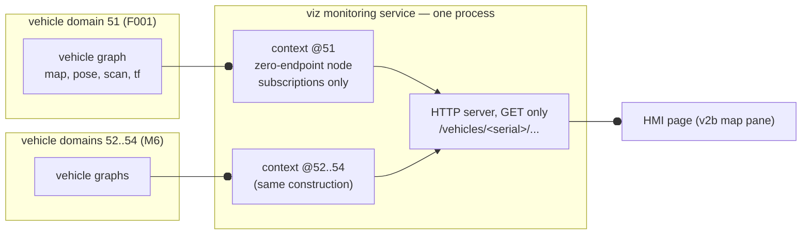

# viz — the read-only monitoring service: design (m5-13)

**Design document, not code.** The build follows in its own brief and must
show every acceptance check in §8. Authority order: ADR 0011 D4 and ADR 0016
D3(c) own the plane this service is; `docs/interfaces/opcua-nodes.md` and the
vehicle README contract own every name this document quotes; `hmi/V3-PLAN.md`
§2 supplied the five shaping constraints, carried in §9's table. This document
rules the two questions the m5-13 brief forbids deferring: the directory (§1)
and the enforcement of read-only (§2).

---

## 1. Ruling: the service lives in `viz/`, its own top-level layer

The ADR 0005 test — *a component that cannot live inside a layer without
weakening that layer's boundary is its own layer* — applied to `agv/`, the
recommended candidate:

**What the service is.** One operator-side process that holds a subscribe-only
presence in **every** vehicle's DDS domain at once and serves the operator
page over HTTP. It is not part of the vehicle image, it is not deployed to any
vehicle PC, and it reads n vehicles.

**What `agv/README.md`'s "This layer must not access" section would have to
become if it lived there.** `agv/` is the vehicle: ADR 0016 D1 makes its
boundary "one domain per vehicle, like a separate machine", and D2 makes its
software "one image, identity injected, no per-vehicle string compiled in".
Hosting the monitoring service inside `agv/` requires two carve-outs written
into that boundary statement:

1. *"No process in this layer sees more than its own vehicle's domain —
   **except the monitoring service**, which holds a context in every vehicle
   domain simultaneously"* — an exception to the exact machine boundary
   ADR 0016 just built, sitting in the directory whose job is to embody it.
2. *"The vehicle serves no operator-facing endpoint — **except the monitoring
   service's HTTP surface**"* — an operator-facing server inside the vehicle
   layer, which is not on any vehicle.

A boundary statement with two exceptions carved into it is weaker than one
without — the precise failure ADR 0005 made `bridge/` a layer to avoid, and
the same failure ADR 0011 D4 refused when it rejected ROS 2 subscribers in
`hmi/`. The test therefore selects **`viz/`**: a top-level layer owning
exactly the monitoring plane. The CLAUDE.md §3 topology already draws it as
its own box (`MON`), outside the Vehicle subgraph, with the two circle-ended
edges — so this ruling adds **no topology edge**; it gives the drawn box a
directory. `agv/README.md` needs no change: the vehicle layer still serves
nobody and sees only itself.

`viz/README.md` (first file of the build brief) opens with:

> ## This layer must not access
> - The PLC, OPC UA in any role, or the MQTT broker — this layer touches no
>   process-plane or fleet-plane transport (invariants 4, 11; ADR 0011 D4).
> - Any write into any vehicle domain: no publisher, no service server or
>   client, no action server or client, no parameter write. Its ROS presence
>   is subscriptions only, proven per §8 of DESIGN.md.
> - The safety layer, in any form. Nothing here displays-and-commands;
>   nothing here is a command path (invariant 1 untouched by construction).
> - `hmi/` internals. The HMI page reads this service over HTTP GET; this
>   service knows nothing of the HMI backend, its OPC UA client or its
>   write set.
> - Verdict-making on vehicle data: no localization-quality, obstacle-danger,
>   stop, mode or fault verdict is computed here (invariant 10, §6).

## 2. Ruling: read-only is **by construction of the process and proven by
test — not enforced by the middleware**, a recorded limitation

The judge's finding 6 is accepted as stated: nothing in DDS stops this
process from creating a publisher; "no publisher" is a property of source
that one edit flips. The two honest options, decided rather than deferred:

**Not adopted: SROS2 / DDS-Security enforcement.** Middleware-enforced
subscribe-only means running each vehicle domain with DDS-Security access
control **enforced**, which binds *every participant in the domain*: all ~20
vehicle-stack processes per vehicle (×4 at M6) would need keystore
identities, certificates and permissions files, plus a CA and a
key-distribution story this project deliberately does not have (invariant 13
keeps credentials out of the repo, and there is no provisioning
infrastructure to hold them elsewhere). The cost lands on the whole vehicle
stack in order to constrain one operator-side process, and a
half-configuration (governance allowing unauthenticated participants) makes
the restriction voluntary again — configuration, not construction, the exact
class finding 6 attacks. Disproportionate; rejected for now.

**Adopted: the limitation recorded, the language downgraded, the construction
made as strong as source can be.** Everywhere the phrase appears — this
document, evidence files, the showcase narration — it reads:

> **read-only by construction of the process and proven by test; not
> enforced by the middleware.**

Never the unqualified "read-only by construction". What makes it construction
rather than habit, each checkable:

1. **One entity factory.** All rclpy entity creation lives in one module
   (`viz/monitor/subscribe_only.py`), whose public API can create
   subscriptions and nothing else. A grep for `create_publisher`,
   `create_service`, `create_client`, `ActionServer`, `ActionClient`,
   `set_parameters` over `viz/` hits only that module's forbidden-list
   comment. This is the m4-era allowlisted-write-helper pattern of `hmi/`,
   applied in the opposite direction.
2. **Zero-endpoint nodes, probe-verified on the installed Jazzy** (§4): each
   vehicle-domain node is constructed with `enable_rosout=False`,
   `start_parameter_services=False`, `enable_logger_service=False`, the
   parameter override `start_type_description_service=False`, and its one
   residual `/parameter_events` publisher destroyed at construction — after
   which the node reports **publishers 0, services 0** and still subscribes.
3. **The observable check in every evidence run**: from an operator shell in
   each vehicle's domain, `ros2 node info` on the monitor node shows
   subscribers > 0 and **publishers 0, service servers 0, service clients 0,
   action servers 0, action clients 0**. This is the check `hmi/V3-PLAN.md`
   already builds every v3 done-condition on.
4. **The HTTP face accepts GET only.** Any other method is answered 405 by
   the server core before any handler runs; no handler reads a request body.
   Opening or closing a stream changes operator-side subscription state only.

**What would remove the limitation** (recorded, not scheduled): DDS-Security
per vehicle domain with enforced access control, a permissions grant
confining the monitoring participant to subscribe on the named topic set,
and credentials for every vehicle-domain participant. If a later gate wants
it, it layers on top of this design without changing any interface in §5.

## 3. Ruling input for ADR 0016 D3(c): one multi-context process; `domain_bridge` rejected

**Chosen mechanism.** One Python process. For each serial in the allocation
table it creates one rclpy `Context` initialised with that vehicle's
`domain_id`, one zero-endpoint node in that context, and one executor
thread. Subscriptions per vehicle: `/map` (durability `transient_local` — the
map is latched and must arrive on join), the localization pose, the
navigation-lidar scan, and `/tf` + `/tf_static` (to place the scan, §6) —
exact topic names from the vehicle README contract, not restated here. The
process holds **no presence in the operator domain**: its operator face is
HTTP. Operator domain 10 stays what `allocation.yaml` says it is — a home
for hand-run tools — and is untouched.

**`domain_bridge` — the rejected alternative, with its reason.** It is a
**new dependency** (CLAUDE.md §10: proposed-and-waiting, never adopted in a
brief), and its shape is wrong for the load that is coming: it forwards an
explicitly named, fixed topic set from domain to domain (ADR 0016 F4), so
every added camera is config churn, and heavyweight image topics would be
forwarded full-time whether any view is open or not — `hmi/V3-PLAN.md` §2
item 4 found exactly this. It also *republishes* into the operator domain,
i.e. its whole mechanism is publishers, and camera selection could not be
subscription lifecycle (§7). The multi-context process creates and destroys
camera subscriptions on demand and adds no dependency. Both probe results
(§4) confirm the chosen mechanism works in-process on this machine's stack.

**Not middleware-blessed but middleware-supported:** multiple contexts with
per-context `domain_id` is public rclpy API; the probe is the evidence it
behaves on the installed Jazzy.

## 4. What was run (cheap probes, this machine's WSL Jazzy, 2026-08-06)

Scratch domains 71/72 (outside the vehicle band 51–54 and operator 10); no
Gazebo, so no `GZ_PARTITION` concern. Probe scripts in the session
scratchpad; results quoted as printed:

1. **Multi-context isolation** (`probe_multictx.py`): one process, four
   contexts across two domains, a talker and a monitor in each.
   `A: isolation PASS: cross-domain leak=False` — each monitor received only
   its own domain's message. Runtime subscription create/destroy:
   `C: create/destroy subscription at runtime: 2 -> 1 (PASS)`.
2. **Zero-endpoint node** (`probe_zero.py`): with the §2.2 switches, a Jazzy
   node still carries `/parameter_events` (1 publisher) —
   `start_type_description_service=False` removes the service, and
   `destroy_publisher` removes the publisher:
   `after destroy: publishers=0 services=0`, then
   `subscription still creatable: True`.

The `/parameter_events` residue is why §2.2 names an explicit destroy: the
constructor flags alone do **not** reach zero on Jazzy, and a build that
skipped the destroy would fail §8's check.

## 5. The operator-side interface — concrete enough to brief HMI v2b

One HTTP server (Python stdlib, threaded — the `hmi_server.py` pattern; no
new dependency), its own port, distinct from the HMI backend's, localhost.
Every path is rooted in the vehicle's VDA 5050 **serialNumber**, at n = 1 as
at n = 4. The vehicle list and each serial's domain come only from the
allocation table through the existing single code path
(`vehicle_identity.load_allocation`); when that table moves sim-side
(ADR 0016 preamble), the import path moves with it and nothing else changes.

| Endpoint (all GET; anything else 405) | Payload | Cadence |
|---|---|---|
| `/vehicles` | JSON: serials served, service meta | on load |
| `/vehicles/<serial>/state` | JSON, values only: pose `{x_m, y_m, yaw_rad, frame: "map"}`; obstacle points (§6) as a coordinate list; per-datum ages in ms (§6); `map_version` (integer, bumps per received `/map` message); map meta `{resolution_m, origin, width, height}` | page-polled, the page's existing cadence class (~5 Hz); **never carries a raster** |
| `/vehicles/<serial>/map` | the **whole** occupancy grid, full extent, never a crop: raw int8 cells, `Content-Type: application/octet-stream`, gzip; `map_version` echoed in a header. The page paints it into a canvas from the meta — rendering, not derivation | refetched only when `map_version` changes |
| `/vehicles/<serial>/cameras` | JSON: available camera streams (empty until V3-4 adds a camera to the model) | v3 |
| `/vehicles/<serial>/cameras/<id>/stream` | multipart image stream; **opening creates the DDS subscription, closing destroys it** (§7) | v3 |

The map is served as raw cells rather than PNG so no image library enters
the project (a PNG encoder would be a dependency or hand-rolled code for no
gain; the page's canvas needs the cells anyway). A scan is ~910 ranges —
values, not bulk pixels; it rides the JSON poll. Rasters (map now, camera
frames at v3) each get their own endpoint per kind.

Circle-ended edges are the CLAUDE.md §3 monitoring plane, unchanged: the
multi-domain reach is n instances of the one drawn `NAV --o MON` edge, and
the page edge is the drawn `MON --o HMI` edge. No new topology edge is
implied.

## 6. Content: what is forwarded, what is forbidden to derive (invariant 10)

**Forwarded, each with its single owner:** the map (the vehicle's map
server); the pose (the vehicle's localization, as published); the obstacles
(the navigation-lidar scan, as published); each datum's arrival age (this
service's own bookkeeping — the only values it may originate, because they
watch only itself). Obstacle points are served **in the map frame**,
composed using the vehicle's **own published TF** — a frame change of a
vehicle-owned datum through the vehicle's own transform, not a new datum;
the page never transforms and never fuses.

**Forbidden to derive, here and on the page:** any localization-quality
verdict; any obstacle classification; any stop, mode, fault or
"vehicle alive" verdict (mode and latches are the PLC's, read on the process
plane by the HMI backend; liveness verdicts are `opcua-nodes.md` §12.6's);
any fusion of monitoring-plane pose with PLC state; any safety statement of
any kind.

**Scope statement, made explicitly rather than accreted:** v2b content is
**map + pose + obstacles**, ADR 0011 D4's named set, exactly. The widening
to Nav2 path, goal state and gate-report display (`hmi/V3-PLAN.md` §4 note)
is admissible under this same construction — more subscriptions, zero new
endpoint classes — but is **not adopted here**; it is the owner's call at
the V3-3 brief.

**Staleness clocks (LESSONS 2026-08-06 #99):** every age is computed from
the service's **steady clock** at message arrival. The service never runs a
timeout on `/clock` or on message-carried stamps: the sim clock arrives over
the same graph being monitored, and a watchdog must not run on a clock
supplied by the thing it watches. A stalled vehicle renders as a growing
age, never as last-value-as-live.

## 7. Camera readiness — designed now, built at v3

The per-context node's subscription set is managed by one operator-side
**subscription manager**, keyed `(serial, topic)` with a viewer refcount:
first open of `/vehicles/<serial>/cameras/<id>/stream` creates the DDS
subscription in that vehicle's context; last close destroys it. Selection is
therefore **subscription lifecycle only** — no service call, no parameter
write, no publisher, no vehicle-side toggle of any kind; nothing enters a
vehicle domain when a view opens or closes, which also means the mechanism
is indifferent to whatever enforcement ruling ever supersedes §2. The map
and pose subscriptions are simply permanent entries in the same manager.
Camera frame encoding for the browser is V3-5's question, not this one; if
it needs more than stdlib, that is a proposed dependency then.

## 8. Acceptance checks the build brief must show

1. Per vehicle domain, from an operator shell in that domain:
   `ros2 node info` on the monitor node — subscribers > 0; **publishers 0,
   service servers 0, service clients 0, action servers 0, action
   clients 0** (daemon restarted first, LESSONS 2026-08-05 #117).
2. Grep of `viz/` per §2.1: entity-creating calls only in
   `subscribe_only.py`.
3. HTTP: POST/PUT/DELETE to every endpoint answered 405; GETs answer with
   the §5 payloads; `/state` response carries no raster field.
4. With the vehicle stack stopped mid-run: ages grow on the page's data, no
   value keeps its live look, the service neither exits nor logs errors at
   more than a bounded rate.
5. Map integrity: bytes served equal the last received grid; `map_version`
   bumps exactly once per received map message.
6. Everywhere the read-only phrase appears, it appears in the §2 downgraded
   form — grep for the unqualified phrase comes back empty in `viz/`.

## 9. The five V3-PLAN §2 constraints — where each one is, in the design

| # | Constraint | Where it appears |
|---|---|---|
| 1 | serialNumber-rooted per-vehicle namespace at n = 1 | §5: every endpoint rooted `/vehicles/<serial>/…`, serials from the allocation table via the one code path; the n = 1 page already speaks the n = 4 surface |
| 2 | the whole map, not a crop | §5 map row: full extent served, "never a crop" stated in the contract; the page pans/zooms client-side |
| 3 | no bulk pixels on the JSON poll | §5: `/state` is values-only by contract and §8.3 checks it; every raster is its own endpoint per kind (map now, camera streams at v3) |
| 4 | D3c mechanism chosen knowing camera load | §3: multi-context process chosen, `domain_bridge` rejected precisely on fixed-set full-time forwarding of image topics |
| 5 | camera selection as subscription lifecycle only | §7: stream open/close maps to create/destroy of an operator-side DDS subscription via the refcounted manager; no message of any kind enters a vehicle domain |

## 10. What this design does not decide

Port number and bind address (build brief); exact topic names (the vehicle
README contract owns them); the page's rendering of the map pane (HMI v2b's
design, briefed from §5); the v3 content widening (owner, V3-3); camera
anything beyond §7's lifecycle shape (V3-4/V3-5); any future SROS2 adoption
(§2, recorded). Dependencies added by this design: **none** — stdlib HTTP,
existing rclpy, the existing PyYAML/identity code path.
